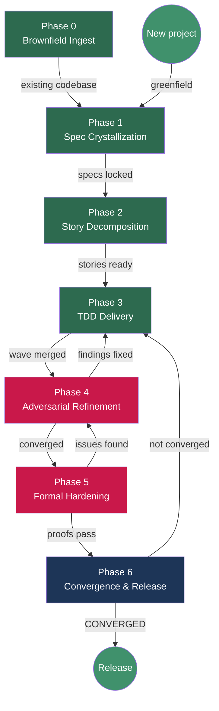

# vsdd-factory

**Verified Spec-Driven Development (VSDD) -- a dark factory for software, packaged as a Claude Code plugin.**

[](LICENSE)
[](CHANGELOG.md)

---

## What is VSDD?

Verified Spec-Driven Development is a software engineering methodology that fuses three
proven paradigms into a single AI-orchestrated pipeline:

- **Spec-Driven Development (SDD):** Define the contract before writing implementation.
  Behavioral contracts, verification properties, and domain models are the product -- code
  is the disposable artifact that implements them.
- **Test-Driven Development (TDD):** Tests are written before code. Red, Green, Refactor.
  No implementation code exists until a failing test demands it.
- **Verification-Driven Development (VDD):** Subject all surviving artifacts to adversarial
  review until the reviewer is forced to hallucinate flaws. Convergence is measured
  quantitatively across five dimensions, not declared subjectively.

The methodology produces software with full traceability from product brief through domain
model, behavioral contracts, acceptance criteria, test cases, implementation, and formal
proofs. Every line of code can answer "why does this exist?" by tracing back to a spec
requirement.

The VSDD contract chain traces every artifact through four specification levels:

```
L1 Product Brief
  -> L2 Domain Spec Capability (CAP-NNN)
    -> L3 Behavioral Contract (BC-S.SS.NNN)
      -> Story Acceptance Criterion (AC-NNN)
        -> Test Case
          -> Implementation
            -> L4 Verification Property (VP-NNN)
              -> Formal Proof
```

Quality is not declared by the builder -- it is measured by five independent convergence
dimensions (spec, tests, implementation, verification, holdout), each gated by quantitative
thresholds. The pipeline terminates when further adversarial review produces only hallucinated
findings.

## What does this plugin do?

The vsdd-factory plugin installs the complete VSDD pipeline into any Claude Code session:

- **Brownfield ingestion** -- analyze existing codebases before rebuilding or extending them
- **Spec crystallization** -- guided creation of product briefs, domain specs, PRDs, behavioral contracts, and architecture docs
- **Story decomposition** -- break specs into dependency-ordered, wave-scheduled implementation stories
- **TDD delivery** -- implement stories through specialist subagents (test-writer, implementer, demo-recorder, PR manager) with enforced Red Gate discipline
- **Adversarial refinement** -- fresh-context review by a different model family, iterated until convergence
- **Holdout evaluation** -- hidden acceptance scenarios evaluated by an information-asymmetric agent
- **Formal hardening** -- Kani proofs, fuzz testing, mutation testing, security scanning
- **Convergence gating** -- quantitative five-dimensional convergence assessment
- **Release management** -- changelog generation, merge to main, tagging, GitHub release

## Quick start

### Install from the marketplace

```shell
/plugin marketplace add drbothen/vsdd-factory
/plugin install vsdd-factory@vsdd-factory
```

### Update to latest version

```shell
/plugin marketplace update drbothen/vsdd-factory
/plugin update vsdd-factory@vsdd-factory
```

### Start every session with

```
/vsdd-factory:factory-health          # verify .factory/ worktree is mounted
/vsdd-factory:setup-env               # verify toolchain (first time or after changes)
```

Then read `.factory/STATE.md` to understand where the pipeline left off.

### Local development mode

```bash
claude --plugin-dir ./plugins/vsdd-factory
```

## Pipeline at a glance



## What's inside

| Category | Count | Description |
|----------|-------|-------------|
| **Agents** | 34 | Specialist personas (adversary, implementer, test-writer, architect, etc.) |
| **Skills** | 96 | Phase workflows, cross-cutting operations, design/UX, market intelligence |
| **Commands** | 47 | Slash-command entry points (`/vsdd-factory:deliver-story`, `/vsdd-factory:factory-health`, etc.) |
| **Hooks** | 10 | Enforcement layer (protect VPs, Red Gate, brownfield discipline, etc.) |
| **Templates** | 108 | Output format definitions for every artifact type |
| **Workflows** | 15 | Lobster-as-data files defining phase and mode sequences |
| **Bin helpers** | 4 | Shell utilities (lobster-parse, research-cache, wave-state, multi-repo-scan) |
| **Rules** | 8 | Coding standards (Rust, Bash, git commits, spec format, etc.) |
| **Docs** | 5 | Methodology, factory protocol, convergence criteria, agent principles |

See [docs/guide/pipeline-overview.md](docs/guide/pipeline-overview.md) for the full phase map.

## Phase overview

| Phase | Entry command | Artifacts produced | Quality gate |
|-------|--------------|-------------------|-------------|
| **0 -- Brownfield Ingest** | `/vsdd-factory:brownfield-ingest <path>` | Per-pass analysis docs, synthesis, lessons | Extraction validation (behavioral + metric) |
| **1 -- Spec Crystallization** | `/vsdd-factory:create-brief`, `/vsdd-factory:create-domain-spec`, `/vsdd-factory:create-prd`, `/vsdd-factory:create-architecture` | Product brief, domain spec, PRD, BCs, VPs, architecture | Adversarial spec review (novelty decay) |
| **2 -- Story Decomposition** | `/vsdd-factory:decompose-stories` | Stories, epics, dependency graph, wave schedule, holdout scenarios | Human approval, adversary review |
| **3 -- TDD Delivery** | `/vsdd-factory:deliver-story STORY-NNN` | Implementation, tests, demo evidence, PRs | Wave gate (tests + adversarial + holdout) |
| **4 -- Adversarial Refinement** | `/vsdd-factory:adversarial-review implementation` | Finding reports, fix PRs | Novelty decay across 2+ passes |
| **5 -- Formal Hardening** | `/vsdd-factory:formal-verify`, `/vsdd-factory:perf-check` | Proof reports, fuzz results, mutation scores | All proofs pass, kill rate thresholds met |
| **6 -- Convergence** | `/vsdd-factory:convergence-check`, `/vsdd-factory:release` | Convergence report, changelog, GitHub release | All 5 dimensions CONVERGED |

## Directory structure

```
plugins/vsdd-factory/
  .claude-plugin/
    plugin.json              # Plugin manifest (name, version, license)
  agents/
    orchestrator/            # Orchestrator + 9 mode-sequence sub-files
    adversary.md             # 34 specialist agent definitions
    implementer.md
    test-writer.md
    ...
  skills/
    brownfield-ingest/       # 91 skill directories, each with SKILL.md
    deliver-story/
    factory-health/
    ...
  commands/                  # 47 slash-command wrappers
  hooks/
    hooks.json               # Hook wiring (PreToolUse, PostToolUse, SubagentStop, Stop)
    protect-vp.sh            # 10 enforcement hooks
    red-gate.sh
    ...
  bin/                       # 4 shell utilities
  workflows/                 # 15 Lobster workflow files (YAML-as-data)
  templates/                 # 108 artifact output templates
  rules/                     # 8 coding/process standard files
  docs/                      # Methodology and protocol docs
  tests/                     # bats test suites (62 tests)
  fixtures/                  # Test fixtures (smoke-project)
```

## Development

### Prerequisites

- [bats-core](https://github.com/bats-core/bats-core) for running tests
- `jq` and `yq` for JSON/YAML processing
- `bash` 4+ with `set -euo pipefail` support

### Running tests

```bash
# All tests (80 across 4 suites)
bats plugins/vsdd-factory/tests/*.bats

# Individual suites
bats plugins/vsdd-factory/tests/hooks.bats              # 28 hook enforcement tests
bats plugins/vsdd-factory/tests/skills.bats              # 21 structural tests (Iron Laws, Red Flags, templates)
bats plugins/vsdd-factory/tests/bin.bats                 # 13 bin helper tests
bats plugins/vsdd-factory/tests/visual-companion.bats    # 18 visual companion server tests
```

### Syntax checking

```bash
for f in plugins/vsdd-factory/hooks/*.sh plugins/vsdd-factory/bin/*; do
  bash -n "$f"
done
```

### CI

GitHub Actions runs on every push and PR to main. The workflow installs tools, syntax-checks
all shell scripts, runs all three bats test suites, validates JSON manifests, and parses
every Lobster workflow file. See `.github/workflows/plugin-validation.yml`.

## Documentation

| Guide | Description |
|-------|-------------|
| [Getting Started](docs/guide/getting-started.md) | Installation, first session, first project |
| [Pipeline Overview](docs/guide/pipeline-overview.md) | Full phase map with Mermaid diagrams |
| [Configuration](docs/guide/configuration.md) | Factory directory layout, STATE.md, hooks, templates |
| [Troubleshooting](docs/guide/troubleshooting.md) | Common issues and fixes |
| [Visual Companion](docs/guide/visual-companion.md) | Browser-based mockups, excalidraw diagrams, interactive design |
| [Glossary](docs/guide/glossary.md) | VSDD terminology reference |

### Internal reference docs (in the plugin)

| Doc | Description |
|-----|-------------|
| [VSDD.md](plugins/vsdd-factory/docs/VSDD.md) | The full VSDD methodology |
| [FACTORY.md](plugins/vsdd-factory/docs/FACTORY.md) | Factory protocol and operating rules |
| [AGENT-SOUL.md](plugins/vsdd-factory/docs/AGENT-SOUL.md) | Principles governing all agents |
| [CONVERGENCE.md](plugins/vsdd-factory/docs/CONVERGENCE.md) | Quantitative convergence criteria |

## License

[MIT](LICENSE)

## Contributing

Contributions are welcome. Before submitting a PR:

1. **Read the Iron Laws.** The four discipline skills (`deliver-story`, `brownfield-ingest`,
   `adversarial-review`, `wave-gate`) each have an Iron Law and a Red Flags table. These
   are empirically anchored -- do not weaken them without eval evidence.

2. **Run the test suite.** All 62 bats tests must pass. New skills need structural tests
   for any Iron Laws, Red Flags, or template references they introduce.

3. **Use portable template paths.** Reference templates as
   `${CLAUDE_PLUGIN_ROOT}/templates/<name>.md`, never `.claude/templates/`. This is
   enforced by regression tests.

4. **Follow conventional commits.** `feat(scope): description`, `fix(scope): description`.
   No AI attribution in commit messages.
