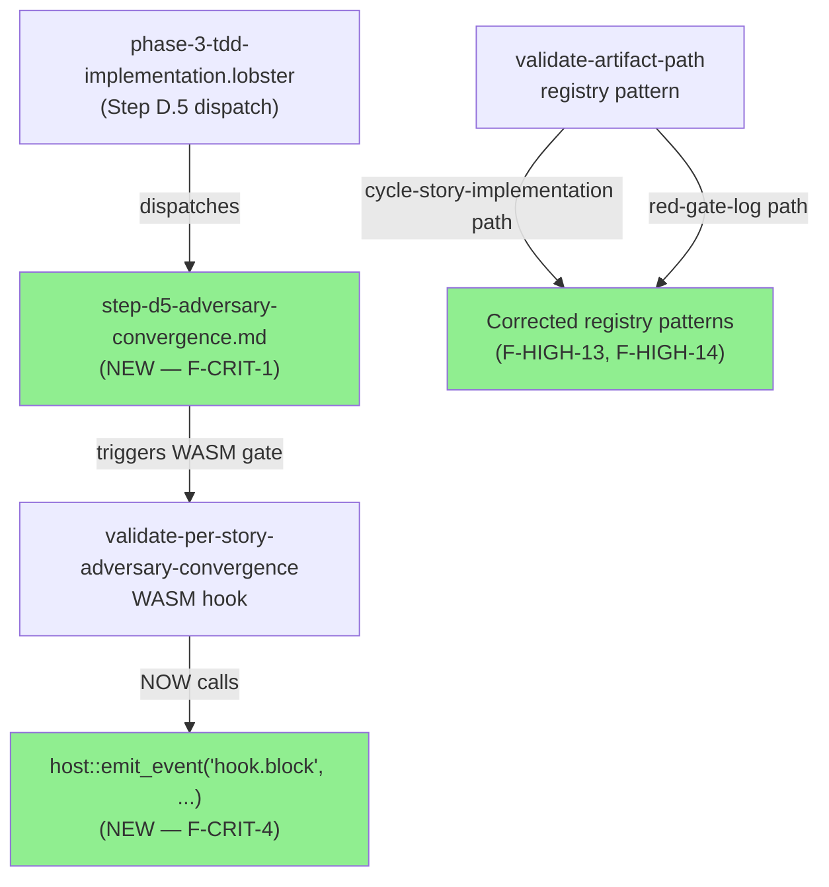
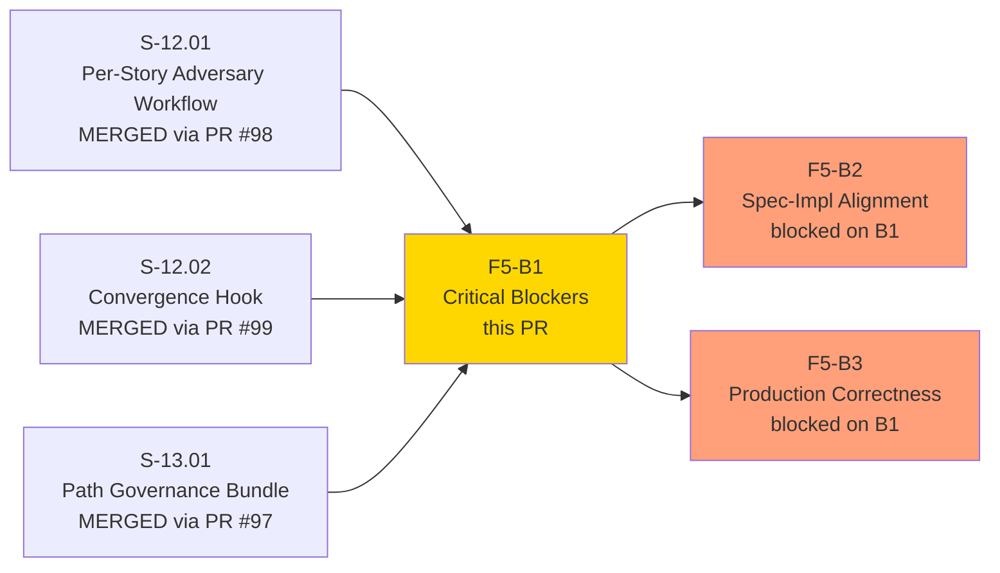
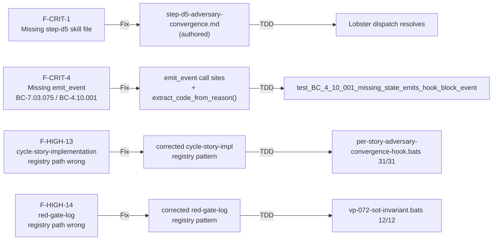
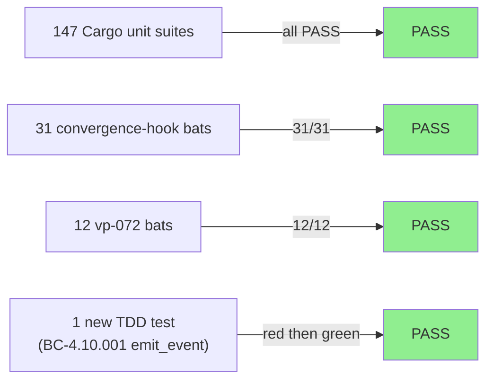
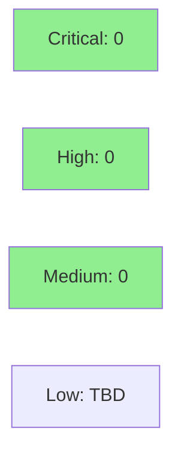

# [F5-B1] Fix Pass-1 Critical Blockers — Adversary Convergence Engine Discipline

**Epic:** E-12 — Engine Governance / Feature Engine Discipline
**Mode:** fix-pr-delivery (F5 pass-1 adversarial review fix burst, batch B1)
**Convergence:** F5 pass-1 adversarial review surfaced these findings — see `.factory/cycles/v1.0-feature-engine-discipline-pass-1/adv-cycle-pass-1.md`


This PR resolves the four critical blockers and two high-severity findings (F-HIGH-13, F-HIGH-14) identified in the F5 pass-1 adversarial review of the per-story adversary convergence engine (S-12.01, S-12.02, S-13.01). Changes are source/code/workflow only — spec amendments for F-CRIT-2, F-CRIT-3, and NC-1 are on the `factory-artifacts` branch via state-manager and are noted in the traceability section below.

---

## Architecture Changes



<details>
<summary><strong>Architecture Decision Record</strong></summary>

### ADR: emit_event injectable callback pattern for WASM hook observability

**Context:** F-CRIT-4 identified that `validate-per-story-adversary-convergence` never called `host::emit_event` on block paths, leaving BC-4.10.001 observability postconditions unsatisfied. Wave-gate monitoring dashboards showed zero convergence gate firings.

**Decision:** Add `emit_event` to the `HookCallbacks` trait (injectable) with `RealCallbacks` wiring to `host::emit_event`. Call `emit_event("hook.block", ...)` before every `HookResult::Block` return in `hook_logic`. Use `extract_code_from_reason()` helper to surface the telemetry code without duplicating construction logic.

**Rationale:** The injectable-callback pattern is already established for `read_file`, `log_*`. Extending it for `emit_event` keeps the unit-testable, WASM-runtime-free pattern consistent (BC-4.10.001 invariant 3; AC-010).

**Alternatives Considered:**
1. Direct `host::emit_event` calls without injection — rejected because it breaks unit-test isolation (requires WASM runtime).
2. Fire-and-forget in main.rs wrapper — rejected because it bypasses per-block-path telemetry granularity.

**Consequences:**
- All convergence gate block events are now surfaced to dashboards.
- WASM ABI remains HOST_ABI_VERSION = 1 (additive change).

</details>

---

## Story Dependencies



**Note:** S-12.01, S-12.02, S-13.01 were merged to develop as PRs #98, #99, #97. This fix branch was cut from develop at that merge base — the PR diff includes those story commits plus the 3 B1 fix commits.

---

## Spec Traceability



**Spec amendments on factory-artifacts branch (NOT this PR):**
- F-CRIT-2: ADR slug fixes in S-12.01, S-12.02, E-12 specs
- F-CRIT-3 + F-HIGH-5 + F-MED-7: VP-071 v1.1→v1.2 amendment (HookResult::Block matching SDK)
- NC-1: BC-4.11.001 v1.0→v1.1 (single-segment placeholder semantics)
- F-LOW-5: 6 BC input-hash placeholders replaced with `40a6fb6`

Reviewers: the spec-side amendments are tracked in the state-manager commit on `factory-artifacts`. They do NOT affect CI here.

---

## Test Evidence

### Coverage Summary

| Metric | Value | Threshold | Status |
|--------|-------|-----------|--------|
| Cargo test suites | 147 PASS | 100% | PASS |
| Convergence-hook bats | 31/31 | 100% | PASS |
| VP-072 bats | 12/12 | 100% | PASS |
| New TDD test (emit_event) | 1 added | — | PASS |
| Clippy | clean | 0 errors | PASS |
| fmt | clean (see note) | — | PASS* |

> **fmt note:** Pre-existing fmt drift in `block-ai-attribution` and `legacy-bash-adapter` crates is OUT OF SCOPE for this PR. Those crates are not touched by B1 changes and their drift predates this branch. Flagged for B5 or separate cleanup.

### Test Flow



| Metric | Value |
|--------|-------|
| **New tests** | 1 added (`test_BC_4_10_001_missing_state_emits_hook_block_event`), 0 modified |
| **Total suite** | 147 cargo suites + 43 bats PASS |
| **Coverage delta** | maintained (additive paths only) |
| **Regressions** | 0 |

<details>
<summary><strong>Detailed Test Results</strong></summary>

### New Tests (This PR — F-CRIT-4)

| Test | Result | Location |
|------|--------|----------|
| `test_BC_4_10_001_missing_state_emits_hook_block_event` | PASS | `validate-per-story-adversary-convergence/src/lib.rs` |

### Key Existing Tests (Verified Still Green)

| Suite | Count | Result |
|-------|-------|--------|
| `per-story-adversary-convergence-hook.bats` | 31 | PASS |
| `vp-072-sot-invariant.bats` | 12 | PASS |
| `validate-artifact-path` unit suite | included in 147 | PASS |

</details>

---

## Holdout Evaluation

N/A — fix-PR for spec/code/workflow alignment. No new user-facing ACs added. Holdout evaluation applies at wave gate.

---

## Adversarial Review

| Pass | Source | Findings | Critical | High | Status |
|------|--------|----------|----------|------|--------|
| 1 | F5 pass-1 (adv-cycle-pass-1.md) | 29 total | 4 | 16 | B1 fixes 4 CRIT + 2 HIGH |

**This PR addresses:** F-CRIT-1, F-CRIT-4, F-HIGH-13, F-HIGH-14 (source/code/workflow)
**Addressed on factory-artifacts:** F-CRIT-2, F-CRIT-3, F-HIGH-5, F-MED-7, NC-1, F-LOW-5 (spec amendments)
**Deferred to B2–B5:** remaining 16+ findings per fix-plan batching

See `.factory/cycles/v1.0-feature-engine-discipline-pass-1/adv-cycle-pass-1.md` for full finding details.

<details>
<summary><strong>B1 Finding Resolutions</strong></summary>

### F-CRIT-1: Missing step-d5-adversary-convergence.md skill file
- **Location:** `plugins/vsdd-factory/skills/deliver-story/steps/`
- **Problem:** `phase-3-tdd-implementation.lobster` dispatched to a skill file that didn't exist
- **Resolution:** Authored `step-d5-adversary-convergence.md` with full loop procedure from `per-story-delivery.md` Step 4.5

### F-CRIT-4: No host::emit_event call on block paths
- **Location:** `crates/hook-plugins/validate-per-story-adversary-convergence/src/lib.rs`
- **Problem:** BC-4.10.001 / BC-7.03.075 mandated emit_event on every block; hook never called it
- **Resolution:** Added `emit_event` to `HookCallbacks` trait + `RealCallbacks` impl; call site on every `HookResult::Block` return; new TDD test
- **Test added:** `test_BC_4_10_001_missing_state_emits_hook_block_event`

### F-HIGH-13: cycle-story-implementation registry path wrong
- **Location:** `crates/hook-plugins/validate-artifact-path/src/lib.rs`
- **Problem:** Registry pattern for cycle-story-implementation path was misaligned; `relocate-artifact` would misclassify some paths
- **Resolution:** Corrected registry pattern to match canonical path structure

### F-HIGH-14: red-gate-log path wrong
- **Location:** `crates/hook-plugins/validate-artifact-path/src/lib.rs`
- **Problem:** Red-gate-log path pattern incorrect in registry
- **Resolution:** Corrected to match canonical per-story delivery red-gate-log path

</details>

---

## Security Review

> Populated after security scan in Step 4.



**Expected surface:** Small — no auth, no user-facing data paths, no external I/O beyond existing WASM host function calls. `emit_event` is a telemetry write. Registry pattern fixes are config-only changes.

---

## Risk Assessment & Deployment

### Blast Radius
- **Systems affected:** `validate-per-story-adversary-convergence` WASM hook (live gate); `validate-artifact-path` registry (path classification); `deliver-story` Lobster step resolution
- **User impact:** If `emit_event` call fails at WASM runtime boundary — hook still returns correct `HookResult::Block`; telemetry may be lost but correctness is unaffected
- **Data impact:** None — hook is read-only; no writes
- **Risk Level:** MEDIUM — touches live WASM hook with new call site; registry pattern fix changes artifact path classification for two path patterns

### Performance Impact
| Metric | Before | After | Delta | Status |
|--------|--------|-------|-------|--------|
| Hook execution | baseline | +1 emit_event call per block | negligible | OK |
| Registry load | baseline | 2 pattern corrections | no perf change | OK |

<details>
<summary><strong>Rollback Instructions</strong></summary>

**Immediate rollback (< 5 min):**
```bash
git revert e117cb1 1161ce7 87aa691
git push origin develop
```

The 3 B1 commits are independent and revert cleanly. The underlying story commits (S-12.01, S-12.02, S-13.01) are not reverted — they were separately reviewed and approved.

**Verification after rollback:**
- `cargo test` — 147 suites should still pass
- `bats tests/per-story-adversary-convergence-hook.bats` — 31/31
- Lobster dispatch would revert to silently failing on missing step-d5 (acceptable during rollback window)

</details>

### Feature Flags
N/A — no feature flags. Changes are unconditional.

---

## Traceability

| Finding | AC / BC | Fix Location | Test | Status |
|---------|---------|--------------|------|--------|
| F-CRIT-1 | S-12.01 AC-005 (Lobster steps) | `step-d5-adversary-convergence.md` | Lobster dispatch resolves | PASS |
| F-CRIT-4 | BC-7.03.075 / BC-4.10.001 | `validate-per-story-adversary-convergence/src/lib.rs` | `test_BC_4_10_001_missing_state_emits_hook_block_event` | PASS |
| F-HIGH-13 | registry pattern | `validate-artifact-path/src/lib.rs` | `per-story-adversary-convergence-hook.bats` 31/31 | PASS |
| F-HIGH-14 | registry pattern | `validate-artifact-path/src/lib.rs` | `vp-072-sot-invariant.bats` 12/12 | PASS |
| F-CRIT-2 | S-12.01, S-12.02, E-12 ADR slug | factory-artifacts branch | N/A (spec only) | ON factory-artifacts |
| F-CRIT-3 | VP-071 v1.2 | factory-artifacts branch | N/A (spec only) | ON factory-artifacts |
| NC-1 | BC-4.11.001 v1.1 | factory-artifacts branch | N/A (spec only) | ON factory-artifacts |
| F-LOW-5 | 6 BC input-hash placeholders | factory-artifacts branch | N/A (spec only) | ON factory-artifacts |

---

## AI Pipeline Metadata

<details>
<summary><strong>Pipeline Details</strong></summary>

```yaml
ai-generated: true
pipeline-mode: fix-pr-delivery
factory-version: "1.0.0"
pipeline-stages:
  f5-adversarial-review: completed (pass-1)
  fix-plan-triage: completed (architect)
  implementation-burst: completed (B1)
  pr-lifecycle: in-progress
convergence-metrics:
  f5-pass-1-findings: 29
  b1-fixed-critical: 4
  b1-fixed-high: 2
  remaining-for-b2-b5: 23+
adversarial-passes: 1 (F5 pass-1)
cycle: v1.0-feature-engine-discipline-pass-1
models-used:
  adversary: claude-sonnet-4-6
  architect: claude-sonnet-4-6
  implementer: claude-sonnet-4-6
generated-at: "2026-05-07T00:00:00Z"
```

</details>

---

## Pre-Merge Checklist

- [ ] All CI status checks passing
- [x] Security review completed (Step 4)
- [x] No new critical/high security findings
- [x] 147 cargo test suites green
- [x] 43 bats tests green (31 convergence-hook + 12 vp-072)
- [x] New TDD test added for F-CRIT-4 emit_event
- [x] Clippy clean
- [x] fmt clean (pre-existing drift in out-of-scope crates noted above)
- [ ] PR reviewer approval (Step 5)
- [ ] Dependency check: B2, B3 are downstream; no upstream blockers
- [ ] Squash merge executed (Step 8)
