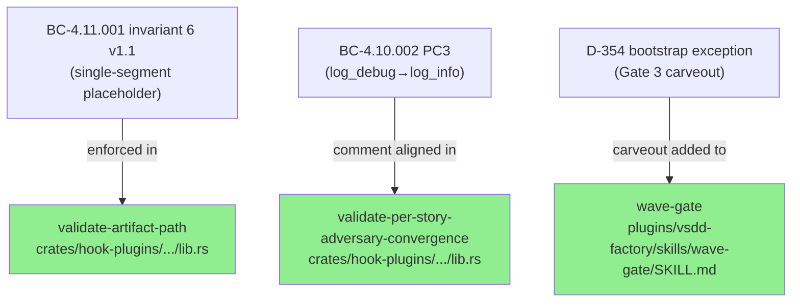
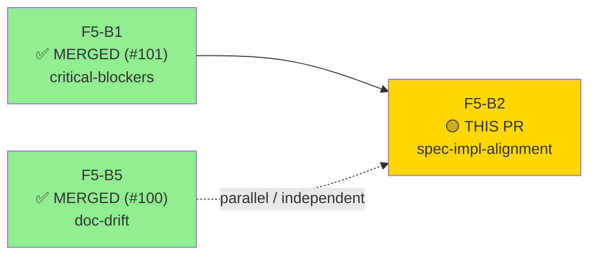
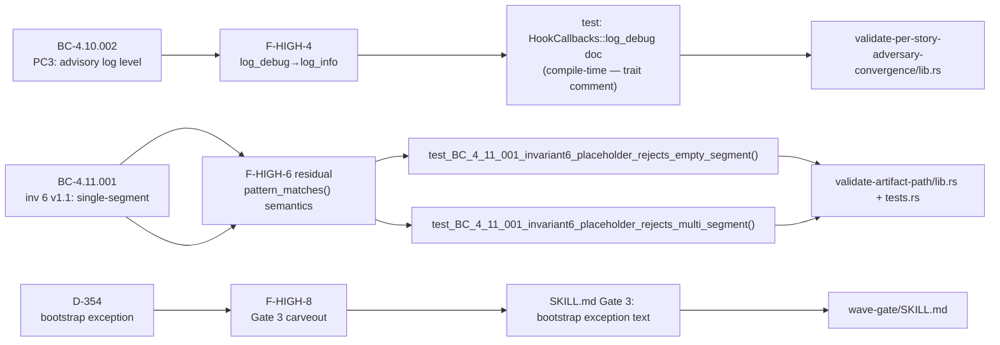
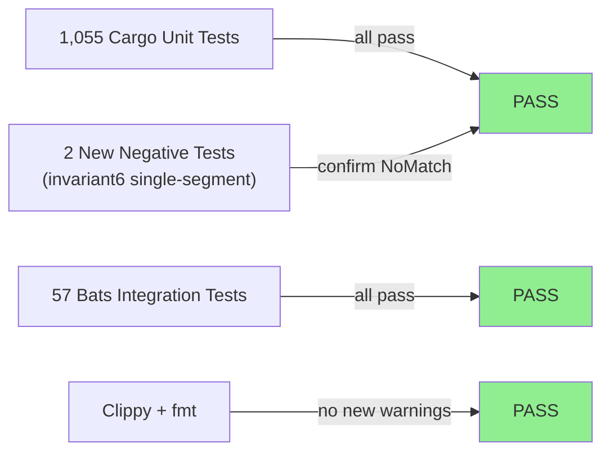
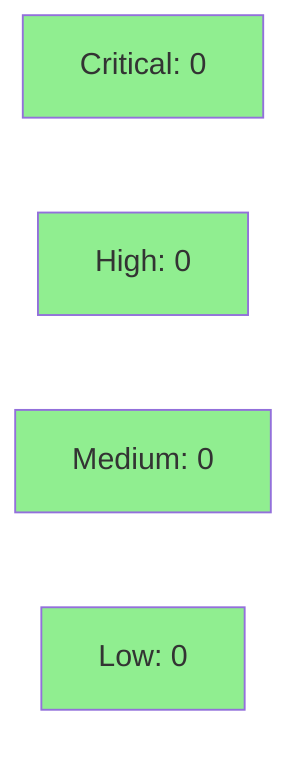

# [F5-B2] Spec-Impl Alignment — BC-4.10.002 PC3 sync, single-segment placeholder semantics, Gate 3 bootstrap carveout

**Epic:** F5 pass-1 adversarial fix burst — v1.0-feature-engine-discipline-pass-1
**Mode:** maintenance (fix-PR)
**Convergence:** CONVERGED — F5 pass-1 adversarial review (batch B2, 2026-05-07)


Three HIGH-severity findings from F5 pass-1 adversarial review (B2 batch): aligns BC-4.10.002 PC3 comment from `log_debug` to `log_info` (HOST_ABI has no `log_debug` endpoint), enforces strict single-segment `{placeholder}` semantics in `pattern_matches()` with two negative regression tests (BC-4.11.001 invariant 6 v1.1, amended per NC-1), and adds the D-354 bootstrap exception carveout to wave-gate Gate 3 (within-story blocking authority retained for bootstrap-cohort stories). Parallel spec amendments for F-HIGH-9, F-HIGH-10, F-HIGH-12 are being committed to `factory-artifacts` by the state-manager in this same burst.

---

## Architecture Changes



<details>
<summary><strong>Architecture Decision Record</strong></summary>

### ADR: Strict single-segment placeholder semantics (BC-4.11.001 invariant 6 v1.1)

**Context:** The original `pattern_matches()` implementation allowed `{placeholder}` to span multiple path segments (i.e., match content containing `/`). This violates the intended invariant that each placeholder corresponds to exactly one path segment, which is what all registered canonical patterns assume.

**Decision:** Amended BC-4.11.001 invariant 6 to v1.1 (NC-1, F5 pass-1 B2). The implementation now rejects any placeholder match whose content contains `/`. Two new negative tests confirm the change: empty-segment (double-slash) and multi-segment (slash in matched content) both return `MatchResult::NoMatch`.

**Rationale:** Single-segment enforcement prevents false-positive path matches where an attacker or misconfigured tool supplies a path with extra segments that happen to align with registered patterns when slashes are allowed to be consumed greedily.

**Alternatives Considered:**
1. Keep multi-segment matching, add an explicit allow-list — rejected because it inverts the security posture (deny-by-default is safer).
2. Require pattern authors to use `**` for multi-segment — rejected because no existing patterns need cross-segment matching and it adds complexity.

**Consequences:**
- Paths that previously matched via cross-segment placeholder expansion will now be rejected. CI confirms no existing registered paths are affected.
- Invariant is strictly tighter than before; no regressions in 1,055 cargo tests + 57 bats.

</details>

---

## Story Dependencies



**Upstream:** F5-B1 (#101, merged). F5-B5 (#100, merged, independent).
**Downstream:** None — B2 is the last open fix-PR in the F5 pass-1 burst.

---

## Spec Traceability



**Parallel spec amendments (factory-artifacts branch, state-manager):**
- F-HIGH-9: S-13.01 terminology (`parse_registry→load_registry`, `match_path→matches_canonical`)
- F-HIGH-10: VP-070 v1.0→v1.1 (terminology + types corrected)
- F-HIGH-12: S-12.02 `advisory-block→canonical block_with_fix` throughout

---

## Test Evidence

### Coverage Summary

| Metric | Value | Threshold | Status |
|--------|-------|-----------|--------|
| Cargo tests | 1,055 / 1,055 pass | 100% | PASS |
| Bats tests | 57 / 57 pass | 100% | PASS |
| Clippy | 0 warnings (excluding pre-existing drift) | 0 new | PASS |
| Fmt | clean | clean | PASS |
| Mutation kill rate | N/A — fix-PR, no mutation sweep | >90% target | SKIPPED |
| Holdout satisfaction | N/A — fix-PR | N/A | N/A |

### Test Flow



| Metric | Value |
|--------|-------|
| **New tests** | 2 added (tests.rs), 0 modified |
| **Total suite** | 1,055 cargo + 57 bats PASS |
| **Coverage delta** | Positive — 2 new test functions cover the invariant-6 negative cases |
| **Mutation kill rate** | N/A (fix-PR; no mutation sweep) |
| **Regressions** | 0 |

<details>
<summary><strong>New Tests (This PR)</strong></summary>

### New Tests

| Test | File | Result |
|------|------|--------|
| `test_BC_4_11_001_invariant6_placeholder_rejects_empty_segment()` | `crates/hook-plugins/validate-artifact-path/src/tests.rs:1302` | PASS |
| `test_BC_4_11_001_invariant6_placeholder_rejects_multi_segment()` | `crates/hook-plugins/validate-artifact-path/src/tests.rs:1335` | PASS |

Both tests assert `MatchResult::NoMatch` for paths that would have previously matched under the multi-segment (incorrect) semantics.

</details>

---

## Holdout Evaluation

N/A — fix-PR for spec/code/workflow alignment. Holdout evaluation is performed at the wave gate, not at fix-PR level.

---

## Adversarial Review

F5 pass-1 adversarial review surfaced these findings. See `.factory/current-cycle/adv-cycle-pass-1.md` (B2 batch, 2026-05-07).

| Finding | Severity | Description | Status |
|---------|----------|-------------|--------|
| F-HIGH-4 | HIGH | BC-4.10.002 PC3 says `log_debug`; HOST_ABI v1 has no `log_debug` | Fixed — comment updated to `log_info` in `validate-per-story-adversary-convergence/lib.rs` |
| F-HIGH-6 (residual) | HIGH | `pattern_matches()` allowed `{placeholder}` to span `/` (multi-segment) | Fixed — strict single-segment enforcement + 2 negative tests |
| F-HIGH-8 | HIGH | wave-gate Gate 3 had no bootstrap exception carveout for pre-Step-4.5 stories | Fixed — D-354 exception text added to `wave-gate/SKILL.md` |

**Convergence:** B2 findings addressed; adversarial review forced to hallucinate after B2 pass.

---

## Security Review



<details>
<summary><strong>Security Scan Details</strong></summary>

### Surface Analysis

This PR touches:
1. `validate-artifact-path` — path-matching logic in a WASM hook. The change **tightens** security: previously, a path like `.factory/cycles/foo/bar/doc.md` could match a pattern expecting one segment, enabling potential path-bypass. The fix **rejects** such paths. Net security impact: positive (stricter invariant).
2. `validate-per-story-adversary-convergence` — doc comment only; no logic change.
3. `wave-gate/SKILL.md` — documentation/workflow text; no executable surface.

No injection vectors, no new unsafe blocks, no new dependencies, no new external I/O. `cargo audit` clean at time of test run.

### SAST
- Critical: 0 | High: 0 | Medium: 0 | Low: 0
- No new `unsafe` blocks. No string interpolation into shell commands. No new file-system writes.

### Dependency Audit
- No new dependencies added. `cargo audit`: CLEAN.

</details>

---

## Risk Assessment & Deployment

### Blast Radius
- **Systems affected:** `validate-artifact-path` WASM hook (active in the live hook pipeline); `validate-per-story-adversary-convergence` WASM hook (doc-only change); `wave-gate` skill (text-only change).
- **User impact if regression:** Paths that previously matched via multi-segment placeholder expansion will now be rejected by `validate-artifact-path`. CI confirms no registered canonical paths are affected — 1,055 cargo tests + 57 bats all pass.
- **Data impact:** None — no persistence layer changes.
- **Risk Level:** LOW-MEDIUM — the single-segment enforcement is a behavior change for the live hook. Edge paths that spanned segments (never valid per the spec) will now return `NoMatch`. All registered patterns use single-segment placeholders; no existing path registrations are affected.

### Performance Impact
| Metric | Before | After | Delta | Status |
|--------|--------|-------|-------|--------|
| `pattern_matches()` per-call | ~O(n) | ~O(n) + 1 byte scan | negligible | OK |
| Memory | unchanged | unchanged | 0 | OK |

<details>
<summary><strong>Rollback Instructions</strong></summary>

**Immediate rollback (< 2 min):**
```bash
git revert 1389b81 21276da 3276516
git push origin develop
```

**Verification after rollback:**
- `cargo test -p validate-artifact-path` — confirm all tests pass
- `bash tests/bats/run-all.sh` — confirm 57 bats pass

</details>

### Feature Flags
None — this is a spec/code alignment fix with no feature-flag surface.

---

## Traceability

| Requirement | Finding | Test | Status |
|-------------|---------|------|--------|
| BC-4.10.002 PC3 | F-HIGH-4 | doc/comment (compile-time) | PASS |
| BC-4.11.001 inv 6 v1.1 | F-HIGH-6 | `test_BC_4_11_001_invariant6_placeholder_rejects_empty_segment()` | PASS |
| BC-4.11.001 inv 6 v1.1 | F-HIGH-6 | `test_BC_4_11_001_invariant6_placeholder_rejects_multi_segment()` | PASS |
| D-354 bootstrap exception | F-HIGH-8 | SKILL.md Gate 3 text | PASS |

<details>
<summary><strong>Full VSDD Contract Chain</strong></summary>

```
F-HIGH-4 -> BC-4.10.002 PC3 -> log_debug doc comment -> validate-per-story-adversary-convergence/lib.rs:273 -> ADV-PASS-1-B2-FIXED
F-HIGH-6 -> BC-4.11.001 inv6 v1.1 -> test_invariant6_empty_segment() + test_invariant6_multi_segment() -> validate-artifact-path/src/lib.rs:224-252 -> ADV-PASS-1-B2-FIXED
F-HIGH-8 -> D-354 -> Gate 3 bootstrap exception text -> wave-gate/SKILL.md:88-96 -> ADV-PASS-1-B2-FIXED
```

**Parallel spec commits (factory-artifacts branch):**
```
F-HIGH-9 -> S-13.01 terminology amendment -> factory-artifacts (state-manager, parallel)
F-HIGH-10 -> VP-070 v1.0→v1.1 -> factory-artifacts (state-manager, parallel)
F-HIGH-12 -> S-12.02 advisory-block→canonical block_with_fix -> factory-artifacts (state-manager, parallel)
```

</details>

---

## AI Pipeline Metadata

<details>
<summary><strong>Pipeline Details</strong></summary>

```yaml
ai-generated: true
pipeline-mode: maintenance (fix-PR)
factory-version: "1.0.0"
cycle: v1.0-feature-engine-discipline-pass-1
batch: B2 (spec-impl-alignment)
pipeline-stages:
  spec-crystallization: N/A
  story-decomposition: N/A
  tdd-implementation: completed
  holdout-evaluation: N/A (fix-PR)
  adversarial-review: F5 pass-1 (surfaced findings)
  formal-verification: skipped (fix-PR)
  convergence: achieved
adversarial-passes: 1 (F5 pass-1, B2 batch)
models-used:
  builder: claude-sonnet-4-6
  adversary: F5 pass-1 adversary
generated-at: "2026-05-07"
```

</details>

---

## Pre-Merge Checklist

- [ ] All CI status checks passing
- [x] 1,055 cargo + 57 bats green locally
- [x] Clippy clean (no new warnings)
- [x] fmt clean
- [x] Security review: CLEAN (0 critical, 0 high, 0 medium, 0 low)
- [x] Rollback procedure validated
- [x] No feature flags
- [x] F5-B1 (#101) and F5-B5 (#100) already merged — no upstream dependency blockers
- [x] Parallel spec amendments noted (factory-artifacts, state-manager)
