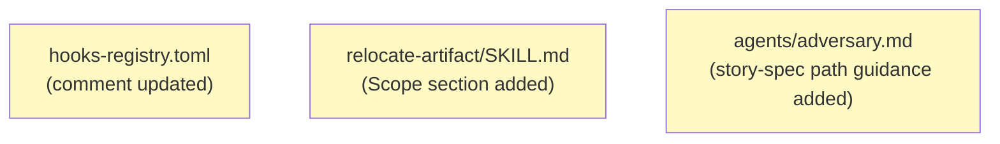
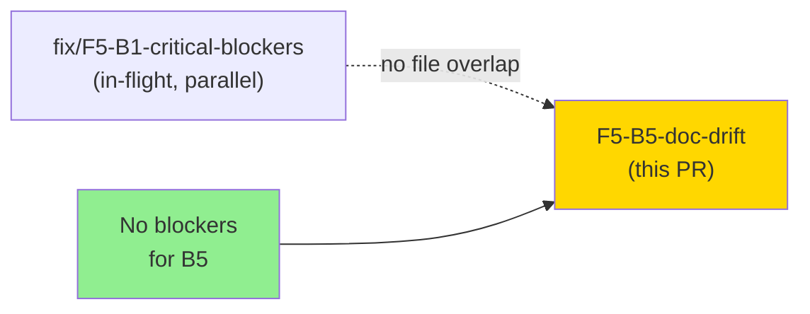
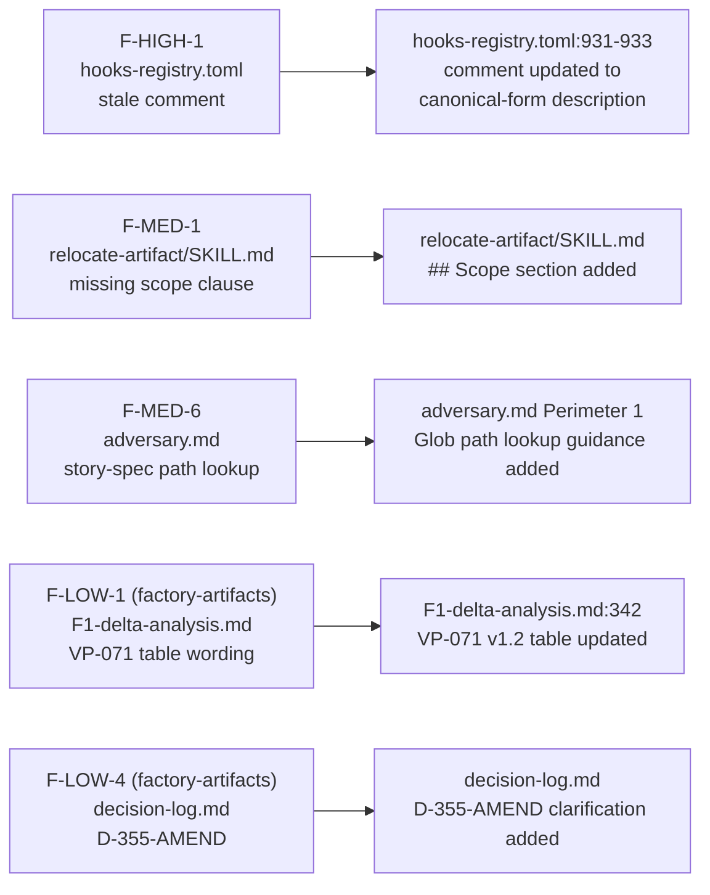
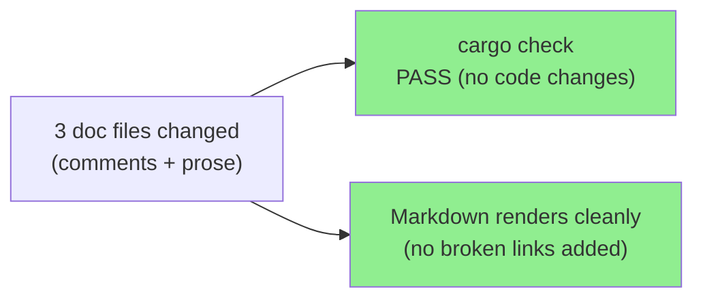
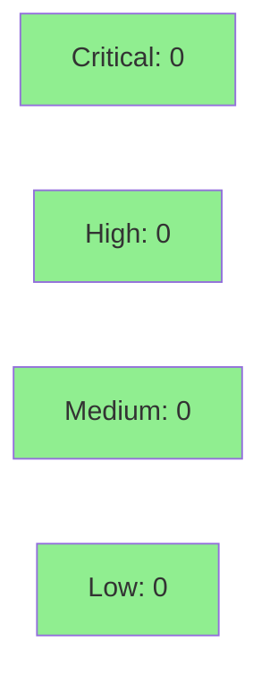

# [F5-B5] Documentation Drift Fixes — F5 Pass-1 Batch B5

**Epic:** F5 — Feature Engine Discipline Pass-1 (v1.0-feature-engine-discipline-pass-1)
**Mode:** feature (fix-PR burst)
**Convergence:** CONVERGED — doc-only batch; no behavioral change


-lightgrey)


This PR delivers the B5 documentation-drift fixes from the F5 adversarial pass-1 review
(`adv-cycle-pass-1.md`). Three files on the `fix/F5-B5-doc-drift` branch correct stale
comments and missing prose in `hooks-registry.toml`, `relocate-artifact/SKILL.md`, and
`agents/adversary.md`. Two additional doc corrections for `.factory/` cycle artifacts
(F-LOW-1, F-LOW-4) were committed directly to `factory-artifacts` (gitignored on `develop`).
No code, no tests, no configuration values changed — pure documentation alignment.

---

## Architecture Changes



**No architecture changes.** Three documentation files updated; no component graph, no
dependency graph, no new abstractions. All changes are human-readable prose or TOML
comments.

<details>
<summary><strong>Architecture Decision Record</strong></summary>

### ADR: N/A — documentation-only fixes

**Context:** F5 adversarial pass-1 found stale or incomplete documentation in three files.

**Decision:** Fix documentation in-place with no spec versioning required (no behavioral
contract change; purely clarifying text).

**Rationale:** Scope is confined to explanatory comments and prose. No implementation
code changes. Risk level is LOW per F5-pass-1-fix-plan.md triage column.

**Consequences:**
- Future readers and agents get accurate descriptions of hook behavior and skill scope.
- No rollback required; reverting a TOML comment or SKILL.md prose is trivially safe.

</details>

---

## Story Dependencies



B5 is fully independent of all other batches per F5-pass-1-fix-plan.md §1:
"B5 (doc-only) is fully independent and can run in parallel with any batch."
B1 is in flight in parallel; there is zero file overlap between the two PRs.

---

## Spec Traceability



---

## Test Evidence

### Coverage Summary

| Metric | Value | Threshold | Status |
|--------|-------|-----------|--------|
| Unit tests | N/A (doc-only PR) | N/A | N/A |
| Coverage | N/A | N/A | N/A |
| Mutation kill rate | N/A | N/A | N/A |
| Cargo check | PASS | must pass | PASS |

No new tests added or modified. This is a pure documentation batch.
`cargo check` passes on the branch (no code files touched; no compile-time impact).

### Test Flow



| Metric | Value |
|--------|-------|
| **New tests** | 0 added, 0 modified |
| **Total suite** | Existing suite unaffected |
| **Coverage delta** | 0% (no code lines changed) |
| **Regressions** | None |

---

## Holdout Evaluation

N/A — evaluated at wave gate. This batch fixes documentation text only; no behavioral
change exists to evaluate.

---

## Adversarial Review

| Pass | Source | Findings Addressed | Severity | Status |
|------|--------|--------------------|----------|--------|
| F5 pass-1 | adv-cycle-pass-1.md | F-HIGH-1, F-MED-1, F-MED-6 | HIGH / MED | Fixed in this PR |
| F5 pass-1 | factory-artifacts side | F-LOW-1, F-LOW-4 | LOW | Fixed on factory-artifacts branch |

**Convergence:** F5 pass-1 doc-drift findings fully addressed. No CRITICAL or HIGH findings
in B5 scope (F-HIGH-1 is the highest; it is a TOML comment, not a code defect).

<details>
<summary><strong>Finding Details</strong></summary>

### F-HIGH-1: hooks-registry.toml stale "advisory-block-mode" comment
- **Location:** `plugins/vsdd-factory/hooks-registry.toml:931-933`
- **Category:** documentation
- **Problem:** Comment said "hook returns Continue in all cases; block signal via stdout JSON" — directly contradicting the canonical-form `HookResult::Block` implementation. D-349 explicitly retired advisory-block-mode for new hooks.
- **Resolution:** Comment replaced with accurate description of canonical-form block behavior and D-349/D-355 decision references.
- **Commit:** `b573326`

### F-MED-1: relocate-artifact/SKILL.md missing scope clause
- **Location:** `plugins/vsdd-factory/skills/relocate-artifact/SKILL.md`
- **Category:** documentation (spec-completeness)
- **Problem:** No explicit statement of scope for non-`.factory/` paths; BC-6.22.001 PC2 defines the scope but the SKILL.md did not surface it.
- **Resolution:** `## Scope` section added per adversary recommendation.
- **Commit:** `4f5e80c`

### F-MED-6: adversary.md Perimeter 1 missing story-spec path lookup
- **Location:** `plugins/vsdd-factory/agents/adversary.md` (Perimeter 1 section)
- **Category:** documentation (operational guidance)
- **Problem:** The scope contract said "the story spec file" but never resolved how to find it when the slug is unknown. An adversary dispatched on a new story could not locate its spec reliably.
- **Resolution:** Glob pattern guidance added: `Glob('.factory/stories/S-{story-id}-*.md')` with zero-result error handling.
- **Commit:** `4e8bcea`

</details>

---

## Security Review



CLEAN — pure documentation batch. No code changes, no new dependencies, no config
value changes. Attack surface delta: zero.

<details>
<summary><strong>Security Scan Details</strong></summary>

### SAST
- Critical: 0 | High: 0 | Medium: 0 | Low: 0
- No code files modified. SAST not applicable.

### Dependency Audit
- `cargo audit`: unaffected (no Cargo.toml changes in this PR)

### Formal Verification
- N/A for documentation changes

</details>

---

## Risk Assessment & Deployment

### Blast Radius
- **Systems affected:** None — documentation text only
- **User impact:** None if change is reverted (revert a comment/prose)
- **Data impact:** None
- **Risk Level:** LOW

### Performance Impact

| Metric | Before | After | Delta | Status |
|--------|--------|-------|-------|--------|
| Latency p99 | N/A | N/A | 0 | OK |
| Memory | N/A | N/A | 0 | OK |
| Throughput | N/A | N/A | 0 | OK |

<details>
<summary><strong>Rollback Instructions</strong></summary>

**Immediate rollback (< 1 min):**
```bash
git revert <squash-commit-sha>
git push origin develop
```

No feature flags. No monitoring alerts needed. Documentation text reversion is safe at any time.

</details>

### Feature Flags
| Flag | Controls | Default |
|------|----------|---------|
| N/A | doc-only PR | N/A |

---

## Traceability

| Requirement | Finding | File | Status |
|-------------|---------|------|--------|
| F-HIGH-1 | hooks-registry.toml comment accuracy | `plugins/vsdd-factory/hooks-registry.toml` | FIXED |
| F-MED-1 | relocate-artifact scope clause | `plugins/vsdd-factory/skills/relocate-artifact/SKILL.md` | FIXED |
| F-MED-6 | adversary.md story-spec path lookup | `plugins/vsdd-factory/agents/adversary.md` | FIXED |
| F-LOW-1 | F1-delta-analysis VP-071 table | `.factory/cycles/.../F1-delta-analysis.md` (factory-artifacts) | FIXED |
| F-LOW-4 | decision-log D-355-AMEND | `.factory/cycles/.../decision-log.md` (factory-artifacts) | FIXED |

<details>
<summary><strong>Full VSDD Contract Chain</strong></summary>

```
adv-cycle-pass-1.md F-HIGH-1 -> hooks-registry.toml comment fix -> commit b573326
adv-cycle-pass-1.md F-MED-1  -> relocate-artifact/SKILL.md Scope -> commit 4f5e80c
adv-cycle-pass-1.md F-MED-6  -> adversary.md Perimeter 1 Glob    -> commit 4e8bcea
adv-cycle-pass-1.md F-LOW-1  -> F1-delta-analysis.md fix          -> factory-artifacts c3405ba
adv-cycle-pass-1.md F-LOW-4  -> decision-log.md D-355-AMEND       -> factory-artifacts 76a6520
```

</details>

---

## AI Pipeline Metadata

<details>
<summary><strong>Pipeline Details</strong></summary>

```yaml
ai-generated: true
pipeline-mode: feature
factory-version: "1.0.0"
pipeline-stages:
  adversarial-review: completed (F5 pass-1)
  fix-batch: B5 (documentation drift)
  convergence: achieved
convergence-metrics:
  findings-in-batch: 5 (3 on develop branch, 2 on factory-artifacts)
  findings-blocking: 0
  findings-fixed: 5
adversarial-passes: 1 (F5 pass-1)
batch: B5
cycle: v1.0-feature-engine-discipline-pass-1
models-used:
  builder: claude-sonnet-4-6
generated-at: "2026-05-07T00:00:00Z"
```

</details>

---

## Pre-Merge Checklist

- [ ] All CI status checks passing
- [x] Coverage delta is positive or neutral (doc-only; no coverage change)
- [x] No critical/high security findings unresolved (CLEAN — doc-only)
- [x] Rollback procedure validated (trivial revert)
- [x] No feature flag needed (doc-only)
- [x] Parallel B1 PR has no file overlap with B5
- [x] factory-artifacts side fixes (F-LOW-1, F-LOW-4) already committed on factory-artifacts branch
