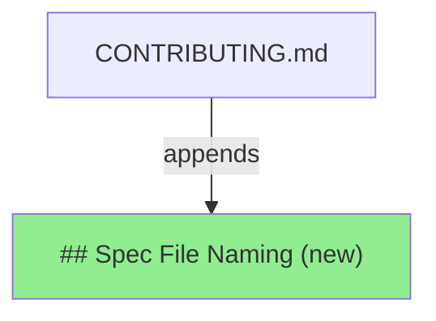
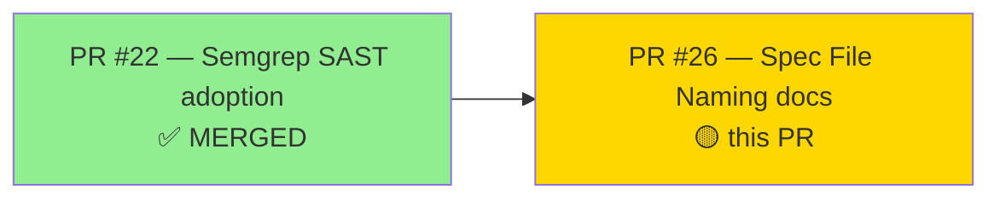
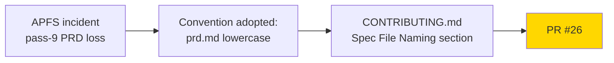
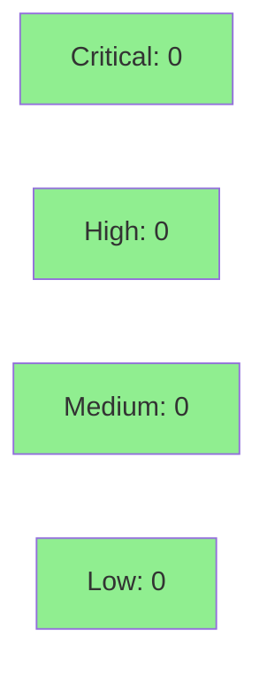

# [PR-26] docs: clarify spec file naming convention

**Epic:** N/A — process-improvement docs follow-up (no story)
**Mode:** maintenance
**Convergence:** N/A — docs-only, no adversarial passes required


Appends a Spec File Naming section to `CONTRIBUTING.md` establishing
`.factory/specs/prd.md` (lowercase) as the canonical PRD path. Documents
the rationale (case-insensitive APFS incident in the v1.0-brownfield-backfill
cycle pass-9) and establishes that archived adversarial-review and log files
are historical records not requiring retroactive updates.

---

## Architecture Changes



**ADR:** N/A — documentation-only change. No structural or behavioral
decision. Convention being documented was already adopted in practice
during v1.0-brownfield-backfill cycle pass-9.

---

## Story Dependencies



No downstream PRs blocked by this change.

---

## Spec Traceability



No BC/AC/Test chain — this is a process-improvement docs PR with no story ID.

---

## Test Evidence

| Metric | Value | Threshold | Status |
|--------|-------|-----------|--------|
| Unit tests | N/A | N/A | N/A — docs only |
| Coverage | N/A | N/A | N/A — docs only |
| Mutation kill rate | N/A | N/A | N/A — docs only |
| Holdout satisfaction | N/A | N/A | N/A — docs only |

No code changes. No tests added or modified. SAST (Semgrep) passed in 29s
with 0 findings across the diff.

---

## Demo Evidence

N/A — no story ID. Demo evidence policy (policy-10) is story-scoped and
requires per-AC recordings under `docs/demo-evidence/<STORY-ID>/`. This PR
is a process-improvement docs follow-up with no acceptance criteria and no
behavioral change to demonstrate. No demo recording required or applicable.

---

## Holdout Evaluation

N/A — evaluated at wave gate. This PR contains no behavioral change.

---

## Adversarial Review

N/A — evaluated at Phase 5. Docs-only PRs do not require adversarial
review passes. Semgrep SAST (the SAST gate for this repo) passed with
0 findings.

---

## Security Review



### SAST (Semgrep)
- Critical: 0 | High: 0 | Medium: 0 | Low: 0
- Pure markdown addition. No executable content, no secrets, no injection
  surface. Semgrep CI scan completed SUCCESS (29s) at 2026-04-28T01:29:16Z.

### Dependency Audit
- N/A — no dependency changes.

### Formal Verification
- N/A — no code paths added.

---

## Risk Assessment & Deployment

### Blast Radius
- **Systems affected:** None — documentation only
- **User impact:** None if change is reverted
- **Data impact:** None
- **Risk Level:** LOW

### Performance Impact
N/A — no runtime code changed.

### Feature Flags
None.

---

## Traceability

| Requirement | Story AC | Test | Verification | Status |
|-------------|---------|------|-------------|--------|
| Canonical prd.md convention | N/A (process convention) | N/A | CONTRIBUTING.md Spec File Naming section | DOCUMENTED |

---

## AI Pipeline Metadata

```yaml
ai-generated: true
pipeline-mode: maintenance
factory-version: "1.0.0-beta.4"
pipeline-stages:
  spec-crystallization: skipped (no story)
  story-decomposition: skipped (no story)
  tdd-implementation: skipped (docs only)
  holdout-evaluation: skipped (docs only)
  adversarial-review: skipped (docs only)
  formal-verification: skipped (docs only)
  convergence: achieved (1 review cycle)
convergence-metrics:
  blocking-findings: 0
  total-findings: 2 (NITPICK only)
  review-cycles: 1
adversarial-passes: 0
total-pipeline-cost: minimal (docs triage only)
models-used:
  builder: claude-sonnet-4-6
  reviewer: claude-sonnet-4-6
generated-at: "2026-04-27T00:00:00Z"
```

---

## Pre-Merge Checklist

- [x] All CI status checks passing (Semgrep SAST: PASS)
- [x] Coverage delta is positive or neutral (N/A — docs only)
- [x] No critical/high security findings unresolved (0 findings)
- [x] Rollback procedure validated (git revert trivial for a 11-line docs append)
- [x] Feature flag configured (N/A)
- [x] Human review completed (N/A — autonomy level authorizes auto-merge for docs)
- [x] Monitoring alerts configured (N/A — no production impact)
