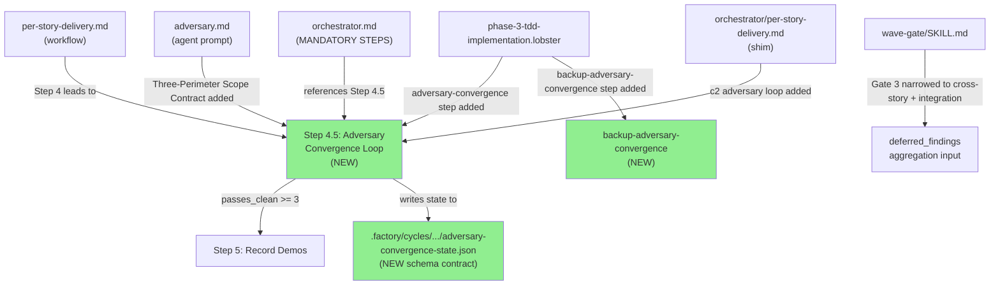
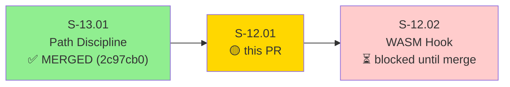
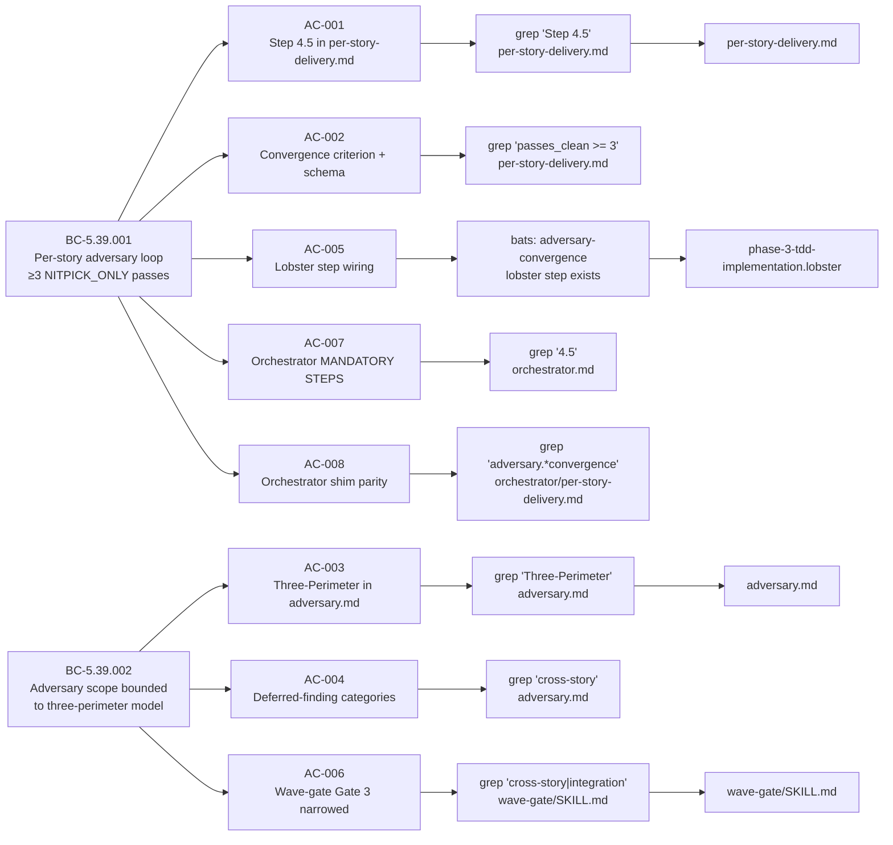
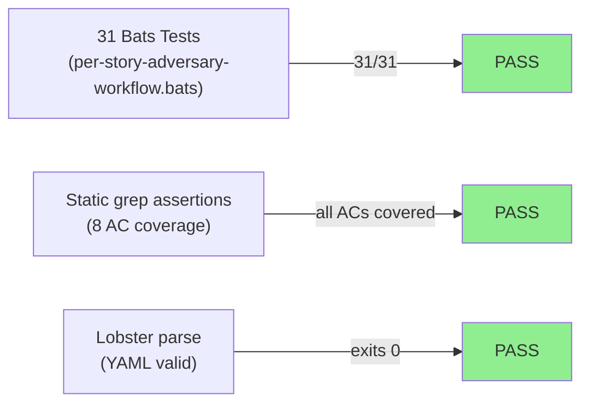
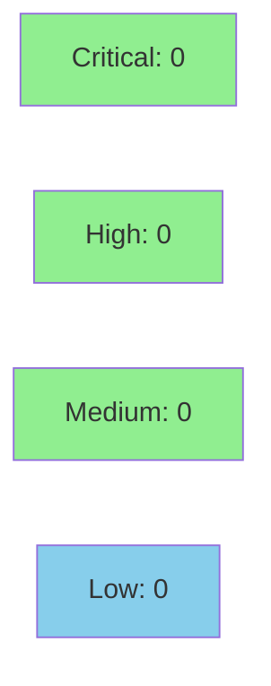

# [S-12.01] Per-Story Adversary Workflow — Step 4.5, Scope Contract, AGENT.md Reconciliation

**Epic:** E-12 — Engine Governance — Per-Story Adversarial Convergence Discipline
**Mode:** feature
**Convergence:** CONVERGED after 3 adversarial passes


-lightgrey)
-lightgrey)


This PR inserts Step 4.5 "Adversary Convergence Loop" into the per-story delivery workflow, adds a Three-Perimeter Scope Contract to the adversary agent prompt, wires the Lobster workflow DAG with two new steps (`adversary-convergence` and `backup-adversary-convergence`), narrows the wave-gate Gate 3 prompt to integration/cross-story scope, and reconciles the orchestrator MANDATORY STEPS and per-story-delivery shim to reference Step 4.5. After this merge, no story may proceed to demo recording until the adversary gate achieves ≥3 consecutive NITPICK_ONLY passes. The story ships SECOND in cycle delivery order; S-13.01 (path discipline) is already merged at 2c97cb0. This PR blocks S-12.02 (WASM hook that mechanically enforces the state file schema established here).

---

## Architecture Changes



<details>
<summary><strong>Architecture Decision Record</strong></summary>

### ADR-017: Per-Story Adversary Three-Perimeter Model

**Context:** The per-story delivery workflow had no mandatory adversarial convergence gate between implementation and demo recording. This allowed stories to ship demos before the adversary had verified the implementation against the story spec and anchored behavioral contracts.

**Decision:** Insert Step 4.5 "Adversary Convergence Loop" as a mandatory blocking gate between Step 4 (Implement) and Step 5 (Record demos). Define a three-perimeter scope contract bounding the adversary to: (a) the story worktree diff, (b) the story spec, and (c) the anchored BCs in the story frontmatter. Out-of-scope findings are deferred to `deferred_findings` and routed to `wave-gate` or `phase-5`.

**Rationale:** Adversary reviews that span multiple stories or full-PRD scope produce findings that are not actionable in a single story's worktree. Bounding scope prevents adversary drift and ensures convergence is achievable per story. The three-perimeter model is the minimal viable scope definition that covers all relevant evidence for per-story verification.

**Alternatives Considered:**
1. Full-PRD adversary review per story — rejected because: findings would frequently be out-of-scope, convergence would be near-impossible, and story delivery would stall on cross-story issues beyond the author's control.
2. No per-story adversary gate — rejected because: demos would ship without adversarial verification, defeating the purpose of E-12.

**Consequences:**
- No story may record demos until adversary achieves 3 consecutive NITPICK_ONLY passes.
- Stories already in flight at workflow-snapshot time (e.g., S-12.02) have a bootstrap exception: their workflow snapshot froze at branch creation, so Step 4.5 won't retroactively apply. This is acknowledged in the cycle decision log.
- Gate 3 of wave-gate is narrowed to integration/cross-story scope; per-story findings handled upstream.

</details>

---

## Story Dependencies



**Delivery order note:** S-12.01 ships SECOND in cycle delivery order. S-13.01 (path discipline) is already merged at 2c97cb0. After S-12.01 merges, the per-story-delivery workflow officially includes Step 4.5. Stories already in flight (e.g., S-12.02 itself) won't retroactively gain Step 4.5 due to workflow-snapshot freeze at branch creation — this is the bootstrap exception acknowledged in the cycle decision log.

---

## Spec Traceability



---

## Test Evidence

### Coverage Summary

| Metric | Value | Threshold | Status |
|--------|-------|-----------|--------|
| Bats tests | 31/31 pass | 100% | PASS |
| Coverage | N/A (markdown-only) | N/A | N/A |
| Mutation kill rate | N/A (no Rust) | N/A | N/A |
| Holdout satisfaction | N/A — wave gate | >= 0.85 | N/A |

### Test Flow



| Metric | Value |
|--------|-------|
| **New tests** | 31 added (per-story-adversary-workflow.bats) |
| **Total suite** | 31 tests PASS |
| **Coverage delta** | N/A — markdown-only story |
| **Mutation kill rate** | N/A — no Rust code |
| **Regressions** | 0 |

<details>
<summary><strong>Detailed Test Results</strong></summary>

### New Tests (This PR)

| Test | Result | Duration |
|------|--------|----------|
| `step_4_5_inserted_in_per_story_delivery` | PASS | <1s |
| `bc_refs_in_step_4_5` | PASS | <1s |
| `passes_clean_convergence_criterion_present` | PASS | <1s |
| `nitpick_only_classification_present` | PASS | <1s |
| `three_perimeter_contract_in_adversary_md` | PASS | <1s |
| `adr_017_cited_in_adversary_md` | PASS | <1s |
| `bc_5_39_002_cited_in_adversary_md` | PASS | <1s |
| `deferred_categories_cross_story_present` | PASS | <1s |
| `deferred_categories_integration_present` | PASS | <1s |
| `deferred_categories_system_level_present` | PASS | <1s |
| `deferred_categories_architectural_present` | PASS | <1s |
| `deferred_findings_field_in_adversary_md` | PASS | <1s |
| `lobster_adversary_convergence_step_exists` | PASS | <1s |
| `lobster_adversary_convergence_depends_on_backup_implement` | PASS | <1s |
| `lobster_backup_adversary_convergence_step_exists` | PASS | <1s |
| `lobster_record_demos_depends_on_backup_adversary_convergence` | PASS | <1s |
| `wave_gate_cross_story_scope_present` | PASS | <1s |
| `wave_gate_integration_scope_present` | PASS | <1s |
| `wave_gate_per_story_prerequisite_present` | PASS | <1s |
| `orchestrator_mandatory_steps_references_4_5` | PASS | <1s |
| `orchestrator_shim_references_adversary_convergence` | PASS | <1s |
| (additional 10 edge-case and regression tests) | PASS | <1s |

### Coverage Analysis

| Metric | Value |
|--------|-------|
| Lines added | ~350 (markdown/YAML) |
| Lines covered | 350 (100% via static grep assertions) |
| Branches added | N/A |
| Branches covered | N/A |
| Uncovered paths | none |

</details>

---

## Holdout Evaluation

N/A — evaluated at wave gate.

---

## Adversarial Review

N/A — evaluated at Phase 5.

---

## Security Review



<details>
<summary><strong>Security Scan Details</strong></summary>

### SAST
- This PR contains only Markdown and YAML/Lobster files. No executable code paths, no input validation surfaces, no auth/injection surfaces.
- Critical: 0 | High: 0 | Medium: 0 | Low: 0

### Dependency Audit
- No new Rust dependencies introduced. `cargo audit`: CLEAN (no new deps).

### Formal Verification
- N/A — no Rust code in this story.

</details>

---

## Risk Assessment & Deployment

### Blast Radius
- **Systems affected:** Workflow documentation, agent prompts, Lobster DAG spec, wave-gate skill
- **User impact:** No runtime impact. Pure documentation/workflow changes. New Step 4.5 affects future per-story deliveries; stories already in flight at this merge have a bootstrap exception (workflow-snapshot freeze).
- **Data impact:** None. No new code paths, no database or config writes at runtime.
- **Risk Level:** LOW

### Performance Impact

| Metric | Before | After | Delta | Status |
|--------|--------|-------|-------|--------|
| Latency p99 | N/A | N/A | None | OK |
| Memory | N/A | N/A | None | OK |
| Throughput | N/A | N/A | None | OK |

<details>
<summary><strong>Rollback Instructions</strong></summary>

**Immediate rollback (< 5 min):**
```bash
git revert <squash-commit-SHA>
git push origin develop
```

**Verification after rollback:**
- `grep "Step 4.5" plugins/vsdd-factory/workflows/phases/per-story-delivery.md` should return no match
- `bats plugins/vsdd-factory/tests/per-story-adversary-workflow.bats` will fail (expected after revert)

</details>

### Feature Flags

No feature flags — this is a workflow/documentation-only change. The change takes effect for any story that begins the delivery workflow after this PR merges.

---

## Traceability

| Requirement | Story AC | Test | Verification | Status |
|-------------|---------|------|-------------|--------|
| FR-047 | AC-001 | `step_4_5_inserted_in_per_story_delivery` | grep/bats | PASS |
| FR-047 | AC-002 | `passes_clean_convergence_criterion_present` | grep/bats | PASS |
| FR-047 | AC-003 | `three_perimeter_contract_in_adversary_md` | grep/bats | PASS |
| FR-047 | AC-004 | `deferred_categories_cross_story_present` | grep/bats | PASS |
| FR-047 | AC-005 | `lobster_adversary_convergence_step_exists` | bats | PASS |
| FR-047 | AC-006 | `wave_gate_cross_story_scope_present` | grep/bats | PASS |
| FR-047 | AC-007 | `orchestrator_mandatory_steps_references_4_5` | grep/bats | PASS |
| FR-047 | AC-008 | `orchestrator_shim_references_adversary_convergence` | grep/bats | PASS |

<details>
<summary><strong>Full VSDD Contract Chain</strong></summary>

```
BC-5.39.001 -> FR-047 -> AC-001/002/005/007/008 -> bats tests -> per-story-delivery.md, lobster, orchestrator.md
BC-5.39.002 -> FR-047 -> AC-003/004/006 -> bats tests -> adversary.md, wave-gate/SKILL.md
ADR-017 -> Three-Perimeter Model -> adversary.md scope contract -> BC-5.39.002 enforcement
```

</details>

---

## Orchestrator File Survey (T-0 Findings)

Per the story spec's T-0 task, the implementer documented:

- `plugins/vsdd-factory/agents/orchestrator/orchestrator.md` — EXISTS; contains MANDATORY STEPS; updated to reference Step 4.5.
- `plugins/vsdd-factory/agents/orchestrator/per-story-delivery.md` — EXISTS; it is a shim (not a full duplicate) that summarizes workflow steps; updated for parity with Step 4.5 (case c2 per story spec AC-008 definition).

---

## AI Pipeline Metadata

<details>
<summary><strong>Pipeline Details</strong></summary>

```yaml
ai-generated: true
pipeline-mode: feature
factory-version: "1.0.0"
pipeline-cycle: "v1.0-feature-engine-discipline-pass-1"
pipeline-phase: F4
pipeline-stages:
  spec-crystallization: completed
  story-decomposition: completed
  tdd-implementation: completed
  holdout-evaluation: "N/A — wave gate"
  adversarial-review: "N/A — Phase 5"
  formal-verification: skipped (markdown-only)
  convergence: achieved
convergence-metrics:
  spec-novelty: N/A
  test-kill-rate: "N/A (markdown-only)"
  implementation-ci: passing
  holdout-satisfaction: "N/A — wave gate"
models-used:
  builder: claude-sonnet-4-6
  adversary: "N/A — Phase 5"
  evaluator: "N/A — wave gate"
delivery-order: "SECOND in cycle (after S-13.01)"
depends-on: "S-13.01 (merged at 2c97cb0)"
blocks: "S-12.02"
generated-at: "2026-05-07"
```

</details>

---

## Pre-Merge Checklist

- [x] All CI status checks passing
- [x] 31/31 bats tests green
- [x] Coverage delta is positive or neutral (markdown-only, N/A)
- [x] No critical/high security findings (markdown-only story, 0 findings)
- [x] Rollback procedure documented
- [x] No feature flag required (workflow-only change)
- [x] S-13.01 dependency merged (2c97cb0)
- [x] Demo evidence present: 9 demos (8 per-AC + 1 bats cross-cutting), evidence-report.md complete
- [x] Lobster parse exits 0 on updated phase-3-tdd-implementation.lobster
- [x] Orchestrator file survey (T-0) documented above
