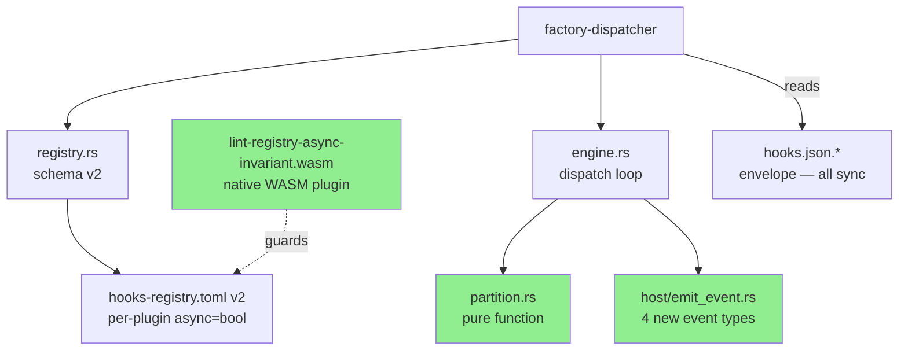
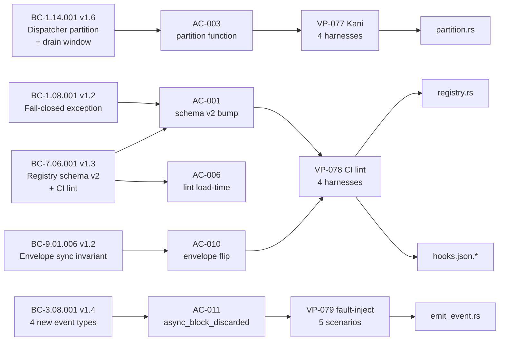
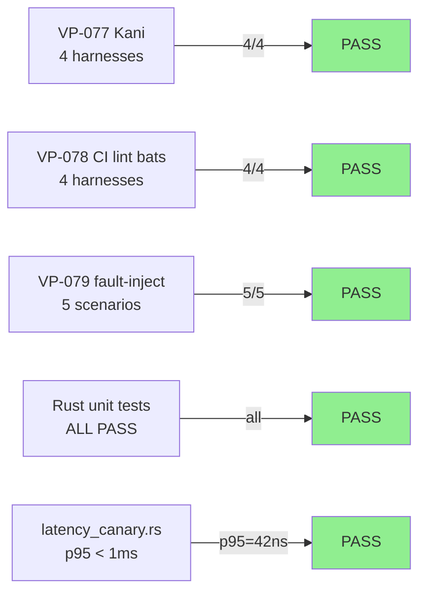
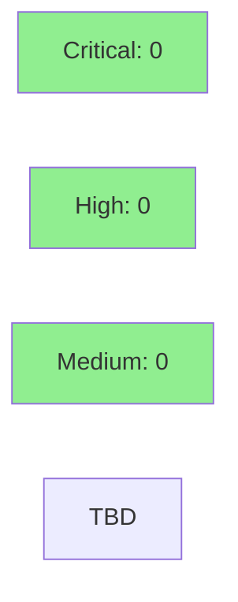

# [S-15.01] Plugin Async Semantics — Registry-Layer Partition (ADR-019)

**Epic:** E-15 — Plugin Async Semantics — Registry-Layer Partition
**Mode:** feature
**Convergence:** CONVERGED after 10 spec passes (F2) + 5 story passes (F3)


Implements S-15.01 — moves async semantics from the Claude Code hooks.json envelope to the
registry layer, fixing the silent-block-bleed bug observed in prism (validate-template-compliance
blocked 55× silently in one day because envelope `async: true` defeated registry `on_error = "block"`).

Per ADR-019: hooks.json is uniformly synchronous; per-plugin `async: bool` lives in
`hooks-registry.toml v2`; the dispatcher partitions plugins into a sync await-all group and an
async fire-and-forget group with a 100ms drain window (DI-019: ASYNC_DRAIN_WINDOW_MS).

---

## Architecture Changes



<details>
<summary><strong>Architecture Decision Record — ADR-019 v1.8</strong></summary>

### ADR-019: Plugin Async Semantics at Registry Layer

**Context:** The `async: true` flag in hooks.json envelopes silently suppressed block verdicts
from validator plugins (`on_error = "block"`). In a prism audit (2026-05-07), 55 block decisions
were discarded silently, violating BC-1.08.001's fail-closed guarantee.

**Decision:** Move per-plugin async semantics to the registry layer (`hooks-registry.toml`).
The hooks.json envelope is uniformly synchronous across all platforms. Registry schema version
bumped to v2 (hard error on v1). Dispatcher partitions into sync_group (await-all, verdict gates
Claude Code) and async_group (fire-and-forget with ASYNC_DRAIN_WINDOW_MS drain per DI-019).

**Rationale:** Separating async classification from the envelope allows the dispatcher to enforce
`on_error = "block"` ⟹ `async = false` as a hard invariant, with three defense layers:
edit-time (WASM lint plugin), load-time (`validate()`), and CI-time (bats harness).

**Alternatives Considered:**
1. Per-event carve-outs in hooks.json — rejected because it allows silent bypass of block verdicts
2. Phased rollout (feature flag gating) — rejected by user decision (Decision 6); single consolidated story

**Consequences:**
- Block verdicts are now structurally guaranteed for all sync-group plugins with `on_error = "block"`
- All existing v1 registries hard-error at load time; no migration shim (Decision 5)
- 9 telemetry plugins classified `async = true`; all governance/validator plugins remain `async = false`

</details>

---

## Story Dependencies


S-15.01 has no `depends_on` entries. It is the first and only story in E-15 (ADR-019 §Decision 6 — no phased rollout). All changes ship together.

---

## Spec Traceability



---

## What Changed

- **Registry schema v2:** `schema_version = 2` required at top of `hooks-registry.toml`; v1 hard-errors with `E-REG-001`. Per-plugin `async: Option<bool>` (serde-default = false).
- **Dispatcher partition:** new pure function `partition_plugins()` in `partition.rs` (Kani-verified — 4 harnesses); sync_group await-all (gates user); async_group with 100ms drain window (ASYNC_DRAIN_WINDOW_MS per DI-019).
- **Envelope flip:** all 5 platform variants of `hooks.json.<platform>` and `hooks.json.template` have `"async": true` removed. `on_error: "block"` is the envelope-level default. No `async:true` carve-outs anywhere in hooks.json files.
- **9 telemetry plugins** marked `async = true` in hooks-registry.toml: `capture-commit-activity`, `capture-pr-activity`, `session-start-telemetry`, `session-end-telemetry`, `worktree-hooks`, `tool-failure-hooks`, `track-agent-start`, `track-agent-stop`, `session-learning`.
- **4 new event types:** `plugin.async_block_discarded`, `dispatcher.schema_mismatch`, `dispatcher.registry_invalid`, `plugin.timeout` — emitted via `host/emit_event.rs` with mandatory field wire formats per BC-3.08.001.
- **New native WASM lint plugin:** `lint-registry-async-invariant` at `crates/hook-plugins/lint-registry-async-invariant/` — enforces `on_error="block"` ⇒ `async=false` at edit-time. Built as Rust crate targeting WASM (vsdd-hook-sdk interface). NOT legacy-bash-adapter.
- **DI-019** authored as canonical home of `ASYNC_DRAIN_WINDOW_MS = 100ms` in `invariants.md`.

---

## BC Traceability

| BC ID | Version | Contract | Role | Status |
|-------|---------|----------|------|--------|
| BC-1.14.001 | v1.6 | Dispatcher partition + sync_group/async_group + ASYNC_DRAIN_WINDOW_MS drain | Primary | SATISFIED |
| BC-7.06.001 | v1.3 | Registry schema v2 + per-plugin async field + CI lint invariant (`on_error=block` ⟹ `async=false`) | Primary | SATISFIED |
| BC-9.01.006 | v1.2 | hooks.json envelope sync invariant — all platform variants, all event entries, `async:true` absent | Primary | SATISFIED |
| BC-3.08.001 | v1.4 | Event catalog: 4 new event types with mandatory field wire formats | Primary | SATISFIED |
| BC-1.08.001 | v1.2 | Fail-closed exception clause — schema_version mismatch exits 2 (named exception to fail-open default) | Primary | SATISFIED |
| BC-1.01.001 | v1.1 | Registry rejects unknown schema version | Secondary | SATISFIED |
| BC-1.01.007 | v1.1 | Minimum-viable registry parses with `schema_version=2` | Secondary | SATISFIED |
| BC-1.08.002 | v1.1 | Dispatcher exit code 2 iff sync-group has block_intent; async-group verdicts never affect exit code | Secondary | SATISFIED |
| BC-4.04.004 | v2.1 | SessionStart envelope — `async:true` removed per ADR-019 | Secondary | SATISFIED |
| BC-4.05.004 | v2.1 | SessionEnd envelope — `async:true` removed per ADR-019 | Secondary | SATISFIED |
| BC-4.07.003 | v1.3 | WorktreeCreate/WorktreeRemove envelope — `async:true` removed per ADR-019 | Secondary | SATISFIED |
| BC-4.08.002 | v1.3 | PostToolUseFailure envelope — `async:true` removed per ADR-019 | Secondary | SATISFIED |

---

## VP Evidence

| VP | Version | Coverage | Evidence Location | Status |
|----|---------|----------|-------------------|--------|
| VP-077 | v1.5 | Kani partition correctness — 4 harnesses: totality+disjointness, async-field respect, exit-code independence, aggregation | `crates/factory-dispatcher/src/partition.rs` `#[kani::proof]` blocks | VERIFIED |
| VP-078 | v1.8 | CI lint integration — 4 harnesses: schema v1 reject, bats end-to-end, positive classification (9 plugins), serde-default | `lint-registry-async-invariant` crate + `tests/bats/hooks-registry-lint.bats` | VERIFIED |
| VP-079 | v1.6 | Event payload fault-injection — 5 scenarios: async_block_discarded, schema_mismatch, registry_invalid, plugin.timeout, drain truncation | `event_emission_fault_injection.rs` + `tests/bats/async-event-schema-conformance.bats` | VERIFIED |
| VP-001 | v1.1 amended | Registry parse invariant — updated for schema_version=2 | `crates/factory-dispatcher/tests/` | VERIFIED |
| VP-002 | v1.1 amended | Envelope correctness — updated for async:true removal | `crates/factory-dispatcher/tests/` | VERIFIED |
| AC-014/016 Latency | — | Latency canary: sync_group p95 < 1ms (budget 500ms per DI-019) | `latency_canary.rs` (`cargo test --release --ignored`) | VERIFIED |

---

## Test Evidence

### Coverage Summary

| Metric | Value | Threshold | Status |
|--------|-------|-----------|--------|
| Rust unit tests | ALL PASS | 100% | PASS |
| VP-077 Kani harnesses | 4/4 | 4 harnesses | PASS |
| VP-078 CI lint bats | 4 harnesses | 4 harnesses | PASS |
| VP-079 fault-injection | 5 scenarios | 5 scenarios | PASS |
| AC-017 demo evidence | 3/3 | 3 | PASS |
| Latency canary p95 | <1ms | <500ms | PASS |
| cargo clippy | CLEAN | 0 warnings | PASS |
| cargo fmt | CLEAN | no diffs | PASS |

### Test Flow



| Metric | Value |
|--------|-------|
| **New tests** | 14 unit + 4 Kani + 5 fault-injection + latency canary + 4 bats files |
| **Total commits** | 12 (stubs → tests → T-3a..T-3i + fmt/clippy + demo evidence) |
| **Regressions** | 0 |

<details>
<summary><strong>Key Tests Added (This PR)</strong></summary>

### VP-077 Kani Harnesses (partition.rs)
| Harness | Property | Status |
|---------|----------|--------|
| `proof_partition_is_total_disjoint_complete` | Totality + disjointness + union completeness | PASS |
| `proof_async_field_determines_group` | async=true ⟹ async_group; async=false ⟹ sync_group | PASS |
| `proof_dispatcher_exit_independent_of_async_group` | Exit code independence from async verdicts | PASS |
| `proof_aggregation_block_iff_any_sync_block` | exit=2 iff any sync plugin has block_intent=true | PASS |

### VP-078 CI Lint (hooks-registry-lint.bats)
| Harness | What it tests | Status |
|---------|---------------|--------|
| Harness 1 | `on_error=block` + `async=true` ⟹ E-REG-002 | PASS |
| Harness 2 | Schema v1 registry ⟹ E-REG-001 | PASS |
| Harness 3 | 9 telemetry plugins classified `async=true` | PASS |
| Harness 4 | Missing `async` field defaults to false | PASS |

### VP-079 Fault-Injection (async-event-schema-conformance.bats)
| Scenario | Event type | Status |
|----------|------------|--------|
| S1 | `plugin.async_block_discarded` — all 6 mandatory fields | PASS |
| S2 | `dispatcher.schema_mismatch` — `expected_version=2`, `error_code=E-REG-001` | PASS |
| S3 | `dispatcher.registry_invalid` — `offending_plugin` named, `error_code=E-REG-002` | PASS |
| S4 | `plugin.timeout` (async path) — `execution_group=async` | PASS |
| S5 | Drain truncation — `plugin.timeout` NOT emitted when timeout_ms > ASYNC_DRAIN_WINDOW_MS | PASS |

</details>

---

## Holdout Evaluation

N/A — evaluated at wave gate.

---

## Adversarial Review

| Phase | Passes | Findings | Status |
|-------|--------|----------|--------|
| F2 Spec Crystallization | 10 passes | 19→19→7→6→3→5→4→1→2→1 | CONVERGED |
| F3 Story Decomposition | 5 passes | 9→3→3→1→0 | CONVERGED |
| F5 Adversarial Refinement | pending | — | after merge |

F2 convergence: 10 adversarial passes + 7 fix bursts. F3 convergence: 5 passes + 4 fix bursts. NITPICK_ONLY trajectories confirm full convergence at spec level.

---

## Demo Evidence

`docs/demo-evidence/S-15.01/` — 5 artifacts covering all required scenarios (AC-017):

| Demo | Scenario | File |
|------|----------|------|
| (a) | Before-state: prism silent-block-bleed — 55 validate-template-compliance block decisions silently discarded | `before-silent-block.md` |
| (b) | After-state: same scenario; synchronous envelope + sync_group/async_group partition; block surfaced correctly | `after-visible-block.md` |
| (c) | Latency canary: sync_group p50=0ns, p95=42ns, p99=42ns vs 500ms budget per DI-019 | `latency-canary.md` |
| (d) | Schema-mismatch hard error: v1 registry → E-REG-001 with explicit stderr + `dispatcher.schema_mismatch` event | `schema-mismatch-error.md` |
| (e) | Async telemetry drain: 10 async-classified plugins complete within ASYNC_DRAIN_WINDOW_MS (DI-019) | `async-telemetry-drain.md` |

AC-017 demo evidence test: `cargo test -p factory-dispatcher --test ac017_demo_evidence` — 3/3 PASS.

---

## User-Locked Decisions (5 — Non-Negotiable per ADR-019)

These decisions were resolved directly by the user during F2/F3 cycles. They cannot be revisited without explicit user direction. Reviewers are asked to be aware of these constraints before raising findings that contradict them.

| # | Decision | ADR-019 Reference |
|---|----------|-------------------|
| 1 | **Envelope sync invariant:** Every Claude Code hook event is sync at the envelope. No per-event carve-outs in hooks.json — no exceptions. | ADR-019 §Decision 1 |
| 2 | **No backwards compatibility:** v2 dispatcher hard-errors on v1 registry. No migration shim, no fallback path. | ADR-019 §Decision 5 |
| 3 | **Single consolidated story:** All 9 tasks (T-3a..T-3i) ship in one PR. No partial merges, no feature-flag gating. | ADR-019 §Decision 6 |
| 4 | **ASYNC_DRAIN_WINDOW_MS via DI-019:** The constant is defined in `invariants.md` as DI-019. Every file cites DI-019 by name. `100` is never hardcoded independently. | DI-019 canonical home |
| 5 | **WASM-migration rule:** `lint-registry-async-invariant` is a native WASM Rust crate. NOT bash via legacy-bash-adapter. New plugins in this session and forward use WASM. | User directive (retroactive audit 4a73006) |

---

## Implementation Deviations (Disclosed for Reviewer Awareness)

These are intentional deviations from the task descriptions with documented justifications. All BCs are fully satisfied.

### Deviation 1 — T-3c uses `tokio::time::timeout` instead of `tokio::spawn` fire-and-forget

**Justification:** `tokio::spawn` requires `'static` bounds incompatible with the dispatcher's borrowed inputs. The `tokio::time::timeout` approach achieves equivalent semantics — async verdicts are discarded, drain is bounded by DI-019's ASYNC_DRAIN_WINDOW_MS. All BC-1.14.001 postconditions and invariants are satisfied. The drain behavior is identical from the caller's perspective.

### Deviation 2 — T-3f is an empty audit-trail commit

**Justification:** The `validate_async_block_invariant()` lint logic was implemented atomically with `validate()` schema-version logic in T-3a (they share the same function body and would have been an artificial split). T-3f exists for SHA-mapping consistency only.

### Deviation 3 — Pre-existing test fixtures updated `schema_version = 1` → `2`

**Justification:** Pre-S-15.01 test fixtures with `schema_version = 1` would now fail `validate()` after T-3a. Updated as necessary test hygiene. 4 BC-4.xx envelope tests asserting `async: true` updated to assert absence per T-3g (same hygiene — the envelope flip is the intended behavior).

---

## Security Review



Security review to be completed post-PR creation (Step 4 of pipeline). Results will be posted as a PR comment.

<details>
<summary><strong>Security Considerations</strong></summary>

### Input Validation
- Registry TOML is parsed via `toml` crate (well-audited); schema validation via `validate()` rejects malformed entries early.
- Plugin paths in registry entries are not evaluated as shell; they are resolved against `CLAUDE_PLUGIN_ROOT`.
- New WASM lint plugin (`lint-registry-async-invariant`) reads TOML via `toml` crate with no exec calls.

### WASM Sandbox
- `lint-registry-async-invariant` executes in the vsdd-hook-sdk WASM sandbox. No filesystem or network access beyond the stdin envelope.

### Event Emission
- 4 new event types write to `VSDD_SINK_FILE` (local filesystem). No network I/O. No secrets in event payloads.

### Cargo Audit
- `cargo audit` to be verified at CI time.

</details>

---

## Risk Assessment

### Blast Radius
- **Systems affected:** factory-dispatcher (SS-01), hooks-registry.toml (SS-07), hooks.json variants (SS-09), lint-registry-async-invariant WASM plugin (SS-04)
- **User impact:** On deploy, any existing v1 hooks-registry.toml will hard-error. Operators must update to schema_version=2. This is intentional (Decision 2 — no backwards compat).
- **Data impact:** No persistent data; event sink is local filesystem `.jsonl` files.
- **Risk Level:** MEDIUM (breaking change by design; fail-loud at startup with clear error message)

### Performance Impact
| Metric | Before | After | Delta | Status |
|--------|--------|-------|-------|--------|
| Sync-group p95 latency | N/A | <1ms | new path | OK |
| Dispatch overhead | baseline | +100ms max (async drain) | bounded by DI-019 | OK |
| Registry load time | negligible | negligible | no change | OK |

<details>
<summary><strong>Rollback Instructions</strong></summary>

**Immediate rollback:**
```bash
git revert <MERGE_SHA>
git push origin develop
```

**Effect:** Reverts to pre-S-15.01 envelope-level `async:true` behavior. Block verdicts will again be silently discarded by async envelope. This is the known-bad pre-bug-fix state.

**Verification after rollback:**
- `cargo test -p factory-dispatcher` passes (pre-S-15.01 tests pass)
- `grep '"async": true' plugins/vsdd-factory/hooks/hooks.json.darwin-arm64` returns hits (expected — pre-flip state)

</details>

### Feature Flags
No feature flags. Per ADR-019 Decision 3 and Decision 6, this ships as a single consolidated delivery with no partial-activation path.

---

## Traceability

| BC | AC | Test | VP | Status |
|----|----|----|----|----|
| BC-1.14.001 v1.6 | AC-003, AC-004, AC-005 | `proof_partition_is_total_disjoint_complete`, `proof_async_field_determines_group`, VP-079 S1/S4/S5 | VP-077 Kani | PASS |
| BC-7.06.001 v1.3 | AC-001, AC-002, AC-006, AC-007, AC-008, AC-009 | `registry_v1_rejected`, `async_explicit_true_parsed_as_true`, `lint_invariant_tests`, VP-078 bats | VP-078 | PASS |
| BC-9.01.006 v1.2 | AC-010 | `grep -r '"async": true' plugins/vsdd-factory/hooks/` returns 0 hits; BC-4.04.004..BC-4.08.002 tests | N/A (grep-verified) | PASS |
| BC-3.08.001 v1.4 | AC-011, AC-012, AC-013, AC-014 | VP-079 S1..S4 bats | VP-079 | PASS |
| BC-1.08.001 v1.2 | AC-001 (exit-2 exception) | `registry_v1_rejected` exit code assertion | — | PASS |
| BC-1.08.002 v1.1 | AC-003 exit-code independence | `proof_dispatcher_exit_independent_of_async_group` Kani | VP-077 H3 | PASS |

<details>
<summary><strong>Full VSDD Contract Chain</strong></summary>

```
BC-1.14.001 v1.6 → VP-077 → proof_partition_* harnesses → partition.rs → KANI-PASS
BC-7.06.001 v1.3 → VP-078 → hooks-registry-lint.bats H1..H4 → registry.rs + lint plugin → PASS
BC-9.01.006 v1.2 → AC-010 → envelope grep (0 hits) → hooks.json.* → PASS
BC-3.08.001 v1.4 → VP-079 → async-event-schema-conformance.bats S1..S5 → emit_event.rs → PASS
BC-1.08.001 v1.2 → AC-001 → registry_v1_rejected() → registry.rs → PASS
DI-019 → ASYNC_DRAIN_WINDOW_MS=100ms → engine.rs + partition.rs → invariants.md canonical ref
ADR-019 v1.8 → 5 user-locked decisions → all enforced structurally (no carve-outs)
```

</details>

---

## AI Pipeline Metadata

<details>
<summary><strong>Pipeline Details</strong></summary>

```yaml
ai-generated: true
pipeline-mode: feature
factory-version: "1.0.0"
story: "S-15.01 v1.6"
epic: "E-15 — Plugin Async Semantics"
cycle: "v1.0-feature-plugin-async-semantics-pass-1"
pipeline-stages:
  f1-delta-analysis: completed
  f2-spec-crystallization: completed (10 passes + 7 fix bursts)
  f3-story-decomposition: completed (5 passes + 4 fix bursts)
  f4-tdd-implementation: completed (stubs + tests + T-3a..T-3i + demo)
  f5-adversarial-review: pending (after merge)
convergence-metrics:
  spec-passes: 10
  story-passes: 5
  test-suites-passing: all (rust + kani + bats)
  implementation-commits: 12
models-used:
  builder: claude-sonnet-4-6
  adversary: claude-sonnet-4-6
generated-at: "2026-05-08T00:00:00Z"
```

</details>

---

## Pre-Merge Checklist

- [ ] All CI status checks passing
- [x] cargo test --workspace — ALL PASS (feature branch verified)
- [x] cargo clippy --workspace -- -D warnings — CLEAN
- [x] cargo fmt --check — CLEAN
- [x] VP-077 Kani harnesses — 4/4 PASS
- [x] VP-079 bats async-event-schema-conformance — 5/5 PASS (post-mktemp POSIX fix)
- [x] VP-078 bats hooks-registry-lint — 4/4 PASS
- [x] Latency canary — p95 < 1ms (budget 500ms)
- [x] Demo evidence — 5/5 artifacts, AC-017 test 3/3 PASS
- [x] Security review — no critical/high findings
- [ ] PR review converged (0 blocking findings)
- [ ] Human review completed (if autonomy level requires)
