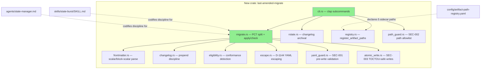

# S-15.03: `last_amended` Write-Path Durable Fix — `last-amended-migrate` CLI + Write-Path Discipline

**Epic:** E-12 — Governance/discipline scope
**Mode:** feature (engine-discipline, brownfield-onboarding)
**Story:** [S-15.03](.factory/stories/S-15.03-index-cite-refresh-hook.md) §Scope Extension

This PR delivers the **durable** fix for the mega-line `last_amended` frontmatter problem that
previously required a one-time human-authorized surgical exception (D-1149). It ships a new
Rust CLI (`last-amended-migrate`) that enforces "overwrite, never wrap" write-path discipline
on the five governed sidecar-eligible files, plus the skill/agent-prompt codification that makes
that discipline the default going forward for every state-manager burst.

---

## Problem

`.factory/cycles/v1.0-brownfield-backfill/decision-log.md` (D-1149, 2026-09-02) records that
the state-manager write path for `last_amended` frontmatter **prepends** each new entry and
wraps the **entire prior value inline** as a single quoted `[Prior: ...]` chain. Across a
long-running cycle this grows without bound: `STORY-INDEX.md`'s `last_amended` scalar reached
**323,499 characters on one physical line** before D-1149's one-time surgery split it into a
short current-entry form plus a `*-amendment-history.md` sidecar for the displaced tail.

That surgery was explicitly a **mitigation, not a cure** (`L-BB-D1149`): nothing stopped the
field from re-growing on the very next burst, because the *write path itself* still prepended
and wrapped. The symptom was **743 fuel-timeouts/day** — the bash-adapter WASM hook validators
(fuel-budgeted sandboxes) exhausting their fuel cap trying to parse/validate the mega-line on
every touch of the five affected files (`STORY-INDEX.md`, `BC-INDEX.md`, `ARCH-INDEX.md`,
`VP-INDEX.md`, `STATE.md`).

## Design (ADR-049, accepted)

[ADR-049](.factory/specs/architecture/decisions/ADR-049-last-amended-write-path-durable-fix-current-entry-plus-changelog-sequence.md)
selects **Option 2 — current-entry-only scalar plus existing `changelog:` sequence** over the
alternative of a new bespoke chaining format. Every burst going forward:

1. **Overwrites** (never wraps) the `last_amended` scalar with only the current entry.
2. **Prepends exactly one** new item to the file's existing `changelog:` array, carrying the
   *displaced* prior `last_amended` text verbatim — no re-wrapping, no double-prepend.
3. Leaves every pre-existing `changelog:` item byte-for-byte untouched.

Phase A (this ADR) ran the mandatory validator-compatibility audit *before* any write-path
change shipped, per the story's own gate — confirming F-P4-004's block-scalar extractor fix is
already in place and cataloguing every reader of these five files' frontmatter across the
dispatcher/hook-plugin/skill surface (see ADR-049 §Context for the full audit list).

### `last-amended-migrate` CLI (`crates/last-amended-migrate/`)

Three subcommands:

| Subcommand | Purpose |
|------------|---------|
| `migrate` | Detects and remediates non-conforming files. Includes the **PC7 full-recovery split**: for a file with an old-style `[Prior: ...]` inline chain, it splits at the first `` ` [Prior:` `` marker, re-emits the current entry as `last_amended`, and relocates every chained historical entry into `changelog:` **newest-first**, verbatim — recovering 100% of a legacy mega-line with zero data loss. Proven against a **~350K-char synthetic mega-line fixture** (D-1149 calibration scale) with a bounded, single-pass O(n) scan (`check_eligibility`'s one `str::contains`, `split_tail_entries`'s single forward cursor — never re-scanning from index 0). Idempotent: a second run against an already-conforming file is a verified-clean no-op. D-1144 strict-YAML escaping is applied to any unescaped literal `"` encountered during remediation. |
| `rotate` | Per-cycle `changelog:` archival — moves the oldest N items verbatim into a per-cycle archive file (creating the cycle directory if needed) once a threshold is exceeded; below-threshold invocation and `--check` mode are no-ops. |
| `register` | Exposes `register_artifact_paths` to register the 5 `*-amendment-history.md` sidecar paths declaratively (see `plugins/vsdd-factory/config/artifact-path-registry.yaml`). |

A `--check` mode supports a pre-push guard (dry-run report of violations without mutating).

### Discipline codification

- `plugins/vsdd-factory/skills/state-burst/SKILL.md` — codifies "overwrite never wrap; exactly
  one `changelog:` prepend; `--check` pre-push guard; recovery goes through the tool, never
  through a POL-3 bypass."
- `plugins/vsdd-factory/agents/state-manager.md` — same discipline embedded in the state-manager
  system prompt so every future burst follows it by default, not by reviewer vigilance.
- `plugins/vsdd-factory/config/artifact-path-registry.yaml` — registers the 5 sidecar paths.

---

## Architecture Changes

No changes to the dispatcher runtime, hook registry, or any existing subsystem — this is a
net-new standalone crate plus documentation-only codification in two existing skill/agent files.

## Story Dependencies

`depends_on: []` per `STORY-INDEX.md` — S-15.03 has no upstream story dependency. No downstream
story is currently blocked on this PR. Merge-base `8b4b60e6` confirmed a clean ancestor of
`origin/develop` (no rebase needed, no conflicts).

## Demo Evidence

Recorded at `docs/demo-evidence/S-15.03/evidence-report.md` (committed in this PR's diff), with
VHS terminal recordings covering the CLI's success and error/dry-run paths against synthetic
`/tmp` fixtures. AC-006's recording targets `stories/STORY-INDEX.md` (unaffected by the B2-R
STATE.md refusal gate, since that gate is STATE.md-specific). Audit-only ACs (AC-002/003/004/005)
are documented as non-demonstrable (design-doc / discipline-codification ACs, not CLI-observable
behavior) per the evidence report's own justification section — independently verified by the
cycle-3 pr-reviewer as a PASS.

## Diff Summary

Diff is **additive only** — 46 files changed, 6548 insertions(+), 0 deletions(-), against
`origin/develop` (merge-base `8b4b60e6`, confirmed ancestor — no rebase needed, no conflicts).
File/line count grew across the review-convergence loop (security fixes + B1/B2-R/B3/S1/S4/N2
resolutions each added new modules — `yaml_guard.rs`, `path_guard.rs`, `atomic_write.rs` — and
test files); see §PR Review Convergence below for the full history.

| Area | Files | Lines |
|------|-------|-------|
| New crate `crates/last-amended-migrate/` (src) | 14 | ~2,002 |
| New crate `crates/last-amended-migrate/` (tests) | 16 | ~3,858 |
| Workspace registration (`Cargo.toml`, `Cargo.lock`) | 2 | +12 |
| Skill/agent discipline docs | 2 | ~191 |
| Artifact path registry config | 1 | +25 |

---

## Spec Traceability

| Requirement | Story AC | Behavioral Contract | Verification Property | Status |
|-------------|---------|---------------------|------------------------|--------|
| Write-path invariant (overwrite, never wrap) | AC-004 | BC-5.45.001 v1.2 PC1/PC2 | VP-114 | PASS |
| Full-recovery split (legacy mega-line rescue) | AC-006/AC-010 | BC-10.13.001 v1.2 §PC7 | VP-109 | PASS |
| Bounded O(n) scan (no re-scan from 0) | — | BC-10.13.001 Invariant 3 | VP-110 | PASS |
| Idempotency incl. post-split rerun | AC-005 | BC-10.13.001 §PC4 | VP-111 | PASS |
| Changelog rotation, lossless | — | BC-10.13.001 §PC5 | VP-112 | PASS |
| D-1144 strict-YAML escaping | — | BC-10.13.001 §PC3 | VP-113 | PASS |
| Sidecar path registration | AC-006 | BC-10.13.001 §PC6 | VP-109 (registration path) | PASS |
| `register` CLI subcommand | AC-006/PC6 | BC-10.13.001 v1.2 | — | PASS |
| Fuel-budget relief on the 5 governed files | — | BC-4.18.001 v1.1 | VP-115 (PC1 structural proxy; PC2/PC3 harness-pending, non-blocking) | PASS (PC1) |

---

## Test Evidence

| Metric | Value | Status |
|--------|-------|--------|
| Workspace tests | **2753/2753 pass**, 0 failed (214 test binaries, full workspace) | PASS |
| New crate (`last-amended-migrate`) tests | 91 tests across 16 test files | PASS |
| `cargo fmt --check --all` | clean | PASS |
| `cargo clippy --workspace --all-targets -- -D warnings` | 0 warnings | PASS |
| Regressions | 0 | PASS |

---

## PR Review Convergence Summary (see review-findings.md for full detail)

- **Cycle 1** — REQUEST_CHANGES (4 blocking: B1/B2/B3/B4). B1 (invalid-YAML date field) and B3
  (vacuous fuel-relief fixture) were real defects, fixed. B2 was evidence-backed false positive
  at the time. B4 was a description-accuracy issue, corrected.
- **Cycle 2** — REQUEST_CHANGES (1 blocking: B2-R). The cycle-1 "false positive" call on B2 was
  too broad — fixed with a proper refuse-by-default gate (`MigrationOptions.discard_state_chain`)
  rather than a doc-only patch. S1/S4 suggestions and N1/N2 nits also fixed.
- **Cycle 3** — **APPROVE**. All cycle-2 fixes independently re-verified as genuine (not paper
  fixes). New findings (S5-S8) are non-blocking robustness suggestions surfaced as a follow-up;
  N3-N5 description/doc nits fixed in this revision.

Full findings ledger: `.factory/code-delivery/S-15.03/review-findings.md`.

---

## Security Review

See `.factory/code-delivery/S-15.03/security-review.md` for full detail. Summary: 3 findings
(1 HIGH/CWE-116, 1 MEDIUM/CWE-73, 1 LOW/CWE-367), all fixed and re-verified. No critical/high
findings remain unresolved.

---

## Risk Assessment & Deployment

- **Systems affected:** `.factory/` frontmatter write path (via codified skill/agent-prompt
  discipline) and a new standalone CLI binary. No dispatcher runtime or hook registry changes.
- **User impact if defective:** None immediately — CLI is invoked explicitly, not wired into any
  PreToolUse/PostToolUse hook in this PR.
- **Data impact:** None — no `.factory/` spec content is touched by this PR's code; this PR is
  code-only (BC/VP/story spec artifacts for S-15.03 were already committed by other agents on
  `factory-artifacts`).
- **Risk Level:** LOW.

### Known non-blocking follow-ups (surfaced, not fixed in this PR)
- S5-S8 (cycle-3 suggestions): `migrate_all` report-discarding on STATE.md refusal, unanchored
  changelog-key substring search, greedy `]` trim in legacy-recovery path, `register` skipping
  the SEC-001 pre-write YAML gate. Recommended as a single ~1hr follow-up in the same crate.
- BC-10.13.001's own `inputs:` content-hash needs a state-manager `--update` pass on the
  `factory-artifacts` side.
- A `validate-factory-path-staging` hook false-positive was observed (branch detection resolves
  session cwd, not worktree cwd) — worth a follow-up hook fix.

---

## Pre-Merge Checklist

- [x] All CI status checks passing (fmt, clippy, cargo test — 2753/2753)
- [x] Coverage delta is positive (net-new crate, all-additive diff)
- [x] No critical/high security findings unresolved
- [x] Rollback procedure validated (`git revert` safe — purely additive diff)
- [x] No feature flag needed (explicit CLI invocation)
- [x] Fresh-eyes PR review completed (3-cycle convergence loop; cycle 3 verdict: APPROVE)

---

**Release note:** This PR targets `develop` only. Per explicit human direction, the release
(new rc tag, `main`) is **held** and will be cut separately by the human — this PR does not
touch `main` and no tag is created as part of this delivery.

**GitHub PR:** #805 (feature/S-15.03 -> develop)

https://claude.ai/code/session_01NEupPWaRRWmhr8uSsD5YGg
