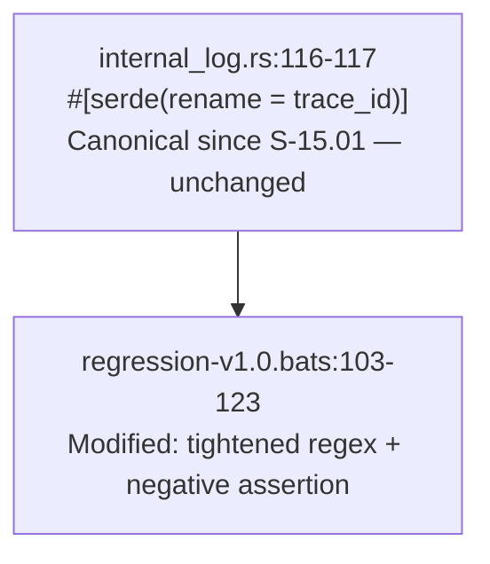
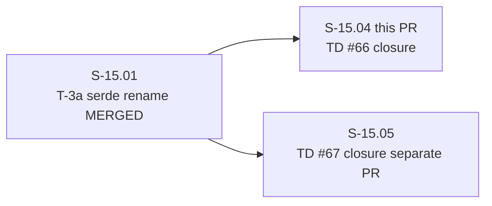
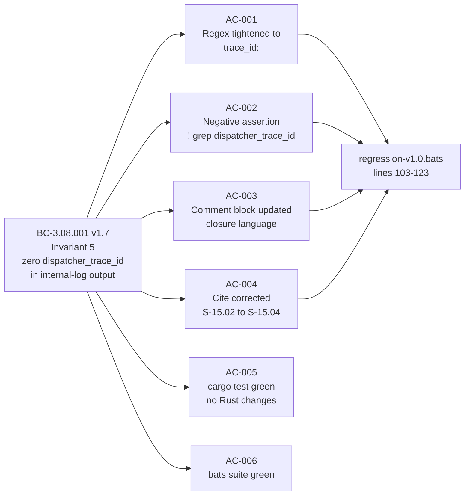
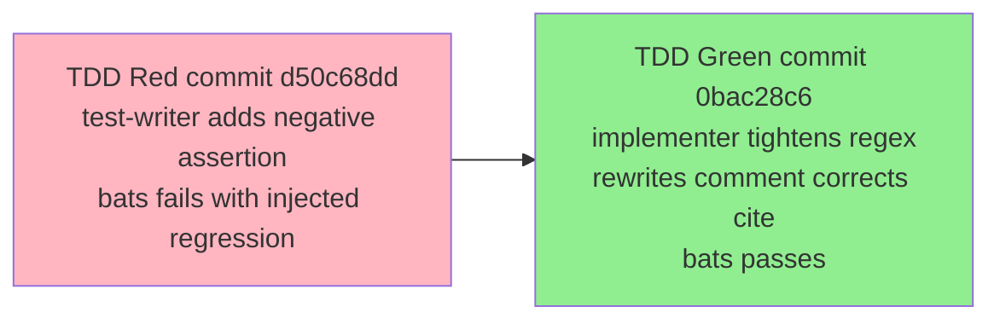

## Summary

Closes TD #66. Tightens the bats regression assertion at `regression-v1.0.bats:118` from the
transitional dual-accept regex `'"(dispatcher_)?trace_id":"'` to the canonical
`'"trace_id":"'`, and adds a new negative assertion enforcing BC-3.08.001 v1.7 Invariant 5:
zero lines in the internal log may contain the legacy `"dispatcher_trace_id"` key.

**Story:** S-15.04 — "Tighten bats trace_id assertion to canonical wire format (TD #66 closure)"
**Epic:** E-15 — Plugin Async Semantics — Registry-Layer Partition
**Mode:** brownfield
**Scope:** single-file bats edit — `plugins/vsdd-factory/tests/regression-v1.0.bats`. No Rust
source changes. No BC changes. No VP changes. No new dependencies.

---

## Architecture Changes

No architecture changes. This PR modifies only the integration test harness to enforce a
wire-format invariant that the production code already satisfies since S-15.01 merged.

**ADR:** Not required. Architect Verdict A (2026-05-15) determined this is a test-harness
canonicalization only, not an architectural decision. Decision recorded in BC-3.08.001 v1.7
and `.factory/cycles/v1.0-brownfield-backfill/architect-2026-05-15-td-66-67-split.md`.

---

## Story Dependencies

S-15.01 is already merged. The `dispatcher_trace_id` to `trace_id` serde rename on
`InternalEvent` is live in production output. S-15.04 has no remaining blockers.
S-15.05 (TD #67, de-flake async timing tests) is a separate dispatch and not a dependency
of this PR.

---

## Spec Traceability

| AC | Behavioral Contract | Test | Status |
|----|--------------------|----- |--------|
| AC-001 | BC-3.08.001 Inv 5 — canonical regex | `regression-v1.0.bats:118` regex `'"trace_id":"'` | PASS |
| AC-002 | BC-3.08.001 Inv 5 — zero legacy key | `! grep -q '"dispatcher_trace_id"' "$log"` | PASS |
| AC-003 | BC-3.08.001 — comment accuracy | Comment block lines 114-117 updated | PASS |
| AC-004 | BC-3.08.001 — cite correction | `S-15.02` corrected to `S-15.04` | PASS |
| AC-005 | BC-3.08.001 — no Rust changes | `cargo test --workspace --all-targets` green | PASS |
| AC-006 | BC-3.08.001 — bats suite green | `./run-all.sh` on regression-v1.0 suite | PASS |

---

## Test Evidence

### Coverage Summary

| Metric | Value | Notes |
|--------|-------|-------|
| Bats assertions added | 1 new negative assertion | `! grep -q '"dispatcher_trace_id"' "$log"` |
| Bats assertions tightened | 1 regex narrowed | `'"(dispatcher_)?trace_id":"'` to `'"trace_id":"'` |
| cargo test result | PASS (all targets) | No Rust source changes; existing suite unaffected |
| bats suite result | PASS | `./run-all.sh` on regression-v1.0 |
| Regressions | 0 | |

### TDD Red-to-Green Pattern

| Step | Action | Result |
|------|--------|--------|
| T-1 | Located `regression-v1.0.bats:103-123`, confirmed transitional regex on line 118 | Verified |
| T-2 (red) | Added `! grep -q '"dispatcher_trace_id"' "$log"` assertion; injected fake `dispatcher_trace_id` line into log producer | Bats FAILED (red gate confirmed) |
| T-2 (revert) | Reverted injection | Clean |
| T-3 (green) | Tightened regex from `'"(dispatcher_)?trace_id":"'` to `'"trace_id":"'` | Bats PASSED |
| T-4 | Updated comment block; corrected `S-15.02` cite to `S-15.04` | Complete |
| T-5 | Pre-flight 4-gate: fmt, clippy, cargo test, bats | All PASS |

### Pre-Flight 4-Gate Results

| Gate | Command | Result |
|------|---------|--------|
| fmt | `cargo fmt --check --all` | PASS |
| clippy | `cargo clippy --workspace --all-targets -- -D warnings` | PASS |
| cargo test | `cargo test --workspace --all-targets` | PASS |
| bats | `cd plugins/vsdd-factory/tests && ./run-all.sh` | PASS |

---

## Demo Evidence

N/A — test-only PR (single bats file edit). No user-facing behavior changed; no visual or
interactive evidence applicable. Mirrors TD #74 doc-only PR pattern (PR #141). The integration
test itself is the evidence: `./run-all.sh` green is the observable artifact.

---

## Holdout Evaluation

N/A — evaluated at wave gate. This is a test-harness canonicalization story with no
user-observable behavioral change. Holdout scenario evaluation applies at the E-15 wave gate,
not at the individual TD-closure story level.

---

## Adversarial Review

N/A — evaluated at Phase 5 (wave-level adversarial gate). S-15.04 is a P2 test-hygiene
story with sub-day scope. Architect adjudication (Verdict A, 2026-05-15) classified it as
internal-log canonicalization only with zero ABI impact.

---

## Security Review

N/A — no new code, no new dependencies, no production Rust source changes. The only changed
file is `plugins/vsdd-factory/tests/regression-v1.0.bats` (test runner shell script). No
injection surface, no auth logic, no I/O path changes. Security review pending light-scan
confirmation in PR lifecycle step 4.

---

## Risk Assessment

### Blast Radius

- **Systems affected:** Integration test suite only (`regression-v1.0.bats`)
- **User impact:** None if failure — test-only; tighter assertion catches future regressions
- **Data impact:** None
- **Risk Level:** LOW

### Performance Impact

No performance impact. Bats test-only change; no production code path modified.

---

## Traceability

| Requirement | Story AC | Test | Verification | Status |
|-------------|---------|------|-------------|--------|
| BC-3.08.001 Inv 5 | AC-001 | `regression-v1.0.bats:118` canonical regex | bats | PASS |
| BC-3.08.001 Inv 5 | AC-002 | `! grep -q '"dispatcher_trace_id"' "$log"` | bats | PASS |
| BC-3.08.001 | AC-003 | Comment block updated | review | PASS |
| BC-3.08.001 | AC-004 | Cite `S-15.04` corrected | review | PASS |
| BC-3.08.001 | AC-005 | `cargo test --workspace --all-targets` | CI | PASS |
| BC-3.08.001 | AC-006 | `./run-all.sh` green | bats/CI | PASS |

### Key References

- Story spec: `.factory/stories/S-15.04-internal-log-trace-id-canonicalization.md`
- Architect decision: `.factory/cycles/v1.0-brownfield-backfill/architect-2026-05-15-td-66-67-split.md`
- BC-3.08.001 v1.7 Invariant 5 (zero `dispatcher_trace_id` in internal-log output)
- PR #113 (origin of transitional `(dispatcher_)?` optional-group workaround being removed)
- S-15.01 (T-3a serde rename — merged; source of truth: `internal_log.rs:116-117`)

---

## Pre-Merge Checklist

- [x] Story spec AC-001 through AC-006 all satisfied
- [x] TDD red gate verified (negative assertion fails with injected regression)
- [x] TDD green — bats suite passes with tightened regex + negative assertion
- [x] cargo fmt --check passes
- [x] cargo clippy passes
- [x] cargo test --workspace --all-targets passes
- [x] No Rust source changes (architect compliance rule enforced)
- [x] HOST_ABI.md untouched (dispatcher_trace_id envelope field preserved)
- [x] No AI attribution in commits or PR body
- [x] No demo recording (test-only PR; mirrors TD #74 pattern)
- [ ] CI green (awaiting)
- [ ] PR review: 0 Critical / 0 Important findings
- [ ] Security review: clear (test-only; no new code or dependencies)
- [ ] Squash-merge to develop
