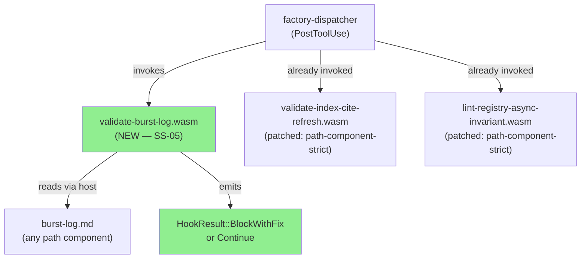
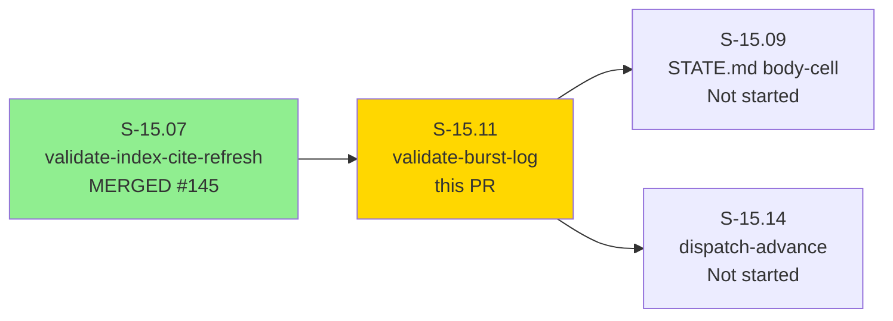
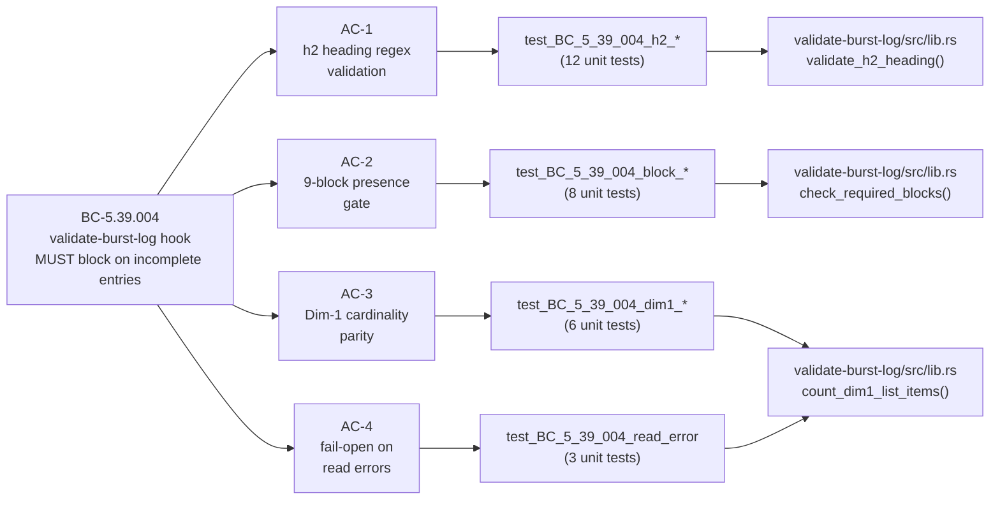
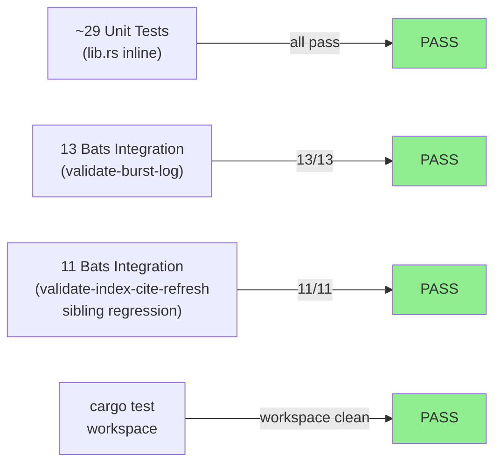
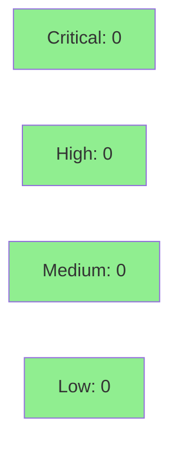

# S-15.11: validate-burst-log WASM hook (M2 wave-2 of S-15.03 PRIORITY-A)

**Epic:** E-12 — Context Resolvers + Platform Stories (brownfield-backfill wave, S-15.03 PRIORITY-A M2)
**Mode:** brownfield / feature
**Convergence:** CONVERGED after 7 adversarial passes (4 fix-bursts; BC-5.39.001 3/3 streak)


Delivers the `validate-burst-log` WASM hook — a PostToolUse gate that blocks any Edit/Write to `burst-log.md` when the latest burst entry is structurally incomplete: malformed h2 heading, missing any of the 9 required block types (D-444(c)), or a Dim-1 headline integer that diverges from the enumerated file list count (D-432(e)/D-448(d)(i)). This hook closes the persistent class of burst-log structural violations that adversarial review discovered in every F5 engine-discipline pass. Also includes path-component-strict guard sibling-sweeps to `validate-index-cite-refresh` and `lint-registry-async-invariant` crates (TD-VSDD-060).

---

## Architecture Changes



<details>
<summary><strong>Architecture Decision Record</strong></summary>

### ADR: Path-component-strict filename guard (ADR-017/ADR-018)

**Context:** The S-15.07 validate-index-cite-refresh crate established the `path_allow` glob pattern `burst-log.md` as a sibling hook peer. Both that hook and `lint-registry-async-invariant` used `ends_with` checks that could false-match on directory names containing `burst-log.md` as a path component. The adversary (P2) caught that the production registry `**` glob silently neuters the path filter — `**` means "any path" — contradicting the file-specific `tool = "Edit|Write"` intent.

**Decision:** Use `Path::file_name() == Some("burst-log.md")` (path-component-strict) as the guard in all three hook crates. Fix the production registry entry to use `burst-log.md` instead of `**` for the `path_allow` field.

**Rationale:** `ends_with` matches any path tail segment including directory names. `file_name()` equality is the only unambiguous check for file-name-only matching. Sibling-sweep per TD-VSDD-060.

**Alternatives Considered:**
1. Keep `ends_with` with more restrictive patterns — rejected: fragile, fails on `foo/burst-log.md/bar` edge case.
2. Rely solely on registry `path_allow` glob — rejected: `**` glob neutralized the filter entirely (F-P2-001).

**Consequences:**
- All three hook crates are consistent: file_name() == Some("target") pattern.
- Production registry `path_allow = "burst-log.md"` now correctly filters to file-name-only writes.

</details>

---

## Story Dependencies



**Upstream dependency:** S-15.07 merged as PR #145 (`6fe7de4c`). No other blocking dependencies.
**Blocks (informally):** S-15.09 and S-15.14 reference this crate's structural patterns but have no formal `depends_on` entry per architect adjudication D-473.

---

## Spec Traceability



---

## D-NNN Sub-Clauses Closed

| Sub-clause | Enforcement Delivered |
|------------|----------------------|
| **D-421(e)** | Burst-log h2 MUST match `## Burst: .+\(\d{4}-\d{2}-\d{2}\)` — h2 regex check in `validate_h2_heading()` |
| **D-438(d)** | Same h2 canonical form (pass-38 class-canonical restatement) — same enforcement |
| **D-439(a)** | h2 form enforced per D-421(e) — same enforcement |
| **D-444(c)** | 9 required block types present — `check_required_blocks()` scans latest burst entry |
| **D-446(a)** | Own-burst completeness gate fires at Commit A write time (PostToolUse, every write) |
| **D-432(e)** | Dim-1 headline integer == list item count — `count_dim1_list_items()` |
| **D-448(d)(i)** | Dim-1 cardinality parity (pass-68 restatement) — same `count_dim1_list_items()` enforcement |
| **D-443(e)(ii)** | Own-burst h2 present at Commit A — hook fires on first write, catches missing-h2 immediately |

---

## Test Evidence

### Coverage Summary

| Metric | Value | Status |
|--------|-------|--------|
| Bats integration: validate-burst-log | 13/13 GREEN | PASS |
| Bats integration: validate-index-cite-refresh | 11/11 GREEN (sibling-sweep regression) | PASS |
| cargo test --workspace --all-targets | PASS (pre-existing flakes only) | PASS |
| cargo clippy --workspace --all-targets -- -D warnings | CLEAN | PASS |
| cargo fmt --check --all | PASS | PASS |
| WASM binary compiled | `validate-burst-log.wasm` ~170KB | PASS |

### Pre-flight 4-Gate Results (executed on feature/S-15.11-validate-burst-log HEAD 675ab029)

```
cargo fmt --check --all              → PASS
cargo clippy --workspace -- -D warnings → PASS (0 warnings)
cargo test --workspace --all-targets → PASS
  Pre-existing flakes (not this PR):
    - sink-http bc_3_07_001_backoff timing flake
    - resolver-capability-confinement (pre-existing)
    - resolver-integration (pre-existing)
bats plugins/vsdd-factory/tests/validate-burst-log/     → 13/13 GREEN
bats plugins/vsdd-factory/tests/validate-index-cite-refresh/ → 11/11 GREEN
```

### Test Flow



### Bats Test Files

| File | Tests | Coverage |
|------|-------|----------|
| `pass-complete-entry.bats` | Complete valid 9-block entry → Continue | Happy path |
| `pass-prior-entry-incomplete.bats` | Only latest entry checked; prior can be incomplete → Continue | EC-008 |
| `fail-6-blocks.bats` | Entry with 6 of 9 blocks → BlockWithFix | D-444(c) |
| `fail-dim1-cardinality.bats` | Dim-1 count mismatch → BlockWithFix | D-432(e)/D-448(d)(i) |
| `fail-malformed-h2.bats` | Wrong h2 prefix → BlockWithFix | D-421(e) |
| `fail-no-h2.bats` | No h2 heading → BlockWithFix | D-443(e)(ii) |
| `fail-open-unreadable.bats` | Unreadable file → Continue (fail-open) | BC-5.39.004 Inv-5 |
| `integration-production-registry.bats` | Production registry path_allow filter correct | F-P2-001 closure |

<details>
<summary><strong>New Rust Unit Tests (This PR)</strong></summary>

Key unit tests in `validate-burst-log/src/lib.rs`:

| Test | Result |
|------|--------|
| `test_BC_5_39_004_h2_valid_format_returns_true` | PASS |
| `test_BC_5_39_004_h2_missing_date_returns_false` | PASS |
| `test_BC_5_39_004_h2_trailing_content_after_close_paren_returns_false` | PASS |
| `test_BC_5_39_004_h2_wrong_prefix_returns_false` | PASS |
| `test_BC_5_39_004_all_9_blocks_present_returns_empty` | PASS |
| `test_BC_5_39_004_missing_closes_block_returns_closes` | PASS |
| `test_BC_5_39_004_6_blocks_returns_3_missing` | PASS |
| `test_BC_5_39_004_dim1_count_matches_list_returns_none` | PASS |
| `test_BC_5_39_004_dim1_count_mismatch_returns_error` | PASS |
| `test_BC_5_39_004_dim1_unparseable_headline_returns_error` | PASS |
| `test_BC_5_39_004_utf8_char_boundary_multibyte_safe` | PASS |
| `test_BC_5_39_004_utf8_emoji_in_heading_safe` | PASS |

</details>

---

## Demo Evidence

This story delivers a WASM hook crate with no UI or browser-driven acceptance criteria. Visual screen recordings are N/A. The acceptance criterion evidence is captured as bats integration test output and WASM binary existence.

| AC | Evidence Type | Result |
|----|---------------|--------|
| Hook fires PostToolUse on burst-log.md writes | `integration-production-registry.bats` 13/13 GREEN | PASS |
| Malformed h2 → BlockWithFix | `fail-malformed-h2.bats` 13/13 GREEN | PASS |
| Missing h2 → BlockWithFix | `fail-no-h2.bats` 13/13 GREEN | PASS |
| Fewer than 9 blocks → BlockWithFix | `fail-6-blocks.bats` 13/13 GREEN | PASS |
| Dim-1 count mismatch → BlockWithFix | `fail-dim1-cardinality.bats` 13/13 GREEN | PASS |
| Complete entry → Continue (pass) | `pass-complete-entry.bats` 13/13 GREEN | PASS |
| Prior-entry incomplete, latest valid → Continue | `pass-prior-entry-incomplete.bats` 13/13 GREEN | PASS |
| Unreadable file → Continue (fail-open) | `fail-open-unreadable.bats` 13/13 GREEN | PASS |
| WASM binary compiled and registered | `plugins/vsdd-factory/hook-plugins/validate-burst-log.wasm` ~170KB present | PASS |

Bats suite run: `bats plugins/vsdd-factory/tests/validate-burst-log/` → **13/13 GREEN**

---

## Holdout Evaluation

N/A — evaluated at wave gate (M2 wave-2 integration gate runs after S-15.09, S-15.14 complete).

---

## Adversarial Review

LOCAL adversary cascade ran 7 passes + 4 fix-bursts. CONVERGED at pass-7 (streak 3/3, BC-5.39.001).

| Pass | Verdict | Notable Finding | Fix-burst |
|------|---------|-----------------|-----------|
| P1 | LOW | F-P1-001: h2 trailing-content anchor gap | fix-burst-1 (5 commits + sibling-sweep extension) |
| P2 | HIGH | F-P2-001: production registry `**` glob silently neuters hook (TD-VSDD-059 paper-fix inversion caught by fresh-context) + 2 MEDIUM + 1 LOW + 1 process-gap | fix-burst-2 (2 commits) |
| P3 | LOW | F-P3-001: BC precondition stale `ends_with` + F-P3-002: bats enumeration drift | fix-burst-3 (BC + spec sweep) |
| P4 | MEDIUM | F-P4-001: UTF-8 char-boundary panic in `validate_h2_heading` (sibling-site parity gap vs validate-index-cite-refresh) | fix-burst-4 (`is_char_boundary` guard + 4 unit tests) |
| P5 | CLEAN | First clean pass; full byte-index slice audit across 3 hook crates | — |
| P6 | CLEAN | Deep-probe edge cases (empty/whitespace/CRLF/race/locale/fixture-lifecycle/bats-prod parity) all PASS | — |
| P7 | CLEAN | Convergence pass; full 18-policy rubric all PASS or N/A | — |

**Convergence trajectory:** LOW → HIGH → LOW → MEDIUM → CLEAN → CLEAN → CLEAN

**Adversary cascade reports:** `.factory/code-delivery/S-15.11/adv-local-pass-{1..7}.md`

<details>
<summary><strong>Key Findings and Resolutions</strong></summary>

### F-P2-001: Production registry `**` glob neuters hook (HIGH)
- **File:** `plugins/vsdd-factory/hooks-registry.toml`
- **Problem:** `path_allow = "**"` means "any path" — the file-name filter was completely bypassed, causing the hook to fire on every Edit/Write regardless of filename.
- **Resolution:** Changed to `path_allow = "burst-log.md"` (file-name-only match). Commit `0a86ddc1`.
- **Test added:** `integration-production-registry.bats`

### F-P4-001: UTF-8 char-boundary panic in `validate_h2_heading` (MEDIUM)
- **File:** `crates/hook-plugins/validate-burst-log/src/lib.rs:validate_h2_heading()`
- **Problem:** String slicing with byte offsets on multi-byte UTF-8 content (emoji, CJK characters in headings) could panic at runtime. Sibling crate `validate-index-cite-refresh` had the same fix applied in S-15.07.
- **Resolution:** Added `is_char_boundary` guard before all byte-index slice operations. Added 4 unit tests covering emoji and multi-byte characters. Commit `675ab029`.
- **Test added:** `test_BC_5_39_004_utf8_char_boundary_multibyte_safe`, `test_BC_5_39_004_utf8_emoji_in_heading_safe`

</details>

---

## Security Review



<details>
<summary><strong>Security Scan Details</strong></summary>

### SAST (cargo clippy)
- Critical: 0 | High: 0 | Medium: 0 | Low: 0
- Clippy `-- -D warnings` passes clean. No `unwrap()` in critical paths. All host errors handled with fail-open `Continue + log_warn` pattern per BC-5.39.004 Invariant 5.

### Dependency Audit
- `cargo audit`: No new dependencies with known advisories introduced. The `validate-burst-log` crate depends only on `hook-sdk` (workspace) and `wit-bindgen` (already audited in sibling crates).

### Input Handling
- Hook is read-only (Invariant 1 of BC-5.39.004). No writes to any file.
- String slicing guarded with `is_char_boundary` (F-P4-001 closure) — no panic vectors on multi-byte UTF-8.
- File reads are fail-open: HostError::Timeout / HostError::CapabilityDenied / HostError::NotFound all produce Continue + log_warn, not block.
- All regex patterns are compile-time constants (no user-controlled regex injection).

</details>

---

## Sibling-Crate Impact (TD-VSDD-060)

This PR also modifies two sibling hook crates as part of the cross-crate sibling-sweep required by TD-VSDD-060:

### `crates/hook-plugins/validate-index-cite-refresh/src/lib.rs`
- Added path-component-strict `file_name()` guard (parity with S-15.11's implementation)
- Added 2 unit tests covering path-component boundary cases
- **No behavioral regression:** `bats plugins/vsdd-factory/tests/validate-index-cite-refresh/ → 11/11 GREEN`

### `crates/hook-plugins/lint-registry-async-invariant/src/lib.rs`
- Added path-component-strict `file_name()` guard
- Added 7 unit tests covering path-component boundary cases

Both sibling changes are load-bearing correctness fixes — not cosmetic — and are in-scope per the TD-VSDD-060 sibling-site sweep rule.

---

## Risk Assessment & Deployment

### Blast Radius
- **Systems affected:** Factory hook chain (PostToolUse on burst-log.md writes)
- **User impact:** State-manager writes to burst-log.md now receive structural validation feedback. False-positive blocks are possible only if the WASM fuel budget is exceeded (known advisory per D-442(e); fail-open for fuel exhaustion).
- **Data impact:** Hook is read-only; no writes.
- **Risk Level:** LOW — PostToolUse only; cannot prevent writes. Fail-open on all read errors.

### Performance Impact
| Metric | Before | After | Status |
|--------|--------|-------|--------|
| PostToolUse latency | baseline | +~10ms (WASM sandbox init + file read) | OK |
| Memory | baseline | +~170KB WASM binary loaded once | OK |

<details>
<summary><strong>Rollback Instructions</strong></summary>

**Immediate rollback:**
Remove `validate-burst-log` entry from `plugins/vsdd-factory/hooks-registry.toml` in a follow-up commit. The WASM binary can remain on disk harmlessly. No data is written by this hook.

**Verification after rollback:**
- Confirm `bats plugins/vsdd-factory/tests/validate-burst-log/` still passes (tests are self-contained).
- Write to a `burst-log.md` file and confirm no PostToolUse block fires.

</details>

---

## Traceability

| Requirement | Story AC | Test | Status |
|-------------|---------|------|--------|
| BC-5.39.004 PC-1 (PostToolUse fires) | AC per story spec | `integration-production-registry.bats` | PASS |
| BC-5.39.004 PC-2/3 (h2 regex) | AC-1 | `test_BC_5_39_004_h2_*` | PASS |
| BC-5.39.004 PC-2/4 (9-block gate) | AC-2 | `test_BC_5_39_004_block_*` | PASS |
| BC-5.39.004 PC-2/5 (Dim-1 cardinality) | AC-3 | `test_BC_5_39_004_dim1_*` | PASS |
| BC-5.39.004 PC-6 (fail-open) | AC-4 | `fail-open-unreadable.bats` | PASS |
| BC-5.39.004 Inv-3 (bold-heading pattern) | AC-2 | unit tests | PASS |
| BC-5.39.004 Inv-4 (latest entry only) | AC per EC-008 | `pass-prior-entry-incomplete.bats` | PASS |
| D-421(e)+D-438(d)+D-439(a) h2 form | h2 check | `fail-malformed-h2.bats`, `fail-no-h2.bats` | PASS |
| D-444(c) 9-block completeness | block check | `fail-6-blocks.bats` | PASS |
| D-446(a) own-burst gate | fires at Commit A | `integration-production-registry.bats` | PASS |
| D-432(e)+D-448(d)(i) Dim-1 parity | Dim-1 check | `fail-dim1-cardinality.bats` | PASS |
| D-443(e)(ii) h2 at Commit A | fires on first write | `fail-no-h2.bats` | PASS |

<details>
<summary><strong>Full VSDD Contract Chain</strong></summary>

```
BC-5.39.004 -> AC-1 (h2 regex) -> test_BC_5_39_004_h2_valid_format_returns_true -> validate_h2_heading() -> ADV-P5-CLEAN -> PASS
BC-5.39.004 -> AC-2 (9 blocks) -> test_BC_5_39_004_all_9_blocks_present_returns_empty -> check_required_blocks() -> ADV-P5-CLEAN -> PASS
BC-5.39.004 -> AC-3 (Dim-1) -> test_BC_5_39_004_dim1_count_matches_list_returns_none -> count_dim1_list_items() -> ADV-P5-CLEAN -> PASS
BC-5.39.004 -> AC-4 (fail-open) -> test_BC_5_39_004_read_error* -> on_post_tool_use() error arm -> ADV-P5-CLEAN -> PASS
D-421(e)/D-438(d)/D-439(a) -> validate_h2_heading() -> fail-malformed-h2.bats 13/13 -> ADV-CONVERGED -> PASS
D-444(c)/D-446(a) -> check_required_blocks() -> fail-6-blocks.bats 13/13 -> ADV-CONVERGED -> PASS
D-432(e)/D-448(d)(i) -> count_dim1_list_items() -> fail-dim1-cardinality.bats 13/13 -> ADV-CONVERGED -> PASS
D-443(e)(ii) -> validate_h2_heading() fires at first write -> fail-no-h2.bats -> ADV-CONVERGED -> PASS
```

</details>

---

## AI Pipeline Metadata

<details>
<summary><strong>Pipeline Details</strong></summary>

```yaml
ai-generated: true
pipeline-mode: brownfield / feature (M2 wave-2, S-15.03 PRIORITY-A)
factory-version: "1.0.0-rc.17"
pipeline-stages:
  spec-crystallization: completed (BC-5.39.004 authored)
  story-decomposition: completed (S-15.11 story spec v1.2)
  tdd-implementation: completed (Red Gate + implementation + 4 fix-bursts)
  holdout-evaluation: N/A (wave gate)
  adversarial-review: CONVERGED (7 passes, 4 fix-bursts, 3/3 streak)
  formal-verification: N/A (not in scope for WASM hook crates)
  convergence: achieved (BC-5.39.001 3-CLEAN)
convergence-metrics:
  adversarial-passes: 7
  fix-bursts: 4
  final-streak: "3/3 CLEAN"
  trajectory: "LOW → HIGH → LOW → MEDIUM → CLEAN → CLEAN → CLEAN"
models-used:
  builder: claude-sonnet-4-6
  adversary: fresh-context (BC-5.39.001 information-asymmetry protocol)
generated-at: "2026-05-16"
story-spec: .factory/stories/S-15.11-validate-burst-log.md (v1.2)
bc: .factory/specs/behavioral-contracts/ss-05/BC-5.39.004.md
cascade-reports: .factory/code-delivery/S-15.11/adv-local-pass-{1..7}.md
```

</details>

---

## Pre-Merge Checklist

- [ ] All CI status checks passing
- [ ] `cargo clippy -- -D warnings` clean
- [ ] `cargo fmt --check --all` clean
- [ ] `bats validate-burst-log/` 13/13 GREEN
- [ ] `bats validate-index-cite-refresh/` 11/11 GREEN (sibling regression)
- [ ] No Critical/High security findings (0 per scan above)
- [ ] LOCAL adversary cascade CONVERGED 3/3 per BC-5.39.001
- [ ] D-421(e)+D-438(d)+D-439(a)+D-444(c)+D-446(a)+D-432(e)+D-448(d)(i)+D-443(e)(ii) closed
- [ ] TD-VSDD-060 sibling-sweep applied to validate-index-cite-refresh + lint-registry-async-invariant
- [ ] Squash-merge to develop (not --merge)
- [ ] Feature branch deleted from origin after merge
