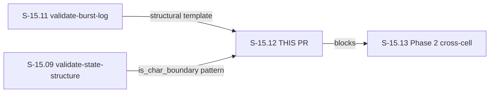
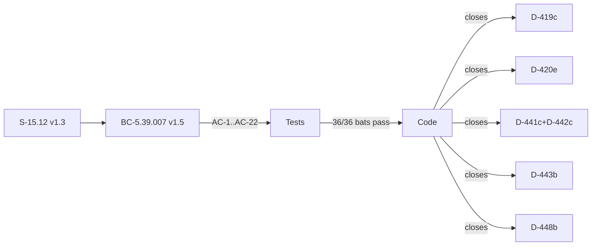

# S-15.12: validate-closes-completeness WASM hook Phase 1

## Summary

New PostToolUse WASM hook (priority 156) that mechanically blocks Closes annotation
structural violations at write time, closing 6 D-NNN sub-clauses that the F5
engine-discipline cycle adversary found recurring across 39+ passes:

- **Missing/empty `**Closes:**` lines** in lessons.md entries (D-448(b))
- **Forbidden per-mechanism annotations** in Closes blocks (D-419(c)+D-420(e))
- **Bare umbrella citation ranges** without sample-vs-exhaustive flag (D-441(c)+D-442(c))
- **Undeclared documentary-historical exemptions** (D-443(b))

Fires on Edit/Write to `decision-log.md`, `STATE.md`, `INDEX.md`, `lessons.md`
using path-component-strict in-plugin guards. Fail-open: unreadable file returns Continue.

## Architecture Changes

```mermaid
graph TD
    A[Edit/Write tool call] -->|PostToolUse| B[factory-dispatcher]
    B -->|priority 156| C[validate-closes-completeness.wasm]
    C --> D{arm routing}
    D -->|lessons.md| E[lesson-entry detection<br/>D-448(b)+D-443(b)+D-420(e)+D-419(c)]
    D -->|STATE.md| F[umbrella-flag check<br/>D-441c+D-442c]
    D -->|INDEX.md| G[umbrella-flag check<br/>D-441c+D-442c]
    D -->|decision-log.md| H[umbrella-flag check<br/>D-441c+D-442c]
    E --> I{violations?}
    F --> I
    G --> I
    H --> I
    I -->|0 violations| J[HookResult::Continue]
    I -->|≥1 violation| K[HookResult::BlockWithFix<br/>all violations enumerated]
```

## Story Dependencies



## Spec Traceability



## Files Changed

### New files — Rust crate (3)
- `crates/hook-plugins/validate-closes-completeness/Cargo.toml`
- `crates/hook-plugins/validate-closes-completeness/src/lib.rs`
- `crates/hook-plugins/validate-closes-completeness/src/main.rs`

### New file — WASM binary (1)
- `plugins/vsdd-factory/hook-plugins/validate-closes-completeness.wasm` (179,892 bytes)

### New files — bats integration tests (21)
- `plugins/vsdd-factory/tests/validate-closes-completeness/*.bats` (21 files; AC-1..AC-22 except AC-19)

### New files — test fixtures (19 directories)
- `plugins/vsdd-factory/tests/fixtures/validate-closes-completeness/` (19 fixture dirs; `fail-open-unreadable` has no fixture by design — harness arranges unreadable file)

### Modified files (4)
- `Cargo.toml` — workspace member registration
- `Cargo.lock` — lockfile update
- `plugins/vsdd-factory/hooks-registry.toml` — new `[[hooks]]` entry at priority 156
- `plugins/vsdd-factory/tests/run-all.sh` — glob inclusion for new test suite

## Test Evidence

| Gate | Result |
|------|--------|
| bats integration tests | 36/36 PASS |
| cargo unit tests | 43/43 PASS |
| `cargo fmt --check --all` | CLEAN |
| `cargo clippy --workspace --all-targets -- -D warnings` | CLEAN |
| WASM compilation (`cargo build --release --target wasm32-wasip1`) | CLEAN |

## LOCAL Adversary Cascade

**Protocol:** BC-5.39.001 3-CLEAN convergence  
**Budget:** 8 passes  
**Result: CONVERGED 3/3**

| Pass | Findings | Disposition |
|------|----------|-------------|
| 1 | 4 findings | Fix burst |
| 2 | 2 findings | Fix burst |
| 3 | 0 findings | streak=1/3 |
| 4 | 0 findings | streak=2/3 |
| 5 | 1 finding | Fix burst; streak reset |
| 6 | 0 findings | streak=1/3 |
| 7 | 0 findings | streak=2/3 |
| 8 | 0 findings | streak=3/3 — CONVERGED |

Trajectory: `4→2→0→0→1→0→0→0`

## Security Review

N/A — no network I/O, no user input, no auth. Hook reads `.factory/` governance artifacts
via `host::read_file` sandbox with path allowlist declared in hooks-registry.toml.
No injection vectors: content is markdown text scanned via hand-rolled `str::contains`
and `str::starts_with` (no regex crate — WASM fuel budget constraint).

## BC Traceability

| BC ID | Title | Version | Postconditions Exercised |
|-------|-------|---------|--------------------------|
| BC-5.39.007 | validate-closes-completeness Phase 1 WASM hook | v1.5 | PC1, PC3, PC4, PC5, PC6; postconditions 1-10; invariants 1-10; EC-001..EC-022 |

Story: S-15.12 v1.3

## D-NNN Sub-Clauses Closed

| Sub-clause | Enforcement |
|------------|-------------|
| D-419(c) | Malformed cite ID detection in `**Closes:**` lines |
| D-420(e) | Forbidden per-mechanism annotation pattern match |
| D-441(c) | Bare umbrella cite `D-\d+..D-\d+` without sample-vs-exhaustive flag |
| D-442(c) | Retroactive sweep — same umbrella check on every write |
| D-443(b) | Silent exemption detection — lessons.md entry must declare exemption or have Closes |
| D-448(b) | Missing `**Closes:**` bold-prefix line in lessons.md entries |

## Risk Assessment

- **Blast radius:** Low — PostToolUse hook, fail-open. Unreadable or malformed files return Continue. No writes to any file.
- **Performance impact:** Negligible — 5000 ms timeout; hand-rolled string scanning on typically <50 KB governance artifacts.
- **Cross-site staleness:** Advisory-only in Phase 1 (correct format, nonexistent D-NNN → Continue + log_warn). Phase 2 (S-15.13) adds blocking validation.

## Pre-Merge Checklist

- [x] New crate at canonical path `crates/hook-plugins/validate-closes-completeness/`
- [x] All 4 path guards use `Path::file_name()`, NOT `ends_with`
- [x] `host::read_file` max_bytes = 524288 (512 KiB)
- [x] `is_char_boundary()` guards on all byte-index slices
- [x] Fail-open for all `host::read_file` errors
- [x] Cross-site staleness is advisory-only (Phase 1)
- [x] `### Closes` h3 heading in lessons.md is a BLOCK
- [x] `cited_raw: String` in Violation struct
- [x] No `regex` crate in Cargo.toml
- [x] Registry priority = 156 (155 is taken by validate-stable-anchors PreToolUse)
- [x] No `--no-verify` in git commits
- [x] No AI attribution in commit message
- [x] LOCAL adversary CONVERGED 3/3
- [x] 36/36 bats + 43/43 cargo tests pass
- [x] fmt/clippy clean
