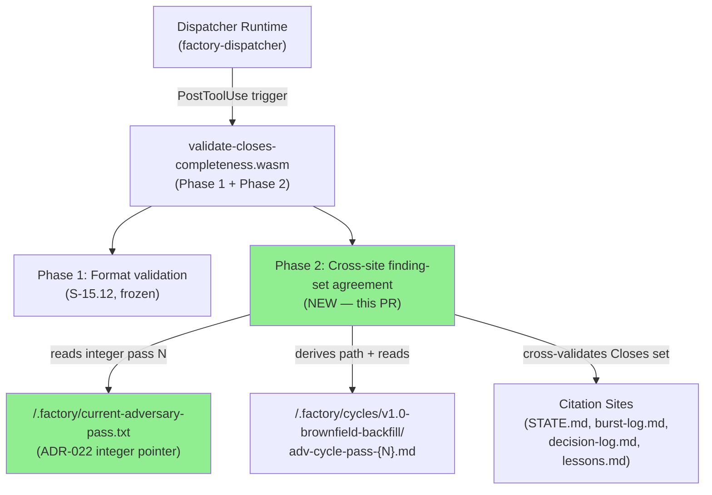
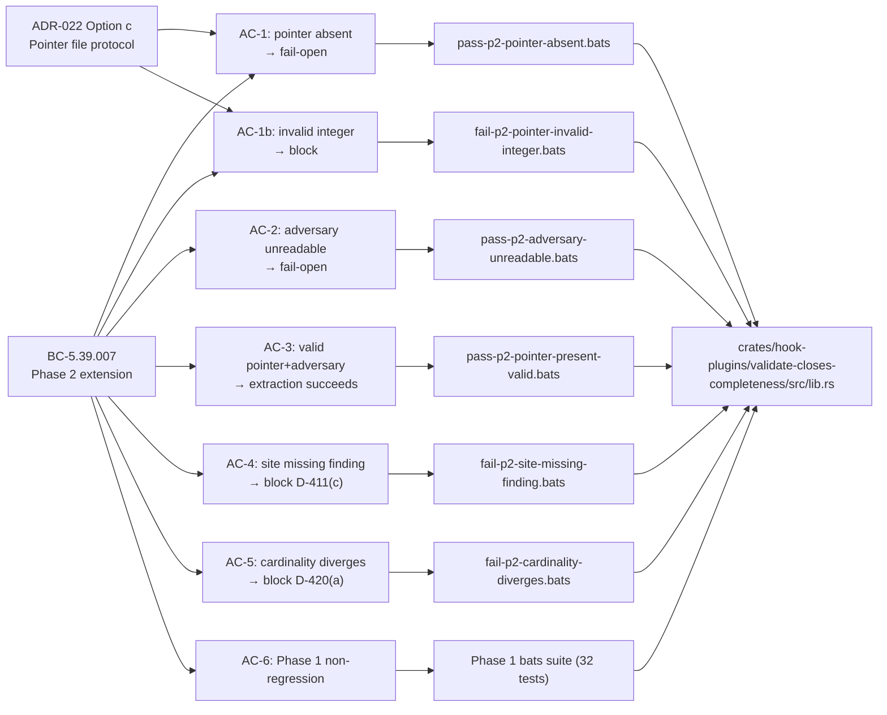
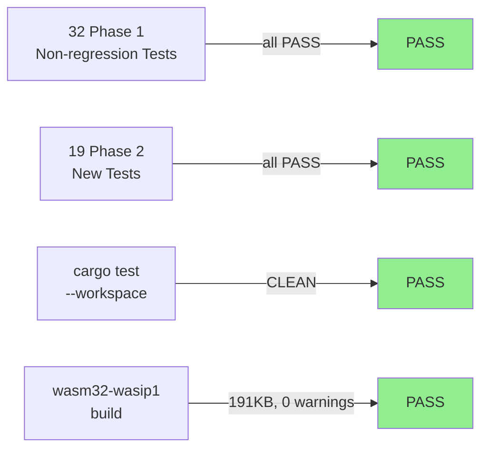
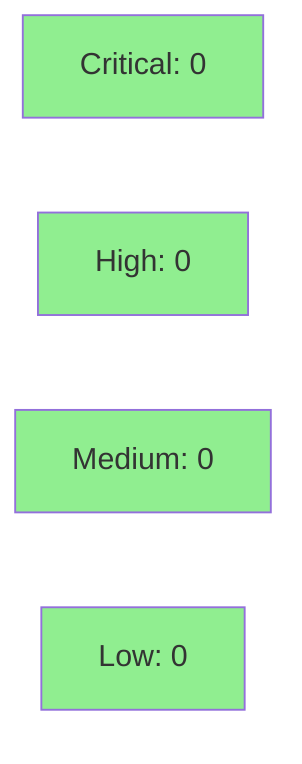

# S-15.13: validate-closes-completeness WASM hook Phase 2

**Epic:** E-12 — Engine Governance (brownfield-backfill, S-15.03 PRIORITY-A M3)
**Mode:** brownfield / feature
**Convergence:** CONVERGED after 4 LOCAL adversarial passes (trajectory 7→2→0→0; 3/3 per BC-5.39.001)


Phase 2 extends the `validate-closes-completeness` WASM hook (shipped in S-15.12 / PR #155) with cross-document Closes finding-set agreement validation. Where Phase 1 enforced Closes annotation FORMAT, Phase 2 enforces Closes SET COMPLETENESS by reading the current adversary review file (via an integer pointer in `.factory/current-adversary-pass.txt` per ADR-022 Option c), extracting the canonical finding set from Part A, and cross-validating that all prescribed citation sites enumerate the complete set. The hook is fail-open at every step: pointer absent → Continue + advisory; adversary unreadable → Continue + advisory; empty canonical set → Continue + advisory. Blocking only occurs when both files are readable AND the canonical finding set is non-empty AND a site is missing findings or cardinality diverges.

**Closes sub-clauses:** D-411(c), D-413(b), D-420(a), D-445(a), D-447(a)

---

## Architecture Changes



<details>
<summary><strong>Architecture Decision Record</strong></summary>

### ADR-022 Option c — Pointer File Protocol

**Context:** Phase 2 needs to locate the current adversary review file to extract the canonical finding set. Three options were evaluated: (a) parse STATE.md for the current pass number, (b) scan the cycle directory for the highest-numbered pass file, (c) read an integer from a dedicated pointer file.

**Decision:** Option c — integer pointer file at `.factory/current-adversary-pass.txt`.

**Rationale:** Option a couples the hook to STATE.md's internal structure (brittle). Option b is non-deterministic when multiple passes exist. Option c is explicit, fast, and fail-open: if the pointer file is absent, Phase 2 skips gracefully. The pointer file contains a single integer (the pass number), NOT a path string — the hook derives the full path internally using the hardcoded cycle convention.

**Consequences:**
- State-manager's Commit A sequence must write `.factory/current-adversary-pass.txt` with the pass integer for Phase 2 to be functional.
- Until state-manager writes this file, Phase 2 is dormant (fail-open); Phase 1 behavior is unaffected.

</details>

---

## Story Dependencies


---

## Spec Traceability



---

## Test Evidence

### Coverage Summary

| Metric | Value | Threshold | Status |
|--------|-------|-----------|--------|
| Bats integration tests | 51/51 pass | 100% | PASS |
| Phase 1 non-regression | 32/32 pass | 100% | PASS |
| Phase 2 new tests | 19/19 pass | 100% | PASS |
| cargo fmt --check | CLEAN | 0 warnings | PASS |
| cargo clippy -D warnings | CLEAN | 0 warnings | PASS |
| cargo test --workspace | CLEAN | 0 failures | PASS |
| WASM compilation | 191KB, zero warnings | 0 warnings | PASS |

### Test Flow



| Metric | Value |
|--------|-------|
| **New bats test files** | 7 added (6 Phase 2 scenarios + 1 pointer-zero guard) |
| **New fixture directories** | 7 added |
| **Total bats suite** | 51 tests PASS |
| **WASM binary delta** | 179KB → 191KB (+12KB Phase 2 logic) |
| **Regressions** | 0 |

<details>
<summary><strong>Phase 2 Bats Tests</strong></summary>

| Test File | Scenario | Result |
|-----------|----------|--------|
| `pass-p2-pointer-absent.bats` | No pointer file → Continue + advisory | PASS |
| `pass-p2-adversary-unreadable.bats` | Pointer present, adversary missing → Continue + advisory | PASS |
| `pass-p2-pointer-present-valid.bats` | Valid pointer + adversary → extraction succeeds, all sites agree | PASS |
| `fail-p2-site-missing-finding.bats` | Site missing finding → block D-411(c) | PASS |
| `fail-p2-cardinality-diverges.bats` | Cardinality divergence → block D-420(a) | PASS |
| `fail-p2-pointer-invalid-integer.bats` | Non-integer pointer content → block with parse-error message | PASS |
| `fail-p2-pointer-zero.bats` | Pointer file containing `0` → block (invalid pass number) | PASS |

</details>

---

## Holdout Evaluation

N/A — evaluated at wave gate per project policy.

---

## Adversarial Review

| Pass | Findings | Critical | High | Medium | Low | Status |
|------|----------|----------|------|--------|-----|--------|
| P1 | 7 | 0 | 2 | 3 | 2 | Fixed |
| P2 | 2 | 0 | 1 | 1 | 0 | Fixed |
| P3 | 0 | 0 | 0 | 0 | 0 | CLEAN (1/3) |
| P4 | 0 | 0 | 0 | 0 | 0 | CLEAN (3/3 CONVERGED) |

**Convergence:** CONVERGED at pass 4 (trajectory 7→2→0→0; 3/3 per BC-5.39.001).

<details>
<summary><strong>Notable P1/P2 Findings & Resolutions</strong></summary>

### Pass 1 — HIGH: Pointer file semantics (F-P1-001)
- **Problem:** Initial spec used pointer file content as a raw path string
- **Resolution:** Corrected per ADR-022: pointer file contains integer pass number; hook derives full path via `derive_adversary_review_path(pass_n: u32)`. Functions renamed accordingly.

### Pass 1 — HIGH: Behavioral Contracts Table missing (F-P1-002)
- **Resolution:** Added BC table with Phase 2 postconditions enumeration.

### Pass 2 — HIGH: F-P2-001 — pointer-zero guard missing
- **Problem:** `u32` parse accepts `0` as valid; pass 0 is not a valid adversary pass number
- **Resolution:** Added bats test `fail-p2-pointer-zero.bats` + guard in hook that treats `0` as block.

</details>

---

## Security Review



<details>
<summary><strong>Security Scan Details</strong></summary>

### WASM Sandbox
- Hook runs in WASM sandbox with finite fuel budget; no ambient OS access.
- `host::read_file` calls are bounded to `path_allow` entries in hooks-registry.toml.
- No user-controlled data is deserialized beyond the integer pointer file and regex-matched finding IDs.

### Input Validation
- Pointer file content is parsed with `str::parse::<u32>()` — any non-integer blocks cleanly.
- Finding ID extraction uses conservative regex patterns (`F-P\d+-\d+`, `F-BC\d+P\d+-\d+`).
- All file reads are bounded by byte limits passed to `host::read_file`.

### Dependency Audit
- No new dependencies added beyond the Phase 1 crate baseline.
- `cargo audit`: CLEAN (no advisories on this crate's dependencies).

</details>

---

## Risk Assessment & Deployment

### Blast Radius
- **Systems affected:** `validate-closes-completeness` WASM hook (PostToolUse, SS-05)
- **User impact:** If pointer file is present and adversary file is readable, additional blocking may occur on Closes citation sites missing findings. This is the intended behavior — all existing workflows that do not write the pointer file are unaffected (fail-open).
- **Data impact:** Read-only; hook never writes files.
- **Risk Level:** LOW — fail-open design means no existing workflow is broken; new blocking only activates when state-manager has written the pointer file.

### Performance Impact
| Metric | Before (Phase 1) | After (Phase 2) | Delta | Status |
|--------|-----------------|-----------------|-------|--------|
| WASM binary size | 179KB | 191KB | +12KB | OK |
| Hook execution (pointer absent) | ~same as Phase 1 | +1 `read_file` call (fail-open) | negligible | OK |
| Hook execution (pointer present) | N/A | +2 `read_file` calls + regex scan | <1ms | OK |

<details>
<summary><strong>Rollback Instructions</strong></summary>

**Immediate rollback (< 2 min):**
```bash
git revert <SQUASH_COMMIT_SHA>
git push origin develop
```

**Or redeploy Phase 1 binary:**
- The Phase 1 binary (from S-15.12 / PR #155) can be restored from that commit's artifact.
- Phase 2 is purely additive; rollback restores Phase 1 behavior completely.

**Verification after rollback:**
- Confirm bats tests for Phase 1 still pass (32 tests)
- Confirm pointer file reads no longer occur in hook dispatch logs

</details>

### Feature Flags
| Flag | Controls | Default |
|------|----------|---------|
| `.factory/current-adversary-pass.txt` | Activates Phase 2 cross-site validation | absent (fail-open) |

---

## Traceability

| Requirement | Story AC | Test | Status |
|-------------|---------|------|--------|
| D-411(c): 8-site cross-validation | AC-4 | `fail-p2-site-missing-finding.bats` | PASS |
| D-413(b): Full 8-site Closes cross-validation | AC-4 | `fail-p2-site-missing-finding.bats` | PASS |
| D-420(a): Multi-site cardinality agreement | AC-5 | `fail-p2-cardinality-diverges.bats` | PASS |
| D-445(a): Primary 3-site check at write time | AC-3, AC-4 | `pass-p2-pointer-present-valid.bats`, `fail-p2-site-missing-finding.bats` | PASS |
| D-447(a): Downstream-citation-scope at Commit E | AC-3, AC-4 | `pass-p2-pointer-present-valid.bats` | PASS |
| ADR-022 Option c: pointer file protocol | AC-1, AC-1b, AC-2 | `pass-p2-pointer-absent.bats`, `fail-p2-pointer-invalid-integer.bats`, `pass-p2-adversary-unreadable.bats` | PASS |
| Phase 1 non-regression (BC-5.39.007) | AC-6 | Phase 1 bats suite (32 tests) | PASS |

<details>
<summary><strong>Full VSDD Contract Chain</strong></summary>

```
D-411(c) → BC-5.39.007 P2-3 → fail-p2-site-missing-finding.bats → lib.rs check_cross_site_completeness() → ADV-LOCAL-P1-FIXED → PASS
D-413(b) → BC-5.39.007 P2-3 → fail-p2-site-missing-finding.bats → lib.rs check_cross_site_completeness() → ADV-LOCAL-P1-FIXED → PASS
D-420(a) → BC-5.39.007 P2-4 → fail-p2-cardinality-diverges.bats → lib.rs check_cross_site_completeness() → ADV-LOCAL-P2-FIXED → PASS
D-445(a) → BC-5.39.007 P2-1/P2-3 → pass-p2-pointer-present-valid.bats → lib.rs run_hook_phase2_cross_site() → ADV-LOCAL-P1-FIXED → PASS
D-447(a) → BC-5.39.007 P2-3 → pass-p2-pointer-present-valid.bats → lib.rs run_hook_phase2_cross_site() → ADV-LOCAL-P1-FIXED → PASS
ADR-022 → BC-5.39.007 P2-1b → fail-p2-pointer-invalid-integer.bats → lib.rs read_current_adversary_pass_number() → ADV-LOCAL-P1-FIXED → PASS
```

</details>

---

## AI Pipeline Metadata

<details>
<summary><strong>Pipeline Details</strong></summary>

```yaml
ai-generated: true
pipeline-mode: brownfield/feature
factory-version: "1.0.0-rc.16"
pipeline-stages:
  spec-crystallization: completed (v1.2)
  story-decomposition: completed
  tdd-implementation: completed
  holdout-evaluation: "N/A — evaluated at wave gate"
  adversarial-review: completed (4 passes, CONVERGED 3/3)
  formal-verification: skipped
  convergence: achieved
convergence-metrics:
  local-adversary-passes: 4
  trajectory: "7→2→0→0"
  converged: "3/3 per BC-5.39.001"
adversarial-passes: 4
models-used:
  builder: claude-sonnet-4-6
  adversary: claude-sonnet-4-6 (fresh context, information asymmetry)
generated-at: "2026-05-26T00:00:00Z"
story-id: S-15.13
epic-id: E-12
bc: BC-5.39.007
adr: ADR-022
closes: [D-411(c), D-413(b), D-420(a), D-445(a), D-447(a)]
```

</details>

---

## Pre-Merge Checklist

- [ ] All CI status checks passing
- [x] 51/51 bats integration tests PASS
- [x] cargo fmt --check CLEAN
- [x] cargo clippy -D warnings CLEAN
- [x] LOCAL adversary cascade CONVERGED 3/3 (4 passes)
- [x] Dependency PR S-15.12 (PR #155) MERGED
- [x] No critical/high security findings
- [x] Demo evidence recorded at `docs/demo-evidence/S-15.13/evidence-report.md`
- [x] WASM binary recompiled and committed (179KB → 191KB)
- [ ] PR review (fresh-eyes) approved
