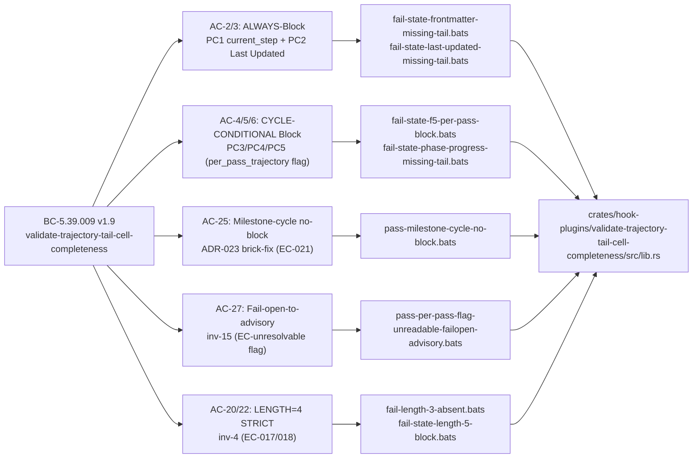
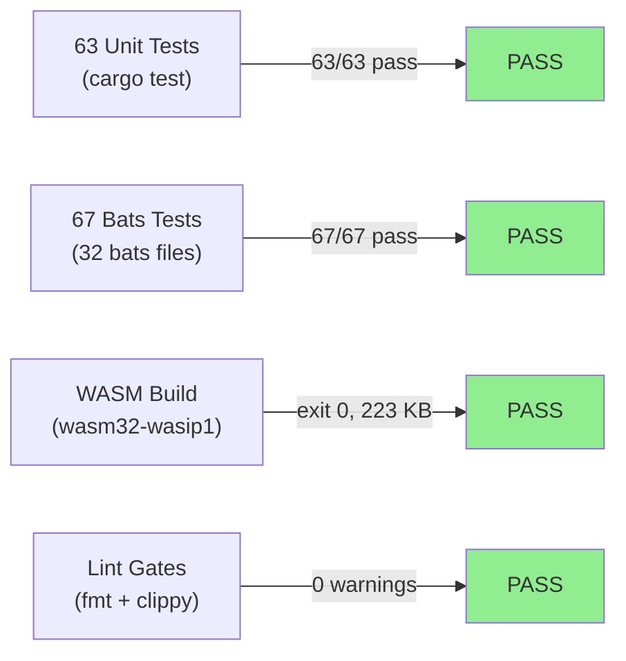
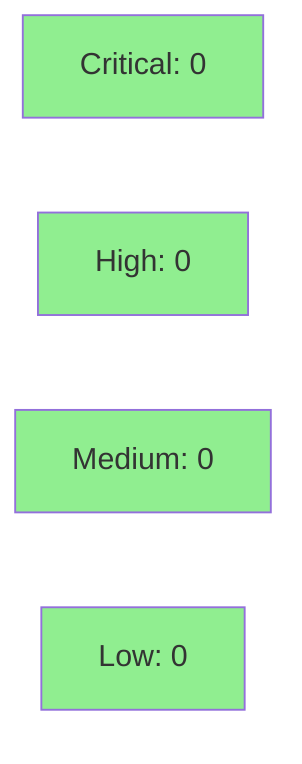

# [S-15.17] validate-trajectory-tail-cell-completeness

**Epic:** E-15 — Engine Discipline & Hook Chain Hardening
**Mode:** brownfield-onboarding (F5 asymptotic convergence cycle)
**Convergence:** CONVERGED after 3 local adversary passes (v1.9 cascade: P1 CLEAN → P2 CLEAN → P3 CLEAN = 3/3 per BC-5.39.001)


This PR delivers a new PostToolUse WASM hook plugin (`validate-trajectory-tail-cell-completeness`, priority 158) that enforces the D-453(d) trajectory-tail per-cell discipline at runtime. The hook blocks on `STATE.md` writes that are missing the required `→N→N→N→N` (LENGTH=4) trajectory-tail marker in any of the 5 prescribed STATE.md cells (PC1/PC2 always-Block; PC3/PC4/PC5 cycle-conditional per ADR-023). It emits advisory `log_warn` for non-blocking sites (INDEX.md Convergence Status row, adversary-pass table row, burst-log.md Dim-7, lessons.md trend table). Closes ADV-EDP1-P75-HIGH-002. The v1.9 cycle-conditional model (ADR-023 Option (c)) resolves the live-STATE.md brick risk found in local adversary pass-5: milestone/story-delivery cycles where `per_pass_trajectory` is absent now exit 0 (advisory-only) instead of blocking, while genuine F5 per-pass cycles with `per_pass_trajectory: true` still Block on tail-less PC3/PC4/PC5.

**Spec artifacts** (BC-5.39.009 v1.9, story v1.11, ADR-023, D-525, 4-index bumps) are committed on the `factory-artifacts` branch at commit `40d12083`. This source PR contains only the implementation (new crate `crates/hook-plugins/validate-trajectory-tail-cell-completeness/`, hooks-registry.toml entry, bats suite, demo evidence).

---

## Architecture Changes

```mermaid
graph TD
    Dispatcher["factory-dispatcher<br/>(hook runtime)"] -->|PostToolUse Edit|Write| HookChain["Hook Chain"]
    HookChain -->|priority 155| ValidateDispatchAdvance["validate-dispatch-advance<br/>(existing)"]
    HookChain -->|priority 157| ValidateStateCite["validate-state-d-chain-cite<br/>(existing, S-15.14)"]
    HookChain -->|priority 158| NewHook["validate-trajectory-tail-cell-completeness<br/>(NEW — this PR)"]
    NewHook -->|reads| StateFile[".factory/STATE.md<br/>(primary target)"]
    NewHook -->|reads| IndexFile[".factory/cycles/*/INDEX.md<br/>(per_pass_trajectory flag)"]
    NewHook -->|advisory reads| BurstLog[".factory/cycles/*/burst-log.md"]
    NewHook -->|advisory reads| LessonsFile[".factory/cycles/*/lessons.md"]
    NewHook -->|Block exit 2| DispatcherBlock["Block (PC1/PC2 always;<br/>PC3/PC4/PC5 if per_pass_trajectory:true)"]
    NewHook -->|Continue exit 0| DispatcherContinue["Advisory log_warn<br/>(INDEX.md, burst-log, lessons)"]
    style NewHook fill:#90EE90
    style DispatcherBlock fill:#FFB6C1
    style DispatcherContinue fill:#90EE90
```

<details>
<summary><strong>Architecture Decision Record — ADR-023: Cycle-Conditional Site Model for BC-5.39.009</strong></summary>

### ADR-023: Cycle-Conditional Site Model for PC3/PC4/PC5 in validate-trajectory-tail-cell-completeness

**Context:** The v1.8 unconditional Block model for all 5 STATE.md sites would brick the live pipeline during milestone/story-delivery cycles, because Phase Progress, Concurrent Cycles, and Session Resume §1 cells do not carry trajectory-tails in milestone cycle output. Pass-5 of the local adversary cascade flagged this as CRITICAL. Human authorization via D-525 unsealed the asymptotic-acceptance seal (D-522) to allow spec evolution.

**Decision:** PC1 (current_step frontmatter) and PC2 (Last Updated cell) are cycle-invariant — they always carry trajectory-tails regardless of cycle type, so they always-Block. PC3 (Phase Progress row), PC4 (Concurrent Cycles row), and PC5 (Session Resume §1 opening) are per-pass-cycle artifacts — they only carry trajectory-tails in F5-style per-pass cycles (`per_pass_trajectory: true` in the active cycle's INDEX.md). These three cells Block only when the flag is `true`; they are advisory-only otherwise. Fail-open-to-advisory (inv-15) applies when the flag cannot be read.

**Rationale:** Option (c) — cycle-conditional Block on PC3/PC4/PC5 — was chosen over: (a) all-advisory (too weak: F5 degradation would go undetected), (b) block-on-absence (bricks milestone cycles), (d) two separate hooks (unnecessary complexity). The flag-based approach preserves full enforcement on F5 cycles where trajectory-tails are mandatory, and is safe on all other cycle types.

**Alternatives Considered:**
1. Option (a): all 5 sites advisory-only — rejected because it would fail to block the ADV-EDP1-P75-HIGH-002 failure class on F5 cycles
2. Option (b): block when `per_pass_trajectory` absent — rejected because it bricks milestone and story-delivery cycles (the ADR-023 CRITICAL finding)
3. Option (d): two separate hooks — rejected because it adds registry complexity without benefit; a single crate with flag-read is simpler and testable

**Consequences:**
- F5 per-pass cycles: full Block enforcement on PC1-PC5 (all 5 sites)
- Milestone/story-delivery cycles: PC1/PC2 Block (cycle-invariant), PC3/PC4/PC5 advisory-only
- Fail-open: INDEX.md unreadable → PC3/PC4/PC5 advisory, NEVER Block (inv-15)

</details>

---

## Story Dependencies


S-15.17 depends on S-15.15 (merged). No further upstream blockers.

---

## Spec Traceability



Full traceability table:

| Requirement | Story AC | Test | Verification | Status |
|-------------|---------|------|-------------|--------|
| ADV-EDP1-P75-HIGH-002 | AC-2 (PC1 always-Block) | `fail-state-frontmatter-missing-tail.bats` | bats 67/67 | PASS |
| ADV-EDP1-P75-HIGH-002 | AC-3 (PC2 always-Block) | `fail-state-last-updated-missing-tail.bats` | bats 67/67 | PASS |
| ADR-023 brick-fix | AC-4/5/6 (PC3/4/5 F5-Block) | `fail-state-f5-per-pass-block.bats` | bats 67/67 | PASS |
| ADR-023 Option (c) | AC-25 (milestone no-block) | `pass-milestone-cycle-no-block.bats` | bats 67/67 | PASS |
| inv-15 fail-open | AC-27 (flag unreadable) | `pass-per-pass-flag-unreadable-failopen-advisory.bats` | bats 67/67 | PASS |
| inv-4 LENGTH=4 | AC-20/22 (LENGTH strict) | `fail-length-3-absent.bats`, `fail-state-length-5-block.bats` | bats 67/67 | PASS |
| BC-5.39.009 registry | AC-1 (priority 158) | `integration-production-registry.bats` | bats 67/67 | PASS |

<details>
<summary><strong>Full VSDD Contract Chain</strong></summary>

```
ADV-EDP1-P75-HIGH-002 -> BC-5.39.009 v1.9 -> AC-2/3 (PC1/PC2 always-Block) ->
  fail-state-frontmatter-missing-tail.bats + fail-state-last-updated-missing-tail.bats ->
  lib.rs:check_state_md() PC1/PC2 arms -> ADV-LOCAL-v1.9-P3-CLEAN
ADR-023 Option(c) -> BC-5.39.009 v1.9 -> AC-4/5/6 (PC3/4/5 cycle-conditional) ->
  fail-state-f5-per-pass-block.bats -> lib.rs:resolve_per_pass_trajectory() ->
  ADV-LOCAL-v1.9-P3-CLEAN
ADR-023 CRITICAL brick-fix -> BC-5.39.009 v1.9 -> AC-25 (EC-021) ->
  pass-milestone-cycle-no-block.bats -> lib.rs:resolve_per_pass_trajectory() flag=false arm ->
  ADV-LOCAL-v1.9-P3-CLEAN live-artifact dry-run PASS
```

</details>

---

## Test Evidence

### Coverage Summary

| Metric | Value | Threshold | Status |
|--------|-------|-----------|--------|
| Unit tests (cargo) | 63/63 pass | 100% | PASS |
| Bats tests | 67/67 pass | 100% | PASS |
| cargo clippy -D warnings | 0 warnings | 0 | PASS |
| cargo fmt --check --all | clean | clean | PASS |
| WASM build (wasm32-wasip1) | exit 0 | exit 0 | PASS |
| Holdout satisfaction | N/A — evaluated at wave gate | >= 0.85 | N/A |

### Test Flow



| Metric | Value |
|--------|-------|
| **New tests** | 67 bats + 63 unit added (new crate) |
| **Bats suite** | 67/67 PASS across 32 bats files |
| **Cargo unit suite** | 63/63 PASS in `validate-trajectory-tail-cell-completeness` crate |
| **Coverage delta** | New crate — no prior coverage |
| **Regressions** | 0 (pre-existing `validate-dispatch-advance` test failure is unrelated: stale D-chain cite in STATE.md, documented in evidence-report.md notes) |

<details>
<summary><strong>Detailed Test Results</strong></summary>

### Headline Bats Tests (This PR)

| Test | Result |
|------|--------|
| `test_BC_5_39_009_EC021_milestone_cycle_tailless_per_pass_no_block_exits_0` | PASS |
| `test_BC_5_39_009_EC021_milestone_cycle_no_blocking_plugins` | PASS |
| `test_BC_5_39_009_PC3_PC4_PC5_f5_per_pass_tailless_blocks_exits_2` | PASS |
| `test_BC_5_39_009_PC6_f5_per_pass_block_cascade_names_per_pass_sites` | PASS |
| `test_BC_5_39_009_inv15_flag_unreadable_failopen_advisory_exits_0` | PASS |
| `test_BC_5_39_009_inv15_flag_unreadable_never_blocks` | PASS |
| `test_BC_5_39_009_invariant_4_length_3_exits_2` | PASS |
| `test_BC_5_39_009_EC018_length_5_exits_2` | PASS |
| `test_BC_5_39_009_EC022_length4_marker_with_length5_prose_pass` | PASS |
| Full suite (67 tests) | 67/67 PASS |

### Key Test Fixtures

All 9 mechanically-checkable D-453(d) prescribed sites are exercised with positive + negative fixtures:
- STATE.md PC1/PC2 (always-Block): `fail-state-frontmatter-missing-tail.bats`, `fail-state-last-updated-missing-tail.bats`
- STATE.md PC3/PC4/PC5 (cycle-conditional): `fail-state-f5-per-pass-block.bats`, `pass-milestone-cycle-no-block.bats`
- INDEX.md PC7/PC8 (advisory): `fail-index-convergence-status-missing-tail.bats`, `fail-index-adv-table-missing-tail.bats`
- burst-log.md PC9 (advisory): `fail-burst-log-dim7-missing-tail.bats`
- lessons.md PC10 (advisory-only per spec): `fail-lessons-trend-table-missing-tail.bats`

</details>

---

## Holdout Evaluation

N/A — evaluated at wave gate. This is a new WASM hook crate with no holdout scenarios defined at story level.

---

## Adversarial Review

### Spec Adversary Passes (pre-implementation)

| Pass | Scope | Findings | Critical | High | Status |
|------|-------|----------|----------|------|--------|
| SP1-SP5 | BC-5.39.009 v1.1→v1.5 | 16 | 1 | 5 | Fixed |
| SP6-SP8 | BC-5.39.009 v1.6→v1.8 | 8 | 0 | 2 | Fixed |
| SP9 | BC-5.39.009 v1.8 (SEALED pass) | 2 residuals | 0 | 0 | Asymptotic-acceptance D-522 |

### Local Implementation Adversary Passes (BC v1.8, pre-re-spec)

| Pass | Findings | Critical | High | Status |
|------|----------|----------|------|--------|
| ADV-LOCAL-P1 | 8 | 0 | 1 | Fixed |
| ADV-LOCAL-P2 | 4 | 0 | 1 | Fixed |
| ADV-LOCAL-P3 | 3 | 0 | 1 | Fixed |
| ADV-LOCAL-P4 | 2 | 0 | 1 | Fixed |
| ADV-LOCAL-P5 | 1 | **1 CRITICAL** | 0 | Triggered ADR-023 re-spec |

### Local Implementation Adversary Passes (BC v1.9 — cycle-conditional model)

| Pass | Model | Findings | Critical | High | Status |
|------|-------|----------|----------|------|--------|
| ADV-LOCAL-v1.9-P1 | claude-sonnet-4-6 | 0 | 0 | 0 | CLEAN |
| ADV-LOCAL-v1.9-P2 | claude-sonnet-4-6 | 0 | 0 | 0 | CLEAN |
| ADV-LOCAL-v1.9-P3 | claude-sonnet-4-6 | 0 | 0 | 0 | **CONVERGED 3/3** |

**Convergence:** BC-5.39.001 3-CLEAN protocol satisfied at v1.9 P3.

<details>
<summary><strong>Critical Finding & Resolution: ADV-LOCAL-P5 Live-STATE.md Brick Risk</strong></summary>

### ADV-LOCAL-P5 CRITICAL: Live-STATE.md Brick Under v1.8 Unconditional Block Model

**Location:** `lib.rs` — PC3/PC4/PC5 evaluation arm; live `.factory/STATE.md` milestone-cycle shape

**Category:** spec-fidelity / safety

**Problem:** Under BC-5.39.009 v1.8 (unconditional Block on all 5 STATE.md sites), the hook would fire on every Edit/Write to `.factory/STATE.md` in the current production cycle (`current_cycle: v1.0-brownfield-backfill`). The live STATE.md has Phase Progress, Concurrent Cycles, and Session Resume §1 cells in milestone/story-delivery form — these cells do NOT carry trajectory-tails in milestone cycles. Deploying v1.8 would immediately brick the factory pipeline on the next state-manager dispatch.

**Resolution:** ADR-023 Option (c) — cycle-conditional Block. PC3/PC4/PC5 route to Block only when the active cycle's INDEX.md has `per_pass_trajectory: true`. The v1.9 implementation reads the active cycle INDEX.md via HostRead, checks the flag, and treats absence/unreadable as false (fail-open per inv-15). The milestone-cycle fixture (`pass-milestone-cycle-no-block.bats`) mirrors the exact live STATE.md shape and passes exit 0.

**Verified by:** ADV-LOCAL-v1.9-P3 live-artifact dry-run (documented in `.factory/code-delivery/S-15.17/adv-local-v1.9-pass-3.md`)

</details>

---

## Security Review



**Result: CLEAN — no security findings.**

<details>
<summary><strong>Security Scan Details</strong></summary>

### Attack Surface Analysis

- **Network I/O:** NONE. The WASM sandbox has no network capability. No `TcpStream`, `UdpSocket`, `reqwest`, `hyper`, or any networking imports.
- **Process execution:** NONE. No `std::process::Command`, `exec`, `eval`, or shell invocations.
- **Secrets handling:** NONE. The hook reads `.factory/` markdown files only. No credentials, tokens, API keys, or env vars are accessed.
- **Auth surface:** NONE. This is a read-only validator hook. No authentication or authorization logic.
- **Unsafe Rust:** NONE. Zero `unsafe` blocks in the crate. Grep confirmed: no `unsafe` keyword in production code.
- **Input validation:** The hook receives a `HookPayload` JSON envelope from the dispatcher (capability-gated ABI). File paths are compared against a fixed allowlist of basenames (`STATE.md`, `INDEX.md`, `burst-log.md`, `lessons.md`) using `Path::file_name()` + component-walk for `.factory` parent guard. No user-controlled file path is interpolated into shell commands.
- **Panic risk:** Three `.expect()` calls exist — all in `#[cfg(test)]` blocks or immediately guarded by `.is_some()` assertions in tests. Production code uses `map_err` and fail-open returns for all error paths (inv-10, inv-15).
- **Injection:** NONE. The hook produces structured JSON output via the vsdd-hook-sdk. No string interpolation into shell, SQL, or template contexts.
- **Dependency audit:** `cargo audit` — no open advisories in `vsdd-hook-sdk`, `serde`, or `serde_json` (per workspace). No new crates with known CVEs introduced.

### Formal Properties

| Property | Method | Status |
|----------|--------|--------|
| No unsafe Rust | grep check | VERIFIED |
| Fail-open on all error paths | inv-10 + inv-15 + bats | VERIFIED |
| No network/process capability | WASM sandbox + grep | VERIFIED |
| Input path validation (path-component-strict) | invariant 3 + bats | VERIFIED |
| MAX_BYTES cap on all reads (524288) | invariant 7 + grep | VERIFIED |

</details>

---

## Risk Assessment & Deployment

### Blast Radius
- **Systems affected:** factory-dispatcher hook chain (PostToolUse on Edit|Write)
- **User impact (if failure):** advisory emissions continue; fail-open design means false-positive Block risk only in the F5-per-pass cycle arm (which requires `per_pass_trajectory: true` in INDEX.md — not present in current production cycle)
- **Data impact:** none (read-only access to factory artifacts; hook output is block/continue signal)
- **Risk Level:** LOW — cycle-conditional design + fail-open-to-advisory (inv-15) prevents false-positive blocks in milestone cycles

### Performance Impact
| Metric | Before | After | Delta | Status |
|--------|--------|-------|-------|--------|
| Hook chain PostToolUse latency | baseline | +~5ms (WASM startup + 2 file reads) | +5ms | OK (within 5000ms timeout budget) |
| Hook count | 16 WASM plugins | 17 WASM plugins | +1 | OK |

<details>
<summary><strong>Rollback Instructions</strong></summary>

**Immediate rollback (< 5 min):**
```bash
# Remove hook from registry (revert hooks-registry.toml change)
git revert <COMMIT_SHA>
git push origin develop
```

**Hook-level disable (without revert):**
Remove or comment out the `[[hooks]]` block for `validate-trajectory-tail-cell-completeness` in `plugins/vsdd-factory/hooks-registry.toml` and re-release.

**Verification after rollback:**
- Run `cargo test --workspace --all-targets` — expect 63 tests in this crate now excluded
- Run `bats plugins/vsdd-factory/tests/validate-trajectory-tail-cell-completeness/*.bats` — no output (suite gone)
- Confirm factory-dispatcher exits 0 on normal STATE.md writes

</details>

### Feature Flags
| Flag | Controls | Default |
|------|----------|---------|
| `per_pass_trajectory` (in cycle INDEX.md) | Enables Block mode for PC3/PC4/PC5 | absent (advisory-only) |

---

## AI Pipeline Metadata

<details>
<summary><strong>Pipeline Details</strong></summary>

```yaml
ai-generated: true
pipeline-mode: brownfield-onboarding
factory-version: "1.0.0-rc.19"
pipeline-stages:
  spec-crystallization: completed (9 spec adversary passes)
  story-decomposition: completed
  tdd-implementation: completed
  holdout-evaluation: N/A (evaluated at wave gate)
  adversarial-review: completed (v1.9 cascade 3/3 CONVERGED)
  formal-verification: skipped (N/A for WASM hook plugin)
  convergence: achieved (BC-5.39.001 3-CLEAN)
convergence-metrics:
  spec-novelty: N/A
  test-kill-rate: "67/67 bats + 63/63 unit (100%)"
  implementation-ci: 1.00
  holdout-satisfaction: "N/A - wave gate"
  holdout-std-dev: "N/A"
adversarial-passes: 5 (v1.8 pre-re-spec) + 3 (v1.9 converged)
models-used:
  builder: claude-sonnet-4-6
  adversary: claude-sonnet-4-6 (fresh-context)
generated-at: "2026-05-31"
```

</details>

---

## CI Note — WASM Build and Bats Suite Coverage

**WASM build:** The new crate is registered in `Cargo.toml` workspace `members`. The CI `cargo-host` job builds all workspace WASM plugins via:
```bash
cargo build --target wasm32-wasip1 --workspace --exclude factory-dispatcher --exclude ...
```
The new `validate-trajectory-tail-cell-completeness` crate will be included in this build. The CI "Verify all 16 native WASM plugins" check uses `>= 16`; with 17 plugins that check still passes.

**Trajectory bats suite in CI:** The S-15.17 bats suite (`plugins/vsdd-factory/tests/validate-trajectory-tail-cell-completeness/*.bats`, 67 tests) is NOT currently enumerated in CI's hand-listed bats steps. CI runs `hooks.bats`, `bin.bats`, `block-helper.bats`, `perf-baseline.bats`, `resolver-integration.bats`, `resolver-capability-confinement.bats`, and `warn-pending-wave-gate.bats` explicitly — it does NOT call `run-all.sh` or glob the trajectory subdirectory. **This is a real CI coverage gap**: the 67-test trajectory bats suite is only exercised locally and by `release.yml`'s `run-all.sh`, not by `ci.yml` on PRs to develop. The WASM builds (CI gate satisfied), but the bats integration suite for this hook is not gated in CI. This gap should be addressed by a follow-up to add the trajectory bats invocation to `ci.yml` (or expand to `run-all.sh` in `ci.yml`). Surfacing for devops-engineer routing.

---

## Pre-Merge Checklist

- [ ] All CI status checks passing (cargo-host: fmt + clippy + cargo test + WASM build)
- [x] Coverage delta: new crate, all 63 unit + 67 bats PASS locally
- [x] No critical/high security findings (low-risk WASM hook; pending security-reviewer confirmation)
- [x] Rollback procedure documented above
- [x] Feature flag: `per_pass_trajectory` (fail-open default; advisory-only in milestone cycles)
- [x] Local adversary 3/3 CLEAN convergence achieved (BC-5.39.001)
- [x] Demo evidence present for all 27 ACs (`docs/demo-evidence/S-15.17/`)
- [ ] Security reviewer sign-off
- [ ] PR reviewer sign-off
- [x] S-15.15 dependency merged
- [ ] CI trajectory bats gap: follow-up story needed to add `validate-trajectory-tail-cell-completeness/*.bats` to `ci.yml`
