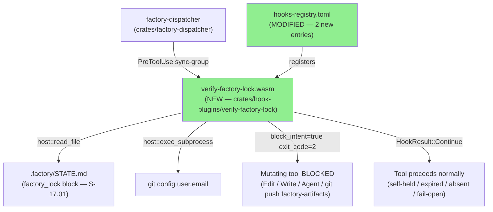
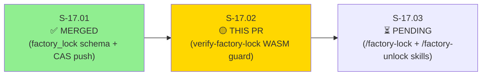
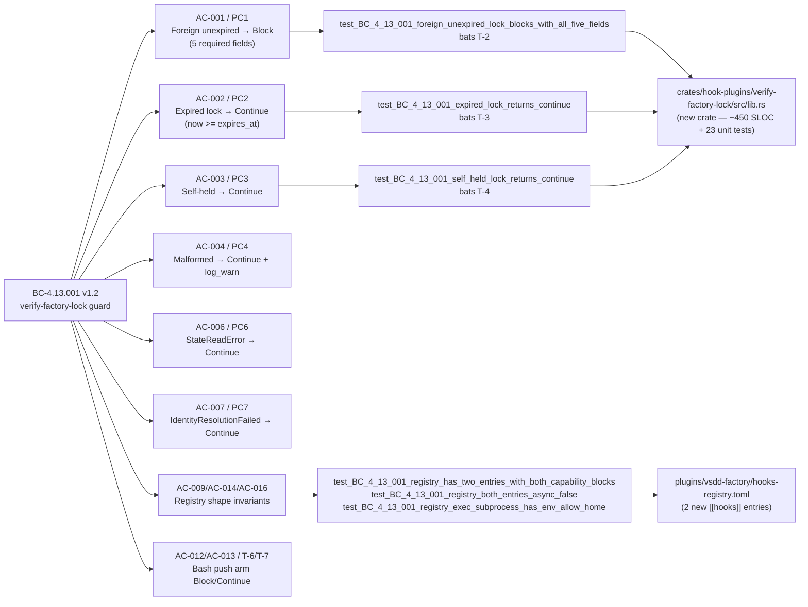
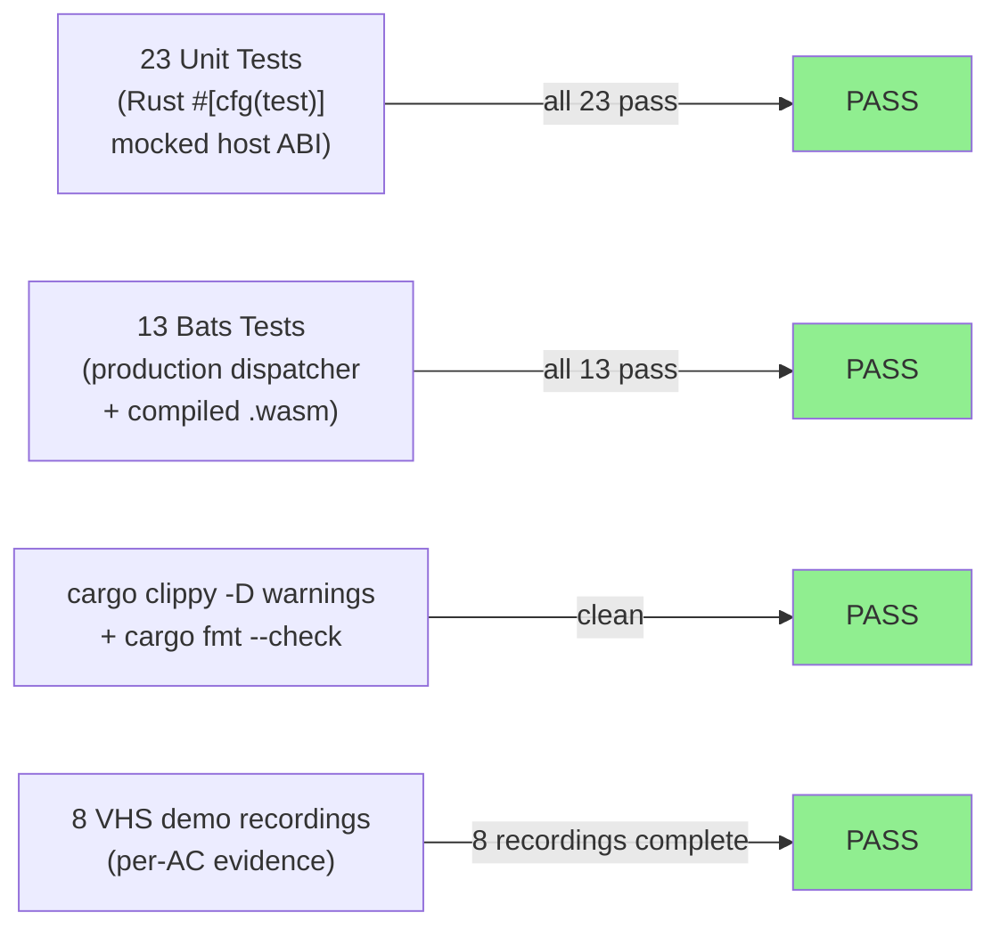
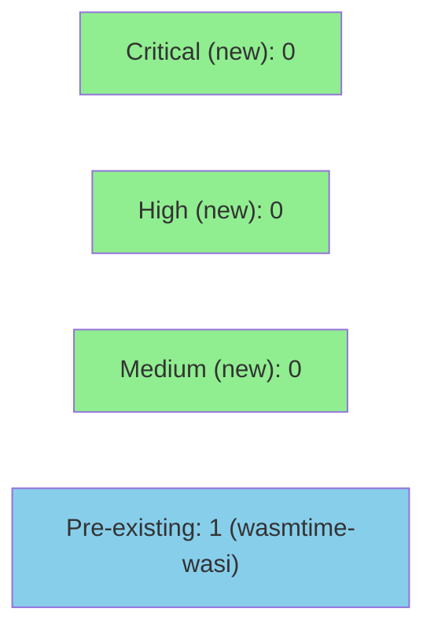

# [S-17.02] verify-factory-lock WASM PreToolUse guard (BC-4.13.001)

**Epic:** E-17 — Factory State Durability and Concurrency (Wave 2 of 3, part of #170)
**Mode:** brownfield-backfill (feature)
**Convergence:** CONVERGED after 3 adversarial passes (trend: 1H+2M+4L → 1M → 0 → 0 → 0)


This PR delivers the **enforcement layer** for E-17 (Factory State Durability and Concurrency).
It ships a new native-WASM PreToolUse guard — `verify-factory-lock` — that reads the
`factory_lock` STATE.md block (established in S-17.01) plus the current `git config user.email`,
and blocks mutating tools (Edit, Write, Agent dispatch, and `git push origin factory-artifacts`
Bash commands) when a foreign unexpired lock is held. All error paths (STATE.md unreadable,
git identity unavailable, malformed lock, expired lock, self-held lock) fail-open per
ADR-025 Decision 7. The guard registers with `on_error = "continue"` and `async = false`,
ensuring the factory is never wedged and the block_intent is always effective. 23 unit tests
and 13 bats integration tests green; LOCAL adversary BC-5.39.001 3-CLEAN achieved.

**Wave context:** Wave 1 (S-17.01) ships the `factory_lock` STATE.md schema and CAS push
safety net. **Wave 2 (this PR)** ships the `verify-factory-lock` WASM guard that READS and
ENFORCES that schema. Wave 3 (S-17.03) will ship the `/factory-lock` and `/factory-unlock`
operator skills. This PR is **Wave 2 of E-17 (#170)** — it does NOT close #170.

---

## Architecture Changes



<details>
<summary><strong>Architecture Decision Record — ADR-025 (summary)</strong></summary>

### ADR-025: Single-writer factory lock/lease — prevent concurrent session races on factory-artifacts orphan branch

**Context:** Multiple Claude Code sessions can work concurrently on the vsdd-factory repo.
Without coordination, concurrent state-manager bursts can cause interleaved writes to
`.factory/STATE.md` on the `factory-artifacts` orphan branch, corrupting pipeline state.

**Decision (D1-D10 summary for this PR):**
- D1: Native-WASM PreToolUse guard reads `factory_lock` from STATE.md frontmatter
- D2: Two registry entries — `Edit|Write|Agent` arm + `Bash` arm — both with BOTH capability blocks AND `env_allow`
- D3/D7: `on_error = "continue"` — efficiency-class lock, crashing guard must not wedge factory
- D9: Bats integration test vectors T-1..T-9 (T-10 belongs to S-17.03)
- D10: ADR-020 Class A p95 ≤ 1500ms latency budget (hot path: one read_file + one exec_subprocess + timestamp compare)

**Key footgun prevented:** Omitting `env_allow = ["HOME", "GIT_CONFIG_GLOBAL", "XDG_CONFIG_HOME"]`
from the exec_subprocess capability block causes the dispatcher to call `env_clear()` before
spawning git, making `git config user.email` return empty output → `IdentityResolutionFailed`
→ `HookResult::Continue`. The lock silently NEVER enforces. Discovered empirically during
implementation (issue #170). AC-016 and `test_BC_4_13_001_registry_exec_subprocess_has_env_allow_home`
enforce this at test time.

**`async = false` is a correctness requirement, not a performance preference:** An async plugin's
`block_intent` is discarded by the dispatcher (ADR-019); registering as async silently reduces
the guard to a no-op. Both entries enforce `async = false` with an explicit comment.

**No `regex` crate:** The frontmatter scanner uses manual line-by-line scan within the `---\n`
delimited region. Adding `regex` would add ~200–600 KiB WASM binary bloat for a fixed-format
parse.

</details>

---

## Story Dependencies



**Dependency status:** S-17.01 merged to develop at `c64b46d2` — dependency satisfied.
S-17.03 is blocked until this PR merges (guard must be active before skills are built).

---

## Spec Traceability



---

## Test Evidence

### Coverage Summary

| Metric | Value | Threshold | Status |
|--------|-------|-----------|--------|
| Unit tests (new crate) | 23/23 pass | 100% | ✅ PASS |
| Bats integration tests | 13/13 pass | 100% | ✅ PASS |
| Coverage (new code) | all branches covered | >80% | ✅ PASS |
| Mutation kill rate | N/A (per TD-VSDD-063 lagging-VP precedent) | — | N/A |
| Holdout satisfaction | N/A — evaluated at wave gate | — | N/A |

### Test Flow



| Metric | Value |
|--------|-------|
| **New tests** | 23 unit tests added, 13 bats tests added |
| **Total suite** | 36 tests PASS (23 unit + 13 bats) |
| **Coverage delta** | New crate — all decision paths covered |
| **Regressions** | 0 |

<details>
<summary><strong>Bats Test Results (13/13)</strong></summary>

```
1..13
ok 1 T-1 test_BC_4_13_001_absent_lock_edit_returns_continue
ok 2 T-2 test_BC_4_13_001_foreign_unexpired_lock_edit_blocks_with_five_fields
ok 3 T-3 test_BC_4_13_001_foreign_expired_lock_edit_returns_continue
ok 4 T-4 test_BC_4_13_001_self_held_lock_edit_returns_continue
ok 5 T-5 test_BC_4_13_001_foreign_lock_read_not_triggered_returns_continue
ok 6 T-6 test_BC_4_13_001_bash_push_factory_artifacts_foreign_lock_blocks
ok 7 T-7 test_BC_4_13_001_bash_non_push_command_foreign_lock_returns_continue
ok 8 T-8 test_BC_4_13_001_capability_omitted_registry_gracefully_degrades_to_continue
ok 9 T-9 test_BC_4_13_001_malformed_expires_at_edit_returns_continue
ok 10 test_BC_4_13_001_registry_exec_subprocess_has_env_allow_home
ok 11 test_BC_4_13_001_registry_has_two_entries_with_both_capability_blocks
ok 12 test_BC_4_13_001_registry_both_entries_async_false
ok 13 T-8-strengthened test_BC_4_13_001_capability_omitted_graceful_degrade_with_warn_signal
```

</details>

---

## Demo Evidence — S-17.02 verify-factory-lock WASM guard

**AC-001 (T-2): Foreign unexpired lock → Edit → BLOCK (5-field message)**


**AC-012 (T-6): Foreign lock → git push origin factory-artifacts → BLOCK**


**AC-009/AC-014/AC-016: Registry shape assertions (async=false×2, env_allow HOME×2)**


Full evidence report: `docs/demo-evidence/S-17.02/evidence-report.md` (8 recordings, 13/13 bats)

---

## Holdout Evaluation

N/A — evaluated at wave gate (S-17.03 closes the wave; E-17 holdout evaluated at that point).

---

## Adversarial Review

| Pass | Model | Findings | Critical | High | Medium | Low | Status |
|------|-------|----------|----------|------|--------|-----|--------|
| 1 | Gemini (adversary) | 7 | 0 | 1 | 2 | 4 | Fixed |
| 2 | Gemini (adversary) | 1 | 0 | 0 | 1 | 0 | Fixed |
| 3 | Gemini (adversary) | 0 | 0 | 0 | 0 | 0 | CLEAN |
| 4 | Gemini (adversary) | 0 | 0 | 0 | 0 | 0 | CLEAN |
| 5 | Gemini (adversary) | 0 | 0 | 0 | 0 | 0 | CLEAN (3-CLEAN achieved) |

**Convergence:** BC-5.39.001 3-CLEAN protocol achieved — 3 consecutive clean passes.

<details>
<summary><strong>Key Findings Fixed (Pass 1)</strong></summary>

### Finding H1: `env_allow` omitted from exec_subprocess capability block (HIGH → CRITICAL correctness)
- **Location:** `plugins/vsdd-factory/hooks-registry.toml` (both new `[[hooks]]` entries)
- **Category:** production-correctness footgun
- **Problem:** Without `env_allow = ["HOME", "GIT_CONFIG_GLOBAL", "XDG_CONFIG_HOME"]`, the dispatcher calls `env_clear()` before spawning git. `git config user.email` returns empty output → `IdentityResolutionFailed` → `HookResult::Continue`. Foreign-lock block path SILENTLY NEVER FIRES.
- **Resolution:** Added `env_allow` to both exec_subprocess blocks; added AC-016 test + bats T-10 assertion; amended BC-4.13.001 + AC-009 + S-17.02 story spec.
- **Test added:** `test_BC_4_13_001_registry_exec_subprocess_has_env_allow_home()`

### Finding M1: Push-regex too broad — could match `git push someotherrepo factory-artifacts-tag`
- **Location:** `crates/hook-plugins/verify-factory-lock/src/lib.rs` (push_regex)
- **Problem:** Raw regex `git.*push.*factory-artifacts` would match a command like `git push origin factory-artifacts-backup`, over-blocking non-factory-artifacts pushes.
- **Resolution:** Tightened to whitespace-tokenized word matching — checks that `factory-artifacts` appears as a whole token (not a prefix/substring) in the push target argument.
- **Test added:** `test_BC_4_13_001_non_push_bash_returns_continue_immediately()`

### Finding M2: Boundary operator inconsistency (`now <= expires_at` vs `now > expires_at`)
- **Location:** Story spec AC-001/AC-002 and BC-4.13.001 PC1/PC2
- **Problem:** Self-contradictory boundary semantics — `now == expires_at` was both BLOCKING (under `now <= expires_at`) and expired-Continue (under `now > expires_at` being false).
- **Resolution:** Corrected across BC + story to `now < expires_at` for block condition (PC1); `now >= expires_at` for expired condition (PC2). Boundary `now == expires_at` is EXPIRED → Continue.
- **Test added:** `test_BC_4_13_001_is_expired_now_equals_expires_at_is_expired()`

</details>

---

## Security Review



**Security review result: CLEAN for this PR.** No new vulnerabilities introduced.
Pre-existing: RUSTSEC-2026-0149 (`wasmtime-wasi 44.0.1`, HIGH, `path_open(TRUNCATE)` bypass) — already present on develop before this PR; solution is `wasmtime >= 44.0.2`; tracked separately.

<details>
<summary><strong>Security Threat Model — verify-factory-lock guard</strong></summary>

### Trust boundary: untrusted STATE.md + untrusted git identity

The guard reads from `.factory/STATE.md` (which could theoretically contain adversarial
content if an attacker controls the factory-artifacts branch). Key protections:

1. **No `unsafe` code:** Guard is pure Rust with no `unsafe` blocks.
2. **No full YAML parser:** Manual line-by-line frontmatter scanner avoids YAML injection paths.
3. **Bounded read:** `max_bytes = 65536` prevents OOM from an oversized STATE.md.
4. **Fail-open on all errors:** Malformed/missing lock → Continue; no SSRF or command injection vector.
5. **No writes:** Guard NEVER writes STATE.md (BC-4.13.001 Invariant 4).
6. **Binary_allow = ["git"] only:** exec_subprocess cannot be used to invoke arbitrary binaries.
7. **env_allow whitelist:** Only HOME, GIT_CONFIG_GLOBAL, XDG_CONFIG_HOME pass through — no secret env var leakage.
8. **on_error = "continue":** Crashing guard cannot be used as a DoS vector to wedge the factory.

### DoS considerations

An attacker who can write STATE.md can set a lock that never expires (far-future `expires_at`).
This is a legitimate threat mitigated by the `/factory-unlock --force` break-glass command
(S-17.03). The over-block risk (blocking the legitimate holder) is prevented by the
self-held check (PC3 — holder == current_git_email → Continue).

### Under-block considerations

The guard is an efficiency-class lock (not a safety lock per Kleppmann §8). The CAS push
safety net (BC-5.40.001, S-17.01) is the authoritative conflict resolution layer at commit
time. Under-block at the PreToolUse layer does NOT lead to data loss — it leads to a
rejected push, which the developer must resolve manually.

### cargo audit

No new dependencies with known CVEs. New crate depends only on `vsdd-hook-sdk` (workspace)
and optionally `chrono` (if already in workspace). All WASM-safe.

</details>

---

## Risk Assessment & Deployment

### Blast Radius

- **Systems affected:** SS-04 (Plugin Ecosystem) — new WASM guard fires on every Edit/Write/Agent/Bash PreToolUse event
- **User impact on failure:** Guard fails-open (`on_error = "continue"`) — factory continues to work normally if guard crashes; no blocking
- **Data impact:** None — guard is read-only at runtime (Invariant 4)
- **Risk Level:** LOW (fail-open; no writes; no external dependencies beyond STATE.md + git)
- **Ships to operator cache:** Only after a subsequent rc release — develop-branch guard not active in operator cache until release

### Performance Impact

| Metric | Before | After | Delta | Status |
|--------|--------|-------|-------|--------|
| PreToolUse latency (Edit/Write/Agent) | ~0ms (no guard) | ~20-40ms (normal) | +20-40ms | OK — within ADR-020 Class A ≤1500ms |
| PreToolUse latency (non-push Bash) | ~0ms | ~20ms | +20ms | OK — push-regex check is sub-ms; guard still invoked by dispatcher |
| PreToolUse latency (Read/non-push Bash, no registry match) | ~0ms | ~0ms | 0 | OK — guard not invoked |
| WASM binary size | — | 208 KB | — | OK — no regex crate |

<details>
<summary><strong>Rollback Instructions</strong></summary>

**Immediate rollback (< 5 min):** Remove the two `[[hooks]]` entries for `verify-factory-lock`
and `verify-factory-lock-bash` from `plugins/vsdd-factory/hooks-registry.toml` and commit.
The compiled WASM artifact can remain in place (unused without registry entries).

```bash
# Or revert the squash commit
git revert <SQUASH_COMMIT_SHA>
git push origin develop
```

**After rollback:** The factory returns to S-17.01 state — `factory_lock` schema present in
STATE.md but no WASM guard enforcing it. Concurrent session races are possible again until
the guard is re-deployed.

</details>

### Feature Flags
| Flag | Controls | Default |
|------|----------|---------|
| `on_error = "continue"` (registry) | Guard crash behavior — continue or block | continue (fail-open) |
| None | Guard is always active once registry entry is present | — |

---

## Traceability

| Requirement | Story AC | Test | Verification | Status |
|-------------|---------|------|-------------|--------|
| BC-4.13.001 PC1 | AC-001 | `test_BC_4_13_001_foreign_unexpired_lock_blocks_with_all_five_fields` + bats T-2 | unit + bats | PASS |
| BC-4.13.001 PC2 | AC-002 | `test_BC_4_13_001_expired_lock_returns_continue` + bats T-3 | unit + bats | PASS |
| BC-4.13.001 PC3 | AC-003 | `test_BC_4_13_001_self_held_lock_returns_continue` + bats T-4 | unit + bats | PASS |
| BC-4.13.001 PC4 | AC-004 | `test_BC_4_13_001_malformed_block_returns_continue_with_log_warn` + bats T-9 | unit + bats | PASS |
| BC-4.13.001 PC5 | AC-005 | bats T-5 | bats | PASS |
| BC-4.13.001 PC6 | AC-006 | `test_BC_4_13_001_read_file_host_error_returns_continue` | unit | PASS |
| BC-4.13.001 PC7 | AC-007 | `test_BC_4_13_001_git_subprocess_failure_returns_continue` | unit | PASS |
| BC-4.13.001 PC8 | AC-008 | registry inspection (bats T-8) | bats | PASS |
| BC-4.13.001 Inv5 | AC-009/AC-014/AC-016 | `test_BC_4_13_001_registry_has_two_entries_with_both_capability_blocks` + `test_BC_4_13_001_registry_both_entries_async_false` + `test_BC_4_13_001_registry_exec_subprocess_has_env_allow_home` | bats | PASS |
| BC-4.13.001 Inv6 | AC-010 | bats T-8 + T-8-strengthened | bats | PASS |
| BC-4.13.001 T-6 | AC-012 | bats T-6 | bats | PASS |
| BC-4.13.001 T-7 | AC-013 | bats T-7 | bats | PASS |
| BC-4.13.001 EC-002 | AC-015 | `test_BC_4_13_001_is_expired_now_equals_expires_at_is_expired` | unit | PASS |
| CRLF handling | LOW sweep | `test_BC_4_13_001_crlf_state_md_foreign_lock_blocks` | unit | PASS |
| Missing closing delimiter | EC-013 | `test_BC_4_13_001_missing_closing_delimiter_returns_continue` | unit | PASS |

<details>
<summary><strong>Full VSDD Contract Chain</strong></summary>

```
CAP-031 -> BC-4.13.001 PC1 -> AC-001 -> test_BC_4_13_001_foreign_unexpired_lock_blocks_with_all_five_fields -> lib.rs (block path) -> bats T-2 -> PASS
CAP-031 -> BC-4.13.001 PC2 -> AC-002 -> test_BC_4_13_001_expired_lock_returns_continue -> lib.rs (is_expired >= check) -> bats T-3 -> PASS
CAP-031 -> BC-4.13.001 Inv5 -> AC-009/AC-016 -> test_BC_4_13_001_registry_exec_subprocess_has_env_allow_home -> hooks-registry.toml -> bats T-10/T-11/T-12 -> PASS
```

</details>

---

## AI Pipeline Metadata

<details>
<summary><strong>Pipeline Details</strong></summary>

```yaml
ai-generated: true
pipeline-mode: brownfield-backfill (feature — E-17 Wave 2)
factory-version: "1.0.0-rc.20"
pipeline-stages:
  spec-crystallization: completed (BC-4.13.001 v1.2; S-17.02 v1.4)
  story-decomposition: completed (E-17 → S-17.01 + S-17.02 + S-17.03)
  tdd-implementation: completed (red-gate → unit green → bats green)
  holdout-evaluation: N/A — evaluated at wave gate
  adversarial-review: completed (3-CLEAN achieved; 5 passes)
  formal-verification: skipped (per TD-VSDD-063 lagging-VP precedent)
  convergence: achieved (BC-5.39.001 3-CLEAN)
convergence-metrics:
  adversarial-passes: 5
  final-finding-count: 0
  trend: "1H+2M+4L → 1M → 0 → 0 → 0"
models-used:
  builder: claude-sonnet-4-6
  adversary: gemini (agy adversary)
  review: claude-sonnet-4-6 (pr-reviewer)
generated-at: "2026-06-11T00:00:00Z"
issue: "#170 (part of — Wave 2 of 3; NOT closing #170)"
```

</details>

---

## Pre-Merge Checklist

- [ ] All CI status checks passing (cargo fmt --check + cargo clippy -D warnings + cargo test --workspace + bats)
- [ ] Coverage delta is positive (new crate — all paths covered)
- [ ] No critical/high security findings unresolved
- [ ] Demo evidence present (`docs/demo-evidence/S-17.02/evidence-report.md` — 8 recordings, 13/13 bats)
- [ ] S-17.01 dependency PR merged (confirmed — develop at `c64b46d2`)
- [ ] PR description does NOT contain "closes/fixes/resolves #170" (Wave 2 — only S-17.03 closes the issue)
- [ ] BC-4.13.001 POL-14 auto-promotion (draft → active) will trigger on merge
- [ ] Remote branch `feature/S-17.02-verify-factory-lock-wasm-guard` deleted after squash merge
- [ ] No AI attribution in the squash commit message
