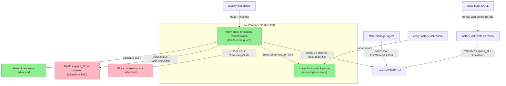
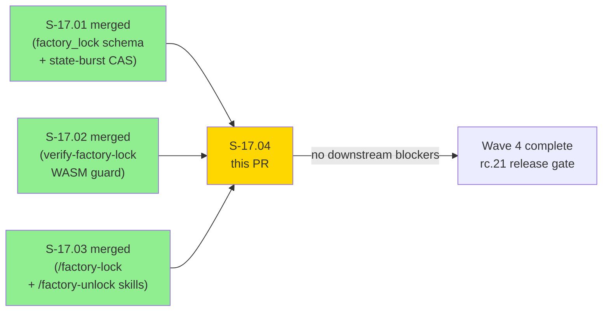
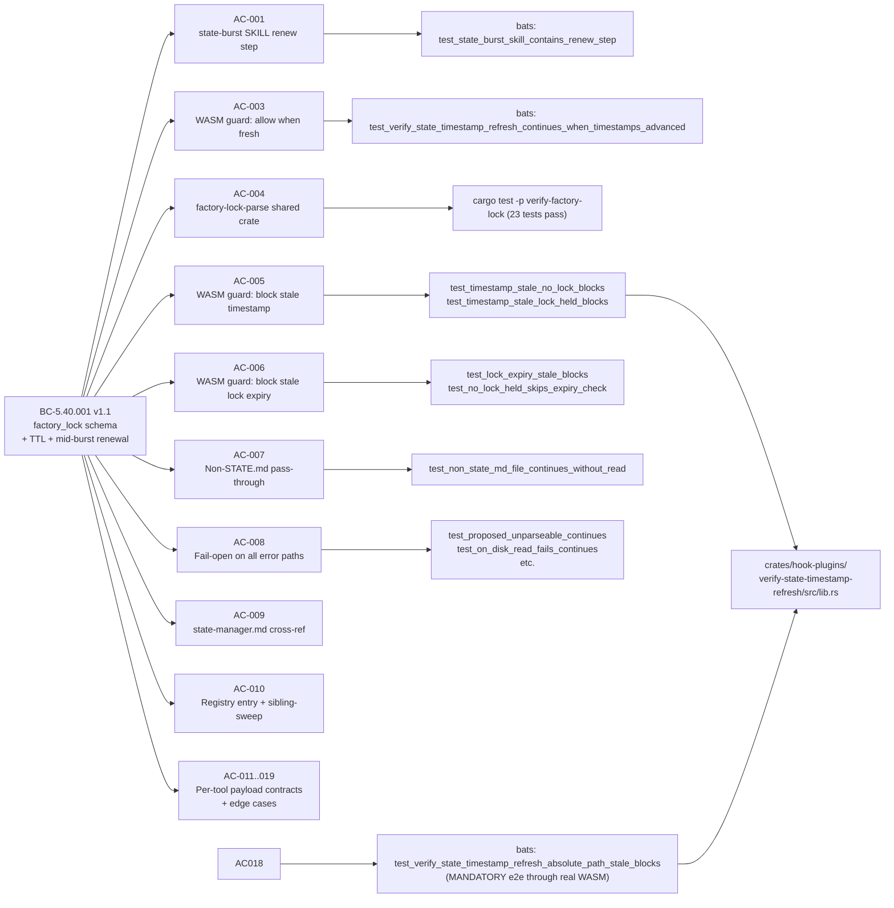
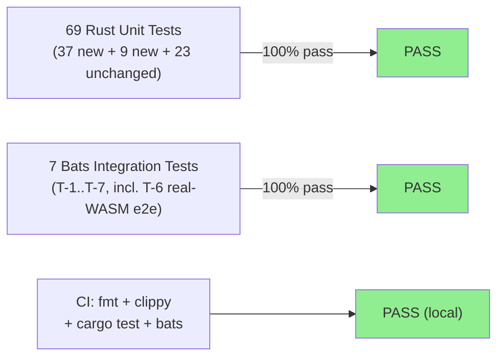

# feat(S-17.04): mid-burst heartbeat renewal wiring — verify-state-timestamp-refresh WASM guard

**Epic:** E-17 — Factory State Durability and Concurrency (brownfield-backfill #170)
**Mode:** brownfield (feature engine-discipline backfill)
**Convergence:** CONVERGED after 10 Claude adversarial passes + 1 Gemini cross-family pass (D-539); LOCAL 3-CLEAN protocol satisfied


This PR delivers S-17.04 v1.7: a Rust WASM `verify-state-timestamp-refresh` PreToolUse guard that blocks stale `.factory/STATE.md` writes (Edit/Write/MultiEdit), enforcing that `timestamp:` advances on every state touch and — when a factory lock is held — that `factory_lock.expires_at` is refreshed (mid-burst heartbeat renewal). The PR also ships `crates/factory-lock-parse/` (shared parse-primitive library extracted from `verify-factory-lock`), wires the mandatory `factory-lock-write.sh renew` step into the `state-burst` SKILL, adds the `state-manager.md` cross-reference (Decision 13), and applies the `verify-factory-lock` MultiEdit sibling-sweep (AC-010). Governed by ADR-025 v1.6 Decision 12 and BC-5.40.001 PC4. Issue #170/E-17 is already closed; this is the E-17 wave-4 follow-on (auto-renew wiring).

---

## Architecture Changes



<details>
<summary><strong>Architecture Decision Record — ADR-025 v1.6 Decision 12</strong></summary>

### ADR-025 v1.6 Decision 12: WASM PreToolUse guard for timestamp-freshness enforcement

**Context:** ADR-025 Decision 11 proposed a bash-based push-time gate to enforce BC-5.40.001 PC4 (mid-burst TTL renewal). That mechanism had four bypass vectors: inert-match, over-match, newline-injection, and env-injection. A structurally bypass-proof mechanism was needed.

**Decision:** Implement a Rust WASM `verify-state-timestamp-refresh` PreToolUse guard that intercepts Edit/Write/MultiEdit before the write lands on disk. The guard reads the on-disk STATE.md via `host::read_file`, compares the proposed `timestamp:` field, and blocks if unchanged. When a factory lock is held in the proposed content, it additionally verifies `factory_lock.expires_at` is refreshed.

**Rationale:** WASM sandboxing eliminates all four bash bypass vectors. Runs at PreToolUse time — before the file is written — rather than at push time. Fail-open on all error paths (consistent with ADR-025 Decision 7 and `verify-factory-lock` precedent). The shared `factory-lock-parse` crate prevents duplication and ensures consistent parse semantics between the two guards.

**Critical P0 finding (adversary pass 7):** Prior versions specified `$CLAUDE_PROJECT_DIR` env-var stripping for path normalization. The WASI sandbox provides NO environment variables. The guard was structurally inert on absolute paths (the real form Claude Code emits). Fix: trigger when normalized path **equals** `.factory/STATE.md` OR **ends with** `/.factory/STATE.md` — no env-var dependency.

**Alternatives Considered:**
1. Bash push-time gate (Decision 11, withdrawn) — rejected: four bypass vectors; state-manager can bypass by staging without the guard running
2. State-manager discipline only (no enforcement) — rejected: AD-025 §R5 requires structural enforcement for BC-5.40.001 PC4

**Consequences:**
- Every Edit/Write/MultiEdit to STATE.md now has ~1ms WASM guard overhead (acceptable per ADR-025 §12.4)
- Guard is fail-open — a WASM crash does not block legitimate writes
- `verify-factory-lock` gains MultiEdit coverage (sibling-sweep AC-010)

</details>

---

## Story Dependencies



**Note:** `depends_on: []` in story frontmatter — S-17.01/02/03 deliver prerequisite artifacts (factory-lock-write.sh renew subcommand, verify-factory-lock lib.rs as extraction source) that are already on `develop`. No dependency PR gating required.

---

## Spec Traceability



---

## Test Evidence

### Coverage Summary

| Metric | Value | Threshold | Status |
|--------|-------|-----------|--------|
| Rust unit tests (verify-state-timestamp-refresh) | 37/37 pass | 100% | PASS |
| Rust unit tests (factory-lock-parse) | 9/9 pass | 100% | PASS |
| Rust unit tests (verify-factory-lock, unchanged) | 23/23 pass | 100% | PASS |
| Bats integration tests | 7/7 pass | 100% | PASS |
| fmt + clippy -D warnings | clean | clean | PASS |
| Holdout evaluation | N/A — evaluated at wave gate | — | N/A |

### Test Flow



| Metric | Value |
|--------|-------|
| **New Rust unit tests** | 46 added (37 verify-state-timestamp-refresh + 9 factory-lock-parse) |
| **New bats tests** | 7 added (verify-state-timestamp-refresh.bats, including T-6 real-WASM e2e) |
| **Existing tests preserved** | 23 verify-factory-lock tests pass after factory-lock-parse extraction |
| **CI hardening** | WASM floor-count derived from `[[bin]]` crates; `CI_REQUIRE_ARTIFACTS=1` hard-fail prevents bats e2e skip-pass |
| **Regressions** | None — existing verify-factory-lock suite unchanged |

<details>
<summary><strong>Key Tests — verify-state-timestamp-refresh</strong></summary>

| Test | AC | Result |
|------|----|--------|
| `test_timestamp_stale_no_lock_blocks()` | AC-005 | PASS |
| `test_timestamp_stale_lock_held_blocks()` | AC-005 | PASS |
| `test_lock_expiry_stale_blocks()` | AC-006 | PASS |
| `test_no_lock_held_skips_expiry_check()` | AC-006 | PASS |
| `test_non_state_md_file_continues_without_read()` | AC-007 | PASS |
| `test_proposed_unparseable_continues()` | AC-008 | PASS |
| `test_on_disk_read_fails_continues()` | AC-008 | PASS |
| `test_timestamp_absent_on_disk_continues()` | AC-008 | PASS |
| `test_timestamp_absent_in_proposed_blocks()` | AC-008 | PASS |
| `test_write_payload_stale_timestamp_blocks()` | AC-011 | PASS |
| `test_edit_payload_reconstruct_stale_timestamp_blocks()` | AC-012 | PASS |
| `test_edit_payload_reconstruct_advanced_timestamp_continues()` | AC-012 | PASS |
| `test_multiedit_payload_reconstruct_stale_timestamp_blocks()` | AC-013 | PASS |
| `test_multiedit_payload_reconstruct_advanced_timestamp_continues()` | AC-013 | PASS |
| `test_edit_old_string_not_found_continues()` | AC-014 | PASS |
| `test_multiedit_first_old_string_not_found_continues()` | AC-014 | PASS |
| `test_read_file_not_found_continues()` | AC-015 | PASS |
| `test_lock_held_expires_at_absent_blocks()` | AC-016 | PASS |
| `test_lock_held_expires_at_empty_blocks()` | AC-017 | PASS |
| `test_double_dot_relative_path_triggers_guard()` | AC-018 / EC-006 | PASS |
| `test_double_dot_above_root_path_triggers_guard()` | AC-018 / EC-006 | PASS |
| `test_timestamp_empty_string_in_proposed_blocks()` | AC-019 | PASS |

**Bats integration (T-1..T-7):**

| Test | AC | Description |
|------|----|-------------|
| `test_state_burst_skill_contains_renew_step` | AC-001 | Asserts SKILL.md contains renew invocation |
| `test_verify_state_timestamp_refresh_continues_when_timestamps_advanced` | AC-003 | Allow-path: fresh timestamp, guard_ran sentinel |
| `test_verify_state_timestamp_refresh_continues_for_non_state_md` | AC-007 | Non-STATE.md pass-through, guard_ran sentinel |
| `test_verify_state_timestamp_refresh_blocks_stale_timestamp` | AC-005 | Block path: stale timestamp → exit 2 |
| `test_verify_state_timestamp_refresh_lock_held_expires_absent_blocks` | AC-016 | Block path: lock held + absent expires_at |
| `test_verify_state_timestamp_refresh_absolute_path_stale_blocks` (T-6, MANDATORY e2e) | AC-018 | **Real WASM runtime** absolute-path block |
| `test_verify_state_timestamp_refresh_registry_entry_has_correct_shape` | AC-010 | Registry entry shape validation |

**Note on pre-existing local test:** `validate_production_state_md_no_false_positive` fails locally due to a D-chain validator reading the live STATE.md — this is a pre-existing false-positive (tracked TD-VSDD-101), skipped in CI, NOT introduced by this PR.

**Note on RUSTSEC-2026-0149:** wasmtime-wasi advisory is pre-existing, tracked in STATE.md, not introduced by this PR.

</details>

---

## Holdout Evaluation

N/A — evaluated at wave gate per vsdd-factory pipeline standard.

---

## Adversarial Review

| Pass | Model | Finding Class | Notable Findings | Status |
|------|-------|---------------|-----------------|--------|
| 1–3 (Gemini cross-family) | Gemini Flash/Pro | INV-019 spec gaps | AC-016/017 (absent/empty expires_at), EC-006 .. resolution, AC-010 sibling-sweep | Fixed in v1.3/v1.4 |
| 4–5 (Claude) | claude-sonnet-4-6 | factory-lock-parse location, CI gate, guard_ran sentinel | factory-lock-parse relocation to crates/ (not hook-plugins/); CI_REQUIRE_ARTIFACTS=1; P4-H1/P5-H1 | Fixed in v1.5 |
| 7 (Claude P0) | claude-sonnet-4-6 | **P0: guard inert on absolute paths** | WASI has no env vars — $CLAUDE_PROJECT_DIR strip dead code; guard never fired on real absolute paths | Fixed: env-free ends_with trigger (AC-018) |
| 8–9 (Claude) | claude-sonnet-4-6 | L1–L4 dead code, doc-comment drift, log_warn sentinel coverage | Dead unsafe env scaffolding; stale trigger comments; log_warn on all Continue paths; block_with_fix single-source | Fixed in pass-8/9 commits |
| 10 (Claude) | claude-sonnet-4-6 | L3 test-name traceability drift | 6 test names mismatched Red Gate table across 4 files | Fixed in v1.7 (dotdot→double_dot; has_capability_block→has_correct_shape) |

**Convergence:** LOCAL adversarial cascade converged — 10 Claude fresh-context passes + 1 Gemini cross-family pass (D-539). Critical P0 defect (guard inert in production on absolute paths due to dead WASI env-var strip) caught at pass 7 and fixed with a mandatory real-WASM bats e2e regression test (T-6 AC-018).

<details>
<summary><strong>P0 Finding Detail — Absolute-Path Bypass</strong></summary>

### Finding: Guard structurally inert on absolute paths in WASM runtime

- **Location:** `crates/hook-plugins/verify-state-timestamp-refresh/src/lib.rs` — `normalise_path()` function
- **Category:** spec-fidelity / security
- **Problem:** Prior EC-006 path normalization attempted to strip `$CLAUDE_PROJECT_DIR/` prefix via `std::env::var("CLAUDE_PROJECT_DIR")`. The WASI sandbox provides NO environment variables — this lookup always returns `Err`. Any absolute path (e.g., `/Users/x/proj/.factory/STATE.md`) therefore did not match the literal `.factory/STATE.md` after normalization. Claude Code emits absolute paths for all project files in practice. The guard was a no-op on the real production path form.
- **Resolution:** Trigger rule changed to: fire when normalized path **equals** `.factory/STATE.md` OR **ends with** `/.factory/STATE.md`. No env-var dependency. All existing relative-path normalizations (strip `./`, collapse `//`, collapse `/./`, `..` segment-stack) retained.
- **Test added:** `test_verify_state_timestamp_refresh_absolute_path_stale_blocks()` — mandatory bats e2e through real WASM dispatcher (T-6); also `test_double_dot_relative_path_triggers_guard()` and `test_double_dot_above_root_path_triggers_guard()` Rust unit tests; `test_absolute_path_triggers_guard_without_env()` (confirms no env-var dependency in Rust native test harness)

</details>

---

## Security Review

Security review to be completed by `vsdd-factory:security-reviewer` (Step 4 — populated after review).


*This section will be updated with security-reviewer findings.*

---

## Risk Assessment & Deployment

### Blast Radius

- **Systems affected:** `.factory/STATE.md` write path (Edit/Write/MultiEdit); hooks-registry.toml (two entries modified); `verify-factory-lock` crate (import paths changed, no logic change); state-burst SKILL (one new step added)
- **User impact:** Any state-manager burst that does not call `factory-lock-write.sh renew` before writing STATE.md will be blocked (exit 2). This is the intended enforcement. The SKILL step added in AC-001 ensures compliant agents are unaffected.
- **Data impact:** None — guard is fail-open; all error paths return Continue. No data mutation by the guard itself.
- **Risk Level:** LOW for compliant agents; INTENDED-BLOCK for non-compliant agents. Fail-open design prevents false-positive production outages.

### Performance Impact

| Metric | Before | After | Delta | Status |
|--------|--------|-------|-------|--------|
| STATE.md write overhead | 0ms (no guard) | ~1ms (WASM guard) | +1ms | OK (within ADR-025 §12.4 budget) |
| Non-STATE.md write overhead | 0ms | ~0ms (guard exits immediately) | 0ms | OK |

<details>
<summary><strong>Rollback Instructions</strong></summary>

**Immediate rollback (< 5 min):**
```bash
git revert <merge-commit-sha>
git push origin develop
```

**Manual registry rollback** (if revert not possible — remove guard entry from hooks-registry.toml):
```toml
# Remove the [hooks.verify-state-timestamp-refresh] section entirely
# Revert verify-factory-lock tool matcher back to "Edit|Write|Agent"
```

**Verification after rollback:**
- `cargo test --workspace --all-targets` should pass
- STATE.md writes should proceed without TimestampStale blocks

</details>

### Feature Flags

No feature flags — guard is active on registry load. Disable by removing entry from hooks-registry.toml.

---

## Traceability

| BC | AC | Test | Status |
|----|-----|------|--------|
| BC-5.40.001 PC4 | AC-001 | `test_state_burst_skill_contains_renew_step` (bats) | PASS |
| BC-5.40.001 PC4 | AC-003 | `test_verify_state_timestamp_refresh_continues_when_timestamps_advanced` (bats) | PASS |
| BC-5.40.001 PC4 | AC-004 | `cargo test -p verify-factory-lock` (23 tests) | PASS |
| BC-5.40.001 PC4 | AC-005 | `test_timestamp_stale_no_lock_blocks` + `test_timestamp_stale_lock_held_blocks` | PASS |
| BC-5.40.001 PC4 | AC-006 | `test_lock_expiry_stale_blocks` + `test_no_lock_held_skips_expiry_check` | PASS |
| BC-5.40.001 PC6 | AC-007 | `test_non_state_md_file_continues_without_read` + bats T-3 | PASS |
| BC-5.40.001 PC4 | AC-008 | 5x fail-open tests | PASS |
| BC-5.40.001 PC4 | AC-009 | `grep 'verify-state-timestamp-refresh' agents/state-manager.md` | PASS |
| BC-5.40.001 PC4 | AC-010 | `test_verify_state_timestamp_refresh_registry_entry_has_correct_shape` (bats T-7) | PASS |
| BC-5.40.001 PC4 | AC-011 | `test_write_payload_stale_timestamp_blocks` | PASS |
| BC-5.40.001 PC4 | AC-012 | `test_edit_payload_reconstruct_stale_timestamp_blocks/continues` | PASS |
| BC-5.40.001 PC4 | AC-013 | `test_multiedit_payload_reconstruct_stale_timestamp_blocks/continues` | PASS |
| BC-5.40.001 PC6 | AC-014 | `test_edit_old_string_not_found_continues` + multiedit variant | PASS |
| BC-5.40.001 PC6 | AC-015 | `test_read_file_not_found_continues` | PASS |
| BC-5.40.001 PC4 | AC-016 | `test_lock_held_expires_at_absent_blocks` + bats T-5 | PASS |
| BC-5.40.001 PC4 | AC-017 | `test_lock_held_expires_at_empty_blocks` | PASS |
| BC-5.40.001 PC4 | AC-018 (P0) | `test_verify_state_timestamp_refresh_absolute_path_stale_blocks` (bats T-6, real WASM) | PASS |
| BC-5.40.001 PC4 | AC-019 | `test_timestamp_empty_string_in_proposed_blocks` | PASS |

<details>
<summary><strong>Full VSDD Contract Chain</strong></summary>

```
BC-5.40.001 PC4 -> ADR-025 v1.6 D12 -> verify-state-timestamp-refresh WASM guard
  -> test_timestamp_stale_no_lock_blocks -> lib.rs:TimestampStale branch -> LOCAL-ADV-PASS-10-OK
  -> test_lock_expiry_stale_blocks -> lib.rs:LockExpiryStale branch -> LOCAL-ADV-PASS-10-OK
  -> test_verify_state_timestamp_refresh_absolute_path_stale_blocks (bats T-6, real WASM) -> P0-H1-FIXED

BC-5.40.001 PC4 -> ADR-025 v1.6 D15 -> factory-lock-parse shared crate
  -> cargo test -p factory-lock-parse (9 tests) -> LOCAL-ADV-PASS-10-OK
  -> cargo test -p verify-factory-lock (23 tests, unmodified) -> LOCAL-ADV-PASS-10-OK

BC-5.40.001 PC4 -> ADR-025 v1.6 D10 -> state-burst SKILL renew step
  -> test_state_burst_skill_contains_renew_step (bats T-1) -> LOCAL-ADV-PASS-10-OK
```

</details>

---

## Demo Evidence

All recordings drive the real dispatcher binary (`target/release/factory-dispatcher`) with the real compiled WASM plugin via a minimal synthetic registry. No mocks.

| Recording | AC | Scenario | Expected |
|-----------|-----|---------|---------|
| [AC-005-block-stale-timestamp.gif](../../docs/demo-evidence/S-17.04/AC-005-block-stale-timestamp.gif) | AC-005 | Write with stale `timestamp:` | exit 2 + TimestampStale block |
| [AC-003-allow-fresh-timestamp.gif](../../docs/demo-evidence/S-17.04/AC-003-allow-fresh-timestamp.gif) | AC-003 | Write with advanced `timestamp:` | exit 0 + guard_ran sentinel |
| [AC-018-absolute-path-block.gif](../../docs/demo-evidence/S-17.04/AC-018-absolute-path-block.gif) | AC-018 (P0) | Absolute file_path + stale timestamp | exit 2 + TimestampStale block |
| [AC-006-lock-expiry-stale.gif](../../docs/demo-evidence/S-17.04/AC-006-lock-expiry-stale.gif) | AC-006 | Lock held + absent expires_at, ts advanced | exit 2 + LockExpiryStale block |

---

## AI Pipeline Metadata

<details>
<summary><strong>Pipeline Details</strong></summary>

```yaml
ai-generated: true
pipeline-mode: brownfield-backfill
factory-version: "1.0.0-rc.21-pre"
pipeline-stages:
  spec-crystallization: completed (v1.7 — 7 revision cycles across adversarial passes)
  story-decomposition: completed (E-17 wave 4)
  tdd-implementation: completed (strict TDD mode; Red Gate first)
  holdout-evaluation: N/A — evaluated at wave gate
  adversarial-review: completed (LOCAL 3-CLEAN; 10 Claude + 1 Gemini passes, D-539)
  formal-verification: skipped (VPs deferred per TD-VSDD-063 lagging-VP precedent)
  convergence: achieved (LOCAL)
convergence-metrics:
  adversarial-passes: 11 (10 Claude + 1 Gemini cross-family)
  p0-defects-found: 1 (absolute-path bypass, pass 7)
  p0-defects-fixed: 1
  final-pass-clean: true
models-used:
  builder: claude-sonnet-4-6
  adversary-claude: claude-sonnet-4-6 (10 passes)
  adversary-gemini: gemini-flash + gemini-pro (1 cross-family pass, D-539)
generated-at: "2026-06-12T00:00:00Z"
```

</details>

---

## Pre-Merge Checklist

- [ ] All CI status checks passing (fmt + clippy -D warnings + cargo test + bats)
- [ ] No critical/high security findings unresolved (security-reviewer pending)
- [ ] pr-reviewer APPROVE verdict received
- [ ] Demo evidence covers all ACs (4 GIFs: AC-003, AC-005, AC-006, AC-018)
- [ ] Rollback procedure documented above
- [ ] No dependency PRs outstanding (S-17.01/02/03 all merged to develop)
- [ ] RUSTSEC-2026-0149 wasmtime-wasi advisory is pre-existing (STATE.md tracked), not introduced here
- [ ] pre-existing local test `validate_production_state_md_no_false_positive` known false-positive (TD-VSDD-101), CI skipped
