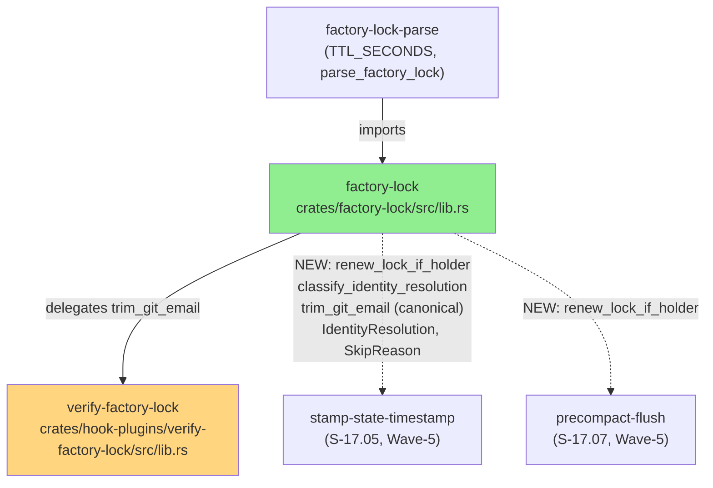
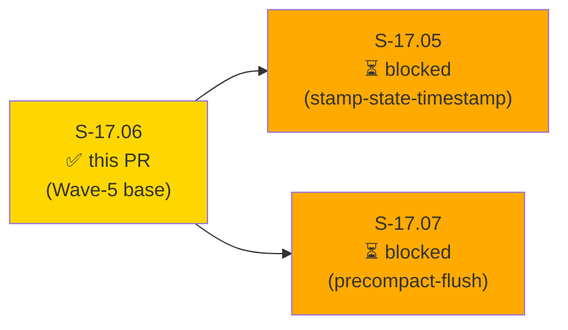
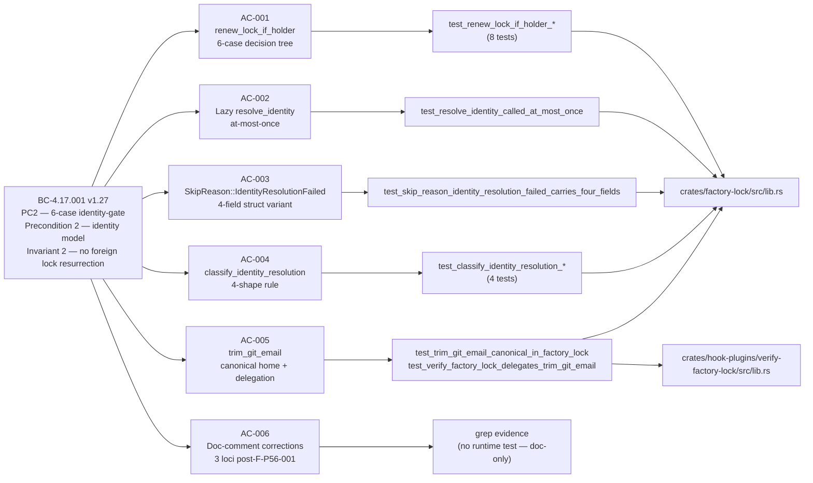
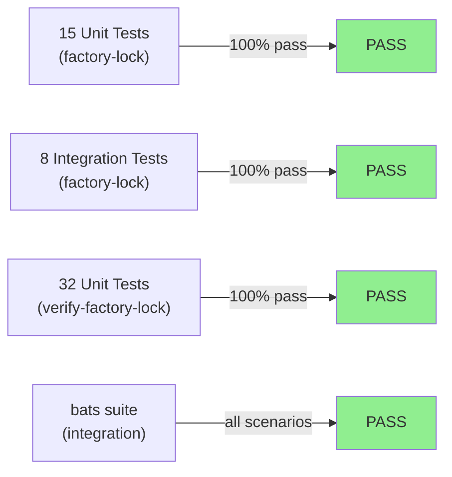
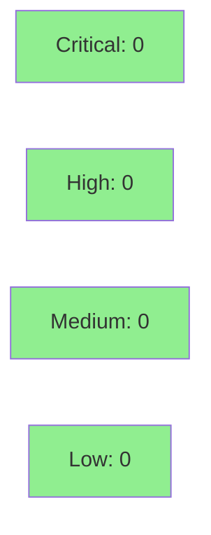

# [S-17.06] factory-lock shared functions — renew_lock_if_holder, IdentityResolution, SkipReason, classify_identity_resolution, trim_git_email promotion + doc-comment corrections

**Epic:** E-17 — Factory State Durability and Concurrency (brownfield-backfill #170 lineage)
**Mode:** brownfield-backfill
**Convergence:** CONVERGED after 4 adversarial passes (pass 1 FINDINGS→fixed; passes 2/3/4 CLEAN — BC-5.39.001 3-CLEAN achieved)


This PR delivers the shared library functions in `crates/factory-lock/src/lib.rs` required by
Wave-5 stories S-17.05 and S-17.07 before they can compile. It adds `renew_lock_if_holder`
(6-case PC2 identity-gate decision tree from BC-4.17.001), the `IdentityResolution` and
`SkipReason` enums, the `classify_identity_resolution` 4-shape classifier (ADR-046 Decision 2),
and promotes `trim_git_email` from `verify-factory-lock` to its single canonical home in
`factory_lock` (F-P7-001 single-canonical-home principle). Three stale doc-comment loci in
`factory-lock` are corrected to reflect post-F-P56-001 semantics (AC-006). S-17.06 has no
upstream story dependencies and is the topological base of the Wave-5 group; ADR-046 Rollout
Note requires all three Wave-5 stories (S-17.05, S-17.06, S-17.07) to ship in the same release.

---

## Architecture Changes



<details>
<summary><strong>Architecture Decision Record</strong></summary>

### ADR-046 — PostToolUse hook-authored STATE.md wall-clock stamping + timestamp lock keep-alive (Decisions 1(b) and 2)

**Context:** `stamp-state-timestamp` (S-17.05) and `precompact-flush` (S-17.07) both need
identical PC2 identity-gate logic: parse the factory lock, resolve the caller's Git identity,
decide whether to renew. Duplicating this decision tree across two WASM plugins would violate
DRY and the single-canonical-home principle (F-P7-001).

**Decision 1(b):** `renew_lock_if_holder` lives as a pure-core function in `factory_lock` with
injectable `resolve_identity` closure and `now_fn`. No direct `host::exec_subprocess` call
inside the function; the WASM caller wires the real subprocess to the closure.

**Decision 2:** The identity model is expressed as `IdentityResolution` enum (Resolved/Failed)
+ `classify_identity_resolution` 4-shape rule. All four shapes are mandatory; no shape may be
collapsed or omitted.

**Rationale:** A pure-core library with injectable I/O is independently unit-testable without
a WASM runtime. The 6-case decision tree can be verified once in the canonical location.

**Alternatives Considered:**
1. Duplicate the decision tree in each plugin — rejected: 2x maintenance surface, divergence risk.
2. Extract to a separate `factory-lock-identity` crate — rejected: over-engineering for 3 functions; `factory-lock` is already the right boundary.

**Consequences:**
- S-17.05 and S-17.07 compile only after S-17.06 merges (topological prerequisite).
- `verify-factory-lock` gains a `factory-lock` crate dependency for `trim_git_email` delegation.

</details>

---

## Story Dependencies



**Upstream deps:** none — `crates/factory-lock/` is already on `develop` from S-17.01.
**Blocks:** S-17.05 (calls `factory_lock::renew_lock_if_holder` + `classify_identity_resolution`)
and S-17.07 (calls `factory_lock::renew_lock_if_holder`). Neither downstream story can compile
without this PR's deliverables. Per ADR-046 Rollout Note (wave-gate atomicity), all three
Wave-5 stories ship in the same release.

---

## Spec Traceability



---

## Test Evidence

### Coverage Summary

| Metric | Value | Threshold | Status |
|--------|-------|-----------|--------|
| factory-lock unit tests | 15/15 pass | 100% | PASS |
| factory-lock integration tests | 8/8 pass | 100% | PASS |
| verify-factory-lock unit tests | 32/32 pass | 100% | PASS |
| Red Gate tests (AC-001 to AC-005) | 13/13 pass | 100% | PASS |
| Local 3-CLEAN (BC-5.39.001) | 3/3 clean passes | 3 consecutive | PASS |
| `cargo fmt --check --all` | CLEAN | no diffs | PASS |
| `cargo clippy -- -D warnings` | CLEAN | 0 warnings | PASS |
| bats integration suite | PASS | all scenarios | PASS |

### Test Flow



| Metric | Value |
|--------|-------|
| **New tests** | 13 Red Gate tests added (AC-001 to AC-005); 2 mutation-kill tests added (F-P1-002/003 boundary cases) |
| **Total passing** | 55 tests (factory-lock 23 + verify-factory-lock 32) |
| **Regressions** | 0 |

<details>
<summary><strong>Detailed Test Results (AC-to-test mapping)</strong></summary>

### AC-001 — renew_lock_if_holder 6-case decision tree (8 tests pass)

| Test | Result |
|------|--------|
| `test_renew_lock_if_holder_absent_block_no_op` | PASS |
| `test_renew_lock_if_holder_malformed_no_resolve` | PASS |
| `test_renew_lock_if_holder_already_expired_no_resolve` | PASS |
| `test_renew_lock_if_holder_not_holder_no_renewal` | PASS |
| `test_renew_lock_if_holder_identity_resolution_failed_no_renewal` | PASS |
| `test_renew_lock_if_holder_identity_match_renewed` | PASS |
| `test_renew_lock_if_holder_malformed_expires_at_returns_err` | PASS |
| `test_renew_lock_if_holder_now_equals_expires_at_is_expired` | PASS |

### AC-002 — Lazy resolve_identity

| Test | Result |
|------|--------|
| `test_resolve_identity_called_at_most_once` | PASS |

### AC-003 — SkipReason struct fields

| Test | Result |
|------|--------|
| `test_skip_reason_identity_resolution_failed_carries_four_fields` | PASS |

### AC-004 — classify_identity_resolution 4-shape rule

| Test | Result |
|------|--------|
| `test_classify_identity_resolution_exec_error_maps_failed` | PASS |
| `test_classify_identity_resolution_nonzero_exit_maps_failed` | PASS |
| `test_classify_identity_resolution_empty_stdout_maps_failed` | PASS |
| `test_classify_identity_resolution_nonempty_stdout_maps_resolved` | PASS |

### AC-005 — trim_git_email canonical home + delegation

| Test | Result |
|------|--------|
| `test_trim_git_email_canonical_in_factory_lock` | PASS |
| `test_verify_factory_lock_delegates_trim_git_email` | PASS |

### AC-006 — Doc-comment corrections (grep evidence)

```
grep -rn '^pub fn trim_git_email' crates/
crates/factory-lock/src/lib.rs:545:pub fn trim_git_email(raw: &str) -> String {
```
One result only — canonical home confirmed. verify-factory-lock contains no duplicate body.

</details>

---

## Demo Evidence

Per-AC VHS terminal recordings are under `docs/demo-evidence/S-17.06/` (POLICY 10 story-scoped).

| AC | Artifact | Description |
|----|----------|-------------|
| AC-001 | `AC-001-renew-lock-6-case-decision-tree.gif` / `.webm` | `cargo test -p factory-lock test_renew_lock_if_holder` — 8 tests pass |
| AC-002 | `AC-002-lazy-resolve-identity-at-most-once.gif` / `.webm` | `test_resolve_identity_called_at_most_once` passes |
| AC-003 | `AC-003-skip-reason-four-fields.gif` / `.webm` | `test_skip_reason_identity_resolution_failed_carries_four_fields` passes |
| AC-004 | `AC-004-classify-identity-4-shapes.gif` / `.webm` | 4 `test_classify_identity_resolution_*` tests pass |
| AC-005 | `AC-005-trim-git-email-canonical-home.gif` / `.webm` | `grep` shows 1 definition; 2 delegation tests pass |
| AC-006 | `AC-006-doc-comment-corrections.gif` / `.webm` | `grep` shows F-P56-001 in all 3 loci + corrected inline comment |

---

## Holdout Evaluation

N/A — evaluated at wave gate (ADR-046 Rollout Note; Wave-5 holdout performed at wave-gate level, not per-story).

---

## Adversarial Review

| Pass | Findings | Critical | High | Status |
|------|----------|----------|------|--------|
| 1 | Multiple | 0 | 3 | Fixed (F-P1-001: canonical home, F-P1-002/003: boundary cases) |
| 2 | 0 | 0 | 0 | CLEAN |
| 3 | 0 | 0 | 0 | CLEAN |
| 4 | 0 | 0 | 0 | CLEAN — BC-5.39.001 3-CLEAN **ACHIEVED** |

**Convergence:** BC-5.39.001 3-CLEAN achieved after pass 1 fixes. Local cascade DONE.

<details>
<summary><strong>Pass 1 Findings and Resolutions</strong></summary>

### F-P1-001 — trim_git_email delegation not inline
- **Category:** spec-fidelity / AC-005 (single canonical home)
- **Problem:** `verify-factory-lock` retained a shadow call rather than direct `factory_lock::trim_git_email` delegation.
- **Resolution:** Fixed in commit `f53f9e97` — inline delegation + `clear_lock` doc clarification.

### F-P1-002 — Case 1 malformed expires_at boundary not tested
- **Category:** test-quality (mutation-kill gap)
- **Resolution:** Added `test_renew_lock_if_holder_malformed_expires_at_returns_err` in commit `3787cec8`.

### F-P1-003 — now == expires_at boundary ambiguity
- **Category:** test-quality (boundary fence-post)
- **Resolution:** Added `test_renew_lock_if_holder_now_equals_expires_at_is_expired` in commit `3787cec8` confirming `now >= expires_at` → `AlreadyExpired` (inclusive lower bound).

</details>

---

## Security Review



*Security review results to be populated by Step 4 (security-reviewer dispatch).*

---

## Risk Assessment & Deployment

### Blast Radius
- **Systems affected:** `crates/factory-lock` (new public API surface), `crates/hook-plugins/verify-factory-lock` (delegation update — behavior-neutral)
- **User impact:** None directly. `verify-factory-lock` behavior is unchanged post-delegation.
- **Data impact:** None — pure library additions; no STATE.md format changes.
- **Risk Level:** LOW — net-new `pub` items on existing crate; no logic removed; delegation update is behavior-neutral.

### Performance Impact
| Metric | Delta | Status |
|--------|-------|--------|
| Hook execution latency | Negligible (pure function delegation, no allocation path change) | OK |
| Compilation time | Minor increase (13 new test functions) | OK |

<details>
<summary><strong>Rollback Instructions</strong></summary>

**Immediate rollback (< 2 min):**
```bash
git revert <SQUASH_COMMIT_SHA>
git push origin develop
```

No feature flags. No runtime config change. Pure library additions — revert removes the new API surface; S-17.05 and S-17.07 (which depend on these symbols) would need to be reverted in dependency order first.

**Verification after rollback:**
- `cargo build --workspace` compiles clean
- `cargo test -p factory-lock` passes with pre-S-17.06 test count

</details>

### Feature Flags
None — library functions; no runtime toggle required.

---

## Traceability

| BC Clause | AC | Test | Status |
|-----------|----|------|--------|
| BC-4.17.001 PC2 — 6-case decision tree | AC-001 | `test_renew_lock_if_holder_*` (8 tests) | PASS |
| BC-4.17.001 PC2 — lazy identity, at-most-once | AC-002 | `test_resolve_identity_called_at_most_once` | PASS |
| BC-4.17.001 PC2 — SkipReason::IdentityResolutionFailed 4 fields | AC-003 | `test_skip_reason_identity_resolution_failed_carries_four_fields` | PASS |
| BC-4.17.001 Precondition 2 — classify_identity_resolution 4-shape | AC-004 | `test_classify_identity_resolution_*` (4 tests) | PASS |
| BC-4.17.001 Precondition 2 — trim_git_email canonical home | AC-005 | `test_trim_git_email_canonical_in_factory_lock`, `test_verify_factory_lock_delegates_trim_git_email` | PASS |
| BC-4.17.001 Invariant — doc-comment accuracy (post-F-P56-001) | AC-006 | grep evidence (no runtime test per story spec) | PASS |

<details>
<summary><strong>Full VSDD Contract Chain</strong></summary>

```
BC-4.17.001 PC2 → AC-001 → test_renew_lock_if_holder_* (8) → crates/factory-lock/src/lib.rs → LOCAL-ADV-PASS-4-CLEAN
BC-4.17.001 PC2 → AC-002 → test_resolve_identity_called_at_most_once → crates/factory-lock/src/lib.rs → LOCAL-ADV-PASS-4-CLEAN
BC-4.17.001 PC2 → AC-003 → test_skip_reason_identity_resolution_failed_carries_four_fields → crates/factory-lock/src/lib.rs → LOCAL-ADV-PASS-4-CLEAN
BC-4.17.001 Precondition 2 → AC-004 → test_classify_identity_resolution_* (4) → crates/factory-lock/src/lib.rs → LOCAL-ADV-PASS-4-CLEAN
BC-4.17.001 Precondition 2 → AC-005 → test_trim_git_email_canonical_in_factory_lock + test_verify_factory_lock_delegates_trim_git_email → crates/factory-lock/src/lib.rs + crates/hook-plugins/verify-factory-lock/src/lib.rs → LOCAL-ADV-PASS-4-CLEAN
BC-4.17.001 Invariant → AC-006 → grep: F-P56-001 in 3 loci → LOCAL-ADV-PASS-4-CLEAN (doc-only)
```

</details>

---

## AI Pipeline Metadata

<details>
<summary><strong>Pipeline Details</strong></summary>

```yaml
ai-generated: true
pipeline-mode: brownfield-backfill
factory-version: "1.0.0-rc.24"
pipeline-stages:
  spec-crystallization: completed
  story-decomposition: completed
  tdd-implementation: completed
  holdout-evaluation: N/A (wave-gate level)
  adversarial-review: completed (4 passes; 3-CLEAN achieved)
  formal-verification: skipped (VP-TBD pending formal-verifier)
  convergence: achieved
convergence-metrics:
  local-3-clean: achieved (BC-5.39.001)
  adversarial-passes: 4
  blocking-findings-at-merge: 0
models-used:
  builder: claude-sonnet-4-6
  adversary: claude-sonnet-4-6 (local cascade)
generated-at: "2026-08-27T00:00:00Z"
wave: 5
blocks: [S-17.05, S-17.07]
depends_on: []
```

</details>

---

## Pre-Merge Checklist

- [x] All CI status checks passing (fmt + clippy + cargo test + bats — verified GREEN locally)
- [x] Local BC-5.39.001 3-CLEAN achieved (passes 2/3/4 consecutive CLEAN)
- [x] Demo evidence present for all 6 ACs (`docs/demo-evidence/S-17.06/`, POLICY 10 scoped)
- [x] BC-4.17.001 traceability chain complete (BC → AC → Test → Implementation)
- [x] No upstream story dependencies (S-17.06 is Wave-5 base)
- [x] `trim_git_email` single canonical home verified (`grep -rn '^pub fn trim_git_email' crates/` = 1 result)
- [x] ADR-046 Architecture Compliance Rules 1–7 all satisfied
- [ ] Security review completed (Step 4)
- [ ] CI verified GREEN via `gh pr checks` (Step 6)
- [ ] Cognitive-diversity code review: READY verdict (Step 5)
