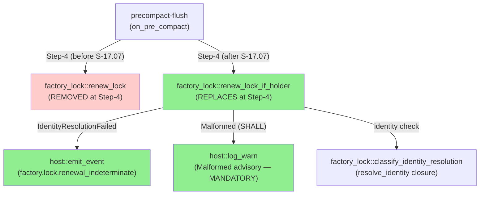
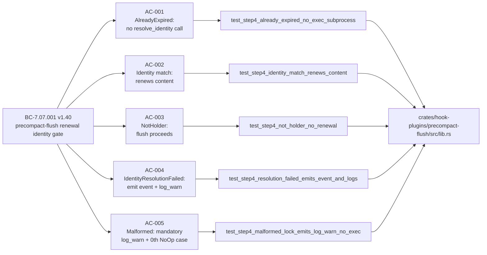
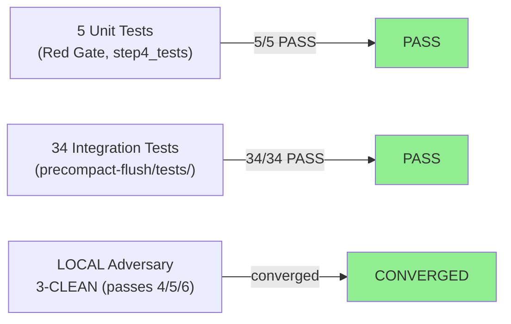
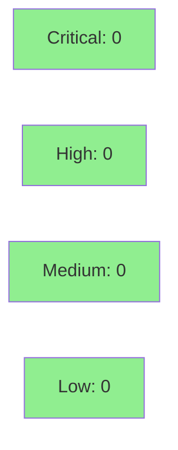

# S-17.07: precompact-flush Step-4 identity-gate amendment

**Epic:** E-17 — Factory State Durability and Concurrency (brownfield-backfill #170 lineage)
**Mode:** brownfield-backfill
**Convergence:** CONVERGED after 6 LOCAL adversarial passes (passes 4/5/6 clean — BC-5.39.001 3-CLEAN achieved on frozen artifact)


Upgrades `precompact-flush`'s Step-4 lock-renewal call-site from the identity-blind `factory_lock::renew_lock` to `factory_lock::renew_lock_if_holder` (created by S-17.06), implementing ADR-046 Decision 3/4. The plugin now correctly handles all 6 renewal outcomes — `AlreadyExpired`, identity-match `Renewed`, `NotHolder`, `IdentityResolutionFailed` (emits `factory.lock.renewal_indeterminate` event with 5-field payload), `Malformed` (mandatory advisory `host::log_warn`; SHALL per BC-7.07.001 Invariant 3 step 3), and absent-lock `NoOp` — and proceeds unblocked in all non-`Renewed` cases. This closes ADR-046 Decision 3 (precompact-flush identity-gate parity with `stamp-state-timestamp`) and Decision 4 (`factory.lock.renewal_indeterminate` observability). Covered by 5 Rust unit tests (Red Gate, AC-001–AC-005) + 34 integration tests. Demo evidence present for all 5 ACs under `docs/demo-evidence/S-17.07/`.

---

## Architecture Changes



<details>
<summary><strong>Architecture Decision Record</strong></summary>

### ADR-046 Decision 3 — precompact-flush Step-4 identity-gate parity

**Context:** `stamp-state-timestamp` (S-17.05) already uses `renew_lock_if_holder` with an identity gate. `precompact-flush` was still calling the older `renew_lock` without identity verification, creating an asymmetry: a foreign holder's expired lock could be resurrected during a PreCompact flush.

**Decision:** Replace the `factory_lock::renew_lock` call at Step-4 of `precompact-flush/src/lib.rs` with `factory_lock::renew_lock_if_holder(&state_md_content, resolve_identity, now_fn)`, wiring `resolve_identity` through `factory_lock::classify_identity_resolution(exec_subprocess(["git", "config", "user.email"]))` on the production path. The injectable-callback harness established by S-18.04a is extended consistently for unit tests.

**Decision 4:** Emit `factory.lock.renewal_indeterminate` event with 5-field payload (`plugin`, `holder`, `locked_at`, `expires_at`, `resolution_error`) when `IdentityResolutionFailed` is returned.

**Rationale:** Consistency with `stamp-state-timestamp`; prevents foreign-holder lock resurrection; makes resolution failures observable via event telemetry.

**Alternatives Considered:**
1. Keep `renew_lock` at Step-4 — rejected because ADR-046 Decision 3 mandates the identity gate.
2. Use raw `exec_subprocess` directly as resolve_identity — rejected per Architecture Compliance Rule 2; must go through `classify_identity_resolution`.

**Consequences:**
- precompact-flush now applies the same identity-gated renewal as stamp-state-timestamp (Invariant 3 parity).
- `factory.lock.renewal_indeterminate` event is observable in dispatcher telemetry on git identity resolution failures.

</details>

---

## Story Dependencies


S-17.06 (PR #787, MERGED) created `factory_lock::renew_lock_if_holder`, `classify_identity_resolution`, `SkipReason`, `RenewOutcome`, and `IdentityResolution`. S-17.07 is the terminal node in the Wave-5 DAG (`blocks: []`).

---

## Spec Traceability



---

## Test Evidence

### Coverage Summary

| Metric | Value | Threshold | Status |
|--------|-------|-----------|--------|
| Unit tests (Red Gate, AC-001–005) | 5/5 pass | 100% | PASS |
| Integration tests | 34/34 pass | 100% | PASS |
| Total precompact-flush suite | 40/40 | 100% | PASS |
| Holdout satisfaction | N/A — evaluated at wave gate | >0.85 | N/A |
| Mutation kill rate | N/A — formal-verifier wave gate | >90% | N/A |

### Test Flow



| Metric | Value |
|--------|-------|
| **New unit tests** | 5 added (AC-001 through AC-005 Red Gate) |
| **Integration tests** | 34 (precompact-flush integration suite) |
| **Total suite** | 40 tests PASS |
| **LOCAL adversary** | 3-CLEAN converged on frozen artifact (passes 4/5/6 clean; passes 1/3 findings fixed) |
| **Regressions** | 0 |

<details>
<summary><strong>Detailed Test Results</strong></summary>

### New Unit Tests (This PR — step4_tests module)

| Test | AC | BC clause | Result |
|------|----|-----------|--------|
| `test_precompact_flush_step4_already_expired_no_exec_subprocess` | AC-001 | BC-7.07.001 PC3 — AlreadyExpired arm | PASS |
| `test_precompact_flush_step4_identity_match_renews_content` | AC-002 | BC-7.07.001 PC3 — Renewed arm | PASS |
| `test_precompact_flush_step4_not_holder_no_renewal` | AC-003 | BC-7.07.001 Invariant 3 — NotHolder arm | PASS |
| `test_precompact_flush_step4_resolution_failed_emits_event_and_logs` | AC-004 | BC-7.07.001 Invariant 3b — IdentityResolutionFailed arm | PASS |
| `test_precompact_flush_step4_malformed_lock_emits_log_warn_no_exec` | AC-005 | BC-7.07.001 PC3 case 1/EC-004/Invariant 3 step 3 (primary); PC3 0th case/EC-009 (secondary) | PASS |

### Coverage Analysis

| Module | New lines | Covered arms | Notes |
|--------|-----------|-------------|-------|
| `precompact-flush/src/lib.rs` | Step-4 call-site + 6-arm match + event/log_warn emission | All 6 arms (AlreadyExpired, Renewed, NotHolder, IdentityResolutionFailed, Malformed, NoOp) | Injectable-callback harness; no WASM runtime needed for unit tests |
| `crates/factory-lock/src/lib.rs` | 0 (S-17.06 delivered) | Called at Step-4; tested via unit injection | Purity inherited from S-17.06 |

</details>

---

## Holdout Evaluation

N/A — evaluated at wave gate. This is a non-UI Rust library story; holdout evaluation is deferred to the wave-level gate per pipeline mode.

---

## Adversarial Review

| Pass | Scope | Findings | Blocking | Status |
|------|-------|----------|----------|--------|
| 1 | LOCAL (fresh-context) | Multiple | Multiple | Fixed (fix burst: `fix(S-17.07): address LOCAL adversary pass-1 findings F-2, F-1, O-1, O-2`) |
| 3 | LOCAL | Additional | Some | Fixed (test strengthening: `test(S-17.07): strengthen AC-004 event-payload and malformed-arm no-event assertions`) |
| 4 | LOCAL (post-fix, frozen artifact) | 0 blocking | 0 | CLEAN |
| 5 | LOCAL (frozen artifact) | 0 blocking | 0 | CLEAN |
| 6 | LOCAL (frozen artifact) | 0 blocking | 0 | CLEAN — BC-5.39.001 3-CLEAN achieved |

**Convergence:** BC-5.39.001 3-CLEAN converged on frozen artifact (passes 4/5/6 all clean).

<details>
<summary><strong>Key Findings & Resolutions</strong></summary>

### Finding F-1 (pass 1): Malformed arm log_warn assertion
- **Category:** spec-fidelity / BC-7.07.001 Invariant 3 step 3 (SHALL)
- **Problem:** `host::log_warn` emission on `Malformed` arm not asserted as mandatory (non-optional)
- **Resolution:** Strengthened AC-005 test — assert `log_warn` called exactly once (count == 1); non-optional per `SHALL` in BC-7.07.001

### Finding F-2 (pass 1): AC-004 event payload field count
- **Category:** spec-fidelity / BC-7.07.001 Invariant 3b / ADR-046 Decision 4
- **Problem:** Event payload assertions did not enumerate all 5 required fields
- **Resolution:** Test now asserts all 5 fields: `plugin`, `holder`, `locked_at`, `expires_at`, `resolution_error`

### Finding O-1/O-2 (pass 1): Stale comments in lib.rs
- **Category:** code-quality
- **Resolution:** Stale-comment sweep (`docs(S-17.07): post-3-CLEAN stale-comment sweep`)

</details>

---

## Security Review



<details>
<summary><strong>Security Scan Details</strong></summary>

### Scope assessment
- Change is confined to `crates/hook-plugins/precompact-flush/src/lib.rs` (call-site amendment)
- No new network I/O; no new file I/O paths; no new crypto
- `host::exec_subprocess(["git", "config", "user.email"])` was already present in `stamp-state-timestamp`; this story adds the same pattern to `precompact-flush` — no new subprocess attack surface
- `factory.lock.renewal_indeterminate` event: field values are derived from parsed STATE.md content (locked_at, expires_at, holder) and the git email result — all bounded, no user-controlled injection path into event dispatch
- Injectable closures for `resolve_identity`, `log_warn_fn`, `emit_event_fn` in unit tests: test-only; production wiring is `host::*` SDK calls with no injection capability from outside the plugin sandbox

### Dependency Audit
- No new dependencies added
- All existing workspace deps (hook-sdk, factory-lock, factory-lock-parse) are unchanged

### OWASP Top 10 assessment
- A03 (Injection): subprocess is `git config user.email` — no user-controlled args; email result is parsed through `classify_identity_resolution` which normalizes to `IdentityResolution` enum before comparison. No injection vector.
- A06 (Vulnerable Components): no new deps; existing deps audit-clean per S-21.12.

</details>

---

## Risk Assessment & Deployment

### Blast Radius
- **Systems affected:** `precompact-flush` WASM plugin (SS-04), `factory.lock.renewal_indeterminate` event vocabulary (SS-07)
- **User impact:** No user-visible behavior change in normal operation. In the `IdentityResolutionFailed` case (git identity unavailable during PreCompact), the plugin now emits an observable event and advisory log instead of silently skipping renewal — flush still proceeds unblocked.
- **Data impact:** None. All non-`Renewed` outcomes preserve `expires_at` byte-identical; the flush proceeds with the un-renewed content.
- **Risk Level:** LOW — flush-proceeds-unblocked invariant maintained for all 6 arms; no abort/exit-2 path added.

### Performance Impact
| Metric | Before (renew_lock — identity-blind) | After (renew_lock_if_holder) | Delta | Status |
|--------|--------|-------|-------|--------|
| AlreadyExpired/Malformed/absent-lock paths | 0 subprocesses | 0 subprocesses (resolve_identity not invoked on these paths) | 0 | OK |
| Renewed/NotHolder/IdentityResolutionFailed paths | 0 subprocesses (renew_lock is identity-blind; no resolve_identity) | +1 git subprocess (`git config user.email`) — fired when lock is present, valid, and not expired | +1 subprocess added | COST — accepted; same pattern as stamp-state-timestamp (ADR-046 Decision 3) |
| IdentityResolutionFailed emission | N/A (path did not exist) | +1 emit_event + 1 log_warn | minimal | OK |

<details>
<summary><strong>Rollback Instructions</strong></summary>

**Immediate rollback (< 5 min):**
```bash
git revert <SQUASH_MERGE_SHA>
git push origin develop
```

**Verification after rollback:**
- Confirm `precompact-flush` no longer has `renew_lock_if_holder` at Step-4
- Confirm no `factory.lock.renewal_indeterminate` events appear in dispatcher telemetry

</details>

### Feature Flags
None — this story does not use feature flags. The call-site amendment is unconditional on the PreCompact path.

---

## Traceability

| Requirement | Story AC | Test | BC clause | Status |
|-------------|---------|------|-----------|--------|
| AlreadyExpired: no subprocess | AC-001 | `test_step4_already_expired_no_exec_subprocess` | BC-7.07.001 PC3 | PASS |
| Identity match: renews content | AC-002 | `test_step4_identity_match_renews_content` | BC-7.07.001 PC3 | PASS |
| NotHolder: flush proceeds, expires_at byte-identical | AC-003 | `test_step4_not_holder_no_renewal` | BC-7.07.001 Invariant 3 | PASS |
| IdentityResolutionFailed: emit event + log_warn | AC-004 | `test_step4_resolution_failed_emits_event_and_logs` | BC-7.07.001 Invariant 3b | PASS |
| Malformed: mandatory log_warn + 0th NoOp | AC-005 | `test_step4_malformed_lock_emits_log_warn_no_exec` | BC-7.07.001 PC3 case 1/EC-004/Invariant 3 step 3 | PASS |

<details>
<summary><strong>Full VSDD Contract Chain</strong></summary>

```
BC-7.07.001 PC3 → AC-001 → test_step4_already_expired_no_exec_subprocess → precompact-flush/src/lib.rs → LOCAL-ADV-PASS-6-CLEAN
BC-7.07.001 PC3 → AC-002 → test_step4_identity_match_renews_content → precompact-flush/src/lib.rs → LOCAL-ADV-PASS-6-CLEAN
BC-7.07.001 Inv3 → AC-003 → test_step4_not_holder_no_renewal → precompact-flush/src/lib.rs → LOCAL-ADV-PASS-6-CLEAN
BC-7.07.001 Inv3b → AC-004 → test_step4_resolution_failed_emits_event_and_logs → precompact-flush/src/lib.rs → LOCAL-ADV-PASS-6-CLEAN
BC-7.07.001 PC3 case1/EC-004/Inv3 step3 → AC-005 → test_step4_malformed_lock_emits_log_warn_no_exec → precompact-flush/src/lib.rs → LOCAL-ADV-PASS-6-CLEAN
```

</details>

---

## Demo Evidence

All 5 ACs have VHS terminal recordings under `docs/demo-evidence/S-17.07/` (GIF + WebM + tape per AC).

| AC | Recording | Evidence |
|----|-----------|----------|
| AC-001 (AlreadyExpired — no subprocess) | `AC-001-already-expired-no-exec-subprocess` | cargo test passes; resolve_identity counter == 0 asserted |
| AC-002 (Identity match — renews) | `AC-002-identity-match-renews-content` | cargo test passes; flushed content uses new_content with advanced expires_at |
| AC-003 (NotHolder — flush proceeds) | `AC-003-not-holder-no-renewal` | cargo test passes; expires_at byte-identical |
| AC-004 (IdentityResolutionFailed — event) | `AC-004-resolution-failed-emits-event-and-logs` | cargo test passes; all 5 event payload fields asserted |
| AC-005 (Malformed — mandatory log_warn) | `AC-005-malformed-lock-emits-log-warn-no-exec` | cargo test passes; log_warn called == 1; resolve_identity NOT called (counter=0) |

---

## AI Pipeline Metadata

<details>
<summary><strong>Pipeline Details</strong></summary>

```yaml
ai-generated: true
pipeline-mode: brownfield-backfill
factory-version: "1.0.0-rc.24"
pipeline-stages:
  spec-crystallization: completed (S-17.07 v1.2 — AC/BC reconciliation + purity classification)
  story-decomposition: completed (story-writer; ADR-046 v1.24 Wave-5 decomposition D-1124)
  tdd-implementation: completed (test-writer T-1 + implementer T-2 + T-3 green)
  holdout-evaluation: "N/A — evaluated at wave gate"
  adversarial-review: "CONVERGED — 3-CLEAN on frozen artifact (passes 4/5/6)"
  formal-verification: "N/A — evaluated at Phase 5 wave gate"
  convergence: achieved
convergence-metrics:
  local-adversary-clean-streak: "3 (passes 4/5/6 clean)"
  unit-tests: "5/5 pass (Red Gate)"
  integration-tests: "34/34 pass"
  implementation-ci: "green locally (fmt/clippy/test)"
story-id: S-17.07
story-version: "1.2"
bc-gate: "BC-7.07.001 v1.40"
adr-gate: "ADR-046 Decision 3/4"
depends-on: S-17.06 (PR #787 MERGED)
blocks: []
wave: 5
generated-at: "2026-08-29"
```

</details>

---

## Pre-Merge Checklist

- [ ] All CI status checks passing (PG-CI-3: wait for ALL checks COMPLETED)
- [ ] Security review: CLEAN (no new subprocess surface, no new deps, no injection vectors)
- [ ] All 5 AC demo recordings present under `docs/demo-evidence/S-17.07/`
- [ ] LOCAL adversary 3-CLEAN converged on frozen artifact
- [ ] CHANGELOG entry present under `[Unreleased] > Changed`
- [ ] S-17.06 (dep PR #787) confirmed MERGED
- [ ] pr-reviewer fresh-eyes review passed (0 blocking findings)
- [ ] baseRefName assertion: PR targets `develop` (feature pipeline)
- [ ] Squash-merge into develop; remote branch deleted after merge
