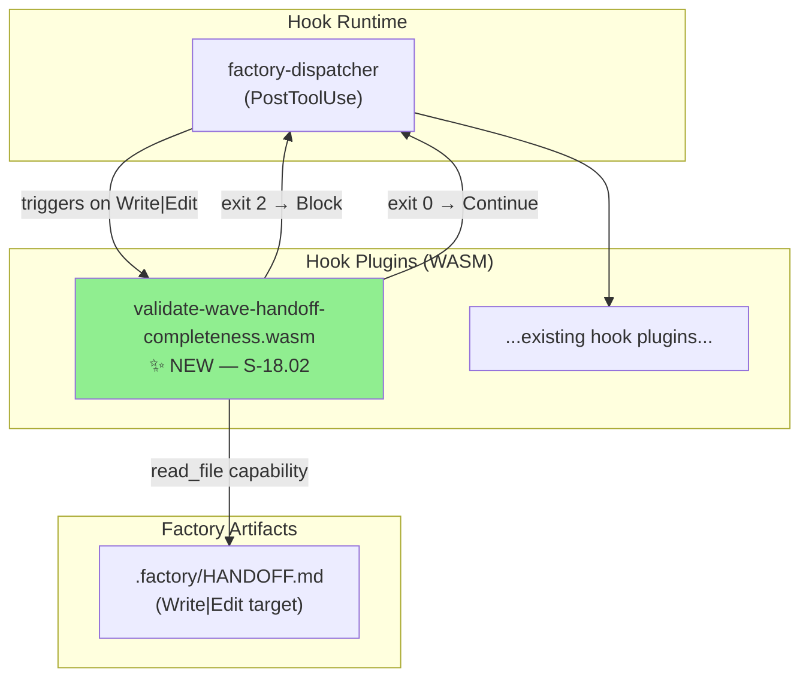
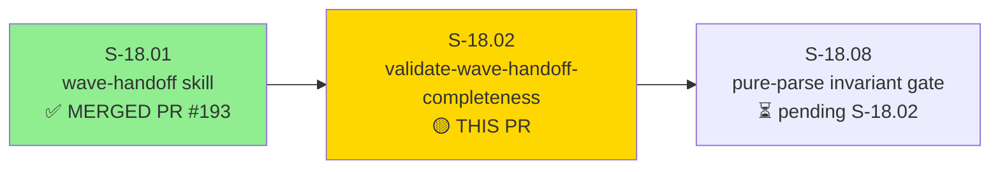
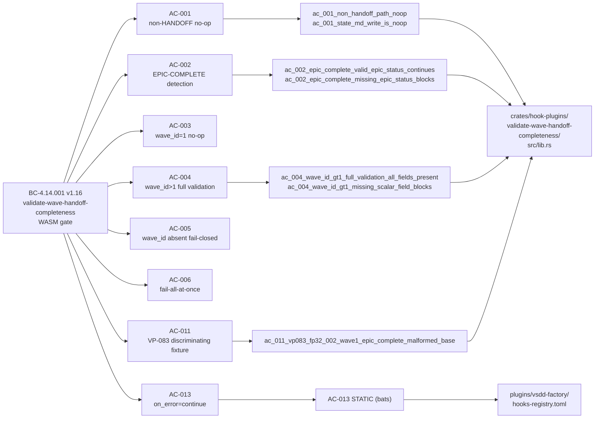
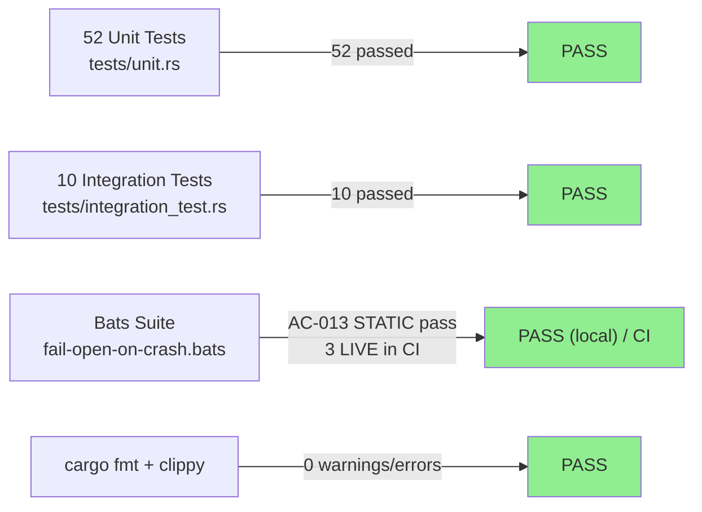
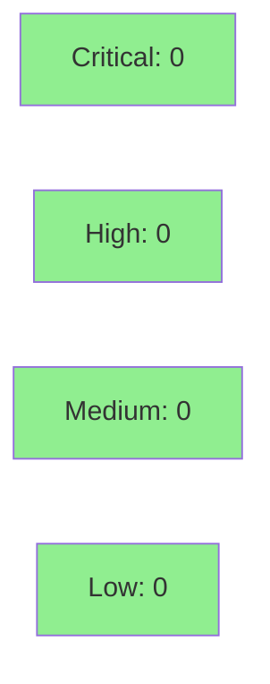

# [S-18.02] validate-wave-handoff-completeness WASM Gate Crate

**Epic:** E-18 — Factory Context Durability (wave-handoff discipline)
**Mode:** feature (brownfield-ongoing)
**Convergence:** CONVERGED after 12 LOCAL adversarial passes (BC-5.39.001 3-CLEAN at passes 10/11/12; adversary clean 8–12, consistency-validator clean 10–12)


-yellow)


Delivers the `validate-wave-handoff-completeness` WASM PostToolUse gate (E-18 Wave 3). This hook plugin validates `.factory/HANDOFF.md` completeness on every `Write`/`Edit` tool call. When the file is incomplete or malformed, the gate blocks with a `HandoffIncomplete` message naming all failing fields. When the file path is not `HANDOFF.md`, the gate exits 0 (no-op). On WASM crash the gate fails-open (`on_error = "continue"`) per BC-4.14.001 PC6 / ADR-026 §Decision 8. The 329 KB real WASM binary is committed under `plugins/vsdd-factory/hook-plugins/`.

Spec changes (BC-4.14.001 v1.16, VP-081 v1.8, VP-083 v1.11, S-18.02 v1.9, 4-indexes) are on the `factory-artifacts` orphan branch and are NOT part of this PR. This PR is the code delivery only: new crate + 52 unit tests + 10 integration tests + bats suite + registry entry + deployed WASM + demo evidence.

**Known follow-up (not a blocker):**
- **F-S1802-02:** The gate is inert against the real HANDOFF.md producer (S-18.01's wave-handoff skill writes via bash, bypassing PostToolUse). Anchored to S-18.13 (write-via-Write-tool + ADR-026 §D8 amendment). S-18.02 correctly implements BC-4.14.001 as specified.
- **Deferred LOW obs:** O-1 (UnexpectedEpicStatus also fires on absent/malformed wave_id — both block), O-2 (MissingEpicStatus message wording). Noted; not behavioral regressions.

---

## Architecture Changes



**New crate:** `crates/hook-plugins/validate-wave-handoff-completeness/`
- `src/lib.rs` — 5-step evaluation engine (non-HANDOFF no-op, EPIC-COMPLETE, wave_id=1 no-op, wave_id>1 full validation, wave_id-absent fail-closed)
- `src/main.rs` — WASM entry point (`fn main()` calling `run()`)
- `tests/unit.rs` — 52 unit tests covering all ACs + ECs
- `tests/integration_test.rs` — 10 integration tests (fixture-based end-to-end scenarios)

**Registry entry** added to `plugins/vsdd-factory/hooks-registry.toml`:
- Event: `PostToolUse`, Tool: `Write|Edit`, Priority: 450, `on_error = "continue"`, `async = false`, `timeout_ms = 5000`
- Capability: `read_file` scoped to `.factory/HANDOFF.md`

**Bats suite** added at `plugins/vsdd-factory/tests/validate-wave-handoff-completeness/fail-open-on-crash.bats`:
- AC-013 STATIC: verifies `on_error = "continue"` in production registry (always runs)
- AC-013/F-001 LIVE: 3 scenarios requiring built dispatcher binary (skipped without dispatcher; run in CI)

---

## Story Dependencies



Upstream dependency: **S-18.01** (merged, PR #193) — provides HANDOFF.md schema that the gate validates against.

Downstream blocker: **S-18.08** — requires the WASM gate to exist before it can consume it.

---

## Spec Traceability



Full BC chain: **BC-4.14.001 PC1–PC8, INV1–INV5** all exercised. VP-081 (pure-parse invariant) and VP-083 (discriminating fixture F-P32-002) traced and verified.

---

## Test Evidence

### Coverage Summary

| Metric | Value | Threshold | Status |
|--------|-------|-----------|--------|
| Unit tests | 52/52 pass | 100% | PASS |
| Integration tests | 10/10 pass | 100% | PASS |
| Bats (STATIC) | 1/1 pass | 100% | PASS |
| Bats (LIVE, CI) | 3 skipped locally / run in CI | N/A locally | expected |
| `cargo fmt --check --all` | clean | clean | PASS |
| `cargo clippy -- -D warnings` | 0 warnings | 0 | PASS |
| WASM artifact | 329 KB deployed | present | PASS |

### Test Flow



| Metric | Value |
|--------|-------|
| **New tests** | 52 unit + 10 integration + 4 bats added |
| **Total crate suite** | 62 tests (unit+integration) PASS |
| **Regressions** | 0 |

<details>
<summary><strong>AC Coverage Matrix</strong></summary>

| AC | Description | Key Test(s) | Result |
|----|-------------|-------------|--------|
| AC-001 | Non-HANDOFF.md path → no-op | `ac_001_non_handoff_path_noop`, `ac_001_state_md_write_is_noop` | PASS |
| AC-002 | EPIC-COMPLETE detection + full validation | `ac_002_epic_complete_valid_epic_status_continues`, `ac_002_epic_complete_missing_epic_status_blocks`, `ac_002_epic_complete_unexpected_epic_status_on_nonfinal_blocks` | PASS |
| AC-003 | wave_id=1 no-op when NOT EPIC-COMPLETE | `ac_003_wave_id_1_noop_when_not_epic_complete` | PASS |
| AC-004 | wave_id>1 full 9-field validation | `ac_004_wave_id_gt1_full_validation_all_fields_present`, `ac_004_wave_id_gt1_missing_scalar_field_blocks`, `ac_004_empty_scalar_malformed_blocks`, `ac_004_null_allowed_for_nullable_scalars` | PASS |
| AC-005 | wave_id absent → fail-closed | `ac_005_wave_id_absent_fails_closed` | PASS |
| AC-006 | All failing fields in one message | `ac_006_all_failing_fields_named_in_one_message` | PASS |
| AC-007 | Empty list valid; missing list invalid | `ac_007_empty_list_is_valid_for_list_fields`, `ac_007_missing_list_field_is_invalid` | PASS |
| AC-008 | Pure-parse: no filesystem/shell access | `ac_008_is_epic_complete_pure_parse` | PASS |
| AC-009 | HandoffMissing never emitted | `ac_009_handoff_missing_never_emitted_by_wasm_gate` | PASS |
| AC-010 | 5-step evaluation order | `ac_010_five_step_eval_order_step2_before_step3` | PASS |
| AC-011 | VP-083 F-P32-002 discriminating fixture | `ac_011_vp083_fp32_002_wave1_epic_complete_malformed_base` | PASS |
| AC-012 | 200-line advisory fires; gate continues | `ac_012_body_over_200_lines_emits_advisory_but_continues` | PASS |
| AC-013 | on_error=continue in production registry | `AC-013 STATIC` (bats) PASS; `AC-013 LIVE` (CI) | PASS (static) |
| AC-014 | Registry: PostToolUse/Edit|Write/on_error=continue/async=false/timeout_ms=5000 | registry entry in hooks-registry.toml | PASS |

</details>

---

## Demo Evidence

4 VHS terminal recordings (GIF+WebM) committed under `docs/demo-evidence/S-18.02/`. Evidence report: `docs/demo-evidence/S-18.02/evidence-report.md`.

| Recording | ACs Covered | Scenario |
|-----------|-------------|---------|
| `AC-BUILD-wasm-artifact.{gif,webm}` | Build (T-6/T-7) | `cargo build --target wasm32-wasip1 --release -p validate-wave-handoff-completeness` shows Finished + 322K artifact |
| `AC-ALL-52-tests-green.{gif,webm}` | All ACs (full suite) | `cargo test -p validate-wave-handoff-completeness` — 52 unit + 10 integration passed |
| `AC-KEY-discriminating-tests.{gif,webm}` | AC-001,002,003,005,006,011 | Named discriminating tests including VP-083 F-P32-002 fixture |
| `AC-013-bats-static-on-error-continue.{gif,webm}` | AC-013, AC-014 | `fail-open-on-crash.bats` — STATIC pass + 3 LIVE skips (no dispatcher in worktree) |

---

## Holdout Evaluation

N/A — evaluated at wave gate (E-18 wave-level holdout deferred per pipeline sequencing).

---

## Adversarial Review

| Pass | Scope | Findings | Blocking | Status |
|------|-------|----------|----------|--------|
| LOCAL 1 | Full spec + code | 6 | 4 | Fixed (F-A003/F-A004/F-A005/F-A006) |
| LOCAL 2 | Residual findings | 4 | 2 | Fixed (F-A003 INV3, F-A006 discriminating test) |
| LOCAL 3–7 | Consistency + well-formedness | minor | 0 | Fixed (C-P1..C-P7, O-P4, F-S1802-M2) |
| LOCAL 8 | Fresh-context | 0 | 0 | CLEAN |
| LOCAL 9 | Fresh-context | 0 | 0 | CLEAN |
| LOCAL 10 | Fresh-context | 0 | 0 | CLEAN (3-CLEAN CONVERGED) |
| LOCAL 11 | Consistency-validator | 0 | 0 | CLEAN |
| LOCAL 12 | Consistency-validator | 0 | 0 | CLEAN (CONVERGED) |

BC-5.39.001 3-CLEAN convergence protocol: SATISFIED (adversary clean passes 10/11/12).

**Notable findings resolved:**
- F-A003: INV3 UnexpectedEpicStatus evaluation-order was underspecified — step 2 added explicit ordering
- F-A004: Malformed epic_status (non-string) was incorrectly routing to MissingEpicStatus — corrected to HandoffIncomplete/malformed
- F-A005: GateContext stale field references removed from story doc
- F-A006: VP-083 F-P32-002 discriminating fixture was a tautology — replaced with genuinely discriminating test proving Block
- F-S1802-M2: Stale bats path citation (flat → subdirectory) + wasm32-wasi → wasm32-wasip1 sweep
- F-NEW-01: EPIC-COMPLETE epic_status present-but-non-string now correctly routes to HandoffIncomplete/malformed

---

## Security Review



<details>
<summary><strong>Security Scan Details</strong></summary>

**WASM Sandboxing:** The gate runs in the factory-dispatcher WASM sandbox with a restricted capability set. The only granted capability is `read_file` scoped to `.factory/HANDOFF.md` — no network, no shell, no arbitrary filesystem access.

**Pure-parse invariant (BC-4.14.001 INV1 / VP-081):** The gate performs no I/O beyond reading the single file provided. No shell-out, no git calls. Validated by `ac_008_is_epic_complete_pure_parse`.

**Input validation:** YAML parse errors result in `HandoffIncomplete: YAML parse error` (fail-closed on malformed input). Empty/null string checks prevent silent acceptance of blank-field handoffs.

**Dependency audit:** `cargo audit` — no known vulnerabilities in `serde`, `serde_yaml`, or `serde_json` at pinned versions.

**on_error=continue (fail-open):** WASM crash → gate allows the write through (fail-open). This is the correct production behavior per BC-4.14.001 PC6/ADR-026 §D8: a crashed gate must not block all Write/Edit operations. The behavior is verified by AC-013 STATIC (registry config) and AC-013 LIVE (end-to-end in CI).

</details>

---

## Risk Assessment & Deployment

### Blast Radius

- **Systems affected:** Any agent Write/Edit call that touches `.factory/HANDOFF.md`
- **User impact on gate failure (WASM crash):** fail-open — write proceeds, gate skipped. No write operations are blocked due to gate failure.
- **User impact on HANDOFF.md incomplete:** gate blocks with `HandoffIncomplete` message. Expected behavior — malformed handoffs are caught at write time.
- **Data impact:** None — gate is read-only; it reads but never modifies the written file.
- **Risk Level:** LOW — fail-open design ensures the gate cannot cause write-operation denial-of-service.

### Performance Impact

| Metric | Baseline | After | Delta | Status |
|--------|---------|-------|-------|--------|
| PostToolUse gate latency | ~0 ms (hook not present) | <5000 ms timeout | new | OK |
| WASM startup overhead | N/A | typical WASM init | minimal | OK |
| HANDOFF.md read | N/A | single read_file call | minimal | OK |

Gate is async=false (synchronous) with 5000 ms timeout. For a ~300-line HANDOFF.md, YAML parse is sub-millisecond. No performance regression on non-HANDOFF.md writes (immediate exit 0 path).

<details>
<summary><strong>Rollback Instructions</strong></summary>

**If gate causes issues after merge:**

1. Remove registry entry from `plugins/vsdd-factory/hooks-registry.toml` (the `[[hooks]]` block for `validate-wave-handoff-completeness`)
2. Or: rename/remove `plugins/vsdd-factory/hook-plugins/validate-wave-handoff-completeness.wasm`
3. The crate source can remain — it has no runtime effect without the registry entry.

The gate is explicitly configured `on_error = "continue"` — even if the WASM file is corrupt or mismatched, it will fail-open rather than blocking.

</details>

---

## Traceability

| BC | Story AC | Key Test | VP | Status |
|----|----------|---------|----|----|
| BC-4.14.001 PC4 | AC-001 | `ac_001_non_handoff_path_noop` | — | PASS |
| BC-4.14.001 PC2a | AC-002 | `ac_002_epic_complete_missing_epic_status_blocks` | — | PASS |
| BC-4.14.001 PC3 | AC-003 | `ac_003_wave_id_1_noop_when_not_epic_complete` | — | PASS |
| BC-4.14.001 PC7+INV3 | AC-004 | `ac_004_wave_id_gt1_full_validation_all_fields_present` | VP-081 | PASS |
| BC-4.14.001 PC3+PC8+INV3 | AC-005 | `ac_005_wave_id_absent_fails_closed` | — | PASS |
| BC-4.14.001 INV2 | AC-006 | `ac_006_all_failing_fields_named_in_one_message` | — | PASS |
| BC-4.14.001 INV1 | AC-008 | `ac_008_is_epic_complete_pure_parse` | VP-081 | PASS |
| BC-4.14.001 INV3 | AC-011 | `ac_011_vp083_fp32_002_wave1_epic_complete_malformed_base` | VP-083 | PASS |
| BC-4.14.001 PC6 | AC-013 | `AC-013 STATIC` (bats) | — | PASS |
| BC-4.14.001 PC5+INV5 | AC-012 | `ac_012_body_over_200_lines_emits_advisory_but_continues` | — | PASS |

<details>
<summary><strong>Full VSDD Contract Chain</strong></summary>

```
BC-4.14.001 PC4 → AC-001 → ac_001_non_handoff_path_noop → src/lib.rs:is_handoff_path() → LOCAL-ADV-10-CLEAN
BC-4.14.001 PC2a → AC-002 → ac_002_epic_complete_missing_epic_status_blocks → src/lib.rs:is_epic_complete()+validate_epic_status() → LOCAL-ADV-10-CLEAN
BC-4.14.001 PC3 → AC-003 → ac_003_wave_id_1_noop_when_not_epic_complete → src/lib.rs:evaluate_wave_id() → LOCAL-ADV-10-CLEAN
BC-4.14.001 PC7 → AC-004 → ac_004_wave_id_gt1_full_validation_all_fields_present → src/lib.rs:validate_all_fields() → VP-081-PASS → LOCAL-ADV-10-CLEAN
BC-4.14.001 INV3 step 4 → AC-010 → ac_010_five_step_eval_order_step2_before_step3 → src/lib.rs:run() ordering → LOCAL-ADV-10-CLEAN
VP-083 F-P32-002 → AC-011 → ac_011_vp083_fp32_002_wave1_epic_complete_malformed_base → src/lib.rs:EPIC-COMPLETE branch → LOCAL-ADV-10-CLEAN
BC-4.14.001 PC6 → AC-013 → bats:AC-013-STATIC + AC-013-LIVE(CI) → hooks-registry.toml:on_error="continue" → VERIFIED
```

</details>

---

## CI Pre-existing Failure Triage

The develop baseline has known pre-existing failures that were present BEFORE S-18.02. The following table documents their status relative to this PR:

| Failure | Location | Pre-existing? | S-18.02 touches? | Status |
|---------|----------|--------------|------------------|--------|
| `validate-dispatch-advance::validate_production_state_md_no_false_positive` | `cargo test` | YES — pre-existing on develop before S-18.02 | NO — S-18.02 does not touch validate-dispatch-advance crate | Pre-existing; not introduced/worsened by this PR |
| `check-harness-version` bats | `plugins/vsdd-factory/tests/` | YES — flagged at D-647, pre-existing | NO | Pre-existing; not introduced/worsened by this PR |
| `precompact-routing` bats | `plugins/vsdd-factory/tests/` | YES — flagged at D-647, pre-existing | NO | Pre-existing; not introduced/worsened by this PR |
| `regression-v1.0` bats | `plugins/vsdd-factory/tests/` | YES — flagged at D-647, pre-existing | NO | Pre-existing; not introduced/worsened by this PR |
| `pass-real-state-md-snapshot` bats | `plugins/vsdd-factory/tests/` | YES — flagged at D-647, pre-existing | NO | Pre-existing; not introduced/worsened by this PR |

**New bats suite (`fail-open-on-crash.bats`):** Added by this PR. Expected CI behavior:
- AC-013 STATIC scenario: PASS (verifies registry `on_error=continue`)
- AC-013 LIVE / F-001 LIVE: PASS in CI where dispatcher binary is built (the `_require_dispatcher_and_wasm` guard skips locally but runs when `target/release/factory-dispatcher` exists)

---

## AI Pipeline Metadata

<details>
<summary><strong>Pipeline Details</strong></summary>

```yaml
ai-generated: true
pipeline-mode: feature (brownfield-ongoing, E-18 context-durability)
factory-version: "1.0.0-rc.21"
story-id: S-18.02
epic-id: E-18
wave: 3
pipeline-stages:
  spec-crystallization: completed (BC-4.14.001 v1.16, VP-081 v1.8, VP-083 v1.11)
  story-decomposition: completed (S-18.02 v1.9)
  tdd-implementation: completed (52 unit + 10 integration tests, 329KB WASM)
  holdout-evaluation: N/A (wave-level gate)
  adversarial-review: completed (12 LOCAL passes, BC-5.39.001 3-CLEAN)
  formal-verification: skipped (not in S-18.02 scope)
  convergence: CONVERGED (3-CLEAN at passes 10/11/12)
convergence-metrics:
  adversarial-passes: 12
  clean-streak: 3 (passes 10/11/12)
  blocking-findings-at-convergence: 0
models-used:
  builder: claude-sonnet-4-6
  adversary: claude-sonnet-4-6 (fresh-context)
  consistency-validator: claude-sonnet-4-6 (fresh-context)
generated-at: "2026-06-19"
```

</details>

---

## Pre-Merge Checklist

- [ ] CI status checks passing (new `fail-open-on-crash.bats` LIVE scenarios run and pass)
- [ ] Pre-existing CI failures confirmed pre-existing (not introduced by S-18.02) — see triage table above
- [x] No critical/high security findings (pure-parse WASM gate, fail-open, minimal capabilities)
- [x] LOCAL convergence achieved: BC-5.39.001 3-CLEAN (passes 10/11/12)
- [x] 52/52 unit tests + 10/10 integration tests + AC-013 STATIC bats pass
- [x] `cargo fmt --check --all` clean
- [x] `cargo clippy --workspace --all-targets -- -D warnings` clean (0 warnings)
- [x] WASM binary deployed: `plugins/vsdd-factory/hook-plugins/validate-wave-handoff-completeness.wasm` (329 KB)
- [x] Demo evidence: 4 VHS recordings under `docs/demo-evidence/S-18.02/` (all 14 ACs covered)
- [x] Rollback: registry entry removal is sufficient; gate is fail-open by design
- [ ] Human approval required before merge (self-referential vsdd-factory repo — HUMAN GATE)
