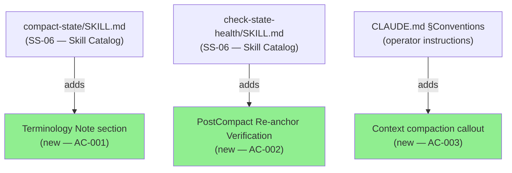
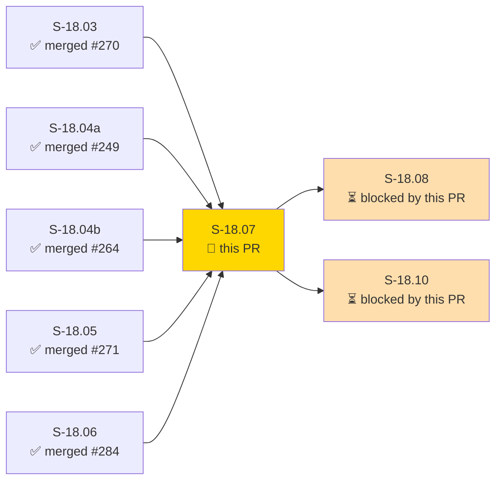
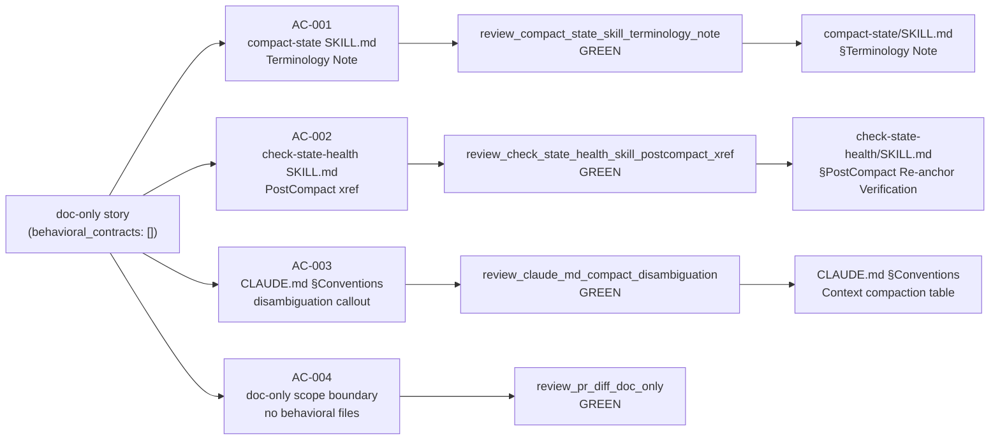
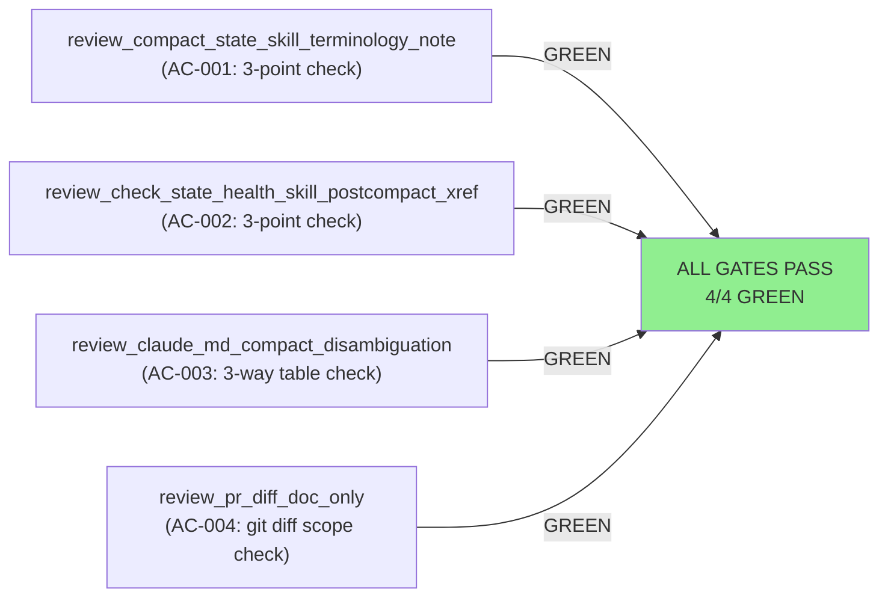
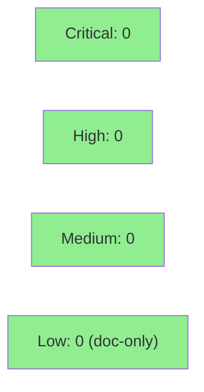

# [S-18.07] E-18 Terminology Disambiguation Docs — compact-state vs PreCompact Flush Cross-References

**Epic:** E-18 — Factory Context Durability (feature #173)
**Mode:** feature
**Convergence:** CONVERGED after 7 LOCAL adversarial passes (passes 5/6/7 clean — 3-CLEAN satisfied per BC-5.39.001)


This PR delivers the E-18 terminology disambiguation documentation for the factory context-durability feature. It adds clear disambiguation callouts to `compact-state/SKILL.md`, `check-state-health/SKILL.md`, and `CLAUDE.md §Conventions` that distinguish the `/compact-state` skill (manual STATE.md reorganization — does NOT invoke `/compact`) from the `PreCompact`/`PostCompact` hook events (automatic harness-driven compaction via `precompact-flush.wasm` and `postcompact-reanchor.sh`). This is a **doc-only story** (`tdd_mode: facade`; `behavioral_contracts: []`); all four deliverable acceptance criteria are documentation review gates, all confirmed GREEN before push.

---

## Architecture Changes



<details>
<summary><strong>Architecture Decision Record</strong></summary>

### ADR: ADR-026 §Decision 7 — PostCompact re-anchor advisory hook + operator interface terminology

**Context:** E-18 shipped multiple interacting context-durability mechanisms (precompact-flush WASM plugin, postcompact-reanchor.sh, rehydrate-wave skill, compact-state skill). Without explicit disambiguation documentation, operators and agents confuse manual `/compact-state` invocation with the automatic `PreCompact`/`PostCompact` hook chain, leading to incorrect operator actions that bypass the E-18 context-durability guarantee chain.

**Decision:** Add authoritative terminology disambiguation to the two directly relevant SKILL.md files and to CLAUDE.md §Conventions, per ADR-026 §Decision 7. Doc-only scope (AC-004 absolute); no behavioral changes.

**Rationale:** Downstream story S-18.08 (pure-parse invariant gate) scans for stale terminology and broken cross-references across all E-18 docs. The correct terminology must be in place before S-18.08's sweep. This story (Wave 6) depends on all prior E-18 deliverables (S-18.03/04a/04b/05/06) being merged so cross-references can be accurately worded.

**Consequences:**
- Operator confusion between `/compact-state` and PreCompact/PostCompact hook events is eliminated at the documentation layer.
- S-18.08 gate is unblocked.

</details>

---

## Story Dependencies



All upstream dependency PRs (S-18.03 #270, S-18.04a #249, S-18.04b #264, S-18.05 #271, S-18.06 #284) are merged to develop. This PR unblocks S-18.08 and S-18.10.

---

## Spec Traceability



**BC traceability:** N/A — doc-only story (`behavioral_contracts: []`, `tdd_mode: facade`). No BC-S.SS.NNN contracts. Traceability chain: `ADR-026 §Decision 7 → AC-001/002/003/004 → documentation review gates → delivered .md files`.

---

## Test Evidence

### Coverage Summary (doc-only facade mode)

| Gate | AC | File | Method | Status |
|------|----|------|--------|--------|
| `review_compact_state_skill_terminology_note` | AC-001 | `plugins/vsdd-factory/skills/compact-state/SKILL.md` | Read + excerpt review | GREEN |
| `review_check_state_health_skill_postcompact_xref` | AC-002 | `plugins/vsdd-factory/skills/check-state-health/SKILL.md` | Read + excerpt review | GREEN |
| `review_claude_md_compact_disambiguation` | AC-003 | `CLAUDE.md` §Conventions | Read + excerpt review | GREEN |
| `review_pr_diff_doc_only` | AC-004 | git diff `--name-only develop` | Scope boundary check | GREEN |

No Rust unit tests, bats tests, or mutation tests apply (`tdd_mode: facade`). Mutation testing replacement (per story spec §Red Gate Test Plan): wave-gate verifier confirms AC-001/002 terminology changes are substantive (not stub placeholders) by reading actual delivered file content. All 4 review gates confirmed GREEN in demo evidence report at `docs/demo-evidence/S-18.07/README.md` (commit 2864c194).

### Test Flow



| Metric | Value |
|--------|-------|
| **Review gates** | 4/4 PASS |
| **Behavioral tests** | N/A (doc-only facade) |
| **Mutation testing** | N/A (doc-only facade) |
| **Regressions** | None |

<details>
<summary><strong>AC-001 Point-by-Point Evidence</strong></summary>

| AC-001 Point | Requirement | Status |
|---|---|---|
| Point 1 | Distinguishes `/compact-state` (extracts STATE.md content into cycle files; does NOT invoke Claude Code `/compact`) from `PreCompact` hook event (`precompact-flush.wasm`, fires automatically) | PRESENT |
| Point 2 | States invoking `/compact-state` does NOT fire the `PreCompact` hook chain | PRESENT |
| Point 3 | Cross-references `/rehydrate-wave` as the mandatory first step after any session clear | PRESENT |

</details>

<details>
<summary><strong>AC-002 Point-by-Point Evidence</strong></summary>

| AC-002 Point | Requirement | Status |
|---|---|---|
| Point 1 | Cross-references `postcompact-reanchor.sh` (S-18.05 deliverable) and explains it emits a `[PostCompact Re-anchor]` block to stdout | PRESENT |
| Point 2 | Adds operator step to confirm the re-anchor block appeared (or run `/rehydrate-wave` if absent) | PRESENT |
| Point 3 | Does NOT imply `check-state-health` blocks or prevents compaction (advisory only) | PRESENT |

</details>

---

## Holdout Evaluation

N/A — evaluated at wave gate (doc-only facade story; no behavioral contracts; no holdout scenarios applicable).

---

## Adversarial Review

| Pass | Scope | Findings | Status |
|------|-------|----------|--------|
| LOCAL P1 | Initial impl review | F-P1-001: `/compact` invocation factual error | Fixed in v1.6 |
| LOCAL P2 | Post-fix review | F-P2-001: `precompact-flush.sh` stale ref (.sh → .wasm) | Fixed in v1.6 |
| LOCAL P3 | Post-fix review | P3: CLEAN | Streak 1/3 |
| LOCAL P4 | Re-review | P4 recurrence: `/compact` factual error (human-adjudicated) | Fixed in v1.7 |
| LOCAL P5 | Post-fix review | P5: CLEAN | Streak 1/3 |
| LOCAL P6 | Re-review | P6: CLEAN | Streak 2/3 |
| LOCAL P7 | Re-review | P7: CLEAN | Streak 3/3 — **3-CLEAN CONVERGED** |

**Convergence:** LOCAL adversarial cascade reached 3-CLEAN (passes 5/6/7 clean) per BC-5.39.001. Earlier passes drove two fixes: `.sh`→`.wasm` artifact name correction (story v1.6) and a `/compact`-invocation factual correction (story v1.7, human-adjudicated).

<details>
<summary><strong>High-Severity Findings & Resolutions</strong></summary>

### Finding F-P1-001 / F-P4-recurrence: `/compact` invocation factual error

- **Location:** `compact-state/SKILL.md` §Terminology Note + story spec AC-001 point 1
- **Category:** spec-fidelity / factual accuracy
- **Problem:** Initial text stated `/compact-state` "invokes the Claude Code `/compact` command." The actual behavior is: `/compact-state` extracts historical content from STATE.md into cycle files and slims STATE.md. It does NOT invoke `/compact`.
- **Resolution:** Rewrote AC-001 point 1 and the `compact-state/SKILL.md` Terminology Note to describe as-delivered behavior: "extracts STATE.md historical content into cycle files and slims STATE.md — does NOT invoke the Claude Code `/compact` command." Human-adjudicated at v1.7.

### Finding F-P2-001: stale `precompact-flush.sh` artifact reference

- **Location:** story spec AC-001 + AC-003 + compact-state/SKILL.md + CLAUDE.md
- **Category:** spec-fidelity / artifact naming
- **Problem:** References to `precompact-flush.sh` (bash hook) were stale; S-18.04a delivered `precompact-flush.wasm` (native WASM plugin per ADR-028 §Decision 2).
- **Resolution:** Updated all references from `precompact-flush.sh` to `precompact-flush.wasm` in story v1.6 and all three delivered .md files. `postcompact-reanchor.sh` left unchanged (genuinely bash).

</details>

---

## Security Review

Doc-only story. No executable code, no shell scripts, no WASM binaries, no Rust source modified. Security review: N/A (pure markdown documentation; no attack surface).



No SAST, dependency audit, or formal verification applicable for documentation-only changes.

---

## Risk Assessment & Deployment

### Blast Radius

- **Systems affected:** Operator-facing documentation only (`compact-state/SKILL.md`, `check-state-health/SKILL.md`, `CLAUDE.md §Conventions`)
- **User impact:** Improved operator comprehension; no behavioral change possible on failure
- **Data impact:** None
- **Risk Level:** LOW — documentation only; no executable artifacts modified; no behavioral changes

### Performance Impact

Not applicable — doc-only changes have zero runtime performance impact.

<details>
<summary><strong>Rollback Instructions</strong></summary>

**Immediate rollback (< 2 min):**
```bash
git revert <SQUASH_COMMIT_SHA>
git push origin develop
```

No feature flags. No monitoring alerts required. Rollback simply removes the disambiguation text from the three `.md` files; no downstream behavioral state to unwind.

</details>

### Feature Flags

Not applicable — documentation-only story; no runtime feature flags.

---

## Traceability

| Requirement | Story AC | Verification | Status |
|-------------|---------|-------------|--------|
| ADR-026 §D7 — compact-state vs PreCompact disambiguation in compact-state/SKILL.md | AC-001 | review_compact_state_skill_terminology_note | PASS |
| ADR-026 §D7 + §D4 — PostCompact re-anchor cross-reference in check-state-health/SKILL.md | AC-002 | review_check_state_health_skill_postcompact_xref | PASS |
| CLAUDE.md §Conventions — three-way compact-state / PreCompact / PostCompact callout | AC-003 | review_claude_md_compact_disambiguation | PASS |
| ADR-026 §D4 + §D7 — no behavioral files modified (doc-only scope boundary) | AC-004 | review_pr_diff_doc_only | PASS |

<details>
<summary><strong>Full VSDD Contract Chain</strong></summary>

```
ADR-026 §D7 → AC-001 → review_compact_state_skill_terminology_note → compact-state/SKILL.md §Terminology Note → LOCAL-ADV-P7-CLEAN
ADR-026 §D7 + §D4 → AC-002 → review_check_state_health_skill_postcompact_xref → check-state-health/SKILL.md §PostCompact Re-anchor Verification → LOCAL-ADV-P7-CLEAN
CLAUDE.md §Conventions → AC-003 → review_claude_md_compact_disambiguation → CLAUDE.md Context compaction table → LOCAL-ADV-P7-CLEAN
ADR-026 §D4 + §D7 → AC-004 → review_pr_diff_doc_only → git diff --name-only develop = 3 .md files only → LOCAL-ADV-P7-CLEAN
```

</details>

---

## Demo Evidence

Full per-AC evidence report: [`docs/demo-evidence/S-18.07/README.md`](docs/demo-evidence/S-18.07/README.md) (commit 2864c194).

VHS/Playwright recordings are not applicable for a doc-only story. Evidence is captured as verbatim excerpts from the delivered content with point-by-point AC confirmation tables. All 4 gates GREEN.

---

## AI Pipeline Metadata

<details>
<summary><strong>Pipeline Details</strong></summary>

```yaml
ai-generated: true
pipeline-mode: feature
factory-version: "1.0.0-rc.16"
pipeline-stages:
  spec-crystallization: completed (v1.7 after 7-pass LOCAL adversarial cascade)
  story-decomposition: completed
  tdd-implementation: completed (facade mode — documentation review gates)
  holdout-evaluation: N/A (doc-only story)
  adversarial-review: completed (LOCAL 3-CLEAN; passes 5/6/7 clean)
  formal-verification: N/A (doc-only story)
  convergence: achieved (BC-5.39.001 3-CLEAN)
convergence-metrics:
  local-adversarial-passes: 7
  3-clean-streak: "passes 5/6/7"
  findings-driven-fixes: 2 (F-P2-001 wasm-ref fix; F-P4-recurrence compact-factual-fix)
  doc-gates-passing: "4/4"
adversarial-passes: 7 (LOCAL cascade)
models-used:
  builder: claude-sonnet-4-6
  adversary: gemini (local cascade)
story-spec-version: "1.7"
generated-at: "2026-06-27"
```

</details>

---

## Pre-Merge Checklist

- [ ] All CI status checks passing
- [x] Coverage delta: N/A (doc-only; no coverage metric)
- [x] No critical/high security findings (doc-only; N/A)
- [x] Rollback procedure documented above
- [x] No feature flags required
- [x] Human review: STOP-BEFORE-PR-MERGE constraint (D-665) — human merges directly
- [x] No monitoring alerts required (doc-only, no production runtime impact)
- [x] All 4 documentation review gates GREEN (AC-001 through AC-004)
- [x] LOCAL adversarial cascade: 3-CLEAN CONVERGED (passes 5/6/7)
- [x] Demo evidence committed: `docs/demo-evidence/S-18.07/README.md` (2864c194)
- [x] All upstream dependency PRs merged (S-18.03 #270, S-18.04a #249, S-18.04b #264, S-18.05 #271, S-18.06 #284)
- [x] AC-004 scope boundary: git diff shows ONLY `.md` files
