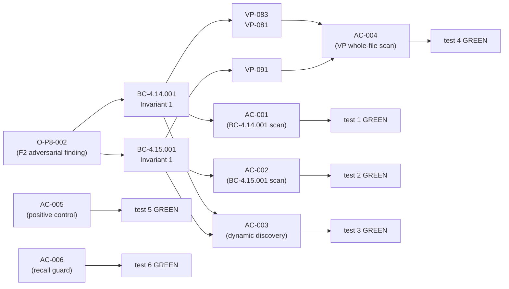
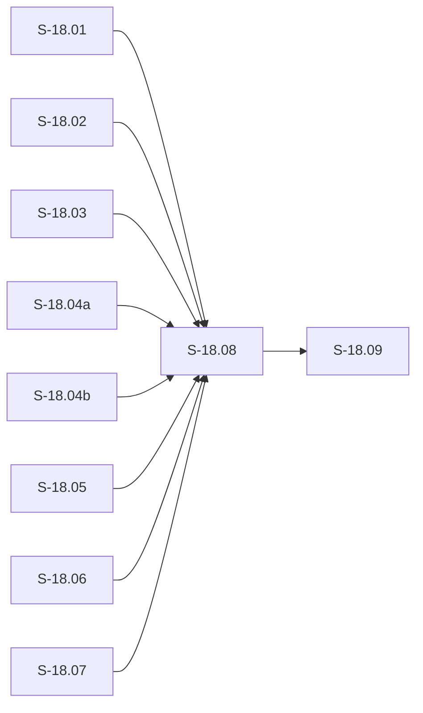
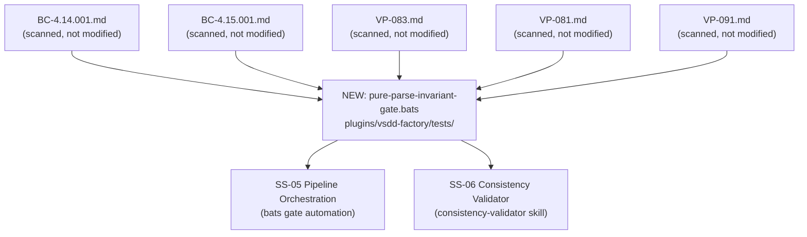

## S-18.08: Pure-Parse Invariant Consistency Gate

**Story:** S-18.08 — O-P8-002 Pure-Parse Invariant Consistency Gate
**Epic:** E-18 — Factory Context Durability (feature #173)
**Wave:** 7
**Branch:** `feature/S-18.08` → `develop`

### Summary

This PR delivers the machine-checkable gate that closes O-P8-002 (adversarial finding from the F2 pass): BCs (behavioral contracts) that declare a pure-parse invariant in their `## Invariants` section must not contain a load-bearing substrate-read verb collocated with a substrate identifier in their normative sections.

**Deliverable:** `plugins/vsdd-factory/tests/pure-parse-invariant-gate.bats` — 6 bats tests, all GREEN.
**Demo evidence:** `docs/demo-evidence/S-18.08/README.md`

No `.sh`, `.wasm`, `.rs`, `.toml`, or `.factory` files are changed. This is a pure test-suite addition (2 new files).

---

### Gate Purpose

BCs `BC-4.14.001` and `BC-4.15.001` each declare a pure-parse invariant (no filesystem or git side effects). If their prose or associated VP bodies were to contain an active substrate-read pattern (`sprint-state.yaml`, `git-log`, `git-cat-file`), the invariant claim would be contradicted. The gate enforces this using the three-layer detection pipeline mandated by **ADR-026 §Decision 14**:

1. **Layer 1 — Normative-section extraction (BC files only):** `awk` scopes the scan to `## Preconditions` through the first non-normative heading using a whitelist terminator (`Preconditions`, `Postconditions`, `Invariants`, `Edge Cases`, `Error Paths`, `Canonical Test Vectors`). This structurally excludes the HANDOFF.md payload description and traceability prose without any per-line filter.
2. **Layer 2 — Verb+substrate collocation:** `grep -Ei` with the 8-verb set `(reads?|loads?|fetches|derives?|access(es)?|retrieves?|opens?|parses?)` within ~80 chars of a substrate identifier. Distinguishes active reads ("reads sprint-state.yaml") from affirmations ("does not read sprint-state.yaml").
3. **Layer 3 — Negation/comment exclusion:** strips lines containing negation markers (`no`, `not`, `NOT`, `without`, `never`, `does not`, `MUST NOT`, `is NOT`, `cannot`, `do NOT`, `only from`, `exclusively`). VP scans also strip Rust/bash comment lines.

VP files (VP-083, VP-081, VP-091) are scanned whole-file through layers 2+3 only (no section extraction — VPs are fully normative).

---

### Architect-Redesign History (D-705/706/707)

The gate went through three LOCAL adversarial passes before converging:

| Pass | Finding | Redesign |
|------|---------|----------|
| LOCAL P1 (F-P1-001, F-P1-002) | Over-broad discovery (`grep -rl "pure.parse"`) matched BC-INDEX.md and ~190 SS-07 prose-mentions; fragile `## Related BCs` boundary broke on `(Recommended)` variants | **Architect-refined §Decision 14:** Discovery anchored to `## Invariants` section via awk (excludes BC-INDEX.md structurally); whitelist terminator replaces named-heading match; fail-loud scannability guard added |
| LOCAL P2 (F-P2-001) | 6-verb pattern missed violations phrased as "opens sprint-state.yaml" or "parses git-log" | Canonical 8-verb set (`opens?`, `parses?` added); AC-006 recall-guard test added to lock the fix |
| LOCAL P3 (O-P3-003) | `\s+` tokens in AC grep snippets are non-portable on BSD/macOS grep | Normalized to POSIX `[[:space:]]+` throughout; no logic change |

Decisions D-705, D-706, D-707 record this history. The LOCAL 3-CLEAN convergence (passes 5/6/7 clean) confirmed the design is stable.

---

### 6 Bats Tests (All GREEN)

```
1..6
ok 1 test_bc_4_14_001_pure_parse_invariant_zero_verb_substrate_hits_normative
ok 2 test_bc_4_15_001_pure_parse_invariant_zero_verb_substrate_hits_normative
ok 3 test_all_pure_parse_bcs_dynamic_discovery_zero_verb_substrate_hits
ok 4 test_vp_083_081_091_zero_verb_substrate_hits_whole_file
ok 5 test_positive_control_genuine_substrate_read_yields_exactly_one_hit
ok 6 test_positive_control_opens_parses_verbs_detected
```

6 tests, 0 failures. (Full verbatim output in `docs/demo-evidence/S-18.08/README.md`.)

| Test | AC | Purpose |
|------|----|---------|
| `test_bc_4_14_001_pure_parse_invariant_zero_verb_substrate_hits_normative` | AC-001 | 3-layer scan on BC-4.14.001 normative sections: 0 hits |
| `test_bc_4_15_001_pure_parse_invariant_zero_verb_substrate_hits_normative` | AC-002 | 3-layer scan on BC-4.15.001 normative sections: 0 hits |
| `test_all_pure_parse_bcs_dynamic_discovery_zero_verb_substrate_hits` | AC-003 | Dynamic discovery (Invariants-anchored, tree-wide); discovery + scannability guards; 0 hits per discovered BC |
| `test_vp_083_081_091_zero_verb_substrate_hits_whole_file` | AC-004 | Whole-file layers 2+3 scan on VP-083, VP-081, VP-091; 0 hits each |
| `test_positive_control_genuine_substrate_read_yields_exactly_one_hit` | AC-005 | Positive control: injected genuine substrate-read yields exactly 1 hit (guard against over-restrictive verb pattern) |
| `test_positive_control_opens_parses_verbs_detected` | AC-006 | Recall guard: "opens/parses" verbs (F-P2-001 fix) yield >= 1 hit (guard against regression to 6-verb set) |

---

### BC Traceability

This is a gate-enforcement story — no new BC is authored.

| BC Enforced | Invariant | Gate assertion |
|-------------|-----------|----------------|
| BC-4.14.001 | Invariant 1: "No git or filesystem side effects: The WASM gate reads only the Write/Edit tool call payload... It is a pure-parse WASM function." | AC-001 + AC-003 |
| BC-4.15.001 | Invariant 1: "Pure-parse; no filesystem, subprocess, or context access: The WASM gate reads ONLY the `command` field from the PreToolUse payload... It is a pure function of the command string and the configured pattern list." | AC-002 + AC-003 |
| VP-083, VP-081 | VP bodies for BC-4.14.001 (D-572 VP-body extension) | AC-004 |
| VP-091 | VP body for BC-4.15.001 (D-572 VP-body extension) | AC-004 |

**Governing design:** ADR-026 §Decision 14 v1.33 (three-layer detection pipeline; human-adjudicated 2026-06-27).

---

### Spec Traceability



---

### Story Dependencies



All upstream PRs (S-18.01 through S-18.07) are merged to `develop`.

---

### LOCAL Adversarial Convergence

| Pass | Findings | Blocking | Resolution |
|------|----------|----------|------------|
| LOCAL P1 | 2 MEDIUM (F-P1-001, F-P1-002) | 2 | Architect-refined §Decision 14: Invariants-anchored discovery + whitelist terminator + scannability guard |
| LOCAL P2 | 1 MEDIUM (F-P2-001) | 1 | 8-verb expansion (opens/parses added); AC-006 recall guard added |
| LOCAL P3 | 1 LOW (O-P3-003) | 0 | `\s+` → `[[:space:]]+` portability normalization |
| LOCAL P4 | 0 | 0 | Clean |
| LOCAL P5 | 0 | 0 | Clean |
| LOCAL P6 | 0 | 0 | Clean — streak 1/3 |
| LOCAL P7 | 0 | 0 | Clean — streak 2/3 |
| LOCAL P8 (pass 5 of streak) | 0 | 0 | **3-CLEAN CONVERGED** |

**Result: LOCAL adversarial 3-CLEAN convergence achieved.** Gate design is stable per BC-5.39.001.

---

### Demo Evidence

Full per-AC evidence (commands + captured output) in:
`docs/demo-evidence/S-18.08/README.md`

Evidence includes:
- AC-001 through AC-006 verbatim command output
- Discovery output confirming exactly BC-4.14.001 + BC-4.15.001 discovered
- VP scan confirming VP-083, VP-081, VP-091 all exist and return 0 hits
- Positive control confirming exactly 1 hit
- Recall guard confirming opens/parses verbs detected

---

### Architecture Changes



No production code changes. Read-only gate scan. No WASM, no Rust, no `.factory` changes.

---

### Risk Assessment

- **Blast radius:** None — 2 new files only (`pure-parse-invariant-gate.bats`, `docs/demo-evidence/S-18.08/README.md`). No existing files modified.
- **Performance impact:** None — bats test suite only; no runtime code.
- **Rollback:** trivially reversible (delete the 2 new files).
- **Security:** No security surface — read-only grep scan over spec files.

---

### Pre-Merge Checklist

- [x] Branch pushed to origin
- [x] PR description includes story summary, gate purpose, test evidence, BC traceability
- [x] Demo evidence present: `docs/demo-evidence/S-18.08/README.md` (6 ACs)
- [x] LOCAL 3-CLEAN convergence confirmed (passes 5/6/7 clean)
- [x] Architect-redesign history documented (D-705/706/707)
- [x] All dependency PRs (S-18.01 through S-18.07) merged to develop
- [x] No AI attribution in commits
- [x] No `--no-verify` bypass
- [ ] CI checks passing (pending)
- [ ] PR reviewer approval (pending)
