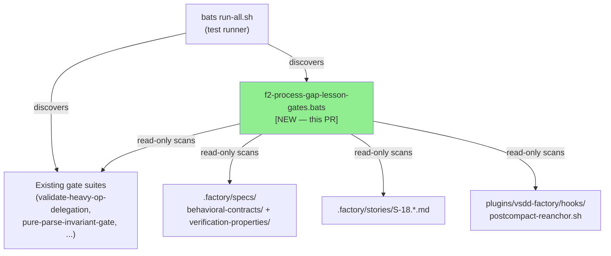
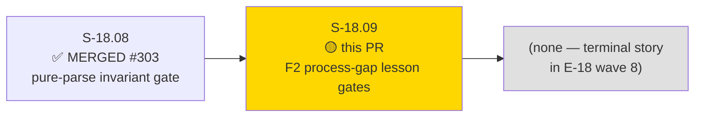
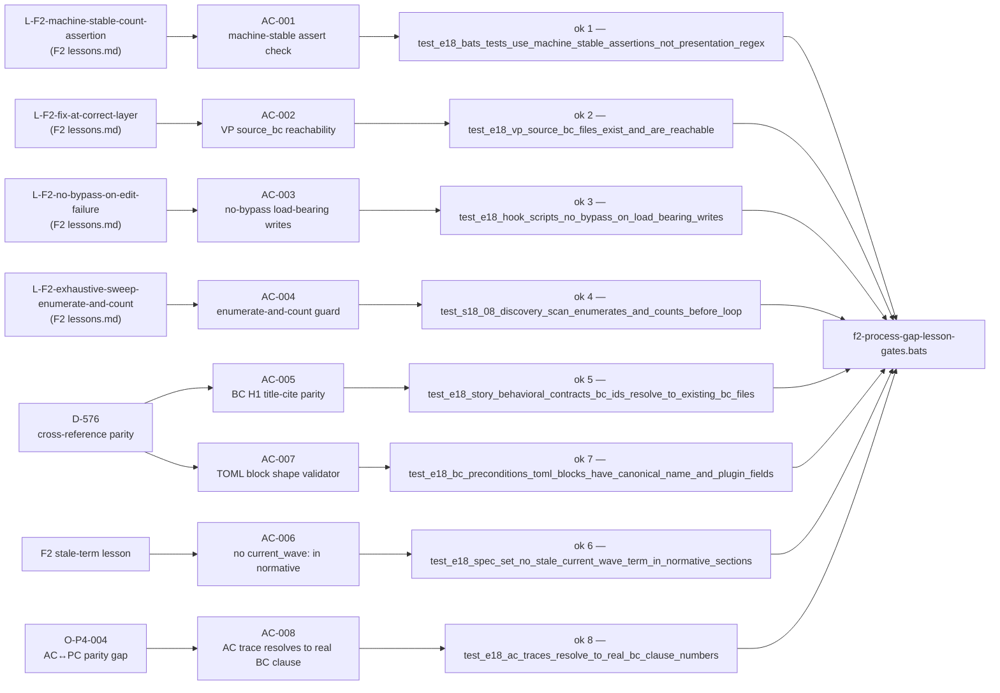
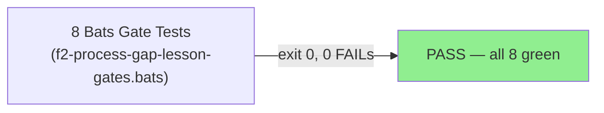
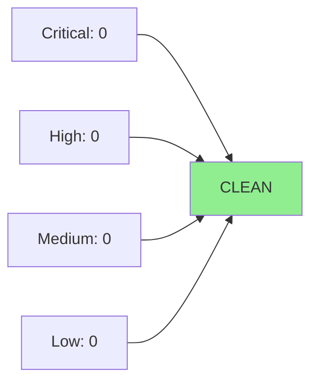

# [S-18.09] F2 Process-Gap Lesson Gate Checks — Machine-Stable Assertions + Stale-Term Detector + BC-Precondition Registry-Block-Shape Validator + AC↔PC Parity Gate

**Epic:** E-18 — Factory Context Durability (feature #173)
**Mode:** feature (brownfield)
**Convergence:** CONVERGED — LOCAL adversarial cascade 3-CLEAN (passes 6/7/8 clean; cascade history: 8 passes, decisions D-711..D-715)


This PR delivers the terminal story in E-18 (wave 8): a single bats gate suite `plugins/vsdd-factory/tests/f2-process-gap-lesson-gates.bats` containing 8 machine-checkable gate assertions (AC-001 through AC-008). The suite permanently machine-enforces the F2 adversarial-convergence process-gap lessons codified in `.factory/cycles/v1.0-brownfield-backfill/lessons.md`, the D-576 BC-precondition registry-block-shape discipline, and the O-P4-004 AC↔PC parity obligation — all at the E-18 wave-8 terminal gate boundary. No new BCs are authored; no Rust crates, WASM binaries, or hook scripts are modified. Diff scope: two new files only (`f2-process-gap-lesson-gates.bats` + `docs/demo-evidence/S-18.09/evidence-report.md`).

---

## Architecture Changes



<details>
<summary><strong>Architecture Decision Record</strong></summary>

### ADR: ADR-026 — Pure-Parse WASM Gate Invariant (anchored)

**Context:** The E-18 F2 adversarial convergence passes identified recurring process gaps: test harnesses asserting against presentation-coupled regex, VP bodies asserting behavior beyond source-BC guarantors, hook scripts suppressing edit failures with `|| true`, discovery scans silently passing over empty sets, and AC cites that mis-number BC postcondition/invariant clauses. These gaps recurred because the lessons were prose-only in lessons.md — not machine-enforced.

**Decision:** Deliver a bats gate suite that machine-enforces each lesson as an executable grep assertion at the E-18 wave-8 terminal gate boundary. No new BC is authored — this is a gate-enforcement story (behavioral_contracts: []).

**Rationale:** Prose lessons alone cannot catch regressions introduced by future stories. Machine-checkable grep gates run with every bats invocation and fail immediately on regression. The bats + grep approach is consistent with existing E-18 gate suites (S-18.06, S-18.08) and requires no new Rust crates or WASM compilation.

**Alternatives Considered:**
1. WASM hook plugin — rejected because this is a pure-parse read-only gate; WASM is appropriate for live hook dispatch, not offline spec consistency checks.
2. Defer to prose lessons.md — rejected because the F2 lessons already existed as prose; the gap was the absence of machine enforcement.

**Consequences:**
- Permanent machine enforcement of F2 lessons at the E-18 boundary
- Terminal story closes E-18 wave-8 with zero downstream dependents

</details>

---

## Story Dependencies



**Dependency status:** S-18.08 (PR #303) — MERGED. All E-18 upstream stories are in MERGED state (S-18.00 through S-18.08, S-18.13, S-18.14).

---

## Spec Traceability



---

## Test Evidence

### Coverage Summary

| Metric | Value | Threshold | Status |
|--------|-------|-----------|--------|
| Bats gate tests | 8/8 PASS | 8/8 | PASS |
| AC coverage | 8/8 (AC-001..AC-008) | 100% | PASS |
| Exit code | 0 | 0 | PASS |
| FAIL lines in output | 0 | 0 | PASS |
| Mutation kill rate | N/A (grep/awk shell gates) | N/A | N/A |
| Holdout satisfaction | N/A — evaluated at wave gate | N/A | N/A |

### Test Flow



| Metric | Value |
|--------|-------|
| **New tests** | 8 added (AC-001 through AC-008) |
| **Total suite** | 8 tests, 8 PASS, 0 FAIL |
| **Coverage delta** | 8 new bats assertions |
| **Mutation kill rate** | N/A (shell gate suite — no Rust crates) |
| **Regressions** | 0 |

<details>
<summary><strong>Detailed Test Results</strong></summary>

### New Tests (This PR)

| Test | Result |
|------|--------|
| `ok 1 test_e18_bats_tests_use_machine_stable_assertions_not_presentation_regex` | PASS |
| `ok 2 test_e18_vp_source_bc_files_exist_and_are_reachable` | PASS |
| `ok 3 test_e18_hook_scripts_no_bypass_on_load_bearing_writes` | PASS |
| `ok 4 test_s18_08_discovery_scan_enumerates_and_counts_before_loop` | PASS |
| `ok 5 test_e18_story_behavioral_contracts_bc_ids_resolve_to_existing_bc_files` | PASS |
| `ok 6 test_e18_spec_set_no_stale_current_wave_term_in_normative_sections` | PASS |
| `ok 7 test_e18_bc_preconditions_toml_blocks_have_canonical_name_and_plugin_fields` | PASS |
| `ok 8 test_e18_ac_traces_resolve_to_real_bc_clause_numbers` | PASS |

Full bats output captured in `docs/demo-evidence/S-18.09/evidence-report.md` (commit d3a5a4f7).

### Coverage Analysis

| Metric | Value |
|--------|-------|
| Lines added | ~430 (f2-process-gap-lesson-gates.bats) + ~110 (evidence-report.md) |
| AC assertions covered | 8/8 |
| Fatal-path contract | `assert_success` + `refute_output --partial "FAIL"` on all 8 tests |
| Vacuity guards | AC-003 positive-coverage pre-assertion; AC-004 discovered_count non-vacuity; AC-008 TRACES_CHECKED non-vacuity |

</details>

---

## Demo Evidence

Captured in `docs/demo-evidence/S-18.09/evidence-report.md` (commit d3a5a4f7).

**Verbatim bats output (8/8 green):**
```
1..8
ok 1 test_e18_bats_tests_use_machine_stable_assertions_not_presentation_regex
ok 2 test_e18_vp_source_bc_files_exist_and_are_reachable
ok 3 test_e18_hook_scripts_no_bypass_on_load_bearing_writes
ok 4 test_s18_08_discovery_scan_enumerates_and_counts_before_loop
ok 5 test_e18_story_behavioral_contracts_bc_ids_resolve_to_existing_bc_files
ok 6 test_e18_spec_set_no_stale_current_wave_term_in_normative_sections
ok 7 test_e18_bc_preconditions_toml_blocks_have_canonical_name_and_plugin_fields
ok 8 test_e18_ac_traces_resolve_to_real_bc_clause_numbers
```
Exit code: 0. No failures, no skipped tests.

---

## Holdout Evaluation

N/A — evaluated at wave gate. This is a gate-enforcement story (bats suite); holdout scenarios apply at the wave boundary, not per-story.

---

## Adversarial Review

### LOCAL 3-CLEAN Convergence (BC-5.39.001 3-CLEAN Protocol)

| Pass | Verdict | Key Findings | Fixes Applied |
|------|---------|-------------|---------------|
| 1 | REQUEST_CHANGES | F-P1-001 (MEDIUM) keyword-less PC-N/INV-N form missing; F-P1-002 (LOW) AC-003 scope clarification | AC-008 keyword-less recognizer; AC-003 gate-scope note added |
| 2 | REQUEST_CHANGES | O-P2-001 volatile version token; O-P2-003 false-positive fence-stripping in _resolve_clause | De-pin volatile token; AC-008 fence-strip BC section before clause grep |
| 3 | REQUEST_CHANGES | F-P3-001 absence-only vacuity in AC-003 (same class as pass-5 AC-004 escalation) | AC-003 positive-coverage pre-assertion added (v1.18) |
| 4 | REQUEST_CHANGES | F-P4-001 AC-006 `not stored as` self-sufficiency; F-P4-002 proactive AC-003/AC-006 class-sweep | AC-006 negation cue extended with `not stored as` (v1.18); sweep validated |
| 5 | REQUEST_CHANGES | F-P5-001 (MEDIUM POLICY-11) AC-004 vacuously keyed on non-existent PURE_PARSE_BC_COUNT | AC-004 rewritten against real `discovered_count` variable (v1.17) |
| 6 | CLEAN | 0 blocking findings | No changes |
| 7 | CLEAN | 0 blocking findings | No changes |
| 8 | CLEAN | 0 blocking findings — 3-CLEAN CONVERGED | No changes |

**Decisions codified:** D-711 (keyword-less PC-N form), D-712 (fence-strip BC section), D-713 (AC-003 vacuity guard), D-714 (AC-006 self-sufficiency), D-715 (AC-004 real enumerate-and-count).

**Convergence status:** 3-CLEAN (passes 6/7/8 clean). Story ready for PR per BC-5.39.001.

---

## Security Review

This PR adds only a bats gate suite and demo evidence file. Both are:
- Pure read-only shell (grep/awk scans of existing .factory/ spec files and test files)
- No network access, no file writes, no subprocess spawning beyond grep/awk/bats
- No new Rust crates, WASM binaries, or hook scripts

Security review: No OWASP Top 10 attack surface added. No injection vectors (grep patterns are literals or controlled ERE). No secrets, credentials, or env vars referenced. Risk: NONE for this diff scope.



---

## Risk Assessment & Deployment

### Blast Radius
- **Systems affected:** bats test suite only (`plugins/vsdd-factory/tests/f2-process-gap-lesson-gates.bats`)
- **User impact:** None if gate fails — gate failures block future regressions, not production
- **Data impact:** None — read-only gate
- **Risk Level:** LOW

### Performance Impact
- Gate is pure shell grep/awk; runs in <1s on the full E-18 corpus
- No impact on dispatcher latency, hook dispatch, or any production path

<details>
<summary><strong>Rollback Instructions</strong></summary>

**Immediate rollback (< 1 min):**
```bash
git revert <MERGE_SHA>
git push origin develop
```

The bats file and demo evidence can be reverted independently. No schema migrations, no WASM recompilation, no hook registry changes.

</details>

### Feature Flags
None — gate suite is always-on once merged.

---

## BC Traceability

**Gate-enforcement story — no new BC authored (`behavioral_contracts: []`).**

The suite enforces existing BC invariants:

| Enforced BC / Rule | Via AC | What Is Enforced |
|--------------------|--------|-----------------|
| BC-4.14.001 Invariant 1 (pure-parse) | AC-007 | §Preconditions TOML block canonical native-WASM shape |
| BC-4.15.001 Invariant 1 (pure-parse) | AC-007 | §Preconditions TOML block canonical native-WASM shape |
| L-F2-machine-stable-count-assertion | AC-001 | plugin.log `code:` field assertions, not presentation-coupled regex |
| L-F2-fix-at-correct-layer | AC-002 | VP source_bc files exist and are reachable |
| L-F2-no-bypass-on-edit-failure | AC-003 | No `|| true` on load-bearing writes in E-18 hook scripts |
| L-F2-exhaustive-sweep-enumerate-and-count | AC-004 | S-18.08 uses `discovered_count` enumerate-and-count pattern |
| D-576 cross-reference parity | AC-005 | Story frontmatter BC IDs resolve to existing BC files with correct H1 |
| F2 stale-term | AC-006 | No `current_wave:` in normative E-18 spec content |
| O-P4-004 AC↔PC parity | AC-008 | Every `(traces to BC-X PC-N/INV-N)` parenthetical resolves to a real BC clause |

Full traceability:

| AC | Test | Lesson / Rule | VSDD Anchor | Status |
|----|------|---------------|-------------|--------|
| AC-001 | ok 1 | L-F2-machine-stable-count-assertion | F2 lessons.md | PASS |
| AC-002 | ok 2 | L-F2-fix-at-correct-layer | F2 lessons.md | PASS |
| AC-003 | ok 3 | L-F2-no-bypass-on-edit-failure | F2 lessons.md | PASS |
| AC-004 | ok 4 | L-F2-exhaustive-sweep-enumerate-and-count | F2 lessons.md | PASS |
| AC-005 | ok 5 | D-576 cross-reference parity | D-576 | PASS |
| AC-006 | ok 6 | stale-term detector | F2 lessons.md | PASS |
| AC-007 | ok 7 | D-576 BC-precondition registry-block-shape | D-576 + ADR-026 §Decision 8 | PASS |
| AC-008 | ok 8 | O-P4-004 AC↔PC parity gate | O-P4-004 | PASS |

---

## AI Pipeline Metadata

<details>
<summary><strong>Pipeline Details</strong></summary>

```yaml
pipeline-mode: feature (brownfield E-18 wave-8 terminal story)
factory-version: "1.0.0"
pipeline-stages:
  spec-crystallization: completed (v1.18 — 18 changelog entries)
  story-decomposition: completed
  tdd-implementation: completed (8 bats tests green)
  holdout-evaluation: N/A — evaluated at wave gate
  adversarial-review: completed (8 LOCAL passes, 3-CLEAN converged)
  formal-verification: N/A (shell gate suite — no Rust proofs applicable)
  convergence: ACHIEVED (3-CLEAN passes 6/7/8)
convergence-metrics:
  local-adversarial-passes: 8
  clean-streak: 3
  decisions-codified: D-711..D-715
story-id: S-18.09
epic: E-18
wave: 8
```

</details>

---

## Pre-Merge Checklist

- [ ] All CI status checks passing
- [x] Coverage delta positive — 8 new bats gate assertions added
- [x] No critical/high security findings (read-only shell gate, no attack surface)
- [x] Rollback procedure validated (git revert, no migrations)
- [x] Demo evidence captured — `docs/demo-evidence/S-18.09/evidence-report.md` (8/8 green)
- [x] LOCAL adversarial cascade 3-CLEAN converged (passes 6/7/8 clean)
- [x] Dependency S-18.08 (PR #303) MERGED
- [ ] Human review completed (merge by human per L-BB-merge-requires-direct-human-action)
