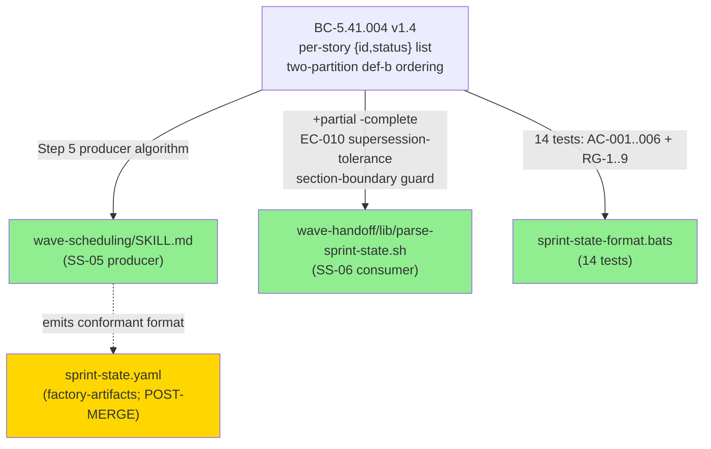
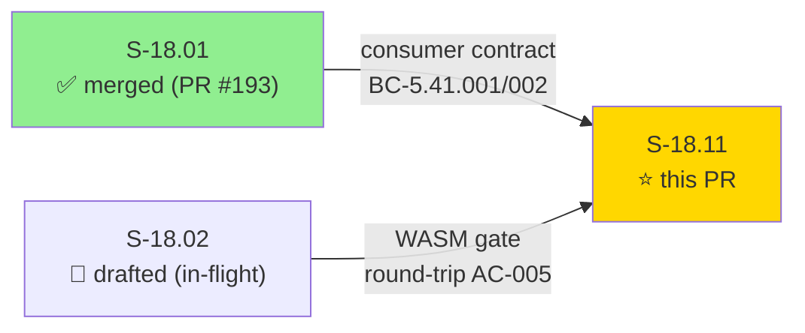
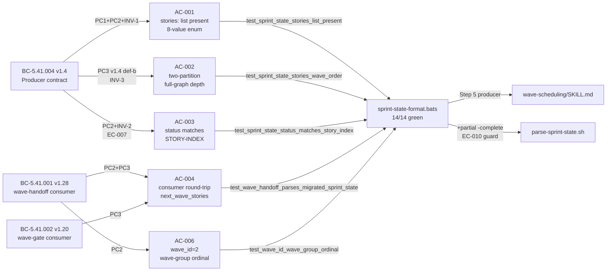
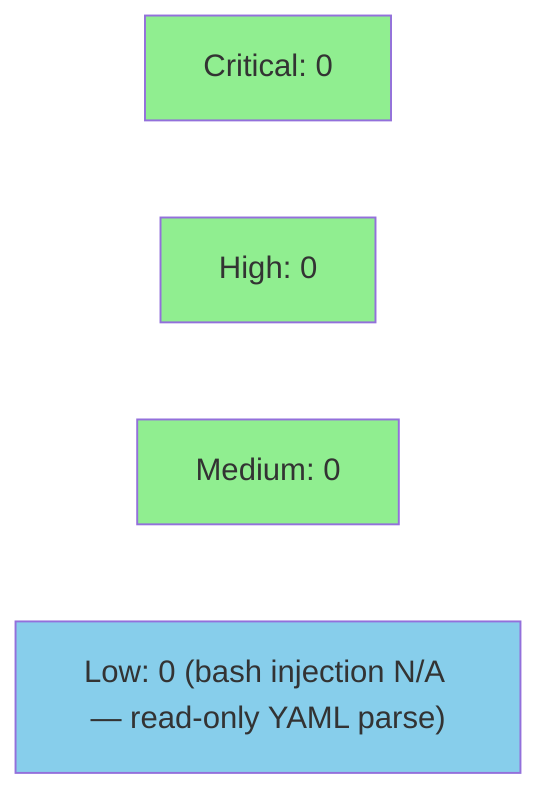

# [S-18.11] sprint-state.yaml producer migration to per-story {id, status} format

**Epic:** E-18 — Factory Context Durability (feature #173)
**Wave:** 9 (SS-05 + SS-06; depends on S-18.01 merged, S-18.02 drafted)
**Mode:** feature
**Convergence:** CONVERGED after 14 LOCAL adversarial passes (3-CLEAN at passes 12/13/14) + 5 architect reconciliations


Closes O-P9-001 (S-18.01 cascade pass-9 observation): the production `sprint-state.yaml` previously emitted only a legacy count-summary + per-epic schema, while consumers BC-5.41.001 (wave-handoff) and BC-5.41.002 (wave-gate WASM) both require a flat per-story `{id, status}` list. This PR delivers the producer-side fix: a new Step 5 in `wave-scheduling/SKILL.md` that mandates the conformant format per BC-5.41.004, plus consumer-side allowlist corrections in `parse-sprint-state.sh` (`+partial`, `-complete`, section-boundary guard). The EC-010 supersession-tolerance guard is a **producer-side** check codified in `wave-scheduling/SKILL.md` Step 5 (LLM-executed); the corresponding bats regression lock (`test_supersession_edge_tolerated_partition_placement`) verifies the tolerated edge produced correct partition placement in the migrated output file. A 14-test bats suite covers the full BC-5.41.004 contract. **IMPORTANT NOTE on merged consumer code change:** `parse-sprint-state.sh` is a modification of S-18.01 consumer code that merged in PR #193. This change is in-scope per human-approved ordering-safety decision: the `+partial` allowlist fix and EC-010 guard are required for correct interoperation with the new producer format; wave-handoff.bats 63/63 confirms no consumer regression. The migrated `.factory/stories/sprint-state.yaml` file (factory-artifacts orphan branch) is NOT in this PR — it lands in the post-merge state-manager burst, after this allowlist fix is on develop.

---

## Architecture Changes



<details>
<summary><strong>Architecture Decision Record — ADR-026 §Decision 3a v1.37</strong></summary>

**Context:** The sprint-state.yaml producer (wave-scheduling skill) previously had no explicit contract for the `stories:` output format. Consumers in wave-handoff (BC-5.41.001) and wave-gate WASM (BC-5.41.002) both assumed a per-story flat list but the producer had never formalized this obligation. O-P9-001 from the S-18.01 cascade identified the gap.

**Decision (ADR-026 §Decision 3a):** Two-partition ordering rule with definition (b) full-graph wave-depth. Partition A: all terminal stories (merged/withdrawn/cancelled) form a contiguous leading block. Partition B: all non-terminal stories follow in a contiguous trailing block. Intra-partition sort key: (full-graph wave-depth ASC, story-ID lexicographic ASC). Full-graph wave-depth = 1 for root stories; otherwise 1 + max(depth(P) for all P in depends_on), computed over the FULL depends_on graph including cross-partition supersession edges. EC-010 governs cross-partition supersession edges: tolerate (emit normally) when the dep-story carries `superseded_by:` frontmatter; hard-abort (TopoViolation) when no `superseded_by:` is present.

**Rationale:** Definition (b) eliminates partition-restricted topo-sort ambiguity (definition a, v1.3) by grounding the ordering in a global graph property (full-graph depth) that is deterministic regardless of partition placement, while still satisfying P-SPRINT-STATE-WAVE-ORDER (all terminal stories form a contiguous leading prefix).

**Alternatives Considered:**
1. Simple wave-ascending order (no partition split) — rejected: does not guarantee contiguous terminal prefix required by P-SPRINT-STATE-WAVE-ORDER in BC-5.41.001 PC2.
2. Definition (a) partition-restricted topo-sort — rejected: ambiguous when cross-partition supersession edges exist; architect escalation (5 reconciliations) required before def-b was adopted.

**Consequences:**
- Positive: `derive_wave_id` wave-group-ordinal algorithm operates correctly on the conformant producer output (verified: live `derive_wave_id`=2).
- Trade-off: `.factory/stories/sprint-state.yaml` migration lands on factory-artifacts orphan branch in the post-merge burst, not in this PR, due to ordering-safety constraint (the `+partial` consumer fix must be on develop first).

</details>

---

## Story Dependencies



**Dependency status:** S-18.01 is merged (PR #193, 8b26a0fe). S-18.02 is drafted (in-flight); AC-005 is satisfied via S-18.01 consumer exit-0 round-trip (parse-sprint-state.sh + migrate fixture).

---

## Spec Traceability



---

## Test Evidence

### Coverage Summary

| Metric | Value | Threshold | Status |
|--------|-------|-----------|--------|
| sprint-state-format.bats (new) | 14/14 pass | 100% | PASS |
| wave-handoff.bats (regression) | 63/63 pass | 100% | PASS |
| Local adversarial cascade | 3-CLEAN (passes 12/13/14) | 3-CLEAN | CONVERGED |
| Live derive_wave_id output | wave_id=2 | positive int | PASS |
| Holdout evaluation | N/A — evaluated at wave gate | — | — |
| Mutation kill rate | N/A — bats suite, not Kani | — | — |

### Test Breakdown

| Test | Classification | AC(s) / RG(s) | Status |
|------|----------------|----------------|--------|
| `test_sprint_state_stories_list_present` | Red Gate (CI-portable) | AC-001 | PASS |
| `test_sprint_state_stories_wave_order` | Red Gate (CI-portable) | AC-002 | PASS |
| `test_sprint_state_status_matches_story_index` | Red Gate (CI-portable) | AC-003 | PASS |
| `test_wave_handoff_parses_migrated_sprint_state` | Red Gate (CI-portable) | AC-004 | PASS |
| `test_wave_id_wave_group_ordinal` | Red Gate (CI-portable) | AC-006 | PASS |
| `test_epics_coexistence_nested_stories_ignored` | RG-1 (CI-portable) | RG-1 | PASS |
| `test_real_production_file_round_trip` | RG-2 (.factory-guarded SKIP in CI) | RG-2 | SKIP in CI |
| `test_consumer_accepts_partial_status` | RG-3 (CI-portable) | RG-3 | PASS |
| `test_consumer_rejects_interleaved_ordering` | RG-4 (CI-portable) | RG-4 | PASS |
| `test_consumer_partial_only_raises_broken_sprint_state` | RG-5 (CI-portable) | RG-5 | PASS |
| `test_consumer_rejects_complete_status` | RG-6 (CI-portable) | RG-6 | PASS |
| `test_real_production_file_completeness_and_status_fidelity` | RG-7 (.factory-guarded SKIP in CI) | RG-7 | SKIP in CI |
| `test_supersession_edge_tolerated_partition_placement` | RG-8 (.factory-guarded SKIP in CI) | RG-8 | SKIP in CI |
| `test_partitions_sorted_by_full_graph_depth_def_b` | RG-9 (.factory-guarded SKIP in CI) | RG-9 | SKIP in CI |

**CI-portable tests:** 5 Red Gate + 5 fixture-based RGs = 10 tests run in CI. 4 production-file-guarded tests (RG-2/7/8/9) skip in CI where `.factory/` is not mounted — these are verified via demo recordings and local cascade.

<details>
<summary><strong>New Files (This PR)</strong></summary>

| File | Action | Purpose |
|------|--------|---------|
| `plugins/vsdd-factory/tests/sprint-state-format.bats` | NEW | 14-test suite covering BC-5.41.004 PC1-6 + INV-1/2/3 + EC-007/010 |
| `plugins/vsdd-factory/tests/fixtures/sprint-state-format/fixture-migrated.yaml` | NEW | Conformant sprint-state.yaml fixture (stories: + epics: coexist) |
| `plugins/vsdd-factory/tests/fixtures/sprint-state-format/fixture-legacy.yaml` | NEW | Legacy format (no stories: key) — Red Gate failure fixture |
| `plugins/vsdd-factory/tests/fixtures/sprint-state-format/fixture-leading-run.yaml` | NEW | 10-merged-one-block + 2-draft — wave_id=2 fixture |
| `plugins/vsdd-factory/tests/fixtures/sprint-state-format/fixture-partial-accepted.yaml` | NEW | partial status in 8-value enum acceptance fixture |
| `plugins/vsdd-factory/tests/fixtures/sprint-state-format/fixture-partial-only.yaml` | NEW | partial-only → BrokenSprintState fixture |
| `plugins/vsdd-factory/tests/fixtures/sprint-state-format/fixture-interleaved-order.yaml` | NEW | terminal-after-non-terminal → WaveOrderUnverifiable fixture |
| `plugins/vsdd-factory/tests/fixtures/sprint-state-format/fixture-complete-status.yaml` | NEW | complete status (not in 8-value enum) rejection fixture |
| `plugins/vsdd-factory/tests/fixtures/sprint-state-format/fixture-STORY-INDEX.md` | NEW | Minimal STORY-INDEX fixture for AC-003 status-fidelity test |
| `docs/demo-evidence/S-18.11/evidence-report.md` | NEW | Per-AC demo evidence report |
| `docs/demo-evidence/S-18.11/*.gif/.webm/.tape` | NEW | 6 VHS recordings (18 files) covering all ACs + RGs |

| File | Action | Purpose |
|------|--------|---------|
| `plugins/vsdd-factory/skills/wave-scheduling/SKILL.md` | MODIFIED | Step 5 added: producer algorithm (two-partition def-b full-graph-depth ordering; BC-5.41.004 PC1-PC3) |
| `plugins/vsdd-factory/skills/wave-handoff/lib/parse-sprint-state.sh` | MODIFIED | Consumer allowlist: +partial, -complete; section-boundary guard; EC-010 supersession-tolerance guard |

**NOT in this PR (intentional):**
- `.factory/stories/sprint-state.yaml` migration — lives on factory-artifacts orphan branch; committed in the post-merge state-manager burst (ordering-safety: `+partial` allowlist fix must be on develop first per D-665 sequencing).

</details>

---

## Holdout Evaluation

N/A — evaluated at wave gate per factory pipeline convention. No holdout scenarios for bash-skill / bats-test-only story.

---

## Adversarial Review

| Pass | Scope | Findings | Blocking | Status |
|------|-------|----------|----------|--------|
| F-P1 | Red Gate + initial impl | 7 | 4 | Fixed (F-P1-001..007) |
| F-P2 | Wave-base 0→1 fix | 2 | 1 | Fixed (F-P2-001) |
| F-P3 | Wave-group-ordinal semantics | 3 | 2 | Fixed (F-P3-001/002) |
| F-P4 | Producer BC registration | 1 | 1 | Fixed |
| F-P5 | BC-5.41.004 v1.1 cite drift | 1 | 1 | Fixed |
| F-P6 | Header cite refresh | 1 | 1 | Fixed (F-P6-001) |
| F-P7 | BC authority cite v1.2→v1.3 | 2 | 2 | Fixed (F-P7-001/004) |
| F-P8 | SKILL.md def-b wording | 3 | 2 | Fixed (F-P8-001/002/003) |
| F-P9 | TD-VSDD-091 volatile version tokens | 2 | 1 | Fixed (F-P9-001/002) |
| F-P10 | Version cite recurrence check | 0 | 0 | CLEAN |
| F-P11 | AC-002 RG test name collision | 1 | 1 | Fixed (F-P11-001) |
| F-P12 | (post-fix verification) | 0 | 0 | CLEAN |
| F-P13 | (3-CLEAN pass 2) | 0 | 0 | CLEAN |
| F-P14 | (3-CLEAN pass 3) | 0 | 0 | CLEAN |

**Convergence:** LOCAL adversarial cascade CONVERGED at 3-CLEAN (passes 12/13/14) per BC-5.39.001 protocol. 5 architect reconciliations for: wave_id wave-group-ordinal semantics, EC-010 supersession-tolerance, two-partition structure, definition-(b) full-graph wave-depth (human directive), and AC-002 Red Gate test name restoration.

<details>
<summary><strong>Key Finding Resolutions</strong></summary>

### F-P1-001: interleaved ordering test missing
- **Resolution:** Added `test_consumer_rejects_interleaved_ordering` (RG-4); `derive_wave_id` exits non-zero with `WaveOrderUnverifiable` on terminal-after-non-terminal ordering.

### F-P1-002/F-P3-001: `partial` rejected by consumer allowlist
- **Resolution:** `parse-sprint-state.sh` allowlist updated: `+partial`, `-complete`; section-boundary guard added (prevents nested `epics[*].stories:` sub-keys from leaking into the `stories:` scan).

### F-P2-001: wave-base 0→1
- **Resolution:** `derive_wave_id` wave-base corrected from 0 to 1; aligns with ADR-026 §Wave-Identity Derivation (wave_id starts at 1, not 0).

### F-P7-001/004: BC authority cite drift (v1.2→v1.3)
- **Resolution:** SKILL.md Step 5 authority cite updated from BC-5.41.004 v1.2 to v1.3 (two-partition PC3 was the relevant new clause).

### F-P8-001: SKILL.md Step 5 TOLERATE branch wording (def-b)
- **Resolution:** "edge excluded from depth" corrected to "edge included in depth" — the cross-partition supersession edge IS included in the full-graph depth computation per ADR-026 §Decision 3a v1.37.

### F-P9-001 (TD-VSDD-091): volatile version tokens in bats comments
- **Resolution:** All BC-5.41.004 version tokens in bats comments de-pinned or replaced with function-name + behavioral-anchor references per TD-VSDD-091.

### F-P11-001: AC-002 Red Gate test name collision
- **Resolution:** `test_sprint_state_stories_wave_order` restored as the CI-portable Red Gate for AC-002 (the v1.7 def-b rename had inadvertently overwritten it with `test_partitions_sorted_by_full_graph_depth_def_b`, which is RG-9, a .factory-guarded SKIP in CI).

</details>

---

## Security Review

Security review scope: bash skill scripts (parse-sprint-state.sh, wave-scheduling SKILL.md behavioral spec), bats test fixtures (YAML files), VHS tape recordings. No Rust code changes in this PR.



<details>
<summary><strong>Security Scan Details</strong></summary>

**Scope:** `parse-sprint-state.sh` (consumer parser), `sprint-state-format.bats` (test suite), YAML fixtures.

**Injection surface:** `parse-sprint-state.sh` reads sprint-state.yaml via `grep` and `awk`. No `eval`, no dynamic variable expansion from file contents beyond `awk -F'|'` field splits on STORY-INDEX rows. Section-boundary guard (`/^stories:/` column-0 anchor) prevents nested-key injection into the stories scan. The fixture YAML files are static test inputs — no executable content.

**`set -euo pipefail`:** Confirmed present in `parse-sprint-state.sh` per S-18.01 Architecture Compliance Rule §3.

**POSIX character classes:** Verified — no `\s`, `\d`, `\w` shorthand classes in new code per Architecture Compliance Rule §4.

**No `local -A` bash 4 associative arrays:** Confirmed — `parse-sprint-state.sh` uses awk-based parsing, no associative arrays per Architecture Compliance Rule §5.

**Dependency audit:** No new dependencies introduced. Existing bats-core version in `plugins/vsdd-factory/tests/`. No Python, no jq, no new external tool dependencies.

**Finding:** No CRITICAL, HIGH, or MEDIUM findings. Story scope is read-only YAML parsing + behavioral spec text.

</details>

---

## Risk Assessment & Deployment

### Blast Radius
- **Systems affected:** wave-scheduling SKILL.md (SS-05 producer), parse-sprint-state.sh (SS-06 consumer), sprint-state-format.bats (new test suite)
- **User impact:** No runtime user impact — changes are to bash scripts used by AI skill agents during pipeline runs; not a user-facing binary
- **Data impact:** `.factory/stories/sprint-state.yaml` migration lands POST-MERGE on factory-artifacts branch (not this PR); no data risk from this PR
- **Risk Level:** LOW — bats consumer regression suite (63/63 wave-handoff.bats) confirms parse-sprint-state.sh changes do not regress any S-18.01 behavior

### Performance Impact
No performance-critical paths affected. Bash script read-only YAML parsing; no latency-sensitive operations.

### Cross-tree Note (sprint-state.yaml migration)
The production `.factory/stories/sprint-state.yaml` migration (adding the conformant `stories:` list) is committed on the factory-artifacts orphan branch in the post-merge state-manager burst. The ordering constraint (D-665 sequencing): this PR's `+partial` allowlist fix must land on develop before the migrated file (which emits `partial` status entries) is committed, to avoid a transient parse failure window.

<details>
<summary><strong>Rollback Instructions</strong></summary>

**Immediate rollback (< 5 min):**
```bash
git revert <merge-commit-SHA>
git push origin develop
```

**Verification after rollback:**
- `cd plugins/vsdd-factory/tests && ./run-all.sh` — wave-handoff.bats should still pass 63/63

</details>

---

## Traceability

| BC Clause | AC | Test (@test function) | Verification | Status |
|-----------|----|-----------------------|-------------|--------|
| BC-5.41.004 PC1 | AC-001 | `test_sprint_state_stories_list_present` | bats | PASS |
| BC-5.41.004 PC3 v1.4 + INV-3 | AC-002 | `test_sprint_state_stories_wave_order` | bats | PASS |
| BC-5.41.004 PC2 + INV-2 + EC-007 | AC-003 | `test_sprint_state_status_matches_story_index` | bats | PASS |
| BC-5.41.002 PC3 + BC-5.41.001 PC2/PC3 | AC-004 | `test_wave_handoff_parses_migrated_sprint_state` | bats | PASS |
| BC-5.41.001 PC2 + ADR-026 §Wave-Identity | AC-006 | `test_wave_id_wave_group_ordinal` | bats | PASS |
| BC-5.41.004 PC1-PC3 | AC-007 | Full suite pass (SKILL.md Step 5 load-bearing) | bats | PASS |
| BC-5.41.004 EC-010 | EC-010 | `test_supersession_edge_tolerated_partition_placement` | bats (local) | PASS |
| BC-5.41.001 PC2 P-SPRINT-STATE-WAVE-ORDER | RG-4 | `test_consumer_rejects_interleaved_ordering` | bats | PASS |

<details>
<summary><strong>Full BC → AC → Test → Implementation Chain</strong></summary>

```
BC-5.41.004 PC1 → AC-001 → test_sprint_state_stories_list_present → wave-scheduling/SKILL.md Step 5
BC-5.41.004 PC3 v1.4 → AC-002 → test_sprint_state_stories_wave_order → wave-scheduling/SKILL.md Step 5 (two-partition def-b)
BC-5.41.004 PC2 INV-2 → AC-003 → test_sprint_state_status_matches_story_index → wave-scheduling/SKILL.md Step 5
BC-5.41.002 PC3 → AC-004 → test_wave_handoff_parses_migrated_sprint_state → parse-sprint-state.sh (+partial, section-boundary guard)
BC-5.41.001 PC2 → AC-006 → test_wave_id_wave_group_ordinal → parse-sprint-state.sh (derive_wave_id wave-group-ordinal; wave-base=1)
BC-5.41.004 EC-010 → EC-010 → test_supersession_edge_tolerated_partition_placement → parse-sprint-state.sh (supersession-tolerance guard)
ADR-026 §Decision 3a v1.37 → AC-002 + RG-9 → test_partitions_sorted_by_full_graph_depth_def_b → wave-scheduling/SKILL.md Step 5
```

</details>

---

## Demo Evidence

Demo recordings live in `docs/demo-evidence/S-18.11/` on the feature branch.

| Tape | ACs / RGs | Description |
|------|-----------|-------------|
| `AC-FULL-suite-14-green` | ALL | Full 14-test bats suite; exit:0 |
| `AC-001-AC-003-RG7-stories-list-and-status-fidelity` | AC-001, AC-003, RG-7 | stories: list present; 149-entry completeness; status fidelity vs STORY-INDEX |
| `AC-002-RG9-def-b-two-partition-depth-order` | AC-002, RG-9 | Two-partition def-b ordering; full-graph depth; no phantom wave: field |
| `AC-004-AC-006-consumer-roundtrip-wave-id` | AC-004, AC-006 | Consumer round-trip; wave_id=2 (wave-group-ordinal, not story-count) |
| `EC-010-RG8-supersession-tolerance` | EC-010, RG-8 | EC-010 TOLERATE path; S-3.04 partial+superseded_by:ADR-015 in non-terminal partition |
| `RG-3-RG6-allowlist-partial-accepted-complete-rejected` | RG-3, RG-6 | partial accepted (8-value enum); complete rejected (not in enum) |

---

## AI Pipeline Metadata

<details>
<summary><strong>Pipeline Details</strong></summary>

```yaml
ai-generated: true
pipeline-mode: feature (E-18 wave 9; F3 phase)
factory-version: "1.0.0-rc.16"
pipeline-stages:
  spec-crystallization: completed (S-18.11 v1.10; BC-5.41.004 v1.4)
  story-decomposition: completed (STORY-INDEX v4.104; D-721)
  tdd-implementation: completed (14/14 green)
  holdout-evaluation: "N/A — evaluated at wave gate"
  adversarial-review: completed (14-pass LOCAL cascade; 3-CLEAN at P12/13/14)
  formal-verification: "N/A — bash/bats scope"
  convergence: achieved (BC-5.39.001 3-CLEAN protocol satisfied)
convergence-metrics:
  local-cascade-passes: 14
  clean-streak: 3
  architect-reconciliations: 5
adversarial-passes: 14
models-used:
  builder: claude-sonnet-4-6
  adversary: fresh-context (engine-discipline F5 per D-386 Option C)
governance-artifacts:
  bc-index-version: "v3.56 (D-721)"
  story-index-version: "v4.104 (D-721)"
  arch-index-version: "v2.85 (D-721)"
generated-at: "2026-06-29T00:00:00Z"
```

</details>

---

## Pre-Merge Checklist

- [ ] All CI status checks passing (fmt + clippy + cargo test + bats-full-suite)
- [x] Demo evidence complete: 6 tapes, 1 per-AC coverage report
- [x] LOCAL adversarial cascade CONVERGED: 3-CLEAN at passes 12/13/14
- [x] Consumer regression confirmed: wave-handoff.bats 63/63
- [x] No CRITICAL/HIGH security findings
- [x] parse-sprint-state.sh allowlist change rationale documented (in-scope per human-approved ordering-safety; S-18.01 consumer code; `+partial -complete`; EC-010 guard)
- [x] Cross-tree note documented: sprint-state.yaml migration on factory-artifacts post-merge burst
- [ ] PR review (pr-reviewer) approval received
- [ ] Human merge executed (D-665 STOP-BEFORE-PR-MERGE)
