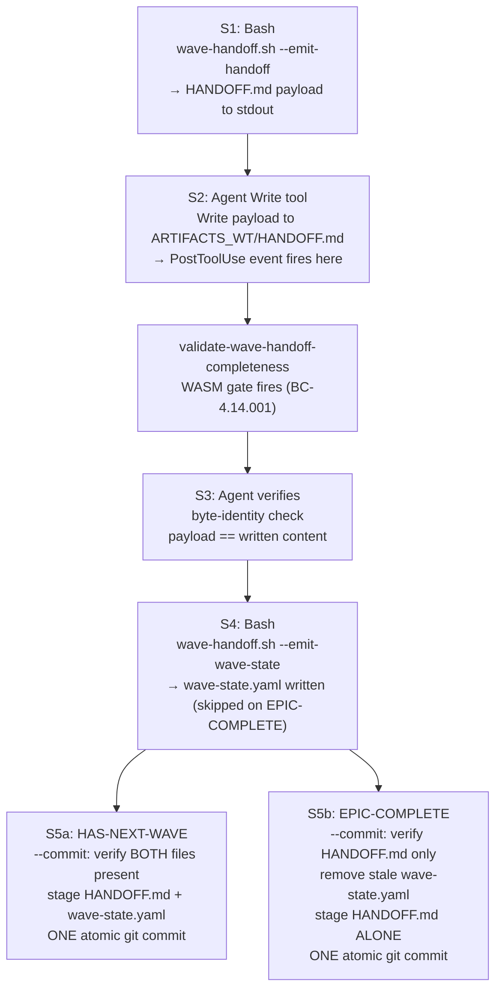
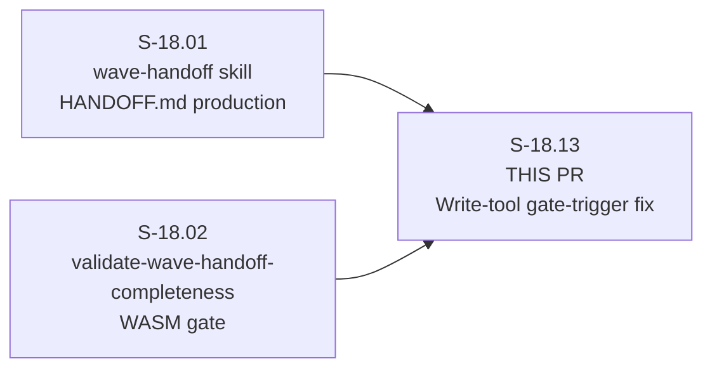
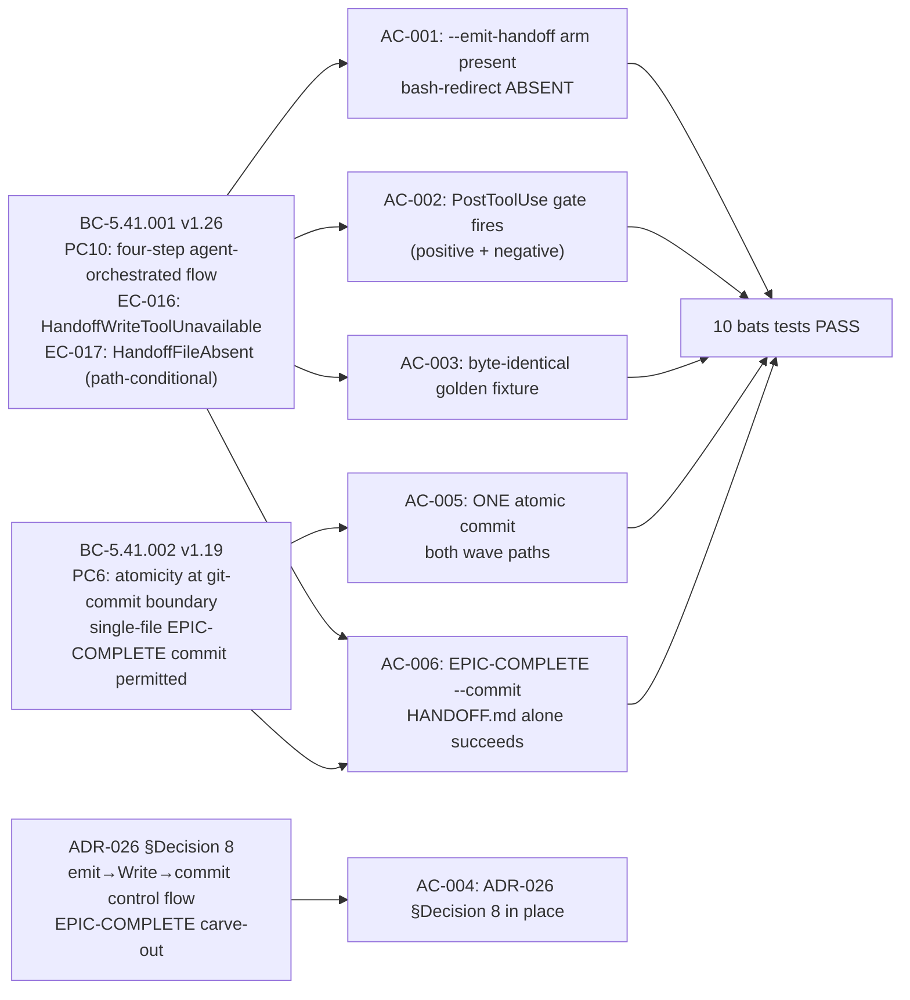

## Summary

**Story:** S-18.13 v1.8 — wave-handoff skill writes HANDOFF.md via the Write tool so the PostToolUse completeness gate fires (gate-trigger fix)
**Epic:** E-18 — Factory Context Durability (feature #173)
**Wave:** 4 (depends on S-18.01 + S-18.02 merged)
**Priority:** P0

This PR closes finding **F-S1802-02** (S-18.02 LOCAL pass-3 adversary): the `validate-wave-handoff-completeness` PostToolUse gate built by S-18.02 was functionally inert in production because `wave-handoff.sh` wrote `HANDOFF.md` via bash redirection (`} > "$output_path"`), which emits no PostToolUse event. The gate was dead code on every production wave-close path.

## Finding F-S1802-02 — Closure Rationale

**Root cause:** ADR-026 §Decision 8 constrained the WASM gate's hook registration (PostToolUse on `Write|Edit`) but did NOT constrain the HANDOFF.md _producer's_ write path. The monolithic `wave-handoff.sh` (ending in `main "$@"`) had no agent seam between Step 4 (`write_handoff`) and Step 6 (`commit_to_artifacts`) — there was no point at which the Claude Code Write tool could be called.

**Fix:** Agent-orchestrated subcommand restructure per ADR-026 §Decision 8. The monolithic script is split into three bash subcommands dispatched by the agent:

```
--emit-handoff   → emit HANDOFF.md payload to stdout (no disk write)
--emit-wave-state → write wave-state.yaml via bash (skipped on EPIC-COMPLETE)
--commit          → atomic git commit (two-arm conditional: HAS-NEXT-WAVE / EPIC-COMPLETE)
```

SKILL.md is rewritten from a descriptive "Behavior Overview" to genuine numbered agent steps (S1–S5) that drive the Write tool call — making the PostToolUse event fire on every production wave-close.

## Four-Step Agent-Orchestrated Flow (ADR-026 §Decision 8)



## Story Dependencies



## BC / AC Traceability



## Spec Traceability

| BC | Version | Clauses | ACs |
|----|---------|---------|-----|
| BC-5.41.001 | v1.26 | PC1, PC2, PC3, PC10 (four-step flow, EPIC-COMPLETE carve-out, EC-016, EC-017) | AC-001, AC-002, AC-003, AC-006 |
| BC-5.41.002 | v1.19 | PC6 (atomicity; single-file EPIC-COMPLETE commit permitted) | AC-005, AC-006 |
| ADR-026 §Decision 8 | (stable anchor) | agent-orchestrated emit→Write→commit; EPIC-COMPLETE carve-out | AC-004 |

| AC | Traces To | Status |
|----|-----------|--------|
| AC-001 | BC-5.41.001 PC10 — four-step flow; Write tool mandate; no bash-redirect fallback | PASS (10 bats tests) |
| AC-002 | BC-5.41.001 PC10 — PostToolUse gate fires on production wave-close | PASS (mock PostToolUse injection: positive + negative) |
| AC-003 | BC-5.41.001 PC10 — byte-identity write-path verification vs golden fixture | PASS |
| AC-004 | ADR-026 §Decision 8 — spec constraint in place | VERIFIED (pre-T-1 check) |
| AC-005 | BC-5.41.002 PC6 — ONE atomic commit; HAS-NEXT-WAVE and EPIC-COMPLETE arms | PASS |
| AC-006 | BC-5.41.001 PC10 EPIC-COMPLETE arm + BC-5.41.002 PC6 — HANDOFF.md alone | PASS |
| EC-016 | BC-5.41.001 EC-016 — HandoffWriteToolUnavailable hard error; no bash fallback | PASS |
| EC-017 | BC-5.41.001 EC-017 — HandoffFileAbsent on --commit; both paths | PASS |

## Test Evidence

- **Bats tests:** 10 tests across 7 AC/EC coverage points — all PASS
- **LOCAL adversarial cascade:** 3-CLEAN CONVERGED (passes 3, 4, 5 consecutive)
- **CI:** cargo fmt/clippy/test + bats full suite (ubuntu) + wave-handoff bats (macOS)
- **Test suite:** `plugins/vsdd-factory/tests/wave-handoff.bats`

| Test | Coverage | Result |
|------|----------|--------|
| `test_BC_5_41_001_PC10_S18_13_AC001_*` (2) | AC-001: --emit-handoff arm; no bash-redirect | PASS |
| `test_BC_5_41_001_PC10_S18_13_AC002_postuse_gate_fires_positive` | AC-002: gate fires; valid HANDOFF.md → exit 0 | PASS |
| `test_BC_5_41_001_PC10_S18_13_AC002_postuse_gate_fires_negative` | AC-002: gate fires; incomplete HANDOFF.md → exit 2, blocking_plugins= | PASS |
| `test_BC_5_41_001_PC10_S18_13_AC003_emit_handoff_stdout_matches_golden_*` (2) | AC-003: byte-identical vs golden fixture (HAS-NEXT-WAVE + EPIC-COMPLETE) | PASS |
| `test_BC_5_41_002_PC6_S18_13_AC005_commit_creates_one_atomic_commit_has_next_wave` | AC-005: ONE commit, both files, HAS-NEXT-WAVE | PASS |
| `test_BC_5_41_001_PC10_S18_13_AC006_epic_complete_commit_arm_succeeds_without_wave_state` | AC-006: EPIC-COMPLETE ONE commit, HANDOFF.md alone | PASS |
| `test_BC_5_41_001_EC016_S18_13_handoff_write_tool_unavailable_hard_error` | EC-016: HandoffWriteToolUnavailable hard error | PASS |
| `test_BC_5_41_001_EC017_S18_13_handoff_file_absent_blocks_commit_*` (2) | EC-017: HandoffFileAbsent, both paths | PASS |

## Demo Evidence

All 7 AC/EC coverage points recorded under `docs/demo-evidence/S-18.13/` (VHS terminal recordings).

| AC / EC | Evidence File | Result |
|---------|---------------|--------|
| AC-001 | [AC-001-emit-handoff-subcommand-dispatch.gif](docs/demo-evidence/S-18.13/AC-001-emit-handoff-subcommand-dispatch.gif) | PASS |
| AC-002 (KEY) | [AC-002-postuse-gate-firing-live-evidence.gif](docs/demo-evidence/S-18.13/AC-002-postuse-gate-firing-live-evidence.gif) | PASS |
| AC-003 | [AC-003-golden-byte-identity.gif](docs/demo-evidence/S-18.13/AC-003-golden-byte-identity.gif) | PASS |
| AC-005 | [AC-005-atomic-commit-has-next-wave.gif](docs/demo-evidence/S-18.13/AC-005-atomic-commit-has-next-wave.gif) | PASS |
| AC-006 | [AC-006-epic-complete-commit-handoff-alone.gif](docs/demo-evidence/S-18.13/AC-006-epic-complete-commit-handoff-alone.gif) | PASS |
| EC-016 | [EC-016-write-tool-unavailable-hard-error.gif](docs/demo-evidence/S-18.13/EC-016-write-tool-unavailable-hard-error.gif) | PASS |
| EC-017 | [EC-017-handoff-file-absent-blocks-commit.gif](docs/demo-evidence/S-18.13/EC-017-handoff-file-absent-blocks-commit.gif) | PASS |

**AC-002 is the primary proof of F-S1802-02 closure.** It exercises the mock PostToolUse injection path — directly invoking the `validate-wave-handoff-completeness` WASM gate with a synthesized PostToolUse payload for a HANDOFF.md Write call. Positive test: complete HANDOFF.md → gate passes (exit 0). Negative test: incomplete HANDOFF.md → gate blocks (exit 2, `blocking_plugins=validate-wave-handoff-completeness`).

## Holdout Evaluation

N/A — evaluated at wave gate.

## Adversarial Review

N/A — evaluated at Phase 5. LOCAL adversarial cascade: 3-CLEAN CONVERGED (passes 3/4/5).

## Security Review

To be populated after Step 4 (security-reviewer dispatch).

## Architecture Changes

**Files changed:**
- `plugins/vsdd-factory/skills/wave-handoff/wave-handoff.sh` — MODIFY: replace monolithic `main()` with `--emit-handoff` / `--emit-wave-state` / `--commit` subcommand dispatch
- `plugins/vsdd-factory/skills/wave-handoff/lib/write-handoff.sh` — MODIFY: `write_handoff()` emits to stdout (remove `} > "$output_path"` bash-redirect); update callers
- `plugins/vsdd-factory/skills/wave-handoff/SKILL.md` — MODIFY: rewrite to genuine S1–S5 numbered agent steps per ADR-026 §Decision 8
- `plugins/vsdd-factory/tests/fixtures/wave-handoff-golden/` — CREATE: frozen golden HANDOFF.md fixtures (regression oracle for AC-003)
- `plugins/vsdd-factory/tests/wave-handoff.bats` — MODIFY: add AC-002/AC-003/EC-016/EC-017/AC-005/AC-006 tests
- `docs/demo-evidence/S-18.13/` — CREATE: per-AC VHS terminal recordings + evidence-report.md

**Blast radius:** Scoped to `plugins/vsdd-factory/skills/wave-handoff/`. No changes to HANDOFF.md schema (S-18.01), WASM gate logic (S-18.02), or any other E-18 skill. The `hooks-registry.toml` gate entry (`tool = "Write|Edit"`) requires no change — verified per T-6.

**Performance impact:** None. The restructure is bash-only; no new binaries or WASM plugins.

## Risk Assessment

| Dimension | Assessment |
|-----------|------------|
| Blast radius | Low — wave-handoff skill only; no schema or gate changes |
| Regression risk | Low — existing bats suite green; golden fixture oracle confirms byte-identity |
| Dependency risk | Low — S-18.01 and S-18.02 are merged; all deps resolved |
| EC-COMPLETE path | Covered by AC-006 dedicated test |

## AI Pipeline Metadata

- **Pipeline mode:** brownfield feature (E-18 Wave 4)
- **Story spec version:** v1.8
- **LOCAL adversarial cascade:** 3-CLEAN (passes 3/4/5)
- **Commit history on branch:**
  - `cf1a1efe` feat(S-18.13): wave-handoff Write tool path gate trigger fix
  - `c46e59d2` fix(S-18.13): eliminate legacy monolithic bash-redirect HANDOFF.md write + sibling oracle test
  - `df1a8073` test(S-18.13): real AC-002 gate-firing tests replace unconditional skip
  - `90c03fdf` fix(S-18.13): remove dead main(), unused helper, add hard-error dispatch tests
  - `227f85e6` docs(S-18.13): per-AC demo evidence (7 recordings)

## Pre-Merge Checklist

- [x] Story spec v1.8 read, 3-CLEAN LOCAL adversarial cascade confirmed
- [x] ADR-026 §Decision 8 in place (AC-004 verified)
- [x] BC-5.41.001 v1.26 + BC-5.41.002 v1.19 clauses covered by tests
- [x] All 6 ACs and 2 ECs covered by bats tests (10 tests PASS)
- [x] Demo evidence: 7 AC/EC recordings under docs/demo-evidence/S-18.13/
- [x] Branch: feature/S-18.13, HEAD 227f85e6
- [ ] PR created (Step 3)
- [ ] Security review (Step 4)
- [ ] PR reviewer approval (Step 5)
- [ ] CI green (Step 6)
- [ ] Dependencies merged: S-18.01 (#193 merged), S-18.02 (#195 merged) (Step 7)
- [ ] Squash-merge to develop (Step 8)
