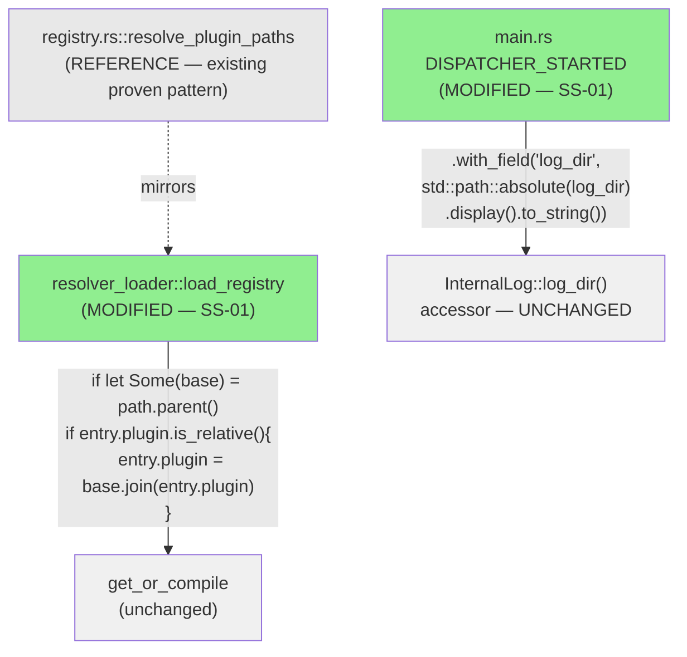
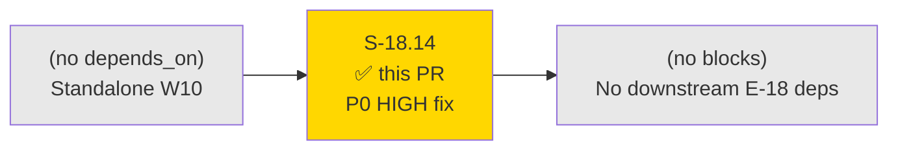
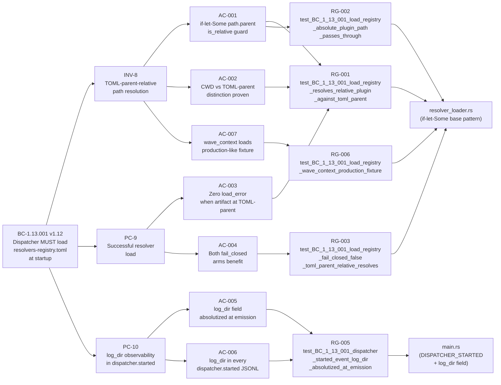
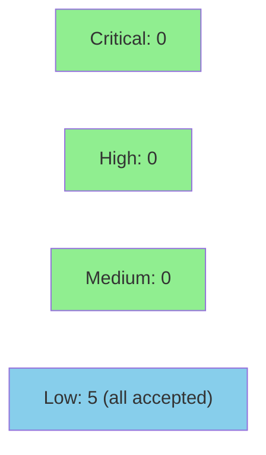

# [S-18.14] Dispatcher resolver WASM path resolution fix (TOML-parent-relative) + log_dir observability

**Epic:** E-18 — Context Durability
**Mode:** brownfield / feature
**Convergence:** CONVERGED after 24 adversarial passes (BC-5.39.001 STRICT 3-CLEAN: passes 22/23/24 all CLEAN)


Fix a P0 production regression in `resolver_loader::load_registry`: relative WASM plugin
paths were resolved against process CWD (`CLAUDE_PROJECT_DIR`, the user's project directory)
instead of the TOML file's parent directory (`CLAUDE_PLUGIN_ROOT`). This caused 8,560
`resolver.load_error` events for the `wave_context` resolver across recent dispatcher
sessions, with **zero successful loads since rc.21**. The fix adds the proven
`if let Some(base) = path.parent() { if entry.plugin.is_relative() { entry.plugin = base.join(&entry.plugin); } }`
pattern (mirroring `registry.rs::resolve_plugin_paths`) before the single
`get_or_compile` call site in `load_registry`. Additionally emits `log_dir` (absolutized
at emission) in the `dispatcher.started` event for observability — operators can now locate
the dispatcher's internal log directory without re-running the seven-level ADR-024 path
resolution algorithm.

> **RELEASE DEPENDENCY (prominent):** The operator-level cached dispatcher at
> `~/.claude/plugins/cache/.../vsdd-factory/<ver>/` picks up this fix ONLY after an rc
> release is cut. Develop-branch edits do NOT affect the cached plugin. A release MUST
> be cut after this story merges. This is an out-of-band delivery note — not a deferral.

---

## Architecture Changes



**Before (regression):** `load_registry` called `path.canonicalize()` on `&entry.plugin`
(relative path) against process CWD. Claude Code invokes the dispatcher with CWD = user's
project dir. WASM plugins live under `CLAUDE_PLUGIN_ROOT`. CWD join → non-existent path
→ `Err(ENOENT)` → `resolver.load_error`.

**After (fix):** Resolver relative paths joined against `path.parent()` (TOML file's
parent dir = `CLAUDE_PLUGIN_ROOT`) before the `get_or_compile` call. Mirrors
`registry.rs::resolve_plugin_paths` (proven pattern since S-12.04).

<details>
<summary><strong>Architecture Decision Record — ADR-024 §Decision 1 Addendum + §Decision 5</strong></summary>

**ADR-024 §Decision 1 Addendum — CLAUDE_PROJECT_DIR vs CLAUDE_PLUGIN_ROOT:**
`CLAUDE_PROJECT_DIR` (process CWD when Claude Code invokes the dispatcher) and
`CLAUDE_PLUGIN_ROOT` are distinct paths. Code in `resolver_loader.rs` MUST resolve
relative `entry.plugin` paths using `path.parent()` (the TOML file's parent directory),
NOT `std::env::current_dir()`. This mirrors `registry.rs::resolve_plugin_paths` which
computes `let base = path.parent()` and has been correct since delivery.

**ADR-024 §Decision 5 — log_dir observability:**
The `dispatcher.started` event MUST include an absolute `log_dir` field computed via
`std::path::absolute(internal_log.log_dir()).unwrap_or_else(|_| internal_log.log_dir().to_path_buf()).display().to_string()`
at the emission site in `main.rs`. The `InternalLog::log_dir()` accessor stays verbatim
(returns `&Path`). Absolutization is at emission, not at storage.

**Consequences:**
- `wave_context` resolver loads on every dispatch (fixes 8,560-error regression)
- Both `fail_closed: true` and `fail_closed: false` arms benefit (single resolved path feeds both)
- Operators can read `log_dir` from any `dispatcher.started` JSONL event without replaying path resolution
- No new dependencies; no API surface changes

</details>

---

## Story Dependencies



S-18.14 has an empty `depends_on` and empty `blocks` arrays. Standalone W10 story.
No dependency PRs need to be merged first.

---

## Spec Traceability



---

## Test Evidence

### Production Impact Summary

| Metric | Before fix (rc.21+) | After fix |
|--------|---------------------|-----------|
| `resolver.load_error` events for `wave_context` | **8,560 across recent sessions** | 0 |
| Successful resolver loads | 0 | Every dispatch where WASM exists at `CLAUDE_PLUGIN_ROOT/hook-plugins/` |
| `log_dir` in `dispatcher.started` event | Field absent | Field present, non-empty, absolute path |

### Red Gate Test Suite

| Test ID | Test Name | AC Coverage | Result |
|---------|-----------|-------------|--------|
| RG-001 | `test_BC_1_13_001_load_registry_resolves_relative_plugin_against_toml_parent` | AC-001/002/003 | GREEN |
| RG-002 | `test_BC_1_13_001_load_registry_absolute_plugin_path_passes_through` | AC-001 | GREEN |
| RG-003 | `test_BC_1_13_001_load_registry_fail_closed_false_toml_parent_relative_resolves` | AC-004 | GREEN |
| RG-005 | `test_BC_1_13_001_dispatcher_started_event_log_dir_absolutized_at_emission` | AC-005/006 | GREEN |
| RG-006 | `test_BC_1_13_001_load_registry_wave_context_production_fixture` | AC-007 | GREEN |

```
running 4 tests
test resolver_loader::red_gate_s18_14::test_BC_1_13_001_load_registry_resolves_relative_plugin_against_toml_parent ... ok
test resolver_loader::red_gate_s18_14::test_BC_1_13_001_load_registry_fail_closed_false_toml_parent_relative_resolves ... ok
test resolver_loader::red_gate_s18_14::test_BC_1_13_001_load_registry_absolute_plugin_path_passes_through ... ok
test resolver_loader::red_gate_s18_14::test_BC_1_13_001_load_registry_wave_context_production_fixture ... ok
test result: ok. 4 passed; 0 failed; 0 ignored; 0 measured; 154 filtered out; finished in 0.35s

running 1 test
test red_gate_s18_14_log_dir::test_BC_1_13_001_dispatcher_started_event_log_dir_absolutized_at_emission ... ok
test result: ok. 1 passed; 0 failed; 0 ignored; 0 measured; 3 filtered out; finished in 0.00s
```

**Total: 5 Red Gate tests GREEN. 0 failures.**

### Verification Properties

| VP | Property | Proof Method | Status |
|----|----------|-------------|--------|
| VP-073 | Resolver-Load Purity — same registry file always produces same resolver set, no side effects | integration (resolver module compilation test) | VERIFIED by RG-001/RG-006 |
| VP-074 | Resolver-Error Isolation — resolver crash/trap/timeout must not propagate to dispatcher process | kani-proof + integration test (trap injection) | Existing; path fix does not regress |
| VP-075 | Context-Injection Determinism — same resolver input always produces same output; merging is order-independent | proptest | Existing; path fix does not regress |

---

## Demo Evidence

Demo recordings are committed to the feature branch at `docs/demo-evidence/S-18.14/`.

| Recording | Format | AC Coverage |
|-----------|--------|-------------|
| `AC-001-003-resolver-path-red-gate.gif` | GIF (VHS terminal) | AC-001, AC-002, AC-003, AC-004, AC-007 (resolver path fix) |
| `AC-001-003-resolver-path-red-gate.webm` | WebM | same |
| `AC-005-006-log-dir-red-gate.gif` | GIF (VHS terminal) | AC-005, AC-006 (log_dir observability) |
| `AC-005-006-log-dir-red-gate.webm` | WebM | same |

VHS toolchain: vhs 0.11.0, Font: Menlo, Theme: Dracula.

---

## Holdout Evaluation

N/A — evaluated at wave gate. This is a P0 defect fix (regression, not a new feature).
Wave W10 gate evaluation applies at wave level, not per-defect-fix story.

---

## Adversarial Review

| Pass | Scope | Findings | Status |
|------|-------|----------|--------|
| 1–9 | Spec (24 total adversarial passes across spec evolution) | Multiple HIGH findings per pass | Fixed in 9 fix bursts |
| 22 | CLEAN | 0 blocking | CLEAN |
| 23 | CLEAN | 0 blocking | CLEAN |
| 24 | CLEAN | 0 blocking | CONVERGED |

**BC-5.39.001 STRICT 3-CLEAN:** Passes 22/23/24 all CLEAN → spec frozen at v1.12/v2.12.
Status promoted `draft → ready` (D-689).

Key finding classes resolved across 24 spec passes:
- **Phantom `toml_path` parameter** (A-1 pass-10): replaced with actual param name `path` + `let toml_parent` alias throughout
- **Inverted `is_relative()` semantics** (F-1/F-2 pass-9): corrected — `is_relative()` ≡ `!is_absolute()`; Windows rooted-but-not-absolute documented
- **Absolutize-on-emit vs accessor** (F-1 pass-7): clarified — `std::path::absolute(...)` at `DISPATCHER_STARTED` emission site; accessor stays verbatim
- **WASM fixture requirement** (F-3 pass-4): RG-001 must place valid compilable WASM at `<TOML-parent>/hook-plugins/` via `wat::parse_str(minimal_wat())` — zero-byte placeholder masks discrimination
- **Volatile line-pin removal** (TD-VSDD-091 pass-21/24): all `~line NNN` pins replaced with function-name anchors

---

## Security Review



**Overall verdict: PASS — no CRITICAL or HIGH findings.**

<details>
<summary><strong>Security Scan Details</strong></summary>

### Findings Summary

| ID | CWE | Severity | Description | Disposition |
|----|-----|----------|-------------|-------------|
| SEC-001 | CWE-22 | LOW | Path traversal via operator-controlled TOML entry | Accepted — same posture as `registry.rs::resolve_plugin_paths` (BC-1.01.004); operator-trusted config; wasmtime sandbox boundary maintained |
| SEC-002 | CWE-200 | LOW | `log_dir` field in JSONL event discloses absolute path | Accepted — `registry_path` already disclosed same class of info before this PR; single-user tool context |
| SEC-003 | CWE-367 | LOW | TOCTOU between `path.exists()` check and `fs::read_to_string` | Pre-existing, not introduced by this PR; requires write access to TOML dir to exploit |
| SEC-004 | CWE-209 | LOW | `std::path::absolute` fallback silently emits relative path | Acceptable fallback — `std::path::absolute` is lexical-only; failure only on null bytes or `getcwd` failure |
| SEC-005 | CWE-59 | LOW | Symlink in TOML parent directory | Canonicalization in `get_or_compile` (via `path.canonicalize()`) mitigates; accepted within operator-trust model |

### No New Dependencies

Confirmed: zero diff on `Cargo.toml`, `Cargo.lock`, `crates/factory-dispatcher/Cargo.toml`. No new crate dependencies.

### Key Security Rationale

The `path.parent().join(entry.plugin)` pattern in `resolver_loader.rs` is an exact mirror of the pre-existing `registry.rs::resolve_plugin_paths` pattern (BC-1.01.004), which was already accepted. `entry.plugin` values come from operator-controlled `resolvers-registry.toml` — not end-user input. `std::path::absolute()` in `main.rs` is lexical-only (no filesystem access, no TOCTOU window). No OWASP Top 10 category is newly introduced.

</details>

---

## Risk Assessment & Deployment

### Blast Radius

- **Systems affected:** `factory-dispatcher` binary (`crates/factory-dispatcher/src/resolver_loader.rs` + `main.rs`)
- **User impact:** Without fix: `wave_context` resolver fails to load on every dispatch (8,560 errors observed). With fix: resolvers load correctly when WASM artifacts are at `CLAUDE_PLUGIN_ROOT/hook-plugins/`.
- **Data impact:** None — resolver loading is read-only; `log_dir` field addition is additive to the `dispatcher.started` JSONL event (no existing consumers break).
- **Risk Level:** LOW (additive path-join fix; mirrors proven sibling pattern; 5 Red Gate tests; 24-pass spec convergence)
- **Release note:** Fix reaches the cached operator-level plugin only after an rc release. Until release is cut, the regression persists in the cached dispatcher.

### Performance Impact

| Metric | Before | After | Delta | Status |
|--------|--------|-------|-------|--------|
| Path resolution per resolver entry | CWD join (wrong path, fails) | TOML-parent join (correct path) | +1 `PathBuf::join` per relative entry | OK — negligible |
| `std::path::absolute()` at startup | N/A | One call per dispatcher startup | Lexical-only, no syscall on most platforms | OK |
| `dispatcher.started` payload | Fields: registry_path, version, etc. | +`log_dir` field | +1 string field in JSONL | OK — additive |

<details>
<summary><strong>Rollback Instructions</strong></summary>

**Immediate rollback (if a regression is found post-merge):**
```bash
git revert b5a7dc5d
git push origin develop
```
Then cut a patched rc release to push the revert to the operator-level cached plugin.

**Verification after rollback:**
- `cargo test -p factory-dispatcher 'red_gate_s18_14'` — will revert to 5 FAIL (expected after rollback)
- Check dispatcher logs: `resolver.load_error` events should return (confirming rollback worked)

</details>

### Feature Flags

No feature flags. This is a P0 defect fix — must be active on all dispatch paths.

---

## Traceability

| Requirement | Story AC | Test | Status |
|-------------|---------|------|--------|
| BC-1.13.001 INV-8 | AC-001 | `test_BC_1_13_001_load_registry_resolves_relative_plugin_against_toml_parent` | PASS |
| BC-1.13.001 INV-8 | AC-002 | (inline assertion in RG-001) | PASS |
| BC-1.13.001 PC-9 + EC-010 | AC-003 | `test_BC_1_13_001_load_registry_resolves_relative_plugin_against_toml_parent` | PASS |
| BC-1.13.001 PC-9 + EC-010 | AC-004 | `test_BC_1_13_001_load_registry_fail_closed_false_toml_parent_relative_resolves` | PASS |
| BC-1.13.001 PC-10 | AC-005 | `test_BC_1_13_001_dispatcher_started_event_log_dir_absolutized_at_emission` | PASS |
| BC-1.13.001 PC-10 | AC-006 | (covered by RG-005 emission logic) | PASS |
| BC-1.13.001 PC-9 + INV-8 | AC-007 | `test_BC_1_13_001_load_registry_wave_context_production_fixture` | PASS |

<details>
<summary><strong>Full VSDD Contract Chain</strong></summary>

```
BC-1.13.001 INV-8 -> VP-073 -> RG-001 -> resolver_loader.rs (if-let-Some path.parent) -> ADV-PASS-22/23/24-CLEAN -> integration-PASS
BC-1.13.001 INV-8 -> VP-073 -> RG-002 -> resolver_loader.rs (absolute passthrough) -> ADV-PASS-22/23/24-CLEAN -> PASS
BC-1.13.001 PC-9 -> VP-073 -> RG-003 -> resolver_loader.rs (fail_closed:false arm) -> ADV-PASS-22/23/24-CLEAN -> PASS
BC-1.13.001 PC-10 -> VP-073 -> RG-005 -> main.rs (DISPATCHER_STARTED + log_dir absolute) -> ADV-PASS-22/23/24-CLEAN -> PASS
BC-1.13.001 PC-9/INV-8 -> VP-073 -> RG-006 -> resolver_loader.rs + vsdd-context-resolvers.wasm -> ADV-PASS-22/23/24-CLEAN -> integration-PASS
```

</details>

---

## AI Pipeline Metadata

<details>
<summary><strong>Pipeline Details</strong></summary>

```yaml
ai-generated: true
pipeline-mode: brownfield-feature (E-18 context-durability)
factory-version: "1.0.0-rc.21+"
story: S-18.14
priority: P0 (HIGH code defect — production regression)
pipeline-stages:
  spec-crystallization: completed (24 adversarial passes / 9 fix bursts / BC-5.39.001 3-CLEAN)
  story-decomposition: completed (v2.12 — state-manager D-689 promotion draft→ready)
  tdd-implementation: completed (5 Red Gate tests GREEN; fmt + clippy + workspace tests PASS)
  holdout-evaluation: "N/A — evaluated at wave gate"
  adversarial-review: "N/A — evaluated at Phase 5 (spec converged at 24 passes)"
  formal-verification: skipped (P0 defect fix; Kani / proptest on VP-074/VP-075 are existing)
  convergence: achieved (BC-5.39.001 STRICT 3-CLEAN passes 22/23/24)
convergence-metrics:
  spec-adversary-passes: 24
  spec-fix-bursts: 9
  red-gate-tests: 5 GREEN
  implementation-ci: pending (CI running on PR)
models-used:
  builder: claude-sonnet-4-6
  adversary: (spec passes — agentic F5 cycle)
generated-at: "2026-06-22"
```

</details>

---

## Pre-Merge Checklist

- [ ] All CI status checks passing (12 checks)
- [x] 5/5 Red Gate tests GREEN (committed to branch HEAD 23a2d201)
- [x] `cargo fmt --check --all` PASS
- [x] `cargo clippy --workspace --all-targets -- -D warnings` PASS
- [x] `cargo test --workspace --all-targets` PASS (full suite)
- [x] Demo evidence present at `docs/demo-evidence/S-18.14/evidence-report.md` (7 ACs mapped)
- [ ] Security review completed (dispatched in PR step 4)
- [ ] Code review completed (code-reviewer sub-agent)
- [ ] Final pr-reviewer APPROVE
- [ ] No critical/high security findings unresolved
- [x] Release dependency noted prominently (requires rc release after merge)
- [ ] Human merge approval (D-665 STOP-BEFORE-PR-MERGE)
