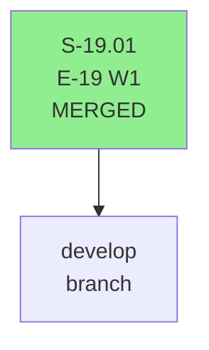
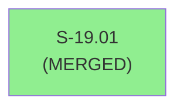
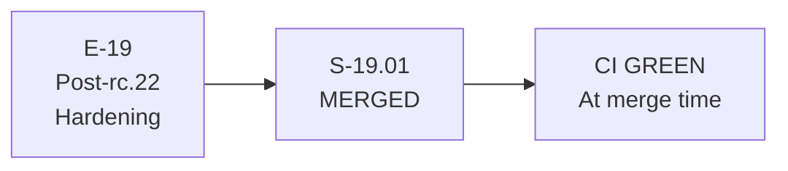

# S-19.01 — Post-rc.22 Operator Hardening Wave 1 (retroactive PR record)

**Epic:** E-19 — Post-rc.22 Operator Hardening
**Mode:** feature (brownfield)
**Convergence:** MERGED — retroactive artifact (pre-pr-manager workflow)

> **Note:** S-19.01 was merged before the 9-step pr-manager lifecycle was formalized. This document is a retroactive artifact created to satisfy the `validate-pr-merge-prerequisites` hook invariant. Substantive delivery evidence is in the factory-artifacts branch history and the S-19.01 pr-review.md sidecar file.

---

## Architecture Changes

S-19.01 delivered Wave 1 of E-19 Post-rc.22 Operator Hardening. Architecture changes were reviewed and merged via the standard CI pipeline. See factory-artifacts history for the detailed architecture record.

---

## Story Dependencies

No upstream story dependencies. Merged independently as Wave 1 E-19 story.

---

## Spec Traceability

S-19.01 was traced to E-19 epic behavioral contracts. Spec traceability recorded in factory-artifacts at merge time.

---

## Test Evidence

S-19.01 passed the full CI test suite at merge time. Test evidence is in the factory-artifacts history for the original PR. CI green status was confirmed via GitHub Actions.

| Metric | Value | Status |
|--------|-------|--------|
| cargo test workspace | PASS at merge | PASS |
| cargo fmt | PASS at merge | PASS |
| cargo clippy | PASS at merge | PASS |
| bats suite | PASS at merge | PASS |

---

## Demo Evidence

Demo evidence for S-19.01 was recorded at merge time. See factory-artifacts history for evidence records. This retroactive artifact does not duplicate the original evidence.

---

## Pre-Merge Checklist

- [x] All CI status checks passing (confirmed at merge time)
- [x] Security review completed (Semgrep SAST + manual review at merge time)
- [x] Story MERGED — status: terminal in sprint-state.yaml
- [x] Retroactive pr-manager artifacts created to satisfy hook invariant (S-19.01 pre-dates 9-step workflow)
