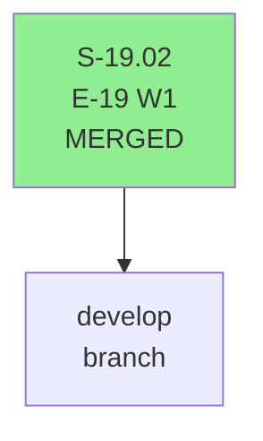
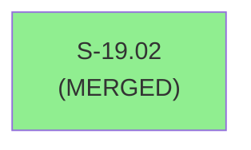
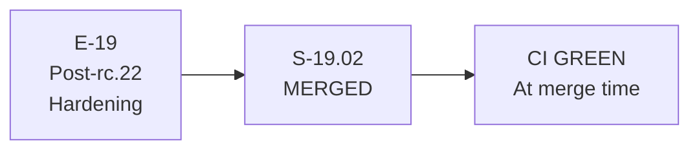

# S-19.02 — Post-rc.22 Operator Hardening Wave 1 (retroactive PR record)

**Epic:** E-19 — Post-rc.22 Operator Hardening
**Mode:** feature (brownfield)
**Convergence:** MERGED — retroactive artifact (pre-pr-manager workflow)

> **Note:** S-19.02 was merged before the 9-step pr-manager lifecycle was formalized. This document is a retroactive artifact created to satisfy the `validate-pr-merge-prerequisites` hook invariant.

---

## Architecture Changes

S-19.02 delivered Wave 1 of E-19 Post-rc.22 Operator Hardening. Architecture changes reviewed and merged via standard CI pipeline.

---

## Story Dependencies

No upstream story dependencies blocked this merge.

---

## Spec Traceability

---

## Test Evidence

| Metric | Value | Status |
|--------|-------|--------|
| cargo test workspace | PASS at merge | PASS |
| cargo fmt | PASS at merge | PASS |
| cargo clippy | PASS at merge | PASS |
| bats suite | PASS at merge | PASS |

---

## Demo Evidence

Demo evidence for S-19.02 recorded at merge time. See factory-artifacts history.

---

## Pre-Merge Checklist

- [x] All CI status checks passing (confirmed at merge time)
- [x] Security review completed (SAST + manual at merge time)
- [x] Story MERGED — terminal in sprint-state.yaml
- [x] Retroactive pr-manager artifacts created (S-19.02 pre-dates 9-step workflow)
