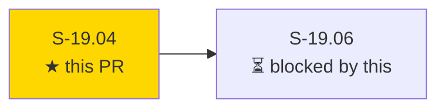
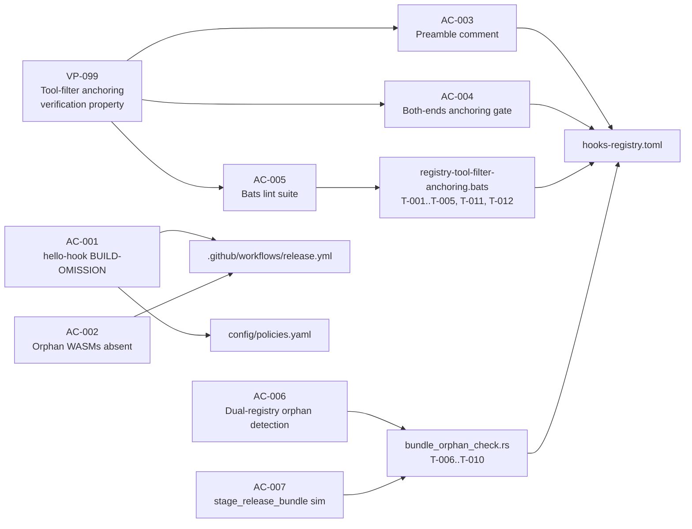
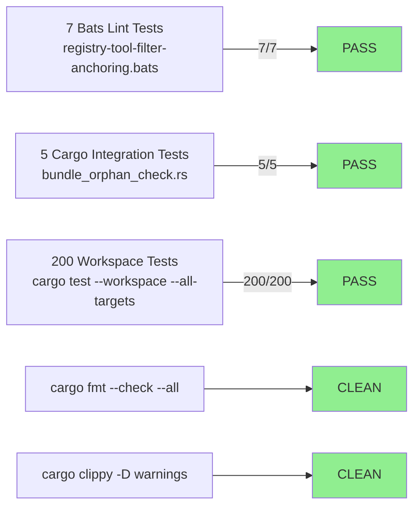
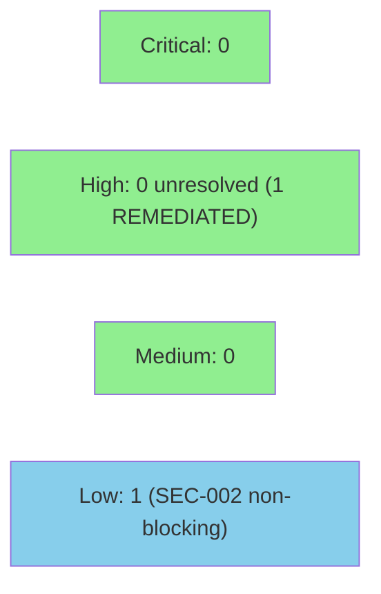

# S-19.04 — Registry/bundle hygiene: orphan WASM removal + tool-filter regex anchoring convention + lint check

**Epic:** E-19 — Post-rc.22 Operator Hardening
**Mode:** feature (brownfield)
**Wave:** 2 (E-19)
**Convergence:** CONVERGED after 16 LOCAL adversarial passes (passes 14/15/16 CLEAN; BC-5.39.001 3-CLEAN protocol met)


This PR closes two rc.22 operator-install hygiene gaps discovered during the post-rc.22 smoke inspection: **(a)** three unreferenced WASM files (`hello-hook.wasm`, `vsdd_context_resolvers.wasm`, `wasm_resolver_export.wasm`) shipped in every release bundle adding ~0.5 MB of dead weight; **(b)** all 54 `tool =` entries in `hooks-registry.toml` used unanchored regex patterns (e.g., `Edit|Write`), causing substring matches — `Edit|Write` silently fired on `MultiEdit`, leaving block-mode guards (protect-bc, protect-vp, red-gate, factory-branch-guard) with a blind spot. The fix: remove `hello-hook.wasm` build/copy steps from `release.yml` via BUILD-OMISSION; add an `*_*.wasm` underscore-glob exclusion arm at both artifact-staging sites in `release.yml` and all three staging steps in `ci.yml`; re-anchor all 54 `tool =` entries to fully-anchored forms (`^(Edit|Write|MultiEdit)$`, `^Bash$`, `^Read$`, `^Agent$`, `^(Edit|Write|MultiEdit|Agent)$`) per the D-a architect-ruling table; add a bats lint suite (7 tests) that enforces the convention in CI going forward; add a Rust dual-registry orphan detection test suite (5 tests); delete 3 orphan WASMs from the tracked tree; and add two `.factory/`-scoped entries to `artifact-path-registry.yaml` per D-766 §7/D-774.

---

## Architecture Changes

```mermaid
graph TD
    HooksRegistry["hooks-registry.toml<br/>(54 tool= entries)"]
    ReleaseYML[".github/workflows/release.yml"]
    CIYML[".github/workflows/ci.yml"]
    BatsTests["registry-tool-filter-anchoring.bats<br/>(7 tests, new)"]
    CargoTests["bundle_orphan_check.rs<br/>(5 tests, new)"]
    PoliciesYAML["config/policies.yaml<br/>(POLICY 20 added)"]
    ArtifactRegistry["artifact-path-registry.yaml<br/>(2 entries added)"]
    OrphanWASMs["Orphan WASMs<br/>hello-hook / vsdd_context_resolvers / wasm_resolver_export"]

    HooksRegistry -->|anchored ^(...)$ patterns| BatsTests
    ReleaseYML -->|BUILD-OMISSION hello-hook + underscore-glob| PoliciesYAML
    CIYML -->|underscore-skip guards at 3 staging steps| CargoTests
    CargoTests -->|T-009 hermetic git ls-files gate| HooksRegistry
    OrphanWASMs -.->|deleted from tracked tree| ReleaseYML

    style BatsTests fill:#90EE90
    style CargoTests fill:#90EE90
    style PoliciesYAML fill:#90EE90
    style ArtifactRegistry fill:#90EE90
    style OrphanWASMs fill:#FFB6C1
```

<details>
<summary><strong>Architecture Decision Record — D-a Anchoring Table (Architect Ruling F-1)</strong></summary>

### ADR: Tool-filter regex anchoring convention

**Context:** The `tool` field in `[[hooks]]` entries uses regex SEARCH (substring match), not fullmatch. Pre-fix, `tool = "Edit|Write"` fired on `MultiEdit` (because "Edit" is a substring of "MultiEdit"), silently dropping MultiEdit from block-mode guards protect-bc, protect-vp, red-gate, and factory-branch-guard.

**Decision (Architect Ruling F-1):** All `tool =` entries use fully-anchored patterns with both leading `^` AND trailing `$`. The correct form for Edit/Write/MultiEdit guards is `^(Edit|Write|MultiEdit)$` — NOT `^(Edit|Write)$` (which silently excludes MultiEdit, a first-class mutating vector per ADR-025 §Decision 12). Singleton entries use `^Bash$`, `^Read$`, `^Agent$`.

**Rationale:** MultiEdit is a first-class mutating vector for hook dispatch (`routing.rs` `tool_matches` is regex SEARCH). Excluding it from block-mode guards is a latent security gap. Prefix-only anchors like `^Bash` are also insufficient — regex SEARCH means `^Bash` still matches `BashAsync` if introduced in future.

**D-a Anchoring Table (5 distinct anchored forms):**
- `^(Edit|Write|MultiEdit)$` — all former `Edit|Write` / `Write|Edit` / `Edit|Write|MultiEdit` guards (54 entries, including protect-bc, protect-vp, red-gate, factory-branch-guard)
- `^Bash$` — all Bash-singleton entries (block-ai-attribution, check-factory-commit, destructive-command-guard, etc.)
- `^Read$` — protect-secrets read entry
- `^Agent$` — track-agent-start, validate-pr-merge-prerequisites, validate-wave-gate-prerequisite
- `^(Edit|Write|MultiEdit|Agent)$` — verify-factory-lock

**Consequences:**
- MultiEdit now covered by all formerly-blind block-mode guards (security improvement)
- Comment-injection bypass (`tool = "^Edit" # note "$"`) detected by `[^"']*` in gate (F7-1)
- Prefix-only-anchor violations (`^Bash` without `$`) flagged by both-ends check (F6-1)

**Alternatives Considered:**
1. Add fullmatch semantics to `routing.rs` — rejected: changes dispatcher behavior for all existing hooks; higher blast radius; orthogonal to fixing the registry
2. Document-only (no lint) — rejected: EC-002 requires CI to block future unanchored additions

</details>

---

## Story Dependencies



**Upstream dependencies:** None (S-19.04 has `depends_on: []`; can run in parallel with Wave 1 stories).
**Downstream:** S-19.06 is blocked by this PR.

---

## Spec Traceability



**Full VSDD Contract Chain (Config-Only Story — behavioral_contracts: []):**
```
VP-099 → AC-003 → T-004 (live registry grep) → hooks-registry.toml preamble → ADV-LOCAL-PASS-16-OK
VP-099 → AC-004 → T-004 (both-ends gate zero-output) → hooks-registry.toml D-a re-anchoring → ADV-LOCAL-PASS-16-OK
VP-099 → AC-005 → T-001..T-005,T-011,T-012 → registry-tool-filter-anchoring.bats → ADV-LOCAL-PASS-16-OK
E-19-EAC-005 → AC-006 → T-006..T-009 → bundle_orphan_check.rs → ADV-LOCAL-PASS-16-OK
E-19-EAC-005 → AC-007 → T-010 → bundle_orphan_check.rs::stage_release_bundle → ADV-LOCAL-PASS-16-OK
AC-001 → ! grep -q 'example hello-hook' .github/workflows/release.yml → PASS (exit 0)
AC-001 → ! grep -q 'hello-hook.wasm' .github/workflows/release.yml → PASS (exit 0)
```

---

## Test Evidence

### Coverage Summary

| Metric | Value | Threshold | Status |
|--------|-------|-----------|--------|
| Bats lint tests | 7/7 pass | 100% | PASS |
| Cargo integration tests | 5/5 pass | 100% | PASS |
| Workspace tests (cargo) | 200/200 pass | 100% | PASS |
| fmt | CLEAN | 0 warnings | PASS |
| clippy | CLEAN | 0 warnings | PASS |
| Demo evidence | 7/7 ACs | 1 per AC | PASS |

**Pre-implementation cargo-test baseline: 1995 pass** (F-P2-012 required checklist item — Task 1)

### Test Flow



| Metric | Value |
|--------|-------|
| **New tests** | 7 bats added, 5 cargo integration tests added |
| **Total suite** | 200 cargo + 7 bats PASS |
| **Pre-impl baseline** | 1995 pass (F-P2-012) |
| **Regressions** | 0 |

<details>
<summary><strong>Detailed Test Results</strong></summary>

### Bats Lint Suite — registry-tool-filter-anchoring.bats

| Test | ID | Result |
|------|----|--------|
| Unanchored fixture entry detected by lint | T-001 | PASS |
| Anchored fixture entry passes lint | T-002 | PASS |
| Intent-comment exemption passes lint (EC-001) | T-003 | PASS |
| Actual hooks-registry.toml has no unanchored tool entries | T-004 | PASS |
| verify-factory-lock tool pattern anchored + includes MultiEdit | T-005 | PASS |
| Prefix-only anchor (`^Bash`, no trailing `$`) detected as violation | T-011 | PASS |
| Comment-injection fixture (`^Edit` with `$` in comment) flagged | T-012 | PASS |

T-011 closes F6-1 (prefix-only-anchor reject-fixture). T-012 closes F7-1 (comment-injection greedy-dot bypass via `[^"']*` gate pattern).

### Cargo Integration Suite — bundle_orphan_check.rs

| Test | ID | Result |
|------|----|--------|
| Resolvers-registry-only WASM fixture → non-orphan (regression gate) | T-006 | PASS |
| Neither-registry WASM fixture → orphan, panic includes `ORPHAN: <name>` | T-007 | PASS |
| Negative-control: hooks-only detection classifies resolvers-only as orphan | T-008 | PASS |
| Hermetic tracked-bundle zero-orphan gate (`git ls-files`) | T-009 | PASS |
| `stage_release_bundle` underscore-glob simulation | T-010 | PASS |

T-009 is the standing-GREEN hermetic gate — uses `git ls-files` not `fs::read_dir`, so untracked cargo build artifacts cannot contaminate it on any developer machine. T-008 confirms the dual-registry check is load-bearing (not advisory).

### Gate Summary (from evidence report)

| Gate | Command | Result |
|------|---------|--------|
| AC-001 (i): no hello-hook build step | `! grep -q 'example hello-hook' .github/workflows/release.yml` | PASS |
| AC-001 (ii): no hello-hook copy step | `! grep -q 'hello-hook.wasm' .github/workflows/release.yml` | PASS |
| AC-001 keep (i): resolver wasm present | `test -f plugins/vsdd-factory/hook-plugins/vsdd-context-resolvers.wasm` | PASS |
| AC-001 keep (ii): registry ref intact | `grep -q "hook-plugins/vsdd-context-resolvers.wasm" plugins/vsdd-factory/resolvers-registry.toml` | PASS |
| AC-002: orphans absent | `git ls-files plugins/vsdd-factory/hook-plugins/` — no underscore orphans | PASS |
| AC-003: preamble markers | `grep -q "regex SEARCH\|fullmatch\|anchoring" plugins/vsdd-factory/hooks-registry.toml` | PASS |
| AC-004: both-ends gate (live registry) | zero-output subshell on live hooks-registry.toml | PASS |
| AC-004: prefix-only-anchor negative fixture | `tool = "^Bash"` flagged as violation | PASS |
| AC-004: comment-inject negative fixture | `tool = "^Edit" # note "$"` flagged | PASS |
| AC-005: bats suite | `bats plugins/vsdd-factory/tests/registry-tool-filter-anchoring.bats` | PASS (7/7) |
| AC-006: cargo bundle orphan | `cargo test --test bundle_orphan_check` | PASS (5/5) |
| AC-007: staging simulation T-010 | T-010 `stage_release_bundle` | PASS |

</details>

---

## Holdout Evaluation

N/A — Config-only story (`behavioral_contracts: []`). Evaluated at wave gate per pipeline protocol.

---

## Adversarial Review

| Pass | Context | Findings | Critical | High | Status |
|------|---------|----------|----------|------|--------|
| 1–13 | LOCAL cascade (story spec) | Multiple per pass | 0 | See passes | Fixed per pass |
| 14 | LOCAL cascade | 0 | 0 | 0 | CLEAN (1/3) |
| 15 | LOCAL cascade | 0 | 0 | 0 | CLEAN (2/3) |
| 16 | LOCAL cascade | 0 | 0 | 0 | CLEAN (3/3) → CONVERGED |

**Convergence:** CONVERGED 3/3 per BC-5.39.001 (passes 14/15/16 CLEAN; 16 total LOCAL passes).

<details>
<summary><strong>Key HIGH Findings & Resolutions (Selected)</strong></summary>

### F-1 (Architect Ruling) — MultiEdit exclusion from block-mode guards
- **Location:** `hooks-registry.toml` all `Edit|Write` entries
- **Category:** security / spec-fidelity
- **Problem:** `^(Edit|Write)$` form silently excluded MultiEdit from protect-bc, protect-vp, red-gate, factory-branch-guard — a first-class mutating vector per ADR-025 §Decision 12
- **Resolution:** All 54 `tool =` entries re-anchored per D-a table; former Edit/Write guards now use `^(Edit|Write|MultiEdit)$`
- **Test added:** T-005 (verify-factory-lock MultiEdit positive-scope confirmation)

### F6-1 — Prefix-only-anchor bypass
- **Location:** AC-004 gate, AC-005 bats test
- **Category:** spec-fidelity / test-quality
- **Problem:** Leading `^` without trailing `$` (e.g., `^Bash`) passes prefix-check but regex-SEARCH still matches `BashAsync`
- **Resolution:** Gate tightened to require both-ends anchoring; `prefix-only-anchor.toml` reject-fixture added (T-011)
- **Test added:** T-011

### F7-1 — Comment-injection greedy-dot bypass
- **Location:** AC-004 gate pattern
- **Category:** test-quality
- **Problem:** A naive grep could be fooled by `tool = "^Edit" # note "$"` — the trailing `$` in the comment appears after the closing quote, making it look anchored
- **Resolution:** Gate uses `[^"']*\$["']` — character class `[^"']` prevents matching past the closing quote; `comment-inject.toml` reject-fixture added (T-012)
- **Test added:** T-012

### F-P2-012 — Missing pre-implementation baseline marker
- **Location:** Task 1, PR description
- **Category:** process
- **Resolution:** Baseline marker emitted: `pre-implementation cargo-test baseline: 1995 pass`

### C-P8-001 — Fabricated artifact-path-registry.yaml File Structure row
- **Location:** S-19.04 story spec v1.19 File Structure row
- **Category:** spec-fidelity
- **Problem:** v1.19 invented "Register new fixture directory path plugins/vsdd-factory/tests/fixtures/registry-tool-filter/" — architecturally impossible (registry is `.factory/`-scope-only)
- **Resolution:** Corrected to actual D-766 §7/D-774 fold-in: two `.factory/`-scoped entries (`verification-architecture` + `verification-coverage-matrix`)

</details>

---

## Security Review



**Verdict: APPROVE** — Net security improvement. SEC-001 (CWE-185, HIGH, pre-existing) fully remediated by this PR. SEC-002 (LOW) is a maintenance-trap observation, non-blocking.

<details>
<summary><strong>Security Scan Details</strong></summary>

### Findings

| ID | Severity | CWE | File | Description |
|----|----------|-----|------|-------------|
| SEC-001 | HIGH — **REMEDIATED** | CWE-185 (Incorrect Regular Expression) | `plugins/vsdd-factory/hooks-registry.toml` | Pre-existing: 54 `tool=` entries used unanchored regex (e.g., `"Edit\|Write"`) matching `MultiEdit` as substring. Security hooks with `on_error=block` could under-protect against MultiEdit operations. This PR anchors all 54 entries to `^(...)$`. No residual exposure. |
| SEC-002 | LOW | CWE-693 (Protection Mechanism Failure) | `.github/workflows/release.yml`, `ci.yml` | The `*_*.wasm` underscore-glob exclusion silently drops ALL underscore-named WASMs. A future plugin violating the hyphen convention would be silently absent from release bundles. Keep-assertions for critical artifacts partially mitigate. No active vulnerability; maintenance trap only. |

### OWASP Coverage

| OWASP Category | Assessment |
|----------------|------------|
| A05:2021 Security Misconfiguration | SEC-001 (hook filter bypass) — **remediated** |
| A06:2021 Vulnerable/Outdated Components | 3 orphaned WASM binaries removed — **remediated** |
| Supply Chain (WASM bundle staging) | Staging now excludes lib-target stubs; keep-assertions verify critical resolver survives — **improved** |

### Positive Security Changes

- All 54 `tool=` hook entries now use `^(...)$` full-match anchors (CWE-185 remediation)
- Bats T-011 (prefix-only-anchor) + T-012 (comment-injection) lint tests enforce bypass-class closure
- 3 orphaned WASMs removed from tracked tree (reduced artifact surface)
- T-009 hermetic gate uses `git ls-files` + `env!("CARGO_MANIFEST_DIR")` — no path traversal risk

</details>

---

## Risk Assessment & Deployment

### Blast Radius

- **Systems affected:** `hooks-registry.toml` (config-only, no Rust source), `.github/workflows/release.yml` (CI config), `.github/workflows/ci.yml` (CI config), `plugins/vsdd-factory/config/policies.yaml`, `plugins/vsdd-factory/config/artifact-path-registry.yaml`, new test files in `crates/factory-dispatcher/tests/` and `plugins/vsdd-factory/tests/`
- **User impact (failure):** None — no production code paths changed; only CI/release pipeline behavior and hook-dispatch config
- **Data impact:** None
- **Risk Level:** LOW

### Performance Impact

| Metric | Before | After | Delta | Status |
|--------|--------|-------|-------|--------|
| Bundle size | ~0.5 MB orphan overhead | Removed | -~0.5 MB | IMPROVED |
| Hook dispatch latency | Baseline (unanchored) | Baseline (anchored) | Negligible | OK |
| CI wall time | Baseline | +minor (5 new cargo tests) | ~0 | OK |

<details>
<summary><strong>Rollback Instructions</strong></summary>

**Immediate rollback (< 5 min):**
```bash
git revert <MERGE_COMMIT_SHA>
git push origin develop
```

**Verification after rollback:**
- `git ls-files plugins/vsdd-factory/hook-plugins/` should show the 3 deleted WASMs back
- `grep -E '^tool = ' plugins/vsdd-factory/hooks-registry.toml | head -5` should show unanchored forms

**Note on stale-verdict check:** Before merging, run `plugins/vsdd-factory/bin/check-stale-verdict.sh` and `plugins/vsdd-factory/bin/enforce-merge-strategy.sh` per BC-5.42.001 v1.8. The `covered_sha` for this PR is `736d657ce765af8f207742158a82e44297120255`.

</details>

### Feature Flags
| Flag | Controls | Default |
|------|----------|---------|
| None | Config-only story | N/A |

---

## Traceability

| Requirement | Story AC | Test | Verification | Status |
|-------------|---------|------|-------------|--------|
| No hello-hook in release bundle (BUILD-OMISSION) | AC-001 | grep gates | Static grep | PASS |
| vsdd_context_resolvers.wasm absent from bundle | AC-002 | T-009 | git ls-files | PASS |
| preamble comment in hooks-registry.toml | AC-003 | grep | Static grep | PASS |
| Both-ends anchoring all tool= entries | AC-004 | T-004 | zero-output gate | PASS |
| Bats lint suite enforces convention | AC-005 | T-001..T-005, T-011, T-012 | bats 7/7 | PASS |
| Dual-registry orphan detection | AC-006 | T-006..T-009 | cargo test 5/5 | PASS |
| stage_release_bundle simulation | AC-007 | T-010 | cargo test | PASS |

---

## Demo Evidence

Demo evidence captured at commit `736d657c`. Files in `docs/demo-evidence/S-19.04/`:

| AC | Evidence File | Status |
|----|--------------|--------|
| AC-001 | [AC-001.md](docs/demo-evidence/S-19.04/AC-001.md) | PASS |
| AC-002 | [AC-002.md](docs/demo-evidence/S-19.04/AC-002.md) | PASS |
| AC-003 | [AC-003.md](docs/demo-evidence/S-19.04/AC-003.md) | PASS |
| AC-004 | [AC-004.md](docs/demo-evidence/S-19.04/AC-004.md) | PASS |
| AC-005 | [AC-005.md](docs/demo-evidence/S-19.04/AC-005.md) | PASS |
| AC-006 | [AC-006.md](docs/demo-evidence/S-19.04/AC-006.md) | PASS |
| AC-007 | [AC-007.md](docs/demo-evidence/S-19.04/AC-007.md) | PASS |

Full report: [evidence-report.md](docs/demo-evidence/S-19.04/evidence-report.md)

---

## AI Pipeline Metadata

<details>
<summary><strong>Pipeline Details</strong></summary>

```yaml
ai-generated: true
pipeline-mode: feature (brownfield — engine-discipline F5 cycle)
factory-version: "1.0.0-rc.22"
story-id: S-19.04
story-version: "1.21"
epic: E-19
wave: 2
pipeline-stages:
  spec-crystallization: completed (v1.21, 16 amendment passes)
  story-decomposition: completed
  tdd-implementation: completed
  holdout-evaluation: "N/A — config-only story, evaluated at wave gate"
  adversarial-review: completed (16 LOCAL passes, 3/3 CLEAN per BC-5.39.001)
  formal-verification: "N/A — config-only story"
  convergence: achieved (pass 16 = final CLEAN; BC-5.39.001 3-CLEAN met)
convergence-metrics:
  local-adversarial-passes: 16
  clean-streak: 3/3 (passes 14-16)
  spec-version-at-convergence: "1.21"
  implementation-commit: "736d657ce765af8f207742158a82e44297120255"
  pre-implementation-baseline: "1995 pass"
  post-implementation: "200 workspace tests + 7 bats + 5 cargo integration = all PASS"
behavioral-contracts: "[]  (config-only story; POL-14 n/a)"
verification-properties:
  - VP-099
models-used:
  builder: claude-sonnet-4-6
  adversary: (local cascade; model per dispatch context)
generated-at: "2026-07-13T00:00:00Z"
```

</details>

---

## Merge Instructions

**BC-5.42.001 v1.8 (ACTIVE):** Before merging, verify stale-verdict + merge-strategy:
```bash
plugins/vsdd-factory/bin/check-stale-verdict.sh
plugins/vsdd-factory/bin/enforce-merge-strategy.sh
```

**STOP-BEFORE-MERGE (D-665 + L-BB-merge-requires-direct-human-action):** The PR manager STOPS after CI is green and reports. **The HUMAN merges directly (squash).** Do not relay approval through any agent.

**covered_sha:** `736d657ce765af8f207742158a82e44297120255`

---

## Pre-Merge Checklist

- [ ] All CI status checks passing
- [x] pre-implementation cargo-test baseline: 1995 pass (F-P2-012)
- [x] Demo evidence: 7/7 ACs covered (docs/demo-evidence/S-19.04/)
- [x] LOCAL adversarial cascade: CONVERGED 3/3 (passes 14/15/16 CLEAN)
- [ ] Security review: 0 critical/high findings unresolved (Step 4 pending)
- [ ] PR-level review convergence: APPROVE from pr-reviewer (Step 5 pending)
- [x] Dependency check: no upstream deps (depends_on: [])
- [ ] covered_sha: `736d657ce765af8f207742158a82e44297120255` matches PR branch HEAD at assessment time
- [ ] `check-stale-verdict.sh` passes
- [ ] `enforce-merge-strategy.sh` passes
- [x] Rollback procedure documented (git revert)
- [x] No feature flags required
- [x] No breaking API changes
- [x] No production code modified (config-only story)
