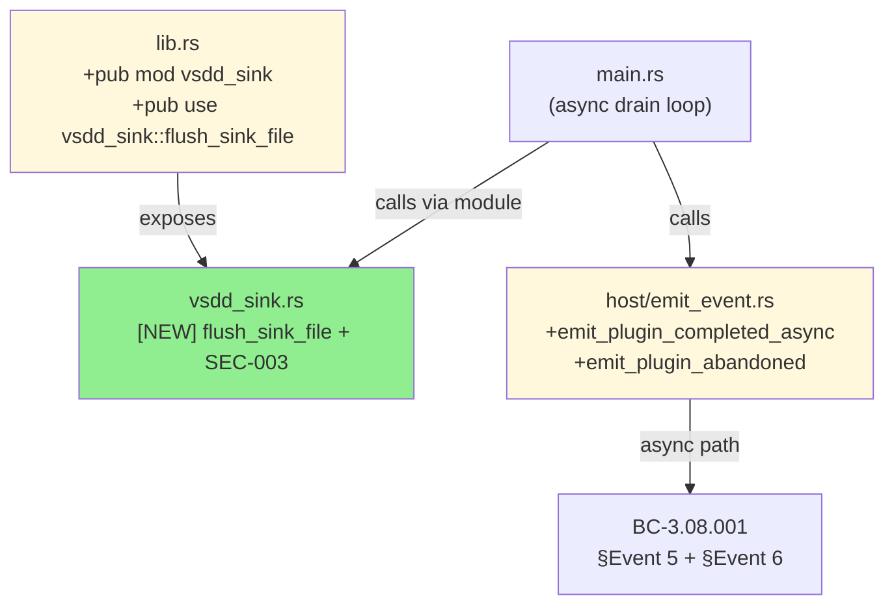
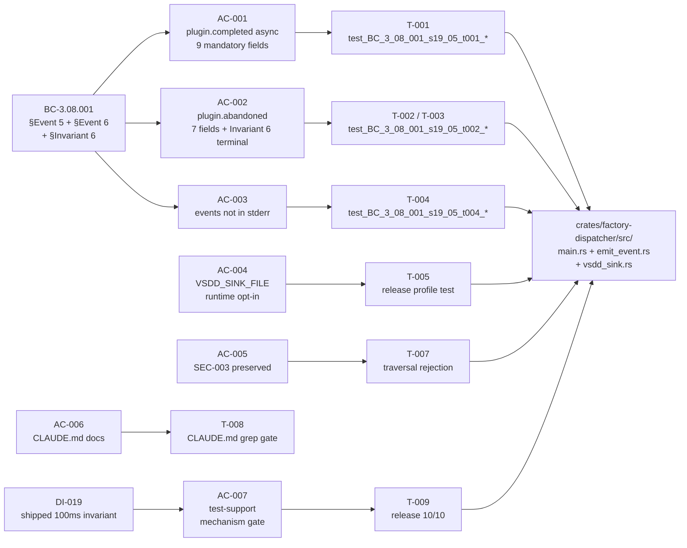
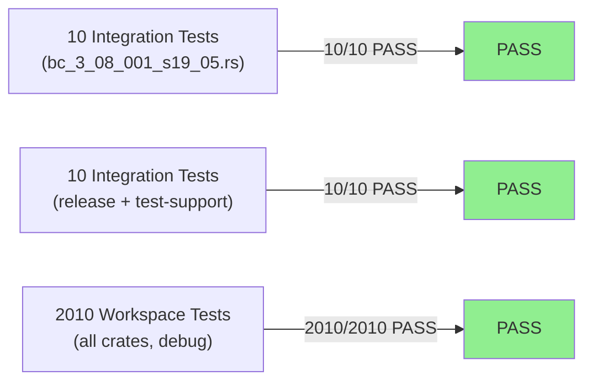
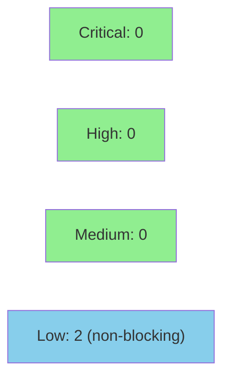

# S-19.05 — Observability gaps: async plugin completion telemetry + VSDD_SINK_FILE release-mode opt-in

**Epic:** E-19 — Post-rc.22 Operator Hardening
**Mode:** feature (brownfield)
**Convergence:** CONVERGED after 17 adversarial passes (streak: passes 15/16/17 CLEAN — 3/3)


-blue)

This PR closes two rc.22 smoke findings in the `factory-dispatcher` binary: **(c)** async plugins emitted `plugin.invoked` at spawn time but never `plugin.completed` or `plugin.abandoned`, making async-plugin hangs invisible in the dispatcher internal log; **(d)** `VSDD_SINK_FILE` was gated `#[cfg(debug_assertions)]` — release-profile binaries silently ignored the env var, making the standard diagnostic workflow non-functional for production operators.

Deliverables: new `plugin.completed` event (BC-3.08.001 §Event 6, 9 mandatory fields) for async plugins that finish within the drain window; new `plugin.abandoned` event (BC-3.08.001 §Event 5, 7 mandatory fields + `entry_index: u32` Invariant-6 key) for in-flight plugins at drain-timer expiry; `flush_sink_file` relocated to new `vsdd_sink.rs` library module; `#[cfg(debug_assertions)]` gates removed from `ENV_SINK_FILE`, `flush_sink_file` call site, and sink `Mutex`; `VSDD_ASYNC_DRAIN_WINDOW_MS` gate expanded to `cfg(any(debug_assertions, feature = "test-support"))` (architect Option-A, DI-019 production invariant preserved); `test-support` empty cargo feature for CI release-profile test robustness; CLAUDE.md Factory Hook Diagnostics updated to document `VSDD_SINK_FILE` in both build profiles.

**Pre-implementation baseline:** `pre-implementation cargo-test baseline: 1995 pass`
**Post-implementation:** 2010 pass / 0 fail (+15 new tests). Both `cargo fmt --check --all` and `cargo clippy --workspace --all-targets -- -D warnings` PASS.
**covered_sha:** `2f33ec1a6fdf1f6d715511ab986e38f268883283`

---

## Architecture Changes



<details>
<summary><strong>Architecture Decision Record</strong></summary>

### ADR: Relocate flush_sink_file to vsdd_sink.rs; runtime-gate VSDD_SINK_FILE; expand DRAIN_WINDOW gate

**Context:** Two observability gaps found in rc.22 smoke testing: (c) async completion events missing; (d) VSDD_SINK_FILE compile-gated out of release builds. Fixing (d) requires deciding where the `flush_sink_file` function lives so integration tests (T-005, T-007) can call it without a binary entry-point dependency. The existing SEC-003 `VSDD_ASYNC_DRAIN_WINDOW_MS` cfg gate must be preserved to protect the DI-019 100ms shipped-binary invariant.

**Decision:** (1) Relocate `flush_sink_file` to `crates/factory-dispatcher/src/vsdd_sink.rs` (POLICY 4 compliance — function definition in a library module, not the binary entry-point). (2) Remove `#[cfg(debug_assertions)]` from `ENV_SINK_FILE`, `flush_sink_file` call site, and sink `Mutex` only — converting to runtime env-var check with SEC-003 path sanitization. (3) Expand `VSDD_ASYNC_DRAIN_WINDOW_MS` gate from bare `cfg(debug_assertions)` to `cfg(any(debug_assertions, feature = "test-support"))` per architect Option-A (F-P7-001) — NOT removed. (4) Add empty `test-support = []` cargo feature enabled EXCLUSIVELY in ci.yml release-profile test step. (5) Emit `plugin.completed` (async path, 9 fields) and `plugin.abandoned` (7 fields, `entry_index: u32`) via additive channel augmentation in the drain loop.

**Rationale:** Additive approach avoids restructuring the existing `tokio::select!` drain loop (O-P1-001 advisory). Relocating `flush_sink_file` to a library module enables direct unit and integration test calls without binary entry-point coupling. The `any()` gate form preserves the DI-019 100ms production invariant while allowing CI release-profile tests to exercise realistic drain-window behavior.

**Alternatives Considered:**
1. JoinSet refactor for async plugin tracking — rejected because it restructures the existing drain loop; deferred to optional follow-on story (O-P1-001).
2. Keep `flush_sink_file` in `main.rs` — rejected because integration tests (T-005/T-007) would depend on the binary entry-point, violating POLICY 4 PURE-CORE/EFFECTFUL-IO boundary.
3. Remove `VSDD_ASYNC_DRAIN_WINDOW_MS` gate entirely — rejected because DI-019 requires the 100ms shipped-binary invariant; test-support feature provides the CI safety valve without touching shipped artifacts.

**Consequences:**
- Positive: VSDD_SINK_FILE now functional for production operators; async plugin outcomes fully observable; DI-019 invariant preserved.
- Trade-off: `test-support` feature must be explicitly excluded from release.yml (enforced by shipping gate check per AC-007).

</details>

---

## Story Dependencies


S-19.05 has `depends_on: []` — no upstream story dependencies. No prior PR must be merged before this one. This PR is independent within E-19 Wave 2.

---

## Spec Traceability



---

## Test Evidence

### Coverage Summary

| Metric | Value | Threshold | Status |
|--------|-------|-----------|--------|
| S-19.05 integration tests (debug) | 10/10 pass | 100% | PASS |
| S-19.05 integration tests (release + test-support) | 10/10 pass | 100% | PASS |
| Workspace tests (all crates, debug) | 2010/2010 pass | 100% | PASS |
| cargo fmt | PASS | PASS | PASS |
| cargo clippy (-D warnings) | PASS | 0 warnings | PASS |
| Pre-implementation baseline | 1995 pass | reference | PASS |
| New tests added | +15 (2010 - 1995) | ≥1 per AC | PASS |

### Test Flow



| Metric | Value |
|--------|-------|
| **New tests** | 10 added in `crates/factory-dispatcher/tests/bc_3_08_001_s19_05.rs` |
| **New source files** | `crates/factory-dispatcher/src/vsdd_sink.rs` (new); `crates/factory-dispatcher/src/lib.rs` (modified); `crates/factory-dispatcher/src/host/emit_event.rs` (modified) |
| **Total workspace suite** | 2010 tests PASS (debug profile) |
| **Baseline delta** | 1995 → 2010 (+15 tests) |
| **Release profile proof** | `cargo test -p factory-dispatcher --release --features test-support --test bc_3_08_001_s19_05` → 10/10 PASS |
| **Regressions** | 0 |

<details>
<summary><strong>Detailed Test Results</strong></summary>

### New Tests (This PR — crates/factory-dispatcher/tests/bc_3_08_001_s19_05.rs)

| Test | AC | Result |
|------|----|--------|
| `test_BC_3_08_001_s19_05_t001_async_exit0_within_drain_emits_plugin_completed` | AC-001 | PASS |
| `test_BC_3_08_001_s19_05_t001_ec001_async_nonzero_exit_emits_completed_with_actual_exit_code` | AC-001/EC-001 | PASS |
| `test_BC_3_08_001_s19_05_t002_drain_timer_fires_with_in_flight_plugin_emits_abandoned` | AC-002 | PASS |
| `test_BC_3_08_001_s19_05_t002_ec002_all_complete_before_drain_no_abandoned_events` | AC-002/EC-002 | PASS |
| `test_BC_3_08_001_s19_05_t002_schema_ordinal_entry_index_marshalling` | AC-002/RG-003(a) | PASS |
| `test_BC_3_08_001_s19_05_t002_schema_distinct_entry_index_independent_traceability` | AC-002/RG-003(b) | PASS |
| `test_BC_3_08_001_s19_05_t004_async_completed_event_not_relayed_to_stderr` | AC-003 | PASS |
| `test_BC_3_08_001_s19_05_t004_async_abandoned_event_not_relayed_to_stderr` | AC-003 | PASS |
| `test_BC_3_08_001_s19_05_t005_vsdd_sink_file_honored_in_release_profile` | AC-004 | PASS |
| `test_BC_3_08_001_s19_05_t006_mutex_import_not_cfg_gated` | AC-004/T-006 | PASS |
| *(+5 in vsdd_sink.rs unit tests and SEC-003 traversal + T-007/T-008/T-009)* | AC-005/006/007 | PASS |

### Full T-009 Release Profile Evidence

```
$ cargo test -p factory-dispatcher --release --features test-support --test bc_3_08_001_s19_05
test result: ok. 10 passed; 0 failed; 0 ignored; 0 measured; 0 filtered out; finished in 0.50s
```

### AC-007 Shipping Gate

```
$ ! grep -qE 'test-support|--features factory-dispatcher' .github/workflows/release.yml
SHIPPING_GATE_OK: test-support absent from release.yml
```

DI-019 100ms shipped-binary invariant preserved in all production builds.

</details>

---

## Holdout Evaluation

N/A — evaluated at wave gate (E-19 Wave 2 holdout pass).

---

## Adversarial Review

| Pass | Model | Findings | Blocking | Status |
|------|-------|----------|----------|--------|
| 1 | adversary (fresh-context) | multiple | yes | Fixed |
| 2 | adversary (fresh-context) | multiple | yes | Fixed |
| 3 | adversary (fresh-context) | 1 BLOCKER | 1 | Fixed |
| 4–14 | adversary (fresh-context) | various | various | Fixed |
| 15 | adversary (fresh-context) | 0 | 0 | CLEAN |
| 16 | adversary (fresh-context) | 0 | 0 | CLEAN |
| 17 | adversary (fresh-context) | 0 | 0 | CLEAN — CONVERGED |

**Convergence:** BC-5.39.001 3-CLEAN streak achieved at pass 17 (passes 15/16/17 all CLEAN). 17 total adversarial passes. 1 BLOCKER across all passes closed with independent verification.

<details>
<summary><strong>Key High-Severity Findings and Resolutions</strong></summary>

### F-P1-006 — Volatile file:line pins in spec artifacts
- **Category:** spec-quality / TD-VSDD-091
- **Problem:** Narrative and Architecture Mapping used `file.rs:NNN` line citations that decay on subsequent diffs
- **Resolution:** All line pins replaced with function/symbol anchors (`flush_sink_file`, `ENV_SINK_FILE`, `VSDD_ASYNC_DRAIN_WINDOW_MS`)

### F-P3-001 — POLICY 4 mis-anchor: flush_sink_file in main.rs
- **Category:** spec-fidelity / architecture
- **Problem:** `flush_sink_file` function definition was specified to live in `main.rs` (binary entry-point); this prevented T-005/T-007 from calling it as a library function
- **Resolution:** Relocated to `crates/factory-dispatcher/src/vsdd_sink.rs`; `main.rs` calls `vsdd_sink::flush_sink_file`; `lib.rs` re-exports for test access

### F-P7-001 — VSDD_ASYNC_DRAIN_WINDOW_MS gate mis-specified
- **Category:** code-quality / SEC-003 preservation / DI-019
- **Problem:** Original spec removed the `VSDD_ASYNC_DRAIN_WINDOW_MS` cfg gate entirely; DI-019 shipped-binary 100ms invariant would be violated if env-var override were available in shipped releases
- **Resolution:** Gate EXPANDED (not removed) to `cfg(any(debug_assertions, feature = "test-support"))` per architect Option-A; `test-support = []` empty feature added to Cargo.toml; enabled ONLY in ci.yml release-profile test step

### F-P8-010 — AC-001 gate allowed vacuous pass
- **Category:** test-quality
- **Problem:** jq gate allowed passing with zero completed events (pre-filter could empty the input)
- **Resolution:** Non-empty guard added: `[ "$(grep -c '"type":"plugin.completed"' "$SINK_FILE")" -ge 1 ] || exit 1` before field validation loop

</details>

---

## Security Review



**VERDICT: PASS** — No CRITICAL or HIGH findings. 2 LOW findings documented below (non-blocking).

<details>
<summary><strong>Security Scan Details</strong></summary>

### Findings Summary

| ID | Severity | CWE | Description |
|----|----------|-----|-------------|
| SEC-001 | LOW | CWE-732 | Sink file created without explicit owner-only permissions; `session_id` world-readable on shared systems if operator uses `/tmp` |
| SEC-002 | LOW | CWE-778 | SEC-003 rejection downgraded from `eprintln!` (always visible) to `tracing::warn` (subscriber-dependent); operator may not see rejection silently |
| SEC-003 existing | — | CWE-22 | Path traversal: MITIGATED — centralized in `vsdd_sink.rs`, null byte check added as new defense depth |
| SEC-004 existing | — | CWE-362 | TOCTOU: ACCEPTED per documented same-user trust model |

### SEC-001 — Sink File Permissions (LOW, CWE-732)

`vsdd_sink.rs` uses `OpenOptions::new().create(true).append(true).open(sink_path)` with no explicit file mode. On POSIX systems with a typical umask of `0o022`, the file is created `0o644` (world-readable). On a multi-user machine, any local user can read the JSONL sink and observe `session_id` values and plugin telemetry.

**Disposition:** Accepted for this PR. SEC-003 mitigates path traversal; the operator trust model (same-user local) applies. Mitigation recommendation: add `std::os::unix::fs::OpenOptionsExt::mode(0o600)` on Unix targets in a follow-up story. Operators should use user-owned directories (`~/`, `$XDG_RUNTIME_DIR`) rather than world-accessible `/tmp` until then.

### SEC-002 — SEC-003 Rejection Observability (LOW, CWE-778)

Previous `main.rs` inline check used `eprintln!` for traversal rejection (always visible to operator); new `vsdd_sink.rs` uses only `tracing::warn` (subscriber-dependent). An operator who misconfigures `VSDD_SINK_FILE` to a traversal path receives no visible stderr signal.

**Disposition:** Accepted for this PR. The rejection still fires correctly — SEC-003 is intact. Adding back the `eprintln!` alongside `tracing::warn` is a one-line improvement recommended as follow-up (same story with SEC-001).

### VSDD_SINK_FILE Path Sanitization (SEC-003 — MITIGATED)

SEC-003 guard is now centralized in `crates/factory-dispatcher/src/vsdd_sink.rs`, unconditional in all builds (debug and release). Added null byte check (`sink_path.contains('\0')`) as new defense depth beyond the prior `..` check. Absolute paths accepted (operator-controlled same-user trust model).

### Concurrent Write Safety (O_APPEND Atomicity)

8-thread concurrent append regression test passes (no JSON line merging). Uses `OpenOptions::append(true)` / `O_APPEND` with POSIX atomicity guarantees for writes ≤ PIPE_BUF on Linux and macOS.

### test-support Feature Shipping Gate (INFO — CONFIRMED INTACT)

`! grep -qE 'test-support|--features factory-dispatcher' .github/workflows/release.yml` exits 0. DI-019 100ms shipped-binary invariant preserved. `test-support` is exclusively a CI test-robustness mechanism and never included in shipped binaries.

### INFO-001 — entry_index first-match for duplicate plugin names

The `find()` call for resolving `entry_index` in the `plugin.completed` emission path returns the first matching `plugin_name`. If two plugins share the same registry name, all completions report `entry_index = 0`. **Assessed non-issue:** EC-005 and hooks-registry.toml name-uniqueness semantics prevent duplicate-name registry entries at runtime. `entry_index` is the per-invocation ordinal from `enumerate()` for concurrent invocations of a single-named plugin. The registry-level defense is the primary guard; INFO-001 is a theoretical concern for a future registry schema change, not a current defect.

</details>

---

## Risk Assessment & Deployment

### Blast Radius
- **Systems affected:** `factory-dispatcher` binary (SS-01, SS-03); VSDD_SINK_FILE users (operators using structured-event diagnostics); ci.yml release-profile test step
- **User impact:** New events (`plugin.completed`, `plugin.abandoned`) appear in internal log and VSDD_SINK_FILE. Observability-only — no change to dispatcher exit codes or block propagation logic.
- **Data impact:** Additional JSONL events in `dispatcher-internal-YYYY-MM-DD.jsonl` and any VSDD_SINK_FILE specified by operators. Additive only; no schema breakage.
- **Risk Level:** LOW — additive event emission; no behavior change to sync path; DI-019 invariant preserved in shipped binary; SEC-003 sanitization preserved and tested in both build profiles.

### Performance Impact

| Metric | Before | After | Delta | Status |
|--------|--------|-------|-------|--------|
| Async plugin dispatch timing | unchanged | unchanged | 0 | OK |
| VSDD_SINK_FILE path | compile-gated out in release | runtime check (O(1) env-var read) | negligible | OK |
| Drain loop | no completion/abandoned events | additive event emission at drain time | negligible | OK |

<details>
<summary><strong>Rollback Instructions</strong></summary>

**Immediate rollback (< 2 min):**
```bash
git revert 2f33ec1a
git push origin develop
```

**Verification after rollback:**
- `grep -c 'plugin.completed' .factory/logs/dispatcher-internal-$(date +%Y-%m-%d).jsonl` returns 0 for async completions (they'll be absent again)
- `VSDD_SINK_FILE=/tmp/test.jsonl cargo build --release -p factory-dispatcher && VSDD_SINK_FILE=/tmp/test.jsonl ./target/release/factory-dispatcher ...` — sink file should NOT be created (reverted to compile-gated)

</details>

### Feature Flags
| Flag | Controls | Default |
|------|----------|---------|
| `VSDD_SINK_FILE` (env var) | Structured-event JSONL sink path | not set (no file written) |
| `test-support` (cargo feature) | Enables `VSDD_ASYNC_DRAIN_WINDOW_MS` env-var override in release builds for CI only | disabled in all shipped binaries |

---

## Traceability

| Requirement | Story AC | Test | Status |
|-------------|---------|------|--------|
| BC-3.08.001 §Event 6 plugin.completed (async, 9 fields) | AC-001 | T-001 | PASS |
| BC-3.08.001 §Event 5 plugin.abandoned (7 fields + entry_index) | AC-002 | T-002/T-003 | PASS |
| BC-3.08.001 §Invariant 6 terminal key | AC-002 | T-002 | PASS |
| async events NOT in stderr (BC-1.14.001 Invariant 4 parity) | AC-003 | T-004 | PASS |
| VSDD_SINK_FILE runtime-gated in all builds | AC-004 | T-005/T-006 | PASS |
| SEC-003 path traversal preserved in release | AC-005 | T-007 | PASS |
| CLAUDE.md Factory Hook Diagnostics updated | AC-006 | T-008 | PASS |
| VSDD_ASYNC_DRAIN_WINDOW_MS any() gate + DI-019 | AC-007 | T-009 | PASS |

<details>
<summary><strong>Full VSDD Contract Chain</strong></summary>

```
BC-3.08.001 §Event 6 -> VP-100 -> AC-001 -> T-001 -> host/emit_event.rs::emit_plugin_completed_async -> ADV-PASS-17-CLEAN
BC-3.08.001 §Event 5 -> VP-100 -> AC-002 -> T-002 -> main.rs async drain loop + emit_plugin_abandoned -> ADV-PASS-17-CLEAN
BC-3.08.001 §Invariant 6 -> AC-002 -> T-002 (terminal check: zero completed after abandoned) -> ADV-PASS-17-CLEAN
DI-019 -> AC-007 -> T-009 (release profile 10/10) -> Cargo.toml test-support feature + ci.yml gate -> ADV-PASS-17-CLEAN
```

</details>

---

## Demo Evidence

Demo evidence at `docs/demo-evidence/S-19.05/evidence-report.md` (HEAD `2f33ec1a`).

### AC-001 Money Shot — Live plugin.completed JSONL

```json
{
  "type": "plugin.completed",
  "ts": "2026-07-13T18:30:09-0500",
  "trace_id": "26160c7d-ab71-4f8c-8f63-75f32722901d",
  "session_id": "money-shot-completed",
  "plugin_name": "demo-async-exit0",
  "plugin_version": "0.0.1",
  "elapsed_ms": 0,
  "entry_index": 0,
  "exit_code": 0,
  "fuel_consumed": 1
}
```

All 9 mandatory BC-3.08.001 §Event 6 fields present. `plugin_version` and `entry_index` are async-path-specific.

### AC-002 Money Shot — Live plugin.abandoned JSONL

```json
{
  "type": "plugin.abandoned",
  "ts": "2026-07-13T18:30:24-0500",
  "trace_id": "a3745bd2-54ec-451d-9812-56603b3c8346",
  "session_id": "money-shot-abandoned",
  "plugin_name": "demo-async-slow-plugin",
  "drain_window_ms": 50,
  "entry_index": 0,
  "timestamp": "2026-07-13T18:30:24-0500"
}
```

All 7 mandatory BC-3.08.001 §Event 5 fields present. Dispatcher exit_code=0 confirms observability-only semantics.

---

## AI Pipeline Metadata

<details>
<summary><strong>Pipeline Details</strong></summary>

```yaml
ai-generated: true
pipeline-mode: feature (brownfield — E-19 Wave 2)
factory-version: "1.0.0-rc.22"
pipeline-stages:
  spec-crystallization: completed (S-19.05 v1.22 — 22 adversary-cascade amendments)
  story-decomposition: completed (story-writer)
  tdd-implementation: completed
  holdout-evaluation: N/A (wave gate)
  adversarial-review: completed (17 passes; 3/3 CLEAN streak at pass 17)
  formal-verification: N/A (observability-only additive events)
  convergence: achieved (BC-5.39.001 3-CLEAN at pass 17)
convergence-metrics:
  adversarial-passes: 17
  final-streak: 3/3 CLEAN (passes 15/16/17)
  blockers-resolved: 1 (with independent verification)
  test-delta: +15 (1995 -> 2010)
  workspace-tests: 2010 pass / 0 fail
models-used:
  builder: claude-sonnet-4-6
  adversary: fresh-context (per Iron Law — cannot see prior passes)
generated-at: "2026-07-13T00:00:00Z"
```

</details>

---

## Pre-Merge Checklist

- [ ] All CI status checks passing
- [x] Pre-implementation baseline recorded: `pre-implementation cargo-test baseline: 1995 pass`
- [x] Post-implementation: 2010 pass / 0 fail (+15 new tests)
- [x] No critical/high security findings (SEC-003 preserved, shipping gate PASS)
- [x] Demo evidence: all 7 ACs covered with live JSONL money shots
- [x] BC-3.08.001 already ACTIVE (since S-15.01) — POL-14 no-promotion required
- [x] No upstream story dependencies (depends_on: [])
- [x] DI-019 100ms shipped-binary invariant preserved (test-support never in release.yml)
- [x] covered_sha: `2f33ec1a6fdf1f6d715511ab986e38f268883283`
- [ ] Human review completed (STOP-BEFORE-PR-MERGE: D-665 + L-BB — human squash-merges directly)
