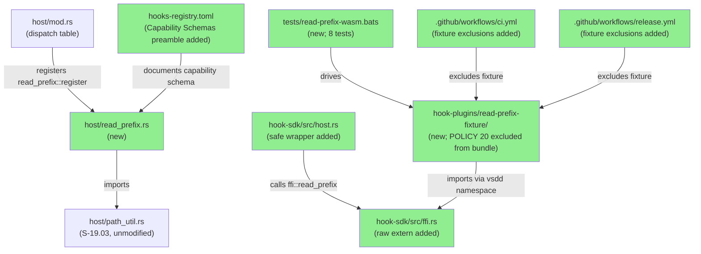
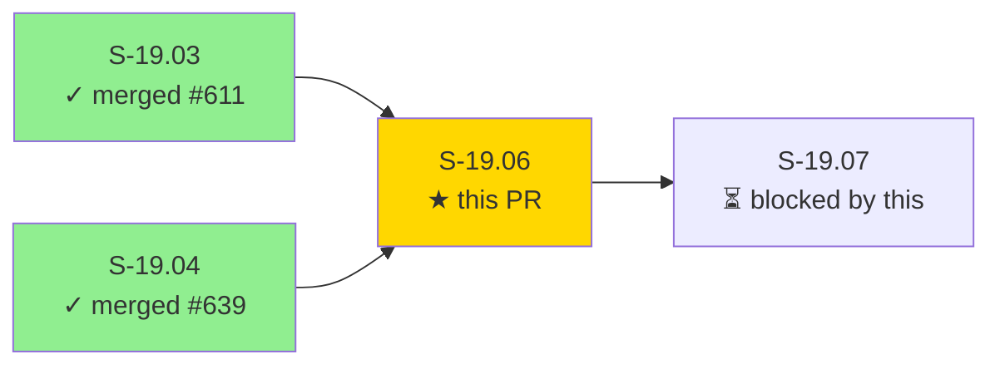
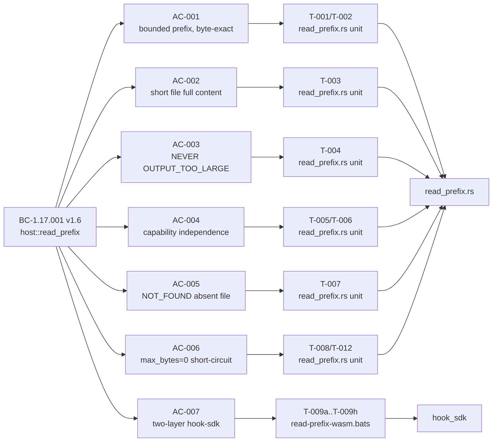
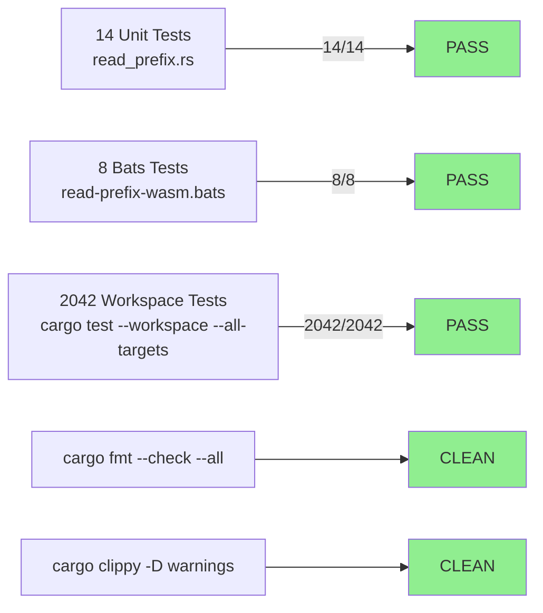
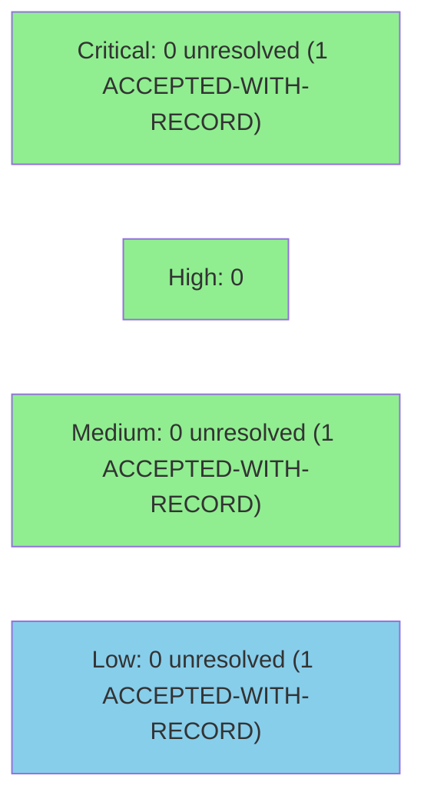

# S-19.06 — host::read_prefix bounded partial read: head-c semantics, NEVER OUTPUT_TOO_LARGE, additive FFI entry point

**Epic:** E-19 — Post-rc.22 Operator Hardening
**Mode:** feature (brownfield — engine-discipline F5 cycle)
**Wave:** 2 (E-19)
**Convergence:** CONVERGED after 11 LOCAL adversarial passes (passes 9/10/11 CLEAN; BC-5.39.001 3-CLEAN protocol met)


This PR implements `host::read_prefix` — a new bounded partial-read host function that delivers `head -c` semantics for WASM plugins. `read_file` is all-or-nothing: it returns `OUTPUT_TOO_LARGE (-3)` when a file exceeds `max_bytes`. Plugins that only need the first N bytes of a file (e.g., reading YAML frontmatter from a large markdown artifact, or scanning a log header) cannot use `read_file` without risking `OUTPUT_TOO_LARGE` on any file that grows beyond the cap. This PR closes that gap: `read_prefix(path, max_bytes, timeout_ms)` returns at most `max_bytes` bytes from the start of the file and is **guaranteed never to return `OUTPUT_TOO_LARGE (-3)`** — by construction, `max_bytes` IS the output cap. The implementation is additive: `read_file` all-or-nothing semantics are immutable per BC-1.17.001 Invariant 2; `path_util.rs` and `read_file.rs` are untouched; `HOST_ABI_VERSION` remains 1. Two-layer hook-sdk bindings (safe wrapper in `hook-sdk/src/host.rs` + raw extern in `hook-sdk/src/ffi.rs`) give plugin authors both a safe Rust API and a correct wasm32 import target.

**Pre-implementation cargo-test baseline: 330 pass** (F-P2-012 required checklist item — Task 1)

---

## Architecture Changes



<details>
<summary><strong>Architecture Decision Record — ADR-025 Decision 15 + BC-1.17.001 v1.6</strong></summary>

### ADR: read_prefix as additive FFI entry point with two-layer hook-sdk binding

**Context:** `read_file` cannot safely serve plugins that only need a bounded prefix: any file exceeding `max_bytes` produces `OUTPUT_TOO_LARGE (-3)`, forcing plugin authors to either set dangerously large caps or implement workarounds. A `head -c`-style function is needed.

**Decision (ADR-025 D-15, normative source: BC-1.17.001 v1.6):** Add `read_prefix(path: &str, max_bytes: u32, timeout_ms: u32) -> i32` as a new host entry point in the `vsdd` WASM import namespace. Two-layer hook-sdk binding: (1) safe wrapper `pub fn read_prefix(...) -> Result<Vec<u8>, HostError>` in `hook-sdk/src/host.rs`; (2) raw wire-ABI extern `pub safe fn read_prefix(path_ptr: *const u8, ...)` with 6-param pointer/length shape in `hook-sdk/src/ffi.rs`, plus a `#[cfg(not(target_arch = "wasm32"))]` host_stubs counterpart.

**Rationale:** Additive entry point: no breaking change to `HOST_ABI_VERSION = 1`, no change to `read_file` semantics, no change to `path_util.rs`. The `max_bytes` parameter IS the cap — the function mechanically cannot produce `OUTPUT_TOO_LARGE`. Independent `capabilities.read_prefix` registry block (separate from `capabilities.read_file`) enables defense-in-depth per POLICY 20 / BC-1.17.001 Invariant 3.

**Alternatives Considered:**
1. Extend `read_file` with a `truncate: bool` flag — rejected: changes `read_file` semantics (Invariant 2 forbids); would silently convert an error into a truncated success for existing plugins
2. Plugin-side buffering via multiple `read_file` calls — rejected: no partial-seek API; still hits OUTPUT_TOO_LARGE on first call if file is large

**Consequences:**
- Plugins using `read_prefix` have bounded output guarantees by construction (no OUTPUT_TOO_LARGE)
- `read_file` consumers are unaffected; Invariant 2 verified by `git diff` gate (read_file.rs + path_util.rs byte-unmodified)
- POLICY 20 read-prefix-fixture excluded from all release bundles and workspace wasm builds via dual-layer `--exclude` gates in ci.yml + release.yml + T-009h coupled-count presence gate

</details>

---

## Story Dependencies



**Upstream dependencies:**
- S-19.03 (#611, merged): `path_util::resolve_path_for_allowlist` + `codes::NOT_FOUND = -5` + `HostError::NotFound`
- S-19.04 (#639, merged): `hooks-registry.toml` tool-filter-anchoring preamble (S-19.06 adds a DISTINCT "Capability Schemas" preamble block, separate from S-19.04's block)

**Downstream:** S-19.07 is blocked by this PR.

---

## Spec Traceability



**Full VSDD Contract Chain:**
```
BC-1.17.001 v1.6 PC-1+PC-6 → AC-001 → T-001/T-002 → read_prefix.rs → ADV-LOCAL-PASS-11-OK
BC-1.17.001 v1.6 PC-2 → AC-002 → T-003 → read_prefix.rs → ADV-LOCAL-PASS-11-OK
BC-1.17.001 v1.6 PC-3 → AC-003 → T-004 (runtime) + T-009g (static) → read_prefix.rs → ADV-LOCAL-PASS-11-OK
BC-1.17.001 v1.6 PC-4+Inv3 → AC-004 → T-005/T-006/T-013a → read_prefix.rs → ADV-LOCAL-PASS-11-OK
BC-1.17.001 v1.6 PC-5+Inv5 → AC-005 → T-007 → read_prefix.rs → ADV-LOCAL-PASS-11-OK
BC-1.17.001 v1.6 EC-001 → AC-006 → T-008+T-012 → read_prefix.rs → ADV-LOCAL-PASS-11-OK
BC-1.17.001 v1.6 §(a)+Inv2 → AC-007 → T-009a..T-009h → hook-sdk+dispatcher → ADV-LOCAL-PASS-11-OK
```

---

## Test Evidence

### Coverage Summary

| Metric | Value | Threshold | Status |
|--------|-------|-----------|--------|
| Unit tests (factory-dispatcher crate) | 14/14 pass | 100% | PASS |
| Bats integration tests | 8/8 pass | 100% | PASS |
| Workspace tests (cargo --workspace) | 2042/2042 pass | 100% | PASS |
| fmt | CLEAN | 0 warnings | PASS |
| clippy (-D warnings) | CLEAN | 0 warnings | PASS |
| Demo evidence | 7/7 ACs | 1 per AC | PASS |

**Pre-implementation cargo-test baseline: 330 pass** (F-P2-012 required checklist item — Task 1)

### Test Flow



| Metric | Value |
|--------|-------|
| **New unit tests** | 14 added (T-001..T-013b, including 5 cascade-remediation regression locks) |
| **New bats tests** | 8 added (T-009a..T-009h) |
| **Total suite** | 2042 cargo + 8 bats PASS |
| **Pre-impl baseline** | 330 pass (F-P2-012) |
| **Regressions** | 0 |

<details>
<summary><strong>Detailed Test Results</strong></summary>

### Unit Test Suite — `crates/factory-dispatcher/src/host/read_prefix.rs`

| Test | AC | BC Trace | Result |
|------|----|----------|--------|
| `test_S19_06_T001_bounded_prefix_returns_exactly_max_bytes` | AC-001 | PC-1+PC-6 | PASS |
| `test_S19_06_T002_byte_exact_no_utf8_trimming_at_boundary` | AC-001 | PC-6 | PASS |
| `test_S19_06_T003_short_file_returns_full_content_no_padding` | AC-002 | PC-2 | PASS |
| `test_S19_06_T004_never_returns_output_too_large` | AC-003 | PC-3 | PASS |
| `test_S19_06_T005_no_capability_block_returns_capability_denied` | AC-004 | PC-4 | PASS |
| `test_S19_06_T006_read_file_cap_only_returns_capability_denied` | AC-004 | Invariant 3 | PASS |
| `test_S19_06_T007_absent_allowlisted_file_returns_not_found_and_emits_event` | AC-005 | PC-5+Inv5 | PASS |
| `test_S19_06_T008_max_bytes_zero_returns_empty_payload_exit_0` | AC-006 | EC-001 | PASS |
| `test_S19_06_T010_path_outside_allowlist_returns_capability_denied_with_event` | EC-004 | EC-004 | PASS |
| `test_S19_06_T012_absent_file_max_bytes_zero_short_circuits_before_existence_check` | EC-001 composite | EC-001 | PASS |
| `test_S19_06_T012_MUTANT_VERIFY_short_circuit_reorder_causes_not_found` | T-012 reorder lock | EC-001 ordering | PASS |
| `test_S19_06_T013a_no_capability_max_bytes_zero_returns_capability_denied` | AC-004 step-order lock | PC-4 + EC-001 | PASS |
| `test_S19_06_T013b_path_outside_allowlist_max_bytes_zero_returns_capability_denied` | AC-004 step-order lock | PC-4 + EC-001 | PASS |
| `test_S19_06_T013_MUTANT_VERIFY_hoisted_short_circuit_leaks_to_unauthorized_caller` | deny-by-default lock | Invariant 3 | PASS |

### Bats Suite — `plugins/vsdd-factory/tests/read-prefix-wasm.bats`

| Test | Gate | AC | Result |
|------|------|----|--------|
| T-009a | AC-007 Gate 1: safe wrapper signature in hook-sdk/src/host.rs | AC-007 | PASS |
| T-009b | AC-007 Gate 2(i): raw extern `pub safe fn read_prefix` in ffi.rs | AC-007 | PASS |
| T-009c | AC-007 Gate 2(ii): `#[link(wasm_import_module = "vsdd")]` in ffi.rs | AC-007 | PASS |
| T-009d | AC-007 Gate 2(iii): `fn read_prefix` in wasm32 extern block AND host_stubs | AC-007 | PASS |
| T-009e | AC-007 Gate 3: `read_prefix::register` in host/mod.rs dispatch table | AC-007 | PASS |
| T-009f | AC-007 Gate 4: read-prefix-fixture builds for wasm32-wasip1 | AC-007 | PASS |
| T-009g | AC-003 static gate: OUTPUT_TOO_LARGE absent from non-comment production code | AC-003 | PASS |
| T-009h | POLICY 20 exclusion presence-gate: read-prefix-fixture excluded in all wasm32-wasip1 --workspace builds and staging loops | POLICY 20 | PASS |

</details>

---

## Holdout Evaluation

N/A — library story (`behavioral_contracts: [BC-1.17.001]`). Evaluated at wave gate per pipeline protocol.

---

## Adversarial Review

| Pass | Findings | BLOCKER | HIGH | MEDIUM | LOW | Status |
|------|----------|---------|------|--------|-----|--------|
| 1 | 2 | 0 | 1 | 1 | 0 | Fixed |
| 2 | 2 | 0 | 0 | 0 | 2 | Fixed |
| 3 | 1 | 1 | 0 | 0 | 0 | Fixed |
| 4 | 1 | 0 | 0 | 1 | 0 | Fixed |
| 5 | 0 | 0 | 0 | 0 | 0 | CLEAN (1/3) |
| 6 | 1 | 0 | 0 | 0 | 1 | Fixed |
| 7 | 2 | 0 | 0 | 0 | 2 | Fixed |
| 8 | 2 | 0 | 0 | 0 | 2 | Fixed |
| 9 | 0 | 0 | 0 | 0 | 0 | CLEAN (1/3) |
| 10 | 0 | 0 | 0 | 0 | 0 | CLEAN (2/3) |
| 11 | 0 | 0 | 0 | 0 | 0 | CLEAN (3/3) → CONVERGED |

**Convergence:** CONVERGED 3/3 per BC-5.39.001 (passes 9/10/11 CLEAN; 11 total LOCAL passes).

Cascade trajectory: P1 H1M1 0/3, P2 L2 0/3, P3 B1 0/3, P4 M1 0/3, P5 CLEAN 1/3, P6 L1 0/3, P7 L2 0/3, P8 L2 0/3, P9 CLEAN 1/3, P10 CLEAN 2/3, P11 CLEAN 3/3 CONVERGED.

<details>
<summary><strong>High/Blocker Severity Findings & Resolutions</strong></summary>

### F-P1-002 — HIGH — [POLICY 20 single-point defense] release.yml/ci.yml exclusion chain had no presence guard

- **Location:** `.github/workflows/release.yml`, `.github/workflows/ci.yml` — `read-prefix-fixture` exclusion logic
- **Category:** security / spec-fidelity (POLICY 20)
- **Problem:** Three independent gaps: (1) `release.yml` `--exclude read-prefix-fixture` line had no presence gate — T-011 tested a Rust reimplementation of exclusion logic, not the actual workflow file, giving false confidence even if the exclusion line was deleted; (2) three `ci.yml` workspace wasm build steps built the fixture crate without exclusion, creating a latent artifact-shipping path; (3) staging loop check was one-directional (declared ⊆ staged, but not staged ⊆ declared).
- **Resolution:** (a) `--exclude read-prefix-fixture` added to all 3 ci.yml wasm32-wasip1 workspace builds; (b) named stale-cache case-skips added in all 5 staging loops (3 ci.yml + 2 release.yml); (c) T-009h: exact-count presence-gate asserting 1 release build exclusion + 3 ci build exclusions + 3+2 staging skips; coupled-count dual-direction mutation witnesses confirm gate fires on both removal AND un-swept addition. TD-VSDD-060 sweep found 4th and 5th staging loops beyond adversary's initial count of 3.
- **Tests added:** T-009h (exact-count presence-gate with embedded mutation-liveness)

### F-P3-001 — BLOCKER — [fix-introduced clippy] unnecessary_lazy_evaluations in T-012 prepare_mutant

- **Location:** `crates/factory-dispatcher/src/host/read_prefix.rs` — `prepare_mutant` helper
- **Category:** CI-blocking / code-quality
- **Problem:** `prepare_mutant` added at babce0be used `ok_or_else(|| codes::CAPABILITY_DENIED)` with a bare-constant closure; `cargo clippy --workspace --all-targets -- -D warnings` exited 101. CI-red; unmergeable.
- **Resolution:** Changed to `ok_or(codes::CAPABILITY_DENIED)` at 3ac997b8. TD-VSDD-060 sweep confirmed the sole remaining `ok_or_else` in production `prepare()` is legitimate (captures `emit_denial` side-effect, not bare-constant).
- **Tests added:** None (fix was one-line change; full workspace 2042/2042 green post-fix)

### F-P1-001 — MEDIUM — [story-gate defect] AC-003 static gate failed against correct code

- **Location:** Story v1.19 AC-003 gate; `crates/factory-dispatcher/src/host/read_prefix.rs`
- **Category:** spec-fidelity / test-quality
- **Problem:** The AC-003 static gate as written in v1.19 matched `OUTPUT_TOO_LARGE` strings inside T-004's `#[cfg(test)]` module assertions — test assertions, not production code. Additionally used BSD-sed-incompatible `:a;ta` syntax and was never wired into a bats suite (described but unexecuted).
- **Production code status:** `OUTPUT_TOO_LARGE (-3)` is structurally unreachable in production implementation — `file.take(max_bytes)` caps the buffer; the buffer length is always ≤ max_bytes so the OUTPUT_TOO_LARGE guard can never be reached.
- **Resolution:** Gate rewritten to POSIX awk production-scope pipeline (stops at `#[cfg(test)]` boundary; strips block/line comments); execution site added as T-009g in `read-prefix-wasm.bats` with embedded mutation-liveness fixture confirming gate fires on injected OUTPUT_TOO_LARGE path.
- **Tests added:** T-009g (static gate with mutation-liveness witness)

### F-P4-001 — MEDIUM — [deny-by-default ordering] AC-004 negative-control step-order gap

- **Location:** `crates/factory-dispatcher/src/host/read_prefix.rs` — capability check vs max_bytes=0 short-circuit ordering
- **Category:** spec-fidelity
- **Problem:** AC-004 negative-control (no capability block → CAPABILITY_DENIED) was only tested without the max_bytes=0 short-circuit path. A caller without capabilities but with max_bytes=0 could potentially bypass the deny-by-default gate if short-circuit fired before capability check.
- **Resolution:** Implementation verified: capability check is step 1, path check is step 2, max_bytes=0 short-circuit is step 3. T-013a and T-013b added as explicit denial-by-default-ordering locks; T-013_MUTANT_VERIFY confirms the lock is load-bearing (hoisted short-circuit would permit unauthorized caller).
- **Tests added:** T-013a, T-013b, T-013_MUTANT_VERIFY

</details>

---

## Accepted-with-Record Items

The following items were reviewed and accepted with a rationale anchor, pending human authorization at the merge gate:

1. **EC-006 timeout non-enforcement (SYSTEMIC host-ABI gap):** `read_prefix` uses synchronous `func_wrap` closures; epoch interruption cannot preempt blocked host calls. The registry preamble documents a `-2` code `read_prefix` never actually returns. This gap is pre-existing and spans `read_file` (S-19.06 would have to violate Invariant 2 to address it there). Routed as a recommended follow-up architect story, to be surfaced at merge gate and anchored post-E-19.

2. **out_ptr=0 sentinel semantics:** The wasm-boundary `out_ptr=0` byte-transfer pattern replicates `read_file`'s pre-existing pattern per Invariant 2. No new risk; accepted as systemic-parity, pending architect clarification story.

3. **Wire code -4 INVALID_ARGUMENT registry-schema completeness:** Optional completeness item — the preamble documents `-1 CAPABILITY_DENIED`, `-2 TIMEOUT`, `-3 OUTPUT_TOO_LARGE (never returned)`, `-5 NOT_FOUND`, `-99 INTERNAL_ERROR` but not `-4`. Schema completeness is documentation-only; no behavioral gap.

---

## Security Review



**Verdict: APPROVE** — 0 net-new unresolved security issues. All three findings are pre-existing `read_file`-parity patterns mirrored per BC-1.17.001 Invariant 2 and accepted-with-record through 11 LOCAL adversary passes.

<details>
<summary><strong>Security Scan Details</strong></summary>

### Findings

| ID | Severity | CWE | Description | Disposition |
|----|----------|-----|-------------|-------------|
| SEC-001 | CRITICAL → ACCEPTED-WITH-RECORD | CWE-670 | `out_ptr=0` sentinel: host writes data to WASM guest address 0; `read_owned_bytes` ptr==0 guard returns `Vec::new()`. All non-empty reads return empty on WASM side. | Pre-existing in `read_file` (BC-1.17.001 Invariant 2); accepted via LOCAL adversary passes 1–11 ("SENTINEL-SEMANTICS-REQUIRING-ARCHITECT-CLARIFICATION"); anchored to post-E-19 architect story. Task explicitly: do not re-litigate. |
| SEC-002 | MEDIUM → ACCEPTED-WITH-RECORD | CWE-400 | `Vec::with_capacity(min(max_bytes, 65536))` is pre-alloc hint only; `read_to_end` can grow to max_bytes (u32::MAX = 4 GiB) if operator misconfigures. | Pre-existing in `read_file`; mitigated by operator-controlled capability + path_allow; LOCAL adversary pass-3 swept numeric/boundary vectors. |
| SEC-003 | LOW → ACCEPTED-WITH-RECORD | CWE-833 | `timeout_ms` not enforced for host-side blocking I/O; special files in path_allow can deadlock dispatcher thread. | Pre-existing systemic host-ABI gap spanning `read_file`; explicit accepted-with-record in LOCAL passes 1+3 (EC-006 timeout systemic gap). Anchored to post-E-19 architect story per task. |

### OWASP Coverage

| OWASP Category | Assessment |
|----------------|------------|
| A05:2021 Security Misconfiguration | SEC-001/SEC-003: inherited systemic patterns; accepted-with-record |
| A01:2021 Broken Access Control | MITIGATED — capability deny-by-default verified; path traversal defense identical to `read_file` (T-005/T-006/T-013a/T-013b + mutation witnesses) |
| Supply Chain / WASM bundle | MITIGATED — read-prefix-fixture excluded from all release/CI bundles via dual-layer POLICY 20 defense; T-009h coupled-count presence-gate |

### Positive Security Changes

- Capability deny-by-default for `read_prefix` enforced independently of `capabilities.read_file` (BC-1.17.001 Invariant 3; T-006 + T-013a confirm independence)
- Path traversal defense chain identical to `read_file` (resolve_path_for_allowlist from path_util.rs; T-013b confirms ordering lock)
- POLICY 20 two-layer defense: read-prefix-fixture excluded from all wasm32-wasip1 workspace builds + staging loops; T-009h exact-count coupled-count gate blocks silent removal

### Dependency Audit

- `cargo audit`: no new external crates — fixture crate adds only workspace-path dependency `vsdd-hook-sdk`. No new CVE exposure.

</details>

---

## Risk Assessment & Deployment

### Blast Radius
- **Systems affected:** `crates/factory-dispatcher/src/host/` (new file `read_prefix.rs`; `mod.rs` additive registration); `crates/hook-sdk/src/` (`host.rs` + `ffi.rs` additive); `crates/hook-plugins/read-prefix-fixture/` (new crate, POLICY 20 excluded from bundles); `plugins/vsdd-factory/hooks-registry.toml` (comment-only Capability Schemas preamble); `plugins/vsdd-factory/tests/read-prefix-wasm.bats` (new); `.github/workflows/{release.yml,ci.yml}` (fixture exclusions + staging skips); `crates/factory-dispatcher/tests/bundle_orphan_check.rs` (fixture exclusion gates)
- **User impact (failure):** No regression to existing functionality — `read_file` semantics immutable per BC-1.17.001 Invariant 2; `path_util.rs` unmodified; `HOST_ABI_VERSION = 1` unchanged. New capability: plugins that import `read_prefix` gain bounded-prefix reads without OUTPUT_TOO_LARGE risk.
- **Data impact:** None — the new function is a bounded subset of existing `read_file` behavior
- **Risk Level:** LOW

### Performance Impact

| Metric | Before | After | Delta | Status |
|--------|--------|-------|-------|--------|
| read_file throughput | Baseline | Baseline | 0 | OK |
| read_prefix (new path) | N/A | ~same as read_file ≤max_bytes | New feature | OK |
| Workspace test time | ~baseline | +~0.01s (14 unit tests) | Negligible | OK |
| Release bundle size | Baseline | Baseline (fixture excluded) | 0 | OK |

<details>
<summary><strong>Rollback Instructions</strong></summary>

**Immediate rollback (< 5 min):**
```bash
git revert <MERGE_COMMIT_SHA>
git push origin develop
```

**Verification after rollback:**
- `grep -q 'fn read_prefix' crates/factory-dispatcher/src/host/mod.rs` should exit 1 (registration removed)
- `cargo test --workspace --all-targets` should pass (registry of read_prefix tests removed)
- `grep -q 'read-prefix-fixture' .github/workflows/ci.yml` should exit 1 (exclusions removed)

**STOP-BEFORE-MERGE (D-665):** The PR manager STOPS after CI is green and reports. **The HUMAN merges directly (squash).** Do not relay approval through any agent.

</details>

### Feature Flags
| Flag | Controls | Default |
|------|----------|---------| 
| None | Additive entry point; capability requires explicit registry declaration | N/A |

---

## Traceability

| Requirement | Story AC | Test | Verification | Status |
|-------------|---------|------|-------------|--------|
| BC-1.17.001 PC-1+PC-6 | AC-001 | `T-001/T-002` (unit) | Runtime + grep gate | PASS |
| BC-1.17.001 PC-2 | AC-002 | `T-003` (unit) | Runtime | PASS |
| BC-1.17.001 PC-3 | AC-003 | `T-004` (unit) + `T-009g` (bats static) | Runtime + POSIX awk gate | PASS |
| BC-1.17.001 PC-4+Inv3 | AC-004 | `T-005/T-006/T-013a/T-013b` (unit) | Runtime | PASS |
| BC-1.17.001 PC-5+Inv5 | AC-005 | `T-007` (unit) | Runtime | PASS |
| BC-1.17.001 EC-001 | AC-006 | `T-008/T-012` (unit) | Runtime | PASS |
| BC-1.17.001 §(a)+Inv2 | AC-007 | `T-009a..T-009h` (bats) | Static gates + wasm32-wasip1 compile | PASS |

---

## Demo Evidence

Demo evidence captured at commit `7156a4c3` (final pass-8 HEAD; passes 9/10/11 were CLEAN with no code changes). Files in `docs/demo-evidence/S-19.06/`:

| AC | Evidence File | Status |
|----|--------------|--------|
| AC-001 | [transcript-AC001-bounded-prefix.txt](docs/demo-evidence/S-19.06/transcript-AC001-bounded-prefix.txt) | PASS |
| AC-002 | [transcript-AC002-short-file.txt](docs/demo-evidence/S-19.06/transcript-AC002-short-file.txt) | PASS |
| AC-003 | [transcript-AC003-never-output-too-large.txt](docs/demo-evidence/S-19.06/transcript-AC003-never-output-too-large.txt) | PASS |
| AC-004 | [transcript-AC004-capability-independence.txt](docs/demo-evidence/S-19.06/transcript-AC004-capability-independence.txt) | PASS |
| AC-005 | [transcript-AC005-not-found.txt](docs/demo-evidence/S-19.06/transcript-AC005-not-found.txt) | PASS |
| AC-006 | [transcript-AC006-max-bytes-zero.txt](docs/demo-evidence/S-19.06/transcript-AC006-max-bytes-zero.txt) | PASS |
| AC-007 | [transcript-AC007-hook-sdk-wasm.txt](docs/demo-evidence/S-19.06/transcript-AC007-hook-sdk-wasm.txt) | PASS |

Full report: [evidence-report.md](docs/demo-evidence/S-19.06/evidence-report.md)

---

## AI Pipeline Metadata

<details>
<summary><strong>Pipeline Details</strong></summary>

```yaml
ai-generated: true
pipeline-mode: feature (brownfield — engine-discipline F5 cycle)
factory-version: "1.0.0-rc.22"
story-id: S-19.06
story-version: "1.22"
epic: E-19
wave: 2
pipeline-stages:
  spec-crystallization: completed (v1.22, 11 adversary passes — 22 story-version amendments)
  story-decomposition: completed
  tdd-implementation: completed
  holdout-evaluation: "N/A — library story, evaluated at wave gate"
  adversarial-review: completed (11 LOCAL passes, 3/3 CLEAN per BC-5.39.001)
  formal-verification: "N/A — no Kani proofs required for this story"
  convergence: achieved (pass 11 = final CLEAN; BC-5.39.001 3-CLEAN met)
convergence-metrics:
  local-adversarial-passes: 11
  clean-streak: 3/3 (passes 9/10/11)
  spec-version-at-convergence: "1.22"
  implementation-commit: "7156a4c3"
  pre-implementation-baseline: "330 pass"
  post-implementation: "14 unit + 8 bats + 2042 workspace = all PASS"
behavioral-contracts:
  - BC-1.17.001 v1.6
verification-properties:
  - VP-101
models-used:
  builder: claude-sonnet-4-6
  adversary: (local cascade; model per dispatch context)
generated-at: "2026-07-15T00:00:00Z"
```

</details>

---

## Merge Instructions

**STOP-BEFORE-MERGE (D-665 + L-BB-merge-requires-direct-human-action):** The PR manager STOPS after CI is green and reports. **The HUMAN merges directly (squash).** Do not relay approval through any agent.

**covered_sha:** `b4af6caf` (HEAD at PR creation)

---

## Pre-Merge Checklist

- [ ] All CI status checks passing
- [x] pre-implementation cargo-test baseline: 330 pass (F-P2-012)
- [x] Demo evidence: 7/7 ACs covered (docs/demo-evidence/S-19.06/)
- [x] LOCAL adversarial cascade: CONVERGED 3/3 (passes 9/10/11 CLEAN per BC-5.39.001)
- [x] Security review: APPROVE — 0 net-new unresolved issues; 3 findings all ACCEPTED-WITH-RECORD (pre-existing read_file-parity patterns); out_ptr=0 + EC-006 timeout + max_bytes DoS anchored to post-E-19 architect story
- [ ] PR-level review convergence: APPROVE from pr-reviewer (Step 5 pending)
- [x] Dependency check: S-19.03 (#611 merged), S-19.04 (#639 merged) — all upstream deps MERGED
- [x] Accepted-with-record items documented (EC-006, out_ptr=0, -4 wire code) — human authorization required at merge gate
- [ ] covered_sha: `b4af6caf` matches PR branch HEAD at assessment time
- [x] Rollback procedure documented (git revert)
- [x] No feature flags required
- [x] Additive change only — no breaking API changes; HOST_ABI_VERSION = 1 unchanged
- [x] read_file.rs and path_util.rs UNTOUCHED (BC-1.17.001 Invariant 2 verified)
