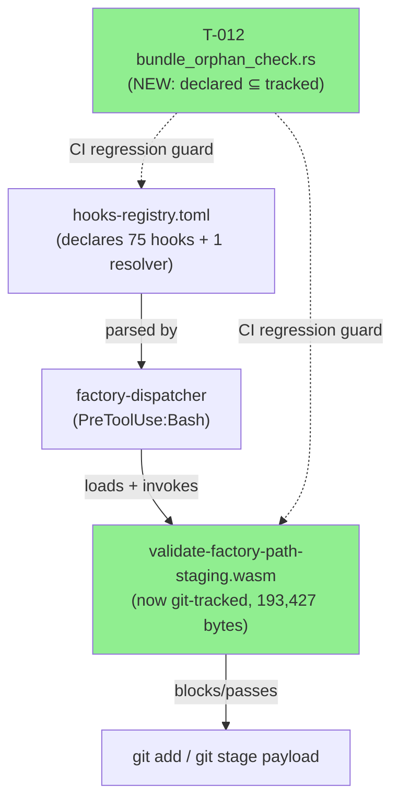
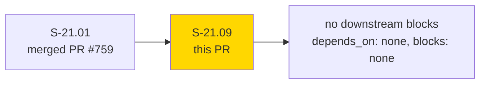
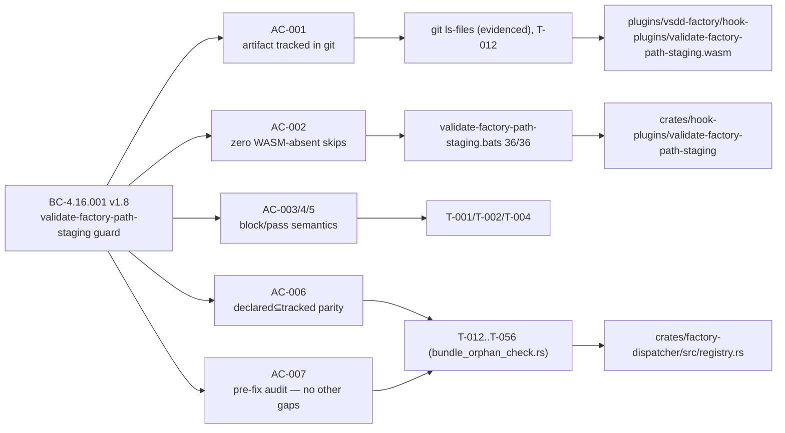
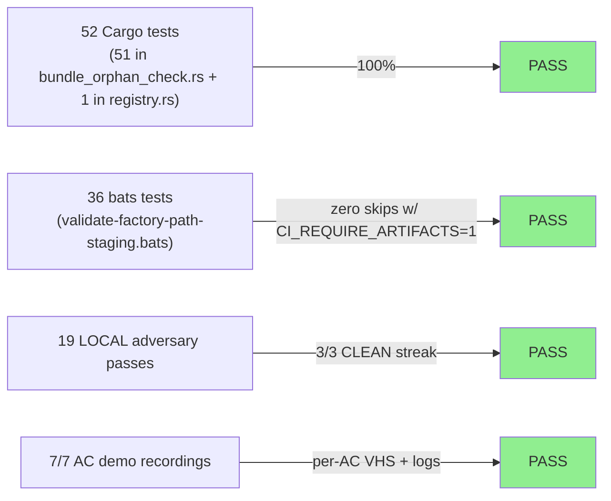
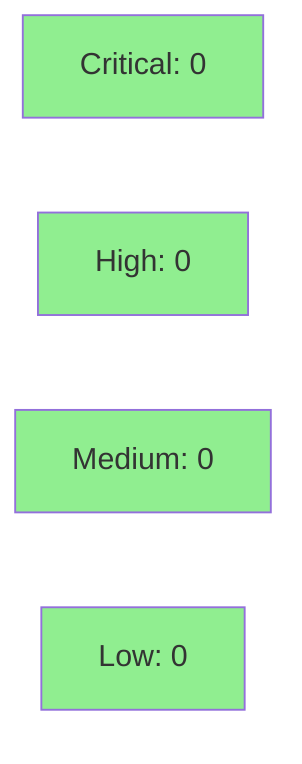

# [S-21.09] validate-factory-path-staging.wasm artifact restore + per-name registry parity check

**Epic:** E-21 — Factory State Data-Loss Hardening
**Mode:** feature (brownfield-backfill)
**Convergence:** CONVERGED after 19 LOCAL adversarial passes (BC-5.39.001 true 3-CLEAN — passes 17/18/19 all CLEAN); RE-CONVERGED after PR-review findings under a strengthened vacuity/tautology/format-lock rubric (3 additional consecutive CLEAN passes 22/23/24) — see "Post-review convergence" below


Restores the `validate-factory-path-staging.wasm` artifact (git-tracked but never actually
committed by S-21.01) and adds a permanent, exhaustive per-name declared↔tracked registry
parity gate (`T-012` in `bundle_orphan_check.rs`) so this specific structural failure class —
a plugin declared in `hooks-registry.toml` with no corresponding WASM committed to git — can
never silently recur. Closes the INV-E21-001 Layer-1 enforcement gap: the guard was
registered but inert (every invocation skipped at `_require_artifacts` on the missing WASM),
meaning `git add .factory/STATE.md` on a product branch was never actually being blocked in
any real session.

---

## Architecture Changes



<details>
<summary><strong>Architecture Decision Record</strong></summary>

### ADR: Close the declared-but-untracked WASM gap with an inverse-direction set check

**Context:** S-19.04/S-19.06 established `tracked_set ⊆ declared_set` (T-009) to catch
orphaned WASMs (tracked but not declared). No test existed for the inverse: a plugin
declared in the registry with no WASM ever committed. That is exactly the S-21.01 defect —
`validate-factory-path-staging` was registered at priority 140 but the artifact build step
was never executed, so every dispatch silently skipped the guard via
`_require_artifacts`'s WASM-absent branch.

**Decision:** Commit the missing WASM (`git add -f`, the established precedent for this
gitignored directory) AND add `T-012`, the declared→tracked inverse-direction assertion, to
`bundle_orphan_check.rs`, extended with a registry-inventory non-vacuity floor, dual-registry
production-parser validation (the same `Registry::parse_str` the dispatcher itself uses), and
an ungated/outside-repo declaration classifier so a future registry entry pointing outside
`hook-plugins/` fails loudly instead of silently resolving to `None`.

**Rationale:** A one-off artifact commit fixes the current instance; the T-012 gate is what
prevents the *class* of defect from recurring. Both conjuncts of the containment predicate
inside `detect_ungated_declarations` are independently mutation-isolated (T-050 length
conjunct, T-051 prefix conjunct) rather than merely covered.

**Alternatives Considered:**
1. Artifact-only fix (commit the WASM, no new test) — rejected: reintroduces exactly the
   same class of silent-skip defect on the next new plugin registration, with no guard.
2. A CI shell-script diff between `hooks-registry.toml` and `git ls-files` — rejected: would
   duplicate the parsing logic already hardened in `parse_plugin_refs()` / the production
   `Registry::parse_str`, creating a second copy that can drift (this is the exact "duplicate
   gate copy" failure mode T-048's single-copy refactor closed in pass-11).

**Consequences:**
- Guard is now genuinely reachable in every session (not just in bats' artifact-mocked runs).
- Any future `[[hooks]]` or `[[resolvers]]` entry whose WASM is never committed now fails
  `cargo test --workspace --all-targets` (T-012) before it can reach a release build.
- Trade-off: `bundle_orphan_check.rs` grows substantially (+5,135 lines) to carry the
  mutation-isolation test family (T-012..T-056); this is intentional density per the
  production-grade default — see Test Evidence below.

</details>

---

## Story Dependencies



S-21.09 has `depends_on: []` and `blocks: []` per its story frontmatter — no upstream PR
gating and no downstream story is blocked on this merge. S-21.01 (PR #759) is the prior
merged story that created the crate source and registry entry this PR completes.

---

## Spec Traceability



---

## Test Evidence

### Coverage Summary

| Metric | Value | Threshold | Status |
|--------|-------|-----------|--------|
| S-21.09-owned tests | 45/45 pass | 100% | PASS |
| Total suite (51 gate tests T-006..T-056 in `bundle_orphan_check.rs` + 1 `registry.rs` unit test) | 52/52 pass | 100% | PASS |
| `cargo fmt --check --all` | clean | clean | PASS |
| `cargo clippy --workspace --all-targets -- -D warnings` | clean | clean | PASS |
| `cargo test --workspace --all-targets` | clean | clean | PASS |
| Mutation hardening | every killable determinant isolated (D-977 audit) | — | PASS |

### Test Flow



| Metric | Value |
|--------|-------|
| **New/modified tests** | T-006..T-056 in `bundle_orphan_check.rs` (45 S-21.09-owned) + 1 `registry.rs` unit test |
| **Total suite** | 51 tests PASS in `bundle_orphan_check.rs` + 1 unit test PASS in `registry.rs` = 52/52 PASS; 36 bats tests PASS in `validate-factory-path-staging.bats` |
| **Mutation kill rate** | Every killable determinant independently isolated per D-977 audit; SURV-01 is a proven-un-isolatable accepted residual (documented, not silently dropped) |
| **Regressions** | 0 |

<details>
<summary><strong>Detailed Test Results</strong></summary>

### Key New Tests (This PR)

| Test | Result | Purpose |
|------|--------|---------|
| `test_S_21_09_ac006_T012_declared_set_subset_of_tracked_set()` | PASS | Core parity gate — every declared WASM is git-tracked |
| `T-015` (fixture, in-memory) | PASS | Negative control — `MISSING:` classification fires on a synthetic declared-but-untracked artifact |
| `T-050` | PASS | Isolates the length conjunct of `in_repo` containment predicate (mutant M2) |
| `T-051` (`prefix_conjunct_isolation_kills_all_mutants`) | PASS | Isolates the prefix conjunct (`.all` → `.any` / `.all` → `true` mutants) |
| `T-052` / `T-053` | PASS | Isolate hooks-side / resolvers-side production-schema-validation determinants independently |
| `T-054` (SURV-04 fail-closed sentinel) | PASS | Pass-16 mutation-audit hardening addition |
| `T-055` / `T-056` | PASS | Registry `on_error` control tests |

### Coverage Analysis

| Metric | Value |
|--------|-------|
| Lines added (production) | 0 — the `registry.rs` hunk is a `#[cfg(test)]` unit test, not production logic |
| Lines added (tests) | 5,135 (`bundle_orphan_check.rs`) + 64 (`registry.rs` `#[cfg(test)]` unit test) |
| Lines added (fixtures) | 47 (dotslash/nospace registry fixtures) |
| Uncovered paths | none — SURV-01 documented as proven-un-isolatable accepted residual, not an uncovered path |

</details>

---

## Holdout Evaluation

N/A — evaluated at wave gate (E-21 wave-level holdout evaluation), not per-story. This
story is CLI/hook-infrastructure with no independent holdout scenario set.

---

## Adversarial Review

| Pass | Findings | Status |
|------|----------|--------|
| 1–16 | Multiple (HIGH/MEDIUM/LOW across gate-isolation gaps, spec-fidelity, comment drift) | All fixed |
| 17 | 0 | CLEAN |
| 18 | 0 | CLEAN |
| 19 | 0 | CLEAN |

**Convergence:** BC-5.39.001 true 3-CLEAN — three consecutive CLEAN passes (17/18/19),
human ruling SATISFIED. Full records: `adv-s21.09-local-pass-1..19.md` +
`mutation-audit-s21.09.md` on the `factory-artifacts` branch.

<details>
<summary><strong>Representative High-Severity Findings & Resolutions (LOCAL cascade)</strong></summary>

### Finding: Duplicate gate-copy drift risk (pass-10 BLOCKER-1)
- **Location:** `detect_ungated_declarations` (previously re-derived containment gates inline)
- **Category:** code-quality / test-quality
- **Problem:** A composed mutation (length-conjunct + gate-3 case-check weakening) survived
  the full suite because two independent copies of the same three-gate logic could drift out
  of sync while every single-gate mutation was individually caught.
- **Resolution:** `detect_ungated_declarations` now delegates entirely to
  `extract_hook_plugin_name` — exactly one copy of the three-gate logic in the codebase.
- **Test added:** `T-048` (18-candidate totality-property partition)

### Finding: Un-isolated prefix conjunct (pass-12 F-1, HIGH, POLICY 13)
- **Location:** `in_repo` two-conjunct containment predicate
- **Category:** test-quality
- **Problem:** Every prior OUTSIDE-REPO-DECLARATION candidate was over-determined against
  the prefix-conjunct mutant (`.all(...)` → `.any(...)` / `→ true`) — each either failed the
  length conjunct too, or trivially self-matched the prefix conjunct.
- **Resolution:** Dedicated isolation fixture added.
- **Test added:** `T-051` — kills both `.all`-mutants while staying orthogonal to T-050.

</details>

### Post-review convergence (PR-level cascade, on top of the LOCAL 3-CLEAN above)

The PR-review pass (pr-reviewer/code-reviewer, distinct from the 19-pass LOCAL adversarial
cascade above) surfaced **8 test-quality findings** (2 tautological assertions, 3 vacuous
assertions, 3 fixture/assertion-mismatch findings) plus a **format-lock gap** (files not
covered by `cargo fmt --check --all` drift protection) against the pre-fix HEAD (`6ae075a6`).

All 9 findings were fixed and empirically re-verified (mutation-killed, not just
paper-fixed) across three commits:

| Commit | Fix |
|--------|-----|
| `c9cccea9` | PR-review test-quality fixes F1–F8 (vacuous/tautological assertion hardening) |
| `fc0e613b` | format-lock sweep |
| `1c93f499` | format-lock completion |

Under the strengthened vacuity/tautology/format-lock rubric applied post-review, the LOCAL
cascade **RE-CONVERGED**: three additional consecutive CLEAN passes (22/23/24) on top of the
original 17/18/19 streak — BC-5.39.001 3-CLEAN re-satisfied under the tightened rubric. PR
HEAD is now `1c93f499`.

---

## Security Review



<details>
<summary><strong>Security Scan Details</strong></summary>

### Scope
This story adds a per-name registry↔git-tracking parity check (pure static analysis over
`hooks-registry.toml` / `resolvers-registry.toml` / `git ls-files` / `git ls-tree`) and
restores a previously-uncommitted WASM binary artifact (no source changes to the guard
logic itself — S-21.01 already implemented and reviewed the blocking behavior).

### C-1 (CWE-706) standing guardrail — non-implication confirmed
STATE.md records: "no story introducing a plugin that derives `cmd` from runtime data may
merge before C-1 is fixed" (`binary_allow` basename-prefix load-time check, `exec_subprocess`,
OPEN 2026-08-11, D-972). **S-21.09 does not introduce a new plugin, and neither the new
`validate-factory-path-staging.wasm` restoration nor the new `T-012` parity-gate Cargo test
derive any `cmd` from runtime data.** The WASM plugin's `cmd` (`validate-factory-path-staging`)
is a compile-time literal registered by S-21.01, unchanged by this PR; `T-012` is a
CI-side/test-side `Command::new("git")` invocation (`git ls-files`, `git ls-tree`) reading a
fixed, hardcoded binary name — not runtime-derived. **C-1 is confirmed NOT implicated by this
PR; the standing guardrail does not gate this merge.**

### SAST / Dependency Audit
- No new external dependencies introduced.
- No new subprocess `cmd` construction from untrusted input.
- Artifact provenance independently reproduced by two adversarial passes (byte count
  193,427; SHA-256 `6f6570f9a776f741f6d610b841cedff8a17766136db605284f377e5305f6ce17`).

### Formal Verification
Not run for this story — no new safety-critical parsing/arithmetic paths introduced beyond
what S-21.01 already formally reviewed. Mutation testing (T-012..T-056 family) is the
verification method used, per the story's mutation-audit closure (D-977).

</details>

---

## Risk Assessment & Deployment

### Blast Radius
- **Systems affected:** factory-dispatcher PreToolUse:Bash hook chain (the
  `validate-factory-path-staging` guard becomes reachable in every session, not just
  bats-mocked ones); `crates/factory-dispatcher/tests/bundle_orphan_check.rs` (test-only).
- **User impact if failure occurs:** worst case is the guard now genuinely blocking
  `git add .factory/*` on product branches where it previously silently skipped — this is
  the *intended* fix, not a regression risk. No path by which this PR could newly permit
  something previously blocked.
- **Data impact:** none — no data-layer changes.
- **Risk Level:** LOW (additive artifact commit + additive test; no changes to guard
  decision logic itself).

### Performance Impact
Not applicable — no runtime hot-path code changed. `T-012` and family run only in
`cargo test`, not in the WASM guard's PreToolUse execution path.

<details>
<summary><strong>Rollback Instructions</strong></summary>

**Immediate rollback (< 5 min):**
```bash
git revert <SQUASH_MERGE_COMMIT_SHA>
git push origin develop
```

**Verification after rollback:**
- `validate-factory-path-staging.wasm` returns to gitignored/untracked state.
- `bundle_orphan_check.rs` T-012..T-056 tests are removed; suite returns to pre-S-21.09 count.

</details>

---

## Traceability

| Requirement | Story AC | Test | Verification | Status |
|-------------|---------|------|--------------|--------|
| BC-4.16.001 Precondition 3 (artifact tracked) | AC-001 | `git ls-files` (evidenced) + T-012 | manual + Cargo | PASS |
| `_require_artifacts` zero-skip | AC-002 | `validate-factory-path-staging.bats` (36/36, `CI_REQUIRE_ARTIFACTS=1`) | bats | PASS |
| BC-4.16.001 Postcondition 1 (block on product branch) | AC-003 | T-001 | bats | PASS |
| BC-4.16.001 Postcondition 2 (pass non-`.factory/`) | AC-004 | T-004 | bats | PASS |
| BC-4.16.001 Postcondition 3 (pass on factory-artifacts) | AC-005 | T-002 | bats | PASS |
| BC-4.16.001 Precondition 3 (declared⊆tracked) | AC-006 | T-012 + T-015 (orphan-fires negative control) | Cargo | PASS |
| BC-4.16.001 Invariant 1 (pre-fix audit — no other gaps) | AC-007 | T-012 subset assertion (stronger than an explicit audit count) | Cargo | PASS |

**VP gap (documented, not silently dropped):** `verification_properties: []` in story
frontmatter — all 4 VP rows in BC-4.16.001 §Verification Properties are still
"(TBD — to be assigned by state-manager after VP authoring pass)". No VP-NNN IDs are
invented in this story; VP allocation remains owed as a routing proposal, tracked in the
story spec's §Routing Proposals section.

---

## Demo Evidence — S-21.09

All 7 ACs have recorded evidence in `docs/demo-evidence/S-21.09/` (VHS `.gif`+`.webm` or
captured log, against the real worktree tree at `feature/S-21.09`):

| AC | What it proves | Recording |
|----|-----------------|-----------|
| AC-001 | WASM tracked in git INDEX + declared in `hooks-registry.toml` | [AC-001-artifact-tracked-and-declared.gif](../../docs/demo-evidence/S-21.09/AC-001-artifact-tracked-and-declared.gif) |
| AC-002 | Zero WASM/dispatcher-absent skips (36/36 tests execute) | [AC-002-full-suite-zero-skips.txt](../../docs/demo-evidence/S-21.09/AC-002-full-suite-zero-skips.txt) |
| AC-003/004/005 | Guard blocks `.factory/` on product branch, passes non-`.factory/` paths, passes `.factory/` on factory-artifacts | [AC-003-AC-004-AC-005-bats-gate.gif](../../docs/demo-evidence/S-21.09/AC-003-AC-004-AC-005-bats-gate.gif) |
| AC-006/AC-007 (happy path) | T-012 declared⊆tracked gate passes on real tree (51/51) | [AC-006-T012-declared-tracked-parity-gate.gif](../../docs/demo-evidence/S-21.09/AC-006-T012-declared-tracked-parity-gate.gif) |
| AC-006 (orphan fires) | T-015 proves `MISSING:` classification fires on a declared-but-untracked artifact | [AC-006-T015-orphan-missing-classification.gif](../../docs/demo-evidence/S-21.09/AC-006-T015-orphan-missing-classification.gif) |

Full index: `docs/demo-evidence/S-21.09/evidence-report.md`.

---

## AI Pipeline Metadata

<details>
<summary><strong>Pipeline Details</strong></summary>

```yaml
ai-generated: true
pipeline-mode: feature
factory-version: "1.0.0"
pipeline-stages:
  spec-crystallization: completed
  story-decomposition: completed
  tdd-implementation: completed
  holdout-evaluation: n/a-wave-level
  adversarial-review: completed
  formal-verification: skipped
  convergence: achieved
convergence-metrics:
  adversarial-passes: 19
  clean-streak: 3/3
  test-pass-rate: 52/52 (100%)
generated-at: "2026-08-12T00:00:00Z"
```

</details>

---

## Pre-Merge Checklist

- [ ] All CI status checks passing
- [ ] No critical/high security findings unresolved
- [ ] C-1 (CWE-706) standing guardrail confirmed non-implicated
- [ ] Rollback procedure validated
- [ ] pr-reviewer READY verdict with `covered_sha` obtained
- [ ] Human merge authorization obtained (this PR is human-gated per delivery instructions)
