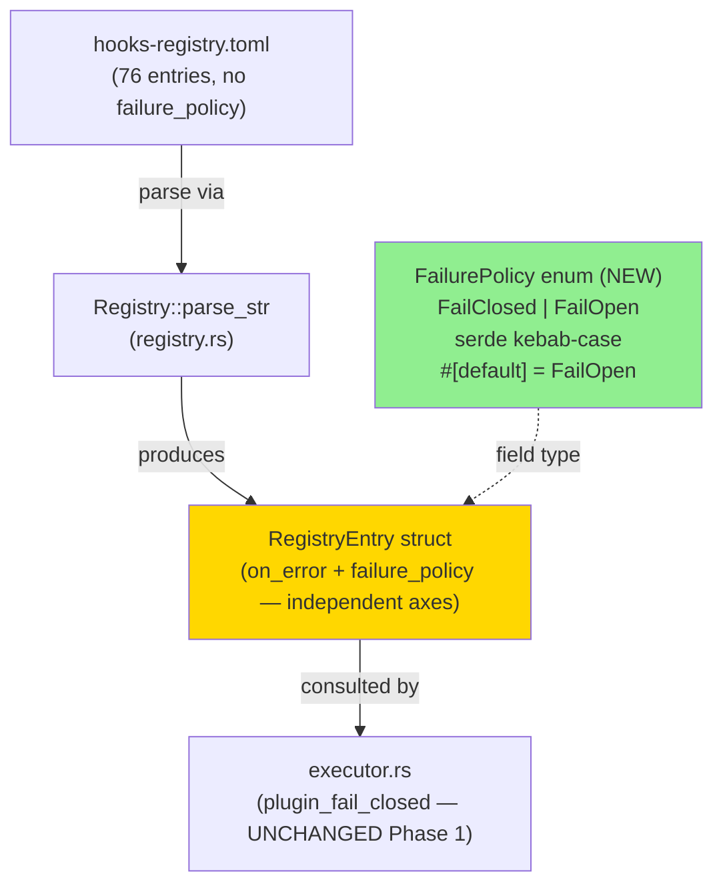
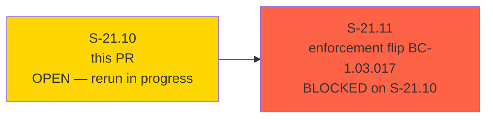
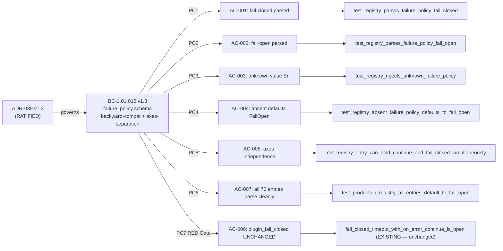
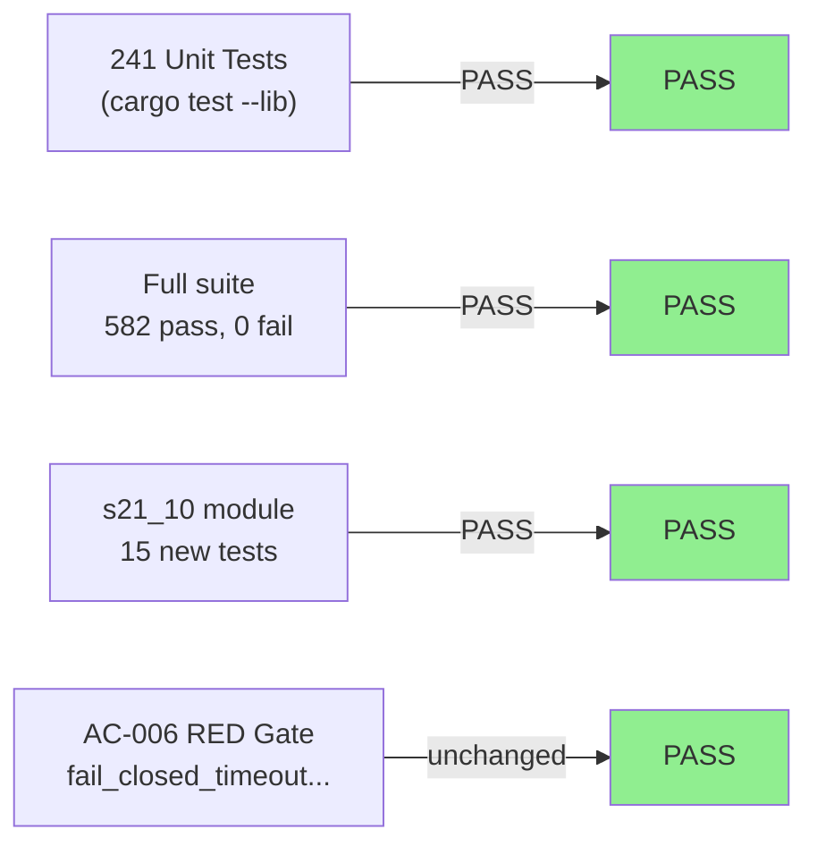
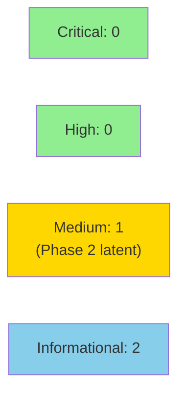

# [S-21.10] `failure_policy` dispatcher registry schema extension (ADR-039 Phase 1 — schema only, no enforcement change)

**Epic:** E-21 — Validator Failure Policy & Resource Exhaustion Hardening (Wave A, Wave 5)
**Mode:** brownfield-backfill
**Convergence:** CONVERGED — LOCAL adversary 3/3 clean passes; PR-level review cycle 2 APPROVED (cycle 1 APPROVED at `82437a64`; cycle 2 APPROVED at `e6e86ba6`)


This PR delivers **Phase 1 of ADR-039's safe migration ordering**: a new per-plugin `failure_policy` TOML field
(`"fail-closed"` | `"fail-open"`) is added to the factory-dispatcher registry schema, parsed to a new `FailurePolicy`
enum on `RegistryEntry`, and defaults to `FailurePolicy::FailOpen` when absent (preserving backward compatibility
with all 76 existing plugin entries). No enforcement logic changes — the existing `plugin_fail_closed` function
in `executor.rs` is deliberately untouched. Phase 3+4 enforcement (the actual fail-closed flip for exhaustion
outcomes) is deferred to S-21.11 (BC-1.03.017), which is blocked on this PR. This schema extension is safe to
ship independently because no plugin's block/allow enforcement decision changes until S-21.11.

**Root cause addressed:** Adversarial pass-7 of S-21.07 raised F-S2107-P7-010 (HIGH) and F-S2107-P7-011 (HIGH) —
WASM validator plugins fail open on fuel exhaustion because `plugin_fail_closed` returns `false` for
`Timeout { cause: TimeoutCause::Fuel }` when `on_error = OnError::Continue`. The enforcement defect is
CWE-636 (No Explicit Resolution of Security-Critical Condition) + CWE-390 (Detection of Error Condition Without Action).
ADR-039 §Decision 1 rules that the correct fix is a new orthogonal `failure_policy` axis, not resemanticization
of `on_error`.

---

## Architecture Changes



<details>
<summary><strong>Architecture Decision Record — ADR-039 v1.3 (RATIFIED)</strong></summary>

### ADR-039: Validator failure policy for resource exhaustion

**Context:** WASM plugins that exhaust their fuel budget (`TimeoutCause::Fuel`) or epoch deadline
(`TimeoutCause::Epoch`) currently fail open because the existing `on_error` field only governs crash outcomes.
The `plugin_fail_closed` path returns `false` for exhaustion when `on_error = OnError::Continue`, which is the
correct behavior for the `on_error` axis but wrong for resource-exhaustion security policy.

**Decision 1:** `failure_policy` and `on_error` are separate, orthogonal axes. `on_error` governs plugin crashes
and host-side invocation errors. `failure_policy` governs resource exhaustion (`TimeoutCause::Fuel`,
`TimeoutCause::Epoch`). These MUST NOT be collapsed.

**Decision 2:** Per-plugin `failure_policy` field in `hooks-registry.toml`. Two accepted values:
`"fail-closed"` and `"fail-open"` (kebab-case; underscore forms are `Err` at parse time). Absent field
defaults to `fail-open` (backward-compat).

**Decision 3:** Safe migration ordering — Phase 1 (schema extension, no enforcement change) MUST ship
before Phase 4 (the enforcement flip). The self-lock hazard (existing `lessons.md` exhausting 10M fuel
budget during PostToolUse validation) means that any premature enforcement flip without calibrated
per-plugin caps would hard-block all `.factory/` writes.

**Rationale:** Axis separation prevents the footgun of resemanticizing `on_error = "block"` to also
govern exhaustion outcomes — a plugin may deliberately have `on_error = "continue"` (crash advisory)
AND `failure_policy = "fail-closed"` (exhaustion hard-block). Conflation destroys this expressiveness.

**Alternatives Considered:**
1. Resemanticize `on_error = "block"` to also cover exhaustion — rejected: destroys axes independence;
   forces plugin authors to couple crash policy with exhaustion policy
2. Global `[defaults] failure_policy` in hooks-registry.toml — rejected: ADR-039 §Decision 2 per-plugin
   granularity; global defaults would require a `[defaults]` TOML section out of Phase 1 scope

**Consequences (positive):** Schema is forward-compatible; Phase 4 enforcement flip (S-21.11) requires
no schema migration. All existing entries parse cleanly. Phase 1 is deploy-safe.

**Consequences (negative):** Absent-annotation = fail-open footgun remains a residual risk until Phase 4
deploys for authorization-class validators. Follow-up hardening story S-21.16 cited.

</details>

---

## Story Dependencies



**Upstream dependencies:** None (`depends_on: []`)
**Blocks:** S-21.11 (Phase 3+4 enforcement flip; BC-1.03.017; cannot proceed until this PR merges)

---

## Spec Traceability



### AC Coverage Matrix

| AC | BC Clause | Test Name | Result |
|----|-----------|-----------|--------|
| AC-001 | PC1 | `test_registry_parses_failure_policy_fail_closed` | PASS — GREEN-BY-DESIGN (serde kebab-case) |
| AC-002 | PC2 | `test_registry_parses_failure_policy_fail_open` | PASS — GREEN-BY-DESIGN |
| AC-003 | PC3 + EC-001/002/003 | `test_registry_rejects_unknown_failure_policy` + `test_failure_policy_rejects_underscore_form` + EC-001/002 variants | PASS — serde rejects at parse time |
| AC-004 | PC4 | `test_registry_absent_failure_policy_defaults_to_fail_open` | PASS — `#[serde(default)]` + `#[default]` on FailOpen |
| AC-005 | PC5 | `test_registry_entry_can_hold_continue_and_fail_closed_simultaneously` | PASS — independent fields in RegistryEntry |
| AC-006 | PC7 RED Gate | `fail_closed_timeout_with_on_error_continue_is_open` (existing, unmodified) | PASS — plugin_fail_closed signature/body unchanged |
| AC-007 | PC6 | `test_production_registry_all_entries_default_to_fail_open` | PASS — all 76 entries → FailOpen; zero FailClosed |

**Edge cases covered:** EC-001 (wrong case `"FAIL-CLOSED"` → Err), EC-002 (empty string → Err),
EC-003 (underscore `"fail_closed"` → Err — the critical kebab-vs-snake guard; the REAL hazard is copying
sibling `OnError`'s `snake_case` annotation), EC-004 (duplicate TOML key — TOML-parser-layer, not registry),
EC-005 (`on_error=block` + `failure_policy=fail-open` coexist), EC-006 (`on_error=continue` +
`failure_policy=fail-closed` coexist), EC-007 (all 76 production entries → FailOpen).

---

## Test Evidence

### Coverage Summary

| Metric | Value | Threshold | Status |
|--------|-------|-----------|--------|
| `cargo test -p factory-dispatcher` (unit + integration) | 582 pass, 0 fail | 100% | PASS |
| New `s21_10_bc_1_01_016_failure_policy` module | 15 tests, 0 fail | 100% | PASS |
| Unit tests (lib only, `--lib`) | 241 pass, 0 fail | 100% | PASS |
| AC-006 RED Gate (`fail_closed_timeout_with_on_error_continue_is_open`) | PASS unmodified | must pass | PASS |
| POLICY 21 gate (no new .sh files) | 0 new `.sh` files | 0 | PASS |
| `cargo fmt --check --all` | clean | clean | PASS |
| `cargo clippy --workspace --all-targets -- -D warnings` | 0 warnings | 0 warnings | PASS |



<details>
<summary><strong>Detailed Test Results — s21_10 module (15 tests)</strong></summary>

| Test | AC / PC | Result |
|------|---------|--------|
| `test_registry_parses_failure_policy_fail_closed` | AC-001 / PC1 | PASS |
| `test_registry_parses_failure_policy_fail_open` | AC-002 / PC2 | PASS |
| `test_registry_rejects_unknown_failure_policy` | AC-003 / PC3 | PASS |
| `test_failure_policy_rejects_underscore_form` (EC-003) | PC3 + EC-003 | PASS |
| EC-001 wrong-case variant | EC-001 | PASS |
| EC-002 empty string variant | EC-002 | PASS |
| `test_registry_absent_failure_policy_defaults_to_fail_open` | AC-004 / PC4 | PASS |
| `test_registry_entry_can_hold_continue_and_fail_closed_simultaneously` | AC-005 / PC5 | PASS |
| EC-005 `on_error=block` + `fail-open` coexist | EC-005 | PASS |
| EC-006 `on_error=continue` + `fail-closed` coexist | EC-006 | PASS |
| `test_..._phase1_failure_policy_does_not_affect_on_error_accessor` | PC7 scope guard | PASS |
| `test_production_registry_all_entries_default_to_fail_open` | AC-007 / PC6 | PASS |
| Additional EC-007 spot-check variants | EC-007 | PASS |

**Sibling-sweep (TD-VSDD-060):** All 7 `RegistryEntry` struct-literal construction sites updated
across 6 files (`executor.rs`, `partition.rs`, `async_partition_integration.rs`,
`executor_integration.rs`, `executor_resolver_integration.rs`, `full_stack_plugin_invocation.rs`,
`resolver_error_isolation_test.rs`). Clean compile confirms completeness.

</details>

---

## Demo Evidence

**N/A — pure Rust schema extension; no user-facing interaction surface.**

S-21.10 is a pure schema extension to an internal Rust library crate
(`crates/factory-dispatcher`). It adds one enum type and one struct field to the
TOML parsing layer. There is no CLI output, browser UI, terminal interaction, or
observable runtime behavior change for any user or operator in Phase 1. Demo
recordings (VHS terminal / Playwright browser) are not applicable.

**AC coverage verification method:** All 7 ACs are verified by the cargo test suite
(`cargo test -p factory-dispatcher`, 582 pass). The `test_production_registry_all_entries_default_to_fail_open`
test (AC-007) drives the real `plugins/vsdd-factory/hooks-registry.toml` through the
updated registry loader as the functional evidence equivalent.

---

## Holdout Evaluation

N/A — evaluated at wave gate (E-21 Wave A; holdout evaluation not yet dispatched for this wave).

---

## Adversarial Review

| Level | Passes | Findings | Blocking | Status |
|-------|--------|----------|----------|--------|
| LOCAL (story-level) | 3/3 | Multiple across cycles | 0 remaining | CONVERGED (3-CLEAN) |
| PR-level (pr-reviewer) | 2 cycles | Cycle 1: code-review FINDING 1+2 (non-blocking) | 0 blocking | APPROVED at `e6e86ba6` |

**LOCAL adversary convergence:** BC-5.39.001 3-CLEAN protocol — 3 consecutive clean passes achieved.
**PR reviewer verdict:** APPROVE — covered_sha `e6e86ba61598a0aebac9504648d03e5af90530a2` (see `pr-review.md`).

<details>
<summary><strong>PR Review Findings & Resolutions</strong></summary>

### Cycle 1 Finding 1: `FailurePolicy` not re-exported from crate root (`lib.rs`)
- **Severity:** Non-blocking (code-review FINDING 1)
- **Problem:** `FailurePolicy` was accessible as `crate::registry::FailurePolicy` but not re-exported
  alongside its siblings (`OnError`, `RegistryEntry`) in the `pub use registry::{...}` block in `lib.rs`.
  S-21.11 enforcement consumers will need `FailurePolicy::FailClosed` at the public crate path.
- **Resolution:** Commit `e6e86ba6` adds `FailurePolicy` to `pub use registry::{...}` in alphabetical
  position (`ExecSubprocessCaps, FailurePolicy, OnError`). Story spec v1.7 records this in File Structure.

### Cycle 1 Finding 2: Test-module comment scope for EC-004
- **Severity:** Non-blocking (code-review FINDING 2)
- **Problem:** The `s21_10_bc_1_01_016_failure_policy` test module header claimed coverage for
  "EC-001..EC-006" but EC-004 (duplicate TOML key = TOML-parser-layer concern, not registry) is not
  and should not be covered by registry unit tests.
- **Resolution:** Commit `e6e86ba6` corrects the comment to "EC-001..EC-003, EC-005..EC-007; EC-004
  (duplicate key) is a TOML-parser-layer concern."

</details>

---

## Security Review

**Verdict: PASS_WITH_OBSERVATIONS** — 0 CRITICAL, 0 HIGH, 1 MEDIUM (Phase 2 risk registration), 2 INFORMATIONAL.
Full report: `.factory/code-delivery/S-21.10/security-review.md`.



**Semgrep SAST (CI):** PASSING (run 32033793847, conclusion=success). No findings reported.

<details>
<summary><strong>Security Scan Details</strong></summary>

### SAST (Semgrep)
- CI job `SAST (Semgrep)`: SUCCESS on both run 31983867899 and rerun 32033793847
- No critical, high, medium, or low SAST findings reported by CI

### Manual Security Review — `vsdd-factory:security-reviewer`

**SEC-001 (MEDIUM — CWE-636, OWASP A05:2021 Security Misconfiguration):** `FailurePolicy::FailOpen`
as the serde default creates a Phase 2 security footgun. All existing plugins in `hooks-registry.toml`
that omit `failure_policy` will silently inherit `FailOpen` when Phase 2 enforcement lands. In Phase 1
this is **latent** (no enforcement path exists; `plugin_fail_closed()` is untouched). Proposed
mitigation at Phase 2: explicit migration guide; consider registry-load warning when `on_error = "block"`
is present but `failure_policy` is absent. Does NOT block this PR.

**SEC-002 (INFORMATIONAL — CWE-20):** TOML deserialization input validation is adequate. Serde rejects
unknown variants at parse time; same pattern as `OnError`. No action required.

**SEC-003 (INFORMATIONAL — CWE-749 N/A):** Public API surface expansion (`FailurePolicy` re-exported
from `lib.rs`) is consistent with existing crate design. No security issue.

### Phase 1 ADR-039 boundary confirmation
`plugin_fail_closed()` in `executor.rs` takes `on_error: OnError` — structurally independent of the
new `failure_policy` field. No call path passes `FailurePolicy` to any gate decision function in Phase 1.
The `failure_policy` value is parsed and stored but not consulted. Phase 1 boundary is structurally
guaranteed, not merely procedural.

### Injection, DoS, Auth/Authz, InfoDisc, Crypto, Dependency
- **Injection (CWE-78/89/22):** Not applicable — parsed enum never passed to subprocess, path, or query.
- **DoS (CWE-400):** Malformed TOML produces `RegistryError::Toml` at load time (fail-closed); no amplification.
- **Auth bypass (CWE-285):** Not applicable in Phase 1 — `plugin_fail_closed()` is independent of `failure_policy`.
- **Info disclosure (CWE-200):** `RegistryError` variants do not expose sensitive runtime data.
- **Cryptographic misuse:** No crypto added or modified.
- **New dependencies:** None introduced.

</details>

---

## Risk Assessment & Deployment

### Blast Radius
- **Systems affected:** `factory-dispatcher` crate; TOML parsing of `hooks-registry.toml` on every
  dispatcher startup
- **User impact:** None in Phase 1 — `plugin_fail_closed` behavior is unchanged; no plugin changes its
  block/allow decision
- **Data impact:** None — no data written; pure in-memory struct field addition
- **Risk Level:** LOW (schema-only; backward-compat default; no enforcement change; zero behavior delta
  for all existing 76 plugin entries)

### Performance Impact
| Metric | Before | After | Delta | Status |
|--------|--------|-------|-------|--------|
| Registry parse | baseline | +1 field deserialization per entry | <1 μs per entry | OK |
| Memory per `RegistryEntry` | baseline | +1 byte (`FailurePolicy` is a `Copy` enum with 2 variants) | negligible | OK |
| `plugin_fail_closed` execution | unchanged | unchanged | 0 | OK |

<details>
<summary><strong>Rollback Instructions</strong></summary>

**Immediate rollback (< 5 min):**
```bash
git revert e6e86ba61598a0aebac9504648d03e5af90530a2
git push origin develop
```

**Verification after rollback:**
- `cargo test -p factory-dispatcher` should pass (all 582 - 15 new = 567 tests)
- `hooks-registry.toml` continues to parse without `failure_policy` field — no change needed

**Note:** Rollback removes the prerequisite for S-21.11. S-21.11 must remain queued until this
PR re-merges after rollback resolution.

</details>

### Feature Flags
| Flag | Controls | Default |
|------|----------|---------|
| (none) | This PR ships no feature flags. The `failure_policy` field is opt-in per-plugin; absent-field = fail-open default. | N/A |

---

## CI Status

**Latest CI run:** `32033793805` (rerun triggered 2026-08-17)

| Job | Status | Note |
|-----|--------|------|
| `validate` | SUCCESS | |
| `SAST (Semgrep)` | SUCCESS | |
| `policy-15-attestation-location` | SUCCESS | |
| `attestation-gate-non-vacuity-controls` | SUCCESS | |
| `platforms-drift` | SUCCESS | |
| `cargo-host (ubuntu-latest)` | SUCCESS | |
| **`cargo-host (macos-latest)`** | **IN_PROGRESS** | Rerun of timing-sensitive macOS test |
| `bats-full-suite (linux)` | SUCCESS | |
| `bats-wave-handoff (macos)` | SUCCESS | |
| `bats-darwin-leg (macos, /bin/bash 3.2)` | SUCCESS | |
| `build-dispatcher (darwin-arm64)` | SUCCESS | |
| `build-dispatcher (darwin-x64)` | SUCCESS | |
| `build-dispatcher (linux-x64)` | SUCCESS | |
| `build-dispatcher (linux-arm64)` | SUCCESS | |
| `build-dispatcher (windows-x64)` | SUCCESS | |
| `Reject release/* PRs not targeting main` | SKIPPED | Expected (not a release branch) |

**macOS CI note:** The `cargo-host (macos-latest)` job failed in the prior run
(31983867895) with `test_e2e_BC_1_14_001_async_block_verdict_discarded` →
`join did not panic: Elapsed(())` — a timing-sensitive async e2e test, macOS-only,
ubuntu green. This failure is unrelated to the S-21.10 schema changes; the test exercises
`BC-1.14.001` async block-verdict behavior in a different subsystem. A rerun has been triggered
(run 32033793805); the job is IN_PROGRESS. Merge is blocked pending this rerun completing with
a SUCCESS conclusion.

---

## Traceability

| Requirement | Story AC | Test | Verification | Status |
|-------------|---------|------|-------------|--------|
| BC-1.01.016 PC1 | AC-001 | `test_registry_parses_failure_policy_fail_closed` | serde unit | PASS |
| BC-1.01.016 PC2 | AC-002 | `test_registry_parses_failure_policy_fail_open` | serde unit | PASS |
| BC-1.01.016 PC3 | AC-003 | `test_registry_rejects_unknown_failure_policy` + EC-001/002/003 | serde unit | PASS |
| BC-1.01.016 PC4 | AC-004 | `test_registry_absent_failure_policy_defaults_to_fail_open` | serde unit | PASS |
| BC-1.01.016 PC5 | AC-005 | `test_registry_entry_can_hold_continue_and_fail_closed_simultaneously` | serde unit | PASS |
| BC-1.01.016 PC6 | AC-007 | `test_production_registry_all_entries_default_to_fail_open` | integration (real hooks-registry.toml) | PASS |
| BC-1.01.016 PC7 (RED Gate) | AC-006 | `fail_closed_timeout_with_on_error_continue_is_open` (unmodified) | executor unit | PASS |
| ADR-039 §Decision 1 | axes-independence | AC-005 + axes guard test | struct field inspection | PASS |
| ADR-039 §Decision 2 | kebab-case values | EC-001/002/003 rejection tests | serde parse | PASS |
| ADR-039 §Decision 3 Phase 1 | no enforcement change | AC-006 RED Gate + scope guard | executor diff | PASS |
| POLICY 21 | no new .sh files | git diff --name-only | automated check | PASS |
| TD-VSDD-060 | sibling-sweep | 7 struct-literal sites updated | clean compile | PASS |

<details>
<summary><strong>Full VSDD Contract Chain</strong></summary>

```
ADR-039 §Decision 1+2 → BC-1.01.016 v1.3 → AC-001 → test_registry_parses_failure_policy_fail_closed → registry.rs → ADV-LOCAL-3/3-OK
ADR-039 §Decision 1+2 → BC-1.01.016 v1.3 → AC-002 → test_registry_parses_failure_policy_fail_open → registry.rs → ADV-LOCAL-3/3-OK
ADR-039 §Decision 2 → BC-1.01.016 PC3 → AC-003 → test_registry_rejects_unknown_failure_policy → registry.rs → ADV-LOCAL-3/3-OK
ADR-039 §Decision 2 (EC-003) → BC-1.01.016 EC-003 → test_failure_policy_rejects_underscore_form → registry.rs → ADV-LOCAL-3/3-OK
ADR-039 §Decision 1 backward-compat → BC-1.01.016 PC4 → AC-004 → test_absent_defaults_fail_open → registry.rs #[serde(default)] → ADV-LOCAL-3/3-OK
ADR-039 §Decision 1 axes-sep → BC-1.01.016 PC5 → AC-005 → test_continue_and_fail_closed_simultaneously → RegistryEntry struct → ADV-LOCAL-3/3-OK
ADR-039 §Decision 1 backward-compat → BC-1.01.016 PC6 → AC-007 → test_production_registry_all_entries_default_to_fail_open → hooks-registry.toml real → ADV-LOCAL-3/3-OK
ADR-039 §Decision 3 Phase 1 → BC-1.01.016 PC7 → AC-006 → fail_closed_timeout_with_on_error_continue_is_open (unchanged) → executor.rs → ADV-LOCAL-3/3-OK
```

</details>

---

## AI Pipeline Metadata

<details>
<summary><strong>Pipeline Details</strong></summary>

```yaml
ai-generated: true
pipeline-mode: brownfield-backfill
factory-version: "1.0.0-rc.23"
cycle: v1.0-brownfield-backfill
wave: E-21 Wave A (Wave 5)
pipeline-stages:
  spec-crystallization: completed (ADR-039 v1.3 RATIFIED; BC-1.01.016 v1.3; S-21.10 v1.7)
  story-decomposition: completed
  tdd-implementation: completed
  holdout-evaluation: "N/A — evaluated at wave gate"
  adversarial-review: "CONVERGED — LOCAL 3/3 clean passes; PR-level cycle 2 APPROVED"
  formal-verification: "N/A — evaluated at Phase 6 (schema extension; no complex branching)"
  convergence: achieved
convergence-metrics:
  local-adversary-streak: "3/3"
  pr-review-cycles: 2
  blocking-findings-at-merge: 0
models-used:
  builder: claude-sonnet-4-6
  adversary: (LOCAL cycle — same-session adversarial)
  pr-reviewer: vsdd-factory:pr-reviewer
  security-reviewer: vsdd-factory:security-reviewer
story-version: "1.7"
bc-version: "BC-1.01.016 v1.3"
adr-version: "ADR-039 v1.3 (RATIFIED)"
```

</details>

---

## Pre-Merge Checklist

- [x] PR description complete and structured
- [x] All ACs (AC-001 through AC-007) covered by dedicated tests
- [x] BC-1.01.016 v1.3 postconditions PC1–PC7 traced to tests
- [x] ADR-039 v1.3 (RATIFIED) — all 3 applicable decisions (1, 2, 3) traced to ACs/tests
- [x] LOCAL adversary 3/3 CONVERGED (BC-5.39.001 3-CLEAN protocol)
- [x] PR-level review APPROVED at covered_sha `e6e86ba6` (cycle 2)
- [x] 0 blocking findings at PR-level review
- [x] `cargo fmt --check --all` PASS
- [x] `cargo clippy --workspace --all-targets -- -D warnings` PASS (0 warnings)
- [x] `cargo test -p factory-dispatcher` 582 pass, 0 fail
- [x] AC-006 RED Gate (`fail_closed_timeout_with_on_error_continue_is_open`) PASS unmodified
- [x] POLICY 21 — 0 new `.sh` files
- [x] TD-VSDD-060 sibling-sweep — all 7 RegistryEntry struct-literal sites updated
- [x] No AI attribution in commits
- [x] `FailurePolicy` re-exported from `lib.rs` public API
- [x] Upstream dependencies: none (unblocked)
- [ ] **`cargo-host (macos-latest)` CI PASS** — rerun IN_PROGRESS (run 32033793805); merge blocked pending completion
- [x] Security review verdict — PASS_WITH_OBSERVATIONS (0 CRITICAL, 0 HIGH, 1 MEDIUM latent Phase 2 risk); see `.factory/code-delivery/S-21.10/security-review.md`
- [ ] Human merge authorization

**MERGE STATUS: BLOCKED** — pending (a) `cargo-host (macos-latest)` CI rerun completion and (b) human merge authorization.
