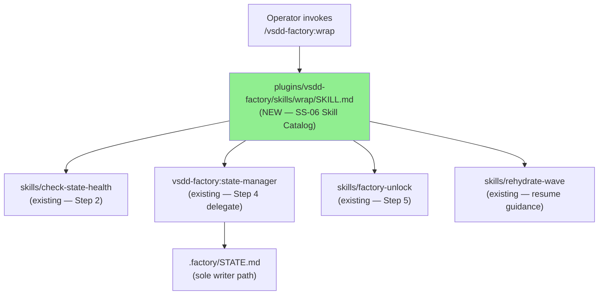
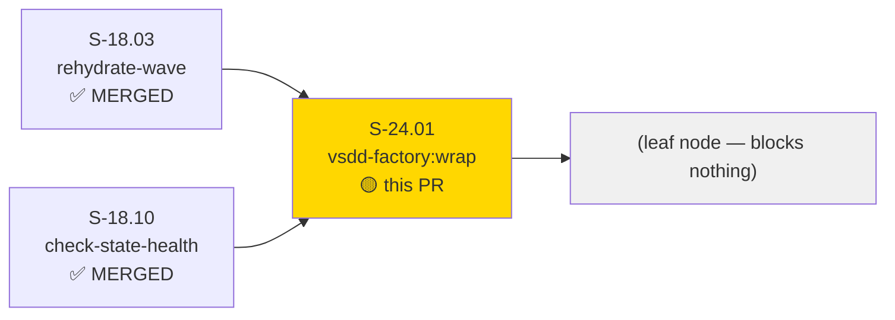
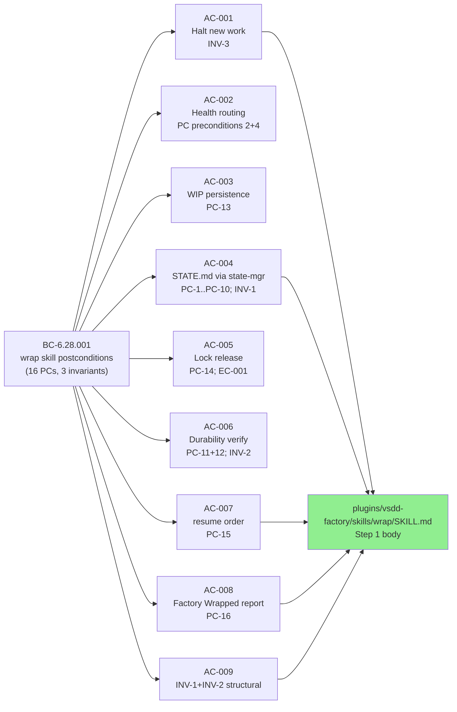
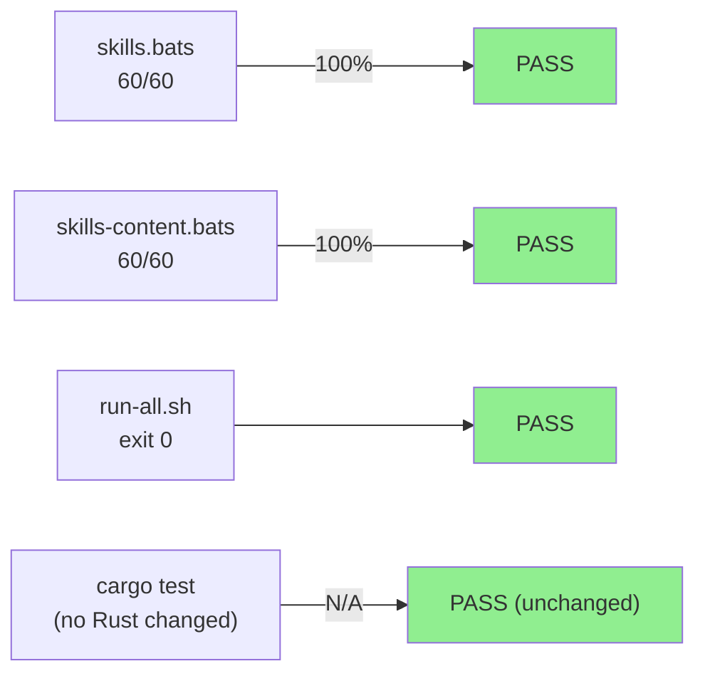
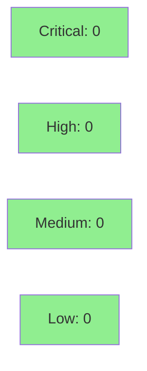

# [S-24.01] vsdd-factory:wrap — Session Pause, Checkpoint, and Lock-Release Orchestration

**Epic:** E-24 — Wrap Skill Delivery
**Mode:** feature
**Convergence:** CONVERGED after 2 adversarial passes (F5 scoped re-review; all findings closed on re-review-2)


-lightgrey)
-lightgrey)
-blue)

Delivers the `vsdd-factory:wrap` skill — a 7-step procedure document (`plugins/vsdd-factory/skills/wrap/SKILL.md`, 414 lines) that orchestrates safe factory session pause: health check, WIP persistence, STATE.md PAUSED transition via state-manager (never directly), factory lock release, durability verification (16 postconditions), and structured resume guidance. After wrap completes, the session can be `/clear`ed with zero data loss; a fresh session resumes via `/vsdd-factory:rehydrate-wave` then `/vsdd-factory:next-step`. Also adds a `[Unreleased] > Added` CHANGELOG entry. No Rust code changed; no hooks-registry changes; no plugin.json changes.

---

## Architecture Changes



<details>
<summary><strong>Architecture Decision Record</strong></summary>

### ADR: Skill auto-discovery; no plugin.json change

**Context:** Skills in this plugin are discovered from `plugins/vsdd-factory/skills/*/SKILL.md` at load time. No enumeration in `plugin.json`.

**Decision:** Create `plugins/vsdd-factory/skills/wrap/SKILL.md` only. No `plugin.json` change.

**Rationale:** 119 existing skills follow this pattern; wrap skill conforms. Plugin.json modification is an ARCH-INDEX AC-4 violation.

**Consequences:**
- Skill is immediately discoverable after plugin reload; no registry edit required.
- Single-writer discipline for STATE.md enforced: skill delegates all writes to state-manager (BC-6.28.001 INV-1).

</details>

---

## Story Dependencies



All dependencies are MERGED. S-24.01 is a leaf node in E-24.

---

## Spec Traceability



---

## Test Evidence

### Coverage Summary

| Metric | Value | Threshold | Status |
|--------|-------|-----------|--------|
| skills.bats | 60/60 pass | 100% | PASS |
| skills-content.bats | 60/60 pass | 100% | PASS |
| Full bats run-all.sh | exit 0 | exit 0 | PASS |
| Rust cargo test | unchanged (no Rust changes) | CI gate | PASS (N/A) |
| Automated wrap test harness | N/A (human-directed; tdd_mode: facade) | N/A | N/A |
| Mutation testing | N/A (no test harness; human-directed) | N/A | N/A |
| Holdout evaluation | N/A — evaluated at wave gate | N/A | N/A |

### Test Flow



| Metric | Value |
|--------|-------|
| **Files changed** | 2 (SKILL.md created, CHANGELOG.md edited) |
| **Lines added** | 420 (+414 SKILL.md, +6 CHANGELOG.md) |
| **New automated tests** | 0 (human-directed no-harness; tdd_mode: facade) |
| **Regressions** | 0 |

<details>
<summary><strong>Detailed Test Results (bats)</strong></summary>

### skills.bats and skills-content.bats

Both suites validate skill auto-discovery, frontmatter format, description presence, and content policy compliance (no `product:` literal, no author-environment leak) for ALL skills in the plugin. `vsdd-factory:wrap` is included in the 60-skill count on this branch, confirming the skill passes these structural checks.

### run-all.sh

Full integration bats suite exits 0 on the `feature/S-24.01` branch. This includes the skills scanner suites, host-abi-hygiene, stamp-state-timestamp, and all other registered bats suites.

</details>

---

## Holdout Evaluation

N/A — evaluated at wave gate. `tdd_mode: facade` (human-directed; story forbids `wrap-skill.bats`).

---

## Adversarial Review

| Pass | Model | Findings | Blocking | High | Status |
|------|-------|----------|----------|------|--------|
| 1 (F5 review) | Adversary (fresh-context) | Multiple | Yes | Multiple | Fixed (commit `299b5be1`) |
| 2 (F5 re-review) | Adversary (fresh-context) | 0 blocking | 0 | 0 | CONVERGED |

**Convergence:** All adversarial findings closed. F5 re-review-2 produced 0 blocking findings. Specific issues resolved in review cycle 1:
- PC-14 three-state lock check precision
- PC-count accuracy
- Durability-warning precision
- Verify-then-report gate completeness
- Push-failure handling
- Announce line

---

## Security Review



<details>
<summary><strong>Security Scan Details</strong></summary>

### Change Surface

- `plugins/vsdd-factory/skills/wrap/SKILL.md` — prose procedure document (Markdown). No executable code, no shell commands embedded, no secrets, no network access, no file writes (all writes delegated to state-manager agent).
- `CHANGELOG.md` — documentation-only change.

### Security Assessment

- No injection vectors: skill is a LLM-executed procedure; it invokes pre-existing skills and agents via their canonical paths.
- No credentials, tokens, or secrets in the diff.
- No OWASP Top 10 applicable categories for a Markdown procedure document.
- `cargo audit` / dependency tree: unchanged (no Rust changes, no Cargo.toml changes).

**Result: CLEAN — no security findings.**

</details>

---

## Risk Assessment & Deployment

### Blast Radius
- **Systems affected:** `plugins/vsdd-factory/skills/wrap/SKILL.md` (new file; SS-06 Skill Catalog only)
- **User impact:** Low — adds new skill; does not modify existing skills or hooks; no hook registry change; no dispatcher binary change
- **Data impact:** None — skill is a procedure document; no storage mutation at rest
- **Risk Level:** LOW

### Performance Impact

| Metric | Before | After | Delta | Status |
|--------|--------|-------|-------|--------|
| Plugin load | baseline | +1 SKILL.md auto-discovery | negligible | OK |
| Dispatcher binary | unchanged | unchanged | 0 | OK |
| CI (bats) | baseline | +skill in scanner scope | < 100ms | OK |

<details>
<summary><strong>Rollback Instructions</strong></summary>

**Immediate rollback (< 2 min):**
```bash
git revert <SQUASH_MERGE_SHA> --no-edit
git push origin develop
```

**Effect:** removes `plugins/vsdd-factory/skills/wrap/SKILL.md` and reverts the CHANGELOG.md addition. No other changes to revert.

**Verification after rollback:**
- Confirm `plugins/vsdd-factory/skills/wrap/SKILL.md` no longer exists.
- Run `cd plugins/vsdd-factory/tests && ./run-all.sh` to confirm bats suite still exits 0.

</details>

### Feature Flags
None — skill auto-discovery is always-on once the file exists.

---

## Traceability

| Requirement | Story AC | Test | Verification | Status |
|-------------|---------|------|-------------|--------|
| BC-6.28.001 INV-3 halt | AC-001 | skills-content.bats (structural) | Documentary (INV-3 body clause) | PASS |
| BC-6.28.001 PC-2/4 health routing | AC-002 | skills-content.bats | Documentary | PASS |
| BC-6.28.001 PC-13 WIP | AC-003 | skills-content.bats | Documentary | PASS |
| BC-6.28.001 PC-1..PC-10 state-mgr | AC-004 | skills-content.bats | Documentary (INV-1 body clause) | PASS |
| BC-6.28.001 PC-14 lock | AC-005 | skills-content.bats | Documentary (three-state) | PASS |
| BC-6.28.001 PC-11/12 durability | AC-006 | skills-content.bats | Documentary (INV-2 body clause) | PASS |
| BC-6.28.001 PC-15 order | AC-007 | skills-content.bats | Documentary (rehydrate-wave before next-step) | PASS |
| BC-6.28.001 PC-16 report | AC-008 | skills-content.bats | Documentary | PASS |
| BC-6.28.001 INV-1+INV-2 | AC-009 | skills-content.bats | Documentary (zero Write/Edit on STATE.md) | PASS |

<details>
<summary><strong>Full VSDD Contract Chain</strong></summary>

```
BC-6.28.001 INV-1 → AC-009 → SKILL.md Step 4 body (zero STATE.md Write/Edit) → ADV-PASS-2-CONVERGED
BC-6.28.001 INV-2 → AC-009 → SKILL.md Step 6 + Step 7 body (verify-then-report) → ADV-PASS-2-CONVERGED
BC-6.28.001 INV-3 → AC-001 → SKILL.md Step 1 body → ADV-PASS-2-CONVERGED
BC-6.28.001 PC-14 → AC-005 → SKILL.md Step 5 + PC-14 three-state check → ADV-PASS-1-FIXED → ADV-PASS-2-CONVERGED
BC-6.28.001 PC-15 → AC-007 → SKILL.md Step 7 resume block (rehydrate-wave before next-step) → ADV-PASS-2-CONVERGED
BC-6.28.001 PC-16 → AC-008 → SKILL.md Step 7 Factory Wrapped report template → ADV-PASS-2-CONVERGED
```

</details>

---

## AI Pipeline Metadata

<details>
<summary><strong>Pipeline Details</strong></summary>

```yaml
ai-generated: true
pipeline-mode: feature
factory-version: "1.0.0-rc.24"
pipeline-stages:
  spec-crystallization: completed
  story-decomposition: completed (S-24.01 v1.1)
  tdd-implementation: completed (tdd_mode: facade — human-directed no test harness)
  holdout-evaluation: N/A (evaluated at wave gate)
  adversarial-review: CONVERGED (2 passes)
  formal-verification: skipped (tdd_mode: facade; VP-TBD)
  convergence: achieved (re-review-2 clean)
convergence-metrics:
  adversarial-passes: 2
  blocking-findings-at-convergence: 0
  high-findings-at-convergence: 0
story: S-24.01 v1.1
bc: BC-6.28.001 v1.1
epic: E-24
models-used:
  builder: claude-sonnet-4-6
  adversary: fresh-context (F5 scoped)
generated-at: "2026-08-29T00:00:00Z"
```

</details>

---

## Demo Evidence

N/A — `tdd_mode: facade` (human-directed decision, 2026-08-29). The story spec explicitly forbids `tests/wrap-skill.bats` and any automated demo recording for this skill. The skill is a LLM-executed procedure document; correctness is verified documentarily by tracing each AC to a specific BC-6.28.001 postcondition or invariant clause. No demo recordings were produced; the story forbids them.

Evidence of correct implementation verified by:
- F5 scoped adversarial review (2 passes, converged at re-review-2)
- skills.bats 60/60 — confirms skill auto-discovery and frontmatter format
- skills-content.bats 60/60 — confirms no author-environment leaks, no `product:` literal
- Full `run-all.sh` exit 0

---

## Pre-Merge Checklist

- [ ] All CI status checks passing (PG-CI-3 / POLICY 22 — wait for ALL checks COMPLETED)
- [x] Skills scanner bats (skills.bats + skills-content.bats) 60/60 on branch
- [x] Full run-all.sh bats suite exit 0 on branch
- [x] No Rust changes; cargo test gate not affected
- [x] Adversarial review CONVERGED (0 blocking findings at re-review-2)
- [x] Security review CLEAN (no findings — Markdown procedure document, no code)
- [x] No forbidden files present (no wrap-skill.bats, no plugin.json edit, no Cargo.toml change)
- [x] rehydrate-wave appears before next-step in Step 7 resume block (PC-15)
- [x] Zero direct STATE.md Write/Edit instructions in SKILL.md (INV-1)
- [x] CHANGELOG.md [Unreleased] > Added entry present
- [ ] pr-reviewer APPROVE with covered_sha
- [ ] Squash-merge into develop; branch deleted
