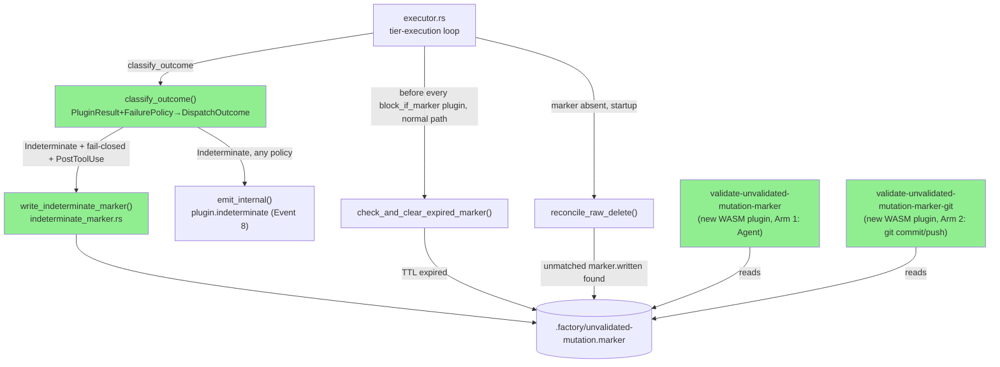
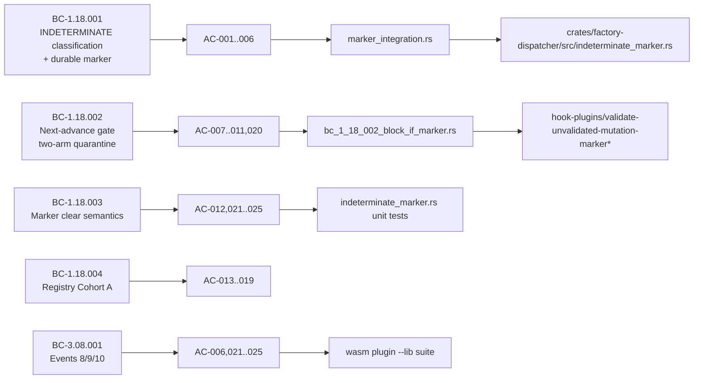

# [S-25.01] Dispatcher INDETERMINATE Outcome Layer 1 — Fail-Loud on Cannot-Complete: Durable Marker + Next-Advance Gate

**Epic:** E-25 — Validation Integrity
**Mode:** feature (brownfield-onboarding, feature-delta pipeline)
**Convergence:** CONVERGED (asymptotic 3-CLEAN) after 18 LOCAL fresh-context adversarial passes


Makes "couldn't validate" (WASM fuel exhaustion, epoch timeout, `OutputTooLarge`) a first-class,
fail-**LOUD** outcome instead of a silent CWE-754 misclassification as PASS. For fail-closed
plugins, the dispatcher now has the machinery to write a durable
`.factory/unvalidated-mutation.marker` and block the next state-advancing `Agent` dispatch and
`git commit`/`git push` `Bash` dispatch until the affected artifact is re-validated or an operator
explicitly clears the marker — Layer 1 of the three-layer validation-integrity architecture
(ADR-047 v1.4, human-ratified).

**Activation status: ZERO production enforcement effect today.** All three Cohort A fail-closed
validators (`validate-factory-path-staging`, `validate-pr-merge-prerequisites`,
`validate-wave-gate-prerequisite`) run **PreToolUse**, but the marker-write path
(`write_indeterminate_marker`) fires only on **PostToolUse** — so none of them can currently
produce a marker, and the block-gate never engages. `validate-factory-path-staging` additionally
runs with its own `on_error = "continue"` and is not on the ADR-039 activation roadmap. The
marker→gate machinery itself (write/clear/TTL/reconcile, both gate arms, Events 8/9/10) is fully
unit- and integration-tested and code-reachable — it is correct, complete Layer-1 foundational
plumbing, but **not yet a live control**. Real production activation is tracked in follow-up
story **S-25.04**; migrating a Cohort A validator to PostToolUse (a prerequisite for any of them
to ever write a marker) is scoped to S-21.24. The ~76 existing fail-open plugins are unchanged
(advisory `plugin.indeterminate` event only, no marker, no gate).

---

## Architecture Changes



<details>
<summary><strong>Architecture Decision Record</strong></summary>

### ADR: Fail-closed-but-recoverable gate (ADR-048 v1.5)

**Context:** A naive `block_if_marker` gate that also blocks on its own crash creates a
self-lock (INV6 ungated-escape violation) — an operator could be permanently unable to advance
the pipeline if the gate plugin itself traps.

**Decision:** `block_if_marker` uses `on_error = "continue"` (fail-OPEN on gate crash), paired
with a durable four-tier recovery model: T1 = Edit/Write primary path inherently ungated even
through gate crash; T2 = 24h TTL deadman (passive, dispatcher-native `check_and_clear_expired_marker`);
T3 = human out-of-band `rm` break-glass, never intercepted; T4 = agent-tool `rm` de-sanctioned,
may be blocked on the crash path (acceptable, not an INV6 violation).

**Rationale:** Guarantees recovery (T1+T2+T3) without requiring the gate plugin to be crash-proof,
while still closing the CWE-754 hole for the common (non-crash) path.

**Alternatives Considered:**
1. `on_error = "block"` on the gate itself — rejected: converts a WASM plugin crash into a
   permanent pipeline self-lock (INV6 violation).
2. TTL-only recovery (no marker-clear-on-revalidation) — rejected: forces a full 24h wait even
   when the underlying artifact is immediately re-validatable.

**Consequences:**
- Positive: no single point of permanent lockup; three independent recovery paths.
- Trade-off: a gate-plugin crash silently fails open for that one dispatch (bounded, logged via
  `plugin.crashed`/`plugin.timeout`, not a new blind spot — the underlying INDETERMINATE marker
  from the *original* validator still exists and still blocks on the next successful gate run).

</details>

---

## Story Dependencies


---

## Spec Traceability



**BC/VP anchors:** BC-1.18.001 v1.5, BC-1.18.002 v1.7, BC-1.18.003 v1.7, BC-1.18.004 v1.2,
BC-3.08.001 v1.34 (Events 8/9/10) · VP-108 v1.9 (all 8 postconditions have real implementing
tests) · ADR-047 v1.4 (three-layer validation-integrity architecture, Layer-1 activation status
corrected) · ADR-048 v1.6 (fail-closed-but-recoverable gate, TTL deadman, ungated-escape
invariant).

---

## Test Evidence

| Metric | Value | Threshold | Status |
|--------|-------|-----------|--------|
| factory-dispatcher lib suite | 291 pass | 100% | PASS |
| marker_integration.rs | 13 pass | 100% | PASS |
| bc_1_18_002_block_if_marker.rs | pass | 100% | PASS |
| WASM plugin --lib suite | 19 pass | 100% | PASS |
| `cargo fmt --check --all` | clean | required | PASS |
| `cargo clippy --workspace --all-targets -- -D warnings` | clean | required | PASS |

### Convergence — LOCAL BC-5.39.001 3-CLEAN

3 consecutive fresh-context adversary passes (16 / 17 / 18) on the frozen implementation @
`3919ebcb`, all CLEAN (zero MEDIUM+ findings). Recorded as D-1153 / D-1154 / D-1155 in
`.factory/cycles/v1.0-feature-engine-discipline-pass-1/decision-log.md`.

**Ground-truth verified across the 18-pass convergence history:**
- Write-tied audit emission — SUPERSEDED-then-`marker.written`, both inside the `Ok(())` arm
  only; the `Err(_)` arm emits neither (no fabricated audit record on write failure).
- `reconcile_raw_delete` keyed on an unmatched `marker.written` record, NOT on
  `plugin.indeterminate` — a fail-closed INDETERMINATE that never wrote a marker (PreToolUse
  plugin, or PostToolUse write-failure) produces no `marker.written`, so no fabricated
  `OPERATOR_OVERRIDE` clear.
- Foreign-identity preservation — clear events reuse the marker's own `trace_id`/`plugin_name`
  onto the wire; no re-enrichment from the clearing context.
- Event 8 (`plugin.indeterminate`) excludes `plugin_version` (not a mandatory field).
- Crash-path native check structurally cannot emit (native code path, not reachable from a
  crashed WASM plugin).
- Non-exhaustive `Trap` match has an explicit wildcard arm — a future Trap variant is never
  silently bucketed as INDETERMINATE.
- `host_output_too_large_seen` flag reset per-invocation (not only at `Store` creation).
- `is_git_commit_or_push` 5-phase (1/1b/2/3/4) fail-safe security filter — under-blocking is the
  dangerous failure mode; unrecognized `-flag` tokens fail safe to `true` (block).

### Commit lineage (atop frozen 3-CLEAN-converged base `3919ebcb`)

| Commit | Description |
|--------|-------------|
| `3919ebcb` | Converged implementation (3-CLEAN base) |
| `f1400e35` | O-P18-002 test-tightening |
| `b46f48f6` | LOW-1 E-REG-002 message fix + TD-VSDD-060 sibling sweep |
| `3e463cdc` | Demo evidence (additive, `docs/demo-evidence/S-25.01/`) |

---

## Demo Evidence

`docs/demo-evidence/S-25.01/` — four VHS lifecycle demos + transcripts, mapped to AC-001..022:

| Demo | ACs covered |
|------|-------------|
| `AC-001-005-006-indeterminate-marker-write` (gif/webm/tape) | AC-001, AC-005, AC-006 |
| `AC-007-008-009-010-block-gate` (gif/webm/tape) | AC-007, AC-008, AC-009, AC-010 |
| `AC-012-022-revalidated-clear` (gif/webm/tape) | AC-012, AC-022 |
| `AC-021-ttl-deadman-expiry` (gif/webm/tape) | AC-021 |

Transcripts: `scenario-A-fuel-indeterminate.txt`, `scenario-B-revalidated-clear.txt`,
`scenario-C-ttl-expiry.txt`, `scenario-D-block-gate.txt`, plus captured `cargo test` output for
the marker-integration and block-gate lib suites.

---

## Holdout Evaluation

N/A — evaluated at wave gate.

## Adversarial Review (pre-PR, LOCAL)

18 fresh-context LOCAL adversary passes to 3-CLEAN convergence (BC-5.39.001). Passes 16/17/18
CLEAN. All MEDIUM/HIGH findings from earlier passes (F-P2-002/003, F-P3-001/002, F-P6-001,
F-P9-001, F-P10-002, F-P11-002, F-P12-001, F-P15-001) resolved via architect/implementer/
test-writer fix-bursts with corresponding spec syncs — see story frontmatter changelog
(`.factory/stories/S-25.01-dispatcher-indeterminate-outcome-layer1.md`) for the full per-finding
resolution trail.

**Post-3-CLEAN finalization sweep:** all batched LOW findings resolved/accepted; four items
deferred to anchored follow-up stories (NONE block this PR):
- O-P16-1 — dispatch-template comment cleanup
- registry-comment-lint — hooks-registry.toml comment lint tooling
- O-P17-001 — tampered-marker audit-robustness hardening
- O-P18-001 — timestamp-format reconciliation (pending human POLICY 22 Direction decision)

## Security Review

Runs as PR Step 4 (security-reviewer dispatch) — see follow-up PR comment once complete; not yet
populated as of PR creation. `cargo-deny` / RUSTSEC advisory gate unaffected by this diff (no new
external dependencies beyond `shell-words 1.1`, already vetted in the story spec's Library &
Framework Requirements).

---

## Risk Assessment & Deployment

### Blast Radius
- **Systems affected:** `crates/factory-dispatcher` (executor.rs, invoke.rs,
  `indeterminate_marker.rs` new module), new `validate-unvalidated-mutation-marker` /
  `validate-unvalidated-mutation-marker-git` WASM hook plugins, `hooks-registry.toml`
  (Cohort A `failure_policy` assignments).
- **User impact if failure occurs:** today, this PR introduces **zero production behavior change**
  for any Cohort A validator — all three (`validate-factory-path-staging`,
  `validate-pr-merge-prerequisites`, `validate-wave-gate-prerequisite`) run PreToolUse, so none of
  them can reach the PostToolUse-only marker-write path, and `validate-factory-path-staging`
  additionally has its own `on_error = "continue"`. Registry `failure_policy` bits are ASSIGNED
  but produce no effect until a validator migrates to PostToolUse (S-21.24) and real activation
  (S-25.04) lands. Once activated, the worst case is an incorrectly-set `failure_policy` causing
  spurious blocks on `Bash` dispatches editing `.factory/` paths; recoverable via T2 (24h TTL) or
  T3 (human `rm` break-glass) — never a permanent self-lock (ADR-048 INV6).
- **Data impact:** new durable file `.factory/unvalidated-mutation.marker`; additive only, no
  migration of existing `.factory/` content.
- **Risk Level:** LOW — ZERO Cohort A validators are production-live today (all three are
  PreToolUse against a PostToolUse-only marker-write path; `validate-factory-path-staging` also
  runs `on_error=continue`); the marker→gate machinery is unit/integration-tested and
  code-reachable, correct Layer-1 plumbing, but not yet a live control; four independent recovery
  paths once activated (tracked in S-25.04); 291+13+19 tests green; 18-pass 3-CLEAN adversarial
  convergence.

### Feature Flags
| Flag | Controls | Default |
|------|----------|---------|
| `failure_policy = "fail-closed"` (hooks-registry.toml, per-plugin) | Whether INDETERMINATE writes a durable marker + gates next-advance, vs. advisory-only | `fail-open` (existing ~76 plugins unaffected) |

---

## Traceability

| Requirement | Story AC | Test | Status |
|-------------|---------|------|--------|
| BC-1.18.001 PC1 (fuel/epoch/output-too-large → Indeterminate) | AC-001,002,003 | `indeterminate_marker.rs` unit tests | PASS |
| BC-1.18.001 PC2/INV2 (trichotomy; non-exhaustive Trap wildcard) | AC-004 | `classify_outcome` unit tests | PASS |
| BC-1.18.001 PC4/INV3/INV4 (atomic marker write; single-marker; PostToolUse-only) | AC-005 | `marker_integration.rs` | PASS |
| BC-3.08.001 Event 8 (plugin.indeterminate wire format) | AC-006 | WASM plugin --lib suite | PASS |
| BC-1.18.002 PC1/INV4 (Agent arm block + message completeness) | AC-007 | `bc_1_18_002_block_if_marker.rs` | PASS |
| BC-1.18.002 PC2 (Bash arm: git commit/push 5-phase filter) | AC-008,009 | `is_git_commit_or_push` unit tests | PASS |
| BC-1.18.002 PC5/PC6/INV6 (crash policy; TTL deadman; ungated escape) | AC-011,020,021 | crash-path + TTL tests | PASS |
| BC-1.18.003 PC1/PC3/PC5 (REVALIDATED clear; OPERATOR_OVERRIDE; write-fail non-fabrication) | AC-012,022,023,024 | `indeterminate_marker.rs` | PASS |
| BC-3.08.001 Event 10 (marker.written audited creation) | AC-025 | `marker_integration.rs` | PASS |

---

## AI Pipeline Metadata

<details>
<summary><strong>Pipeline Details</strong></summary>

```yaml
ai-generated: true
pipeline-mode: feature
factory-version: "1.0.0"
pipeline-stages:
  spec-crystallization: completed
  story-decomposition: completed
  tdd-implementation: completed
  holdout-evaluation: deferred-to-wave-gate
  adversarial-review: completed (18 LOCAL passes, 3-CLEAN)
  formal-verification: not-yet-run (formal-hardening phase pending)
  convergence: achieved (BC-5.39.001 3-CLEAN, passes 16/17/18)
adversarial-passes: 18
models-used:
  implementer: claude-sonnet-4-6
  adversary: fresh-context (information-asymmetry protocol)
generated-at: "2026-09-03T00:00:00Z"
```

</details>

---

## Pre-Merge Checklist

- [ ] All CI status checks passing
- [ ] Security review completed (Step 4, post-creation)
- [ ] pr-reviewer fresh-eyes diff review: APPROVE
- [ ] Dependency S-21.10 confirmed merged (PR #780 — MERGED)
- [ ] Human merge go-ahead (autonomous-merge NOT authorized for this story)

https://claude.ai/code/session_01Y7xTK7sGwtpZDDKRSumE3f
