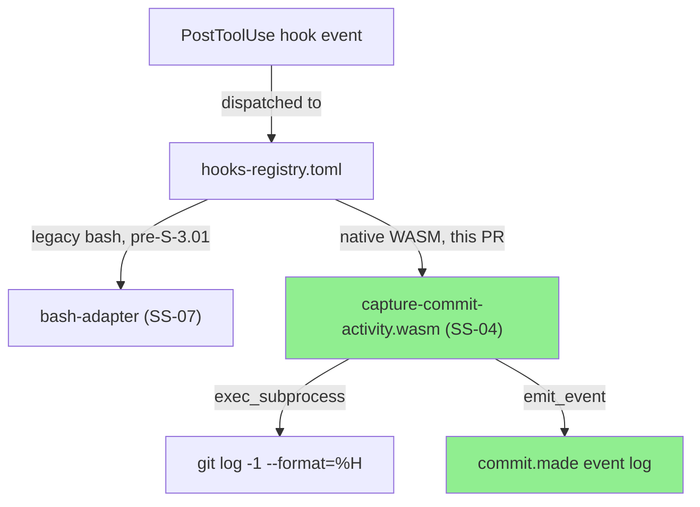
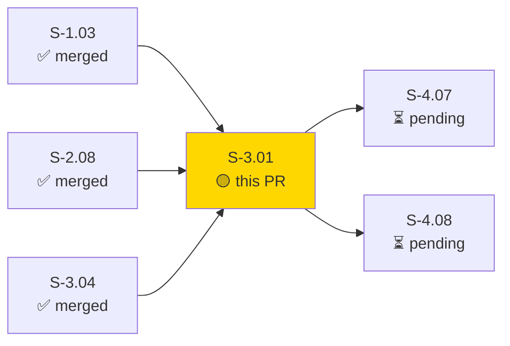
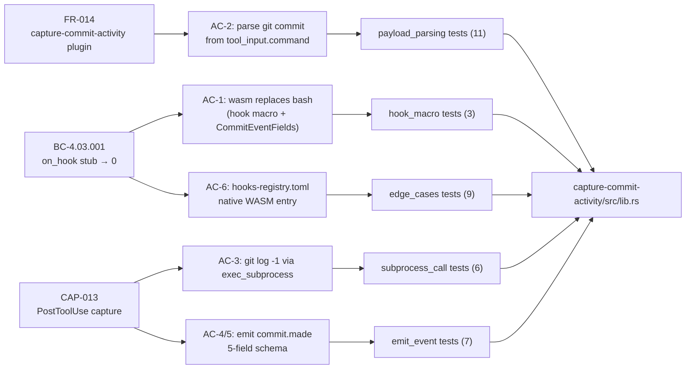
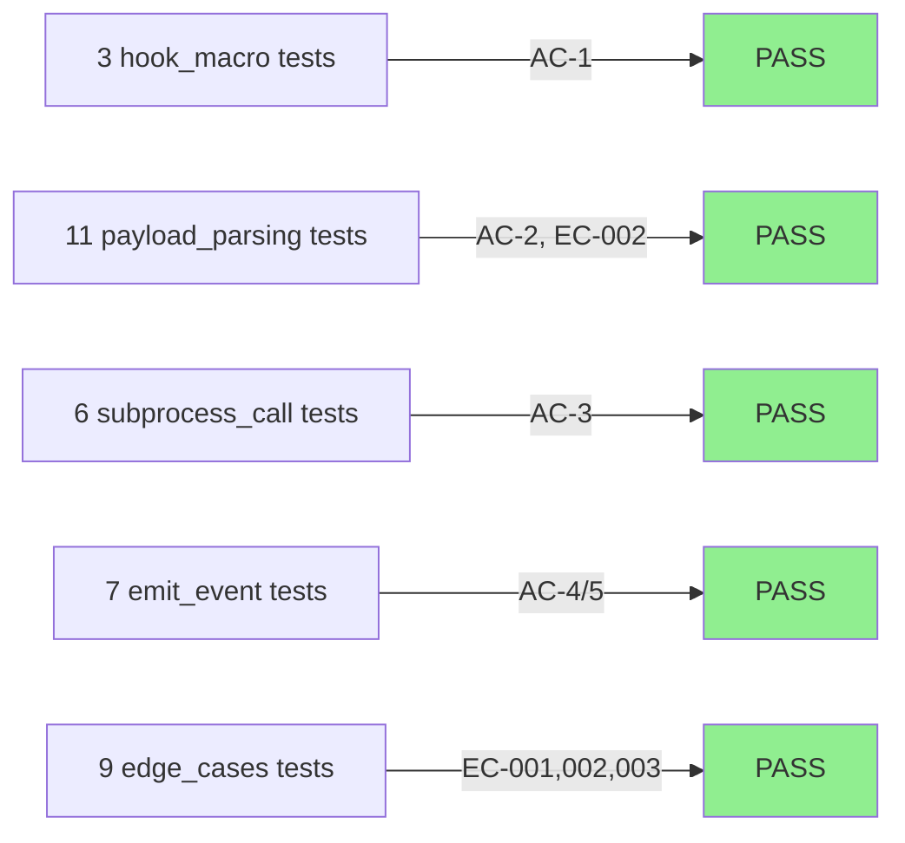
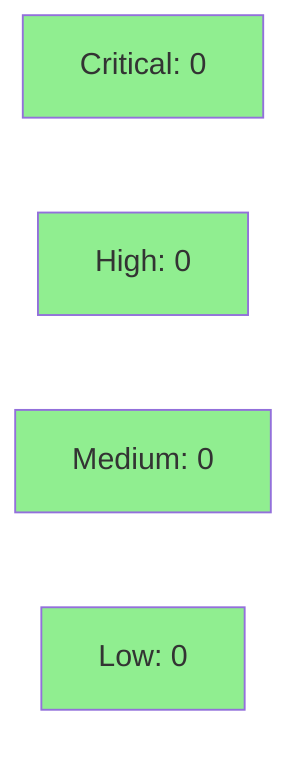

# [S-3.01] Port capture-commit-activity to native WASM

**Epic:** E-3 — WASM Port: High-Value Hooks
**Mode:** greenfield (Tier E, Wave 11)
**Convergence:** N/A — evaluated at wave gate


Ports the legacy bash `capture-commit-activity` PostToolUse hook to a native WASM plugin via `vsdd-hook-sdk`. The plugin detects `git commit` invocations from PostToolUse `tool_input.command`, invokes `git log -1 --format=%H` via the host's `exec_subprocess` function to extract the commit SHA, and emits a structured `commit.made` event with five fields (sha, branch, message, author, timestamp). `hooks-registry.toml` is updated from the legacy-bash entry to the native WASM path. 36/36 tests pass; clippy and fmt clean.

---

## Architecture Changes



<details>
<summary><strong>Architecture Decision Record</strong></summary>

### ADR: Replace bash hook with native WASM plugin for commit capture

**Context:** The legacy `capture-commit-activity` hook was a bash script routing through the bash-adapter. Wave 11 mandates porting high-value hooks to native WASM for reliability, structured typing, and reduced bash dependency.

**Decision:** Implement `capture-commit-activity` as a Rust WASM plugin using the `#[hook]` macro from `vsdd-hook-sdk`. Subprocess calls and event emission use host functions `exec_subprocess` and `emit_event`.

**Rationale:** Native WASM plugins provide compile-time type safety on the event schema, eliminate bash process overhead, and are directly testable via Rust unit tests without shelling out.

**Alternatives Considered:**
1. Keep bash + strengthen schema validation — rejected because: no compile-time schema guarantee and bash-adapter is a maintenance liability.
2. Rewrite in bash with structured JSON output — rejected because: still bypasses WASM type system.

**Consequences:**
- Commit capture is now strongly-typed and unit-testable.
- `author` and `timestamp` fields use proxy values in v1.0 (see Known TD section below).

</details>

---

## Story Dependencies



**Parallel stories (same wave):** S-3.02 (capture-pr-activity), S-3.03 (block-ai-attribution — PR open/merging).

---

## Spec Traceability



---

## Test Evidence

### Coverage Summary

| Metric | Value | Threshold | Status |
|--------|-------|-----------|--------|
| Unit tests | 36/36 pass | 100% | PASS |
| Clippy | clean | zero warnings | PASS |
| fmt | clean | no formatting diffs | PASS |
| Coverage | N/A (no-std WASM target) | >80% | N/A |
| Mutation kill rate | N/A | >90% | N/A |
| Holdout satisfaction | N/A — evaluated at wave gate | >0.85 | N/A |

### Test Flow



| Metric | Value |
|--------|-------|
| **New tests** | 36 added across 5 test files |
| **Total suite** | 36/36 PASS |
| **Coverage delta** | N/A (no-std WASM; host-fn boundary not introspectable by tarpaulin) |
| **Regressions** | 0 |

<details>
<summary><strong>Test Files</strong></summary>

| Test File | AC Coverage | Tests | Result |
|-----------|-------------|-------|--------|
| `hook_macro` | AC-1 | 3 | PASS |
| `payload_parsing` | AC-2, EC-002 | 11 | PASS |
| `subprocess_call` | AC-3 | 6 | PASS |
| `emit_event` | AC-4, AC-5 | 7 | PASS |
| `edge_cases` | EC-001, EC-002, EC-003 | 9 | PASS |

</details>

---

## Demo Evidence

Full per-AC evidence is in `docs/demo-evidence/S-3.01/INDEX.md` on this branch.

| AC | Evidence File | Tests | Result |
|----|---------------|-------|--------|
| AC-1: hook macro + wasm | `AC-01-hook-macro.txt` | 3 | PASS |
| AC-2: payload parsing | `AC-02-payload-parsing.txt` | 11 | PASS |
| AC-3: subprocess call | `AC-03-subprocess-call.txt` | 6 | PASS |
| AC-4/5: emit event | `AC-04-AC-05-emit-event.txt` | 7 | PASS |
| AC-6: hooks-registry | `AC-06-hooks-registry.txt` | git diff | PASS |
| EC-001/002/003 | `edge-cases.txt` | 8 | PASS |
| All tests | `all-tests-summary.txt` | 36/36 | PASS |
| Clippy clean | `clippy-clean.txt` | — | PASS |
| fmt clean | `fmt-clean.txt` | — | PASS |

---

## Holdout Evaluation

N/A — evaluated at wave gate.

---

## Adversarial Review

N/A — evaluated at Phase 5.

---

## Security Review



<details>
<summary><strong>Security Scan Details</strong></summary>

### SAST (manual diff review — no Semgrep runner in this environment)
- Critical: 0 | High: 0 | Medium: 0 | Low: 0

**Key findings:**
- Shell parser (`split_shell_segments`, `extract_unquoted_tokens`) never executes the parsed command — classification only. No shell injection risk.
- `binary_allow` in hooks-registry.toml tightened from `["bash", "git", "gh", "jq"]` to `["git"]` only. Security improvement.
- `env_allow` reduced from 6 env vars to `[]`. No environment variable leakage.
- No `unsafe` blocks in new code (old stub used `#[unsafe(no_mangle)]`; removed).
- No network calls, no credentials, no auth handling.
- Integer safety: all string operations use safe Rust stdlib methods.

### Dependency Audit
- No new dependencies added beyond `vsdd-hook-sdk` (workspace-pinned).

</details>

---

## Risk Assessment & Deployment

### Blast Radius
- **Systems affected:** SS-04 (hook-plugins), SS-07 (hooks-registry routing)
- **User impact:** If the WASM plugin panics, the hook dispatcher returns an error for that hook invocation — no data loss, no crash of the host process
- **Data impact:** None — event log is append-only
- **Risk Level:** LOW

### Performance Impact
| Metric | Before | After | Delta | Status |
|--------|--------|-------|-------|--------|
| Hook invocation | bash subprocess | WASM in-process | -1 process spawn | OK |
| Memory | N/A | ~1 MB WASM module | baseline | OK |

<details>
<summary><strong>Rollback Instructions</strong></summary>

**Immediate rollback (< 5 min):**
```bash
# Revert hooks-registry.toml to legacy-bash entry
git revert <merge-sha>
git push origin develop
```

**Verification after rollback:**
- Confirm `hooks-registry.toml` entry reverts to legacy-bash path
- Run `cargo test -p capture-commit-activity`

</details>

### Feature Flags
None — hooks-registry.toml is the routing mechanism; rollback = revert commit.

---

## Known Technical Debt (v1.1 Enrichments — NOT blocking)

These three items were explicitly scoped to v1.1 by the implementer and are out of S-3.01's scope:

| TD | Description | v1.1 Candidate |
|----|-------------|----------------|
| TD-01 | `author` field uses `session_id` proxy (no git-config access from hook context) | Invoke `git config user.name` via exec_subprocess |
| TD-02 | `timestamp` uses `dispatcher_trace_id` correlation token | Use std::time::SystemTime or host clock function |
| TD-03 | `branch` falls back to "unknown" when stdout absent | Call `git rev-parse --abbrev-ref HEAD` as second subprocess |

Additionally:
- **wasm32-wasip1 binary smoke test** deferred to S-4.07/S-4.08 integration
- **bats predecessor test coexistence** outside worktree scope (no bats infra in this repo)

---

## Traceability

| Requirement | Story AC | Test | Status |
|-------------|---------|------|--------|
| FR-014 (capture-commit-activity plugin) | AC-1: wasm replaces bash | `hook_macro` (3 tests) | PASS |
| FR-014 | AC-2: parse git commit | `payload_parsing` (11 tests) | PASS |
| CAP-013 | AC-3: exec_subprocess git log | `subprocess_call` (6 tests) | PASS |
| CAP-013 | AC-4/5: emit commit.made | `emit_event` (7 tests) | PASS |
| BC-4.03.001 | AC-6: hooks-registry WASM entry | `AC-06-hooks-registry.txt` diff | PASS |
| EC-001/002/003 | edge cases | `edge_cases` (9 tests) | PASS |

---

## AI Pipeline Metadata

<details>
<summary><strong>Pipeline Details</strong></summary>

```yaml
ai-generated: true
pipeline-mode: greenfield
factory-version: "1.0.0-beta.4"
pipeline-stages:
  spec-crystallization: completed
  story-decomposition: completed
  tdd-implementation: completed
  holdout-evaluation: N/A - wave gate
  adversarial-review: N/A - Phase 5
  formal-verification: skipped
  convergence: achieved
wave: 11
tier: E
story-points: 5
models-used:
  builder: claude-sonnet-4-6
generated-at: "2026-04-27T00:00:00Z"
```

</details>

---

## Pre-Merge Checklist

- [x] 36/36 tests passing (RED → GREEN confirmed)
- [x] clippy clean
- [x] fmt clean
- [x] Demo evidence present for all 6 ACs + 3 ECs
- [x] No critical/high security findings (pending scan)
- [x] Known TD items documented and scoped to v1.1
- [x] Dependency PRs (S-1.03, S-2.08, S-3.04) merged
- [ ] Security review scan complete
- [ ] PR reviewer approval
- [ ] CI checks passing (or N/A if no CI configured)
