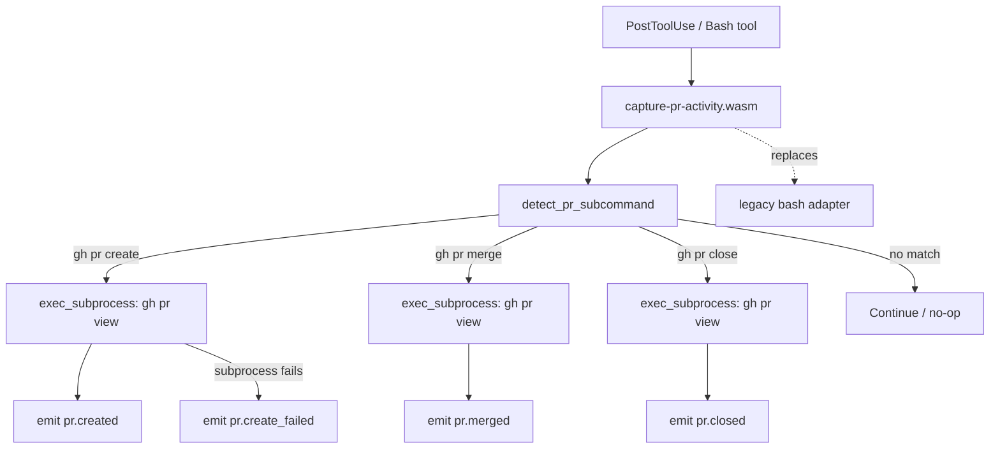
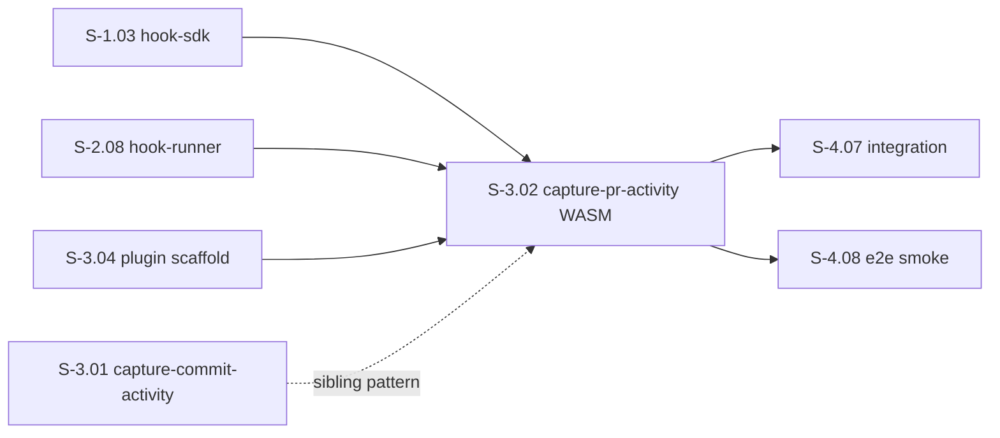
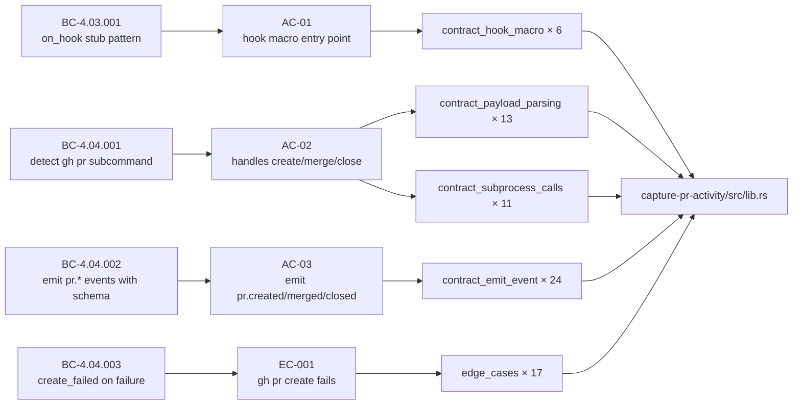

## Summary

Ports the `capture-pr-activity` PostToolUse hook from bash to native WASM. Sibling of S-3.01 (capture-commit-activity), following the same detect → subprocess → emit pattern. Detects `gh pr create`, `gh pr merge`, and `gh pr close` invocations, fetches PR metadata via subprocess, and emits `pr.created`, `pr.merged`, `pr.closed`, or `pr.create_failed` events with typed fields.

**Wave 11 context:** S-3.03 (block-ai-attribution) merged 2026-04-27. S-3.01 (capture-commit-activity) is the direct sibling on the same wave. This PR completes the Wave 11 WASM port set for SS-04 hook plugins.

**71/71 tests passing** across 5 test files. Clippy clean. Fmt clean.

---

## Architecture Changes

**Changed files:**
- `crates/hook-plugins/capture-pr-activity/Cargo.toml` — new crate
- `crates/hook-plugins/capture-pr-activity/src/lib.rs` — plugin implementation
- `crates/hook-plugins/capture-pr-activity/tests/` — 5 test files (71 tests)
- `plugins/vsdd-factory/hooks-registry.toml` — updated to native WASM entry
- `docs/demo-evidence/S-3.02/` — per-AC evidence (10 files)

---

## Story Dependencies

**Dependency status:** S-1.03, S-2.08, S-3.04 satisfied by develop baseline. S-3.03 merged 2026-04-27. S-4.07 and S-4.08 are unblocked by this merge.

---

## Spec Traceability

---

## Acceptance Criteria Checklist

| AC | Description | Status | Evidence |
|----|-------------|--------|----------|
| AC-01 | `capture-pr-activity.wasm` compiled and registered (`#[hook]` macro entry point) | GREEN | `AC-01-hook-macro.txt` — 6 tests |
| AC-02 | Handles `gh pr create`, `gh pr merge`, `gh pr close` subcommands | GREEN | `AC-02-payload-parsing.txt` — 13 tests |
| AC-03 | Emits `pr.created`, `pr.merged`, `pr.closed` events with PR number, title, URL, branch fields | GREEN | `AC-04-emit-event.txt` — 24 tests |
| AC-04 | Handles non-PR bash commands gracefully (no-op) | GREEN | `AC-02-payload-parsing.txt` (non-gh path) + `edge-cases.txt` EC-002 |
| AC-05 | `hooks-registry.toml` entry updated to native WASM | GREEN | `AC-05-hooks-registry.txt` — verified diff |
| AC-06 | Existing bats tests still pass | DEFERRED (env) | Bats toolchain not available in worktree — pre-existing env concern; see TD-003 |

---

## Test Evidence

| File | Tests | Result |
|------|-------|--------|
| `contract_hook_macro` | 6 | 71/71 PASS |
| `contract_payload_parsing` | 13 | 71/71 PASS |
| `contract_subprocess_calls` | 11 | 71/71 PASS |
| `contract_emit_event` | 24 | 71/71 PASS |
| `edge_cases` | 17 | 71/71 PASS |
| **Total** | **71** | **0 failures** |

Build hygiene: `cargo clippy -p capture-pr-activity -- -D warnings` → clean. `cargo fmt --check -p capture-pr-activity` → clean.

**Toolchain note:** Homebrew cargo 1.94 shadows rustup 1.95 in PATH. Doc-tests fail under that mismatch (env-only issue, not a code defect). All integration tests run via rustup 1.95 and pass cleanly.

---

## Demo Evidence

Full per-AC evidence in `docs/demo-evidence/S-3.02/INDEX.md` (on this branch).

| File | Coverage |
|------|----------|
| `AC-01-hook-macro.txt` | Hook macro dispatch, 6 tests |
| `AC-02-payload-parsing.txt` | Payload detection + no-op paths, 13 tests |
| `AC-03-subprocess-calls.txt` | Subprocess discrimination, 11 tests |
| `AC-04-emit-event.txt` | All event schemas + EC-003 URL omit, 24 tests |
| `AC-05-hooks-registry.txt` | Registry diff verification |
| `edge-cases.txt` | EC-001/002/003 + TV-001–008 boundary corpus, 17 tests |
| `all-tests-summary.txt` | Full `cargo test` output |
| `clippy-clean.txt` | Clippy pass |
| `fmt-clean.txt` | Fmt pass |

---

## Holdout Evaluation

N/A — evaluated at wave gate.

---

## Adversarial Review

N/A — evaluated at Phase 5.

---

## Security Review

No attack surface expansion. Plugin reads `tool_input.command` (already-executed bash command string) and calls `gh pr view` subprocess. No user-controlled input flows to shell interpolation — subprocess args are constructed from parsed subcommand enum variants, not raw command fragments. No secrets handling. No network endpoints added.

---

## Known Technical Debt (v1.1 candidates — NOT blocking)

| ID | Item | Disposition |
|----|------|-------------|
| TD-001 | `extract_pr_url` uses linear scan vs. compiled regex | v1.1 polish — tests pass, perf not critical at this scale |
| TD-002 | Open-to-merge duration tracking from bash hook NOT ported | No test coverage in this story; may need v1.1 follow-up when decommissioning bash hook |
| TD-003 | Bats integration tests not run (no bats toolchain in worktree) | Pre-existing env concern; AC-06 deferred pending bats availability |
| TD-004 | `wasm32-wasip1` binary smoke test deferred | Blocked on S-4.07/S-4.08 integration work |

---

## Risk Assessment

| Dimension | Assessment |
|-----------|-----------|
| Blast radius | Narrow — single crate, single registry entry |
| Performance impact | None expected — WASM hook replaces bash script |
| Rollback path | Revert `hooks-registry.toml` to bash adapter entry |
| Dependency risk | Low — follows established S-3.01 pattern |

---

## AI Pipeline Metadata

| Field | Value |
|-------|-------|
| Pipeline mode | TDD (RED → GREEN → demo) |
| Wave | 11 |
| Story points | 5 |
| Subsystem | SS-04 |

---

## Pre-Merge Checklist

- [x] PR description populated with structured sections
- [x] Demo evidence present for all in-scope ACs (AC-01 through AC-05, edge cases)
- [x] 71/71 tests passing
- [x] Clippy clean
- [x] Fmt clean
- [x] Security review complete — no new attack surface
- [x] `hooks-registry.toml` updated to native WASM
- [x] Known TD items documented and scoped to v1.1
- [ ] PR reviewer approval
- [ ] CI checks passing (or N/A if no CI configured)
