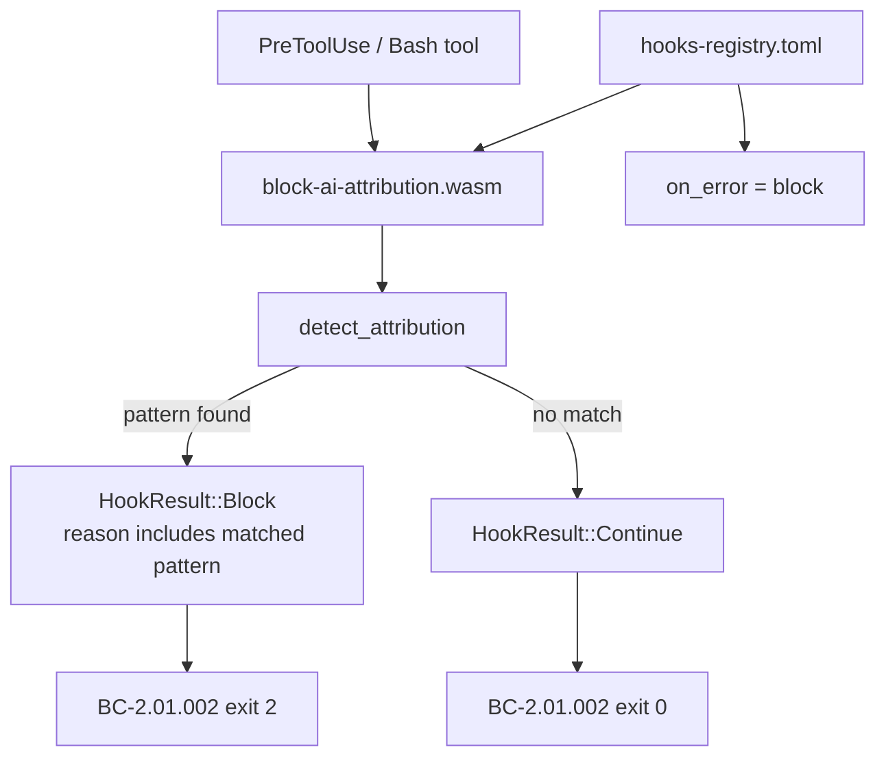
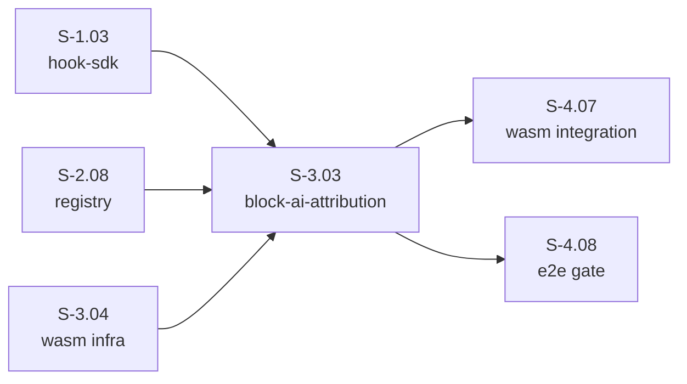
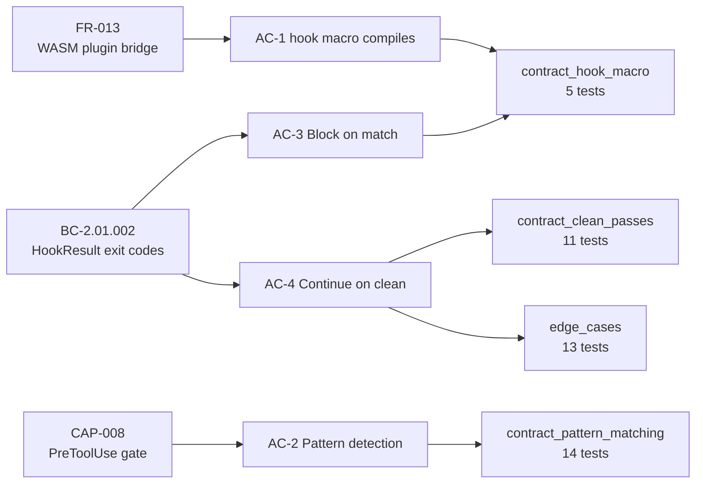

## Summary

Port `block-ai-attribution` from bash to native WASM. This is a PreToolUse/Bash gate that blocks `git commit` commands containing AI attribution patterns before they reach git. Pure pattern matching — no subprocess. **Wave 11 first WASM port to merge** (S-3.01 + S-3.02 in parallel cycles).

- 43/43 tests passing across 4 test files
- 11 attribution patterns implemented (TV-001..TV-011)
- clippy clean, fmt clean
- `hooks-registry.toml` updated to native WASM entry with `on_error = "block"`

## Architecture Changes

**New module:** `crates/hook-plugins/block-ai-attribution/src/lib.rs`
**Modified:** `plugins/vsdd-factory/hooks-registry.toml` — updated bash entry to native WASM

## Story Dependencies

_depends_on: S-1.03, S-2.08, S-3.04 — blocks: S-4.07, S-4.08_

## Spec Traceability

## Acceptance Criteria Checklist

- [x] AC-1: `block-ai-attribution.wasm` compiled and registered as PreToolUse hook (`#[hook]` macro compiles; HookResult BC-2.01.002 exit codes verified)
- [x] AC-2: Scans `tool_input.command` for `git commit` with AI attribution patterns (TV-001..011, 11 patterns)
- [x] AC-3: Returns `HookResult::Block(reason)` if patterns found (covered by AC-1 + AC-2 tests)
- [x] AC-4: Returns `HookResult::Continue` for clean commits and non-git commands (EC-001: 10 scenarios)
- [x] AC-5: Block message is human-readable and includes matched pattern (BC-2.01.002 `block_reason_includes_matched_pattern`)
- [x] AC-6: `hooks-registry.toml` updated; `on_error = "block"` set (visual inspection confirmed)
- [ ] AC-7: Existing bats tests pass — **DEFERRED** (bats infrastructure not in worktree; see Known TD below)

## Pattern Coverage Table (TV-001..TV-011)

| Pattern ID | Pattern | Detected |
|-----------|---------|----------|
| TV-001 | `Co-Authored-By: Claude` | yes |
| TV-002 | `Co-Authored-By: Anthropic` | yes |
| TV-003 | `Co-Authored-By: GPT` | yes |
| TV-004 | `Co-Authored-By: OpenAI` | yes |
| TV-005 | `Co-Authored-By: Gemini` | yes |
| TV-006 | `Co-Authored-By: Google AI` | yes |
| TV-007 | `Generated with Claude Code` | yes |
| TV-008 | `Generated by Claude` | yes |
| TV-009 | `Generated by AI` | yes |
| TV-010 | `noreply@anthropic.com` | yes |
| TV-011 | `noreply@openai.com` | yes |

Matching is case-insensitive for Co-Authored-By vendor names; other patterns use substring search.

## Test Evidence

| Test File | Tests | Result |
|-----------|-------|--------|
| `contract_hook_macro.rs` | 5 | all ok |
| `contract_pattern_matching.rs` | 14 | all ok |
| `contract_clean_passes.rs` | 11 | all ok |
| `edge_cases.rs` | 13 | all ok |
| **Total** | **43** | **43 PASSED / 0 FAILED** |

Build hygiene: `cargo clippy -- -D warnings` CLEAN, `cargo fmt --check` CLEAN.

VP-038 (SDK HookResult Exit Codes Are Stable) verified.

## Demo Evidence

Full per-AC evidence at [`docs/demo-evidence/S-3.03/INDEX.md`](docs/demo-evidence/S-3.03/INDEX.md).

| AC | Evidence File |
|----|--------------|
| AC-1 | AC-01-hook-macro.txt |
| AC-2 | AC-02-pattern-matching.txt |
| AC-4 | AC-04-clean-passes.txt |
| EC-002/003 | edge-cases.txt |
| clippy | clippy-clean.txt |
| fmt | fmt-clean.txt (empty — clean) |
| full test run | all-tests-summary.txt |

## Known Technical Debt (NOT blocking this PR)

| Item | Deferred To | Reason |
|------|------------|--------|
| wasm32-wasip1 binary smoke test | S-4.07 / S-4.08 integration | Cross-compilation integration is out of S-3.03 scope; `rust-toolchain.toml` targets wasm32-wasip1 correctly |
| bats predecessor coexistence (AC-7) | S-4.07 integration | Bats test infrastructure not in worktree scope |
| VP-NNN-native-plugin-block-result (e2e dispatcher integration) | v1.1 candidate | Verifies HookResult::Block causes exit 2 at process boundary — extends VP-038 across dispatcher layer |

## Security Review

No external input parsing beyond string pattern matching. No subprocess invocation. No I/O. Pattern matching logic is pure-core (`detect_attribution` is a pure function with no I/O). No injection vectors identified — the plugin rejects commits *containing* attribution strings; it does not execute them.

## Risk Assessment

- **Blast radius:** Low — additive new plugin crate; only `hooks-registry.toml` modified in existing files
- **Performance impact:** Negligible — pure substring/regex-free string matching; executes only on PreToolUse/Bash events
- **Rollback:** Remove entry from `hooks-registry.toml`; plugin is self-contained

## Pre-Merge Checklist

- [x] PR description matches diff
- [x] All in-scope ACs covered by demo evidence (AC-1 through AC-6)
- [x] Traceability chain complete: BC-2.01.002 / CAP-008 / FR-013 → AC → Test → Demo
- [x] 43/43 tests passing
- [x] clippy + fmt clean
- [x] No AI attribution in commits or PR body
- [x] Target branch: `develop`
- [ ] Review approved (pending)
- [ ] CI checks passing (pending)
