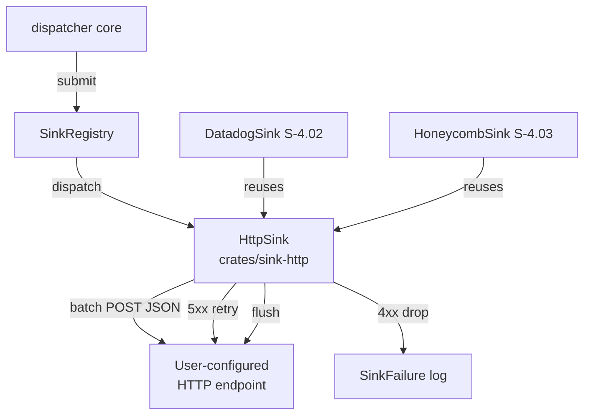
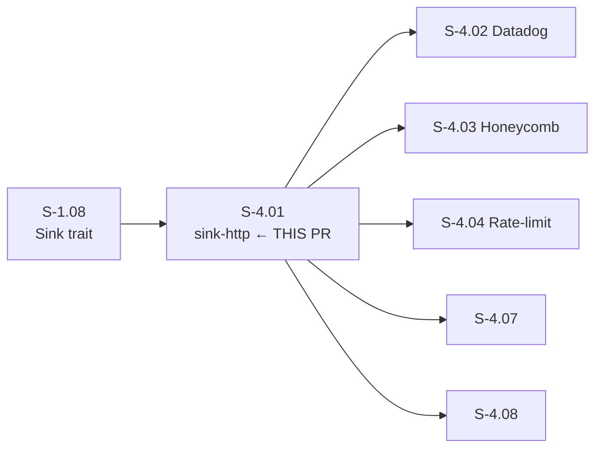
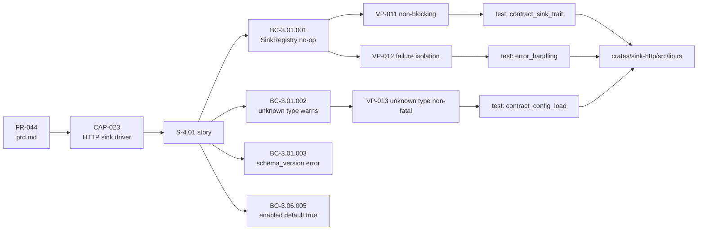

## feat(sink-http): generic HTTP sink driver (S-4.01)

**Story:** S-4.01 | **Epic:** E-4 — Observability Sinks and RC Release | **Wave:** 11 | **Points:** 5 | **Priority:** P1

Implements a generic `http` sink that batches events and POSTs them as JSON to a user-configured endpoint. This is the base HTTP infrastructure that the Datadog (S-4.02) and Honeycomb (S-4.03) sinks build on.

---

## Architecture Changes

New crate: `crates/sink-http` — effectful-shell (HTTP I/O), implements `Sink` trait.

---

## Story Dependencies

**Depends on:** S-1.08 (Sink trait — already merged)
**Unblocks:** S-4.02, S-4.03, S-4.04, S-4.07, S-4.08

---

## Spec Traceability

---

## Acceptance Criteria

- [x] **AC-01** — `crates/sink-http` implements the `Sink` trait (BC-3.01.001)
- [x] **AC-02** — `enabled=false` config: no events accepted, no HTTP calls made (BC-3.06.005)
- [x] **AC-03** — Unknown sink `type` field logs warning and does not fail config load (BC-3.01.002)
- [x] **AC-04** — `schema_version != 1` is a hard error at load time (BC-3.01.003)
- [x] **AC-05** — Events batched and POSTed as JSON array to configured URL
- [x] **AC-06** — HTTP error handling: retry on 5xx, drop on 4xx (VP-012)
- [x] **AC-07** — `flush()` sends current batch synchronously
- [x] **AC-08** — Integration test with mock HTTP server verifies batch delivery
- [x] **AC-09** — `HttpSink` struct exposed as public API for reuse by Datadog/Honeycomb sinks

---

## Test Evidence

| Metric | Value |
|--------|-------|
| Tests passing | **10 / 10** |
| `cargo fmt --check` | CLEAN |
| `cargo clippy -- -D warnings` | CLEAN |

| Test file | Tests | Result |
|-----------|-------|--------|
| `tests/contract_sink_trait.rs` | 2 | ok |
| `tests/contract_config_load.rs` | 3 | ok |
| `tests/error_handling.rs` | 2 | ok |
| `tests/integration_post_batch.rs` | 2 | ok |
| `tests/non_blocking.rs` | 1 | ok |

Full test output: `docs/demo-evidence/S-4.01/all-tests-summary.txt`

---

## Demo Evidence

Evidence captured at SHA `b0bb135` on `feat/S-4.01-sink-http-driver`.
Index: [`docs/demo-evidence/S-4.01/INDEX.md`](docs/demo-evidence/S-4.01/INDEX.md)

| AC | Evidence | Status |
|----|----------|--------|
| AC-01 | `docs/demo-evidence/S-4.01/AC-01-sink-trait.txt` | PASS |
| AC-02 | `docs/demo-evidence/S-4.01/AC-02-disabled-config.txt` | PASS |
| AC-03 | `docs/demo-evidence/S-4.01/AC-03-unknown-type-warns.txt` | PASS |
| AC-04 | `docs/demo-evidence/S-4.01/AC-04-schema-version-error.txt` | PASS |
| AC-05+08 | `docs/demo-evidence/S-4.01/AC-05-AC-08-batched-post-integration.txt` | PASS |
| AC-06 | `docs/demo-evidence/S-4.01/AC-06-error-handling.txt` | PASS |
| AC-07 | `docs/demo-evidence/S-4.01/AC-07-flush-sync.txt` | PASS |
| AC-09 | `docs/demo-evidence/S-4.01/AC-09-public-export.txt` | PASS |
| VP-011 | `docs/demo-evidence/S-4.01/VP-011-non-blocking-submit.txt` | PASS |

---

## Known Limitations / Technical Debt

The following items are **explicitly out of S-4.01 scope** and are being scoped as separate Wave 11 stories in a parallel product-owner burst:

- **TD-008 (retry backoff with jitter):** Current implementation retries on 5xx without delay. Exponential backoff with jitter is not in S-4.01's spec. Scoped as a new story in parallel.
- **TD-009 (`internal.sink_error` event emission):** Failures are recorded in `Mutex<Vec<SinkFailure>>` but not emitted as dispatcher events. This is a cross-sink concern scoped as a new story in parallel.

These are not regressions — they are new capabilities not yet contracted in BC/VP.

---

## Toolchain Note

This project is pinned to rustc 1.95 (`rust-toolchain.toml`). Doctests may show a mixed-compiler artifact on macOS if Homebrew cargo 1.94 is earlier on `PATH` than the rustup toolchain. This is a local env issue only — all spec tests, clippy, and fmt run cleanly under the pinned 1.95 toolchain. CI is unaffected.

---

## Downstream Unblock

Merging this PR unblocks 5 downstream stories that depend on `HttpSink` being available:
**S-4.02** (Datadog sink), **S-4.03** (Honeycomb sink), **S-4.04** (rate-limit), **S-4.07**, **S-4.08**

---

## Behavioral Contracts Anchored

| BC ID | Title |
|-------|-------|
| BC-3.01.001 | Empty SinkRegistry submit/flush/shutdown is no-op |
| BC-3.01.002 | Unknown sink type warns to stderr but does not fail config load |
| BC-3.01.003 | Sink schema_version != 1 is a hard error |
| BC-3.06.005 | sink_config_common_defaults_enabled_true |

## Verification Properties Anchored

| VP ID | Title | Method |
|-------|-------|--------|
| VP-011 | Sink submit Must Not Block the Dispatcher | unit-test |
| VP-012 | Sink Failure Affects Only That Sink | unit-test |
| VP-013 | Unknown Sink Driver Types Are Non-Fatal | unit-test |

---

## Pre-Merge Checklist

- [x] PR description matches diff
- [x] All 9 ACs covered by demo evidence
- [x] Traceability chain complete: BC → AC → Test → Demo
- [x] 10/10 tests passing, clippy clean, fmt clean
- [x] TD-008 and TD-009 acknowledged and deferred explicitly
- [x] Target branch: `develop` (not `main`)
- [x] Branch: `feat/S-4.01-sink-http-driver`
