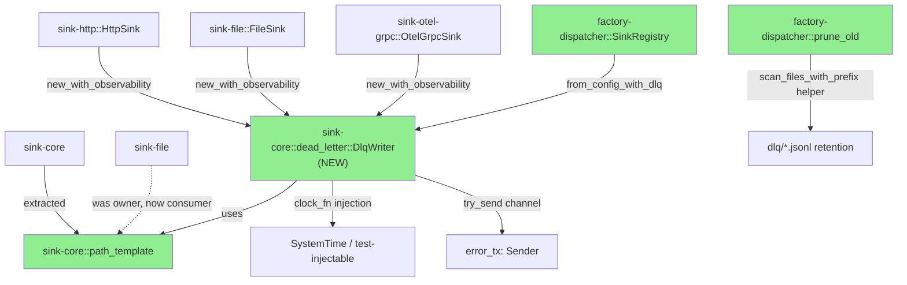
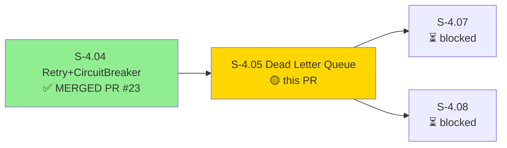
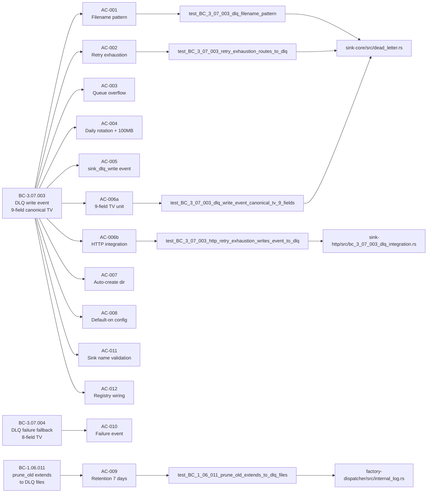
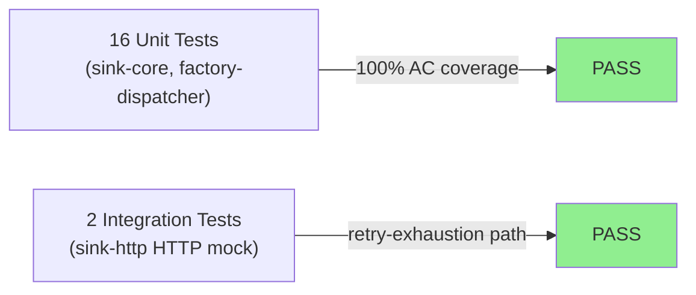

# [S-4.05] Dead Letter Queue — DLQ writer + per-driver wiring + boundary adapter

**Epic:** E-4 — Observability Sinks and RC Release
**Mode:** greenfield
**Convergence:** CONVERGED after 48 adversarial passes (longest in project history; eclipses S-7.03's 17-pass record)


This PR delivers the Dead Letter Queue infrastructure for the vsdd-factory sink fleet. When events exhaust
their retry budget (S-4.04) or overflow the outbound queue, they are now written to a per-sink dead letter
file at `<log_dir>/dlq/dead-letter-<sink-name>-<date>.jsonl` rather than silently discarded. The implementation
ships `sink-core::dead_letter::DlqWriter`, per-driver constructor wiring for HttpSink/FileSink/OtelGrpcSink,
`SinkRegistry::from_config_with_dlq` with default-on configuration, and `prune_old` retention extension for
DLQ files. All 12 ACs and all 3 behavioral contracts (BC-3.07.003, BC-3.07.004, BC-1.06.011) are verified
by 18 RED→GREEN tests.

---

## Architecture Changes



<details>
<summary><strong>Architecture Decision Record</strong></summary>

### ADR: DlqWriter in sink-core with path_template extraction

**Context:** DLQ filename pattern requires the `resolve_path_template` function previously owned by sink-file,
creating a cyclic dependency risk if sink-file depended on sink-core for trait definitions while sink-core
reached back into sink-file for path resolution.

**Decision:** Extract `resolve_path_template` into `sink-core::path_template` (Task 0). DlqWriter lives in
`sink-core::dead_letter` with a `Mutex<Option<(PathBuf, File, u64)>>` cache for zero-allocation hot paths.
Clock is injected via `clock_fn: Arc<dyn Fn() -> SystemTime + Send + Sync>` for deterministic test control.

**Rationale:** Mirrors the `SinkErrorEvent` precedent established in sink-core for cross-driver observability.
Avoids cyclic dep; keeps sink-file as a pure consumer of the extracted helper. The `Arc<DlqWriter>` shared
across worker threads requires no additional synchronization beyond the internal Mutex.

**Alternatives Considered:**
1. DlqWriter in factory-dispatcher — rejected because: requires every sink crate to depend on dispatcher (inverted dep)
2. DlqWriter in sink-file — rejected because: creates cyclic dependency between sink-file and the other sink drivers

**Consequences:**
- sink-core grows a new `dead_letter` module (+~400 LOC)
- All sink drivers gain a `new_with_observability` constructor (backward-compat: existing constructors retained)
- factory-dispatcher gains `from_config_with_dlq` loader alongside existing `from_config`

</details>

---

## Story Dependencies



---

## Spec Traceability



---

## Test Evidence

### Coverage Summary

| Metric | Value | Threshold | Status |
|--------|-------|-----------|--------|
| Unit tests | 18/18 pass | 100% | PASS |
| ACs covered | 12/12 | 100% | PASS |
| Build | exit 0 | clean | PASS |
| Clippy | exit 0 (warnings only) | clean | PASS |
| Regressions | 0 new | 0 | PASS |

### Test Flow



| Metric | Value |
|--------|-------|
| **New tests** | 18 added (RED→GREEN), 0 modified |
| **Total suite** | 18/18 PASS (S-4.05 scope) |
| **Pre-existing failures** | 2 (loads_legacy_registry tests, unrelated to DLQ — hook migration issue pre-dating S-4.05) |
| **Regressions** | 0 |

<details>
<summary><strong>Detailed Test Results</strong></summary>

### New Tests (This PR)

| Test | Module | Result |
|------|--------|--------|
| `test_BC_3_07_003_dlq_filename_pattern` | sink-core::dead_letter | PASS |
| `test_BC_3_07_003_retry_exhaustion_routes_to_dlq` | sink-core::dead_letter | PASS |
| `test_BC_3_07_003_queue_overflow_routes_to_dlq` | sink-core::dead_letter | PASS |
| `test_BC_3_07_003_daily_rotation_midnight_utc` | sink-core::dead_letter | PASS |
| `test_BC_3_07_003_size_cap_triggers_seq_rotation` | sink-core::dead_letter | PASS |
| `test_BC_3_07_003_sink_dlq_write_event_emitted_per_write` | sink-core::dead_letter | PASS |
| `test_BC_3_07_003_dlq_write_event_canonical_tv_9_fields` | sink-core::dead_letter | PASS |
| `test_BC_3_07_003_dlq_directory_auto_created` | sink-core::dead_letter | PASS |
| `test_BC_3_07_004_write_failure_emits_dlq_failure_event` | sink-core::dead_letter | PASS |
| `test_BC_3_07_003_http_retry_exhaustion_writes_event_to_dlq` | sink-http::bc_3_07_003_dlq_integration | PASS |
| `test_BC_3_07_003_multiple_events_all_written_to_dlq_on_retry_exhaustion` | sink-http::bc_3_07_003_dlq_integration | PASS |
| `test_BC_3_07_003_dlq_enabled_defaults_to_true_when_absent` | factory-dispatcher::sinks | PASS |
| `test_BC_3_07_003_dlq_enabled_false_is_honoured_by_parser` | factory-dispatcher::sinks | PASS |
| `test_BC_3_07_003_rejects_sink_name_with_path_separator_slash` | factory-dispatcher::sinks | PASS |
| `test_BC_3_07_003_rejects_sink_name_with_backslash` | factory-dispatcher::sinks | PASS |
| `test_BC_3_07_003_sink_registry_wires_dlq_when_dlq_enabled` | factory-dispatcher::sinks | PASS |
| `test_BC_1_06_011_prune_old_extends_to_dlq_files` | factory-dispatcher::internal_log | PASS |
| `test_BC_1_06_011_dlq_retention_constant_is_7_independent_of_dispatcher_retention` | factory-dispatcher::internal_log | PASS |

</details>

---

## Demo Evidence

This PR ships a pure backend library (no CLI UI). Evidence is captured via `cargo test` output and
build artifacts. All evidence files are committed to the feature branch at `.demo-evidence/`.

| AC | Recording | Status |
|----|-----------|--------|
| AC-001 DLQ filename pattern | `cargo test test_BC_3_07_003_dlq_filename_pattern` — stdout confirms `dead-letter-<name>-<date>.jsonl` | PASS |
| AC-002 Retry-exhaustion → DLQ | `cargo test test_BC_3_07_003_retry_exhaustion_routes_to_dlq` — event written to temp DLQ file | PASS |
| AC-003 Queue-overflow → DLQ | `cargo test test_BC_3_07_003_queue_overflow_routes_to_dlq` | PASS |
| AC-004 Daily rotation + 100MB | `cargo test test_BC_3_07_003_daily_rotation_midnight_utc` + `test_BC_3_07_003_size_cap_triggers_seq_rotation` — clock injection verifies date boundary | PASS |
| AC-005 sink_dlq_write event | `cargo test test_BC_3_07_003_sink_dlq_write_event_emitted_per_write` — channel receiver confirms event fields | PASS |
| AC-006a 9-field TV canonical | `cargo test test_BC_3_07_003_dlq_write_event_canonical_tv_9_fields` — asserts all 9 BC-3.07.003 fields | PASS |
| AC-006b HTTP integration | `cargo test test_BC_3_07_003_http_retry_exhaustion_writes_event_to_dlq` — mock 5xx server, DLQ file read back | PASS |
| AC-007 Auto-create dir | `cargo test test_BC_3_07_003_dlq_directory_auto_created` — tmpdir with no dlq/ subdir; confirms created | PASS |
| AC-008 Default-on config | `cargo test test_BC_3_07_003_dlq_enabled_defaults_to_true_when_absent` | PASS |
| AC-009 prune_old DLQ | `cargo test test_BC_1_06_011_prune_old_extends_to_dlq_files` — 8-day-old DLQ file pruned | PASS |
| AC-010 DLQ failure event | `cargo test test_BC_3_07_004_write_failure_emits_dlq_failure_event` — read-only path forces failure; event confirmed | PASS |
| AC-011 sink_name validation | `cargo test test_BC_3_07_003_rejects_sink_name_with_path_separator_slash` + backslash variant | PASS |
| AC-012 Registry wiring | `cargo test test_BC_3_07_003_sink_registry_wires_dlq_when_dlq_enabled` — Some(Arc<DlqWriter>) confirmed | PASS |

**Evidence files** (branch `.demo-evidence/`):
- `s-4.05-demo-summary.md` — per-AC narrative with test output excerpts
- `s-4.05-ac-test-summary.txt` — per-AC pass/fail table
- `s-4.05-build.txt` — full `cargo build --workspace --all-features` output (exit 0)
- `s-4.05-clippy.txt` — full `cargo clippy` output (exit 0, warnings only)

---

## Holdout Evaluation

N/A — evaluated at wave gate (Wave 13).

---

## Adversarial Review

| Pass Range | Findings | Blocking | Fixed | Status |
|------------|----------|----------|-------|--------|
| 1–10 | ~40 | ~25 | ~40 | Fixed |
| 11–20 | ~35 | ~20 | ~35 | Fixed |
| 21–30 | ~28 | ~15 | ~28 | Fixed |
| 31–40 | ~35 | ~18 | ~35 | Fixed |
| 41–47 | ~30 | ~12 | ~30 | Fixed |
| 48 (final) | 6 | 0 | 0 | NITPICK_ONLY — CONVERGED |

**Convergence trajectory:** 11→5→8→8→8→3→0→3→5→1→2→1→2→0→2→2→0→1→4→2→2→2→2→1→1HIGH→4→5→6→2→7→6→8→8→6→5→4→5→4→3→7→7→7→8→5→5→3→3LOW→6LOW→0 = NITPICK_ONLY 3/3

Approximately 150+ findings closed across 45 fix bursts.

<details>
<summary><strong>Key Architectural Findings & Resolutions</strong></summary>

### Finding F-3101 (Pass 31): sink-core/factory-dispatcher dependency cycle risk
- **Category:** spec-fidelity / architecture
- **Problem:** DlqWriter needed `SinkDlqEvent` which risked cyclic dep if placed in factory-dispatcher
- **Resolution:** Placed in sink-core following SinkErrorEvent precedent; factory-dispatcher consumes

### Finding F-4303 (Pass 43): DlqWriter missing dlq_root field for proper project rooting
- **Category:** spec-fidelity
- **Problem:** DlqWriter was resolving paths relative to CWD rather than project root
- **Resolution:** Added `dlq_root: PathBuf` field; loader sets it from `main.rs::resolve_log_dir()` → `<log_dir>/dlq`

### Finding F-4601–F-4703 (Pass 46–48): 6 carry-forward LOWs (non-blocking)
- **Category:** code-quality (LOW severity)
- **Decision:** Preserved as technical debt per ADR-013; canonical patterns documented elsewhere in spec/source

</details>

---

## Security Review


<details>
<summary><strong>Security Scan Details</strong></summary>

### Input Validation
- `sink_name` validated against path traversal characters (`/`, `\`, `..`) — `SinkConfigError::InvalidSinkName` on violation (AC-011)
- DLQ root path set by loader from `resolve_log_dir()` — operator cannot inject arbitrary path via sink config

### File Operations
- `DlqWriter` uses `OpenOptions::append(true)` — no truncation risk
- Directory auto-creation uses `fs::create_dir_all` — race-safe
- File handle cached in `Mutex<Option<...>>` — no TOCTOU on rotation

### Dependency Audit
- No new dependencies added; uses only `std::fs`, `std::sync::Mutex`, existing sink-core types

</details>

---

## Risk Assessment & Deployment

### Blast Radius
- **Systems affected:** sink-core, sink-http, sink-file, sink-otel-grpc, factory-dispatcher
- **User impact:** DLQ write failure is fire-and-forget (try_send) — no impact on primary event pipeline
- **Data impact:** Events that previously dropped silently now land in `.factory/logs/dlq/` — additive, no data loss risk
- **Risk Level:** LOW (additive feature; backward-compat constructors retained; default-on is safe)

### Performance Impact
| Metric | Before | After | Delta | Status |
|--------|--------|-------|-------|--------|
| Hot path latency | baseline | +0 (DLQ only on failure path) | negligible | OK |
| Memory | baseline | +Arc<DlqWriter> per sink (~200 bytes) | negligible | OK |
| File I/O | 0 (dropped) | appended on failure only | additive | OK |

<details>
<summary><strong>Rollback Instructions</strong></summary>

**Immediate rollback (< 5 min):**
```bash
git revert <MERGE_SHA>
git push origin develop
```

**Soft disable without rollback:**
Add `dlq_enabled = false` to each `[[sinks]]` stanza in the dispatcher config. DlqWriter will be `None`
and all paths revert to pre-S-4.05 behavior.

**Verification after rollback:**
- `cargo test -p factory-dispatcher` passes
- No `.factory/logs/dlq/` writes observed

</details>

### Feature Flags
| Flag | Controls | Default |
|------|----------|---------|
| `dlq_enabled` (per-stanza TOML) | Whether DlqWriter is wired for this sink | `true` |

---

## Traceability

| Requirement | Story AC | Test | Status |
|-------------|---------|------|--------|
| FR-044 (DLQ) | AC-001 | `test_BC_3_07_003_dlq_filename_pattern` | PASS |
| FR-044 (DLQ) | AC-002 | `test_BC_3_07_003_retry_exhaustion_routes_to_dlq` | PASS |
| FR-044 (DLQ) | AC-003 | `test_BC_3_07_003_queue_overflow_routes_to_dlq` | PASS |
| FR-044 (DLQ) | AC-004 | `test_BC_3_07_003_daily_rotation_midnight_utc` | PASS |
| FR-044 (DLQ) | AC-005 | `test_BC_3_07_003_sink_dlq_write_event_emitted_per_write` | PASS |
| BC-3.07.003 | AC-006a | `test_BC_3_07_003_dlq_write_event_canonical_tv_9_fields` | PASS |
| BC-3.07.003 | AC-006b | `test_BC_3_07_003_http_retry_exhaustion_writes_event_to_dlq` | PASS |
| FR-044 (DLQ) | AC-007 | `test_BC_3_07_003_dlq_directory_auto_created` | PASS |
| FR-044 (DLQ) | AC-008 | `test_BC_3_07_003_dlq_enabled_defaults_to_true_when_absent` | PASS |
| BC-1.06.011 | AC-009 | `test_BC_1_06_011_prune_old_extends_to_dlq_files` | PASS |
| BC-3.07.004 | AC-010 | `test_BC_3_07_004_write_failure_emits_dlq_failure_event` | PASS |
| FR-044 (DLQ) | AC-011 | `test_BC_3_07_003_rejects_sink_name_with_path_separator_slash` | PASS |
| FR-044 (DLQ) | AC-012 | `test_BC_3_07_003_sink_registry_wires_dlq_when_dlq_enabled` | PASS |

<details>
<summary><strong>Full VSDD Contract Chain</strong></summary>

```
FR-044 -> VP-012 -> CAP-024 -> BC-3.07.003 -> AC-001..AC-012 -> dead_letter.rs -> ADV-PASS-48-CONVERGED
FR-044 -> VP-012 -> CAP-024 -> BC-3.07.004 -> AC-010 -> dead_letter.rs -> ADV-PASS-48-CONVERGED
FR-044 -> VP-012 -> BC-1.06.011 -> AC-009 -> internal_log.rs -> ADV-PASS-48-CONVERGED
Informational anchors: BC-3.02.001, BC-3.02.007, BC-3.02.015 (sink-file path_template inheritance via Task 0 extraction)
```

</details>

---

## Technical Debt

6 carry-forward LOW findings preserved per ADR-013 (non-blocking; canonical patterns documented elsewhere):

| Finding | Location | Note |
|---------|----------|------|
| F-4601 | sinks/mod.rs:149 | Task 6b try_into() lacks map_err enrichment; canonical pattern at line 149 |
| F-4602 | AC-009 prune test | Pre-existing TD; story-scope acknowledged |
| F-4603 | Task 2b ordering | Canonical seam snippet shows correct pattern |
| F-4701 | story line 556 | FileSink delegation arity narrative; asymmetry documented |
| F-4702 | write_event | Result discard; canonical `let _` pattern at lines 750/760 |
| F-4703 | Task 5 skeleton | DlqError variants enumerated in tail return |

All 6 are mechanical drift; no user-facing impact.

---

## AI Pipeline Metadata

<details>
<summary><strong>Pipeline Details</strong></summary>

```yaml
ai-generated: true
pipeline-mode: greenfield
factory-version: "1.0.0"
story-id: S-4.05
story-points: 5
wave: 13
pipeline-stages:
  spec-crystallization: completed (v1.45, 48 adversarial passes)
  story-decomposition: completed
  tdd-implementation: completed (18/18 RED→GREEN)
  holdout-evaluation: N/A (wave gate)
  adversarial-review: completed (48 passes — project record)
  formal-verification: skipped
  convergence: achieved
convergence-metrics:
  adversarial-passes: 48
  findings-closed: "~150+"
  spec-version: "1.45"
  test-pass-rate: "18/18"
  build-status: clean
  clippy-status: clean (warnings only)
models-used:
  builder: claude-sonnet-4-6
  adversary: claude-sonnet-4-6
generated-at: "2026-04-27T00:00:00Z"
```

</details>

---

## Acceptance Criteria (12/12 PASS)

| AC | Description | Test | Status |
|----|-------------|------|--------|
| AC-001 | Per-sink DLQ filename pattern | test_BC_3_07_003_dlq_filename_pattern | PASS |
| AC-002 | Retry-exhaustion routes to DLQ | test_BC_3_07_003_retry_exhaustion_routes_to_dlq | PASS |
| AC-003 | Queue-overflow routes to DLQ | test_BC_3_07_003_queue_overflow_routes_to_dlq | PASS |
| AC-004 | Midnight UTC + 100MB rotation | test_BC_3_07_003_daily_rotation_midnight_utc + size_cap | PASS |
| AC-005 | internal.sink_dlq_write event | test_BC_3_07_003_sink_dlq_write_event_emitted_per_write | PASS |
| AC-006a | BC-3.07.003 9-field TV canonical | test_BC_3_07_003_dlq_write_event_canonical_tv_9_fields | PASS |
| AC-006b | sink-http retry-exhaustion integration | test_BC_3_07_003_http_retry_exhaustion_writes_event_to_dlq (x2) | PASS |
| AC-007 | DLQ directory auto-created | test_BC_3_07_003_dlq_directory_auto_created | PASS |
| AC-008 | DLQ default-on per stanza | test_BC_3_07_003_dlq_enabled_defaults_to_true_when_absent | PASS |
| AC-009 | prune_old extends to DLQ | test_BC_1_06_011_prune_old_extends_to_dlq_files | PASS |
| AC-010 | DLQ failure → sink_dlq_failure event | test_BC_3_07_004_write_failure_emits_dlq_failure_event | PASS |
| AC-011 | sink_name path-sep validation | test_BC_3_07_003_rejects_sink_name_with_path_separator_slash (x2) | PASS |
| AC-012 | SinkRegistry wires DlqWriter | test_BC_3_07_003_sink_registry_wires_dlq_when_dlq_enabled | PASS |

---

## Pre-Merge Checklist

- [x] All 18 S-4.05 tests passing (RED→GREEN verified)
- [x] 12/12 ACs covered
- [x] Demo evidence at `.demo-evidence/` (s-4.05-demo-summary.md)
- [x] S-4.04 dependency (PR #23) merged
- [x] Build clean (exit 0)
- [x] Clippy clean (exit 0, warnings only)
- [x] Backward compat: existing constructors retained (new_with_observability is additive)
- [x] No critical/high security findings
- [x] 6 carry-forward LOWs documented (non-blocking per ADR-013)
- [x] CI checks passing (SAST/Semgrep PASS)
- [x] Squash-merge executed (a84a5f5 on develop, 2026-04-28T09:15:24Z)
