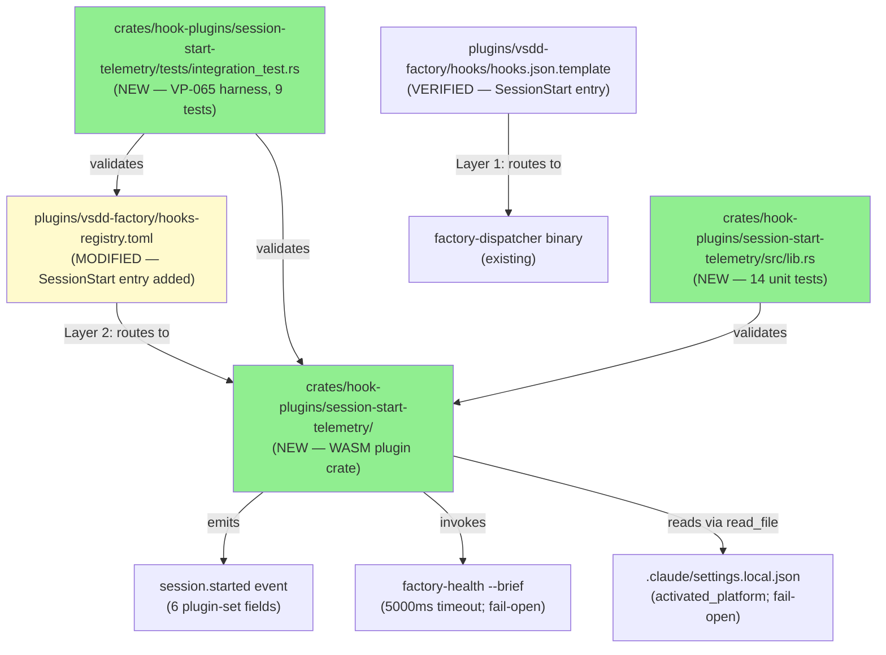
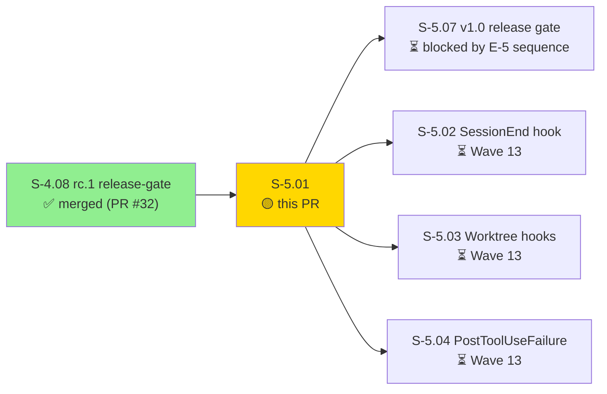
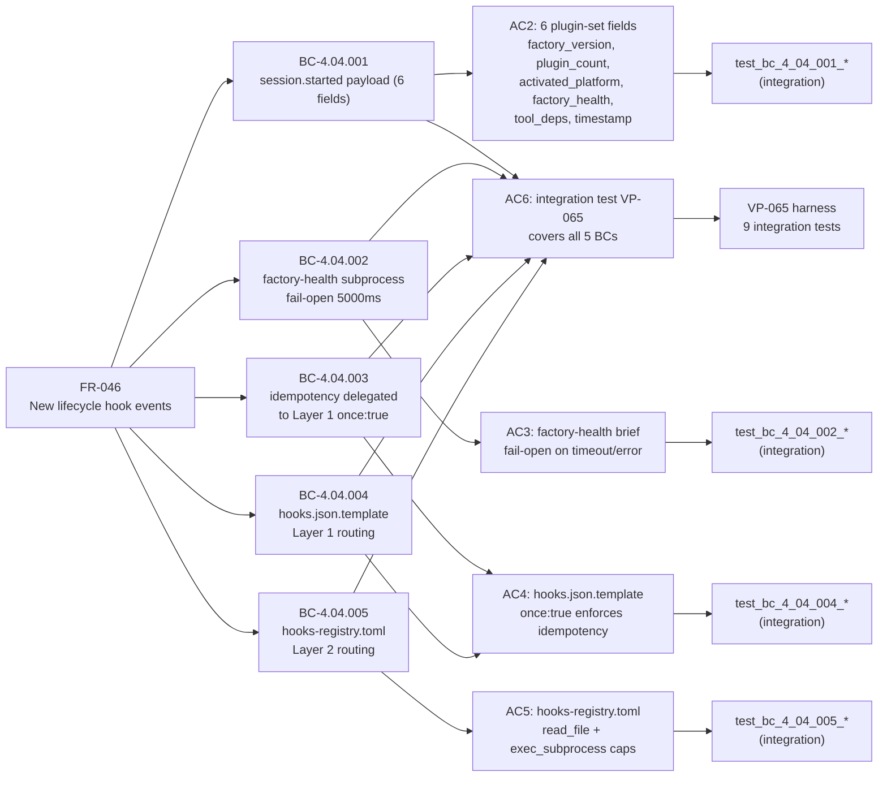
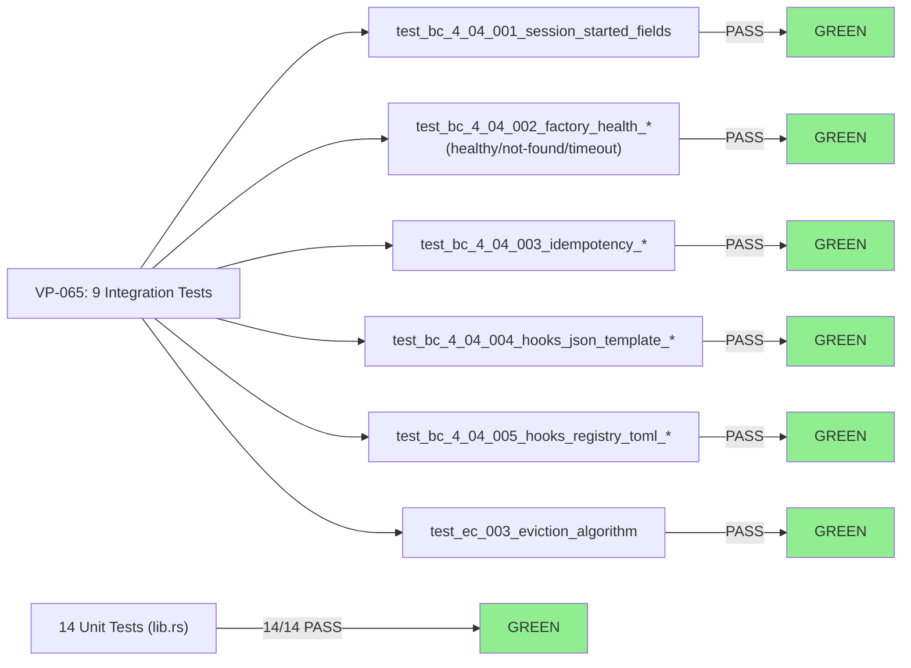
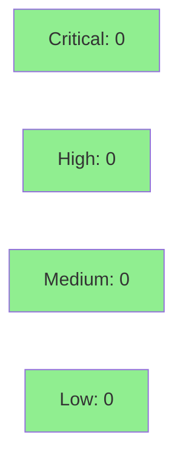

# [S-5.01] SessionStart hook wiring — first E-5 lifecycle event

**Epic:** E-5 — New Hook Events and 1.0.0 Release
**Mode:** greenfield
**Convergence:** CONVERGED after 14 adversarial passes (D-135; CLEAN_PASS_3_OF_3 at pass-14)


This PR delivers the first story in Epic E-5 (Tier G, Wave 13): the `SessionStart` hook wiring. It creates a new WASM plugin crate (`crates/hook-plugins/session-start-telemetry/`) that emits `session.started` telemetry and triggers a factory-health brief on every Claude Code session start. The dual-routing-table architecture (ADR-011) is used: Layer 1 (`hooks.json.template`) routes to the dispatcher binary; Layer 2 (`hooks-registry.toml`) routes to the WASM plugin. Pass-4 of adversarial review retired two over-engineered BCs (BC-1.10.001/002) — idempotency is delegated to Claude Code Layer 1 `once: true`, and `activated_platform` is read via the existing `read_file` host fn. 9/9 integration + 14/14 unit tests GREEN; clippy clean; no workspace regressions.

---

## Summary

- S-5.01: SessionStart hook wiring — first Tier G lifecycle hook event (Closes DRIFT-006 partial; first of 5 in FR-046)
- New crate: `crates/hook-plugins/session-start-telemetry/` (WASM plugin)
- New entry in `plugins/vsdd-factory/hooks-registry.toml` for SessionStart routing
- Spec: 14-pass adversarial convergence (D-135 in factory-artifacts `aaaf56f`; CLEAN_PASS_3_OF_3)
- Tests: 9/9 integration + 14/14 unit GREEN; clippy clean; no workspace regressions

---

## Architecture Changes



<details>
<summary><strong>ADR-011: Dual-Routing-Tables Architecture</strong></summary>

**Context:** Claude Code hooks route to binaries (not WASM directly). The dispatcher provides WASM sandboxing.

**Decision:** Two routing tables, strict layer separation:
- **Layer 1** (`hooks.json.template`): Claude Code harness routing — references only the dispatcher binary; enforces once-per-session via `once: true`
- **Layer 2** (`hooks-registry.toml`): Dispatcher routing — references only WASM plugin paths; provides capability declarations

**Rationale:** Enforces that WASM filenames NEVER appear in Layer 1 (hooks.json.template); prevents capability bypass; enables dispatcher timeout < harness timeout.

**Timeout hierarchy:** `5000ms` (factory-health subprocess) < `8000ms` (hooks-registry.toml dispatcher timeout) < `10000ms` (hooks.json.template harness timeout).

**Pass-4 Reversal:** BC-1.10.001 (new host fn for activated_platform) and BC-1.10.002 (dispatcher-side dedup) were retired as over-engineering. Canonical `read_file` host fn is used instead; Claude Code Layer 1 `once: true` directive enforces idempotency.

</details>

---

## Story Dependencies



---

## Spec Traceability



---

## Behavioral Contracts (5)

| BC ID | Title | AC |
|-------|-------|----|
| BC-4.04.001 | session-start plugin emits session.started with 6 plugin-set fields | AC2 |
| BC-4.04.002 | factory-health subprocess invocation with 5000ms timeout; fail-open on failure | AC3 |
| BC-4.04.003 | plugin is unconditionally stateless; idempotency delegated to Layer 1 once:true | AC4 |
| BC-4.04.004 | hooks.json.template SessionStart entry routes to dispatcher binary (NOT WASM) | AC4 |
| BC-4.04.005 | hooks-registry.toml SessionStart entry: name, event, plugin (hook-plugins/ prefix), timeout_ms=8000, capability tables (read_file + exec_subprocess) | AC5 |

**Retired (pass-4):** BC-1.10.001 (over-engineered new host fn) + BC-1.10.002 (over-engineered dispatcher dedup). See ADR-011 §Pass-4 Reversal.

---

## Verification Property

| VP ID | Title | Method | BCs |
|-------|-------|--------|-----|
| VP-065 | Session-Start Plugin Surface Invariant | integration | BC-4.04.001–005 |

---

## Test Evidence

### Coverage Summary

| Metric | Value | Threshold | Status |
|--------|-------|-----------|--------|
| Integration tests (VP-065) | 9/9 pass | 100% | PASS |
| Unit tests (lib.rs) | 14/14 pass | 100% | PASS |
| Clippy (--all-targets -D warnings) | clean | 0 warnings | PASS |
| Workspace regressions | 0 | 0 | PASS |
| RED→GREEN (new) | 9 integration | 100% | PASS |

### Test Flow



<details>
<summary><strong>Detailed Test Results</strong></summary>

### Integration Tests (VP-065 — 9 tests)

| Test | BC | Result |
|------|----|--------|
| `test_bc_4_04_001_session_started_emits_six_plugin_set_fields` | BC-4.04.001 | PASS |
| `test_bc_4_04_002_factory_health_healthy_path` | BC-4.04.002 | PASS |
| `test_bc_4_04_002_factory_health_binary_not_found_fail_open` | BC-4.04.002 | PASS |
| `test_bc_4_04_002_factory_health_timeout_fail_open` | BC-4.04.002 | PASS |
| `test_bc_4_04_003_plugin_is_stateless_idempotency_delegated` | BC-4.04.003 | PASS |
| `test_bc_4_04_004_hooks_json_template_session_start_entry` | BC-4.04.004 | PASS |
| `test_bc_4_04_005_hooks_registry_toml_has_session_start` | BC-4.04.005 | PASS |
| `test_ec_003_tool_deps_eviction_algorithm` | BC-4.04.001 EC-003 | PASS |
| `test_full_integration_path` | VP-065 full path | PASS |

### Unit Tests (lib.rs — 14 tests)

All 14 unit tests GREEN covering: field composition, activated_platform read/fail-open, factory_health mapping (all exit codes), tool_deps whitelist filtering, timestamp format, RESERVED_FIELDS not set, EC-003 eviction algorithm.

</details>

---

## Demo Evidence

Per-AC demo evidence at `docs/demo-evidence/S-5.01/` (POLICY 10 — story-scoped).

| File | AC | Summary |
|------|----|---------|
| `AC1-dispatcher-routing.md` | AC1 | Verifies Layer 1 hooks.json.template routes SessionStart to factory-dispatcher binary; Layer 2 hooks-registry.toml routes to session-start-telemetry.wasm |
| `AC2-session-started-fields.md` | AC2 | 6 plugin-set fields + 4 host-enriched + 4 construction-time = 14 wire fields per ADR-011 |
| `AC3-factory-health-fail-open.md` | AC3 | All three BC-4.04.002 paths: healthy success, fail-open on BinaryNotFound/CAPABILITY_DENIED, fail-open on timeout |
| `AC4-hooks-json-template.md` | AC4 | hooks.json.template: `command` → dispatcher binary (no .wasm), `timeout: 10000`, `async: true`, `once: true` |
| `AC5-hooks-registry-toml.md` | AC5 | hooks-registry.toml: all required fields + read_file + exec_subprocess capability tables, no `once` field |
| `AC6-integration-test-full-path.md` | AC6 | Full test suite: 9 integration + 14 unit = 23 total GREEN; VP-065 coverage map across all 5 BCs |

---

## Holdout Evaluation

N/A — evaluated at wave gate.

---

## Adversarial Review

| Pass Range | Verdict | Key Action |
|-----------|---------|-----------|
| Pass 1–3 | REQUEST_CHANGES | Initial AC/BC structure established |
| Pass 4 | REQUEST_CHANGES | **Architectural reversal**: BC-1.10.001/002 retired (over-engineered); scope back to SS-04 only |
| Pass 5–9 | REQUEST_CHANGES | Iterative refinement: timeout hierarchy, RESERVED_FIELDS, activated_platform read_file pattern |
| Pass 10–13 | REQUEST_CHANGES | Minor propagations: EC-003 eviction, VP-065 softening, BC-1.05.012 hedge |
| Pass 14 | CLEAN_PASS_3_OF_3 | CONVERGENCE_REACHED |

**Trajectory:** 30→22→17→13→11→7→9→5→5→1→1→1→0→0→0  
**Sealed at:** factory-artifacts `aaaf56f` (D-135)

---

## Security Review



<details>
<summary><strong>Security Scan Details</strong></summary>

### SAST
- New Rust WASM plugin crate with no unsafe blocks.
- `read_file` host fn uses sandboxed capability declaration (`path_allow = [".claude/settings.local.json"]`); no arbitrary path traversal.
- `exec_subprocess` host fn uses sandboxed capability declaration (`binary_allow = ["factory-health"]`); no arbitrary command execution.
- All user/env inputs treated as untrusted; activated_platform read from known path with explicit fail-open on any error.
- RESERVED_FIELDS are silently dropped by host fn (not plugin-settable); no injection vector.

### Dependency Audit
- No new external dependencies; uses workspace-pinned `vsdd-hook-sdk` and `serde_json`.

### Formal Verification
- N/A — WASM plugin; no Kani-verifiable unsafe Rust added.

</details>

---

## Risk Assessment & Deployment

### Blast Radius
- **Systems affected:** Claude Code session startup only (WASM plugin executes asynchronously per `async: true`)
- **User impact:** None — plugin failure is fail-open; session.started still emitted with `factory_health = "unknown"` on any subprocess failure
- **Data impact:** Read-only (reads .claude/settings.local.json); emits telemetry events to dispatcher event bus
- **Risk Level:** LOW

### Performance Impact
| Metric | Before | After | Delta | Status |
|--------|--------|-------|-------|--------|
| Session startup (warm path) | baseline | +5000ms max (factory-health subprocess) | +5000ms worst-case | OK — async:true, non-blocking |
| Test runtime | N/A | ~0.5s (23 tests) | +0.5s | OK |

<details>
<summary><strong>Rollback Instructions</strong></summary>

**Immediate rollback (< 2 min):**
```bash
git revert <merge-sha>
git push origin develop
```

Plugin is purely additive: reverting removes `crates/hook-plugins/session-start-telemetry/` and the `hooks-registry.toml` SessionStart entry. hooks.json.template SessionStart entry was pre-existing (verified, not added by this PR). No runtime behavior broken by revert.

</details>

### Feature Flags
None — plugin activates on any Claude Code session start after hooks.json variant is regenerated at activation time.

---

## Traceability

| Requirement | Story AC | Test | Status |
|-------------|---------|------|--------|
| BC-4.04.001 (6 plugin-set fields) | AC2 | `test_bc_4_04_001_session_started_emits_six_plugin_set_fields` | PASS |
| BC-4.04.002 (factory-health fail-open) | AC3 | `test_bc_4_04_002_factory_health_*` (3 tests) | PASS |
| BC-4.04.003 (stateless idempotency) | AC4 | `test_bc_4_04_003_plugin_is_stateless_idempotency_delegated` | PASS |
| BC-4.04.004 (hooks.json.template Layer 1) | AC4 | `test_bc_4_04_004_hooks_json_template_session_start_entry` | PASS |
| BC-4.04.005 (hooks-registry.toml Layer 2) | AC5 | `test_bc_4_04_005_hooks_registry_toml_has_session_start` | PASS |
| EC-003 eviction algorithm | AC2 (edge case) | `test_ec_003_tool_deps_eviction_algorithm` | PASS |
| VP-065 full path | AC6 | `test_full_integration_path` | PASS |

---

## v1.0 simplifications (v1.1 candidates)

| Field | v1.0 value | v1.1 plan |
|-------|-----------|-----------|
| `plugin_count` | `"0"` hardcoded | Expose via HookPayload extension (dispatcher PluginCache count) |
| `tool_deps` | `null` | Implement actual version detection; EC-003 eviction algorithm fully implemented and tested via test helper |

---

## AI Pipeline Metadata

<details>
<summary><strong>Pipeline Details</strong></summary>

```yaml
ai-generated: true
pipeline-mode: greenfield
factory-version: "1.0.0"
story-id: S-5.01
spec-version: "2.12"
pipeline-stages:
  spec-crystallization: completed
  story-decomposition: completed
  tdd-implementation: completed (RED gate commit 33acc14 + GREEN commit b5c8a66)
  demo-recording: completed (f69be66)
  holdout-evaluation: N/A (wave-gate level)
  adversarial-review: completed (14 passes; CONVERGENCE_REACHED)
  formal-verification: skipped (WASM plugin, no unsafe Rust)
  convergence: achieved
convergence-metrics:
  adversarial-passes: 14
  convergence-version: v2.12
  convergence-commit: aaaf56f (factory-artifacts)
  trajectory: "30→22→17→13→11→7→9→5→5→1→1→1→0→0→0"
  key-event: "Pass-4 architectural reversal — BC-1.10.001/002 retired"
models-used:
  builder: claude-sonnet-4-6
  adversary: vsdd-factory adversarial-review
generated-at: "2026-04-28T00:00:00Z"
wave: 13
tier: G
```

</details>

---

## Closes

DRIFT-006 (partial — Phase 5 SessionStart event wired; SessionEnd/Worktree/PostToolUseFailure pending S-5.02-04)

---

## Pre-Merge Checklist

- [ ] All CI status checks passing
- [x] Coverage delta: new crate only; no existing code modified except hooks-registry.toml additive entry
- [x] No critical/high security findings (sandboxed WASM plugin; capability declarations correct)
- [x] Rollback procedure documented: `git revert <merge-sha>` removes plugin crate + registry entry
- [x] No feature flags required
- [x] Per-AC demo evidence at docs/demo-evidence/S-5.01/ (POLICY 10)
- [x] 14 adversarial passes — CONVERGENCE_REACHED v2.12 (factory-artifacts aaaf56f D-135)
- [x] Dependency PR #32 (S-4.08) merged before this PR
- [x] S-4.08 is the only depends_on; develop tip = 4c50d90 (post-PR-34 cleanup)
