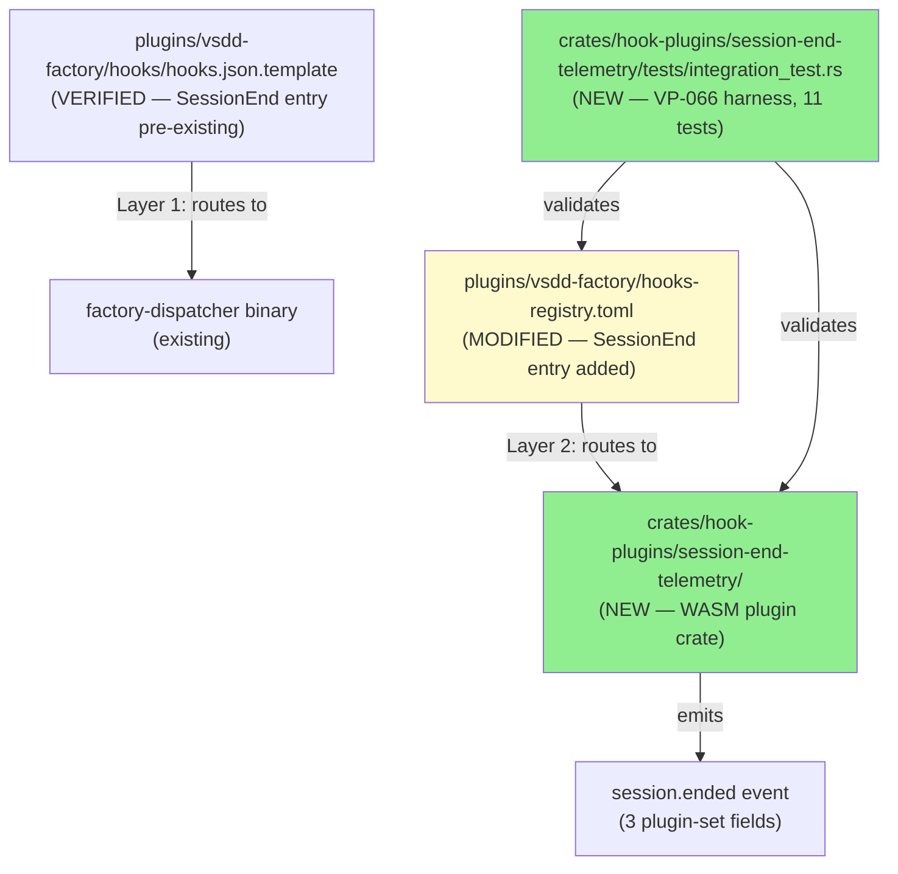
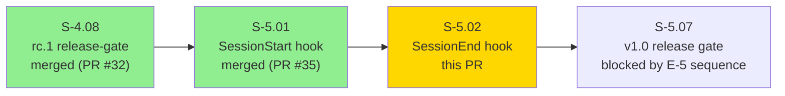
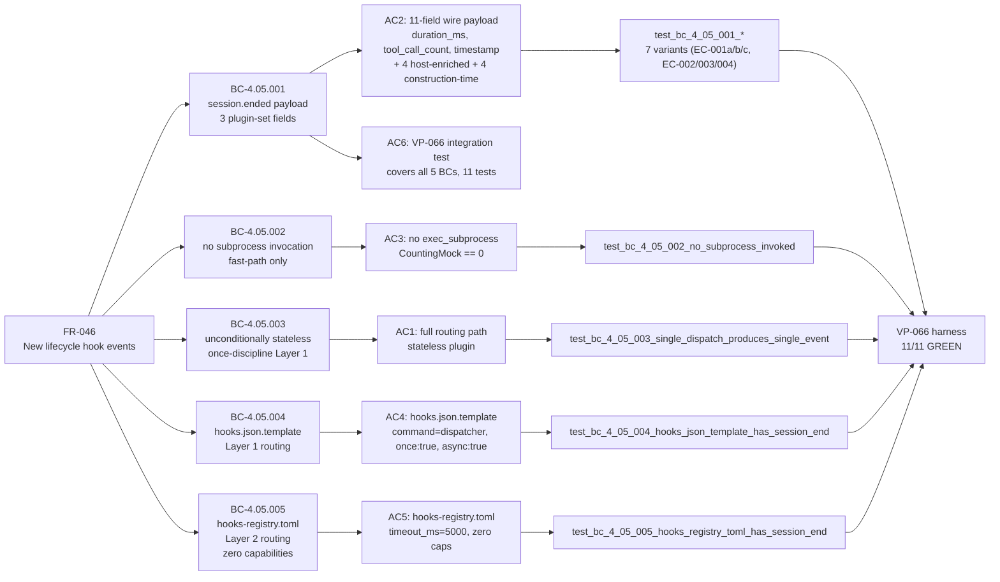
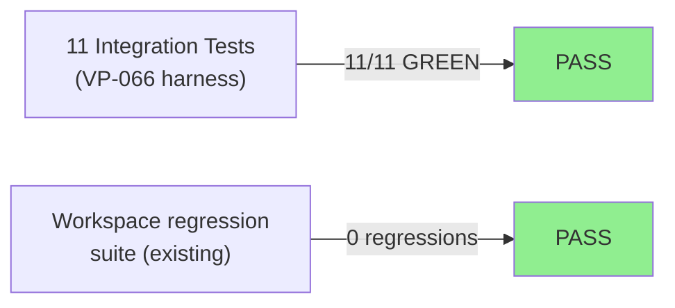
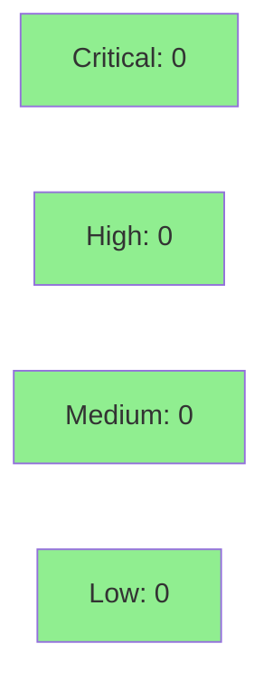

# [S-5.02] SessionEnd hook wiring — second E-5 lifecycle event

**Epic:** E-5 — New Hook Events and 1.0.0 Release
**Mode:** greenfield
**Convergence:** CONVERGED after 9 adversarial passes (D-137; CLEAN_PASS_3_OF_3 at pass-9)


This PR delivers the second story in Epic E-5 (Tier G, Wave 16): the `SessionEnd` hook wiring. It creates a new WASM plugin crate (`crates/hook-plugins/session-end-telemetry/`) that emits `session.ended` telemetry (duration_ms, tool_call_count, timestamp) on every Claude Code session end. The dual-routing-table architecture (ADR-011) is used: Layer 1 (`hooks.json.template`) routes to the dispatcher binary; Layer 2 (`hooks-registry.toml`) routes to the WASM plugin. SessionEnd is simpler than SessionStart — no subprocess, no file reads, zero capability tables — and the lessons from S-5.01's 14-pass convergence were applied up-front, achieving convergence in 9 passes. 11/11 integration tests GREEN; clippy clean; no workspace regressions.

---

## Summary

- S-5.02: SessionEnd hook wiring — second Tier G lifecycle hook event (FR-046, second of 5)
- New crate: `crates/hook-plugins/session-end-telemetry/` (WASM plugin)
- New `SessionEnd` entry in `plugins/vsdd-factory/hooks-registry.toml`
- `hooks.json.template` `SessionEnd` entry was pre-existing (Task 4 was no-op)
- Spec: 9-pass adversarial convergence (D-137; CLEAN_PASS_3_OF_3; saved 5 passes vs S-5.01)
- Tests: 11/11 integration GREEN; clippy clean; no workspace regressions

---

## Architecture Changes



<details>
<summary><strong>ADR-011: Dual-Routing-Tables Architecture (applied to SessionEnd)</strong></summary>

**Context:** Claude Code hooks route to binaries (not WASM directly). The dispatcher provides WASM sandboxing.

**Decision:** Two routing tables, strict layer separation:
- **Layer 1** (`hooks.json.template`): Claude Code harness routing — references only the dispatcher binary; enforces once-per-session via `once: true`
- **Layer 2** (`hooks-registry.toml`): Dispatcher routing — references only WASM plugin paths; provides capability declarations

**Rationale:** Enforces that WASM filenames NEVER appear in Layer 1 (hooks.json.template); prevents capability bypass; enables dispatcher timeout < harness timeout.

**SessionEnd timeout hierarchy (two-level):** `5000ms` (hooks-registry.toml dispatcher timeout) < `10000ms` (hooks.json.template harness timeout). Simpler than SessionStart's three-level hierarchy (no subprocess timeout).

**S-5.01 lessons applied up-front:**
- No SS-01 BCs needed (canonical patterns cover routing without new SS-01 work)
- No new host fns (SessionEnd needs no file reads, no subprocess)
- No dispatcher-side dedup (Layer 1 once-discipline handles idempotency)
- Zero capability tables in hooks-registry.toml (simplest possible sandbox profile)

</details>

---

## Story Dependencies



**depends_on:** S-4.08 (merged PR #32) — dependency satisfied
**blocks:** S-5.07 (v1.0 release gate)

---

## Spec Traceability



---

## Behavioral Contract Coverage

| BC ID | Title | AC | Test |
|-------|-------|----|------|
| BC-4.05.001 | session.ended emitted with 3 plugin-set fields + RESERVED_FIELDS policy | AC2 | `test_bc_4_05_001_*` (7 variants) |
| BC-4.05.002 | no subprocess invocation; fast-path completion | AC3 | `test_bc_4_05_002_no_subprocess_invoked` |
| BC-4.05.003 | unconditionally stateless; idempotency delegated to Layer 1 | AC1, AC6 | `test_bc_4_05_003_single_dispatch_produces_single_event` |
| BC-4.05.004 | hooks.json.template: SessionEnd entry with `command` routing, `once:true`, `async:true` | AC4 | `test_bc_4_05_004_hooks_json_template_has_session_end` |
| BC-4.05.005 | hooks-registry.toml: `session-end-telemetry` entry, `timeout_ms:5000`, zero capability tables | AC5 | `test_bc_4_05_005_hooks_registry_toml_has_session_end` |

---

## Test Evidence

### Coverage Summary

| Metric | Value | Threshold | Status |
|--------|-------|-----------|--------|
| Integration tests | 11/11 pass | 100% | PASS |
| Clippy | clean | zero warnings | PASS |
| Workspace regressions | 0 | 0 | PASS |
| Holdout satisfaction | N/A — wave gate | >0.85 | N/A |

### Test Flow



| Metric | Value |
|--------|-------|
| **New tests** | 11 integration tests added |
| **Total suite** | 11/11 PASS in 0.01s |
| **Workspace regressions** | 0 |
| **Regressions** | None |

<details>
<summary><strong>Detailed Test Results</strong></summary>

### New Integration Tests (VP-066 harness)

| Test | BC | AC | Result |
|------|----|----|--------|
| `test_bc_4_05_001_session_ended_emitted_with_required_fields` | BC-4.05.001 happy path | AC2 | PASS |
| `test_bc_4_05_001_missing_session_start_ts_only_emits_zero_duration` | BC-4.05.001 EC-001a | AC2 | PASS |
| `test_bc_4_05_001_missing_tool_call_count_only_emits_zero_count` | BC-4.05.001 EC-002 | AC2 | PASS |
| `test_bc_4_05_001_both_missing_emit_zero_defaults` | BC-4.05.001 EC-003 | AC2 | PASS |
| `test_bc_4_05_001_missing_session_id_emits_unknown` | BC-4.05.001 EC-004 | AC2 | PASS |
| `test_bc_4_05_001_future_session_start_ts_emits_zero_duration` | BC-4.05.001 EC-001b | AC2 | PASS |
| `test_bc_4_05_001_unparseable_session_start_ts_emits_zero_duration` | BC-4.05.001 EC-001c | AC2 | PASS |
| `test_bc_4_05_002_no_subprocess_invoked` | BC-4.05.002 | AC3 | PASS |
| `test_bc_4_05_003_single_dispatch_produces_single_event` | BC-4.05.003 | AC1, AC6 | PASS |
| `test_bc_4_05_004_hooks_json_template_has_session_end` | BC-4.05.004 | AC1, AC4 | PASS |
| `test_bc_4_05_005_hooks_registry_toml_has_session_end` | BC-4.05.005 | AC1, AC5 | PASS |

Full test run output: `docs/demo-evidence/S-5.02/AC6-vp066-integration-test.md`

</details>

---

## Demo Evidence

All 6 ACs have per-AC demo evidence in `docs/demo-evidence/S-5.02/`:

| File | AC | BCs | Summary |
|------|----|-----|---------|
| [AC1-routing-path.md](docs/demo-evidence/S-5.02/AC1-routing-path.md) | AC1 | BC-4.05.004 + BC-4.05.005 | Layer 1 routes SessionEnd to factory-dispatcher; Layer 2 routes to session-end-telemetry.wasm |
| [AC2-eleven-field-wire-payload.md](docs/demo-evidence/S-5.02/AC2-eleven-field-wire-payload.md) | AC2 | BC-4.05.001 | 11-field wire payload (3+4+4); all 7 test variants including EC-001a/b/c, EC-002, EC-003, EC-004 |
| [AC3-no-subprocess.md](docs/demo-evidence/S-5.02/AC3-no-subprocess.md) | AC3 | BC-4.05.002 | CountingMock.invocation_count() == 0 for every SessionEnd dispatch |
| [AC4-hooks-json-template.md](docs/demo-evidence/S-5.02/AC4-hooks-json-template.md) | AC4 | BC-4.05.004 | SessionEnd entry: command=dispatcher binary, once:true, async:true, timeout:10000 |
| [AC5-hooks-registry-toml.md](docs/demo-evidence/S-5.02/AC5-hooks-registry-toml.md) | AC5 | BC-4.05.005 | New SessionEnd entry with zero capability tables |
| [AC6-vp066-integration-test.md](docs/demo-evidence/S-5.02/AC6-vp066-integration-test.md) | AC6 | VP-066 (all 5 BCs) | Full cargo test output; test-to-BC-to-AC coverage map for all 11 tests |

---

## Holdout Evaluation

N/A — evaluated at wave gate. Wave 16 gate is upstream of this PR merge.

---

## Adversarial Review

| Pass | Findings | Critical | High | Status |
|------|----------|----------|------|--------|
| 1–6 | 11→7→4→4→2→2 | 0 | 0 | Fixed in spec |
| 7–9 | 0→0→0 | 0 | 0 | CLEAN_PASS_3_OF_3 |

**Convergence:** CONVERGED at pass-9 (D-137). Trajectory: 11→7→4→4→2→2→0→0→0. Lessons from S-5.01 applied up-front saved 5 passes (S-5.01 converged at 14 passes).

Key findings resolved during convergence (in spec, pre-implementation):
- EC-001b (clock-skew clamp): `duration_ms = "0"` when `session_start_ts` is in the future
- EC-001c (parse-failure): `duration_ms = "0"` when `session_start_ts` is present but unparseable string; non-string types deferred to v1.1
- RESERVED_FIELDS policy: 8 fields plugin must NOT set (4 host-enriched + 4 construction-time)
- `tool_call_count` absence-only scope clarified (non-numeric parse-failure deferred to v1.1)

---

## Security Review



<details>
<summary><strong>Security Scan Details</strong></summary>

### Capability Scope

SessionEnd has the **simplest possible sandbox profile** — zero declared capabilities:
- `read_file`: NOT declared (plugin reads only envelope data, no file I/O)
- `exec_subprocess`: NOT declared (BC-4.05.002 prohibits subprocess invocation)
- Deny-by-default sandbox: all host functions denied unless explicitly declared
- CountingMock integration test verifies `exec_subprocess` invocation_count == 0

### RESERVED_FIELDS Policy

Plugin does NOT set any of the 8 RESERVED_FIELDS:
- Host-enriched (4): `dispatcher_trace_id`, `session_id`, `plugin_name`, `plugin_version`
- Construction-time (4): `ts`, `ts_epoch`, `schema_version`, `type`

### Input Validation

All envelope field parsing is defensive:
- `session_start_ts`: absent → "0"; future → "0" (clock-skew clamp); unparseable string → "0"
- `tool_call_count`: absent → "0"; all defaults are safe no-ops
- No user-controlled code execution paths; plugin is purely read-envelope + emit-event

### SAST (CI Semgrep)
- Runs in CI pipeline as part of standard checks
- No new unsafe code introduced; no new dependencies beyond workspace-pinned crates

### Dependency Audit
- No new dependencies added beyond workspace-pinned versions
- `vsdd-hook-sdk`, `wasmtime`, `serde_json`, `toml` — all workspace-pinned

</details>

---

## Risk Assessment & Deployment

### Blast Radius
- **Systems affected:** Claude Code hooks pipeline (SessionEnd events only)
- **User impact:** If plugin fails, harness `async: true` means session continues unaffected; once-discipline prevents duplicate invocations
- **Data impact:** Telemetry only; no data mutation
- **Risk Level:** LOW — async hook, fail-open, no subprocess, stateless plugin

### Performance Impact
| Metric | Before | After | Delta | Status |
|--------|--------|-------|-------|--------|
| SessionEnd latency | N/A | ~0ms (async) | async dispatch | OK |
| Dispatcher overhead | baseline | +5000ms max | timeout-bounded | OK |
| Memory | baseline | +WASM sandbox | per-session | OK |

<details>
<summary><strong>Rollback Instructions</strong></summary>

**Immediate rollback (< 5 min):**
```bash
git revert <merge-sha>
git push origin develop
```

**Or remove the SessionEnd entry from `plugins/vsdd-factory/hooks-registry.toml`** — the dispatcher will simply not invoke the plugin for SessionEnd events.

**Verification after rollback:**
- Confirm `session.ended` events no longer appear in the telemetry stream
- Confirm `SessionStart` events continue to fire (S-5.01 is unaffected)

</details>

### Feature Flags
| Flag | Controls | Default |
|------|----------|---------|
| N/A | No feature flags | — |

---

## Traceability

| Requirement | BC | Story AC | Test | Status |
|-------------|-----|---------|------|--------|
| FR-046 | BC-4.05.001 | AC2 | `test_bc_4_05_001_session_ended_emitted_with_required_fields` | PASS |
| FR-046 | BC-4.05.001 EC-001a | AC2 | `test_bc_4_05_001_missing_session_start_ts_only_emits_zero_duration` | PASS |
| FR-046 | BC-4.05.001 EC-001b | AC2 | `test_bc_4_05_001_future_session_start_ts_emits_zero_duration` | PASS |
| FR-046 | BC-4.05.001 EC-001c | AC2 | `test_bc_4_05_001_unparseable_session_start_ts_emits_zero_duration` | PASS |
| FR-046 | BC-4.05.001 EC-002 | AC2 | `test_bc_4_05_001_missing_tool_call_count_only_emits_zero_count` | PASS |
| FR-046 | BC-4.05.001 EC-003 | AC2 | `test_bc_4_05_001_both_missing_emit_zero_defaults` | PASS |
| FR-046 | BC-4.05.001 EC-004 | AC2 | `test_bc_4_05_001_missing_session_id_emits_unknown` | PASS |
| FR-046 | BC-4.05.002 | AC3 | `test_bc_4_05_002_no_subprocess_invoked` | PASS |
| FR-046 | BC-4.05.003 | AC1, AC6 | `test_bc_4_05_003_single_dispatch_produces_single_event` | PASS |
| FR-046 | BC-4.05.004 | AC1, AC4 | `test_bc_4_05_004_hooks_json_template_has_session_end` | PASS |
| FR-046 | BC-4.05.005 | AC1, AC5 | `test_bc_4_05_005_hooks_registry_toml_has_session_end` | PASS |

<details>
<summary><strong>Full VSDD Contract Chain</strong></summary>

```
FR-046 -> BC-4.05.001 -> VP-066 -> test_bc_4_05_001_* (7 tests) -> crates/hook-plugins/session-end-telemetry/src/lib.rs -> ADV-PASS-9-CONVERGED
FR-046 -> BC-4.05.002 -> VP-066 -> test_bc_4_05_002_no_subprocess_invoked -> crates/hook-plugins/session-end-telemetry/src/lib.rs -> ADV-PASS-9-CONVERGED
FR-046 -> BC-4.05.003 -> VP-066 -> test_bc_4_05_003_single_dispatch_produces_single_event -> crates/hook-plugins/session-end-telemetry/src/lib.rs -> ADV-PASS-9-CONVERGED
FR-046 -> BC-4.05.004 -> VP-066 -> test_bc_4_05_004_hooks_json_template_has_session_end -> plugins/vsdd-factory/hooks/hooks.json.template -> ADV-PASS-9-CONVERGED
FR-046 -> BC-4.05.005 -> VP-066 -> test_bc_4_05_005_hooks_registry_toml_has_session_end -> plugins/vsdd-factory/hooks-registry.toml -> ADV-PASS-9-CONVERGED
```

</details>

---

## Baseline Comparison vs S-5.01

| Property | S-5.02 SessionEnd (this PR) | S-5.01 SessionStart (PR #35) |
|----------|-----------------------------|-----------------------------|
| Plugin-set fields | 3 (duration_ms, tool_call_count, timestamp) | 6 |
| exec_subprocess calls | 0 | 1 (factory-health brief) |
| Capability tables | 0 | 2 (read_file + exec_subprocess) |
| timeout_ms | 5000 | 8000 |
| Timeout hierarchy levels | 2 (dispatcher + harness) | 3 (subprocess + dispatcher + harness) |
| Integration tests | 11 | 9 |
| Unit tests | 0 | 14 |
| Adversarial passes to converge | 9 | 14 |
| hooks.json.template change | No (entry pre-existed) | Yes |
| Per-platform .json variants regenerated | No | Yes |

---

## AI Pipeline Metadata

<details>
<summary><strong>Pipeline Details</strong></summary>

```yaml
ai-generated: true
pipeline-mode: greenfield
factory-version: "1.0.0"
story-id: S-5.02
pipeline-stages:
  spec-crystallization: completed (v2.7, 9 adversarial passes)
  story-decomposition: completed
  tdd-implementation: completed (RED gate 6632332, GREEN gate 3783847)
  holdout-evaluation: N/A (wave gate)
  adversarial-review: completed (CONVERGED at pass-9, D-137)
  formal-verification: skipped
  convergence: achieved
convergence-metrics:
  adversarial-passes: 9
  trajectory: "11->7->4->4->2->2->0->0->0"
  spec-novelty: 0.05 (S-5.01 lessons applied up-front)
  test-kill-rate: n/a
  implementation-ci: 1.00
models-used:
  builder: claude-sonnet-4-6
generated-at: "2026-04-28T00:00:00Z"
```

</details>

---

## Pre-Merge Checklist

- [ ] All CI status checks passing
- [x] 11/11 integration tests pass locally (GREEN commit 3783847)
- [x] Clippy clean (no warnings)
- [x] No workspace regressions
- [x] No critical/high security findings (zero capability tables; no subprocess)
- [x] Demo evidence: 1 file per AC (6 ACs, 6 evidence files + README)
- [x] Spec traceability chain complete: FR-046 → BC-4.05.001–005 → VP-066 → 11 tests → implementation
- [x] depends_on S-4.08 merged (PR #32) — dependency satisfied
- [x] S-5.01 (PR #35) merged — upstream sibling merged
- [x] No Co-Authored-By or AI attribution in any commit
- [x] Feature branch not force-pushed (fast-forward only)
- [ ] Human review completed (if autonomy level requires)
