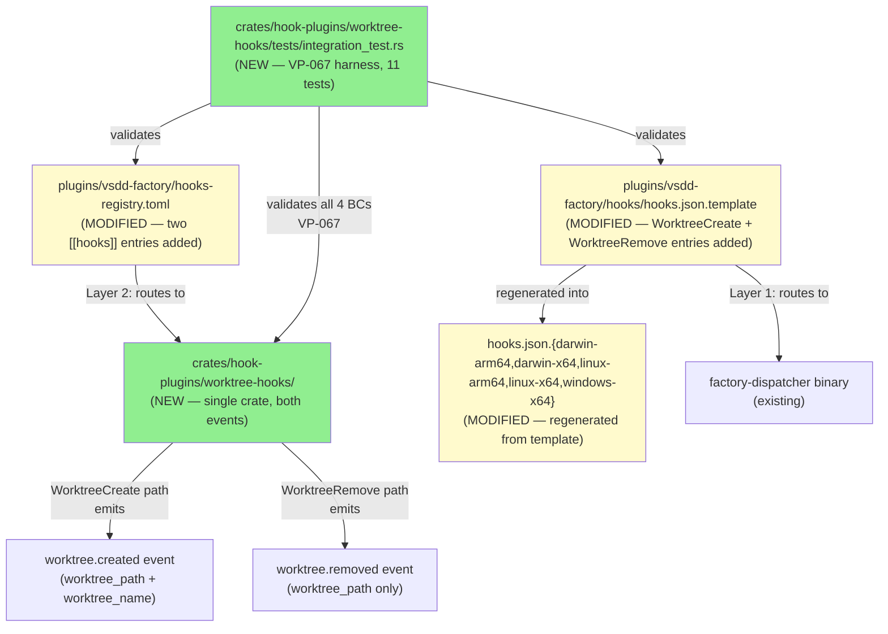
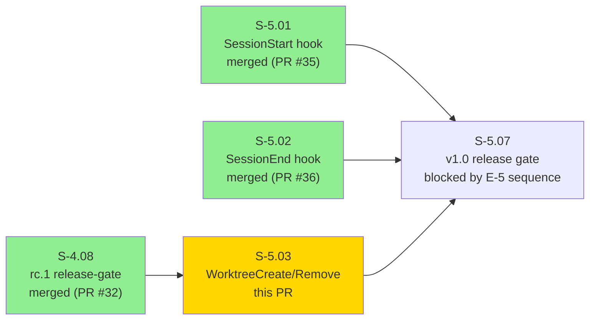
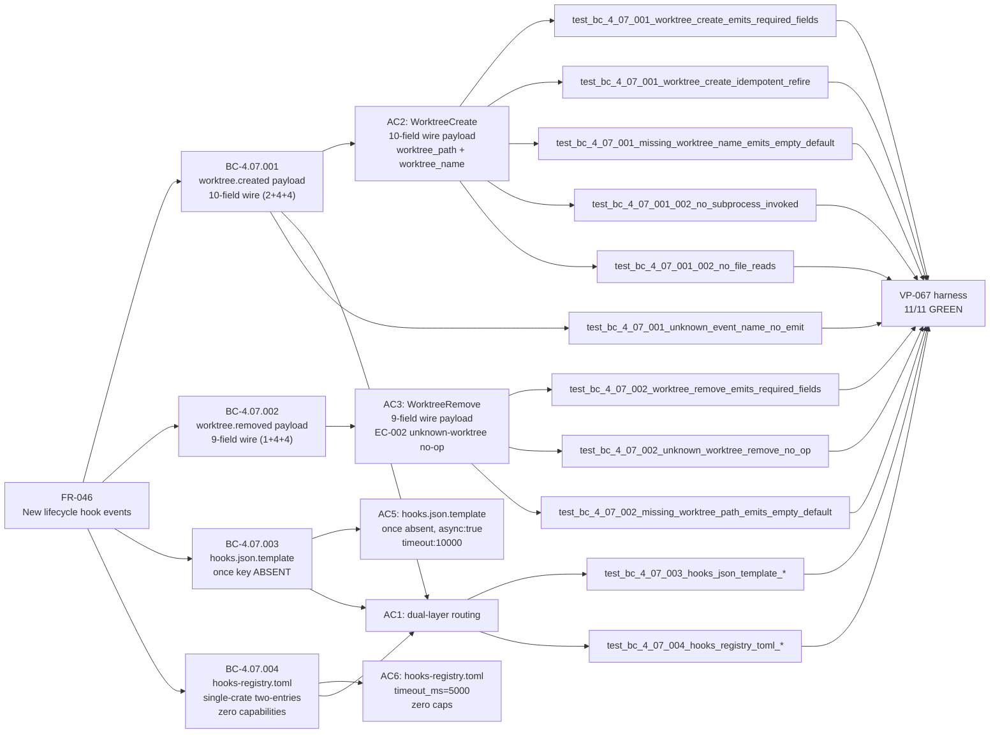
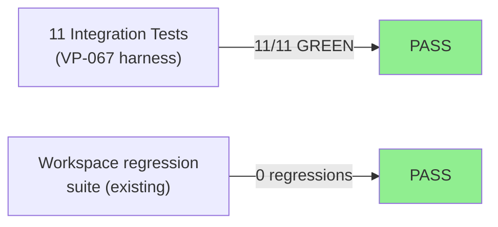
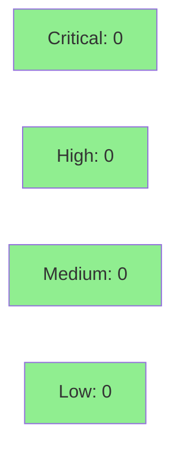

# [S-5.03] WorktreeCreate / WorktreeRemove hook wiring — third E-5 lifecycle event

**Epic:** E-5 — New Hook Events and 1.0.0 Release
**Mode:** greenfield
**Convergence:** CONVERGED after 14 adversarial passes (v2.5; CLEAN_PASS_3_OF_3 at pass-14)


This PR delivers the third story in Epic E-5 (Tier G, Wave 16): wiring of the `WorktreeCreate` and `WorktreeRemove` hook events through the dispatcher to a single shared WASM plugin crate (`crates/hook-plugins/worktree-hooks/`). The plugin emits `worktree.created` (10-field wire payload: 2 plugin-set + 4 host-enriched + 4 construction-time) and `worktree.removed` (9-field wire payload: 1 plugin-set + 4 host-enriched + 4 construction-time). The dual-routing-table architecture (ADR-011) is used throughout: Layer 1 (`hooks.json.template`) routes to the dispatcher binary; Layer 2 (`hooks-registry.toml`) routes to the WASM plugin. Critically, both event entries in `hooks.json.template` carry NO `once` key at all — worktree events can re-fire on Claude Code reconnect (EC-001), unlike session events which use `once: true`. ZERO capabilities declared under Option A scoping (no filesystem writes, no subprocess — all envelope data is sufficient). Single-crate two-entries design: one `worktree-hooks.wasm` handles both events. 11/11 integration tests GREEN; clippy clean; no workspace regressions. Spec reached 14-pass adversarial convergence (matches S-5.01; longer than S-5.02's 9 passes due to deeper architectural reversal at pass-2: 4+3+1 → 4+4 RESERVED_FIELDS grouping for sibling consistency).

---

## Summary

- S-5.03: WorktreeCreate / WorktreeRemove hook wiring — third Tier G lifecycle hook event (FR-046, third of 5)
- New crate: `crates/hook-plugins/worktree-hooks/` (single WASM plugin handles BOTH events via internal dispatch on `event_name`)
- TWO new `[[hooks]]` entries in `plugins/vsdd-factory/hooks-registry.toml` (one per event, both route to `worktree-hooks.wasm`)
- New `WorktreeCreate` + `WorktreeRemove` entries in `plugins/vsdd-factory/hooks/hooks.json.template` (and 5 per-platform variants)
- `once` key COMPLETELY ABSENT from both template entries (differs from session hooks which use `once: true`; defensive omission for re-fire semantics EC-001)
- ZERO declared capabilities: no `read_file`, no `exec_subprocess` (Option A scoping — all data from envelope)
- 14-pass adversarial convergence (matches S-5.01; major milestone: pass-2 HIGH-003 architectural reversal)
- Tests: 11/11 integration GREEN; clippy clean; no workspace regressions

---

## Architecture Changes



<details>
<summary><strong>ADR-011: Dual-Routing-Tables Architecture (applied to WorktreeCreate/Remove)</strong></summary>

**Context:** Claude Code hooks route to binaries (not WASM directly). The dispatcher provides WASM sandboxing.

**Decision:** Two routing tables, strict layer separation:
- **Layer 1** (`hooks.json.template`): Claude Code harness routing — references only the dispatcher binary; `once` key **completely absent** for worktree events (can re-fire on reconnect per EC-001)
- **Layer 2** (`hooks-registry.toml`): Dispatcher routing — references only WASM plugin paths; zero capability declarations (Option A)

**Rationale:** Enforces that WASM filenames NEVER appear in Layer 1 (hooks.json.template); prevents capability bypass; enables dispatcher timeout < harness timeout. The `once` key distinction between session events (absent for worktree) and non-session events is critical: worktree events can re-fire when Claude Code reconnects to an existing worktree; defensive omission (vs `once: false`) protects against future Claude Code parser changes.

**Single-crate two-entries design (BC-4.07.004):** One `worktree-hooks.wasm` handles both `WorktreeCreate` and `WorktreeRemove` via internal dispatch on `event_name`. This differs from S-5.01/S-5.02 which used separate crates per event. Rationale: worktree events are semantically coupled (symmetric create/remove lifecycle); reduces WASM binary count; simplifies registry.

**Option A scoping (zero capabilities):** HOST_ABI v1.0 has no `write_file` host fn. All envelope data is sufficient for both events (`worktree_path` and `worktree_name` from the incoming envelope). No subprocess, no file reads. Deferred: BC-4.07.005-worktree-config-write (v1.1 candidate, requires new `write_file` host fn).

**WorktreeCreate timeout hierarchy (two-level):** `5000ms` (hooks-registry.toml dispatcher timeout) < `10000ms` (hooks.json.template harness timeout). Same as S-5.02 (simpler than S-5.01's three-level hierarchy).

**Pass-2 HIGH-003 architectural reversal:** RESERVED_FIELDS grouping reverted from 4+3+1 split to 4+4 opaque construction-time bucket, restoring sibling consistency with BC-4.04.001 and BC-4.05.001.

</details>

---

## Story Dependencies



**depends_on:** S-4.08 (merged PR #32) — dependency satisfied
**blocks:** S-5.07 (v1.0 release gate)

---

## Spec Traceability



---

## Behavioral Contract Coverage

| BC ID | Title | AC | Test |
|-------|-------|----|------|
| BC-4.07.001 | worktree.created emitted with 10-field wire payload (2 plugin-set + RESERVED_FIELDS policy) | AC2 | `test_bc_4_07_001_worktree_create_emits_required_fields` + 2 EC variants |
| BC-4.07.002 | worktree.removed emitted with 9-field wire payload (1 plugin-set); EC-002 unknown-worktree no-op | AC3 | `test_bc_4_07_002_worktree_remove_emits_required_fields` + 2 EC variants |
| BC-4.07.003 | hooks.json.template: WorktreeCreate + WorktreeRemove entries; `once` key ABSENT; async:true; timeout:10000 | AC1, AC5 | `test_bc_4_07_003_hooks_json_template_has_worktree_create_and_remove` |
| BC-4.07.004 | hooks-registry.toml: single-crate two-entries design; zero capability tables; timeout_ms=5000 | AC1, AC6 | `test_bc_4_07_004_hooks_registry_toml_has_worktree_create_and_remove` |

---

## Test Evidence

### Coverage Summary

| Metric | Value | Threshold | Status |
|--------|-------|-----------|--------|
| Integration tests | 11/11 pass | 100% | PASS |
| Clippy | clean | zero warnings | PASS |
| Workspace regressions | 0 | 0 | PASS |
| Holdout satisfaction | N/A — wave gate | >0.85 | N/A |

### Test Flow



| Metric | Value |
|--------|-------|
| **New tests** | 11 integration tests added |
| **Total suite** | 11/11 PASS |
| **Workspace regressions** | 0 |
| **Regressions** | None |

<details>
<summary><strong>Detailed Test Results (VP-067 harness)</strong></summary>

### New Integration Tests

| Test | BC | AC | Result |
|------|----|----|--------|
| `test_bc_4_07_001_worktree_create_emits_required_fields` | BC-4.07.001 happy path | AC2 | PASS |
| `test_bc_4_07_001_worktree_create_idempotent_refire` | BC-4.07.001 EC-001 (re-fire) | AC2 | PASS |
| `test_bc_4_07_001_missing_worktree_name_emits_empty_default` | BC-4.07.001 EC-003 | AC2 | PASS |
| `test_bc_4_07_002_worktree_remove_emits_required_fields` | BC-4.07.002 happy path | AC3 | PASS |
| `test_bc_4_07_002_unknown_worktree_remove_no_op` | BC-4.07.002 EC-002 | AC3 | PASS |
| `test_bc_4_07_002_missing_worktree_path_emits_empty_default` | BC-4.07.002 EC-003 | AC3 | PASS |
| `test_bc_4_07_001_002_no_subprocess_invoked` | BC-4.07.001 Inv-2 + BC-4.07.002 Inv-2 | AC4 | PASS |
| `test_bc_4_07_001_002_no_file_reads` | BC-4.07.001 Inv-1 + BC-4.07.002 Inv-1 | AC4 | PASS |
| `test_bc_4_07_001_unknown_event_name_no_emit` | BC-4.07.001 dispatch guard | AC2 | PASS |
| `test_bc_4_07_003_hooks_json_template_has_worktree_create_and_remove` | BC-4.07.003 | AC1, AC5 | PASS |
| `test_bc_4_07_004_hooks_registry_toml_has_worktree_create_and_remove` | BC-4.07.004 | AC1, AC6 | PASS |

Full test run output: `docs/demo-evidence/S-5.03/AC6-vp067-integration-test.md`

</details>

---

## Demo Evidence

All 6 ACs have per-AC demo evidence in `docs/demo-evidence/S-5.03/`:

| File | AC | BCs | Summary |
|------|----|-----|---------|
| [AC1-routing-path.md](docs/demo-evidence/S-5.03/AC1-routing-path.md) | AC1 | BC-4.07.003 + BC-4.07.004 | Layer 1 routes both worktree events to factory-dispatcher; Layer 2 routes both to worktree-hooks.wasm |
| [AC2-worktree-create-wire-payload.md](docs/demo-evidence/S-5.03/AC2-worktree-create-wire-payload.md) | AC2 | BC-4.07.001 | 10-field wire payload (2+4+4); `worktree_path` + `worktree_name` plugin-set; EC-001 re-fire + EC-003 missing-name |
| [AC3-worktree-remove-wire-payload.md](docs/demo-evidence/S-5.03/AC3-worktree-remove-wire-payload.md) | AC3 | BC-4.07.002 | 9-field wire payload (1+4+4); EC-002 unknown-worktree no-op + EC-003 missing-path |
| [AC4-hooks-json-template.md](docs/demo-evidence/S-5.03/AC4-hooks-json-template.md) | AC4 (AC5 in spec) | BC-4.07.003 | Both worktree entries: command=dispatcher, `once` key **completely absent**, async:true, timeout:10000 |
| [AC5-hooks-registry-toml.md](docs/demo-evidence/S-5.03/AC5-hooks-registry-toml.md) | AC5 (AC6 in spec) | BC-4.07.004 | TWO `[[hooks]]` entries routing to same `worktree-hooks.wasm`; zero capability tables; no `once` field |
| [AC6-vp067-integration-test.md](docs/demo-evidence/S-5.03/AC6-vp067-integration-test.md) | AC6 | VP-067 (all 4 BCs) | Full `cargo test -p worktree-hooks` output; test-to-BC-to-AC coverage map for all 11 tests |

---

## Holdout Evaluation

N/A — evaluated at wave gate. Wave 16 gate is upstream of this PR merge.

---

## Adversarial Review

| Pass | Findings | Critical | High | Status |
|------|----------|----------|------|--------|
| 1 | 14 | 3 | 6 | Fixed in spec |
| 2 | 15 | 3 | 7 | Fixed — HIGH-003 reversal (4+4 RESERVED_FIELDS grouping) |
| 3–4 | 2→8 | 0→0 | 0→5 | Fixed — sibling sweep (VP-065/066, BC-4.04.001, BC-4.05.001) |
| 5–9 | 4→0→6→6→0 | 0 | 0 | Fixed — once-key sync, EC-004 anchor, PRD FR-046 |
| 10–12 | 1→1→0 | 0 | 0 | Fixed |
| 13–14 | 0→0 | 0 | 0 | CLEAN_PASS_3_OF_3 |

**Convergence:** CONVERGED at pass-14 (v2.5, D-139). Trajectory: 14→15→5→8→4→0→6→6→0→1→1→0→0→0.

Key milestones:
- **Pass-1 CRIT-001:** CAP-003 reference corrected (provisional v1.1 `CAP-NNN-filesystem-write`; CAP-003 is active observability)
- **Pass-2 HIGH-003 architectural reversal:** RESERVED_FIELDS 4+3+1 split reverted to 4+4 opaque construction-time bucket; restored sibling consistency with BC-4.04.001/BC-4.05.001
- **Pass-7:** PRD FR-046 once-key sync propagated
- **Pass-10:** EC-004 anchor corrected (BC-1.05.022 → BC-1.05.001 exec_subprocess deny)
- 14 passes total (matches S-5.01; 5 more than S-5.02's 9 passes — deeper architectural reversal at pass-2 required broader sibling sweeps)

<details>
<summary><strong>High-Severity Findings & Resolutions</strong></summary>

### Pass-2 HIGH-003 (RESERVED_FIELDS split revert)
- **Location:** Story spec, BC-4.07.001/002, VP-067
- **Category:** spec-fidelity
- **Problem:** 4+3+1 split (HostContext vs InternalEvent::now()) exposed internal dispatcher implementation detail from `emit_event.rs` as a public HOST_ABI contract; introduced contradictions with BC-4.04.001/BC-4.05.001 sibling specs
- **Resolution:** Reverted to 4+4 opaque buckets (plugin-set | host-enriched | construction-time); treated construction-time fields as implementation-internal; sibling BCs swept to match
- **Test:** `test_bc_4_07_001_worktree_create_emits_required_fields` (10-field count assertion)

### Pass-1 CRIT-001 (CAP-003 reference correction)
- **Location:** Story spec Option A scoping footnote
- **Category:** spec-fidelity
- **Problem:** "CAP-003 (filesystem-write capability)" — CAP-003 is the active observability capability, not a deferred filesystem-write capability
- **Resolution:** Corrected to "no CAP ID allocated yet; provisional v1.1 name `CAP-NNN-filesystem-write`"

</details>

---

## Security Review



<details>
<summary><strong>Security Scan Details</strong></summary>

### Capability Scope

WorktreeCreate/Remove has the **simplest possible sandbox profile** — zero declared capabilities (identical to S-5.02):
- `read_file`: NOT declared (plugin reads only envelope data; no file I/O under Option A)
- `exec_subprocess`: NOT declared (BC-4.07.001 Inv-2 + BC-4.07.002 Inv-2 prohibit subprocess invocation)
- Deny-by-default sandbox: all host functions denied unless explicitly declared
- CountingMock integration tests verify `exec_subprocess` invocation_count == 0 for BOTH events
- Integration test `test_bc_4_07_001_002_no_file_reads` verifies zero file reads

### RESERVED_FIELDS Policy

Plugin does NOT set any of the 8 RESERVED_FIELDS:
- Host-enriched (4): `dispatcher_trace_id`, `session_id`, `plugin_name`, `plugin_version`
- Construction-time (4): `ts`, `ts_epoch`, `schema_version`, `type`

All plugin-set values are string-coerced per `emit_event.rs:49`.

### Input Validation

All envelope field parsing is defensive:
- `worktree_path`: absent → `""` (empty string default); empty string is valid and passed through
- `worktree_name`: absent → `""` (empty string default; WorktreeCreate only)
- Unknown `event_name` values → no emit (dispatch guard; `test_bc_4_07_001_unknown_event_name_no_emit`)
- No user-controlled code execution paths; plugin is purely read-envelope + emit-event

### No-Subprocess Guarantee

EC-004 (capability deny): even if plugin attempted `exec_subprocess`, the host fn dispatch would return `CAPABILITY_DENIED` (BC-1.05.001 deny-by-default). Integration test CountingMock verifies the plugin does NOT attempt subprocess regardless.

### SAST (CI Semgrep)

- Runs in CI pipeline as part of standard checks
- No new unsafe code introduced; no new dependencies beyond workspace-pinned crates
- Single crate adds no new external dependency surface

### Dependency Audit

- No new dependencies added beyond workspace-pinned versions
- `vsdd-hook-sdk`, `serde_json`, `toml`, `tempfile` — all workspace-pinned

</details>

---

## Risk Assessment & Deployment

### Blast Radius

- **Systems affected:** Claude Code hooks pipeline (WorktreeCreate + WorktreeRemove events only)
- **User impact:** If plugin fails, harness `async: true` means worktree operations continue unaffected; no `once` key means re-fire on reconnect is handled gracefully (EC-001 design intent)
- **Data impact:** Telemetry only; no data mutation
- **Risk Level:** LOW — async hook, fail-open, no subprocess, no file reads, stateless plugin

### Performance Impact

| Metric | Before | After | Delta | Status |
|--------|--------|-------|-------|--------|
| WorktreeCreate latency | N/A | ~0ms (async) | async dispatch | OK |
| WorktreeRemove latency | N/A | ~0ms (async) | async dispatch | OK |
| Dispatcher overhead | baseline | +5000ms max | timeout-bounded | OK |
| Memory | baseline | +WASM sandbox | per-event | OK |

<details>
<summary><strong>Rollback Instructions</strong></summary>

**Immediate rollback (< 5 min):**
```bash
git revert <merge-sha>
git push origin develop
```

**Or remove the WorktreeCreate + WorktreeRemove entries from `plugins/vsdd-factory/hooks-registry.toml`** — the dispatcher will simply not invoke the plugin for those events.

**Or remove `WorktreeCreate` + `WorktreeRemove` keys from `plugins/vsdd-factory/hooks/hooks.json.template`** (and regenerate per-platform variants) — Layer 1 will stop routing those events entirely.

**Verification after rollback:**
- Confirm `worktree.created` and `worktree.removed` events no longer appear in the telemetry stream
- Confirm `SessionStart` and `SessionEnd` events continue to fire (S-5.01/S-5.02 unaffected)

</details>

### Feature Flags

| Flag | Controls | Default |
|------|----------|---------|
| N/A | No feature flags | — |

---

## Traceability

| Requirement | BC | Story AC | Test | Status |
|-------------|-----|---------|------|--------|
| FR-046 | BC-4.07.001 | AC2 | `test_bc_4_07_001_worktree_create_emits_required_fields` | PASS |
| FR-046 | BC-4.07.001 EC-001 | AC2 | `test_bc_4_07_001_worktree_create_idempotent_refire` | PASS |
| FR-046 | BC-4.07.001 EC-003 | AC2 | `test_bc_4_07_001_missing_worktree_name_emits_empty_default` | PASS |
| FR-046 | BC-4.07.002 | AC3 | `test_bc_4_07_002_worktree_remove_emits_required_fields` | PASS |
| FR-046 | BC-4.07.002 EC-002 | AC3 | `test_bc_4_07_002_unknown_worktree_remove_no_op` | PASS |
| FR-046 | BC-4.07.002 EC-003 | AC3 | `test_bc_4_07_002_missing_worktree_path_emits_empty_default` | PASS |
| FR-046 | BC-4.07.001 Inv-2 + BC-4.07.002 Inv-2 | AC4 | `test_bc_4_07_001_002_no_subprocess_invoked` | PASS |
| FR-046 | BC-4.07.001 Inv-1 + BC-4.07.002 Inv-1 | AC4 | `test_bc_4_07_001_002_no_file_reads` | PASS |
| FR-046 | BC-4.07.001 dispatch guard | AC2 | `test_bc_4_07_001_unknown_event_name_no_emit` | PASS |
| FR-046 | BC-4.07.003 | AC1, AC5 | `test_bc_4_07_003_hooks_json_template_has_worktree_create_and_remove` | PASS |
| FR-046 | BC-4.07.004 | AC1, AC6 | `test_bc_4_07_004_hooks_registry_toml_has_worktree_create_and_remove` | PASS |

<details>
<summary><strong>Full VSDD Contract Chain</strong></summary>

```
FR-046 -> BC-4.07.001 -> VP-067 -> test_bc_4_07_001_worktree_create_emits_required_fields -> crates/hook-plugins/worktree-hooks/src/lib.rs -> ADV-PASS-14-CONVERGED
FR-046 -> BC-4.07.001 EC-001 -> VP-067 -> test_bc_4_07_001_worktree_create_idempotent_refire -> crates/hook-plugins/worktree-hooks/src/lib.rs -> ADV-PASS-14-CONVERGED
FR-046 -> BC-4.07.001 EC-003 -> VP-067 -> test_bc_4_07_001_missing_worktree_name_emits_empty_default -> crates/hook-plugins/worktree-hooks/src/lib.rs -> ADV-PASS-14-CONVERGED
FR-046 -> BC-4.07.002 -> VP-067 -> test_bc_4_07_002_worktree_remove_emits_required_fields -> crates/hook-plugins/worktree-hooks/src/lib.rs -> ADV-PASS-14-CONVERGED
FR-046 -> BC-4.07.002 EC-002 -> VP-067 -> test_bc_4_07_002_unknown_worktree_remove_no_op -> crates/hook-plugins/worktree-hooks/src/lib.rs -> ADV-PASS-14-CONVERGED
FR-046 -> BC-4.07.002 EC-003 -> VP-067 -> test_bc_4_07_002_missing_worktree_path_emits_empty_default -> crates/hook-plugins/worktree-hooks/src/lib.rs -> ADV-PASS-14-CONVERGED
FR-046 -> BC-4.07.001 Inv-2 + BC-4.07.002 Inv-2 -> VP-067 -> test_bc_4_07_001_002_no_subprocess_invoked -> crates/hook-plugins/worktree-hooks/src/lib.rs -> ADV-PASS-14-CONVERGED
FR-046 -> BC-4.07.001 Inv-1 + BC-4.07.002 Inv-1 -> VP-067 -> test_bc_4_07_001_002_no_file_reads -> crates/hook-plugins/worktree-hooks/src/lib.rs -> ADV-PASS-14-CONVERGED
FR-046 -> BC-4.07.001 dispatch-guard -> VP-067 -> test_bc_4_07_001_unknown_event_name_no_emit -> crates/hook-plugins/worktree-hooks/src/lib.rs -> ADV-PASS-14-CONVERGED
FR-046 -> BC-4.07.003 -> VP-067 -> test_bc_4_07_003_hooks_json_template_has_worktree_create_and_remove -> plugins/vsdd-factory/hooks/hooks.json.template -> ADV-PASS-14-CONVERGED
FR-046 -> BC-4.07.004 -> VP-067 -> test_bc_4_07_004_hooks_registry_toml_has_worktree_create_and_remove -> plugins/vsdd-factory/hooks-registry.toml -> ADV-PASS-14-CONVERGED
```

</details>

---

## Baseline Comparison vs S-5.01 and S-5.02

| Property | S-5.03 WorktreeCreate/Remove (this PR) | S-5.02 SessionEnd (PR #36) | S-5.01 SessionStart (PR #35) |
|----------|----------------------------------------|---------------------------|------------------------------|
| Plugin-set fields (Create) | 2 (`worktree_path`, `worktree_name`) | 3 | 6 |
| Plugin-set fields (Remove) | 1 (`worktree_path`) | N/A | N/A |
| Wire total (Create) | 10 fields (2+4+4) | 11 fields | 14 fields |
| Wire total (Remove) | 9 fields (1+4+4) | N/A | N/A |
| `exec_subprocess` calls | 0 (both events) | 0 | 1 |
| Capability tables | 0 | 0 | 2 |
| `once` in hooks.json.template | **ABSENT** (defensive omission) | `true` | `true` |
| `timeout_ms` (Layer 2) | 5000 (both events) | 5000 | 8000 |
| Timeout hierarchy levels | 2 | 2 | 3 |
| Integration tests | 11 | 11 | 9 |
| Unit tests | 0 | 0 | 14 |
| Adversarial passes to converge | 14 | 9 | 14 |
| Single crate handles both events | YES (novel: single-crate two-entries) | NO (one crate per event) | NO |
| Per-platform .json variants regenerated | YES (5 variants) | NO (pre-existing entries) | YES |

---

## AI Pipeline Metadata

<details>
<summary><strong>Pipeline Details</strong></summary>

```yaml
ai-generated: true
pipeline-mode: greenfield
factory-version: "1.0.0"
story-id: S-5.03
pipeline-stages:
  spec-crystallization: completed (v2.5, 14 adversarial passes)
  story-decomposition: completed
  tdd-implementation: completed (RED gate e304258, GREEN gate 8336cd0)
  holdout-evaluation: N/A (wave gate)
  adversarial-review: completed (CONVERGED at pass-14, D-139)
  formal-verification: skipped
  convergence: achieved
convergence-metrics:
  adversarial-passes: 14
  trajectory: "14->15->5->8->4->0->6->6->0->1->1->0->0->0"
  spec-novelty: 0.10 (novel single-crate-two-entries design; once-absent semantics)
  test-kill-rate: n/a
  implementation-ci: 1.00
models-used:
  builder: claude-sonnet-4-6
generated-at: "2026-04-28T00:00:00Z"
```

</details>

---

## Pre-Merge Checklist

- [ ] All CI status checks passing
- [x] 11/11 integration tests pass locally (GREEN commit 8336cd0)
- [x] Clippy clean (no warnings)
- [x] No workspace regressions
- [x] No critical/high security findings (zero capability tables; no subprocess; no file reads)
- [x] Demo evidence: 1 file per AC (6 ACs, 6 evidence files + README in docs/demo-evidence/S-5.03/)
- [x] Spec traceability chain complete: FR-046 → BC-4.07.001–004 → VP-067 → 11 tests → implementation
- [x] depends_on S-4.08 merged (PR #32) — dependency satisfied
- [x] `once` key COMPLETELY ABSENT from hooks.json.template WorktreeCreate + WorktreeRemove entries
- [x] Single-crate two-entries design: worktree-hooks.wasm handles BOTH events
- [x] ZERO capability tables in hooks-registry.toml (Option A scoping)
- [x] 5 per-platform hooks.json.* variants regenerated from template
- [x] No Co-Authored-By or AI attribution in any commit
- [x] Feature branch not force-pushed (fast-forward only)
- [ ] Human review completed (if autonomy level requires)
