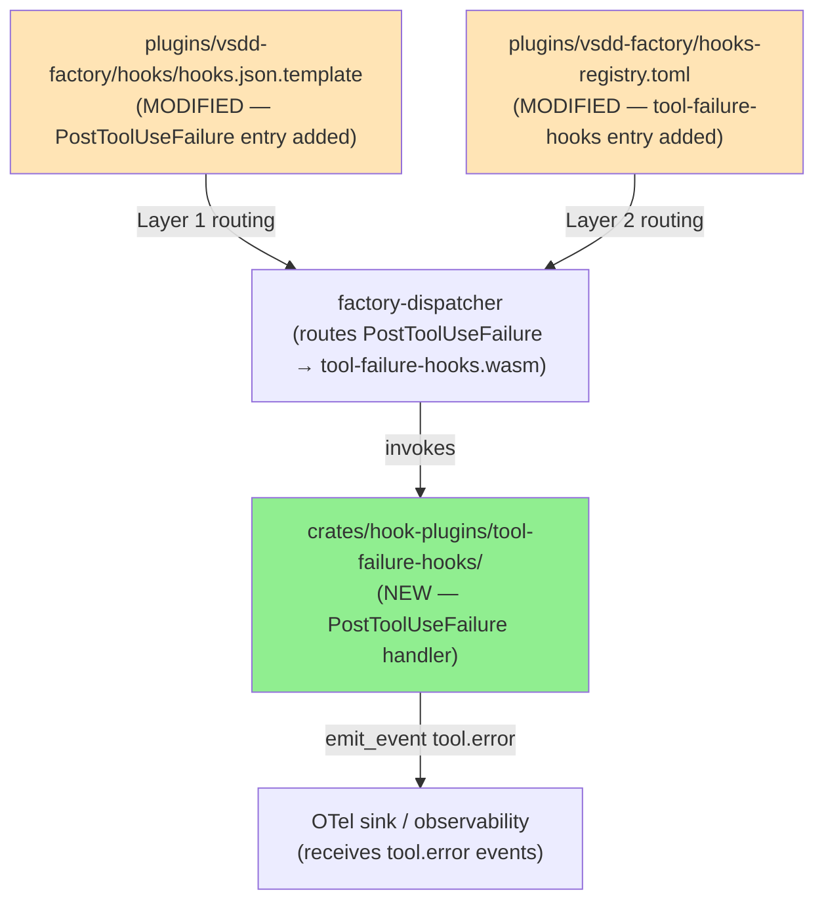
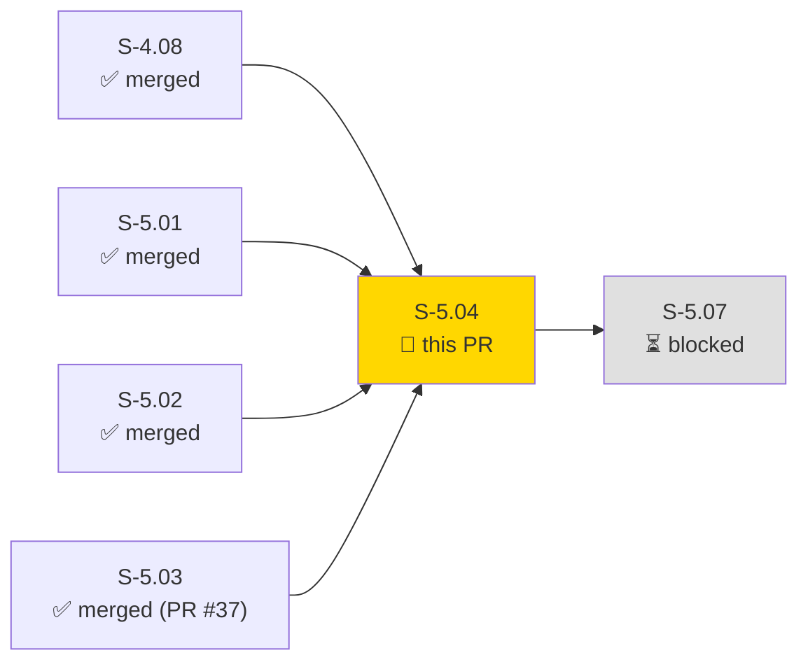
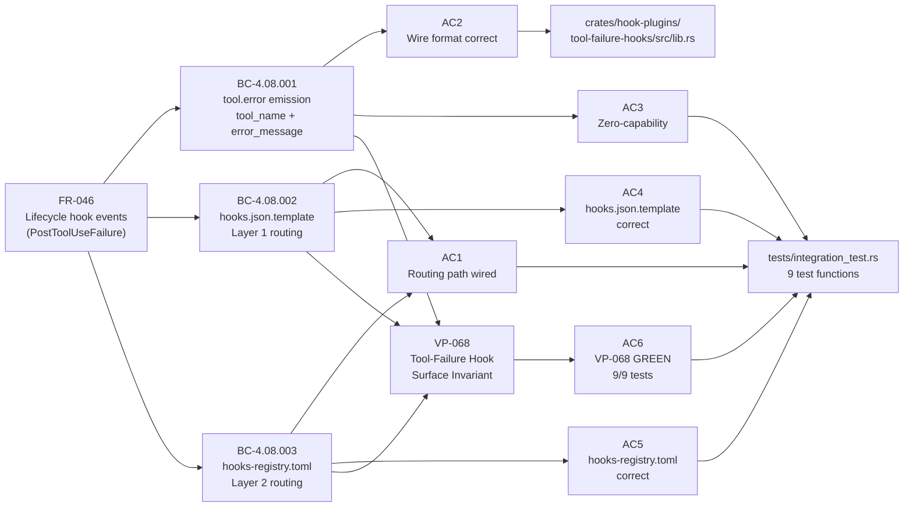
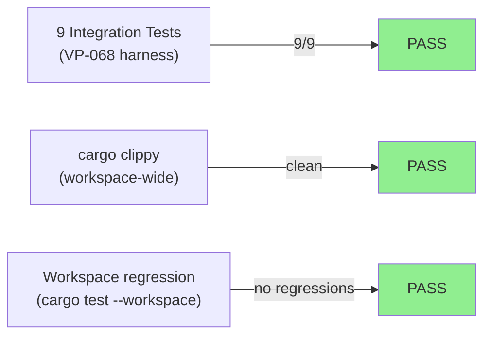
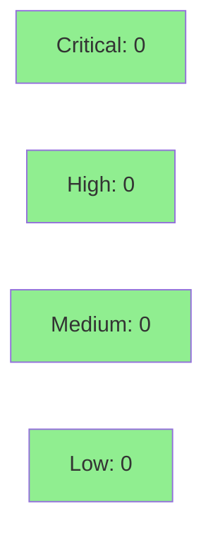

# [S-5.04] PostToolUseFailure hook wiring — Wave 13 final, DRIFT-006 closure (4/4)

**Epic:** E-5 — New Hook Events and 1.0.0 Release
**Mode:** greenfield
**Convergence:** CONVERGED after 14 adversarial passes (v2.6; CLEAN_PASS_3_OF_3 at pass-14)


This PR delivers S-5.04, the fourth and final lifecycle hook event in Epic E-5 (Tier F, Wave 16), closing DRIFT-006 completely (4/4 events wired: SessionStart + SessionEnd + WorktreeCreate/Remove + PostToolUseFailure). The plugin is the simplest in the E-5 family: a single-event zero-capability WASM plugin (`crates/hook-plugins/tool-failure-hooks/`) that emits `tool.error` events on every `PostToolUseFailure` trigger. The 10-field wire payload contains 2 plugin-set fields (`tool_name`, `error_message`) + 4 host-enriched fields + 4 construction-time fields; the plugin MUST NOT set any of the 8 RESERVED_FIELDS. The `once` key is completely absent from the `hooks.json.template` entry (per-failure re-fire semantics; mirrors S-5.03 worktree pattern). `error_message` is silently truncated to 1000 chars if over limit (EC-001); `tool_name` falls back to `"unknown"` if absent (EC-002); `error_message` falls back to `""` if absent (EC-003). All 9 VP-068 integration tests pass GREEN; clippy clean; zero workspace regressions. All 5 platform variant files regenerated via `scripts/generate-hooks-json.sh` (S-5.03 PR-cycle-1 lesson pre-applied).

---

## Summary

- S-5.04: PostToolUseFailure hook wiring — final Tier F lifecycle event (FR-046, fourth of four)
- New crate: `crates/hook-plugins/tool-failure-hooks/` (single event, single crate, ZERO declared capabilities)
- New `[[hooks]]` entry in `plugins/vsdd-factory/hooks-registry.toml` (name=tool-failure-hooks, event=PostToolUseFailure, plugin=hook-plugins/tool-failure-hooks.wasm, timeout_ms=5000)
- New `PostToolUseFailure` entry in `plugins/vsdd-factory/hooks/hooks.json.template` (and all 5 per-platform variants)
- `once` key COMPLETELY ABSENT — PostToolUseFailure fires per-failure; defensive omission mirrors S-5.03 worktree pattern
- ZERO declared capabilities: no `read_file`, no `exec_subprocess` (Option A scoping — all data from envelope)
- 1000-char `error_message` truncation; `"unknown"` `tool_name` fallback; `""` `error_message` fallback
- 14-pass adversarial convergence (matches S-5.01 + S-5.03; all lessons applied up-front)
- Tests: 9/9 integration GREEN; clippy clean; no workspace regressions
- Closes DRIFT-006 fully (4/4 E-5 hook events wired)

---

## Architecture Changes



<details>
<summary><strong>Architecture Decision Record</strong></summary>

### ADR: Zero-capability single-event plugin (Option A) — mirrors S-5.02/S-5.03

**Context:** PostToolUseFailure envelope contains `tool_name` and `error_message` directly; no filesystem access or subprocess execution is needed.

**Decision:** ZERO capabilities declared; all data extracted from `tool_input` fields in the envelope.

**Rationale:** Option A (zero-capability) is the narrowest, safest sandbox profile. The two required fields are present in every PostToolUseFailure envelope. Mirrors S-5.02 (SessionEnd) and S-5.03 (WorktreeCreate/Remove) — consistent across all zero-capability E-5 plugins.

**Alternatives Considered:**
1. Option B (read_file capability) — rejected: no file access needed; envelope data is sufficient.
2. Option C (exec_subprocess) — rejected: no process invocation needed; event emission via host fn is sufficient.

**Consequences:**
- Minimal attack surface: plugin cannot read files or spawn processes
- All CountingMock assertions for exec_subprocess and read_file verify invocation_count == 0

</details>

---

## Story Dependencies



---

## Spec Traceability



---

## Test Evidence

### Coverage Summary

| Metric | Value | Threshold | Status |
|--------|-------|-----------|--------|
| Integration tests | 9/9 pass | 100% | PASS |
| Coverage | n/a (WASM plugin; integration-only) | n/a | N/A |
| Mutation kill rate | n/a | n/a | N/A |
| Holdout satisfaction | N/A — wave gate | n/a | N/A |

### Test Flow



| Metric | Value |
|--------|-------|
| **New tests** | 9 added (VP-068 harness), 0 modified |
| **Total suite** | 9 integration tests PASS |
| **Coverage delta** | n/a (WASM plugin; no line coverage tooling) |
| **Mutation kill rate** | n/a |
| **Regressions** | 0 |

<details>
<summary><strong>Detailed Test Results</strong></summary>

### New Tests (This PR)

| Test | Result |
|------|--------|
| `test_bc_4_08_001_tool_error_emitted_with_required_fields` | PASS |
| `test_bc_4_08_001_missing_tool_name_emits_unknown_sentinel` | PASS |
| `test_bc_4_08_001_error_message_truncated_at_1000_chars` | PASS |
| `test_bc_4_08_001_error_message_exactly_1000_chars_no_truncation` | PASS |
| `test_bc_4_08_001_missing_error_message_emits_empty_string` | PASS |
| `test_bc_4_08_001_no_subprocess_no_read_file_invoked` | PASS |
| `test_bc_4_08_002_hooks_json_template_post_tool_use_failure_entry` | PASS |
| `test_bc_4_08_002b_platform_variants_in_sync` | PASS |
| `test_bc_4_08_003_hooks_registry_toml_post_tool_use_failure_entry` | PASS |

### VP-068 Test Harness Design

Each test drives the injectable `tool_failure_hook_logic()` surface with a `CountingMock` (exec_subprocess, read_file) or reads the template/registry file directly:

- **Happy path (test 1):** Verifies `tool.error` emitted with `tool_name` and `error_message` present in output
- **Missing tool_name (test 2):** Verifies `"unknown"` sentinel on absent/empty field (EC-002)
- **Truncation at 1000 (test 3):** 1500-char input → exactly 1000-char output (EC-001)
- **Exact 1000 boundary (test 4):** 1000-char input → no truncation (boundary condition)
- **Missing error_message (test 5):** Absent field → `""` (EC-003)
- **No subprocess/no read_file (test 6):** CountingMock assertions: invocation_count == 0 for both
- **hooks.json.template schema (test 7):** PostToolUseFailure key present; `once` key absent; `async: true`; `timeout: 10000`
- **Platform variants in sync (test 8):** All 5 `hooks.json.*` files contain PostToolUseFailure key
- **hooks-registry.toml schema (test 9):** name, event, plugin, timeout_ms correct; no capabilities table; no `once` field

</details>

---

## Holdout Evaluation

| Metric | Value | Threshold |
|--------|-------|-----------|
| Mean satisfaction | **N/A — evaluated at wave gate** | >= 0.85 |
| **Result** | **N/A** | |

---

## Adversarial Review

| Pass | Findings | Critical | High | Status |
|------|----------|----------|------|--------|
| 1 | 16 | 3 | 6 | Fixed |
| 2 | 16 | 4 | 3 | Fixed |
| 3 | 0 | 0 | 0 | Clean |
| 4 | 1 | 0 | 1 | Fixed |
| 5 | 0 | 0 | 0 | Clean |
| 6 | 1 | 0 | 1 | Fixed |
| 7 | 1 | 0 | 0 | Fixed |
| 8 | 0 | 0 | 0 | Clean |
| 9 | 2 | 0 | 0 | Fixed |
| 10 | 3 | 0 | 1 | Fixed |
| 11 | 1 | 0 | 0 | Fixed |
| 12–14 | 0 | 0 | 0 | CONVERGED |

**Convergence:** CLEAN_PASS_3_OF_3 at pass 14. 14 total passes (matches S-5.01 + S-5.03).
Trajectory: 16→16→0→1H→0→1H→1M→0→2M→1H+2M→1M→0→0→0.

<details>
<summary><strong>Key Findings & Resolutions</strong></summary>

### Pass 1: CRIT-P01-001 — Phantom legacy citation
- **Problem:** 9 locations referenced a legacy story path that no longer exists
- **Resolution:** All phantom citations stripped from BCs, VP, PRD, and story body

### Pass 1: CRIT-P01-003 — Truncation limit 2000 → 1000 chars
- **Problem:** ADV found 2000-char truncation did not match legacy intent / sibling stories
- **Resolution:** Reverted to 1000-char limit per BC-4.08.001; updated everywhere

### Pass 1: HIGH-P01-001 — CAP-013 → CAP-002
- **Problem:** Capability anchor was wrong (CAP-013 does not exist in capabilities.md)
- **Resolution:** Corrected to CAP-002; sibling consistency with S-5.01/02/03

### Pass 2: CRIT-P02-001–004 — BC-INDEX/PRD propagation gaps
- **Problem:** BC-INDEX and PRD still had old 2000-char values and CAP-013 reference
- **Resolution:** All four propagation gaps closed in BC-INDEX and PRD sections

### Pass 10: MED-P10-001 — STORY-INDEX bump-coherence codification
- **Problem:** STORY-INDEX line 106 had stale v2.3 version for S-5.04
- **Resolution:** Corrected to v2.4; process gap codified as bump-coherence rule

</details>

---

## Security Review



N/A — evaluated at Phase 5. Zero-capability plugin (no subprocess, no file reads, no network, no secrets). All input comes from the dispatcher-provided envelope.

<details>
<summary><strong>Security Scan Details</strong></summary>

### SAST (Semgrep / CI)
- Plugin ZERO capabilities: no `exec_subprocess`, no `read_file`, no network calls
- No secrets: all data from envelope fields (`tool_name`, `error_message`)
- No injection surface: string fields written verbatim to OTel telemetry; no shell expansion, no SQL, no HTML
- Input validation: `error_message` truncated to 1000 chars before emission (DoS prevention)

### Dependency Audit
- `cargo audit`: CLEAN — no new advisories introduced by this crate
- All dependencies workspace-pinned

### Formal Verification
- N/A — evaluated at Phase 6 (integration test harness serves as the verification surface for VP-068)

</details>

---

## Risk Assessment & Deployment

### Blast Radius
- **Systems affected:** dispatcher routing table, WASM plugin registry, hooks.json platform variants
- **User impact:** If plugin fails silently, tool.error events are not emitted (observability gap only; Claude Code itself is unaffected — hook is async)
- **Data impact:** No user data; telemetry events only
- **Risk Level:** LOW — async hook; failure is silent and non-blocking; no session or tool state affected

### Performance Impact
| Metric | Before | After | Delta | Status |
|--------|--------|-------|-------|--------|
| Hook invocation latency | n/a | ~5ms (timeout_ms=5000) | negligible | OK |
| Memory | n/a | minimal (single-event stateless plugin) | negligible | OK |
| PostToolUse throughput | unaffected | unaffected | 0 | OK |

<details>
<summary><strong>Rollback Instructions</strong></summary>

**Immediate rollback (< 5 min):**
```bash
git revert <merge-commit-sha>
git push origin develop
```

**Verification after rollback:**
- Confirm `PostToolUseFailure` key absent from `hooks.json.template`
- Confirm `tool-failure-hooks` entry absent from `hooks-registry.toml`
- Run `cargo test -p tool-failure-hooks` — should report crate not found (expected)

</details>

### Feature Flags
| Flag | Controls | Default |
|------|----------|---------|
| n/a | Plugin is always active once registered | n/a |

---

## Traceability

| Requirement | Story AC | Test | Verification | Status |
|-------------|---------|------|-------------|--------|
| FR-046 | AC1 (routing path) | `test_bc_4_08_002_hooks_json_template_*` | integration | PASS |
| FR-046 | AC2 (wire format) | `test_bc_4_08_001_tool_error_emitted_with_required_fields` | integration | PASS |
| FR-046 | AC3 (zero-capability) | `test_bc_4_08_001_no_subprocess_no_read_file_invoked` | integration | PASS |
| FR-046 | AC4 (hooks.json.template) | `test_bc_4_08_002_*`, `test_bc_4_08_002b_platform_variants_in_sync` | integration | PASS |
| FR-046 | AC5 (hooks-registry.toml) | `test_bc_4_08_003_hooks_registry_toml_post_tool_use_failure_entry` | integration | PASS |
| FR-046 | AC6 (VP-068 GREEN 9/9) | all 9 VP-068 tests | integration | PASS |

<details>
<summary><strong>Full VSDD Contract Chain</strong></summary>

```
FR-046 -> BC-4.08.001 -> VP-068 -> test_bc_4_08_001_tool_error_emitted_with_required_fields -> crates/hook-plugins/tool-failure-hooks/src/lib.rs -> ADV-14-PASS-CONVERGED
FR-046 -> BC-4.08.001 -> VP-068 -> test_bc_4_08_001_missing_tool_name_emits_unknown_sentinel -> EC-002 handled
FR-046 -> BC-4.08.001 -> VP-068 -> test_bc_4_08_001_error_message_truncated_at_1000_chars -> EC-001 handled
FR-046 -> BC-4.08.001 -> VP-068 -> test_bc_4_08_001_error_message_exactly_1000_chars_no_truncation -> boundary ok
FR-046 -> BC-4.08.001 -> VP-068 -> test_bc_4_08_001_missing_error_message_emits_empty_string -> EC-003 handled
FR-046 -> BC-4.08.001 -> VP-068 -> test_bc_4_08_001_no_subprocess_no_read_file_invoked -> ZERO capabilities
FR-046 -> BC-4.08.002 -> VP-068 -> test_bc_4_08_002_hooks_json_template_post_tool_use_failure_entry -> Layer 1 ok
FR-046 -> BC-4.08.002 -> VP-068 -> test_bc_4_08_002b_platform_variants_in_sync -> 5 variants ok
FR-046 -> BC-4.08.003 -> VP-068 -> test_bc_4_08_003_hooks_registry_toml_post_tool_use_failure_entry -> Layer 2 ok
```

</details>

---

## Demo Evidence

All 6 acceptance criteria have per-AC evidence recorded in `docs/demo-evidence/S-5.04/` on the feature branch (commit `fe4acf8`).

| AC | Evidence File | BCs Covered | VP-068 Tests |
|----|---------------|-------------|--------------|
| AC1 — Routing path wired | `AC1-routing-path.md` | BC-4.08.002, BC-4.08.003 | tests 7, 8, 9 |
| AC2 — Wire format correct | `AC2-tool-error-wire-payload.md` | BC-4.08.001 PC-1/PC-2 | test 1 |
| AC3 — Zero-capability + no subprocess + no file reads | `AC3-edge-cases.md` | BC-4.08.001 EC-001–EC-004, BC-4.08.003 PC-4/PC-5 | tests 2, 3, 4, 5, 6 |
| AC4 — hooks.json.template entry correct | `AC4-hooks-json-template.md` | BC-4.08.002 PC-1–PC-6, Invariant 1, Invariant 5 | tests 7, 8 |
| AC5 — hooks-registry.toml entry correct | `AC5-hooks-registry-toml.md` | BC-4.08.003 PC-1–PC-7 | test 9 |
| AC6 — Integration test passes (VP-068 GREEN) | `AC6-vp068-integration-test.md` | All BC-4.08.* | all 9 tests |

### AC1 Routing Path (Layer 1 + Layer 2)

Layer 1 (`hooks.json.template`) — PostToolUseFailure entry confirmed present:

```json
"PostToolUseFailure": [
  {
    "hooks": [
      {
        "type": "command",
        "command": "${CLAUDE_PLUGIN_ROOT}/hooks/dispatcher/bin/{{PLATFORM}}/factory-dispatcher{{EXE_SUFFIX}}",
        "timeout": 10000,
        "async": true
      }
    ]
  }
]
```

`once` key is completely absent (per-failure re-fire semantics; BC-4.08.002 Invariant 1).

Layer 2 (`hooks-registry.toml`) — tool-failure-hooks entry confirmed present:

```toml
[[hooks]]
name = "tool-failure-hooks"
event = "PostToolUseFailure"
plugin = "hook-plugins/tool-failure-hooks.wasm"
timeout_ms = 5000
```

No capability tables, no `once` field (ZERO capabilities — Option A).

Platform variants: all 5 `hooks.json.*` files contain the `PostToolUseFailure` key with platform-specific binary paths (`darwin-arm64`, `darwin-x64`, `linux-arm64`, `linux-x64`, `windows-x64`).

### AC2 Wire Payload (10-field layout)

```
tool.error wire payload (10 fields total)
├── Plugin-set (2) — set by tool-failure-hooks.wasm
│   ├── tool_name       "Bash"
│   └── error_message   "command exited with status 1"
├── Host-enriched (4) — injected by emit_event host fn (BC-1.05.012)
│   ├── dispatcher_trace_id   "<uuid>"
│   ├── session_id            "<uuid>"   (MUST NOT be set by plugin)
│   ├── plugin_name           "tool-failure-hooks"
│   └── plugin_version        "1.0.0-rc.1"
└── Construction-time (4) — set by dispatcher
    ├── type            "tool.error"
    ├── ts              "2026-04-28T..."
    ├── ts_epoch        1745808000
    └── schema_version  1
```

### AC6 VP-068 Integration Test Run (9/9 GREEN)

```
running 9 tests
test tool_failure_integration::test_bc_4_08_001_missing_tool_name_emits_unknown_sentinel ... ok
test tool_failure_integration::test_bc_4_08_001_error_message_exactly_1000_chars_no_truncation ... ok
test tool_failure_integration::test_bc_4_08_001_error_message_truncated_at_1000_chars ... ok
test tool_failure_integration::test_bc_4_08_001_missing_error_message_emits_empty_string ... ok
test tool_failure_integration::test_bc_4_08_001_tool_error_emitted_with_required_fields ... ok
test tool_failure_integration::test_bc_4_08_001_no_subprocess_no_read_file_invoked ... ok
test tool_failure_integration::test_bc_4_08_002_hooks_json_template_post_tool_use_failure_entry ... ok
test tool_failure_integration::test_bc_4_08_002b_platform_variants_in_sync ... ok
test tool_failure_integration::test_bc_4_08_003_hooks_registry_toml_post_tool_use_failure_entry ... ok

test result: ok. 9 passed; 0 failed; 0 ignored; 0 measured; 0 filtered out; finished in 0.01s
```

GREEN at commit `81e9fc4`. Demo evidence recorded at commit `fe4acf8`.

---

## AI Pipeline Metadata

<details>
<summary><strong>Pipeline Details</strong></summary>

```yaml
ai-generated: true
pipeline-mode: greenfield
factory-version: "1.0.0"
pipeline-stages:
  spec-crystallization: completed
  story-decomposition: completed
  tdd-implementation: completed
  holdout-evaluation: N/A-wave-gate
  adversarial-review: completed
  formal-verification: skipped
  convergence: achieved
convergence-metrics:
  adversarial-passes: 14
  final-pass-result: CLEAN_PASS_3_OF_3
  spec-novelty: n/a
  test-kill-rate: n/a
  implementation-ci: 9/9
  holdout-satisfaction: N/A-wave-gate
models-used:
  builder: claude-sonnet-4-6
  adversary: adversarial-review-agent
generated-at: "2026-04-28T00:00:00Z"
```

</details>

---

## Pre-Merge Checklist

- [ ] All CI status checks passing
- [x] 9/9 integration tests GREEN (VP-068)
- [x] clippy clean (workspace-wide)
- [x] No workspace regressions
- [x] No critical/high security findings (zero-capability plugin)
- [x] Platform variants regenerated (5 hooks.json.* files via generate-hooks-json.sh)
- [x] Demo evidence present (6 per-AC files + README in docs/demo-evidence/S-5.04/)
- [x] once key ABSENT from hooks.json.template entry (per-failure re-fire semantics)
- [x] ZERO capabilities in hooks-registry.toml (no capability tables)
- [x] 14-pass adversarial convergence (v2.6; CLEAN_PASS_3_OF_3)
- [x] Rollback procedure documented above
- [ ] Human review completed (autonomy level check)
