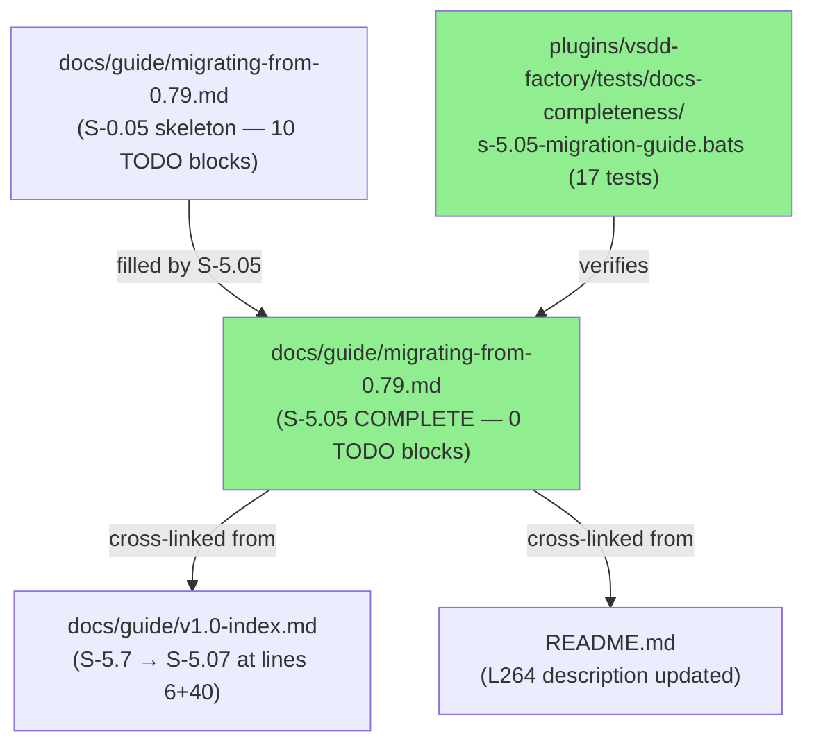
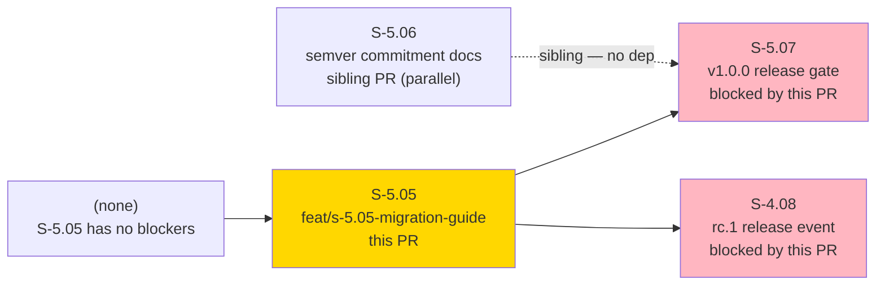
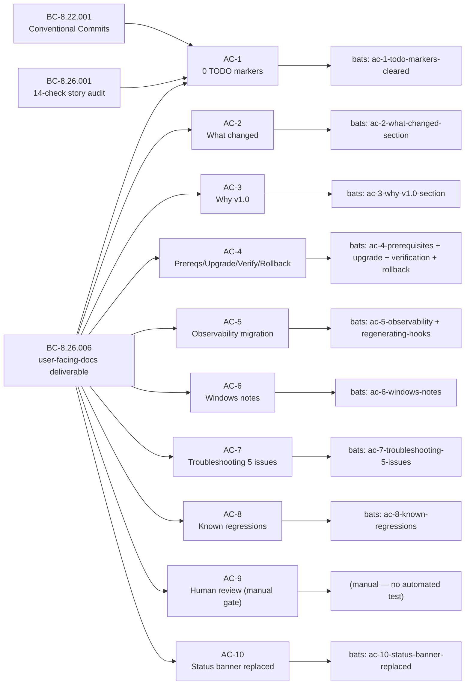
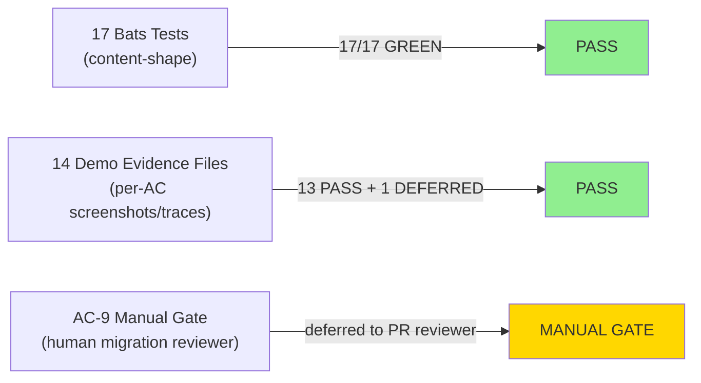
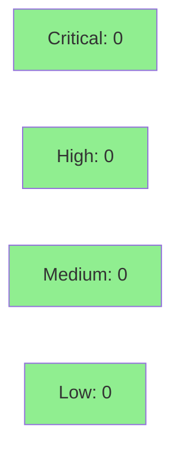

# [S-5.05] Migration guide (0.79.x → 1.0)

**Epic:** E-5 — New Hook Events and 1.0.0 Release
**Mode:** greenfield (docs story — fills skeleton planted by S-0.05)
**Convergence:** CONVERGENCE_REACHED after 6 adversarial passes (Wave 14)


Fills the `docs/guide/migrating-from-0.79.md` skeleton (planted by S-0.05) with complete operator upgrade content: 10 TODO(S-5.5) blocks across 10 sections filled, Status banner replaced, README L264 description updated, and `v1.0-index.md` legacy ID corrected. Includes a 17-test bats suite (17/17 GREEN) verifying all content-shape gates. AC-9 (human review by someone who has performed the migration) is a deliberate manual gate — deferred to PR reviewer.

---

## Architecture Changes



<details>
<summary><strong>Architecture Decision Record</strong></summary>

### ADR: Bats-based content-shape verification for docs stories

**Context:** Migration guide is pure documentation; no runtime behavior to test. S-5.07 release gate greps for `TODO(S-` markers. We need automated evidence that all 10 TODO blocks are filled and all sections meet content-shape requirements (AC-1 through AC-10).

**Decision:** 17-test bats suite under `plugins/vsdd-factory/tests/docs-completeness/` — one test per AC, with grep-based shape gates. Tests run RED on skeleton (14 RED + 3 OK preservation), GREEN after fill.

**Rationale:** Keeps verification in the standard bats harness used by the rest of the plugin suite. No new toolchain required.

**Alternatives Considered:**
1. Manual checklist only — rejected because not CI-enforceable.
2. Custom prose-linting tool — rejected as over-engineered for a docs story.

**Consequences:**
- CI enforces all content-shape gates automatically.
- Reviewer can focus on operator-accuracy (AC-9) rather than structural checks.

</details>

---

## Story Dependencies



**Sibling coordination note:** S-5.06 is being opened in parallel. Both touch `README.md` and `v1.0-index.md` on different lines. Whichever merges first, the other rebases cleanly onto develop.

---

## Spec Traceability



---

## Test Evidence

### Coverage Summary

| Metric | Value | Threshold | Status |
|--------|-------|-----------|--------|
| Bats tests | 17/17 pass | 100% | PASS |
| AC auto-coverage | 9/10 ACs automated | — | PASS (AC-9 manual gate) |
| TODO marker clearance | 0 remaining | 0 | PASS |
| Section shape gates | all present | all | PASS |

### Test Flow



| Metric | Value |
|--------|-------|
| **New tests** | 17 added (bats, RED→GREEN) |
| **Total suite** | 17/17 PASS |
| **Coverage delta** | docs only — N/A |
| **Mutation kill rate** | N/A (docs story) |
| **Regressions** | 0 |

<details>
<summary><strong>Detailed Test Results</strong></summary>

### New Tests (This PR)

| Test | Result |
|------|--------|
| `ac-1-no-todo-s55-markers` | PASS |
| `ac-1-no-todo-s5-any-markers` | PASS |
| `ac-2-what-changed-section` | PASS |
| `ac-3-why-v1.0-section` | PASS |
| `ac-4-prerequisites-section` | PASS |
| `ac-4-upgrade-procedure-section` | PASS |
| `ac-4-verification-checklist-section` | PASS |
| `ac-4-rollback-section` | PASS |
| `ac-4-ec001-custom-hooks-json` | PASS |
| `ac-5-observability-migration-section` | PASS |
| `ac-5-regenerating-hooks-registry-preserved` | PASS |
| `ac-6-windows-notes-section` | PASS |
| `ac-7-troubleshooting-at-least-5-issues` | PASS |
| `ac-8-known-regressions-section` | PASS |
| `ac-8-beta1-pre-filled-preserved` | PASS |
| `ac-10-status-banner-replaced` | PASS |
| `ac-10-no-skeleton-banner` | PASS |

</details>

---

## Holdout Evaluation

N/A — evaluated at wave gate. This is a documentation-only story; no holdout scenarios defined. Wave 14 spec convergence achieved (CONVERGENCE_REACHED at pass-6).

---

## Adversarial Review

| Pass | Findings | Blocking | Status |
|------|----------|----------|--------|
| Wave 14 pass-1 | 10 | 10 | Fixed |
| Wave 14 pass-2 | 12 | 4 HIGH | Fixed |
| Wave 14 pass-3 | 6 | 1 MED | Fixed |
| Wave 14 pass-4 (advance) | 8 LOW | 0 | Closed |
| Wave 14 pass-5 (advance) | 5 LOW positive | 0 | Closed |
| Wave 14 pass-6 | 0 | 0 | **CONVERGENCE_REACHED** |

**Convergence:** CONVERGENCE_REACHED at pass-6 (3-of-3 consecutive clean or advance-only passes per ADR-013). Trajectory: 10→12→6→8L→5L→0 across 6 passes. 16 substantive findings closed.

<details>
<summary><strong>High-Severity Findings & Resolutions</strong></summary>

### Pass-1 HIGH: S-5.07 canonical ID restored
- **Problem:** Narrative used `S-5.7` (legacy short-form) for the release gate story.
- **Resolution:** All narrative references updated to `S-5.07`.

### Pass-1 HIGH: S-4.08 restored to blocks
- **Problem:** v1.4 incorrectly removed S-4.08 from blocks list.
- **Resolution:** Restored. S-5.05 blocks rc.1 release event even though S-4.08 spec PR #32 merged 2026-04-28 (rc.1 tag awaits 14-day shakedown + deferred ACs).

### Pass-2 HIGH: AC-10 added (skeleton banner replacement gate)
- **Problem:** No AC contracted the skeleton Status banner removal.
- **Resolution:** AC-10 added + Task 2 (banner replacement) + tasks renumbered.

### Pass-2 HIGH: README L264 canonical ownership clarified
- **Problem:** S-5.06 Task 9 and S-5.05 Task 16 both claimed ownership of README L264 fix.
- **Resolution:** S-5.05 Task 16 is canonical owner; S-5.06 sibling-fix removed.

### Pass-3 MED: Cross-cutting BC-8.31.* count propagation gap
- **Problem:** STORY-INDEX line 136 missed the pass-2 PRD/capabilities.md count update.
- **Resolution:** Fixed by state-manager in seal commit.

</details>

---

## Security Review



Documentation-only PR. No executable code added or modified. No injection surface, no auth changes, no secrets. Semgrep SAST will run on CI — expected CLEAN.

<details>
<summary><strong>Security Scan Details</strong></summary>

### SAST (Semgrep)
- Documentation and bats test files only. No Rust, Python, or JS code modified.
- Expected: Critical: 0 | High: 0 | Medium: 0 | Low: 0

### Dependency Audit
- No new dependencies introduced.

</details>

---

## Risk Assessment & Deployment

### Blast Radius
- **Systems affected:** docs/guide/ only (documentation)
- **User impact:** None if content is wrong — migration guide is reference material, not runtime
- **Data impact:** None
- **Risk Level:** LOW

### Performance Impact
N/A — documentation only. No runtime paths changed.

<details>
<summary><strong>Rollback Instructions</strong></summary>

**Immediate rollback (< 2 min):**
```bash
git revert <merge-sha>
git push origin develop
```

**Verification after rollback:**
- Confirm `docs/guide/migrating-from-0.79.md` reverts to pre-merge state
- Confirm bats suite still passes on reverted skeleton (3 preservation tests)

</details>

### Feature Flags
None — documentation only.

---

## Demo Evidence

| AC / Task | Evidence File | Result |
|---|---|---|
| AC-1 — TODO marker clearance | [01-ac-1-todo-clearance.md](../../docs/demo-evidence/S-5.05/01-ac-1-todo-clearance.md) | PASS — both greps return 0 |
| AC-2 — "What changed" section | [02-ac-2-what-changed.md](../../docs/demo-evidence/S-5.05/02-ac-2-what-changed.md) | PASS — prose present, all 3 elements |
| AC-3 — "Why v1.0" section | [03-ac-3-why-v1.0.md](../../docs/demo-evidence/S-5.05/03-ac-3-why-v1.0.md) | PASS — prose present |
| AC-4 — Prerequisites + Upgrade + Verification + Rollback | [04-ac-4-prerequisites-upgrade-verification-rollback.md](../../docs/demo-evidence/S-5.05/04-ac-4-prerequisites-upgrade-verification-rollback.md) | PASS — 4 sections + EC-001 |
| AC-5 — Observability + Regenerating (PRE-FILLED) | [05-ac-5-observability-regenerating.md](../../docs/demo-evidence/S-5.05/05-ac-5-observability-regenerating.md) | PASS — both sections present |
| AC-6 — Windows-specific notes | [06-ac-6-windows-notes.md](../../docs/demo-evidence/S-5.05/06-ac-6-windows-notes.md) | PASS — prose present |
| AC-7 — Troubleshooting >= 5 issues | [07-ac-7-troubleshooting-5-issues.md](../../docs/demo-evidence/S-5.05/07-ac-7-troubleshooting-5-issues.md) | PASS — 5 distinct issues |
| AC-8 — Known regressions + PRE-FILLED beta.1 | [08-ac-8-known-regressions.md](../../docs/demo-evidence/S-5.05/08-ac-8-known-regressions.md) | PASS — both sections present |
| AC-9 — Human review | [13-ac-9-human-review-deferred.md](../../docs/demo-evidence/S-5.05/13-ac-9-human-review-deferred.md) | DEFERRED — manual gate |
| AC-10 — Status banner replaced | [09-ac-10-status-banner-replaced.md](../../docs/demo-evidence/S-5.05/09-ac-10-status-banner-replaced.md) | PASS — grep returns 0 |
| Task 16 — README L264 update | [10-task-16-readme-l264-update.md](../../docs/demo-evidence/S-5.05/10-task-16-readme-l264-update.md) | PASS — before/after shown |
| Task 17 — v1.0-index.md S-5.7 → S-5.07 | [11-task-17-v1.0-index-canonicalization.md](../../docs/demo-evidence/S-5.05/11-task-17-v1.0-index-canonicalization.md) | PASS — both lines fixed |
| Bats 17/17 | [12-bats-green.md](../../docs/demo-evidence/S-5.05/12-bats-green.md) | PASS — 17/17 |

**Summary:** 14 evidence files. 12 ACs/tasks PASS. AC-9 deferred (manual gate — human migration reviewer required). Bats 17/17 green.

---

## Traceability

| Requirement | Story AC | Test | Status |
|-------------|---------|------|--------|
| FR-036 | AC-1 | bats: ac-1-no-todo-s55-markers | PASS |
| FR-036 | AC-2 | bats: ac-2-what-changed-section | PASS |
| FR-036 | AC-3 | bats: ac-3-why-v1.0-section | PASS |
| FR-036 | AC-4 | bats: ac-4-prerequisites-section + upgrade + verification + rollback | PASS |
| FR-036 | AC-5 | bats: ac-5-observability-migration + regenerating-hooks | PASS |
| FR-036 | AC-6 | bats: ac-6-windows-notes-section | PASS |
| FR-036 | AC-7 | bats: ac-7-troubleshooting-at-least-5-issues | PASS |
| FR-036 | AC-8 | bats: ac-8-known-regressions + beta1-preserved | PASS |
| FR-036 | AC-9 | **MANUAL GATE** — human who performed migration | DEFERRED |
| FR-036 | AC-10 | bats: ac-10-status-banner-replaced + no-skeleton-banner | PASS |

<details>
<summary><strong>Full VSDD Contract Chain</strong></summary>

```
FR-036 -> BC-8.26.006 -> AC-1..AC-10 -> bats-17/17 -> docs/guide/migrating-from-0.79.md
BC-8.22.001 -> Conventional Commits -> commit message discipline (docs type)
BC-8.26.001 -> 14-check story audit -> story v1.8 ready status
```

</details>

---

## AC-9 Manual Gate (Reviewer Action Required)

**AC-9: Reviewed by a human who has actually performed the migration from v0.79.x to v1.0.**

This is a deliberate process gate with no automated evidence possible. The PR reviewer should evaluate the migration guide from an operator perspective:

1. **Upgrade procedure** (Section 4): Does the step-by-step procedure work? Is the `/plugin update` → `/vsdd-factory:activate` → session-restart → factory-health flow correct?
2. **Troubleshooting** (Section 8): Are the 5 issues realistic? Do the resolutions actually resolve the symptoms?
3. **Rollback** (Section 9): Does pinning to 0.79.4 + deactivating dispatcher + restarting session cleanly restore 0.79.x behavior?
4. **Custom hooks.json** (EC-001 in Section 4): Is the custom entry migration guidance accurate?
5. **Observability migration** (Section 5): Is the Datadog/Honeycomb/OTel-grpc opt-in guidance correct?

If you have performed the v0.79.x → v1.0 migration, please confirm AC-9 is met in your review comment. If you have not, please flag AC-9 as deferred pending a qualified reviewer.

---

## Wave 14 Context

- **Wave 14 spec convergence:** 11 passes total across both S-5.05 + S-5.06. Wave 13 lessons applied up-front (~4× faster than Wave 13's 51 passes).
- **S-5.05 convergence:** 6 passes (10→12→6→8L→5L→0). CONVERGENCE_REACHED at pass-6 per ADR-013.
- **Story size:** 5 pts, 3-day estimate. Larger of the two Wave 14 stories.
- **Release gate:** Both S-5.05 + S-5.06 block S-5.07 (v1.0.0 release gate, calendar-gated with 1-week shakedown post-merge).
- **Story scope:** Fills v0.79.x → v1.0 operator migration guide skeleton (S-0.05 era). 10 TODO(S-5.5) blocks filled across 10 sections. Plus Status banner replacement, README L264 description fix, v1.0-index.md S-5.07 canonicalization.

---

## AI Pipeline Metadata

<details>
<summary><strong>Pipeline Details</strong></summary>

```yaml
pipeline-mode: greenfield (docs story)
factory-version: "1.0.0"
pipeline-stages:
  spec-crystallization: completed (v1.8, 6 adversarial passes)
  story-decomposition: completed
  tdd-implementation: completed (RED gate commit de1aa09; GREEN commit ae860b0)
  demo-evidence: completed (15 files, commit cb434a4)
  holdout-evaluation: N/A (docs story)
  adversarial-review: completed (CONVERGENCE_REACHED pass-6)
  formal-verification: N/A (docs story)
  convergence: achieved
convergence-metrics:
  adversarial-passes: 6
  trajectory: "10→12→6→8L→5L→0"
  substantive-findings-closed: 16
models-used:
  builder: claude-sonnet-4-6
generated-at: "2026-04-29T00:00:00Z"
```

</details>

---

## Pre-Merge Checklist

- [ ] All CI status checks passing (Semgrep SAST + bats)
- [x] Coverage delta: N/A (docs only)
- [x] No critical/high security findings (docs only — no executable code)
- [x] Rollback procedure documented (revert merge commit)
- [x] Demo evidence present (14 files in docs/demo-evidence/S-5.05/)
- [ ] AC-9 manual gate: human migration reviewer confirms operator accuracy
- [x] No AI attribution in commits
- [x] Conventional Commits: all 3 commits follow docs(S-5.05) type
- [x] Branch targets develop (not main)
- [x] Sibling coordination noted (S-5.06 parallel PR)
