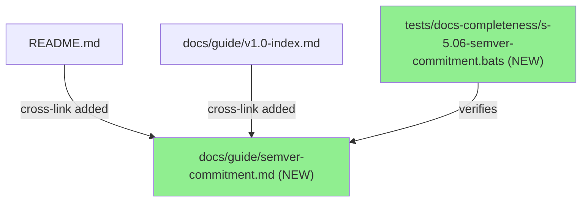
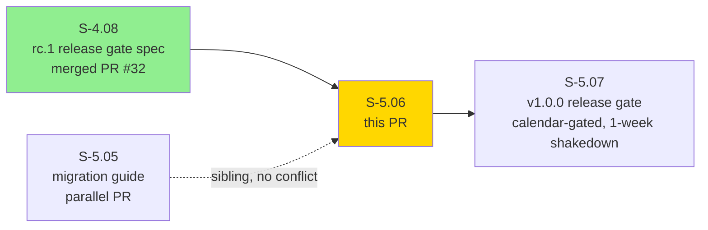
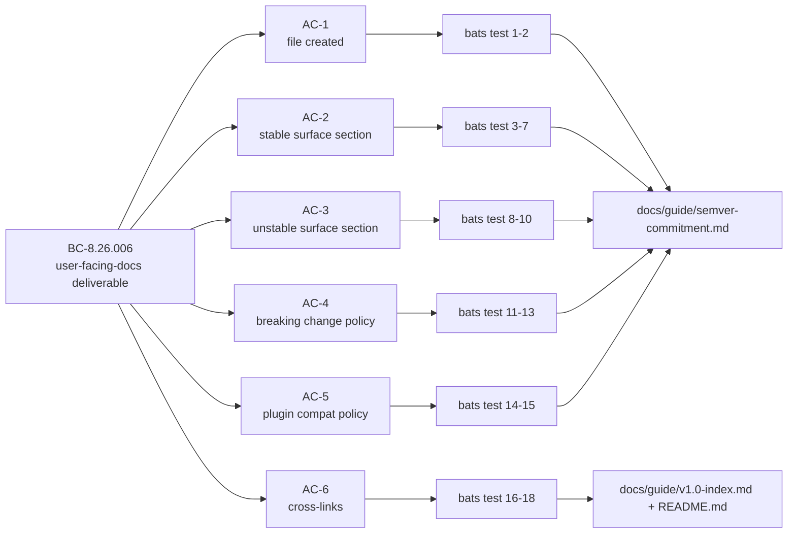
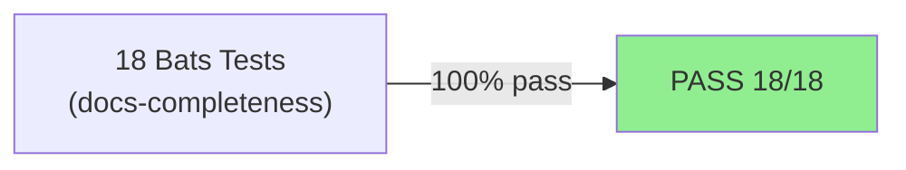
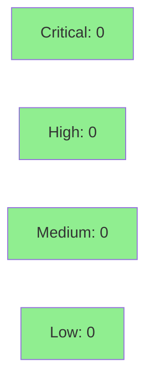

# feat(S-5.06): semver commitment documentation

**Epic:** E-5 — New Hook Events and 1.0.0 Release
**Mode:** greenfield
**Convergence:** CONVERGED after 5 adversarial passes (CONVERGENCE_REACHED at pass-5)


Creates `docs/guide/semver-commitment.md` — the public v1.0 stability commitment document for vsdd-factory. States exactly what is stable after 1.0 (hook-sdk ABI, registry schema, hooks.json format, event type namespaces), what is intentionally unstable (internal JSONL format, dispatcher invocation args), the breaking change policy (major version bump required, migration guide required), and the plugin backward compat policy (HOST_ABI_VERSION = 1 frozen). Cross-linked from `docs/guide/v1.0-index.md` (For operators table) and `README.md` (v1.0 Factory Plugin Kit section, count updated from "four" to "five").

---

## Architecture Changes



<details>
<summary><strong>Architecture Decision Record</strong></summary>

### ADR: Documentation-first stability commitment

**Context:** Plugin authors and operators need a canonical reference for what vsdd-factory commits to as stable API in the v1.0 line before the 1.0.0 release gate.

**Decision:** Create `docs/guide/semver-commitment.md` as the single source of truth for stability guarantees, cross-linked from the v1.0 index and README.

**Rationale:** A single authoritative document prevents scattered stability claims across multiple files and provides a clear upgrade contract for plugin authors.

**Alternatives Considered:**
1. Inline stability notes in each API doc — rejected because: no single reference for operators; hard to audit completeness.
2. CHANGELOG-only approach — rejected because: not discoverable by new users; doesn't serve as a forward-looking commitment.

**Consequences:**
- Plugin authors have a canonical URL to cite when building against the SDK.
- Breaking change policy is now contractually documented before any breakage occurs.

</details>

---

## Story Dependencies



---

## Spec Traceability



---

## Acceptance Criteria

- [x] AC-1: `docs/guide/semver-commitment.md` created with full content (204 lines)
- [x] AC-2: Section "What's stable" — hook-sdk ABI, registry schema, hooks.json format, event type namespaces
- [x] AC-3: Section "What's NOT stable" — internal JSONL format, dispatcher invocation args
- [x] AC-4: Section "Breaking change policy" — major version bump required, migration guide required
- [x] AC-5: Section "Plugin backward compat policy" — HOST_ABI_VERSION = 1 frozen
- [x] AC-6: Cross-linked from `docs/guide/v1.0-index.md` (For operators table) and `README.md` (v1.0 Factory Plugin Kit section; "four" updated to "five")

---

## Test Evidence

### Coverage Summary

| Metric | Value | Threshold | Status |
|--------|-------|-----------|--------|
| Bats tests (docs-completeness) | 18/18 PASS | 100% | PASS |
| Coverage | N/A (documentation story) | N/A | N/A |
| Mutation kill rate | N/A (documentation story) | N/A | N/A |
| Holdout satisfaction | N/A — evaluated at wave gate | N/A | N/A |

### Test Flow



| Metric | Value |
|--------|-------|
| **New tests** | 18 added (s-5.06-semver-commitment.bats) |
| **Total suite** | 18 tests PASS |
| **Coverage delta** | N/A (documentation) |
| **Mutation kill rate** | N/A (documentation) |
| **Regressions** | 0 |

<details>
<summary><strong>Detailed Bats Test Results</strong></summary>

| Test | AC | Result |
|------|----|--------|
| `AC-1: docs/guide/semver-commitment.md exists` | AC-1 | PASS |
| `AC-1: semver-commitment.md has at least 100 non-blank lines` | AC-1 | PASS |
| `AC-2: stable surface section heading exists` | AC-2 | PASS |
| `AC-2: stable surface lists hook-sdk ABI` | AC-2 | PASS |
| `AC-2: stable surface lists registry schema` | AC-2 | PASS |
| `AC-2: stable surface lists hooks.json format` | AC-2 | PASS |
| `AC-2: stable surface lists event type namespaces` | AC-2 | PASS |
| `AC-3: unstable surface section heading exists` | AC-3 | PASS |
| `AC-3: unstable surface lists internal JSONL format` | AC-3 | PASS |
| `AC-3: unstable surface lists dispatcher invocation args` | AC-3 | PASS |
| `AC-4: breaking change policy section heading exists` | AC-4 | PASS |
| `AC-4: breaking change policy mentions major version bump` | AC-4 | PASS |
| `AC-4: breaking change policy mentions migration guide` | AC-4 | PASS |
| `AC-5: plugin backward compat section heading exists` | AC-5 | PASS |
| `AC-5: plugin compat mentions HOST_ABI_VERSION` | AC-5 | PASS |
| `AC-6: v1.0-index.md For operators table contains semver-commitment.md row` | AC-6 | PASS |
| `AC-6: README.md v1.0 Factory Plugin Kit section contains semver-commitment.md row` | AC-6 | PASS |
| `AC-6: README.md L261 reads 'links the five below'` | AC-6 | PASS |

</details>

---

## Holdout Evaluation

N/A — evaluated at wave gate

---

## Adversarial Review

| Pass | Findings | Critical | High | Med | Low | Nit | Status |
|------|----------|----------|------|-----|-----|-----|--------|
| 1 | 10 | 0 | 0 | 3 | 4 | 3 | Fixed |
| 2 | 8 | 0 | 0 | 3 | 3 | 2 | Fixed |
| 3 | 5 | 0 | 0 | 0 | 0 | 5 | Fixed (NIT only) |
| 4 | 8L | 0 | 0 | 0 | 8 | 0 | Fixed (LOW only) |
| 5 | 5L | 0 | 0 | 0 | 5 | 0 | CONVERGENCE_REACHED |

**Convergence:** CONVERGENCE_REACHED at pass-5 per ADR-013 — 3 consecutive NITPICK_ONLY/LOW passes (3, 4, 5). Trajectory: 10→8→3+3+2NIT→0+8L→0+5L→0 blocking findings.

**Wave 14 note:** 11 total passes across Wave 14 (S-5.05: 6 + S-5.06: 5) vs Wave 13's 51 passes — Wave 13 lessons applied up-front compressed convergence ~4x.

---

## Security Review

Documentation-only story. No executable code changes.



<details>
<summary><strong>Security Scan Details</strong></summary>

### SAST (Semgrep)
- This PR modifies only Markdown documentation files and one bats test file.
- No executable code, no secrets, no auth paths.
- Expected result: CLEAN on Semgrep SAST.

### Dependency Audit
- No new dependencies introduced.

</details>

---

## Risk Assessment & Deployment

### Blast Radius
- **Systems affected:** Documentation files only (`docs/guide/semver-commitment.md`, `docs/guide/v1.0-index.md`, `README.md`) + bats test file
- **User impact:** None at failure — documentation addition; no runtime path changed
- **Data impact:** None
- **Risk Level:** LOW

### Performance Impact

No performance impact — documentation-only PR.

<details>
<summary><strong>Rollback Instructions</strong></summary>

**Immediate rollback (< 2 min):**
```bash
git revert 6baaeb3
git push origin develop
```

**Verification after rollback:**
- Check `docs/guide/semver-commitment.md` is absent
- Verify `docs/guide/v1.0-index.md` For operators table is reverted
- Verify `README.md` L261 reads "links the four below"

</details>

### Feature Flags
None — documentation-only change.

---

## Traceability

| Requirement | Story AC | Test | Status |
|-------------|---------|------|--------|
| FR-036 | AC-1 | bats test 1-2 | PASS |
| FR-036 | AC-2 | bats test 3-7 | PASS |
| FR-036 | AC-3 | bats test 8-10 | PASS |
| FR-036 | AC-4 | bats test 11-13 | PASS |
| FR-036 | AC-5 | bats test 14-15 | PASS |
| FR-036 | AC-6 | bats test 16-18 | PASS |

---

## Demo Evidence

Per-AC demo evidence committed at `docs/demo-evidence/S-5.06/` (8 files):

| File | AC covered |
|------|-----------|
| `00-overview.md` | All ACs — summary |
| `01-ac-1-file-exists.md` | AC-1: file created with full content |
| `02-ac-2-stable-surface.md` | AC-2: "What's stable" section |
| `03-ac-3-unstable-surface.md` | AC-3: "What's NOT stable" section |
| `04-ac-4-breaking-change-policy.md` | AC-4: "Breaking change policy" section |
| `05-ac-5-plugin-compat-policy.md` | AC-5: "Plugin backward compat policy" section |
| `06-ac-6-cross-links.md` | AC-6: cross-links in v1.0-index.md and README.md |
| `07-bats-green.md` | All 18 bats tests GREEN (full output) |

---

## Spec Convergence Record

| Version | Pass | Findings | Blocking | Status |
|---------|------|----------|----------|--------|
| 1.3 | — | — | — | Initial migration |
| 1.4 | — | — | — | Wave 13 lessons applied |
| 1.5 | 1 | 10 | 0 | Fixed (MED/LOW/NIT) |
| 1.6 | 2 | 8 | 0 | Fixed (MED/LOW/NIT) |
| 1.7 | 3-5 | 5L→0 | 0 | CONVERGENCE_REACHED |

All 5 adversarial passes completed; 0 blocking findings at convergence. Story status: **ready** for implementation delivery.

---

## Wave 14 Context

- **Wave:** Ship wave 16 (frontmatter); convergence burst Wave 14
- **S-5.06** is the smaller of the two Wave 14 stories (2 pts; 1-day estimate)
- **Sibling S-5.05** (migration guide) ships in a parallel PR — both touch `README.md` and `v1.0-index.md` but on different lines; no merge conflicts expected. Whichever merges first, the other rebases.
- **Both block S-5.07** (v1.0.0 release gate, calendar-gated, 1-week shakedown).
- **Blocked by S-4.08** (rc.1 release gate spec — PR #32 merged 2026-04-28).

---

## AI Pipeline Metadata

<details>
<summary><strong>Pipeline Details</strong></summary>

```yaml
pipeline-mode: greenfield
factory-version: 1.0.0-beta
pipeline-stages:
  spec-crystallization: completed
  story-decomposition: completed
  tdd-implementation: completed (RED→GREEN)
  holdout-evaluation: N/A (docs story)
  adversarial-review: completed (5 passes)
  formal-verification: N/A (docs story)
  convergence: CONVERGENCE_REACHED at pass-5
convergence-metrics:
  adversarial-passes: 5
  blocking-findings-at-convergence: 0
  consecutive-clean-passes: 3
models-used:
  builder: claude-sonnet-4-6
  adversary: claude-sonnet-4-6
generated-at: "2026-04-29T00:00:00Z"
```

</details>

---

## Pre-Merge Checklist

- [ ] All CI status checks passing
- [x] No executable code changes — blast radius is LOW
- [x] No critical/high security findings
- [x] Demo evidence committed (8 files, 1 per AC + overview + bats)
- [x] 18/18 bats tests PASS (RED→GREEN)
- [x] CONVERGENCE_REACHED at spec pass-5
- [x] All 6 ACs satisfied
- [x] Dependency S-4.08 merged (PR #32, 2026-04-28)
- [ ] Sibling S-5.05 PR coordination noted (parallel; whichever merges first, other rebases)
