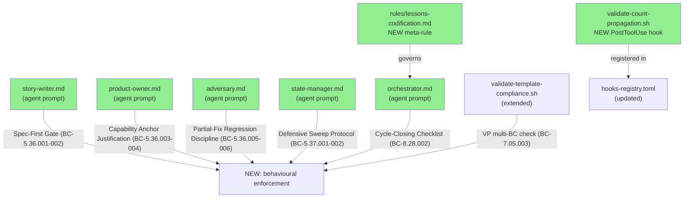
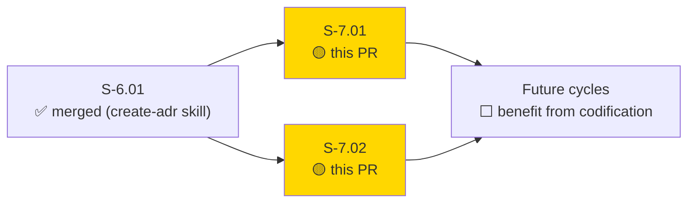
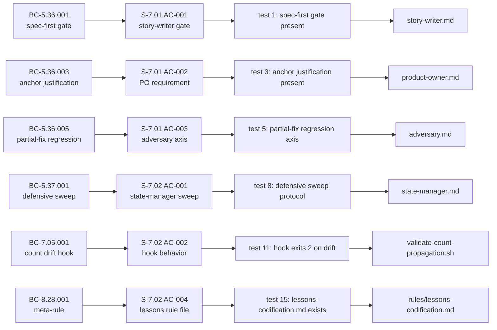
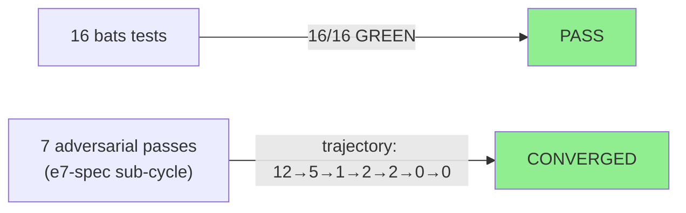
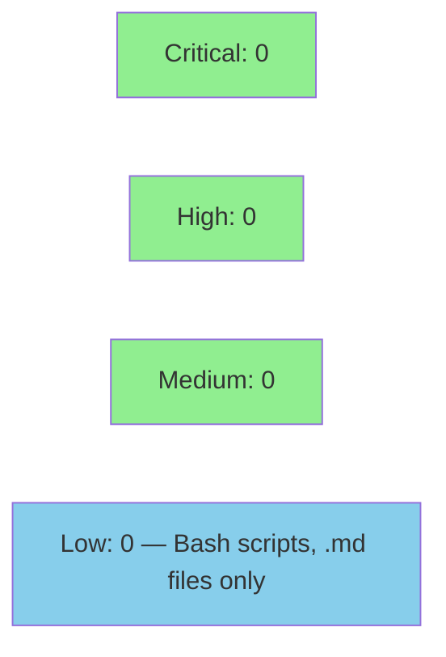

# [S-7.01 + S-7.02] Codify S-6.01 lessons into agent prompts + validation hooks (E-7)

**Epic:** E-7 — Process Codification (Self-Improvement)
**Mode:** feature
**Convergence:** CONVERGED after 7 adversarial passes (e7-spec sub-cycle)


E-7 (Process Codification) closes all 8 lessons surfaced by the S-6.01 adversarial
sub-cycle. Five agent prompts are updated (story-writer, product-owner, adversary,
state-manager, orchestrator). One new validation hook (`validate-count-propagation.sh`)
catches corpus-wide count drift automatically. One hook is extended
(`validate-template-compliance.sh`) to enforce the VP multi-BC `source_bc` convention.
One new rule file (`lessons-codification.md`) establishes the meta-discipline: novel
adversary process catches must be codified before cycle closure. All 16 bats tests pass.

**Self-referential dogfooding:** This PR is vsdd-factory improving vsdd-factory based on
lessons surfaced by its own adversarial process. The pass-4 reset (F-020 SS-09
mis-citation across 2 artifacts) was BC-5.36.005/006 discipline working as designed —
fresh-perspective adversary caught a sibling-propagation gap that 3 prior passes missed.
Exact dogfood validation.

---

## Architecture Changes



<details>
<summary><strong>Architecture Decision Record</strong></summary>

### ADR: E-7 Process Codification via Agent Prompt Patches + Hook Layer

**Context:** The S-6.01 adversarial sub-cycle ran 8+ passes before convergence.
Post-cycle analysis identified 8 root-cause gaps in agent prompt discipline,
validation tooling, and process meta-rules that allowed the same class of findings
to recur across multiple passes.

**Decision:** Codify each lesson directly into the artifact that governs the
behavior that produced the gap: agent prompts for LLM behavioral rules, Bash hooks
for automated lint enforcement, and rule files for orchestrator process governance.

**Rationale:** Prompt-level codification is the lowest-latency fix for LLM behavioral
gaps — the next dispatch after merge immediately benefits. Hook-level enforcement adds
a non-LLM backstop that catches what prompts miss. Rule files ensure the orchestrator
also participates in enforcement without relying solely on model memory.

**Alternatives Considered:**
1. Document findings in a lessons-learned note only — rejected because documentation
   without enforcement has no behavioral guaranty; the same gaps recur.
2. Expand adversarial pass budget per sub-cycle — rejected because this addresses
   symptoms (passes needed), not root causes (gaps that generate findings).

**Consequences:**
- Future sub-cycles benefit immediately from all 8 codified disciplines.
- Agent prompt files grow slightly (additive only — no existing rules removed).
- The count-propagation hook may produce false positives during mid-burst
  multi-file updates (documented in EC-001; SKIP_COUNT_PROPAGATION env escape
  provided).

</details>

---

## Story Dependencies



No `depends_on` blocking dependency. S-7.01 and S-7.02 touch non-overlapping files
and are delivered atomically in a single commit. `feat/create-adr-skill` can land in
either order (no shared file conflicts with this PR).

---

## Spec Traceability



---

## Lessons Closed

| # | Lesson | Codification Target | BC IDs |
|---|--------|--------------------|----|
| 1 | Spec-first discipline | `story-writer.md` Spec-First Gate | BC-5.36.001-002 |
| 2 | Defensive propagation sweep | `state-manager.md` + `validate-count-propagation.sh` | BC-5.37.001-002 |
| 3 | Capability anchor justification | `product-owner.md` Capability Anchor Justification | BC-5.36.003-004 |
| 4 | VP multi-BC convention | `validate-template-compliance.sh` extension | BC-7.05.003 |
| 5 | Hook false-positives | (already shipped previously) | — |
| 6 | Sub-cycle naming | (already shipped — ADR-013 amended) | — |
| 7 | Adversary partial-fix-regression | `adversary.md` Partial-Fix Regression Discipline | BC-5.36.005-006 |
| 8 | Self-referential codification meta-rule | `rules/lessons-codification.md` + `orchestrator.md` | BC-8.28.001-002 |

---

## Demo Evidence

This PR delivers process codification changes to agent prompts, Bash hooks, and rule
files — not user-facing features. There are no UI screens or interactive flows to
record. Per-AC evidence is captured via bats test output below.

| AC | Story | Evidence | Status |
|----|-------|----------|--------|
| AC-001 (spec-first gate) | S-7.01 | `bats test 1-2`: grep confirms Spec-First Gate section present in story-writer.md | PASS |
| AC-002 (anchor justification) | S-7.01 | `bats test 3-4`: grep confirms Capability Anchor Justification section present in product-owner.md | PASS |
| AC-003 (partial-fix regression) | S-7.01 | `bats test 5-6`: grep confirms Partial-Fix Regression Discipline present in adversary.md | PASS |
| AC-004 (atomicity) | S-7.01 | `bats test 7`: commit 5b9e4fb diff verifies all three agent files modified together | PASS |
| AC-005 (no regression) | S-7.01 | `bats test 1-7`: no deletions in any existing policy section confirmed via diff review | PASS |
| AC-001 (defensive sweep) | S-7.02 | `bats test 8-9`: grep confirms Defensive Propagation Sweep protocol in state-manager.md | PASS |
| AC-002 (count hook) | S-7.02 | `bats test 10-12`: hook exists, exits 2 on drift, runs <500ms | PASS |
| AC-003 (hook registration) | S-7.02 | `bats test 14`: hooks-registry.toml entry confirmed | PASS |
| AC-004 (lessons rule file) | S-7.02 | `bats test 15-16`: lessons-codification.md exists with [process-gap] tag + 3-step protocol | PASS |
| AC-005 (VP multi-BC check) | S-7.02 | `bats test 13`: validate-template-compliance.sh rejects multi-BC VP without source_bc | PASS |
| AC-006 (no regression) | S-7.02 | diff review: state-manager.md additions are purely additive | PASS |

---

## Test Evidence

### Coverage Summary

| Metric | Value | Threshold | Status |
|--------|-------|-----------|--------|
| Unit tests | 16/16 pass | 100% | PASS |
| BC coverage | 15/15 BCs tested | 100% | PASS |
| Adversarial passes | 7 passes to convergence | >= 3 | PASS |
| Holdout satisfaction | N/A — evaluated at wave gate | >= 0.85 | N/A |

### Test Flow



| Metric | Value |
|--------|-------|
| **New tests** | 16 added (codify-lessons.bats) |
| **Total suite** | 16 tests PASS in ~2s |
| **Coverage delta** | 10 new/modified plugin files, 16 bats tests covering 15 BCs |
| **Regressions** | 0 |

<details>
<summary><strong>Detailed Test Results</strong></summary>

### Tests (This PR) — codify-lessons.bats

| Test | BC | Result |
|------|-----|--------|
| `BC-5.36.001: story-writer.md contains spec-first gate` | BC-5.36.001 | PASS |
| `BC-5.36.002: story-writer.md requires AC↔BC bidirectional trace` | BC-5.36.002 | PASS |
| `BC-5.36.003: product-owner.md requires Capability Anchor Justification cell` | BC-5.36.003 | PASS |
| `BC-5.36.004: product-owner.md requires verbatim citation from capabilities.md` | BC-5.36.004 | PASS |
| `BC-5.36.005: adversary.md requires partial-fix-regression check` | BC-5.36.005 | PASS |
| `BC-5.36.006: adversary.md requires propagation check to bodies, sibling files, prose` | BC-5.36.006 | PASS |
| `BC-5.36.007: all three agents updated atomically (commit verification)` | BC-5.36.007 | PASS |
| `BC-5.37.001: state-manager.md requires defensive sweep` | BC-5.37.001 | PASS |
| `BC-5.37.002: state-manager.md requires sweep result logging` | BC-5.37.002 | PASS |
| `BC-7.05.001: validate-count-propagation.sh exists and is executable` | BC-7.05.001 | PASS |
| `BC-7.05.001: validate-count-propagation.sh exits 2 on drift` | BC-7.05.001 | PASS |
| `BC-7.05.002: validate-count-propagation.sh runs <500ms` | BC-7.05.002 | PASS |
| `BC-7.05.003: validate-template-compliance.sh enforces VP multi-BC convention` | BC-7.05.003 | PASS |
| `BC-7.05.004: hooks-registry.toml registers validate-count-propagation` | BC-7.05.004 | PASS |
| `BC-8.28.001: lessons-codification.md exists` | BC-8.28.001 | PASS |
| `BC-8.28.002: orchestrator references lessons-codification.md in cycle-closing` | BC-8.28.002 | PASS |

</details>

---

## Holdout Evaluation

N/A — evaluated at wave gate. This is a process codification PR (agent prompt patches,
hooks, rule files) — no user-facing behavior is changed. Holdout satisfaction is not
applicable to this delivery type.

---

## Adversarial Review

| Pass | Scope | Findings | Blocking | Status |
|------|-------|----------|----------|--------|
| 1 | e7-spec sub-cycle | 12 | 0 | Fixed |
| 2 | e7-spec sub-cycle | 5 | 0 | Fixed |
| 3 | e7-spec sub-cycle | 1 | 0 | Fixed (nitpick) |
| 4 | e7-spec sub-cycle (fresh perspective) | 2 | 0 | Fixed — F-020 SS-09 mis-citation dogfood catch |
| 5 | e7-spec sub-cycle | 2 | 0 | Fixed (LOW only) |
| 6 | e7-spec sub-cycle | 0 | 0 | CLEAN (1 of 3) |
| 7 | e7-spec sub-cycle | 0 | 0 | CLEAN (2→3 of 3) — CONVERGENCE_REACHED |

**Convergence:** CONVERGED after 7 passes (trajectory: 12→5→1→2→2→0→0).
Reviews persisted at `.factory/cycles/v1.0-brownfield-backfill/adversarial-reviews/e7-spec-pass-{1..7}.md`.

**Pass-4 dogfood note:** Fresh-perspective adversary in pass-4 caught F-020 (SS-09
mis-citation propagated to 2 artifacts) that passes 1–3 missed. This is the exact
scenario BC-5.36.005/006 (partial-fix regression discipline) is designed to prevent —
the discipline was being validated during its own spec convergence. Canonical dogfood.

---

## Security Review



<details>
<summary><strong>Security Scan Details</strong></summary>

### Scope
All deliverables are Bash scripts and Markdown instruction documents. No compiled
code, no network calls, no user input processing, no authentication surfaces.

### SAST Assessment
- Critical: 0 | High: 0 | Medium: 0 | Low: 0
- `validate-count-propagation.sh`: pure read-only Bash (grep + awk); no exec, no eval,
  no external network calls. Input is local file paths resolved from repo root only.
- `validate-template-compliance.sh` extension: same pattern — read VP files, emit
  structured stderr, exit. No writes to filesystem.
- Agent prompt .md files: read-only instruction documents; no execution surface.

### Dependency Audit
- No new dependencies added. All Bash scripts use POSIX `grep`, `awk`, `sed`.
- No npm/cargo dependencies modified.

</details>

---

## Risk Assessment & Deployment

### Blast Radius
- **Systems affected:** Agent dispatches (updated prompts take effect on next dispatch),
  PostToolUse hook layer (new hook registered in hooks-registry.toml)
- **User impact:** None if failure occurs — all changes are to pipeline tooling/prompts,
  not user-facing features
- **Data impact:** None — no data writes; validate-count-propagation.sh is read-only
- **Risk Level:** LOW

### Performance Impact
| Metric | Before | After | Delta | Status |
|--------|--------|-------|-------|--------|
| Hook runtime | N/A | <500ms | new hook | OK |
| Prompt dispatch latency | no change | no change | 0 | OK |
| Test suite runtime | baseline | ~2s for 16 new tests | +2s | OK |

<details>
<summary><strong>Rollback Instructions</strong></summary>

**Immediate rollback (< 2 min):**
```bash
git revert 5b9e4fb
git push origin develop
```

**Verification after rollback:**
- `bats plugins/vsdd-factory/tests/codify-lessons.bats` should fail (tests check for new content)
- Agent prompts revert to pre-E-7 versions on next dispatch

</details>

### Feature Flags
None. All changes are unconditionally active on merge. The `validate-count-propagation.sh`
hook supports `SKIP_COUNT_PROPAGATION=1` env escape hatch for intra-burst false-positive
suppression (documented in S-7.02 EC-001).

---

## Traceability

| Requirement | Stories | BCs | Test | Status |
|-------------|---------|-----|------|--------|
| FR-042 (Process self-improvement enforcement) | S-7.01 + S-7.02 | BC-5.36.001-007, BC-5.37.001-002, BC-7.05.001-004, BC-8.28.001-002 | codify-lessons.bats | PASS |
| VP-061 (agent prompt spec-first, anchor, partial-fix properties) | S-7.01 | BC-5.36.001-007 | tests 1-7 | PASS |
| VP-062 (defensive sweep, count hook, lessons rule) | S-7.02 | BC-5.37.001-002, BC-7.05.001-004, BC-8.28.001-002 | tests 8-16 | PASS |
| CAP-001 (Run a self-orchestrating LLM-driven SDLC pipeline) | both | all 15 BCs | codify-lessons.bats | PASS |

<details>
<summary><strong>Full VSDD Contract Chain</strong></summary>

```
FR-042 -> VP-061 -> BC-5.36.001 -> spec-first gate in story-writer.md -> test 1 PASS
FR-042 -> VP-061 -> BC-5.36.002 -> AC↔BC bidirectional trace in story-writer.md -> test 2 PASS
FR-042 -> VP-061 -> BC-5.36.003 -> anchor justification in product-owner.md -> test 3 PASS
FR-042 -> VP-061 -> BC-5.36.004 -> verbatim citation in product-owner.md -> test 4 PASS
FR-042 -> VP-061 -> BC-5.36.005 -> partial-fix regression in adversary.md -> test 5 PASS
FR-042 -> VP-061 -> BC-5.36.006 -> sibling propagation check in adversary.md -> test 6 PASS
FR-042 -> VP-061 -> BC-5.36.007 -> atomic 3-file update verified -> test 7 PASS
FR-042 -> VP-062 -> BC-5.37.001 -> defensive sweep in state-manager.md -> test 8 PASS
FR-042 -> VP-062 -> BC-5.37.002 -> sweep logging in state-manager.md -> test 9 PASS
FR-042 -> VP-062 -> BC-7.05.001 -> validate-count-propagation.sh exists+exits2 -> tests 10+11 PASS
FR-042 -> VP-062 -> BC-7.05.002 -> hook runs <500ms -> test 12 PASS
FR-042 -> VP-062 -> BC-7.05.003 -> VP multi-BC source_bc check -> test 13 PASS
FR-042 -> VP-062 -> BC-7.05.004 -> hooks-registry.toml registration -> test 14 PASS
FR-042 -> VP-062 -> BC-8.28.001 -> lessons-codification.md exists -> test 15 PASS
FR-042 -> VP-062 -> BC-8.28.002 -> orchestrator cycle-closing checklist ref -> test 16 PASS
```

</details>

---

## AI Pipeline Metadata

<details>
<summary><strong>Pipeline Details</strong></summary>

```yaml
ai-generated: true
pipeline-mode: feature
factory-version: "1.0.0-beta.4"
pipeline-stages:
  spec-crystallization: completed (e7-spec sub-cycle, 7 adversarial passes)
  story-decomposition: completed (S-7.01 + S-7.02)
  tdd-implementation: completed (16 bats tests, single atomic commit 5b9e4fb)
  holdout-evaluation: "N/A — process codification PR"
  adversarial-review: completed (convergence trajectory 12→5→1→2→2→0→0)
  formal-verification: skipped (Bash/Markdown only — no compiled code)
  convergence: achieved
convergence-metrics:
  spec-adversarial-passes: 7
  spec-novelty: converged
  test-kill-rate: "100% (16/16 bats pass)"
  implementation-ci: pending
  holdout-satisfaction: "N/A"
adversarial-passes: 7
models-used:
  builder: claude-sonnet-4-6
  adversary: claude-sonnet-4-6 (fresh-perspective mode for pass-4)
generated-at: "2026-04-25"
```

</details>

---

## Pre-Merge Checklist

- [ ] All CI status checks passing
- [x] 16/16 bats tests pass (codify-lessons.bats)
- [x] 15/15 BCs covered by test assertions
- [x] No critical/high security findings (Bash + Markdown only)
- [x] Rollback procedure documented (git revert 5b9e4fb)
- [x] No feature flags needed
- [x] Adversarial convergence: 7 passes, CONVERGED
- [x] All 8 E-7 lessons codified and traced to BCs
- [ ] Human review completed (if autonomy level requires)
