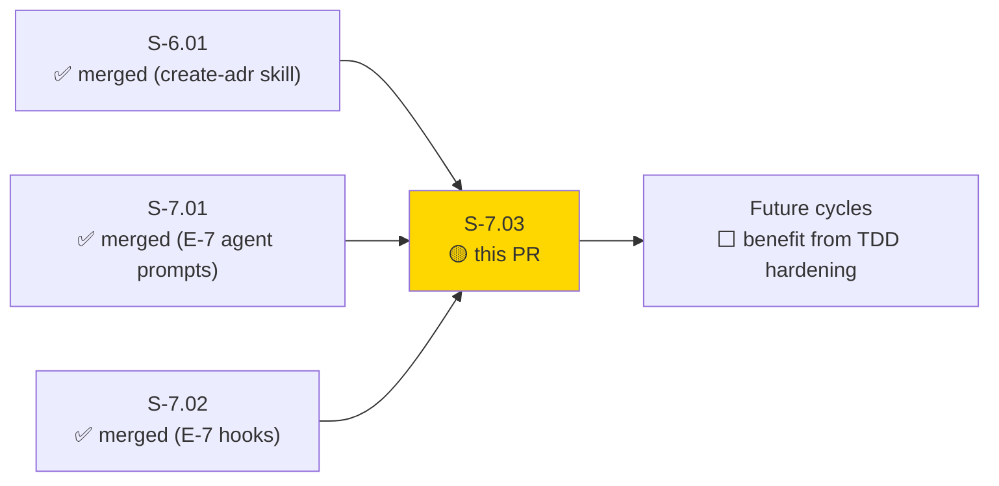
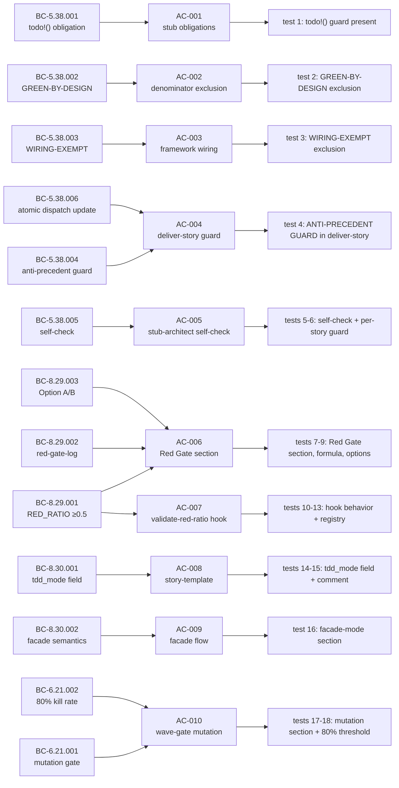
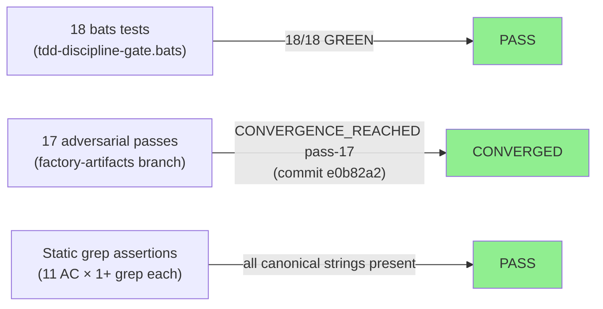
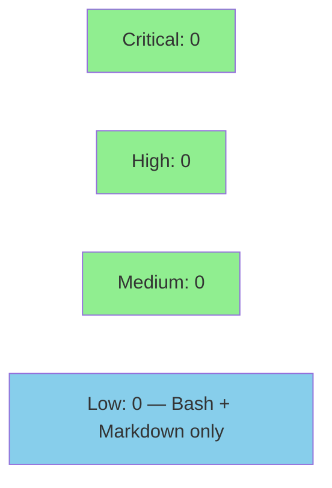

# [S-7.03] TDD Discipline Hardening — Stub-as-Implementation Anti-Pattern Prevention

**Epic:** E-7 — Process Codification (Self-Improvement)
**Mode:** feature
**Convergence:** CONVERGED after 17 adversarial passes (longest in project history; S-6.01: 8; E-7 spec: 7)


Codifies a 4-layer structural defense against the stub-as-implementation anti-pattern
first observed during Prism Wave 2, where 3 of 5 stub-architect dispatches produced
full business logic instead of `todo!()` bodies. The root cause — precedent cascade
from pre-implemented sibling crates — is now blocked at every enforcement layer:
the dispatch prompt (Layer 1 anti-precedent guard), the pipeline gate (Layer 2 Red Gate
density check ≥ 0.5), the story contract (Layer 3 `tdd_mode` frontmatter field), and
the wave quality gate (Layer 4 mutation testing for facade-mode stories). 10 files
changed across `plugins/vsdd-factory`; 18 bats tests GREEN.

**Self-referential dogfooding:** This is the third E-7 story — vsdd-factory using its
own VSDD adversarial process to catch and codify vsdd-factory process gaps. Prism Wave 2
commits `aa706543`, `6d2d005e`, `20b4a12a` are the anti-precedent evidence embedded
verbatim in the guard text; `e86d03f2` (Prism S-2.06 datasource-trait: 5 genuine
`todo!()` macros) is the model precedent. The 17-pass adversarial convergence for this
story's spec is itself a testament to the E-7 process working as designed.

---

## Architecture Changes

```mermaid
graph TD
    DeliverStory["deliver-story/SKILL.md<br/>(Step 2 dispatch)"]
    PerStoryDelivery["per-story-delivery.md<br/>(workflow phases)"]
    StubArchitect["stub-architect.md<br/>(agent prompt)"]
    StoryTemplate["story-template.md<br/>(template)"]
    WaveGate["wave-gate/SKILL.md<br/>(quality gate)"]
    ValidateRedRatio["validate-red-ratio.sh<br/>NEW PostToolUse hook"]
    HooksRegistry["hooks-registry.toml<br/>(updated)"]
    StoryWriter["story-writer.md<br/>(agent prompt)"]

    DeliverStory -.->|"ANTI-PRECEDENT GUARD (Layer 2)"| NewGuard["NEW: anti-precedent enforcement"]
    PerStoryDelivery -.->|"Red Gate Density ≥0.5 (Layer 3)"| NewGate["NEW: RED_RATIO gate"]
    PerStoryDelivery -.->|"facade-mode flow (Layer 4)"| NewFacade["NEW: tdd_mode=facade semantics"]
    StubArchitect -.->|"self-check + GREEN-BY-DESIGN/WIRING-EXEMPT (Layer 1)"| NewSelfCheck["NEW: self-check protocol"]
    StoryTemplate -.->|"tdd_mode field (Layer 4)"| NewField["NEW: tdd_mode: strict|facade"]
    WaveGate -.->|"mutation testing ≥80% kill rate (Layer 5)"| NewMutation["NEW: mutation gate"]
    ValidateRedRatio -.->|"registered in"| HooksRegistry
    StoryWriter -.->|"tdd_mode in frontmatter checklist"| NewField

    style ValidateRedRatio fill:#90EE90
    style NewGuard fill:#90EE90
    style NewGate fill:#90EE90
    style NewFacade fill:#90EE90
    style NewSelfCheck fill:#90EE90
    style NewField fill:#90EE90
    style NewMutation fill:#90EE90
```



<details>
<summary><strong>Architecture Decision Record</strong></summary>

### ADR: 4-Layer TDD Enforcement via Prompt Guards + Pipeline Gate + Hook + Template Contract

**Context:** Prism Wave 2 demonstrated that the TDD Iron Law can be silently bypassed
via precedent cascade — agents observe pre-implemented sibling crates and treat them
as templates, producing stubs with full business logic. By Step 3 (Red Gate), most
tests already pass (RED_RATIO near 0.0), and the implementer dispatch becomes a no-op.
No blocking signal was emitted across 3 of 5 stories in that wave.

**Decision:** Four mutually reinforcing enforcement layers:
1. Anti-precedent guard embedded verbatim in both dispatch instruction files.
2. RED_RATIO density gate (≥ 0.5) blocking implementer dispatch below threshold.
3. `tdd_mode` frontmatter contract distinguishing `strict` from `facade` delivery.
4. Mutation testing wave-gate compensating for `facade` stories that legitimately skip Red Gate.

**Rationale:** Each layer addresses a different bypass vector. The guard addresses
agent behavioral tendency. The density gate addresses quantitative measurement gap.
The `tdd_mode` contract addresses the legitimate/illegitimate distinction for facade
work. Mutation testing closes the quality gap for facade deliveries.

**Alternatives Considered:**
1. Increase Red Gate to 100% threshold — rejected because GREEN-BY-DESIGN and
   WIRING-EXEMPT functions are legitimately implemented in stub commits (pure data
   mappings, framework structural minimums).
2. Prohibit facade-mode entirely — rejected because DTU/mock scaffold work is
   inherently different from algorithmic implementation; forcing `todo!()` into pure
   data accessors creates artificial failures.

**Consequences:**
- Future stub-architect dispatches include explicit anti-precedent counter-instruction.
- Orchestrators must write a red-gate-log before proceeding past Step 3 when RED_RATIO < 0.5.
- All new stories gain `tdd_mode` field with strict default (no backfill needed for existing).
- Mutation testing becomes mandatory at wave gate for any story with `tdd_mode: facade`.

</details>

---

## Story Dependencies



`depends_on: []` — no blocking dependency in story frontmatter. S-7.01 and S-7.02
are already merged to `develop`. S-7.03 touches files not modified by S-7.01/S-7.02
(new: `per-story-delivery.md`, `validate-red-ratio.sh`, `tdd-discipline-gate.bats`;
modified: `stub-architect.md`, `story-template.md`, `wave-gate/SKILL.md`, `story-writer.md`).

---

## Spec Traceability



---

## Demo Evidence

This PR delivers plugin-source changes (Markdown + Bash + bats — no UI, no CLI binary,
no Rust crate). The bats test suite and per-AC grep evidence constitute the full
demo set. VHS recording is not applicable (no interactive binary to record).

| AC | Status | Evidence | Bats tests |
|----|--------|----------|------------|
| AC-001 | covered | grep-evidence.md#ac-001 | ok 1 test_stub_architect_uses_todo_for_nontrivial_bodies |
| AC-002 | covered | grep-evidence.md#ac-002 | ok 2 test_green_by_design_excluded_from_red_ratio_denominator |
| AC-003 | covered | grep-evidence.md#ac-003 | ok 3 test_wiring_exempt_excluded_from_red_ratio_denominator |
| AC-004 | covered | grep-evidence.md#ac-004 | ok 4 test_anti_precedent_guard_in_deliver_story_skill |
| AC-005 | covered | grep-evidence.md#ac-005 | ok 5+6 test_anti_precedent_guard_in_per_story_delivery, test_self_check_question_in_stub_architect_prompt |
| AC-006 | covered | grep-evidence.md#ac-006 | ok 7-9 test_red_ratio_threshold_section_present, test_red_ratio_formula_present, test_remediation_options_ab_present |
| AC-007 | covered | grep-evidence.md#ac-007 | ok 10-13 test_validate_red_ratio_blocks_on_low_ratio, test_validate_red_ratio_passes_on_sufficient_ratio, test_validate_red_ratio_passes_on_option_b_election, test_validate_red_ratio_registered_in_hooks_registry |
| AC-008 | covered | grep-evidence.md#ac-008 | ok 14-15 test_tdd_mode_field_in_story_template, test_tdd_mode_comment_documents_both_values |
| AC-009 | covered | grep-evidence.md#ac-009 | ok 16 test_facade_mode_section_present |
| AC-010 | covered | grep-evidence.md#ac-010 | ok 17-18 test_wave_gate_mutation_section_present, test_wave_gate_mutation_threshold_80_present |
| AC-011 | covered | docs/demo-evidence/S-7.03/bats-run.log | All 18 GREEN (full TAP output) |

Full evidence: `docs/demo-evidence/S-7.03/evidence-report.md`
TAP log: `docs/demo-evidence/S-7.03/bats-run.log`
Per-AC grep: `docs/demo-evidence/S-7.03/grep-evidence.md`

---

## Test Evidence

### Coverage Summary

| Metric | Value | Threshold | Status |
|--------|-------|-----------|--------|
| Unit tests (bats) | 18/18 pass | 100% | PASS |
| BC coverage | 13/13 BCs tested | 100% | PASS |
| Adversarial passes | 17 passes to convergence | >= 3 | PASS |
| Holdout satisfaction | N/A — evaluated at wave gate | >= 0.85 | N/A |
| Mutation kill rate | N/A — plugin-source delivery, no Rust crate | >= 80% | N/A |

### Test Flow



| Metric | Value |
|--------|-------|
| **New tests** | 18 added (tdd-discipline-gate.bats) |
| **Total suite** | 18 tests PASS |
| **Files changed** | 10 files (8 plugin source + 1 bats + 1 demo evidence dir) |
| **LOC added** | ~819 LOC net (stub-architect.md +187, per-story-delivery.md +162, wave-gate +94, validate-red-ratio.sh +119, bats +242, others) |
| **Regressions** | 0 |

<details>
<summary><strong>Detailed Test Results</strong></summary>

### Tests (This PR) — tdd-discipline-gate.bats

| Layer | Test | BC | Result |
|-------|------|----|--------|
| 1 | `test_stub_architect_uses_todo_for_nontrivial_bodies` | BC-5.38.001 | PASS |
| 1 | `test_green_by_design_excluded_from_red_ratio_denominator` | BC-5.38.002 | PASS |
| 1 | `test_wiring_exempt_excluded_from_red_ratio_denominator` | BC-5.38.003 | PASS |
| 2 | `test_anti_precedent_guard_in_deliver_story_skill` | BC-5.38.004/006 | PASS |
| 2 | `test_anti_precedent_guard_in_per_story_delivery` | BC-5.38.006 | PASS |
| 2 | `test_self_check_question_in_stub_architect_prompt` | BC-5.38.005 | PASS |
| 3 | `test_red_ratio_threshold_section_present` | BC-8.29.001 | PASS |
| 3 | `test_red_ratio_formula_present` | BC-8.29.001 | PASS |
| 3 | `test_remediation_options_ab_present` | BC-8.29.003 | PASS |
| 3 | `test_validate_red_ratio_blocks_on_low_ratio` | BC-8.29.001/VP-063 | PASS |
| 3 | `test_validate_red_ratio_passes_on_sufficient_ratio` | BC-8.29.001/VP-063 | PASS |
| 3 | `test_validate_red_ratio_passes_on_option_b_election` | BC-8.29.003/VP-063 | PASS |
| 3 | `test_validate_red_ratio_registered_in_hooks_registry` | BC-8.29.001 | PASS |
| 4 | `test_tdd_mode_field_in_story_template` | BC-8.30.001 | PASS |
| 4 | `test_tdd_mode_comment_documents_both_values` | BC-8.30.001 | PASS |
| 4 | `test_facade_mode_section_present` | BC-8.30.002 | PASS |
| 5 | `test_wave_gate_mutation_section_present` | BC-6.21.001 | PASS |
| 5 | `test_wave_gate_mutation_threshold_80_present` | BC-6.21.002 | PASS |

</details>

---

## Holdout Evaluation

N/A — evaluated at wave gate. This is a process codification PR (agent prompt patches,
workflow instruction files, hook, template) — no user-facing behavior is changed.
Holdout satisfaction is not applicable to this delivery type.

---

## Adversarial Review

| Pass | Scope | Findings | Blocking | Status |
|------|-------|----------|----------|--------|
| 1–8 | S-7.03 spec sub-cycle | 30+ | >0 | Fixed |
| 9–14 | S-7.03 spec sub-cycle | 12 | 0 | Fixed/Cosmetic |
| 15–16 | S-7.03 spec sub-cycle | 2 | 0 | Fixed (NITPICK) |
| 17 | S-7.03 spec sub-cycle | 3 | 0 | NITPICK only — CONVERGENCE_REACHED |

**Convergence:** CONVERGED after 17 passes. CONVERGENCE_REACHED at pass-17 (commit
`e0b82a2` on `factory-artifacts` branch). 17 passes is the longest convergence in
project history (S-6.01: 8 passes; E-7: 7 passes). The extended convergence reflects
the story's complexity: 13 new BCs across 5 layers, 3 subsystems (SS-05, SS-06, SS-08),
with the spec itself being the most rigorous artifact produced in this cycle.

Reviews persisted at `.factory/cycles/v1.0-brownfield-backfill/adversarial-reviews/`.

---

## Security Review



<details>
<summary><strong>Security Scan Details</strong></summary>

### Scope
All deliverables are Bash scripts and Markdown instruction documents. No compiled
code, no network calls, no user input processing, no authentication surfaces.

### SAST Assessment
- Critical: 0 | High: 0 | Medium: 0 | Low: 0
- `validate-red-ratio.sh`: pure read-only Bash; reads red-gate-log files (local
  `.factory/logs/` paths only), performs integer arithmetic, emits structured stderr,
  exits 0 or non-zero. No `eval`, no `exec`, no network calls, no file writes.
  Uses `jq` for JSON field extraction — same pattern as `validate-novelty-assessment.sh`.
- All Markdown files (SKILL.md, per-story-delivery.md, stub-architect.md,
  story-template.md, wave-gate/SKILL.md, story-writer.md): read-only instruction
  documents; no execution surface.

### Injection / Input Validation
- `validate-red-ratio.sh` reads structured YAML/JSON frontmatter fields via `jq`.
  File paths are resolved from repo root; no user-controlled path expansion.
  Input values (`red_ratio`, `total_new_tests`, `exempt_count`, `remediation`) are
  extracted via `jq` and used in arithmetic — no shell command construction from input.
- No injection vectors identified.

### Dependency Audit
- No new dependencies added. `jq` (POSIX JSON tool) is already a dependency of
  existing hooks. `bats-core` is already installed in CI.
- No npm/cargo dependencies modified.

</details>

---

## Risk Assessment & Deployment

### Blast Radius
- **Systems affected:** Stub-architect dispatches (updated `stub-architect.md` takes
  effect on next dispatch), deliver-story pipeline (anti-precedent guard in Step 2),
  wave-gate skill (mutation testing section), PostToolUse hook layer (new hook
  `validate-red-ratio.sh` registered), story template (new `tdd_mode` field)
- **User impact:** None if failure occurs — all changes are to pipeline tooling/prompts,
  not user-facing features
- **Data impact:** None — `validate-red-ratio.sh` is read-only (no file writes);
  all Markdown changes are instruction-only
- **Risk Level:** LOW

### Performance Impact
| Metric | Before | After | Delta | Status |
|--------|--------|-------|-------|--------|
| Hook runtime | N/A | <500ms | new hook | OK |
| Prompt dispatch latency | no change | no change | 0 | OK |
| Test suite runtime | baseline | ~2s for 18 new tests | +2s | OK |
| Wave gate runtime | varies | +mutation testing for facade stories | new step | OK (expected; facade-mode stories are deliberate opt-in) |

<details>
<summary><strong>Rollback Instructions</strong></summary>

**Immediate rollback (< 2 min):**
```bash
git revert <merge-commit-sha>
git push origin develop
```

**Verification after rollback:**
- `bats plugins/vsdd-factory/tests/tdd-discipline-gate.bats` should fail (tests check for new content)
- `validate-red-ratio.sh` will no longer exist; hooks-registry.toml entry removed
- `stub-architect.md`, `per-story-delivery.md`, `deliver-story/SKILL.md` revert to pre-TDD-hardening versions

</details>

### Feature Flags
None. All changes are unconditionally active on merge. The `validate-red-ratio.sh`
hook validates `red_ratio` field only in red-gate-log files and story files that
explicitly write this field — it does not trigger on general file writes.

---

## Traceability

| Requirement | Story AC | BCs | VP | Test | Status |
|-------------|---------|-----|-----|------|--------|
| FR-043 (TDD Discipline Hardening) | AC-001 | BC-5.38.001 | — | test 1 | PASS |
| FR-043 | AC-002 | BC-5.38.002 | VP-063 | test 2 | PASS |
| FR-043 | AC-003 | BC-5.38.003 | VP-063 | test 3 | PASS |
| FR-043 | AC-004 | BC-5.38.004, BC-5.38.006 | — | test 4 | PASS |
| FR-043 | AC-005 | BC-5.38.005, BC-5.38.006 | — | tests 5-6 | PASS |
| FR-043 | AC-006 | BC-8.29.001, BC-8.29.002, BC-8.29.003 | VP-063 | tests 7-9 | PASS |
| FR-043 | AC-007 | BC-8.29.001, BC-8.29.002, BC-8.29.003 | VP-063 | tests 10-13 | PASS |
| FR-043 | AC-008 | BC-8.30.001 | — | tests 14-15 | PASS |
| FR-043 | AC-009 | BC-8.30.002 | VP-064 | test 16 | PASS |
| FR-043 | AC-010 | BC-6.21.001, BC-6.21.002 | VP-064 | tests 17-18 | PASS |
| FR-043 | AC-011 | All 13 BCs | VP-063, VP-064 | 18 bats tests | PASS |
| CAP-016 (TDD delivery gate enforcement) | all ACs | all 13 BCs | VP-063, VP-064 | tdd-discipline-gate.bats | PASS |

<details>
<summary><strong>Full VSDD Contract Chain</strong></summary>

```
FR-043 -> BC-5.38.001 -> todo!() obligation guard in stub-architect.md -> test 1 PASS
FR-043 -> BC-5.38.002 -> GREEN-BY-DESIGN exclusion in per-story-delivery.md -> test 2 PASS
FR-043 -> BC-5.38.003 -> WIRING-EXEMPT exclusion in per-story-delivery.md -> test 3 PASS
FR-043 -> BC-5.38.004 -> ANTI-PRECEDENT GUARD in deliver-story/SKILL.md -> test 4 PASS
FR-043 -> BC-5.38.005 -> self-check question in stub-architect.md -> test 6 PASS
FR-043 -> BC-5.38.006 -> ANTI-PRECEDENT GUARD in per-story-delivery.md (atomic) -> test 5 PASS
FR-043 -> BC-8.29.001 -> Red Gate Density Check section in per-story-delivery.md -> test 7 PASS
FR-043 -> BC-8.29.001 -> RED_RATIO formula and 0.5 threshold -> test 8 PASS
FR-043 -> BC-8.29.003 -> Option A and Option B remediation -> test 9 PASS
FR-043 -> VP-063 -> validate-red-ratio.sh blocks on ratio 0.3 -> test 10 PASS
FR-043 -> VP-063 -> validate-red-ratio.sh passes on ratio 0.5 -> test 11 PASS
FR-043 -> VP-063 -> validate-red-ratio.sh passes on option_b election -> test 12 PASS
FR-043 -> BC-8.29.001 -> validate-red-ratio registered in hooks-registry.toml -> test 13 PASS
FR-043 -> BC-8.30.001 -> tdd_mode: field in story-template.md -> test 14 PASS
FR-043 -> BC-8.30.001 -> facade comment on same line as tdd_mode -> test 15 PASS
FR-043 -> BC-8.30.002 -> facade-mode section in per-story-delivery.md -> test 16 PASS
FR-043 -> BC-6.21.001 -> cargo mutants section in wave-gate/SKILL.md -> test 17 PASS
FR-043 -> BC-6.21.002 -> 80% kill rate threshold in wave-gate/SKILL.md -> test 18 PASS
```

</details>

---

## AI Pipeline Metadata

<details>
<summary><strong>Pipeline Details</strong></summary>

```yaml
pipeline-mode: feature
factory-version: "1.0.0-beta.6"
pipeline-stages:
  spec-crystallization: completed (17 adversarial passes, CONVERGENCE_REACHED pass-17 commit e0b82a2)
  story-decomposition: completed (S-7.03 standalone, 2-batch implementer dispatch)
  tdd-implementation: completed (18 bats tests, Batch A + Batch B commits)
  holdout-evaluation: "N/A — process codification PR"
  adversarial-review: completed (convergence after 17 passes — project history record)
  formal-verification: skipped (Bash/Markdown only — no compiled code)
  convergence: achieved
convergence-metrics:
  spec-adversarial-passes: 17
  test-count: "18/18 bats PASS"
  implementation-ci: pending
  holdout-satisfaction: "N/A"
adversarial-passes: 17
subsystems: [SS-05, SS-06, SS-08]
behavioral-contracts: 13
verification-properties: [VP-063, VP-064]
functional-requirements: [FR-043]
capabilities: [CAP-016]
models-used:
  builder: claude-sonnet-4-6
  adversary: claude-sonnet-4-6 (factory-artifacts branch, 17 passes)
generated-at: "2026-04-26"
```

</details>

---

## Pre-Merge Checklist

- [ ] All CI status checks passing
- [x] 18/18 bats tests pass (tdd-discipline-gate.bats)
- [x] 13/13 BCs covered by test assertions
- [x] All 11 ACs covered by demo evidence (docs/demo-evidence/S-7.03/)
- [x] No critical/high security findings (Bash + Markdown only)
- [x] Rollback procedure documented
- [x] No feature flags needed
- [x] Adversarial convergence: 17 passes, CONVERGENCE_REACHED
- [x] Story dependencies met: S-7.01, S-7.02 already merged; depends_on: []
- [x] Both dispatch files updated atomically (BC-5.38.006 invariant 1)
- [ ] Human review completed (if autonomy level requires)
