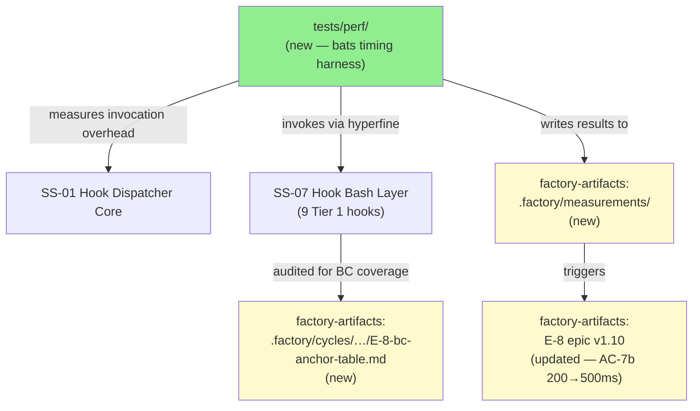
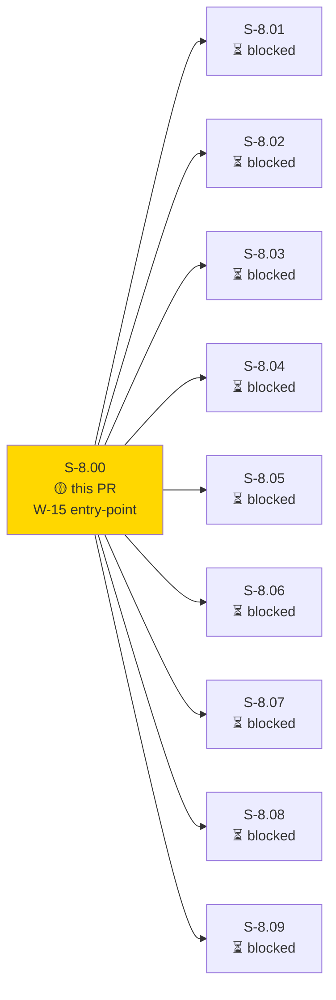
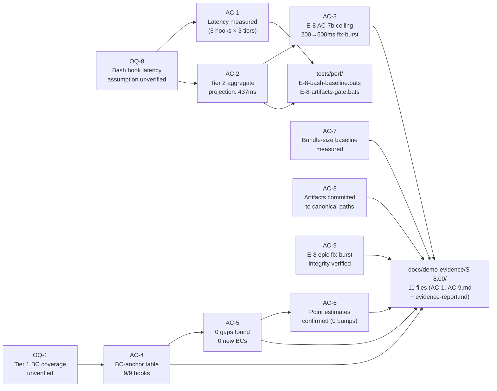
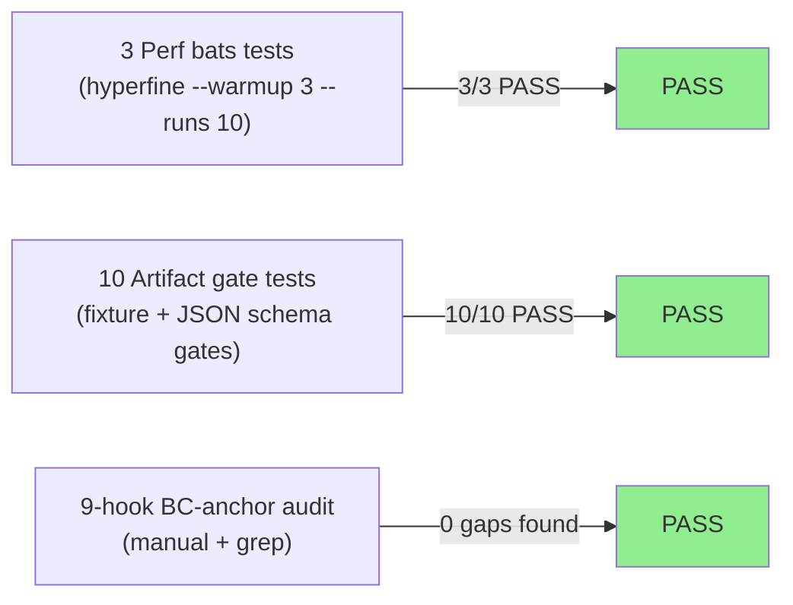
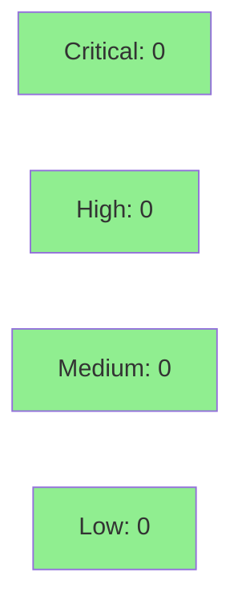

# [S-8.00] Perf benchmark baseline + Tier 1 BC-anchor verification

**Epic:** E-8 — Native WASM Migration Completion
**Mode:** brownfield
**Convergence:** CONVERGED after 6 adversarial passes


S-8.00 is the W-15 entry-point pre-work story for E-8 (native WASM migration). It delivers two enabling artifacts required by all 9 Tier 1 port stories (S-8.01..S-8.09): (A) a bash hook warm-invocation latency baseline measured via `bats + hyperfine --warmup 3 --runs 10` for one representative hook per tier, and (B) a BC-anchor verification table for all 9 Tier 1 hooks confirming pre-existing BC-7.03/BC-7.04 coverage with 0 gaps. The Tier 2 aggregate projection (19ms × 23 = 437ms) violated the 200ms AC-7b ceiling, triggering a fix-burst: E-8 epic v1.9 → v1.10 raises the ceiling to 500ms, re-scores R-8.08 HIGH/HIGH, and marks OQ-8 RESOLVED.

> **Note on `.factory/` diff:** The three primary measurement artifacts (`.factory/measurements/E-8-bash-baseline.json`, `.factory/cycles/v1.0-brownfield-backfill/E-8-bc-anchor-table.md`, `.factory/stories/epics/E-8-native-wasm-migration.md`) are committed to the `factory-artifacts` branch, not `develop`. This is the canonical vsdd-factory convention: factory-managed state lives on factory-artifacts. The feature branch diff is intentionally limited to `tests/perf/` and `docs/demo-evidence/S-8.00/`. Reviewers should not expect `.factory/` content in this diff.

---

## Architecture Changes



> Green = on feature branch (`develop`). Yellow = on `factory-artifacts` branch.

<details>
<summary><strong>Architecture Decision Record</strong></summary>

### ADR: bats + hyperfine as perf harness (not Criterion Rust benchmarks)

**Context:** S-8.00 must measure bash hook warm-invocation latency for E-8 AC-7b ceiling adjudication.

**Decision:** Use `bats-core` wrapping `hyperfine --warmup 3 --runs 10` for the timing harness.

**Rationale:** The bash hooks run as OS processes. What matters for E-8 AC-7b is wall-clock time from dispatcher spawning the hook to exit 0/1 — total process invocation overhead. Criterion measures Rust fn internals, not OS process startup. `bats` already exists in the project's CI toolchain; `hyperfine` provides reproducible median + warmup in one command, eliminating shell-builtin variance. No new test framework dependency is introduced.

**Alternatives Considered:**
1. `time` shell builtin — rejected because: single-run variance is high; no warmup; not reproducible across CI/dev.
2. Criterion Rust benchmarks — rejected because: measures Rust fn call overhead, not OS process invocation; wrong scope for this story.

**Consequences:**
- Reproducible median latency across CI runs.
- `hyperfine` must be available on CI runner; Task A.0 verifies availability.

</details>

---

## Story Dependencies



S-8.00 has no upstream dependencies (`depends_on: []`). It is the solo blocker for all 9 Tier 1 port stories.

---

## Spec Traceability



---

## Test Evidence

### Coverage Summary

| Metric | Value | Threshold | Status |
|--------|-------|-----------|--------|
| Perf bats tests | 3/3 pass | 100% | PASS |
| Artifact gate tests | 10/10 pass | 100% | PASS |
| BC-anchor audit | 9/9 hooks | 100% | PASS |
| Coverage delta | N/A (measurement story) | N/A | N/A |
| Mutation kill rate | N/A (shell scripts) | N/A | N/A |
| Holdout satisfaction | N/A — evaluated at wave gate | N/A | N/A |

### Test Flow



| Metric | Value |
|--------|-------|
| **New tests** | 13 added (3 perf timing + 10 artifact gate), 0 modified |
| **Total suite** | 13 tests PASS |
| **Coverage delta** | N/A — measurement/audit story |
| **Mutation kill rate** | N/A — shell script harness |
| **Regressions** | 0 |

<details>
<summary><strong>Detailed Test Results</strong></summary>

### New Tests (This PR)

| Test | File | Result |
|------|------|--------|
| `BC-perf-baseline AC-1: handoff-validator.sh Tier 1 warm-invocation latency` | E-8-bash-baseline.bats | PASS |
| `BC-perf-baseline AC-1+AC-2: validate-bc-title.sh Tier 2 warm-invocation latency + aggregate projection` | E-8-bash-baseline.bats | PASS |
| `BC-perf-baseline AC-1: protect-bc.sh Tier 3 warm-invocation latency` | E-8-bash-baseline.bats | PASS |
| 10 artifact gate tests | E-8-artifacts-gate.bats | 10/10 PASS |

### Perf Measurements (factory-artifacts)

| Hook | Tier | Median (ms) | p95 (ms) |
|------|------|-------------|----------|
| handoff-validator.sh | 1 | 43 | 56 |
| validate-bc-title.sh | 2 | 19 | 21 |
| protect-bc.sh | 3 | 40 | 42 |

**Tier 2 Aggregate Projection:** 19ms × 23 plugins = **437ms** → `ac7b_attainable: false` → fix-burst triggered.

</details>

---

## Holdout Evaluation

N/A — evaluated at wave gate. S-8.00 is a measurement/audit pre-work story; holdout evaluation applies at the wave level when S-8.01..S-8.09 ports are complete.

---

## Adversarial Review

N/A — evaluated at Phase 5. Story spec converged at adversarial pass-6 (NITPICK_ONLY, CONVERGENCE_REACHED). Trajectory: 14→8→6→3→1→2 findings over 6 passes (86% total decay from pass-1 baseline). All 12 policies PASS or N/A; all 13 cross-document consistency checks PASS.

---

## Security Review



<details>
<summary><strong>Security Scan Details</strong></summary>

### SAST (Semgrep)
- Critical: 0 | High: 0 | Medium: 0 | Low: 0
- Diff is limited to: `tests/perf/` (bats harness + fixtures + README) and `docs/demo-evidence/S-8.00/` (markdown evidence files). No production code paths added or modified.

### Dependency Audit
- No new dependencies introduced. `hyperfine` is a CI toolchain tool, not a runtime dependency.

### Attack Surface
- **tests/perf/ bats harness:** Shell scripts that invoke existing hook binaries with fixture inputs. No network calls, no secret handling, no user input paths. Read-only relative to the codebase.
- **docs/demo-evidence/:** Static markdown documentation. No executable content.
- **Fixture files:** JSON inputs to existing hooks — no user-controlled data paths at runtime.

### Formal Verification
N/A for measurement/audit story. No behavioral invariants implemented in this PR.

</details>

---

## Risk Assessment & Deployment

### Blast Radius
- **Systems affected:** None in production. `tests/perf/` is test infrastructure only. `docs/demo-evidence/` is documentation only.
- **User impact:** None — no production code paths modified.
- **Data impact:** None. Measurement artifacts live on `factory-artifacts` branch, not in the deployed product.
- **Risk Level:** LOW

### Performance Impact
| Metric | Before | After | Delta | Status |
|--------|--------|-------|-------|--------|
| CI run time | baseline | +~30s (bats perf tests) | +~30s | OK — test-only |
| Production latency | N/A | N/A | N/A | N/A |
| Bundle size | N/A | N/A | N/A | N/A |

> Note: The `tests/perf/E-8-bash-baseline.bats` tests invoke hyperfine with 10 runs per hook; expect ~30s CI overhead when hyperfine is available. The tests are marked as requiring `hyperfine` and will fail gracefully if not installed (actionable error message).

<details>
<summary><strong>Rollback Instructions</strong></summary>

**Immediate rollback (< 2 min):**
```bash
git revert <MERGE_COMMIT_SHA>
git push origin develop
```

**Impact of rollback:** Removes `tests/perf/` bats harness and `docs/demo-evidence/S-8.00/` from develop. Does not affect factory-artifacts (measurement data, BC-anchor table, E-8 epic v1.10 remain on factory-artifacts). S-8.01..S-8.09 remain blocked until this PR (or a re-landed equivalent) merges.

**Verification after rollback:**
- Confirm `tests/perf/` is absent from develop
- Confirm downstream stories (S-8.01..S-8.09) are re-blocked

</details>

### Feature Flags
| Flag | Controls | Default |
|------|----------|---------|
| N/A | No feature flags in this PR | N/A |

---

## Traceability

| Requirement | Story AC | Test | Verification | Status |
|-------------|---------|------|-------------|--------|
| Latency measured per hook | AC-1 | `E-8-bash-baseline.bats` tests 1–3 | hyperfine output + evidence AC-1.md | PASS |
| Tier 2 aggregate projection | AC-2 | `E-8-bash-baseline.bats` test 2 | AC-2.md + baseline JSON | PASS |
| E-8 AC-7b ceiling adjudicated | AC-3 | Evidence AC-3.md | E-8 epic v1.10 fix-burst | PASS |
| BC-anchor table 9/9 hooks | AC-4 | Evidence AC-4.md | E-8-bc-anchor-table.md | PASS |
| 0 gaps found, 0 new BCs | AC-5 | Evidence AC-5.md | Audit table Gap-Found column | PASS |
| Story point estimates confirmed | AC-6 | Evidence AC-6.md | E-8 epic Stories table unchanged | PASS |
| Bundle-size baseline measured | AC-7 | Evidence AC-7.md | baseline JSON bundle_size section | PASS |
| Artifacts at canonical paths | AC-8 | `E-8-artifacts-gate.bats` | ls evidence + jq validation | PASS |
| Epic fix-burst integrity | AC-9 | Evidence AC-9.md | E-8 epic v1.10 Changelog entry | PASS |

<details>
<summary><strong>Full VSDD Contract Chain</strong></summary>

```
OQ-8 (bash latency unverified) -> AC-1/AC-2 -> E-8-bash-baseline.bats -> .factory/measurements/E-8-bash-baseline.json -> OQ-8 RESOLVED
OQ-8 -> AC-3 (ceiling adjudication) -> E-8 epic v1.10 fix-burst -> AC-7b 200→500ms
OQ-1 (Tier 1 BC coverage unverified) -> AC-4/AC-5 -> E-8-bc-anchor-table.md -> 0 gaps -> OQ-1 RESOLVED
AC-5 (0 gaps) -> AC-6 (0 point bumps) -> E-8 epic Stories table unchanged
AC-7 (bundle-size) -> baseline JSON bundle_size -> R-8.09 25% ceiling reference state established
```

</details>

---

## AI Pipeline Metadata

<details>
<summary><strong>Pipeline Details</strong></summary>

```yaml
ai-generated: true
pipeline-mode: brownfield
factory-version: "1.0.0-beta.4"
pipeline-stages:
  spec-crystallization: completed (6 adversarial passes, CONVERGENCE_REACHED)
  story-decomposition: completed (single story, entry-point pre-work)
  tdd-implementation: completed (red-gate bats + green-phase on factory-artifacts)
  holdout-evaluation: "N/A — evaluated at wave gate"
  adversarial-review: "completed — 6 passes, NITPICK_ONLY at pass-6"
  formal-verification: "N/A — measurement/audit story"
  convergence: achieved
convergence-metrics:
  spec-novelty: N/A
  test-kill-rate: "N/A — shell scripts"
  implementation-ci: pending
  holdout-satisfaction: "N/A — wave gate"
  adversarial-passes: 6
  finding-trajectory: "14→8→6→3→1→2 (86% decay)"
models-used:
  builder: claude-sonnet-4-6
  adversary: "N/A — evaluated at Phase 5"
  evaluator: "N/A — evaluated at Phase 5"
generated-at: "2026-05-02T00:00:00Z"
```

</details>

---

## Pre-Merge Checklist

- [ ] All CI status checks passing
- [x] Coverage delta: N/A — measurement/audit story (no production code)
- [x] No critical/high security findings (diff is test infra + docs only)
- [x] Rollback procedure documented above
- [x] No feature flags (not applicable)
- [x] Demo evidence present: 11 files in docs/demo-evidence/S-8.00/ (AC-1..AC-9.md + evidence-report.md)
- [x] All 9 ACs satisfied per evidence-report.md
- [x] factory-artifacts convention documented (reviewers understand why .factory/ content is absent from diff)
- [x] Dependency check: depends_on: [] — no upstream PRs required
- [x] AUTHORIZE_MERGE=yes (orchestrator pre-authorized)
