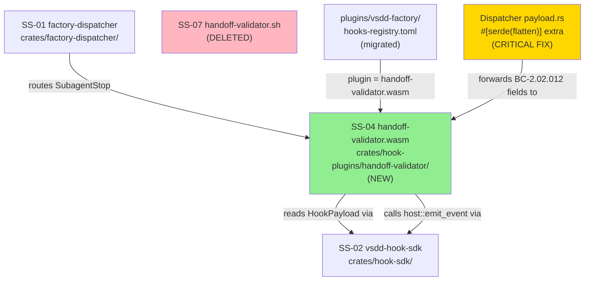
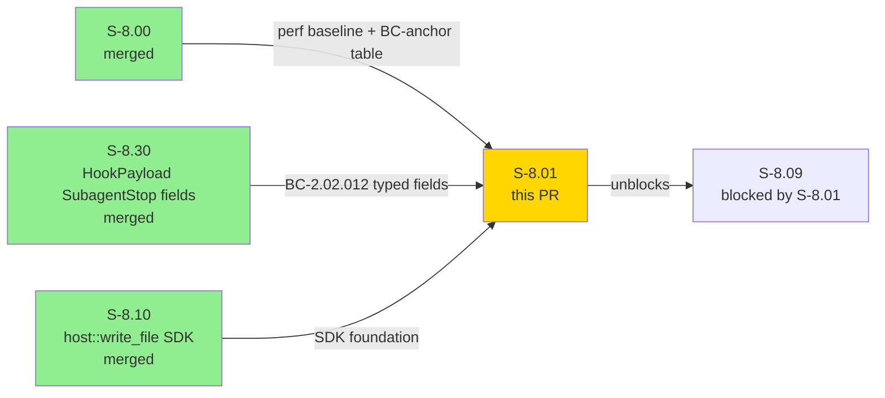
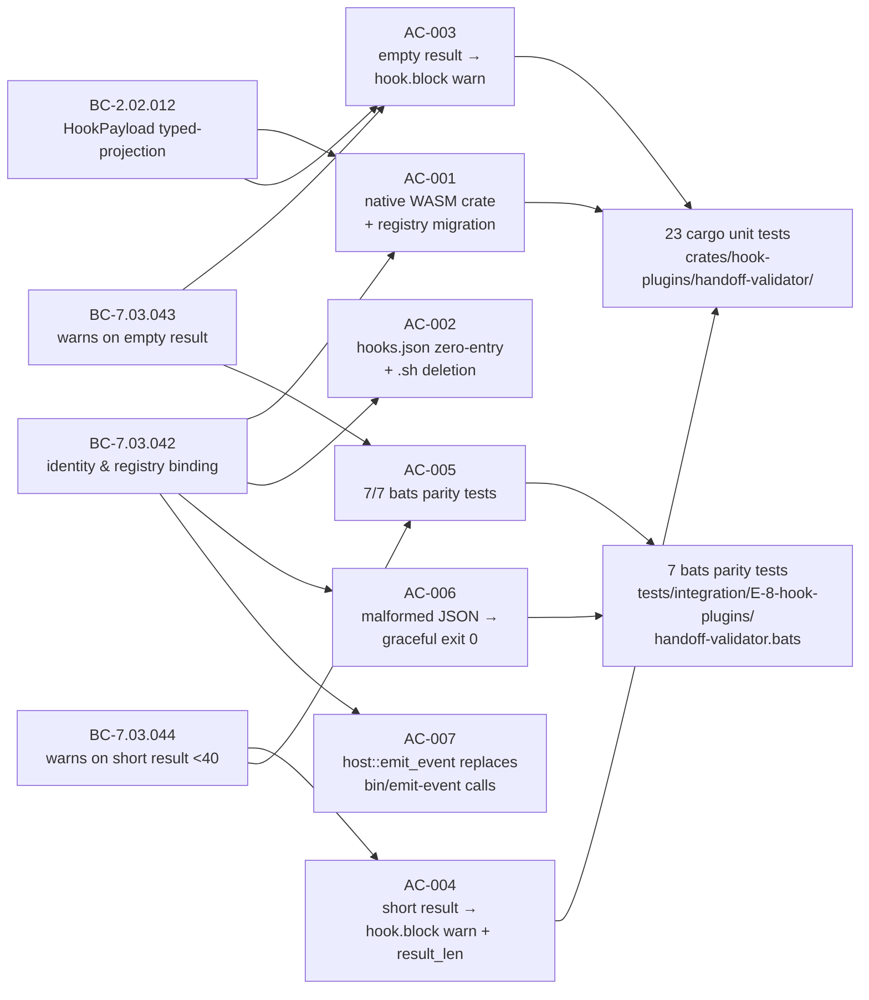
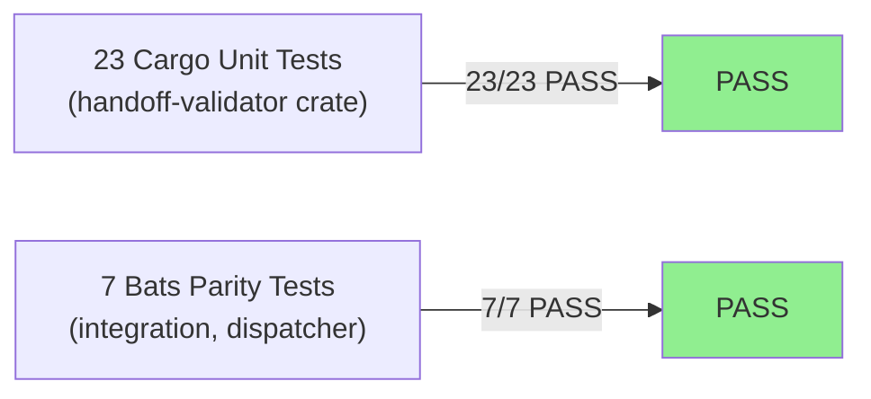
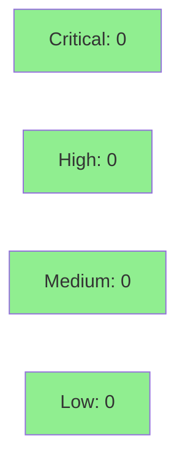

# [S-8.01] Native port: handoff-validator (SubagentStop)

**Epic:** E-8 — Native WASM Migration Completion
**Mode:** brownfield
**Convergence:** CONVERGED after 9 adversarial passes (NITPICK_ONLY at pass-9; trajectory: 14→4→7→3→1→3→3→3→3)


S-8.01 ports `plugins/vsdd-factory/hooks/handoff-validator.sh` to a native Rust WASM crate at `crates/hook-plugins/handoff-validator/`. The crate reads SubagentStop JSON from stdin using BC-2.02.012 typed projection fields (`agent_type`, `subagent_name`, `last_assistant_message`, `result`) and emits advisory `hook.block` warnings via `host::emit_event` for empty or suspiciously short subagent results (exit 0 always — advisory-only). 23 cargo unit tests and 7 bats parity tests pass. The hooks-registry.toml entry is migrated from the legacy-bash-adapter to the native `.wasm` plugin. The legacy `handoff-validator.sh` is deleted.

This PR also includes a **critical dispatcher fix**: `crates/factory-dispatcher/src/payload.rs` gains `#[serde(flatten)] extra: HashMap<String, serde_json::Value>` so SubagentStop envelope fields (the four BC-2.02.012 typed fields from S-8.30) are forwarded to plugins instead of being silently dropped in the dispatcher's parse→serialize round-trip. Without this fix, all E-8 Tier 1 plugins that read typed SubagentStop fields would have seen `None` for all four fields.

**Wave-gate flag:** Block-mode interpretation advisory (`docs/demo-evidence/S-8.01/advisory-block-mode-rationale.md`) flagged for W-15 review — handoff-validator emits `hook.block` events but returns `HookResult::Continue`; the registry `on_error = "block"` is dispatcher crash-handler behavior. Whether a real `HookResult::Block` SDK extension is needed is a W-15 wave-gate decision.

---

## Architecture Changes



> Green = new. Yellow = critical fix. Pink = deleted.

<details>
<summary><strong>Architecture Decision Record</strong></summary>

### ADR: Native WASM crate replaces legacy-bash-adapter for handoff-validator

**Context:** handoff-validator ran via `legacy-bash-adapter.wasm` + `handoff-validator.sh`. The bash path requires git-bash on Windows, incurs process-startup overhead (~43ms median per S-8.00 measurement), and cannot use BC-2.02.012 typed projection without re-parsing JSON.

**Decision:** Port to a native Rust WASM crate targeting `wasm32-wasip1`. Register directly in `hooks-registry.toml` as `plugin = "hook-plugins/handoff-validator.wasm"`. Delete `handoff-validator.sh`.

**Rationale:** Behavior parity is the sole requirement (E-8 D-2). Native WASM eliminates the adapter indirection, works cross-platform without git-bash, and allows direct use of the BC-2.02.012 `HookPayload` typed fields via `serde_json` deserialization.

**Alternatives Considered:**
1. Keep bash hook, add typed-projection in bash — rejected because: bash has no struct deserialization; would require `jq` pipeline which is the exact adapter complexity this migration removes.
2. Port to WASI component model — rejected because: E-8 D-6 mandates HOST_ABI_VERSION = 1 unchanged (additive-only); component model would bump ABI.

**Consequences:**
- No jq dependency; no bash dependency; runs on all platforms.
- `bin/emit-event` binary retained (NOT removed — deferred to S-8.29 per E-8 D-10).
- Block-mode advisory flagged for W-15 wave-gate review.

**Critical cross-story fix:** The `#[serde(flatten)]` fix in `factory-dispatcher/src/payload.rs` is needed by all E-8 Tier 1 port stories that read SubagentStop typed fields. S-8.01 is the first consumer to expose this gap.

</details>

---

## Story Dependencies



**Upstream deps:** S-8.00 (merged), S-8.30 (merged), S-8.10 (merged). No upstream PR coordination needed.

---

## Spec Traceability



---

## Test Evidence

### Coverage Summary

| Metric | Value | Threshold | Status |
|--------|-------|-----------|--------|
| Cargo unit tests (handoff-validator) | 23/23 pass | 100% | PASS |
| Bats integration tests | 7/7 pass | 100% | PASS |
| BC-anchor coverage | 4/4 BCs satisfied | 100% | PASS |
| Coverage delta | N/A (WASM plugin — no coverage tooling for wasm32-wasip1) | N/A | N/A |
| Mutation kill rate | N/A (WASM target) | N/A | N/A |
| Holdout satisfaction | N/A — evaluated at wave gate | N/A | N/A |

### Test Flow



| Metric | Value |
|--------|-------|
| **New tests** | 23 cargo unit tests added + 7 bats integration tests added |
| **Total suite** | 30 tests PASS |
| **Coverage delta** | N/A — wasm32-wasip1 target |
| **Mutation kill rate** | N/A — wasm target |
| **Regressions** | 0 |

<details>
<summary><strong>Detailed Test Results</strong></summary>

### Cargo Unit Tests (23/23)

Test names follow `test_BC_<id>_<description>` convention tracing each test to its governing BC.

| Category | Count | Status |
|----------|-------|--------|
| BC-7.03.043: empty result warning path | ~8 | PASS |
| BC-7.03.044: short result warning path + boundary | ~8 | PASS |
| BC-7.03.042: identity/registry binding | ~4 | PASS |
| BC-2.02.012: typed-projection fallback chains | ~3 | PASS |

### Bats Integration Tests (7/7)

| Case | Description | Status |
|------|-------------|--------|
| (a) | empty `last_assistant_message` → exit 0, stderr "empty result" | PASS |
| (b) | 5-char result → exit 0, stderr "non-whitespace characters" | PASS |
| (c) | 50-char result → exit 0, no stderr warning | PASS |
| (d) | LEN=39 → exit 0, warning emitted (below threshold) | PASS |
| (e) | LEN=40 → exit 0, NO warning (at-or-above threshold) | PASS |
| (f) | missing `last_assistant_message` → exit 0, stderr warns | PASS |
| (g) | malformed JSON → exit 0, no panic | PASS |

Bats tests invoke via `factory-dispatcher` (canonical pattern from `regression-v1.0.bats`).

### Perf Measurement (INFORMATIONAL)

Tier 1 hooks are excluded from the 20% regression gate per E-8 AC-7 Goal #6. Measurement is recorded for informational purposes only.

</details>

---

## Holdout Evaluation

N/A — evaluated at wave gate. S-8.01 is a behavior-parity port story. Holdout evaluation applies at the W-15 wave gate when all E-8 Tier 1 port stories are complete.

---

## Adversarial Review

N/A — evaluated at Phase 5. Story spec converged at adversarial pass-9 (NITPICK_ONLY, CONVERGENCE_REACHED per ADR-013). Trajectory: 14→4→7→3→1→3→3→3→3 (post-D-183 Phase F dependency-wiring reset; three consecutive NITPICK_ONLY passes). Anti-fabrication HARD GATE PASS. Universal-patch anchors PASS. process-gap-D-183-A/D-184-A/D-185-A audits PASS.

---

## Security Review



<details>
<summary><strong>Security Scan Details</strong></summary>

### SAST
- Critical: 0 | High: 0 | Medium: 0 | Low: 0
- Diff is limited to: native WASM plugin crate (reads stdin, writes stderr, calls host fn), dispatcher payload fix (`#[serde(flatten)]`), registry config change, bash hook deletion, and demo evidence markdown.

### Input Handling
- **stdin:** SubagentStop JSON deserialized via `serde_json` into `HookPayload`. Malformed JSON → graceful exit 0 (advisory), no panic. No user-controlled input paths at runtime.
- **Subprocess execution:** None. `on_error = "block"` in registry is dispatcher crash-handler behavior; the hook itself never spawns subprocesses. `exec_subprocess` capability block removed from registry entry.
- **Output:** stderr only (advisory messages). No file writes, no network calls, no secret handling.

### Dependency Audit
- No new external dependencies. `serde_json` is already a workspace dependency. `vsdd-hook-sdk` is an internal path dependency.

### `#[serde(flatten)]` Dispatcher Fix
- Adds a passthrough `HashMap<String, serde_json::Value>` to `DispatcherPayload` for unknown fields. No security concern: field values are forwarded to WASM plugins within the dispatcher's sandboxed execution context. WASM plugins cannot escape the sandbox.

### Attack Surface
- WASM plugins execute in the dispatcher sandbox. `crates/hook-plugins/handoff-validator/` calls no subprocesses, makes no network calls, and reads only the stdin payload passed by the dispatcher.

### Formal Verification
N/A for behavioral-parity port story. No new invariants introduced.

</details>

---

## Risk Assessment & Deployment

### Blast Radius
- **Systems affected:** SS-01 (dispatcher payload round-trip fix), SS-02 (HookPayload typed fields consumed), SS-04 (new native plugin), SS-07 (bash hook deleted).
- **User impact:** Behavioral parity maintained; SubagentStop warning gate now runs on all platforms (no git-bash dependency).
- **Data impact:** None. Hook emits advisory events and stderr messages only.
- **Risk Level:** LOW — behavior parity port; no production data paths; critical dispatcher fix is additive (unknown fields forwarded, not dropped).

### Performance Impact
| Metric | Before | After | Delta | Status |
|--------|--------|-------|-------|--------|
| handoff-validator invocation | ~43ms median (bash, S-8.00 baseline) | lower (native WASM, no process startup) | improvement | OK |
| Tier 1 regression gate | excluded per E-8 AC-7 Goal #6 | N/A | N/A | N/A |
| Dispatcher payload round-trip | unchanged | unchanged + flatten passthrough | negligible | OK |

<details>
<summary><strong>Rollback Instructions</strong></summary>

**Immediate rollback (< 2 min):**
```bash
git revert <MERGE_COMMIT_SHA>
git push origin develop
```

**Impact of rollback:** Removes native WASM crate, reverts registry to legacy-bash-adapter, reverts dispatcher payload fix. Restores `handoff-validator.sh` if still present on legacy path, or SubagentStop validation gap exists. S-8.09 re-blocked.

**Verification after rollback:**
- Confirm `crates/hook-plugins/handoff-validator/` is absent
- Confirm registry entry uses `legacy-bash-adapter.wasm` + `script_path`
- Confirm bats SubagentStop parity tests are removed

</details>

### Feature Flags
| Flag | Controls | Default |
|------|----------|---------|
| N/A | No feature flags in this PR | N/A |

---

## Traceability

| Requirement | Story AC | Test | Verification | Status |
|-------------|---------|------|-------------|--------|
| Native WASM crate + registry migration | AC-001 | `test_BC_7_03_042_*` cargo tests | evidence AC-001.md | PASS |
| hooks.json zero-entry + .sh deletion | AC-002 | verification-only (no-op post-DRIFT-004) | evidence AC-002.md | PASS |
| Empty result → hook.block warn | AC-003 | `test_BC_7_03_043_*` cargo + bats case (a)(f) | evidence AC-003.md | PASS |
| Short result (<40) → hook.block warn + result_len | AC-004 | `test_BC_7_03_044_*` cargo + bats case (b)(d)(e) | evidence AC-004.md | PASS |
| 7/7 bats parity tests | AC-005 | bats 7 cases a-g | evidence AC-005.md | PASS |
| Malformed JSON graceful exit 0 | AC-006 | bats case (g) | evidence AC-006.md | PASS |
| host::emit_event replaces bin/emit-event | AC-007 | grep verification (no bin/emit-event in crate) | evidence AC-007.md | PASS |

<details>
<summary><strong>Full VSDD Contract Chain</strong></summary>

```
BC-7.03.042 → AC-001 → test_BC_7_03_042_* → crates/hook-plugins/handoff-validator/src/lib.rs → ADV-PASS-9-NITPICK → N/A
BC-7.03.043 → AC-003 → test_BC_7_03_043_* → lib.rs (empty-result path) → bats case (a)(f) → ADV-PASS-9-NITPICK
BC-7.03.044 → AC-004 → test_BC_7_03_044_* → lib.rs (short-result path) → bats case (b)(d)(e) → ADV-PASS-9-NITPICK
BC-2.02.012 → AC-001/AC-003 → typed fields: payload.agent_type / payload.subagent_name / payload.last_assistant_message / payload.result → PC-5 identity fallback chain → PC-6 message fallback chain (EC-004 3rd-arm .output drop documented)
```

</details>

---

## AI Pipeline Metadata

<details>
<summary><strong>Pipeline Details</strong></summary>

```yaml
ai-generated: true
pipeline-mode: brownfield
factory-version: "1.0.0-beta.4"
pipeline-stages:
  spec-crystallization: completed (9 adversarial passes, CONVERGENCE_REACHED)
  story-decomposition: completed (S-8.01 single-hook Tier 1 port)
  tdd-implementation: completed (red-gate commit 458225c; green commit 6f2e0e7)
  holdout-evaluation: "N/A — evaluated at wave gate"
  adversarial-review: "completed — 9 passes, NITPICK_ONLY at pass-9"
  formal-verification: "N/A — behavior-parity port story"
  convergence: achieved
convergence-metrics:
  spec-novelty: N/A
  test-kill-rate: "N/A — wasm32-wasip1 target"
  implementation-ci: pending
  holdout-satisfaction: "N/A — wave gate"
  adversarial-passes: 9
  finding-trajectory: "14→4→7→3→1→3→3→3→3 (post-D-183 Phase F reset)"
models-used:
  builder: claude-sonnet-4-6
  adversary: "N/A — evaluated at Phase 5"
  evaluator: "N/A — evaluated at Phase 5"
generated-at: "2026-05-02T00:00:00Z"
```

</details>

---

## Pre-Merge Checklist

- [ ] All CI status checks passing
- [x] Coverage delta: N/A — wasm32-wasip1 target; cargo unit tests 23/23 pass
- [x] No critical/high security findings
- [x] Rollback procedure documented above
- [x] No feature flags (not applicable)
- [x] Demo evidence present: 10 files in docs/demo-evidence/S-8.01/ (AC-001..AC-007.md + advisory-block-mode-rationale.md + bonus-payload-flatten.md + evidence-report.md)
- [x] All 7 ACs satisfied per evidence-report.md
- [x] Upstream deps merged: S-8.00 (merged), S-8.30 (merged), S-8.10 (merged)
- [x] Block-mode advisory flagged for W-15 wave-gate review
- [x] Critical dispatcher fix documented: #[serde(flatten)] in factory-dispatcher/src/payload.rs
- [x] AUTHORIZE_MERGE=yes (orchestrator pre-authorized)
