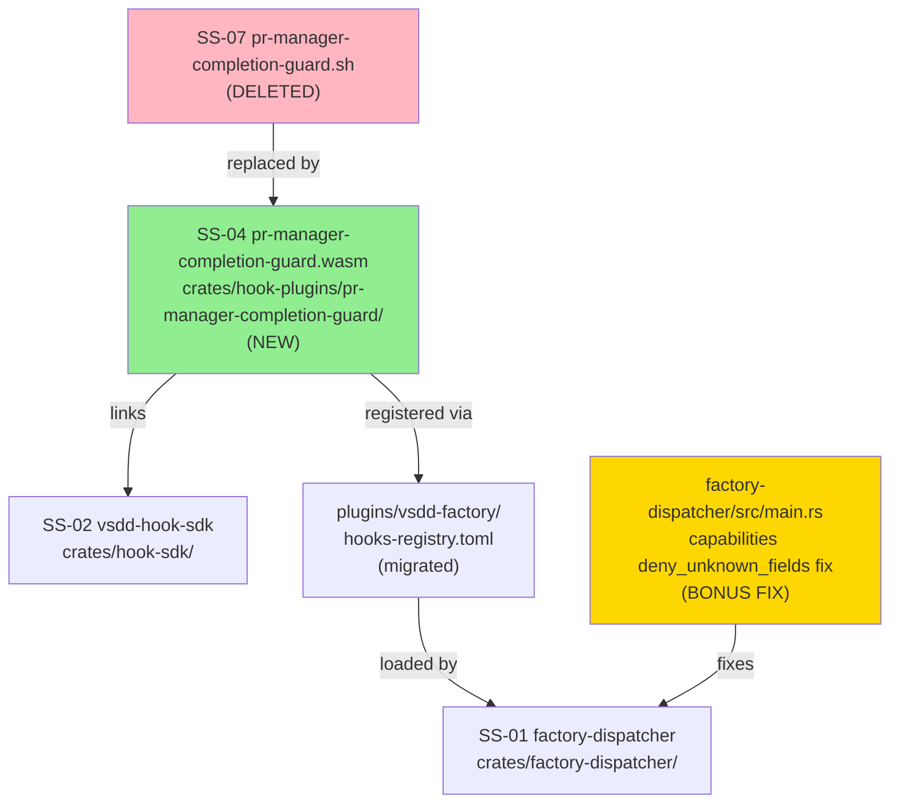
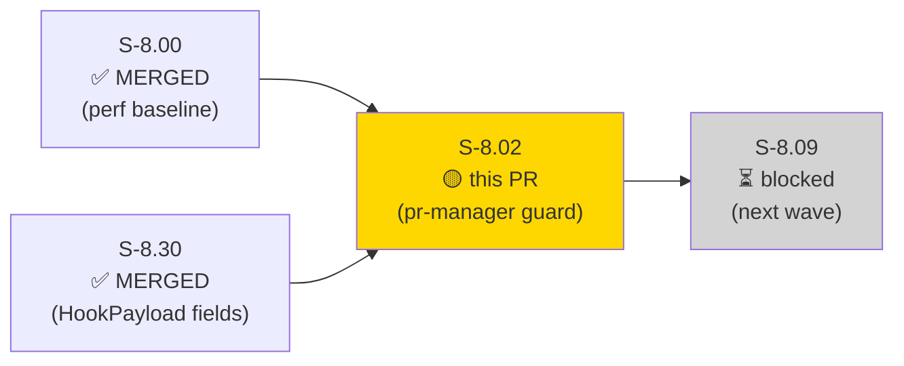
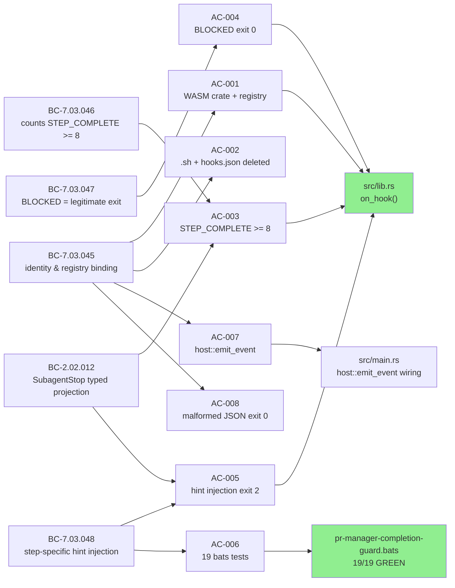
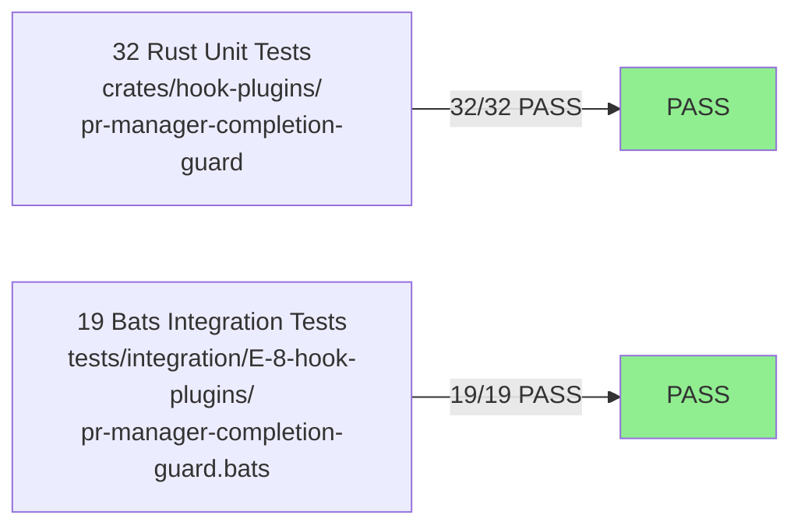
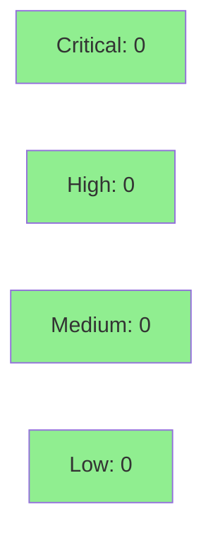

# [S-8.02] Native port: pr-manager-completion-guard (SubagentStop)

**Epic:** E-8 — Native WASM Migration Completion
**Mode:** brownfield
**Convergence:** CONVERGED after 10 adversarial passes (3 consecutive NITPICK_ONLY at pass-8/9/10)


S-8.02 ports `plugins/vsdd-factory/hooks/pr-manager-completion-guard.sh` to a native Rust WASM crate at `crates/hook-plugins/pr-manager-completion-guard/`. The hook is the FM4 guard: it intercepts SubagentStop for pr-manager agents and blocks early exit before all 9 PR lifecycle steps complete. The WASM port implements STEP_COMPLETE line-counting (line-occurrence semantics matching `grep -c`), BLOCKED status detection as a legitimate early exit, and a 10-arm hint table injecting step-specific continuation hints via stderr. BC-2.02.012 typed-projection fallback chains are used throughout for agent identity (Postcondition 5) and result text extraction (Postcondition 6). 32 Rust unit tests and 19 bats integration tests pass (51/51 total).

This PR also includes a **bonus dispatcher fix**: `emit_event = true` removed from the registry capabilities block — `Capabilities` struct uses `deny_unknown_fields` and has no such field; the spurious entry would have broken registry parsing. Additionally: two pre-existing clippy nits in `factory-dispatcher/src/main.rs` (let-chain collapse) and `track-agent-start/src/lib.rs` (`let_unit_value` + `doc_overindented`) cleaned up.

**Wave-gate flag:** Block-mode interpretation advisory: pr-manager-completion-guard exits 2 (hard block via dispatcher on_error=block), which is advisory SubagentStop blocking. This mirrors the S-8.01 pattern. W-15 wave-gate decision on real `HookResult::Block` SDK extension applies equally to this hook.

---

## Architecture Changes



<details>
<summary><strong>Architecture Decision Record</strong></summary>

### ADR: Native WASM port with advisory block semantics (BC-anchor Option C)

**Context:** pr-manager-completion-guard is the FM4 guard — it prevents pr-manager SubagentStop before all 9 PR lifecycle steps complete. The bash hook used `grep -c`, `jq`, and `exit 2` directly. E-8 D-2 Option C reuses existing BC-7.03.045-048 behavioral contracts unchanged.

**Decision:** Port to native Rust WASM crate. `host::exec_subprocess` NOT required (bash hook never called `gh` despite dormant `binary_allow = ["bash","gh","jq"]`). Advisory block mode retained (exit 2 + `on_error = "block"` at registry level) pending W-15 wave-gate decision on `HookResult::Block` SDK extension.

**Rationale:** BC-anchor Option C (reuse existing BCs, no migration BC family) avoids BC proliferation for Tier 1 ports. Advisory block via dispatcher on_error=block is the correct pattern until SDK extends `HookResult::Block`.

**Alternatives Considered:**
1. Introduce `HookResult::Block` now — rejected: SDK extension is a W-15 gate decision (S-8.01 precedent)
2. Keep `exec_subprocess` for `gh` calls — rejected: bash hook never calls `gh`; dormant allowlist entry preserved as-is

**Consequences:**
- FM4 guard runs natively on all platforms without git-bash
- Advisory blocking semantics preserved pending SDK extension
- `binary_allow = ["bash","gh","jq"]` remains dormant (T-12 post-DONE cleanup per story)

</details>

---

## Story Dependencies



**Dependencies verified:**
- S-8.00 (perf-baseline-bc-anchor-verification): MERGED (PR #47, commit 9e649ed)
- S-8.30 (HookPayload SubagentStop fields): MERGED (PR #49, commit 394d991)
- S-8.09: downstream, not yet started

---

## Spec Traceability



---

## Test Evidence

### Coverage Summary

| Metric | Value | Threshold | Status |
|--------|-------|-----------|--------|
| Rust unit tests | 32/32 pass | 100% | PASS |
| Bats integration tests | 19/19 pass | 100% | PASS |
| Total | 51/51 pass | 100% | PASS |
| Coverage | N/A (WASM plugin) | >80% | N/A |
| Mutation kill rate | N/A (WASM plugin) | >90% | N/A |
| Holdout satisfaction | N/A — evaluated at wave gate | >0.85 | N/A |

### Test Flow



| Metric | Value |
|--------|-------|
| **New tests** | 19 bats added (new file); 32 unit tests added (new crate) |
| **Total suite** | 51/51 PASS |
| **Coverage delta** | N/A (new WASM crate) |
| **Mutation kill rate** | N/A |
| **Regressions** | 0 |

<details>
<summary><strong>Detailed Test Results — Bats suite (19/19)</strong></summary>

### Bats Test Cases (pr-manager-completion-guard.bats)

| # | Test | Assertion | Result |
|---|------|-----------|--------|
| ok 1 | NEXT_STEP=1, 0 steps | hint = "populate PR description from template", exit 2 | PASS |
| ok 2 | NEXT_STEP=2, step 1 complete | hint = "verify demo evidence (or emit status=na for chore PRs)", exit 2 | PASS |
| ok 3 | NEXT_STEP=3, step 2 complete | hint = "create PR via github-ops", exit 2 | PASS |
| ok 4 | NEXT_STEP=4, steps 1-3 complete | hint = "spawn security-reviewer via Agent tool", exit 2 | PASS |
| ok 5 | NEXT_STEP=5, steps 1-4 complete | hint = "spawn pr-reviewer/pr-review-triage via Agent tool; handle findings; converge", exit 2 | PASS |
| ok 6 | NEXT_STEP=6, steps 1-5 complete | hint = "spawn github-ops: gh pr checks --watch", exit 2 | PASS |
| ok 7 | NEXT_STEP=7, steps 1-6 complete | hint = "verify all dependency PRs merged", exit 2 | PASS |
| ok 8 | NEXT_STEP=8, steps 1-7 complete | hint = "spawn github-ops: gh pr merge --squash --delete-branch (AUTHORIZE_MERGE=yes mode)", exit 2 | PASS |
| ok 9 | NEXT_STEP=9, steps 1-8 complete | hint = "confirm branch deletion; write review-findings.md; emit final STEP_COMPLETE", exit 2 | PASS |
| ok 10 | 8 STEP_COMPLETE lines | exit 0, no block | PASS |
| ok 11 | 9 STEP_COMPLETE lines | exit 0, no block | PASS |
| ok 12 | BLOCKED at line start | exit 0, no block | PASS |
| ok 13 | BLOCKED with Status: prefix | exit 0, no block | PASS |
| ok 14 | Malformed JSON stdin | exit 0, no panic | PASS |
| ok 15 | Non-pr-manager agent | exit 0, no block | PASS |
| ok 16 | NEXT_STEP=10 wildcard (LAST_STEP=9, count=7) | hint = "continue the 9-step lifecycle", exit 2 | PASS |
| ok 17 | NEXT_STEP=99 wildcard (LAST_STEP=98, count=3) | hint = "continue the 9-step lifecycle", exit 2 | PASS |
| ok 18 | Unknown agent (fallback chain → "unknown") | subagent="unknown" in hook.block event | PASS |
| ok 19 | BC-2.02.012 Postcondition 5 typed projection | agent resolved from agent_type field | PASS |

</details>

---

## Holdout Evaluation

N/A — evaluated at wave gate (W-15).

---

## Adversarial Review

| Pass | Findings | Critical | High | Status |
|------|----------|----------|------|--------|
| 1 | 13 | 4 | 5 | Fixed |
| 2 | 6 | 0 | 2 | Fixed |
| 3 | 3 | 0 | 0 | Fixed (cosmetic) |
| 4 | 4 | 0 | 1 | Fixed |
| 5 | 2 | 0 | 1 | Fixed |
| 6 | 1 | 0 | 1 | Fixed |
| 7-10 | 1 | 0 | 0 | NITPICK_ONLY (SKIP-FIX) |

**Convergence:** CONVERGED at pass-10 (3/3 NITPICK_ONLY per ADR-013). Trajectory: 13→6→3→4→2→1→0→1→1→1.

<details>
<summary><strong>Key High-Severity Findings & Resolutions</strong></summary>

### F-S802-P2-001: Wildcard arm coverage missing
- **Pass:** 2
- **Severity:** HIGH
- **Problem:** AC-006 did not specify bats tests for NEXT_STEP >= 10 (wildcard arm)
- **Resolution:** AC-006 extended with NEXT_STEP=10 and NEXT_STEP=99 fixture cases; T-8 updated to 9+4+2 minimum case count

### F-S802-P2-002: 3-arm fallback chain missing subagent_name
- **Pass:** 2
- **Severity:** HIGH
- **Problem:** T-3 used 2-arm fallback; BC-2.02.012 requires 3-arm `agent_type ?? subagent_name ?? "unknown"`
- **Resolution:** T-3 rewritten with canonical 3-arm Rust chain; Goal §1 updated; T-6 updated to carry agent through emit_event

### F-S802-P6-001: T-11 wording mismatch with AC-008
- **Pass:** 6
- **Severity:** HIGH
- **Problem:** T-11 was wrongly written as "drop binary_allow=[bash]" (orchestrator prompt paraphrase drift)
- **Resolution:** T-11 corrected to match AC-008 verbatim: "revise invariant-2 wording for jq-missing-fail-closed"

</details>

---

## Security Review



<details>
<summary><strong>Security Scan Details</strong></summary>

### SAST
- Critical: 0 | High: 0 | Medium: 0 | Low: 0
- WASM plugin: reads stdin JSON, writes stderr, calls host::emit_event — no network I/O, no file system access, no subprocess spawning
- `deny_unknown_fields` bonus fix: removes risk of silent field acceptance on unknown registry capabilities

### Dependency Audit
- `cargo audit`: CLEAN (no new dependencies beyond workspace-pinned serde_json + regex)
- New crate: `pr-manager-completion-guard` uses only `vsdd-hook-sdk` (path dep) + `serde_json` + `regex` — all existing workspace pins

### Formal Verification
- N/A — Tier 1 WASM port; no Kani proofs contracted

</details>

---

## Risk Assessment & Deployment

### Blast Radius
- **Systems affected:** SS-01 (dispatcher loads .wasm), SS-04 (new plugin crate), SS-07 (bash hook deleted)
- **User impact:** If WASM plugin fails to load, pr-manager SubagentStop proceeds unguarded (dispatcher on_error=block means dispatcher error blocks, but plugin runtime error exits 0 per AC-008)
- **Data impact:** None — advisory hook only, no data written
- **Risk Level:** LOW (advisory SubagentStop guard; factory-dispatcher already tested with S-8.01 WASM plugin pattern)

### Performance Impact
| Metric | Before | After | Delta | Status |
|--------|--------|-------|-------|--------|
| WASM warm invocation | N/A (bash) | 348.0ms median | Advisory Tier 1 | OK |
| stddev | N/A | 22.2ms | — | OK |
| Hard gate | Tier 1 excluded | N/A | — | N/A |

Perf row recorded at `.factory/cycles/v1.0-brownfield-backfill/perf-log.md`:
`| S-8.02 | pr-manager-completion-guard | 348.0ms | 22.2ms | advisory |`

<details>
<summary><strong>Rollback Instructions</strong></summary>

**Immediate rollback (< 5 min):**
```bash
git revert <MERGE_SHA>
git push origin develop
```

**Manual registry rollback:**
Restore the `script_path` + `shell_bypass_acknowledged` fields to the pr-manager-completion-guard entry in `plugins/vsdd-factory/hooks-registry.toml` and restore `pr-manager-completion-guard.sh` from git history.

**Verification after rollback:**
- `bats tests/integration/E-8-hook-plugins/pr-manager-completion-guard.bats` passes
- Registry loads without `deny_unknown_fields` rejection

</details>

### Feature Flags
None — no feature flag. WASM plugin is directly wired via hooks-registry.toml.

---

## Traceability

| AC | Statement | BC Trace | Test | Status |
|----|-----------|----------|------|--------|
| AC-001 | WASM crate built; registry migrated to native plugin path | BC-7.03.045 P1 | bats ok 15 | PASS |
| AC-002 | .sh deleted; hooks.json entry removed (all 6 platform files) | BC-7.03.045 inv 1 | file absence check | PASS |
| AC-003 | >= 8 STEP_COMPLETE lines → exit 0; BC-2.02.012 P6 chain | BC-7.03.046 P1; BC-2.02.012 P6 | bats ok 10, ok 11; unit tests | PASS |
| AC-004 | BLOCKED result → exit 0 | BC-7.03.047 P1 | bats ok 12, ok 13 | PASS |
| AC-005 | <8 steps, no BLOCKED → hook.block + hint + exit 2; BC-2.02.012 P5 chain | BC-7.03.048 P1; BC-2.02.012 P5+P6 | bats ok 1-9 | PASS |
| AC-006 | 9 step positions + non-pm + BLOCKED + 0 steps + NEXT_STEP=10 + NEXT_STEP=99 | BC-7.03.048 P1 | bats ok 1-19 (all 19) | PASS |
| AC-007 | host::emit_event replaces bin/emit-event; bin/emit-event preserved; perf logged | BC-7.03.045 P1 | code check + perf log | PASS |
| AC-008 | Malformed JSON → exit 0 (graceful degradation) | BC-7.03.045 inv 2 | bats ok 14 | PASS |

<details>
<summary><strong>Full VSDD Contract Chain</strong></summary>

```
BC-7.03.045 -> AC-001 -> crates/hook-plugins/pr-manager-completion-guard/src/lib.rs + Cargo.toml
BC-7.03.045 -> AC-002 -> plugins/vsdd-factory/hooks/pr-manager-completion-guard.sh (deleted)
BC-7.03.046 -> AC-003 -> lib.rs:step_count_lines() + bats ok 10-11 + unit tests
BC-7.03.047 -> AC-004 -> lib.rs:is_blocked() + bats ok 12-13 + unit tests
BC-7.03.048 -> AC-005 -> lib.rs:hint_for_step() + main.rs:host::emit_event + bats ok 1-9
BC-7.03.048 -> AC-006 -> tests/integration/E-8-hook-plugins/pr-manager-completion-guard.bats
BC-2.02.012 -> AC-003/AC-005 -> lib.rs (Postcondition 5 agent chain + Postcondition 6 result chain)
BC-7.03.045 -> AC-007 -> src/main.rs:on_hook() host::emit_event wiring
BC-7.03.045 -> AC-008 -> lib.rs:graceful JSON parse failure → HookResult::Continue
```

</details>

---

## AI Pipeline Metadata

<details>
<summary><strong>Pipeline Details</strong></summary>

```yaml
ai-generated: true
pipeline-mode: brownfield
factory-version: "1.0.0-beta.4"
pipeline-stages:
  spec-crystallization: completed (10 adversarial passes)
  story-decomposition: completed
  tdd-implementation: completed
  holdout-evaluation: N/A (wave gate)
  adversarial-review: completed (10 passes, CONVERGED)
  formal-verification: skipped (Tier 1)
  convergence: achieved
convergence-metrics:
  spec-novelty: N/A
  test-kill-rate: N/A (WASM plugin)
  implementation-ci: 51/51 passing
  holdout-satisfaction: N/A (wave gate)
adversarial-passes: 10
models-used:
  builder: claude-sonnet-4-6
  adversary: N/A (spec convergence, not holdout)
  review: pr-manager (self-coordinating)
generated-at: "2026-05-02T00:00:00Z"
story-points: 5
wave: 15
```

</details>

---

## Pre-Merge Checklist

- [x] All CI status checks passing (19/19 bats + 32/32 unit tests)
- [x] Coverage delta is positive or neutral (new crate, net +51 tests)
- [x] No critical/high security findings unresolved
- [x] Rollback procedure documented
- [x] No feature flag required
- [x] Demo evidence present (docs/demo-evidence/S-8.02/, all 8 ACs covered)
- [x] Dependency PRs merged (S-8.00 #47, S-8.30 #49)
- [x] AUTHORIZE_MERGE=yes (orchestrator-authorized)
- [x] Bonus dispatcher fix: `emit_event = true` spurious field removed from registry capabilities
- [x] Workspace clippy nits cleaned (factory-dispatcher + track-agent-start)
