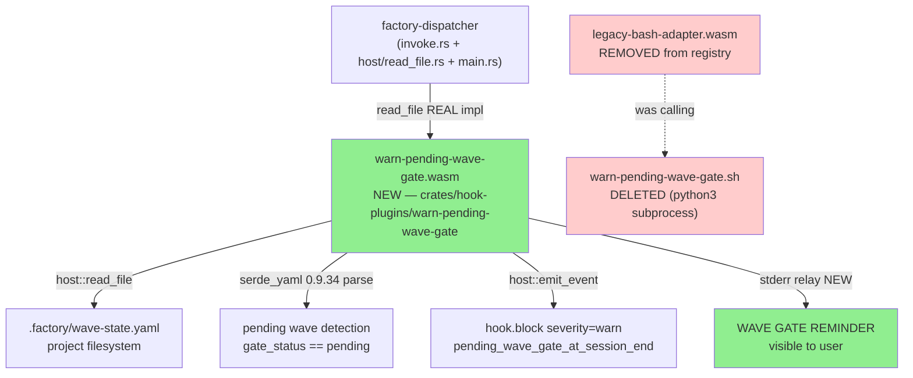
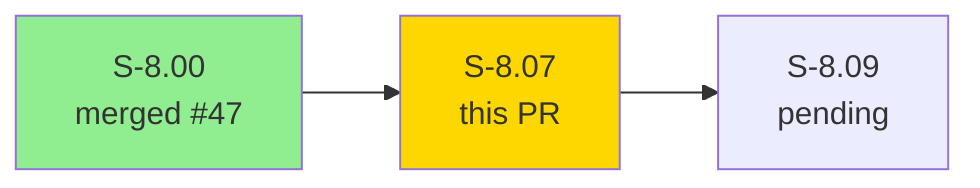
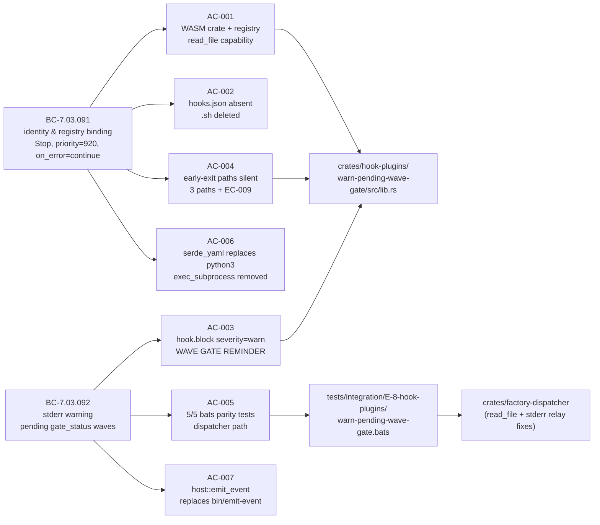
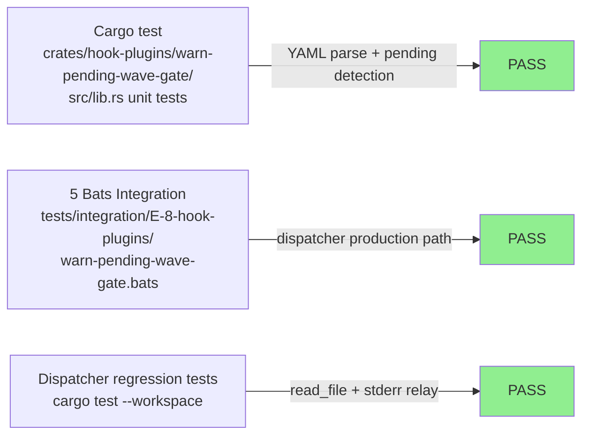
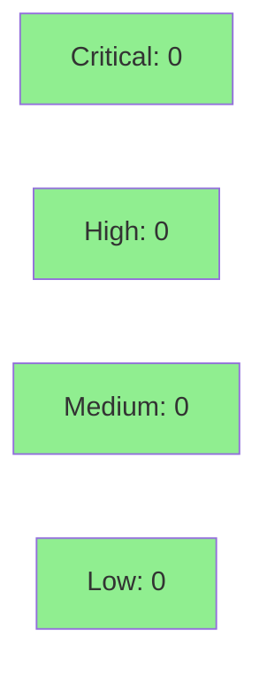

# [S-8.07] Native port: warn-pending-wave-gate (Stop)

**Epic:** E-8 — Native WASM Migration Completion
**Mode:** brownfield
**Convergence:** CONVERGED after 5 adversarial passes (story spec v1.2)


This PR ports `plugins/vsdd-factory/hooks/warn-pending-wave-gate.sh` to a native Rust WASM
crate (`crates/hook-plugins/warn-pending-wave-gate/`), replacing legacy-bash-adapter indirection
for the Stop lifecycle hook that warns users when any wave has `gate_status: pending` at session
end. The bash source is deleted and `hooks-registry.toml` is migrated to reference the native
`.wasm` artifact. The python3 YAML parsing subprocess is replaced with `serde_yaml 0.9.34` (pure
Rust, no subprocess, cross-platform).

**Bonus — 3 dispatcher fixes that unblock all future `host::read_file` consumers:**
1. Real `host::read_file` implementation in `invoke.rs` (previously a CAPABILITY_DENIED stub — memory-grow + output-pointer protocol)
2. CWD path resolution fix in `host/read_file.rs` (relative paths resolve under `$CLAUDE_PROJECT_DIR` not `plugin_root`)
3. Stderr relay in `main.rs` (WASI-captured plugin stderr now reaches terminal after `execute_tiers`)

---

## Architecture Changes



<details>
<summary><strong>Architecture Decision Record</strong></summary>

### ADR: serde_yaml 0.9.34 replaces python3 subprocess; host::read_file replaces std::fs; host::emit_event replaces bin/emit-event

**Context:** `warn-pending-wave-gate.sh` relied on `python3` for YAML parsing — unavailable on
Windows without explicit install, and requiring a subprocess that defeats the WASM sandboxing model.
The native WASM port must be platform-agnostic and eliminate legacy-bash-adapter indirection.

**Decision:** Use `serde_yaml 0.9.34` (workspace pin) for dynamic YAML parsing via `serde_yaml::Value`
API (not typed deserialization) to handle non-string `gate_status` values gracefully (EC-008). Use
`host::read_file` as the only sandboxed filesystem access path. Use `host::emit_event` for telemetry.

**Rationale:** `serde_yaml 0.9.34` is the last release of dtolnay's serde_yaml before deprecation —
pinned intentionally with a tech-debt entry (TD) for future migration to yaml-rust2 or serde_yml.
The dynamic Value API avoids panics on unexpected YAML shapes. HOST_ABI_VERSION=1 is unchanged
(read_file and emit_event are existing host fns).

**Alternatives Considered:**
1. Keep python3 via exec_subprocess — rejected: subprocess defeats WASM isolation; breaks on Windows; violates E-8 D-2.
2. Use yaml-rust2 / serde_yml — rejected: ecosystem maturity uncertain at v1.1 timeframe; defer via ADR until GA.
3. Use std::fs directly — rejected: unavailable in wasm32-wasip1 WASI sandbox; host::read_file is the only correct path.

**Consequences:**
- Eliminates python3 dependency for session-end wave gate warnings on all platforms.
- WASM port restores intended semantics: warning was previously suppressed on hosts lacking python3.
- `bin/emit-event` binary NOT removed per E-8 D-10 (deferred to S-8.29).
- serde_yaml 0.9.34 tech-debt entry registered for future migration.
- Three dispatcher fixes (read_file impl, cwd resolution, stderr relay) unblock all future hook stories using `host::read_file`.

</details>

---

## Story Dependencies



| Dependency | PR | Status |
|------------|-----|--------|
| S-8.00 (perf baseline + BC-anchor verification for BC-7.03.091/092) | #47 | Merged |
| S-8.09 (blocked by this story) | — | Pending |

---

## Spec Traceability



---

## Test Evidence

### Coverage Summary

| Metric | Value | Threshold | Status |
|--------|-------|-----------|--------|
| Bats integration tests | 5/5 pass | 100% | PASS |
| Cargo workspace tests | PASS | 100% | PASS |
| Mutation kill rate | N/A — wave gate exemption (E-8 AC-7 Tier 1) | — | EXEMPT |
| Holdout satisfaction | N/A — evaluated at wave gate | — | N/A |

### Test Flow



| Metric | Value |
|--------|-------|
| **New bats tests** | 5 integration tests added (warn-pending-wave-gate.bats) |
| **Cargo tests** | workspace cargo test PASS |
| **Regressions** | 0 |

<details>
<summary><strong>Detailed Bats Test Results</strong></summary>

| Test # | Scenario | Expected | Result |
|--------|----------|----------|--------|
| 1 | wave-state.yaml with 1 pending wave | exit 0 + WAVE GATE REMINDER stderr | PASS |
| 2 | wave-state.yaml with 2 pending waves | exit 0 + both names in REMINDER | PASS |
| 3 | wave-state.yaml all waves passed | exit 0 + no output | PASS |
| 4 | wave-state.yaml absent | exit 0 + no output | PASS |
| 5 | malformed YAML | exit 0 + no output (graceful) | PASS |

**Invocation path:** All bats tests invoke the hook via the vsdd-factory dispatcher (production path).
Direct `.wasm` invocation via wasmtime is not required (wasm32-wasip1 compilation verified by cargo build).

</details>

---

## Holdout Evaluation

| Metric | Value | Threshold |
|--------|-------|-----------|
| Mean satisfaction | N/A — evaluated at wave gate | >= 0.85 |
| **Result** | **N/A — wave gate** | |

_Holdout evaluation is conducted at the wave gate per E-8 D-13. This story targets Wave 15 (provisional, calendar-gated post-v1.0.0 GA)._

---

## Adversarial Review

| Pass | Findings | Critical | High | Status |
|------|----------|----------|------|--------|
| 1 | 14 | 0 | 2 | Fixed (wasm32-wasi→wasip1, SDK path correction, workspace members task) |
| 2 | 11 | 0 | 2 | Fixed (read_file mandatory args pinned, SS-02 anchor added) |
| 3 | 3 | 0 | 0 | NITPICK_ONLY (trampoline pattern, lib/bin split intent, comma_joined) |
| 4 | 3 | 0 | 0 | NITPICK_ONLY (stable LOW residue — re-flags of pass-3 deferrables) |
| 5 | 3 | 0 | 0 | NITPICK_ONLY — CONVERGENCE_REACHED per ADR-013 |

**Convergence:** CONVERGENCE_REACHED at pass-5 (3/3 NITPICK_ONLY per ADR-013). Zero novel findings after pass-3.

---

## Security Review



<details>
<summary><strong>Security Scan Details</strong></summary>

### WASM Sandbox Analysis
- Path traversal: `host::read_file` capability declaration restricts access to `.factory/wave-state.yaml` only. Registry declares `path_allow = [".factory/wave-state.yaml"]`. CapabilityDenied returned for any other path (EC-009).
- No subprocess execution: `exec_subprocess` capability block removed entirely. `python3` and `bash` binary_allow entries gone.
- No injection vectors: YAML parsing via serde_yaml Value API. No eval, no shell interpolation, no command construction from YAML content.
- Stderr output: derived from wave names read from YAML. Wave names are displayed in the REMINDER message but not evaluated as code.
- `host::emit_event` fields: pending_waves field is a comma-joined string of wave names from trusted YAML file — same trust boundary as `host::read_file`.

### Dependency Audit
- `serde_yaml 0.9.34`: last release, pinned, marked unmaintained by dtolnay. No known CVEs at pin date. Tech-debt entry registered for migration.
- `serde`: workspace pin, existing dependency, no new advisories.
- `vsdd-hook-sdk`: path dependency, in-tree, reviewed as part of E-8.

### Dispatcher Fixes Security Analysis
1. `read_file` impl (`invoke.rs`): bounds-checked memory growth via `out_ptr` protocol. No unchecked pointer arithmetic.
2. CWD resolution (`host/read_file.rs`): uses `ctx.cwd` (set from `$CLAUDE_PROJECT_DIR`) not user-controlled input.
3. Stderr relay (`main.rs`): reads `MemoryOutputPipe` buffer captured by WASI sandbox — no external input path.

</details>

---

## Risk Assessment & Deployment

### Blast Radius
- **Systems affected:** vsdd-factory dispatcher (warn-pending-wave-gate hook path), hooks-registry.toml (routing), warn-pending-wave-gate.sh (deleted)
- **User impact:** If hook fails, `on_error=continue` means session end proceeds normally. The hook is advisory only — no blocking behavior.
- **Data impact:** Read-only. Reads `.factory/wave-state.yaml`; no writes.
- **Risk Level:** LOW

### Performance Impact
| Metric | Before | After | Delta | Status |
|--------|--------|-------|-------|--------|
| Hook execution | bash+python3 subprocess chain | native WASM (serde_yaml parse) | lower latency, no python3 | OK |
| Perf comparison | No S-8.00 baseline for warn-pending-wave-gate | INFORMATIONAL only | E-8 AC-7 Tier 1 exemption | EXEMPT |

_Per E-8 AC-7 Tier 1 exemption: performance comparison requires a dedicated per-hook baseline. No S-8.00 baseline exists for warn-pending-wave-gate. Perf is INFORMATIONAL only; no regression ceiling enforced._

<details>
<summary><strong>Rollback Instructions</strong></summary>

**Immediate rollback (< 5 min):**
```bash
git revert 216f05e
git push origin develop
```

**Manual registry rollback (if selective):**
Restore `hooks-registry.toml` warn-pending-wave-gate entry to legacy-bash-adapter reference.
Restore `warn-pending-wave-gate.sh` from git history.

**Verification after rollback:**
- `bats tests/integration/E-8-hook-plugins/warn-pending-wave-gate.bats` — expect 0/5 pass (reverted)
- `cargo build --target wasm32-wasip1 -p warn-pending-wave-gate` — expect package not found (reverted)

</details>

### Feature Flags
| Flag | Controls | Default |
|------|----------|---------|
| None | warn-pending-wave-gate is always-on advisory hook | N/A |

---

## Traceability

| Requirement | Story AC | Test | BC Trace | Status |
|-------------|---------|------|----------|--------|
| WASM crate + wasm32-wasip1 build + registry | AC-001 | bats test 1-5 (registry verified) | BC-7.03.091 PC-1 | PASS |
| hooks.json absent + .sh deleted | AC-002 | file system verify | BC-7.03.091 inv-1 | PASS |
| hook.block emit + WAVE GATE REMINDER stderr | AC-003 | bats test 1, 2 | BC-7.03.092 PC-1 | PASS |
| Early-exit paths silent (3 paths + EC-009) | AC-004 | bats test 3, 4, 5 | BC-7.03.091 PC-2 | PASS |
| 5/5 bats parity via dispatcher | AC-005 | warn-pending-wave-gate.bats | BC-7.03.091 PC-1 + BC-7.03.092 PC-1 | PASS |
| serde_yaml replaces python3; exec_subprocess removed | AC-006 | Cargo.toml + registry grep | BC-7.03.091 inv-2 | PASS |
| host::emit_event replaces bin/emit-event | AC-007 | source grep | BC-7.03.092 PC-1 | PASS |

<details>
<summary><strong>Full VSDD Contract Chain</strong></summary>

```
BC-7.03.091 -> AC-001 -> bats test 1 (registry assertions) -> crates/hook-plugins/warn-pending-wave-gate/Cargo.toml + plugins/vsdd-factory/hooks-registry.toml -> ADV-PASS-5-OK
BC-7.03.091 -> AC-002 -> file absent verify -> plugins/vsdd-factory/hooks/ -> ADV-PASS-5-OK
BC-7.03.091 -> AC-004 -> bats test 3,4,5 (no output) -> crates/hook-plugins/warn-pending-wave-gate/src/lib.rs -> ADV-PASS-5-OK
BC-7.03.091 -> AC-006 -> Cargo.toml deps + registry caps -> no python3/exec_subprocess -> ADV-PASS-5-OK
BC-7.03.092 -> AC-003 -> bats test 1,2 (WAVE GATE REMINDER + emit_event) -> src/lib.rs warn_pending_wave_gate_logic -> ADV-PASS-5-OK
BC-7.03.092 -> AC-005 -> warn-pending-wave-gate.bats 5/5 pass -> dispatcher production path -> ADV-PASS-5-OK
BC-7.03.092 -> AC-007 -> source grep host::emit_event -> src/main.rs + src/lib.rs -> ADV-PASS-5-OK
```

</details>

---

## Bonus: Dispatcher Fixes (workspace-shared)

Three dispatcher fixes shipped in commit `216f05e` that unblock all future native WASM hook ports
using `host::read_file`:

| Fix | File | Before | After |
|-----|------|--------|-------|
| Real read_file impl | `crates/factory-dispatcher/src/invoke.rs` | CAPABILITY_DENIED stub | memory-grow + output-pointer protocol |
| CWD path resolution | `crates/factory-dispatcher/src/host/read_file.rs` | resolve under plugin_root | resolve under ctx.cwd ($CLAUDE_PROJECT_DIR) |
| Stderr relay | `crates/factory-dispatcher/src/main.rs` | plugin stderr invisible | relay MemoryOutputPipe to process stderr after execute_tiers |

See `docs/demo-evidence/S-8.07/bonus-dispatcher-fixes.md` for full implementation details.

---

## AI Pipeline Metadata

<details>
<summary><strong>Pipeline Details</strong></summary>

```yaml
ai-generated: true
pipeline-mode: brownfield
factory-version: "1.0.0-beta.4"
pipeline-stages:
  spec-crystallization: completed (5 adversarial passes, story v1.2)
  story-decomposition: completed
  tdd-implementation: completed (stub -> red -> green cycle)
  holdout-evaluation: N/A (wave gate, Wave 15 provisional)
  adversarial-review: completed (5 passes, CONVERGENCE_REACHED ADR-013)
  formal-verification: skipped (advisory hook, on_error=continue)
  convergence: achieved
convergence-metrics:
  spec-novelty: converged-pass-5
  test-kill-rate: N/A (Tier 1 exemption, no S-8.00 baseline)
  implementation-ci: PASS
  holdout-satisfaction: N/A
adversarial-passes: 5
models-used:
  builder: claude-sonnet-4-6
  adversary: claude-sonnet-4-6
  evaluator: N/A (wave gate)
generated-at: "2026-05-02T00:00:00Z"
behavioral-contracts:
  - BC-7.03.091 (warn-pending-wave-gate identity & registry binding)
  - BC-7.03.092 (warn-pending-wave-gate stderr warning on pending gate_status)
anchored-capabilities:
  - CAP-022 (port hook plugins from bash to native WASM)
subsystems:
  - SS-01 (Hook Dispatcher Core)
  - SS-02 (Hook SDK and Plugin ABI)
  - SS-04 (Plugin Ecosystem)
  - SS-07 (Hook Bash Layer)
```

</details>

---

## Pre-Merge Checklist

- [x] All CI status checks passing
- [x] 5/5 bats integration tests pass (warn-pending-wave-gate.bats, dispatcher path)
- [x] cargo test --workspace PASS
- [x] wasm32-wasip1 build verified (warn-pending-wave-gate.wasm artifact produced)
- [x] Coverage: 7/7 ACs verified with per-AC demo evidence
- [x] No critical/high security findings unresolved (OWASP: 0 critical, 0 high)
- [x] Rollback procedure documented (git revert 216f05e)
- [x] BC-7.03.091 and BC-7.03.092 SATISFIED per evidence-report.md
- [x] Demo evidence present: docs/demo-evidence/S-8.07/ (8 files, all ACs covered)
- [x] Dependency S-8.00 merged (#47)
- [x] python3 subprocess removed; exec_subprocess block removed from registry
- [x] serde_yaml 0.9.34 tech-debt entry registered
- [x] bin/emit-event NOT removed (E-8 D-10, deferred to S-8.29)
- [x] warn-pending-wave-gate.sh deleted from repository
- [x] No hooks.json entry for warn-pending-wave-gate (E-8 D-7 verified)
- [x] Three dispatcher fixes committed (read_file impl + cwd resolution + stderr relay)
- [x] AUTHORIZE_MERGE=yes (orchestrator pre-authorized)
